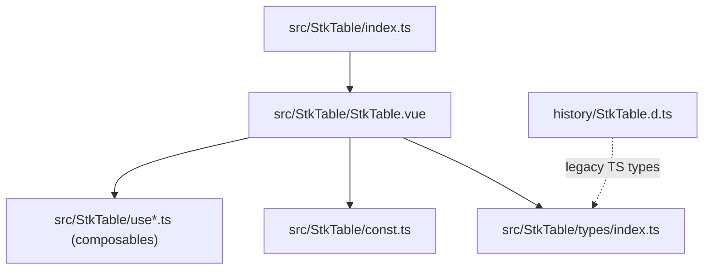
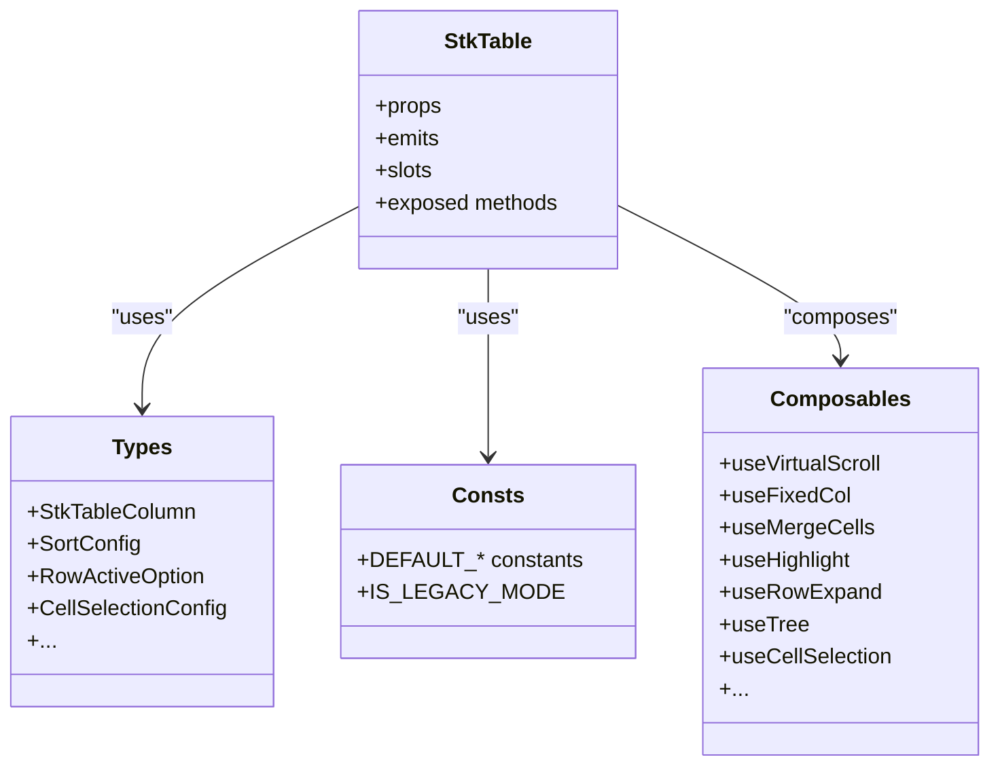
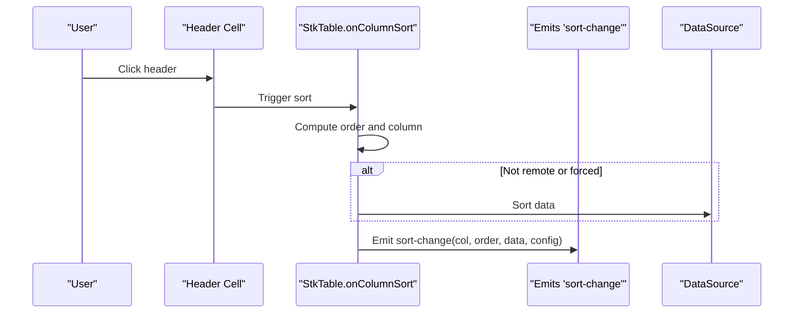
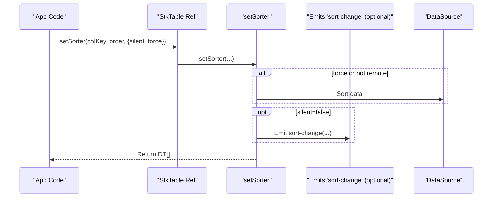
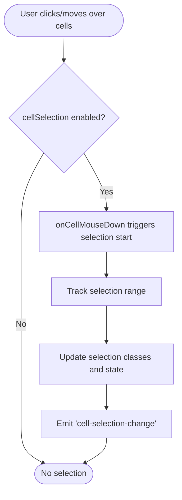
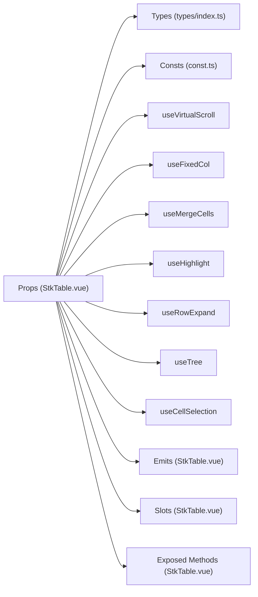

# API Reference

<cite>
**Referenced Files in This Document**
- [StkTable.vue](file://src/StkTable/StkTable.vue)
- [index.ts](file://src/StkTable/index.ts)
- [types/index.ts](file://src/StkTable/types/index.ts)
- [const.ts](file://src/StkTable/const.ts)
- [table-props.md](file://docs-src/main/api/table-props.md)
- [emits.md](file://docs-src/main/api/emits.md)
- [slots.md](file://docs-src/main/api/slots.md)
- [expose.md](file://docs-src/main/api/expose.md)
- [stk-table-column.md](file://docs-src/main/api/stk-table-column.md)
- [StkTable.d.ts](file://history/StkTable.d.ts)
</cite>

## Table of Contents
1. [Introduction](#introduction)
2. [Project Structure](#project-structure)
3. [Core Components](#core-components)
4. [Architecture Overview](#architecture-overview)
5. [Detailed Component Analysis](#detailed-component-analysis)
6. [Dependency Analysis](#dependency-analysis)
7. [Performance Considerations](#performance-considerations)
8. [Troubleshooting Guide](#troubleshooting-guide)
9. [Conclusion](#conclusion)
10. [Appendices](#appendices)

## Introduction
This document provides a comprehensive API reference for Stk Table Vue. It covers all public props, events, slots, and exposed methods with detailed descriptions, default values, data types, and usage guidance. It also includes TypeScript interface definitions and type information to help developers integrate and extend the component effectively.

## Project Structure
Stk Table Vue is organized around a single primary component with supporting types, constants, and composables. Public exports are centralized for easy consumption.

**Diagram sources**
- [StkTable.vue](file://src/StkTable/StkTable.vue#L209-L476)
- [index.ts](file://src/StkTable/index.ts#L1-L5)
- [types/index.ts](file://src/StkTable/types/index.ts#L1-L318)
- [const.ts](file://src/StkTable/const.ts#L1-L51)

**Section sources**
- [index.ts](file://src/StkTable/index.ts#L1-L5)

## Core Components
- StkTable: The main table component exposing props, events, slots, and methods via defineExpose.
- Types: Strongly typed interfaces for columns, configurations, and utilities.
- Constants: Defaults and browser compatibility constants used by the component.

**Section sources**
- [StkTable.vue](file://src/StkTable/StkTable.vue#L209-L476)
- [types/index.ts](file://src/StkTable/types/index.ts#L1-L318)
- [const.ts](file://src/StkTable/const.ts#L1-L51)

## Architecture Overview
The component uses a composition-based architecture with reactive props, computed derived state, and composable utilities for features like virtual scrolling, fixed columns, sorting, merging cells, and highlighting.

**Diagram sources**
- [StkTable.vue](file://src/StkTable/StkTable.vue#L209-L476)
- [types/index.ts](file://src/StkTable/types/index.ts#L54-L318)
- [const.ts](file://src/StkTable/const.ts#L1-L51)

## Detailed Component Analysis

### Props Reference
Below is a categorized summary of all public props with descriptions, types, defaults, and notes.

- Layout and Theme
  - width: string — Table width. Default: "".
  - minWidth: string — Deprecated. Use CSS selector .stk-table-main to set. Default: "".
  - maxWidth: string — Deprecated. Use CSS selector .stk-table-main to set. Default: "".
  - fixedMode: boolean — Use table-layout: fixed. Default: false.
  - headless: boolean — Hide header. Default: false.
  - theme: "light" | "dark" — Theme. Default: "light".
  - bordered: boolean | "h" | "v" | "body-v" | "body-h" — Border style. Default: true.
  - stripe: boolean — Zebra striping. Default: false.
  - cellFixedMode: "sticky" | "relative" — Fixed header/columns implementation. Default: "sticky". Legacy browsers force "relative".

- Dimensions and Overflow
  - rowHeight: number — Row height. When autoRowHeight is true, this is the estimated height for calculations. Default: constant.
  - autoRowHeight: boolean | AutoRowHeightConfig — Variable row height support. Default: false.
  - headerRowHeight: number | string | null — Header row height. Default: rowHeight.
  - showOverflow: boolean — Body cell overflow ellipsis. Default: false.
  - showHeaderOverflow: boolean — Header cell overflow ellipsis. Default: false.

- Virtualization
  - virtual: boolean — Enable vertical virtual scrolling. Default: false.
  - virtualX: boolean — Enable horizontal virtual scrolling (requires column widths). Default: false.

- Data and Keys
  - dataSource: DT[] — Table data. Default: [].
  - columns: StkTableColumn<DT>[] — Column definitions. Default: [].
  - rowKey: UniqKeyProp — Row key or function. Default: "".
  - colKey: UniqKeyProp — Column key or function. Default: undefined.

- Empty State
  - emptyCellText: string | ((option) => string) — Placeholder for empty cells. Default: "--".
  - showNoData: boolean — Show empty state. Default: true.
  - noDataFull: boolean — Empty state fills container. Default: false.

- Sorting
  - sortRemote: boolean — Server-side sorting flag. Default: false.
  - sortConfig: SortConfig<DT> — Sorting behavior. Default: constant.

- Selection and Hover
  - rowHover: boolean — Highlight hovered row. Default: true.
  - rowActive: boolean | RowActiveOption<DT> — Current row highlight. Default: constant.
  - rowCurrentRevokable: boolean — Allow toggling current row. Default: true.
  - showTrHoverClass: boolean — Add hover class to rows. Default: false.
  - cellHover: boolean — Highlight hovered cell. Default: false.
  - cellActive: boolean — Highlight selected cell. Default: false.
  - selectedCellRevokable: boolean — Toggle selected cell on re-click. Default: true.
  - cellSelection: boolean | CellSelectionConfig — Enable cell range selection. Default: false.

- Drag and Resize
  - headerDrag: boolean | HeaderDragConfig<DT> — Allow dragging headers. Default: false.
  - colResizable: boolean | ColResizableConfig<DT> — Enable column resizing. Default: false.
  - colMinWidth: number — Minimum column width. Default: 10.

- Styling and Behavior
  - rowClassName: (row, index) => string — Dynamic row class. Default: "".
  - hideHeaderTitle: boolean | string[] — Hide header titles by key. Default: false.
  - highlightConfig: HighlightConfig — Highlight animation timing. Default: {}.
  - seqConfig: SeqConfig — Sequence column start index. Default: {}.
  - expandConfig: ExpandConfig — Expanded row height. Default: {}.
  - dragRowConfig: DragRowConfig — Row drag mode. Default: {}.
  - treeConfig: TreeConfig — Tree defaults. Default: {}.
  - smoothScroll: boolean — Smooth wheel scrolling. Default: constant.
  - scrollRowByRow: boolean | "scrollbar" — Scroll by integer rows. Default: false.
  - scrollbar: boolean | ScrollbarOptions — Custom scrollbar. Default: false.
  - autoResize: boolean | (() => void) — Auto recalc virtual sizes. Default: true.
  - fixedColShadow: boolean — Show fixed column shadow. Default: false.
  - optimizeVue2Scroll: boolean — Optimize scroll for Vue 2. Default: false.

Notes:
- Many props accept complex nested configurations (e.g., sortConfig, rowActive, cellSelection). See dedicated sections below for full definitions.
- Some props are marked deprecated in comments or docs; prefer CSS selectors or alternative APIs where indicated.

**Section sources**
- [StkTable.vue](file://src/StkTable/StkTable.vue#L278-L476)
- [table-props.md](file://docs-src/main/api/table-props.md#L1-L220)
- [const.ts](file://src/StkTable/const.ts#L8-L50)

### Events Reference
The component emits a rich set of events for user interactions, scrolling, sorting, and internal state changes.

- sort-change: (col: StkTableColumn<DT> | null, order: Order, data: DT[], sortConfig: SortConfig<DT>) — Emitted on sort change.
- row-click: (ev: MouseEvent, row: DT, data: { rowIndex: number }) — Emitted on row click.
- current-change: (ev: MouseEvent | null, row: DT | undefined, data: { select: boolean }) — Emitted when current row changes.
- cell-selected: (ev: MouseEvent | null, data: { select: boolean; row: DT | undefined; col: StkTableColumn<DT> | undefined }) — Emitted when selected cell changes.
- row-dblclick: (ev: MouseEvent, row: DT, data: { rowIndex: number }) — Emitted on row double-click.
- header-row-menu: (ev: MouseEvent) — Emitted on header right-click.
- row-menu: (ev: MouseEvent, row: DT, data: { rowIndex: number }) — Emitted on body row right-click.
- cell-click: (ev: MouseEvent, row: DT, col: StkTableColumn<DT>, data: { rowIndex: number }) — Emitted on cell click.
- cell-mouseenter: (ev: MouseEvent, row: DT, col: StkTableColumn<DT>) — Emitted on cell mouse enter.
- cell-mouseleave: (ev: MouseEvent, row: DT, col: StkTableColumn<DT>) — Emitted on cell mouse leave.
- cell-mouseover: (ev: MouseEvent, row: DT, col: StkTableColumn<DT>) — Emitted on cell mouse over.
- cell-mousedown: (ev: MouseEvent, row: DT, col: StkTableColumn<DT>, data: { rowIndex: number }) — Emitted on cell mouse down.
- header-cell-click: (ev: MouseEvent, col: StkTableColumn<DT>) — Emitted on header cell click.
- scroll: (ev: Event, data: { startIndex: number; endIndex: number }) — Emitted during vertical scroll.
- scroll-x: (ev: Event) — Emitted during horizontal scroll.
- col-order-change: (dragStartKey: string, targetColKey: string) — Emitted when header order changes.
- th-drag-start: (dragStartKey: string) — Emitted when header drag starts.
- th-drop: (targetColKey: string) — Emitted when header is dropped.
- row-order-change: (dragStartKey: string, targetRowKey: string) — Emitted when row order changes.
- col-resize: (col: StkTableColumn<DT>) — Emitted when column width changes.
- toggle-row-expand: (data: { expanded: boolean; row: DT; col: StkTableColumn<DT> | null }) — Emitted when expand row toggles.
- toggle-tree-expand: (data: { expanded: boolean; row: DT; col: StkTableColumn<DT> | null }) — Emitted when tree node toggles.
- cell-selection-change: (range: CellSelectionRange | null, data: { rows: DT[]; cols: StkTableColumn<DT>[] }) — Emitted when cell selection changes.
- update:columns: (cols: StkTableColumn<DT>[]) — Emitted when columns are resized via v-model:columns.

**Section sources**
- [StkTable.vue](file://src/StkTable/StkTable.vue#L478-L621)
- [emits.md](file://docs-src/main/api/emits.md#L1-L148)

### Slots Reference
- tableHeader: { col } — Header slot for custom header rendering. Prefer customHeaderCell for per-column customization.
- empty: — Empty state slot.
- expand: { row, col } — Expandable row content slot.
- customBottom: — Bottom area slot.

Usage patterns:
- Use tableHeader for bulk header customization; otherwise configure customHeaderCell per column.
- Use expand to render detailed content for expanded rows.
- Use customBottom to place elements after the table (e.g., intersection observers).

**Section sources**
- [StkTable.vue](file://src/StkTable/StkTable.vue#L91-L94)
- [StkTable.vue](file://src/StkTable/StkTable.vue#L121-L123)
- [StkTable.vue](file://src/StkTable/StkTable.vue#L193)
- [StkTable.vue](file://src/StkTable/StkTable.vue#L195)
- [slots.md](file://docs-src/main/api/slots.md#L1-L21)

### Exposed Methods Reference
These methods are exposed via defineExpose and can be accessed through a template ref.

- initVirtualScroll(height?: number) — Recalculate virtual scroll X and Y. Useful after manual resizes.
- initVirtualScrollX() — Recalculate horizontal virtual columns.
- initVirtualScrollY(height?: number) — Recalculate vertical virtual rows.
- setCurrentRow(rowKeyOrRow: string | undefined | DT, option?: { silent?: boolean; deep?: boolean }) — Select a row by key or object.
- setSelectedCell(row?: DT, col?: StkTableColumn<DT>, option?: { silent?: boolean }) — Select a cell (requires cellActive).
- setHighlightDimCell(rowKeyValue: UniqKey, colKeyValue: string, option?: HighlightDimCellOption) — Highlight a cell dimly.
- setHighlightDimRow(rowKeyValues: UniqKey[], option?: HighlightDimRowOption) — Highlight rows dimly.
- sortCol: Ref<string> — Reactive reference to the sorted column key.
- getSortColumns(): { key: string; order: Order }[] — Get current sort state.
- setSorter(colKey: string, order: Order, option?: { sortOption?: SortOption<DT>; force?: boolean; silent?: boolean; sort?: boolean }): DT[] — Programmatically set sort state.
- resetSorter() — Clear sort state and restore original data order.
- scrollTo(top: number | null = 0, left: number | null = 0) — Scroll to absolute positions.
- getTableData(): DT[] — Get current visible data (sorted).
- setRowExpand(rowKeyOrRow: string | undefined | DT, expand?: boolean, data?: { col?: StkTableColumn<DT>; silent?: boolean }) — Expand/collapse a row.
- setAutoHeight(rowKey: UniqKey, height?: number | null) — Update auto height for a row (variable row height).
- clearAllAutoHeight() — Clear all saved auto heights.
- setTreeExpand(row: UniqKey | DT | (UniqKey | DT)[], option?: { expand?: boolean }) — Expand/collapse tree nodes.
- getSelectedCells(): { rows: DT[]; cols: StkTableColumn<DT>[]; range: CellSelectionRange } — Get current cell selection info.
- clearSelectedCells() — Clear cell selection.

Practical examples:
- To programmatically sort by a column: call setSorter with the column key and desired order; optionally pass force to override sortRemote.
- To scroll to a specific row: compute the target scrollTop and call scrollTo.
- To expand a row programmatically: call setRowExpand with the row key or object.

**Section sources**
- [StkTable.vue](file://src/StkTable/StkTable.vue#L1637-L1770)
- [expose.md](file://docs-src/main/api/expose.md#L1-L198)

### TypeScript Interfaces and Types
Key interfaces and types used by the component:

- StkTableColumn<T>
  - key?: any — Column key.
  - type?: "seq" | "expand" | "dragRow" | "tree-node" — Column type.
  - dataIndex: keyof T & string — Data field.
  - title?: string — Header title.
  - align?: "right" | "left" | "center" — Cell alignment.
  - headerAlign?: "right" | "left" | "center" — Header alignment.
  - sorter?: boolean | ((data: T[], option) => T[]) — Sorting function or flag.
  - width?: string | number — Column width.
  - minWidth?: string | number — Min width (non-X virtual).
  - maxWidth?: string | number — Max width (non-X virtual).
  - headerClassName?: string — Header class.
  - className?: string — Cell class.
  - sortField?: keyof T — Sort field override.
  - sortType?: "number" | "string" — Sort type.
  - sortConfig?: Omit<SortConfig<T>, "defaultSort"> — Per-column sort config.
  - fixed?: "left" | "right" | null — Fixed position.
  - customCell?: Component | string — Custom cell renderer.
  - customHeaderCell?: Component | string — Custom header renderer.
  - children?: StkTableColumn<T>[] — Nested headers.
  - mergeCells?: (data) => { rowspan?: number; colspan?: number } | undefined — Merge cells function.

- SortConfig<T>
  - defaultSort?: { key?: StkTableColumn<T>["key"]; dataIndex: StkTableColumn<T>["dataIndex"]; order: Order; sortField?: StkTableColumn<T>["sortField"]; sortType?: StkTableColumn<T>["sortType"]; sorter?: StkTableColumn<T>["sorter"]; silent?: boolean }
  - emptyToBottom?: boolean — Empty values sort to bottom.
  - stringLocaleCompare?: boolean — Use locale compare for strings.
  - sortChildren?: boolean — Sort children when sorting parent.

- RowActiveOption<T>
  - enabled?: boolean — Enable current row highlighting.
  - disabled?: (row: T) => boolean — Disable for specific rows.
  - revokable?: boolean — Allow toggling current row.

- CellSelectionConfig<T>
  - formatCellForClipboard?: (row: T, col: StkTableColumn<T>, rawValue: any) => string — Copy-to-clipboard formatter.

- HighlightConfig
  - duration?: number — Highlight duration in seconds.
  - fps?: number — Highlight frame rate.

- SeqConfig
  - startIndex?: number — Sequence start index.

- ExpandConfig
  - height?: number — Expanded row height (virtual mode).

- DragRowConfig
  - mode?: "none" | "insert" | "swap" — Drag mode.

- TreeConfig
  - defaultExpandAll?: boolean
  - defaultExpandKeys?: UniqKey[]
  - defaultExpandLevel?: number

- HeaderDragConfig<T>
  - mode?: "none" | "insert" | "swap"
  - disabled?: (col: StkTableColumn<T>) => boolean

- AutoRowHeightConfig<T>
  - expectedHeight?: number | ((row: T) => number)

- ColResizableConfig<T>
  - disabled?: (col: StkTableColumn<T>) => boolean

- CellSelectionRange
  - startRowIndex: number
  - startColIndex: number
  - endRowIndex: number
  - endColIndex: number

Legacy type (history):
- StkTableColumn<T> (from StkTable.d.ts) — Simplified legacy definition.

**Section sources**
- [types/index.ts](file://src/StkTable/types/index.ts#L54-L318)
- [StkTable.d.ts](file://history/StkTable.d.ts#L1-L18)

### Column Configuration Details
- Column types:
  - seq: Renders row numbers based on startIndex.
  - expand: Renders an expand control; use expand slot for content.
  - dragRow: Renders a drag handle; use row-order-change to persist order.
  - tree-node: Renders a tree node with fold/unfold controls.
- Sorting:
  - Configure sorter as boolean or function per column.
  - Override default sort behavior with sortConfig per column.
- Custom rendering:
  - Use customCell/customHeaderCell for advanced cell/header rendering.
- Merging:
  - Use mergeCells to dynamically compute rowspan/colspan.

**Section sources**
- [StkTable.vue](file://src/StkTable/StkTable.vue#L157-L171)
- [types/index.ts](file://src/StkTable/types/index.ts#L54-L120)
- [stk-table-column.md](file://docs-src/main/api/stk-table-column.md#L1-L137)

### API Workflows

#### Sorting Workflow

**Diagram sources**
- [StkTable.vue](file://src/StkTable/StkTable.vue#L1228-L1288)
- [StkTable.vue](file://src/StkTable/StkTable.vue#L478-L621)

#### Programmatic Sorting

**Diagram sources**
- [StkTable.vue](file://src/StkTable/StkTable.vue#L1591-L1603)
- [StkTable.vue](file://src/StkTable/StkTable.vue#L478-L621)

#### Cell Selection Workflow

**Diagram sources**
- [StkTable.vue](file://src/StkTable/StkTable.vue#L1386-L1393)
- [StkTable.vue](file://src/StkTable/StkTable.vue#L860-L860)

## Dependency Analysis
The component’s public API is defined by props, emits, slots, and exposed methods. Internal dependencies are managed via composables and shared types.

**Diagram sources**
- [StkTable.vue](file://src/StkTable/StkTable.vue#L209-L476)
- [types/index.ts](file://src/StkTable/types/index.ts#L1-L318)
- [const.ts](file://src/StkTable/const.ts#L1-L51)

**Section sources**
- [StkTable.vue](file://src/StkTable/StkTable.vue#L209-L476)

## Performance Considerations
- Virtual scrolling:
  - Enable virtual and virtualX for large datasets.
  - For virtualX, set column widths explicitly; otherwise performance degrades.
- Auto row height:
  - Use setAutoHeight or clearAllAutoHeight when dynamic content changes.
- Smooth scroll:
  - Adjust smoothScroll based on browser compatibility and UX needs.
- Custom scrollbar:
  - Enable scrollbar for better UX on small screens; tune width/height/min dimensions.
- Cell selection:
  - Use formatCellForClipboard to avoid expensive computations during copy.

[No sources needed since this section provides general guidance]

## Troubleshooting Guide
- Columns not updating:
  - Ensure you mutate the array reference (e.g., slice and reassign) since columns are shallow watched.
- Multi-level headers with virtualX:
  - Multi-level headers are not supported with horizontal virtualization; expect an error message.
- Empty state not showing:
  - Verify dataSource is an array and showNoData is true; customize empty slot as needed.
- Sorting not triggering:
  - For server-side sorting, set sortRemote to true; use setSorter with force to bypass remote behavior.
- Column resize not working:
  - Ensure colResizable is enabled and v-model:columns is bound; set width on each column and avoid min/max width conflicts.

**Section sources**
- [StkTable.vue](file://src/StkTable/StkTable.vue#L942-L967)
- [StkTable.vue](file://src/StkTable/StkTable.vue#L862-L873)
- [StkTable.vue](file://src/StkTable/StkTable.vue#L1228-L1288)

## Conclusion
Stk Table Vue offers a comprehensive, strongly typed API for building performant, feature-rich tables. By leveraging props for configuration, events for interactivity, slots for customization, and exposed methods for programmatic control, developers can implement complex scenarios efficiently. Use the provided TypeScript interfaces and configuration objects to maintain type safety and consistency across your application.

[No sources needed since this section summarizes without analyzing specific files]

## Appendices

### Quick Links to Related APIs
- Props: [table-props.md](file://docs-src/main/api/table-props.md#L1-L220)
- Events: [emits.md](file://docs-src/main/api/emits.md#L1-L148)
- Slots: [slots.md](file://docs-src/main/api/slots.md#L1-L21)
- Exposed Methods: [expose.md](file://docs-src/main/api/expose.md#L1-L198)
- Column Types: [stk-table-column.md](file://docs-src/main/api/stk-table-column.md#L1-L137)
- Legacy Types: [StkTable.d.ts](file://history/StkTable.d.ts#L1-L18)