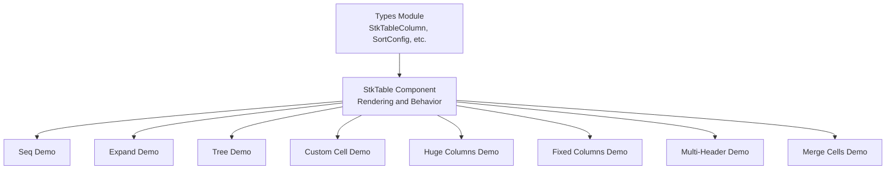
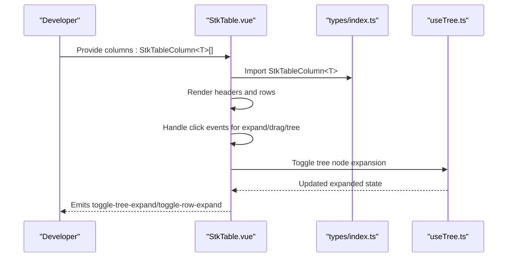
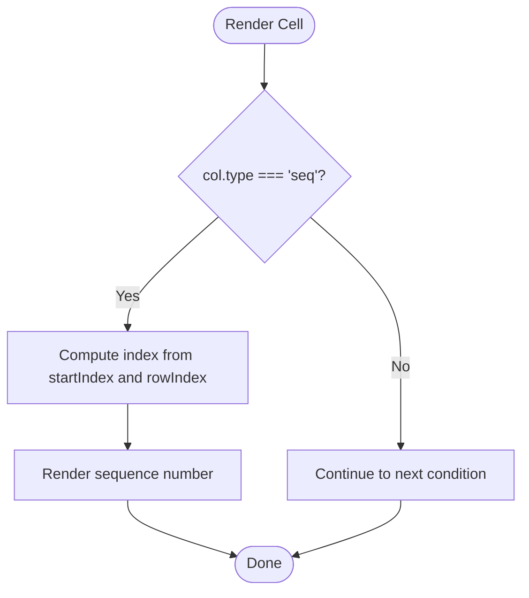
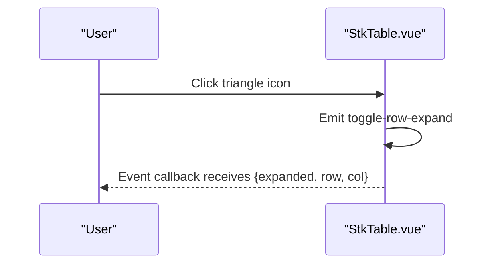
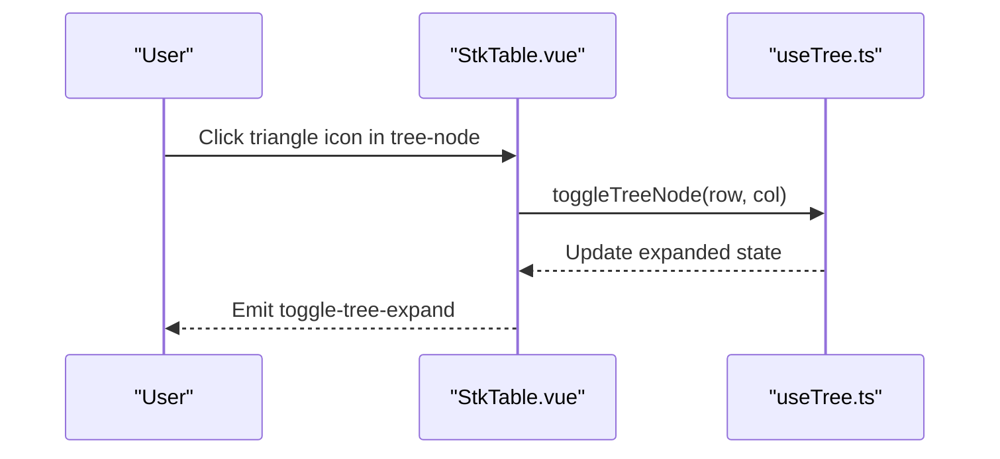
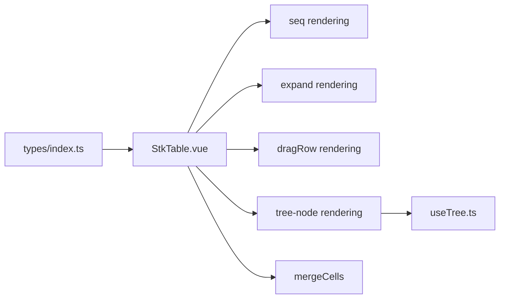

# Column Props

<cite>
**Referenced Files in This Document**
- [index.ts](file://src/StkTable/types/index.ts)
- [StkTable.vue](file://src/StkTable/StkTable.vue)
- [useTree.ts](file://src/StkTable/useTree.ts)
- [Seq.vue](file://docs-demo/basic/seq/Seq.vue)
- [ExpandRow.vue](file://docs-demo/basic/expand-row/ExpandRow.vue)
- [Tree.vue](file://docs-demo/basic/tree/Tree.vue)
- [config.ts](file://docs-demo/basic/tree/config.ts)
- [index.vue](file://docs-demo/advanced/custom-cell/CustomCell/index.vue)
- [columns.ts](file://docs-demo/demos/HugeData/columns.ts)
- [Fixed.vue](file://docs-demo/basic/fixed/Fixed.vue)
- [MultiHeader.vue](file://docs-demo/basic/multi-header/MultiHeader.vue)
- [MergeCellsRow.vue](file://docs-demo/basic/merge-cells/MergeCellsRow.vue)
</cite>

## Table of Contents
1. [Introduction](#introduction)
2. [Project Structure](#project-structure)
3. [Core Components](#core-components)
4. [Architecture Overview](#architecture-overview)
5. [Detailed Component Analysis](#detailed-component-analysis)
6. [Dependency Analysis](#dependency-analysis)
7. [Performance Considerations](#performance-considerations)
8. [Troubleshooting Guide](#troubleshooting-guide)
9. [Conclusion](#conclusion)
10. [Appendices](#appendices)

## Introduction
This document provides comprehensive documentation for the StkTableColumn configuration object used to define columns in StkTableVue. It covers all column-level properties, special column types (seq, expand, dragRow, tree-node), custom rendering via customCell and customHeaderCell, column merging, fixed positioning, and responsive behavior. It also includes TypeScript interface definitions and type safety guidance, along with practical examples drawn from the repository’s demos.

## Project Structure
The column configuration is defined in the shared types module and consumed by the StkTable component. Demos illustrate real-world usage patterns for various column features.

**Diagram sources**
- [index.ts](file://src/StkTable/types/index.ts#L54-L120)
- [StkTable.vue](file://src/StkTable/StkTable.vue#L135-L171)
- [Seq.vue](file://docs-demo/basic/seq/Seq.vue#L9-L15)
- [ExpandRow.vue](file://docs-demo/basic/expand-row/ExpandRow.vue#L13-L17)
- [Tree.vue](file://docs-demo/basic/tree/Tree.vue#L10-L15)
- [config.ts](file://docs-demo/basic/tree/config.ts#L3-L8)
- [index.vue](file://docs-demo/advanced/custom-cell/CustomCell/index.vue#L7-L10)
- [columns.ts](file://docs-demo/demos/HugeData/columns.ts#L8-L222)
- [Fixed.vue](file://docs-demo/basic/fixed/Fixed.vue#L12-L21)
- [MultiHeader.vue](file://docs-demo/basic/multi-header/MultiHeader.vue#L6-L56)
- [MergeCellsRow.vue](file://docs-demo/basic/merge-cells/MergeCellsRow.vue#L16-L38)

**Section sources**
- [index.ts](file://src/StkTable/types/index.ts#L54-L120)
- [StkTable.vue](file://src/StkTable/StkTable.vue#L135-L171)

## Core Components
- StkTableColumn<T>: The primary interface for column configuration, including data binding, display, alignment, sorting, custom rendering, merging, and fixed positioning.
- SortConfig<T>, SortOption<T>, SortState<T>: Supporting types for sorting behavior and state.
- CustomCell<TProps, TData>, CustomHeaderCellProps<T>: Types for custom cell/header rendering with prop contracts.
- MergeCellsFn<T>, MergeCellsParam<T>: Types for cell merging logic.
- Specialized configs: SeqConfig, ExpandConfig, DragRowConfig, TreeConfig, HeaderDragConfig, ColResizableConfig.

Key TypeScript interfaces and their roles:
- StkTableColumn<T>: Defines all column-level properties and behaviors.
- CustomCellProps<T>, CustomHeaderCellProps<T>: Prop contracts passed to customCell and customHeaderCell components.
- MergeCellsFn<T>: Function signature for merging cells across rows/columns.
- SortConfig<T>, SortOption<T>, SortState<T>: Sorting configuration and runtime state.

**Section sources**
- [index.ts](file://src/StkTable/types/index.ts#L54-L120)
- [index.ts](file://src/StkTable/types/index.ts#L8-L29)
- [index.ts](file://src/StkTable/types/index.ts#L31-L38)
- [index.ts](file://src/StkTable/types/index.ts#L175-L179)
- [index.ts](file://src/StkTable/types/index.ts#L185-L220)
- [index.ts](file://src/StkTable/types/index.ts#L235-L260)
- [index.ts](file://src/StkTable/types/index.ts#L262-L273)
- [index.ts](file://src/StkTable/types/index.ts#L280-L282)

## Architecture Overview
The StkTable component renders columns defined by StkTableColumn<T>. It supports:
- Rendering modes: normal, seq, expand, dragRow, tree-node.
- Custom cell/header rendering via component or render function.
- Merging cells via mergeCells.
- Fixed columns (left/right).
- Multi-level headers via children.
- Sorting via sorter and sortConfig.

**Diagram sources**
- [StkTable.vue](file://src/StkTable/StkTable.vue#L135-L171)
- [index.ts](file://src/StkTable/types/index.ts#L54-L120)
- [useTree.ts](file://src/StkTable/useTree.ts#L12-L70)

## Detailed Component Analysis

### StkTableColumn<T> Properties
- key?: Unique identifier for the column; defaults to dataIndex if not provided.
- type?: 'seq' | 'expand' | 'dragRow' | 'tree-node'
- dataIndex: keyof T & string; source field in row data.
- title?: string; header label.
- align?: 'right' | 'left' | 'center'; cell content alignment.
- headerAlign?: 'right' | 'left' | 'center'; header content alignment.
- sorter?: Sorter<T>; enables sorting; can be boolean or comparator function.
- width?: string | number; column width; required for horizontal virtual scrolling.
- minWidth?: string | number; minimum width (non-virtual X).
- maxWidth?: string | number; maximum width (non-virtual X).
- headerClassName?: string; CSS class for header cell.
- className?: string; CSS class for data cells.
- sortField?: keyof T; alternate field for sorting.
- sortType?: 'number' | 'string'; sorting comparison type.
- sortConfig?: Omit<SortConfig<T>, 'defaultSort'>; per-column sort behavior.
- fixed?: 'left' | 'right' | null; fixed position.
- customCell?: CustomCell<CustomCellProps<T>, T>; custom cell renderer.
- customHeaderCell?: CustomCell<CustomHeaderCellProps<T>, T>; custom header renderer.
- children?: StkTableColumn<T>[]; multi-level headers.
- mergeCells?: MergeCellsFn<T>; merges cells across rows/columns.

Type safety highlights:
- Strongly typed data access via dataIndex and generic T.
- Sorter<T> accepts a comparator function with order and column context.
- CustomCell accepts either a component type or render function with a specific prop contract.

**Section sources**
- [index.ts](file://src/StkTable/types/index.ts#L54-L120)
- [index.ts](file://src/StkTable/types/index.ts#L6-L6)
- [index.ts](file://src/StkTable/types/index.ts#L49-L52)

### Special Column Types

#### seq (Sequence Number)
- Purpose: Renders a row index column.
- Behavior: Uses props.seqConfig.startIndex for base index; rendered without customCell.
- Example usage: See the seq demo.

**Diagram sources**
- [StkTable.vue](file://src/StkTable/StkTable.vue#L157-L159)
- [Seq.vue](file://docs-demo/basic/seq/Seq.vue#L9-L15)

**Section sources**
- [index.ts](file://src/StkTable/types/index.ts#L54-L120)
- [StkTable.vue](file://src/StkTable/StkTable.vue#L157-L159)
- [Seq.vue](file://docs-demo/basic/seq/Seq.vue#L9-L15)

#### expand (Expandable Row)
- Purpose: Adds an expand/collapse indicator in the first cell of expanded rows.
- Behavior: Emits toggle-row-expand; supports fixed left/right; optional expandConfig.height for virtual mode.
- Example usage: See the expand demo.

**Diagram sources**
- [StkTable.vue](file://src/StkTable/StkTable.vue#L169-L169)
- [ExpandRow.vue](file://docs-demo/basic/expand-row/ExpandRow.vue#L27-L29)

**Section sources**
- [index.ts](file://src/StkTable/types/index.ts#L54-L120)
- [StkTable.vue](file://src/StkTable/StkTable.vue#L169-L169)
- [ExpandRow.vue](file://docs-demo/basic/expand-row/ExpandRow.vue#L13-L17)

#### dragRow (Drag-to-Reorder Rows)
- Purpose: Provides a drag handle to reorder rows.
- Behavior: Emits row-order-change; integrates with row drag utilities.
- Example usage: See the huge data demo where customCell selects different components for children vs parents.

**Section sources**
- [index.ts](file://src/StkTable/types/index.ts#L54-L120)
- [columns.ts](file://docs-demo/demos/HugeData/columns.ts#L19-L24)

#### tree-node (Tree Node Column)
- Purpose: Renders a tree node with expand/collapse controls and indentation.
- Behavior: Uses TreeNodeCell; toggles via toggleTreeNode; supports default expand options via treeConfig.
- Example usage: See the tree demo and tree config.

**Diagram sources**
- [StkTable.vue](file://src/StkTable/StkTable.vue#L160-L166)
- [useTree.ts](file://src/StkTable/useTree.ts#L12-L70)
- [Tree.vue](file://docs-demo/basic/tree/Tree.vue#L5-L7)
- [config.ts](file://docs-demo/basic/tree/config.ts#L3-L8)

**Section sources**
- [index.ts](file://src/StkTable/types/index.ts#L54-L120)
- [StkTable.vue](file://src/StkTable/StkTable.vue#L160-L166)
- [useTree.ts](file://src/StkTable/useTree.ts#L12-L70)
- [Tree.vue](file://docs-demo/basic/tree/Tree.vue#L1-L17)
- [config.ts](file://docs-demo/basic/tree/config.ts#L1-L113)

### Custom Rendering: customCell and customHeaderCell
- customCell: Accepts a component or render function receiving CustomCellProps<T>.
- customHeaderCell: Accepts a component or render function receiving CustomHeaderCellProps<T>.
- Props include row, col, cellValue, rowIndex, colIndex, and contextual flags like expanded and treeExpanded.

Integration patterns:
- Define a component that consumes the provided props.
- Use render functions for lightweight inline rendering.
- Pass components directly or use dynamic h() to choose different components per row.

Examples:
- Custom cell component for yield rates.
- Conditional customCell selection based on row metadata.

**Section sources**
- [index.ts](file://src/StkTable/types/index.ts#L8-L29)
- [index.ts](file://src/StkTable/types/index.ts#L49-L52)
- [index.vue](file://docs-demo/advanced/custom-cell/CustomCell/index.vue#L7-L10)
- [columns.ts](file://docs-demo/demos/HugeData/columns.ts#L19-L24)

### Column Merging
- mergeCells: Function of type MergeCellsFn<T> returns { rowspan?, colspan? } to merge adjacent cells.
- Supports dynamic merging based on row data.
- Works with cell hover/selection utilities.

Example:
- Merge cells for continent/country rows and adjust spans dynamically.

**Section sources**
- [index.ts](file://src/StkTable/types/index.ts#L31-L38)
- [MergeCellsRow.vue](file://docs-demo/basic/merge-cells/MergeCellsRow.vue#L16-L38)

### Fixed Positioning
- fixed: 'left' | 'right' | null; pins columns to edges.
- Works with fixed-mode and sticky/relative fixed modes.
- Can be combined with width and minWidth/maxWidth.

Example:
- Left/right fixed columns with defined widths.

**Section sources**
- [index.ts](file://src/StkTable/types/index.ts#L94-L95)
- [Fixed.vue](file://docs-demo/basic/fixed/Fixed.vue#L12-L21)

### Responsive Behavior and Multi-Level Headers
- children: Nested column definitions enable multi-level headers.
- minWidth/maxWidth/width control layout across viewport changes.
- MultiHeader demo shows nested headers with varying widths.

**Section sources**
- [index.ts](file://src/StkTable/types/index.ts#L117-L117)
- [MultiHeader.vue](file://docs-demo/basic/multi-header/MultiHeader.vue#L6-L56)

### Sorting Options
- sorter: Enable sorting; can be boolean or comparator.
- sortField, sortType: Customize sort key and comparison type.
- sortConfig: Configure default sort, empty-to-bottom behavior, locale compare, and sortChildren.
- Events: sort-change emitted with col, order, data, and sortConfig.

**Section sources**
- [index.ts](file://src/StkTable/types/index.ts#L6-L6)
- [index.ts](file://src/StkTable/types/index.ts#L88-L93)
- [index.ts](file://src/StkTable/types/index.ts#L185-L220)
- [StkTable.vue](file://src/StkTable/StkTable.vue#L478-L621)

### Comprehensive Examples by Use Case

- Sequence column with virtual scrolling:
  - Reference: [Seq.vue](file://docs-demo/basic/seq/Seq.vue#L9-L15)

- Expandable rows with fixed left column:
  - Reference: [ExpandRow.vue](file://docs-demo/basic/expand-row/ExpandRow.vue#L13-L17)

- Tree node column with nested data:
  - Reference: [Tree.vue](file://docs-demo/basic/tree/Tree.vue#L10-L15), [config.ts](file://docs-demo/basic/tree/config.ts#L3-L8)

- Custom cell rendering with a dedicated component:
  - Reference: [index.vue](file://docs-demo/advanced/custom-cell/CustomCell/index.vue#L7-L10)

- Large dataset with mixed custom cells and fixed columns:
  - Reference: [columns.ts](file://docs-demo/demos/HugeData/columns.ts#L8-L222)

- Fixed columns with shadows and responsive widths:
  - Reference: [Fixed.vue](file://docs-demo/basic/fixed/Fixed.vue#L12-L21)

- Multi-level headers:
  - Reference: [MultiHeader.vue](file://docs-demo/basic/multi-header/MultiHeader.vue#L6-L56)

- Merging cells across rows:
  - Reference: [MergeCellsRow.vue](file://docs-demo/basic/merge-cells/MergeCellsRow.vue#L16-L38)

## Dependency Analysis
- StkTableColumn<T> is consumed by StkTable.vue for rendering headers and cells.
- Special column types rely on internal components and utilities:
  - seq: pure numeric rendering.
  - expand: emits row expand events.
  - dragRow: integrates with row drag utilities.
  - tree-node: integrates with useTree for expand/collapse.
- Custom rendering depends on CustomCell/CustomHeaderCell contracts.
- Merging depends on useMergeCells utilities.

**Diagram sources**
- [index.ts](file://src/StkTable/types/index.ts#L54-L120)
- [StkTable.vue](file://src/StkTable/StkTable.vue#L135-L171)
- [useTree.ts](file://src/StkTable/useTree.ts#L12-L70)

**Section sources**
- [index.ts](file://src/StkTable/types/index.ts#L54-L120)
- [StkTable.vue](file://src/StkTable/StkTable.vue#L135-L171)
- [useTree.ts](file://src/StkTable/useTree.ts#L12-L70)

## Performance Considerations
- Horizontal virtual scrolling requires explicit width on columns.
- Fixed columns and multi-level headers increase DOM complexity; use judiciously.
- CustomCell components should avoid heavy computations; memoize where appropriate.
- mergeCells can impact rendering cost; keep merge logic efficient.
- Tree expansion modifies data arrays; batch updates and avoid unnecessary re-renders.

## Troubleshooting Guide
Common issues and resolutions:
- Sorting not working:
  - Ensure sorter is set and sortField/sortType are correct.
  - Verify sortRemote if server-side sorting is intended.
- Expand row not visible:
  - Confirm expandConfig.height is set for virtual mode.
  - Ensure slot #expand is provided with the template.
- Tree node not expanding:
  - Check treeConfig default options and data hierarchy.
  - Ensure toggle-tree-expand handler exists.
- Custom cell not rendering:
  - Verify customCell component accepts the correct props.
  - Ensure component registration or render function is valid.
- Fixed column misalignment:
  - Provide consistent widths and minWidth/maxWidth.
  - Test with fixed-mode and sticky/relative fixed modes.

**Section sources**
- [index.ts](file://src/StkTable/types/index.ts#L88-L93)
- [index.ts](file://src/StkTable/types/index.ts#L185-L220)
- [ExpandRow.vue](file://docs-demo/basic/expand-row/ExpandRow.vue#L40-L46)
- [Tree.vue](file://docs-demo/basic/tree/Tree.vue#L5-L7)
- [index.vue](file://docs-demo/advanced/custom-cell/CustomCell/index.vue#L7-L10)
- [Fixed.vue](file://docs-demo/basic/fixed/Fixed.vue#L12-L21)

## Conclusion
StkTableColumn<T> offers a robust, type-safe way to configure table columns with extensive capabilities for rendering, sorting, merging, and responsive layouts. By leveraging the provided TypeScript interfaces and following the demonstrated patterns, developers can build flexible, performant tables tailored to diverse use cases.

## Appendices

### TypeScript Interfaces Summary
- StkTableColumn<T>: Core column configuration interface.
- CustomCellProps<T>, CustomHeaderCellProps<T>: Prop contracts for custom rendering.
- MergeCellsFn<T>, MergeCellsParam<T>: Function signatures for cell merging.
- SortConfig<T>, SortOption<T>, SortState<T>: Sorting configuration and runtime state.
- Specialized configs: SeqConfig, ExpandConfig, DragRowConfig, TreeConfig, HeaderDragConfig, ColResizableConfig.

**Section sources**
- [index.ts](file://src/StkTable/types/index.ts#L54-L120)
- [index.ts](file://src/StkTable/types/index.ts#L8-L29)
- [index.ts](file://src/StkTable/types/index.ts#L31-L38)
- [index.ts](file://src/StkTable/types/index.ts#L175-L179)
- [index.ts](file://src/StkTable/types/index.ts#L185-L220)
- [index.ts](file://src/StkTable/types/index.ts#L235-L260)
- [index.ts](file://src/StkTable/types/index.ts#L262-L273)
- [index.ts](file://src/StkTable/types/index.ts#L280-L282)