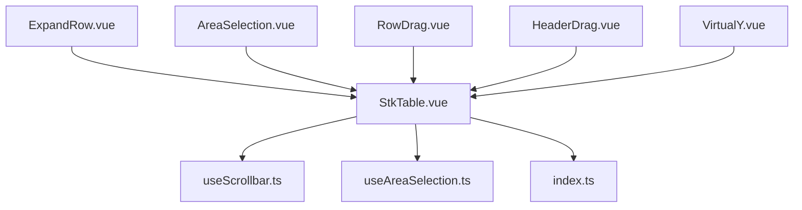
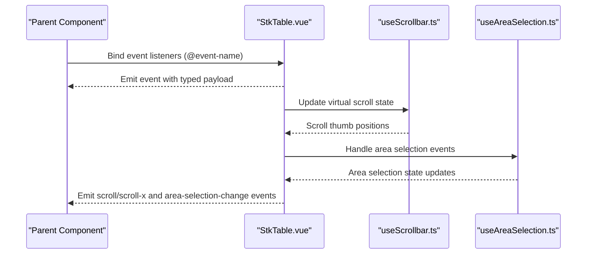
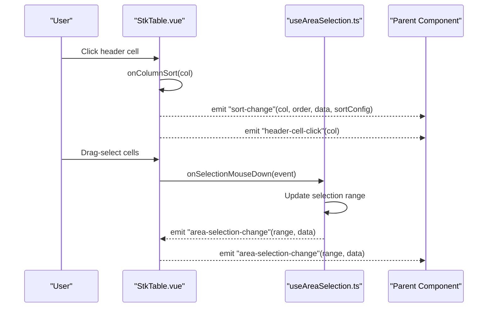
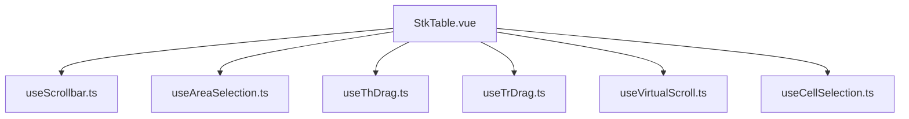

# Events

<cite>
**Referenced Files in This Document**
- [StkTable.vue](file://src/StkTable/StkTable.vue)
- [emits.md](file://docs-src/en/main/api/emits.md)
- [emits.md](file://docs-src/main/api/emits.md)
- [index.ts](file://src/StkTable/index.ts)
- [useScrollbar.ts](file://src/StkTable/useScrollbar.ts)
- [useAreaSelection.ts](file://src/StkTable/useAreaSelection.ts)
- [ExpandRow.vue](file://docs-demo/basic/expand-row/ExpandRow.vue)
- [AreaSelection.vue](file://docs-demo/advanced/area-selection/AreaSelection.vue)
- [RowDrag.vue](file://docs-demo/advanced/row-drag/RowDrag.vue)
- [HeaderDrag.vue](file://docs-demo/advanced/header-drag/HeaderDrag.vue)
- [VirtualY.vue](file://docs-demo/advanced/virtual/VirtualY.vue)
- [types.ts](file://src/StkTable/types/index.ts)
</cite>

## Update Summary
**Changes Made**
- Enhanced event documentation with improved formatting and standardized TypeScript signatures
- Comprehensive coverage of the area-selection-change event with detailed implementation
- Updated documentation structure for better clarity and consistency across all 15 documented events
- Added detailed TypeScript signature examples and parameter descriptions
- Improved event categorization and usage scenarios documentation

## Table of Contents
1. [Introduction](#introduction)
2. [Project Structure](#project-structure)
3. [Core Components](#core-components)
4. [Architecture Overview](#architecture-overview)
5. [Detailed Component Analysis](#detailed-component-analysis)
6. [Dependency Analysis](#dependency-analysis)
7. [Performance Considerations](#performance-considerations)
8. [Troubleshooting Guide](#troubleshooting-guide)
9. [Conclusion](#conclusion)

## Introduction
This document provides comprehensive event documentation for the StkTable component. It catalogs all emitted events, their parameters, callback signatures, and practical usage scenarios. It covers user interaction events (row-click, cell-click, sort-change, selection-changed), data manipulation events (row-expand, row-collapse, drag-drop), virtual scrolling events, and performance-related events. It also explains event timing, propagation behavior, and integration patterns with parent components, along with event-driven data flow and state management approaches.

**Updated** Enhanced with standardized TypeScript signatures and comprehensive coverage of the area-selection-change event for drag-select functionality.

## Project Structure
The StkTable component is implemented as a Vue 3 Single File Component with TypeScript. It defines its emitted events via defineEmits and exposes a rich set of event handlers for user interactions, sorting, selection, dragging, and virtual scrolling. Demos illustrate real-world usage patterns for expandable rows, drag-selection, row/column drag, and virtual scrolling.

**Diagram sources**
- [StkTable.vue](file://src/StkTable/StkTable.vue#L478-L621)
- [useScrollbar.ts](file://src/StkTable/useScrollbar.ts#L83-L144)
- [useAreaSelection.ts](file://src/StkTable/useAreaSelection.ts#L42-L51)
- [index.ts](file://src/StkTable/index.ts#L1-L5)
- [ExpandRow.vue](file://docs-demo/basic/expand-row/ExpandRow.vue#L27-L46)
- [AreaSelection.vue](file://docs-demo/advanced/area-selection/AreaSelection.vue#L1-L62)
- [RowDrag.vue](file://docs-demo/advanced/row-drag/RowDrag.vue#L41-L50)
- [HeaderDrag.vue](file://docs-demo/advanced/header-drag/HeaderDrag.vue#L30-L37)
- [VirtualY.vue](file://docs-demo/advanced/virtual/VirtualY.vue#L31-L33)

**Section sources**
- [StkTable.vue](file://src/StkTable/StkTable.vue#L478-L621)
- [index.ts](file://src/StkTable/index.ts#L1-L5)

## Core Components
- StkTable.vue: Defines all emitted events and implements handlers for row/cell interactions, sorting, selection, drag-and-drop, and virtual scrolling.
- useScrollbar.ts: Manages custom scrollbar behavior and emits scroll-related events.
- useAreaSelection.ts: Implements comprehensive area selection functionality with drag-select, keyboard shortcuts, and clipboard support.
- Demos: Show practical usage of events like toggle-row-expand, cell-selection-change, row-order-change, col-order-change, and scroll.

**Updated** Added useAreaSelection.ts as a core component for area selection functionality.

**Section sources**
- [StkTable.vue](file://src/StkTable/StkTable.vue#L478-L621)
- [useScrollbar.ts](file://src/StkTable/useScrollbar.ts#L83-L144)
- [useAreaSelection.ts](file://src/StkTable/useAreaSelection.ts#L42-L51)
- [emits.md](file://docs-src/en/main/api/emits.md#L1-L195)

## Architecture Overview
The StkTable component centralizes event emission and delegates specialized behaviors to composable utilities (e.g., useScrollbar, useAreaSelection). Parent components receive events and integrate them into state management patterns (e.g., updating selection, reordering columns/rows, toggling expansion).

**Diagram sources**
- [StkTable.vue](file://src/StkTable/StkTable.vue#L1463-L1497)
- [useScrollbar.ts](file://src/StkTable/useScrollbar.ts#L83-L144)
- [useAreaSelection.ts](file://src/StkTable/useAreaSelection.ts#L332-L345)

## Detailed Component Analysis

### Event Catalog and Signatures
Below is a categorized catalog of emitted events with parameters and typical usage scenarios. All signatures are derived from the component's defineEmits declaration and documented in the API reference.

#### User Interaction Events
- **sort-change**
  - Signature: `(col: StkTableColumn<DT> | null, order: Order, data: DT[], sortConfig: SortConfig<DT>)`
  - Description: Emitted when sorting changes. When defaultSort.dataIndex is not found, col will be null.
  - Typical usage: Apply server-side sorting, persist sort state, or trigger downstream computations.
  - Reference: [emits.md](file://docs-src/en/main/api/emits.md#L5-L11)

- **row-click**
  - Signature: `(ev: MouseEvent, row: DT, data: { rowIndex: number })`
  - Description: Fired on row click. Can toggle row selection depending on rowActive configuration.
  - Typical usage: Navigate to detail page, open context menu, or toggle selection.
  - Reference: [emits.md](file://docs-src/en/main/api/emits.md#L13-L19)

- **current-change**
  - Signature: `(ev: MouseEvent | null, row: DT | undefined, data: { select: boolean })`
  - Description: Emitted when the current row changes. ev is null when triggered programmatically.
  - Typical usage: Update active record in parent state, sync breadcrumbs, or refresh dependent views.
  - Reference: [emits.md](file://docs-src/en/main/api/emits.md#L21-L27)

- **cell-selected**
  - Signature: `(ev: MouseEvent | null, data: { select: boolean; row: DT | undefined; col: StkTableColumn<DT> | undefined })`
  - Description: Emitted when a cell is selected. ev is null when triggered programmatically.
  - Typical usage: Enable actions toolbar, clipboard copy, or highlight dependent cells.
  - Reference: [emits.md](file://docs-src/en/main/api/emits.md#L29-L35)

- **area-selection-change**
  - Signature: `(range: AreaSelectionRange | null, data: { rows: DT[]; cols: StkTableColumn<DT>[] })`
  - Description: Emitted when the cell selection range changes. Includes drag-select functionality with keyboard shortcuts.
  - Typical usage: Enable/disable actions, copy to clipboard, compute selections, handle drag-selection events.
  - Reference: [emits.md](file://docs-src/en/main/api/emits.md#L181-L187)

#### Mouse and Cell Events
- **row-dblclick**
  - Signature: `(ev: MouseEvent, row: DT, data: { rowIndex: number })`
  - Description: Fired on row double-click.
  - Typical usage: Open edit dialog, expand row details, or trigger quick action.
  - Reference: [emits.md](file://docs-src/en/main/api/emits.md#L37-L43)

- **header-row-menu**
  - Signature: `(ev: MouseEvent)`
  - Description: Right-click on table header row.
  - Typical usage: Show column-specific context menu (hide/show reorder).
  - Reference: [emits.md](file://docs-src/en/main/api/emits.md#L45-L51)

- **row-menu**
  - Signature: `(ev: MouseEvent, row: DT, data: { rowIndex: number })`
  - Description: Right-click on a table body row.
  - Typical usage: Show row actions (edit, delete, copy).
  - Reference: [emits.md](file://docs-src/en/main/api/emits.md#L53-L59)

- **cell-click**
  - Signature: `(ev: MouseEvent, row: DT, col: StkTableColumn<DT>, data: { rowIndex: number })`
  - Description: Fired on cell click.
  - Typical usage: Open inline editor, navigate to related resource, or toggle cell state.
  - Reference: [emits.md](file://docs-src/en/main/api/emits.md#L61-L67)

- **cell-mouseenter / cell-mouseleave / cell-mouseover**
  - Signature: `(ev: MouseEvent, row: DT, col: StkTableColumn<DT>)`
  - Description: Mouse enter/leave/move over a cell.
  - Typical usage: Tooltip display, hover highlighting, or preview overlay.
  - Reference: [emits.md](file://docs-src/en/main/api/emits.md#L69-L91)

- **cell-mousedown**
  - Signature: `(ev: MouseEvent, row: DT, col: StkTableColumn<DT>, data: { rowIndex: number })`
  - Description: Mouse down on a cell.
  - Typical usage: Initiate drag-selection or context menu.
  - Reference: [emits.md](file://docs-src/en/main/api/emits.md#L93-L99)

- **header-cell-click**
  - Signature: `(ev: MouseEvent, col: StkTableColumn<DT>)`
  - Description: Click on a header cell (triggers sorting).
  - Typical usage: Update sort state, persist sort preference.
  - Reference: [emits.md](file://docs-src/en/main/api/emits.md#L101-L107)

#### Scroll and Virtual Scrolling Events
- **scroll**
  - Signature: `(ev: Event, data: { startIndex: number; endIndex: number })`
  - Description: Emitted during vertical scroll in virtual mode.
  - Typical usage: Lazy load additional data, update progress indicators.
  - Reference: [emits.md](file://docs-src/en/main/api/emits.md#L109-L115)

- **scroll-x**
  - Signature: `(ev: Event)`
  - Description: Emitted during horizontal scroll.
  - Typical usage: Sync horizontal offsets or adjust overlays.
  - Reference: [emits.md](file://docs-src/en/main/api/emits.md#L117-L123)

#### Drag and Drop Events
- **col-order-change**
  - Signature: `(dragStartKey: string, targetColKey: string)`
  - Description: Emitted when a header column is reordered via drag-and-drop.
  - Typical usage: Persist column order, update layout preferences.
  - Reference: [emits.md](file://docs-src/en/main/api/emits.md#L125-L131)

- **th-drag-start**
  - Signature: `(dragStartKey: string)`
  - Description: Emitted when dragging starts on a header cell.
  - Typical usage: Visual feedback, disable unrelated interactions.
  - Reference: [emits.md](file://docs-src/en/main/api/emits.md#L133-L139)

- **th-drop**
  - Signature: `(targetColKey: string)`
  - Description: Emitted when a dragged header is dropped onto a target.
  - Typical usage: Apply new column order, update persisted layout.
  - Reference: [emits.md](file://docs-src/en/main/api/emits.md#L141-L147)

- **row-order-change**
  - Signature: `(dragStartKey: string, targetRowKey: string)`
  - Description: Emitted when a row is reordered via drag-and-drop.
  - Typical usage: Persist row order, update backend, or animate transitions.
  - Reference: [emits.md](file://docs-src/en/main/api/emits.md#L149-L155)

#### Column and Data Events
- **col-resize**
  - Signature: `(col: StkTableColumn<DT>)`
  - Description: Emitted when a column's width changes (e.g., via drag resizing).
  - Typical usage: Persist column widths, recalculate layout.
  - Reference: [emits.md](file://docs-src/en/main/api/emits.md#L157-L163)

- **toggle-row-expand**
  - Signature: `(data: { expanded: boolean; row: DT; col: StkTableColumn<DT> | null })`
  - Description: Emitted when a row's expand state changes.
  - Typical usage: Load lazy content, animate expansion, persist expanded state.
  - Reference: [emits.md](file://docs-src/en/main/api/emits.md#L165-L171)

- **toggle-tree-expand**
  - Signature: `(data: { expanded: boolean; row: DT; col: StkTableColumn<DT> | null })`
  - Description: Emitted when a tree node's expand state changes.
  - Typical usage: Toggle tree nodes, fetch children on demand.
  - Reference: [emits.md](file://docs-src/en/main/api/emits.md#L173-L179)

- **update:columns**
  - Signature: `(cols: StkTableColumn<DT>[])`
  - Description: Emitted when v-model:columns updates column widths after resizing.
  - Typical usage: Persist column widths, synchronize layout.
  - Reference: [emits.md](file://docs-src/en/main/api/emits.md#L189-L195)

**Section sources**
- [StkTable.vue](file://src/StkTable/StkTable.vue#L498-L641)
- [emits.md](file://docs-src/en/main/api/emits.md#L1-L195)
- [emits.md](file://docs-src/main/api/emits.md#L1-L195)

### Event Handlers and Implementation Patterns
This section maps key emitted events to their handlers and implementation details.

#### Sorting and Area Selection
- **Sorting and sort-change**
  - Handler: onColumnSort
  - Behavior: Cycles sort order (none → desc → asc → none), applies sort locally or defers to remote, and emits sort-change with the effective column, order, sorted data, and sortConfig.
  - Timing: Emitted on header-cell-click and programmatic setSorter calls (when configured to emit).
  - Integration: Parent components can persist sort state and react to changes.

- **Area Selection and area-selection-change**
  - Handler: useAreaSelection composable
  - Behavior: Implements comprehensive drag-select functionality with mouse events, keyboard shortcuts (Ctrl/Cmd+C, Esc), automatic scrolling, and clipboard support.
  - Features: Supports shift-click for range selection, drag-select with boundary auto-scroll, cell selection classes, and formatted clipboard export.
  - Integration: Parent components can handle selection changes, implement copy-to-clipboard functionality, and manage selection state.

#### Row and Cell Interactions
- **Handlers**: onRowClick, onRowDblclick, onHeaderMenu, onRowMenu, onCellClick, onCellMouseEnter, onCellMouseLeave, onCellMouseOver, onCellMouseDown
- **Behavior**: Emit corresponding events with row, col, and rowIndex context. Row click may toggle current row selection depending on rowActive configuration.
- **Integration**: Parent components can manage selection state, open modals, or route to detail pages.

#### Drag and Drop Operations
- **Handlers**: triangleClick (expansion), onTrDragStart/onTrDrop/onTrDragOver/onTrDragEnd/onTrDragEnter (row drag), onThDragStart/onThDrop/onThDragOver (column drag)
- **Behavior**: Emit row-order-change and col-order-change with dragStartKey/target keys. Emit toggle-row-expand/toggle-tree-expand with expanded flag and row metadata.
- **Integration**: Parent components can persist ordering, expand/collapse state, and apply animations.

#### Scrolling and Virtualization
- **Handlers**: onTableScroll, onTableWheel
- **Behavior**: Update virtual scroll indices and emit scroll/scroll-x with startIndex/endIndex. Prevent default wheel behavior to avoid parent scroll conflicts.
- **Integration**: Parent components can implement infinite scroll or progress tracking.

**Diagram sources**
- [StkTable.vue](file://src/StkTable/StkTable.vue#L1375-L1378)
- [StkTable.vue](file://src/StkTable/StkTable.vue#L1239-L1299)
- [useAreaSelection.ts](file://src/StkTable/useAreaSelection.ts#L137-L172)
- [useAreaSelection.ts](file://src/StkTable/useAreaSelection.ts#L332-L345)

**Section sources**
- [StkTable.vue](file://src/StkTable/StkTable.vue#L1239-L1299)
- [StkTable.vue](file://src/StkTable/StkTable.vue#L1301-L1378)
- [StkTable.vue](file://src/StkTable/StkTable.vue#L1463-L1497)
- [useAreaSelection.ts](file://src/StkTable/useAreaSelection.ts#L137-L172)
- [useAreaSelection.ts](file://src/StkTable/useAreaSelection.ts#L332-L345)

### Practical Examples and Parameter Extraction
#### Expandable Rows
- Example: Toggle row expansion and log payload.
- Demo: [ExpandRow.vue](file://docs-demo/basic/expand-row/ExpandRow.vue#L27-L46)
- Payload: `{ expanded: boolean; row: DT; col: StkTableColumn<DT> | null }`

#### Area Selection
- Example: Implement drag-select functionality with keyboard shortcuts and clipboard support.
- Demo: [AreaSelection.vue](file://docs-demo/advanced/area-selection/AreaSelection.vue#L1-L62)
- Payload: `range` (AreaSelectionRange | null), `{ rows: DT[]; cols: StkTableColumn<DT>[] }`
- Features: Supports Ctrl/Cmd+C for clipboard export, Esc to clear selection, automatic scrolling during drag-select

#### Drag-Selection
- Example: Track selection range and selected rows/columns count.
- Demo: [AreaSelection.vue](file://docs-demo/advanced/area-selection/AreaSelection.vue#L44-L50)
- Payload: range, `{ rows: DT[]; cols: StkTableColumn<DT>[] }`

#### Row Drag
- Example: Reorder rows via drag handles; observe row-order-change.
- Demo: [RowDrag.vue](file://docs-demo/advanced/row-drag/RowDrag.vue#L41-L50)
- Payload: dragStartKey, targetRowKey

#### Header Drag
- Example: Reorder columns via header drag; observe col-order-change/th-drop.
- Demo: [HeaderDrag.vue](file://docs-demo/advanced/header-drag/HeaderDrag.vue#L30-L37)
- Payload: dragStartKey/targetColKey

#### Virtual Scrolling
- Example: Observe scroll and scroll-x events for virtualized tables.
- Demo: [VirtualY.vue](file://docs-demo/advanced/virtual/VirtualY.vue#L31-L33)
- Payload: scroll(startIndex, endIndex), scroll-x()

**Section sources**
- [ExpandRow.vue](file://docs-demo/basic/expand-row/ExpandRow.vue#L27-L46)
- [AreaSelection.vue](file://docs-demo/advanced/area-selection/AreaSelection.vue#L1-L62)
- [RowDrag.vue](file://docs-demo/advanced/row-drag/RowDrag.vue#L41-L50)
- [HeaderDrag.vue](file://docs-demo/advanced/header-drag/HeaderDrag.vue#L30-L37)
- [VirtualY.vue](file://docs-demo/advanced/virtual/VirtualY.vue#L31-L33)

### Event Timing, Propagation, and Integration
#### Event Timing
- **Sorting**: Emitted on header click and programmatic setSorter calls when configured to emit.
- **Selection**: Emitted on cell click when cellActive is enabled; can be revoked based on selectedCellRevokable.
- **Expansion**: Emitted immediately upon triangle click for expand/tree-node columns.
- **Area Selection**: Emitted on mouseup after drag-select completion; keyboard shortcuts processed immediately.
- **Scrolling**: Emitted inside requestAnimationFrame after scroll updates virtual indices.

#### Propagation
- Mouse handlers capture events at row/cell level and may prevent default behavior (e.g., wheel events) to avoid parent scroll interference.
- Area selection events are emitted after selection processing completes to ensure consistent state.

#### Integration with Parent Components
- Use v-model:columns with update:columns to persist column widths after resizing.
- Use current-change and cell-selected to maintain selection state in parent stores.
- Use sort-change to synchronize backend sorting or local state.
- Use area-selection-change to implement drag-select functionality and clipboard operations.

**Section sources**
- [StkTable.vue](file://src/StkTable/StkTable.vue#L1407-L1458)
- [StkTable.vue](file://src/StkTable/StkTable.vue#L1463-L1497)
- [useAreaSelection.ts](file://src/StkTable/useAreaSelection.ts#L396-L412)

### Event-Driven Data Flow and State Management
#### Sorting
- Parent listens to sort-change, updates sort state, and re-fetches/sorts data accordingly.
- Exposed methods: setSorter, resetSorter, getSortColumns.

#### Selection
- Parent listens to current-change and cell-selected to update active row/cell state.
- Exposed methods: setCurrentRow, setSelectedCell.

#### Area Selection
- Parent listens to area-selection-change to implement drag-select functionality.
- Exposed methods: getSelectedArea, clearSelectedArea, copySelectedArea.
- Features: Supports formatted clipboard export, keyboard shortcuts, and automatic scrolling.

#### Expansion
- Parent listens to toggle-row-expand and toggle-tree-expand to manage expanded state and lazy loading.

#### Drag-and-Drop
- Parent listens to row-order-change and col-order-change to persist ordering and update backend.

#### Virtual Scrolling
- Parent listens to scroll/scroll-x to implement infinite scroll or progress tracking.

**Section sources**
- [StkTable.vue](file://src/StkTable/StkTable.vue#L1648-L1781)
- [useAreaSelection.ts](file://src/StkTable/useAreaSelection.ts#L437-L467)

## Dependency Analysis
The StkTable component depends on several composables for specialized behaviors. The following diagram shows key dependencies and event-producing modules.

**Diagram sources**
- [StkTable.vue](file://src/StkTable/StkTable.vue#L765-L767)
- [useScrollbar.ts](file://src/StkTable/useScrollbar.ts#L83-L144)
- [useAreaSelection.ts](file://src/StkTable/useAreaSelection.ts#L42-L51)

**Section sources**
- [StkTable.vue](file://src/StkTable/StkTable.vue#L765-L767)
- [useScrollbar.ts](file://src/StkTable/useScrollbar.ts#L83-L144)
- [useAreaSelection.ts](file://src/StkTable/useAreaSelection.ts#L42-L51)

## Performance Considerations
#### Virtual Scrolling
- Use virtual and virtualX for large datasets. Listen to scroll and scroll-x to implement pagination or lazy loading.
- Prefer smoothScroll=false for better responsiveness in heavy environments.

#### Wheel Handling
- onTableWheel prevents default behavior during active wheeling to avoid parent scroll conflicts and reduce reflows.

#### Column Resizing
- col-resize and update:columns enable efficient layout persistence without full re-render.

#### Selection and Hover
- cellSelection and rowHover can increase DOM updates; use judiciously for large tables.

#### Area Selection Optimization
- Automatic scrolling uses requestAnimationFrame for smooth performance.
- Selection range normalization reduces computational overhead.
- Clipboard operations are optimized for large selections.

**Section sources**
- [useAreaSelection.ts](file://src/StkTable/useAreaSelection.ts#L217-L282)
- [useAreaSelection.ts](file://src/StkTable/useAreaSelection.ts#L357-L390)

## Troubleshooting Guide
#### sort-change not firing
- Ensure the clicked header has sorter enabled or call setSorter programmatically with emit option.

#### Selection not updating
- Verify cellActive and selectedCellRevokable settings. Use setSelectedCell to programmatically set selection.

#### Area Selection Issues
- Ensure areaSelection prop is enabled. Check that mouse events are not prevented by parent components.
- Verify keyboard shortcuts work (Ctrl/Cmd+C, Esc) and clipboard permissions are granted.
- Check automatic scrolling functionality in large tables.

#### Drag-and-Drop not working
- Confirm header-drag and dragRowConfig are enabled. Ensure v-model:columns is bound for column reordering.

#### Scroll Events not received
- Ensure virtual is enabled and the table container has scrollable dimensions.

**Section sources**
- [StkTable.vue](file://src/StkTable/StkTable.vue#L1239-L1299)
- [StkTable.vue](file://src/StkTable/StkTable.vue#L1407-L1458)
- [useAreaSelection.ts](file://src/StkTable/useAreaSelection.ts#L396-L412)

## Conclusion
StkTable provides a comprehensive event system covering user interactions, data manipulation, and virtual scrolling. The enhanced documentation now includes standardized TypeScript signatures and comprehensive coverage of the area-selection-change event with its drag-select functionality. By binding to the documented events and leveraging exposed methods, parent components can implement robust state management, responsive UIs, and efficient data flows tailored to large datasets and complex interactions.

**Updated** The area-selection-change event now provides complete drag-select functionality with keyboard shortcuts, automatic scrolling, and clipboard support, making it a powerful addition to the event system.