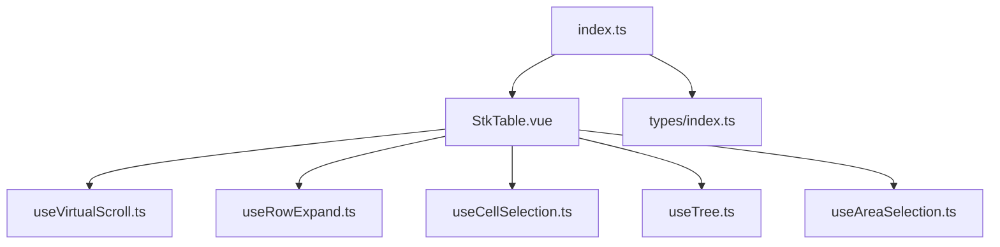
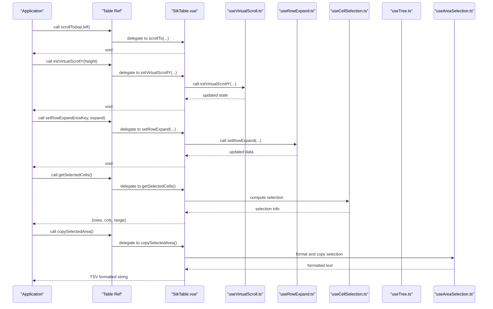
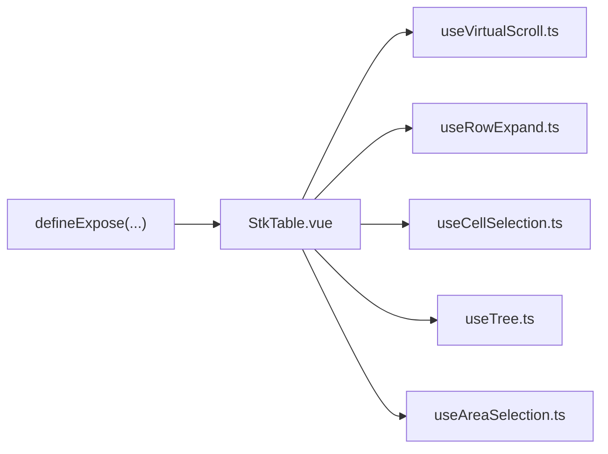

# Exposed Methods

<cite>
**Referenced Files in This Document**
- [StkTable.vue](file://src/StkTable/StkTable.vue)
- [index.ts](file://src/StkTable/index.ts)
- [types/index.ts](file://src/StkTable/types/index.ts)
- [useVirtualScroll.ts](file://src/StkTable/useVirtualScroll.ts)
- [useRowExpand.ts](file://src/StkTable/useRowExpand.ts)
- [useCellSelection.ts](file://src/StkTable/useCellSelection.ts)
- [useTree.ts](file://src/StkTable/useTree.ts)
- [useAreaSelection.ts](file://src/StkTable/useAreaSelection.ts)
- [expose.md](file://docs-src/main/api/expose.md)
- [expose.md](file://docs-src/en/main/api/expose.md)
</cite>

## Update Summary
**Changes Made**
- Added comprehensive documentation for the new `copySelectedArea` method in the Exposed Methods section
- Enhanced existing method documentation with improved formatting and examples
- Updated method signatures, return values, and usage patterns
- Added TypeScript signature and practical usage examples for the new method

## Table of Contents
1. [Introduction](#introduction)
2. [Project Structure](#project-structure)
3. [Core Components](#core-components)
4. [Architecture Overview](#architecture-overview)
5. [Detailed Component Analysis](#detailed-component-analysis)
6. [Dependency Analysis](#dependency-analysis)
7. [Performance Considerations](#performance-considerations)
8. [Troubleshooting Guide](#troubleshooting-guide)
9. [Conclusion](#conclusion)

## Introduction
This document describes the programmatic API exposed by the StkTable component. It focuses on the methods available via the table ref, including virtual scrolling helpers, selection manipulation, data updates, and state control. It consolidates the official documentation with the implementation to provide accurate method signatures, parameters, return values, usage patterns, error handling, and integration guidance.

## Project Structure
The StkTable exposes a typed Vue component with a comprehensive programmatic API. The primary implementation resides in the StkTable.vue file, while supporting utilities are split into composable modules for virtual scrolling, row expansion, cell selection, tree operations, and area selection. Public types and exports are declared in index.ts and types/index.ts.

**Diagram sources**
- [StkTable.vue](file://src/StkTable/StkTable.vue#L1648-L1781)
- [index.ts](file://src/StkTable/index.ts#L1-L5)
- [types/index.ts](file://src/StkTable/types/index.ts#L1-L324)
- [useVirtualScroll.ts](file://src/StkTable/useVirtualScroll.ts#L1-L499)
- [useRowExpand.ts](file://src/StkTable/useRowExpand.ts#L1-L89)
- [useCellSelection.ts](file://src/StkTable/useCellSelection.ts#L1-L457)
- [useTree.ts](file://src/StkTable/useTree.ts#L1-L162)
- [useAreaSelection.ts](file://src/StkTable/useAreaSelection.ts#L1-L467)

**Section sources**
- [index.ts](file://src/StkTable/index.ts#L1-L5)
- [types/index.ts](file://src/StkTable/types/index.ts#L1-L324)

## Core Components
This section enumerates the methods exposed via the table ref, grouped by functional areas. All signatures and behaviors are derived from the implementation and official documentation.

- Virtual scrolling
  - initVirtualScroll(height?)
  - initVirtualScrollX()
  - initVirtualScrollY(height?)
  - setAutoHeight(rowKey, height?)
  - clearAllAutoHeight()

- Scrolling and navigation
  - scrollTo(top = 0, left = 0)

- Selection manipulation
  - getSelectedCells()
  - clearSelectedCells()
  - getSelectedArea()
  - clearSelectedArea()
  - copySelectedArea()

- Sorting and data state
  - getTableData()
  - getSortColumns()
  - setSorter(colKey, order, option?)
  - resetSorter()

- Row and tree expansion
  - setRowExpand(rowKeyOrRow, expand?, data?)
  - setTreeExpand(rowOrRows, option?)

- Row highlighting
  - setHighlightDimRow(rowKeyValues, option?)

- Cell highlighting
  - setHighlightDimCell(row?, col?, option?)

- Cell selection
  - setSelectedCell(row?, col?, option?)

- Current row
  - setCurrentRow(rowKeyOrRow, option?)

Note: Methods like setTableData, scrollToRow, scrollToColumn, and refresh are not exposed by the table ref in the current implementation. The available methods are listed above.

**Section sources**
- [StkTable.vue](file://src/StkTable/StkTable.vue#L1648-L1781)
- [expose.md](file://docs-src/main/api/expose.md#L1-L205)
- [expose.md](file://docs-src/en/main/api/expose.md#L1-L207)

## Architecture Overview
The exposed API is defined inside the StkTable component and returned via defineExpose. It delegates to internal composables for specialized features (virtual scrolling, row expansion, cell selection, tree operations, area selection). The API is designed to be method-chained-friendly where applicable and integrates with events emitted by the component.

**Diagram sources**
- [StkTable.vue](file://src/StkTable/StkTable.vue#L1627-L1636)
- [StkTable.vue](file://src/StkTable/StkTable.vue#L1602-L1620)
- [StkTable.vue](file://src/StkTable/StkTable.vue#L1642-L1646)
- [StkTable.vue](file://src/StkTable/StkTable.vue#L1676-L1690)
- [useVirtualScroll.ts](file://src/StkTable/useVirtualScroll.ts#L196-L229)
- [useRowExpand.ts](file://src/StkTable/useRowExpand.ts#L30-L82)
- [useCellSelection.ts](file://src/StkTable/useCellSelection.ts#L426-L444)
- [useTree.ts](file://src/StkTable/useTree.ts#L72-L74)
- [useAreaSelection.ts](file://src/StkTable/useAreaSelection.ts#L356-L389)

## Detailed Component Analysis

### Virtual Scrolling API
- initVirtualScroll(height?)
  - Purpose: Recompute both vertical and horizontal virtual scroll parameters. Equivalent to calling initVirtualScrollX and initVirtualScrollY.
  - Parameters:
    - height: Optional number; if omitted, uses the container's client height.
  - Behavior: Updates internal virtual scroll state and recalculates visible windows.
  - Notes: Props autoResize triggers this automatically on size changes.

- initVirtualScrollX()
  - Purpose: Recompute horizontal virtual scroll parameters.
  - Behavior: Updates container width and visible column window.

- initVirtualScrollY(height?)
  - Purpose: Recompute vertical virtual scroll parameters.
  - Parameters: height optional; defaults to container height.
  - Behavior: Computes page size, offsets, and scrollTop clamping.

- setAutoHeight(rowKey, height?)
  - Purpose: Store or clear a row's measured height for variable row height scenarios.
  - Parameters:
    - rowKey: Unique row identifier.
    - height: New height or null/undefined to clear.
  - Behavior: Updates internal auto-height map; call after dynamic row height changes.

- clearAllAutoHeight()
  - Purpose: Clear all stored auto heights.
  - Behavior: Resets the auto-height cache.

- scrollTo(top = 0, left = 0)
  - Purpose: Set scroll position programmatically.
  - Parameters: top/left can be null to leave unchanged.
  - Behavior: Sets scrollTop/scrollLeft on the table container.

Method chaining pattern: These methods return void and are intended to be chained for batch initialization (e.g., initVirtualScroll -> scrollTo).

Error handling:
- initVirtualScrollY logs a warning if height is not a number and falls back to zero.
- setAutoHeight does not throw; passing null clears the entry.

Practical usage examples:
- After resizing columns or toggling virtualX, call initVirtualScrollX().
- After changing row heights dynamically, call setAutoHeight(rowKey, newHeight) and then initVirtualScrollY().

**Section sources**
- [StkTable.vue](file://src/StkTable/StkTable.vue#L1627-L1631)
- [StkTable.vue](file://src/StkTable/StkTable.vue#L1648-L1669)
- [useVirtualScroll.ts](file://src/StkTable/useVirtualScroll.ts#L196-L229)
- [useVirtualScroll.ts](file://src/StkTable/useVirtualScroll.ts#L231-L236)
- [useVirtualScroll.ts](file://src/StkTable/useVirtualScroll.ts#L243-L254)
- [useVirtualScroll.ts](file://src/StkTable/useVirtualScroll.ts#L480-L499)

### Selection Manipulation API
- getSelectedCells()
  - Purpose: Retrieve the current selected cell range and associated rows/columns.
  - Returns: { rows: DT[], cols: StkTableColumn<DT>[], range: CellSelectionRange | null }
  - Behavior: Normalizes start/end indices and slices data accordingly.

- clearSelectedCells()
  - Purpose: Clear the current selection.
  - Behavior: Resets selection range and internal selection state.

- getSelectedArea()
  - Purpose: Get the currently selected area information for area selection.
  - Returns: { rows: DT[], cols: StkTableColumn<DT>[], range: AreaSelectionRange | null }
  - Behavior: Returns the selected rows, columns, and range information.

- clearSelectedArea()
  - Purpose: Clear the current area selection.
  - Behavior: Resets the selection range and internal selection state.

- copySelectedArea()
  - Purpose: Copy the selected area content to clipboard in TSV (Tab-Separated Values) format.
  - Returns: string - The copied text content that was written to clipboard.
  - Behavior: Formats selected cells with custom formatting if provided, joins cells with tabs and rows with newlines, writes to clipboard, and returns the formatted text.
  - Notes: Requires areaSelection prop to be enabled. Uses formatCellForClipboard configuration if provided.

Method chaining pattern: Call getSelectedCells() to inspect state, then clearSelectedCells() to reset. For area selection, use getSelectedArea() to get selection info, then copySelectedArea() to copy to clipboard.

Integration with external state:
- Use getSelectedCells() to sync selection with app state.
- Use clearSelectedCells() to reset UI selections after bulk operations.
- Use getSelectedArea() to get selection information for programmatic operations.
- Use copySelectedArea() to implement custom copy functionality beyond keyboard shortcuts.

**Section sources**
- [StkTable.vue](file://src/StkTable/StkTable.vue#L1676-L1690)
- [useCellSelection.ts](file://src/StkTable/useCellSelection.ts#L426-L444)
- [useAreaSelection.ts](file://src/StkTable/useAreaSelection.ts#L356-L389)
- [useAreaSelection.ts](file://src/StkTable/useAreaSelection.ts#L437-L448)
- [useAreaSelection.ts](file://src/StkTable/useAreaSelection.ts#L451-L454)

### Sorting and Data State API
- getTableData()
  - Purpose: Obtain the current table data in its present order.
  - Returns: Raw array of rows (toRaw of internal copy).
  - Notes: Reflects sort order and any virtual/virtualX transformations.

- getSortColumns()
  - Purpose: Get the current sort state.
  - Returns: Array of { key: string, order: Order } representing active sorts.

- setSorter(colKey, order, option?)
  - Purpose: Programmatically set or change a column's sort state.
  - Parameters:
    - colKey: Unique column key.
    - order: null | 'asc' | 'desc'.
    - option.sortOption: Explicit sort parameters if column is not present in columns.
    - option.sort: Whether to trigger sorting (default true).
    - option.silent: Suppress @sort-change emission (default true).
    - option.force: Force sorting even with remote sort mode (default true).
  - Returns: Current table data array.
  - Behavior: Updates internal sort state and optionally re-sorts data.

- resetSorter()
  - Purpose: Clear all sort states and restore original data order.

Async operation handling:
- setSorter returns immediately with the current data; sorting occurs synchronously unless remote sort is configured externally.

Method chaining pattern: setSorter(...) returns data for convenience; chain with other operations if needed.

**Section sources**
- [StkTable.vue](file://src/StkTable/StkTable.vue#L1634-L1636)
- [StkTable.vue](file://src/StkTable/StkTable.vue#L1642-L1646)
- [StkTable.vue](file://src/StkTable/StkTable.vue#L1602-L1620)
- [expose.md](file://docs-src/main/api/expose.md#L107-L134)
- [expose.md](file://docs-src/en/main/api/expose.md#L107-L135)

### Row and Tree Expansion API
- setRowExpand(rowKeyOrRow, expand?, data?)
  - Purpose: Expand or collapse a single row's detail section.
  - Parameters:
    - rowKeyOrRow: row key or row object.
    - expand: true/false/null to set/clear/toggle.
    - data.silent: Suppress @toggle-row-expand emission.
    - data.col: Associated column (optional).
  - Behavior: Inserts/removes an expanded row placeholder and updates state.

- setTreeExpand(rowOrRows, option?)
  - Purpose: Expand or collapse tree nodes.
  - Parameters:
    - rowOrRows: Single or multiple row keys/rows.
    - option.expand: true/false to set; omitted toggles.
  - Behavior: Flattens children under expanded nodes and updates levels.

Integration with external state:
- Use setTreeExpand to reflect app-level tree state changes.
- Combine with flatTreeData to pre-flatten data for display.

**Section sources**
- [StkTable.vue](file://src/StkTable/StkTable.vue#L1676-L1690)
- [useRowExpand.ts](file://src/StkTable/useRowExpand.ts#L30-L82)
- [useTree.ts](file://src/StkTable/useTree.ts#L72-L74)

### Highlighting API
- setHighlightDimRow(rowKeyValues, option?)
  - Purpose: Highlight and optionally dim rows.
  - Parameters: option.method, option.className, option.keyframe, option.duration.
  - Behavior: Applies CSS or animation-based highlighting.

- setHighlightDimCell(row?, col?, option?)
  - Purpose: Highlight a specific cell.
  - Parameters: option.silent controls emission.

- setSelectedCell(row?, col?, option?)
  - Purpose: Set the active/highlighted cell for interaction.
  - Parameters: option.silent controls emission.

Method chaining pattern: These methods return void and can be chained to apply multiple highlights.

**Section sources**
- [StkTable.vue](file://src/StkTable/StkTable.vue#L1676-L1690)
- [expose.md](file://docs-src/main/api/expose.md#L86-L100)
- [expose.md](file://docs-src/en/main/api/expose.md#L86-L100)

### Current Row API
- setCurrentRow(rowKeyOrRow, option?)
  - Purpose: Select a row programmatically.
  - Parameters:
    - rowKeyOrRow: row key or row object; undefined to deselect.
    - option.silent: Suppress @current-change emission.
    - option.deep: Search children recursively for nested structures.
  - Behavior: Updates current row and merged cell highlighting.

**Section sources**
- [StkTable.vue](file://src/StkTable/StkTable.vue#L1535-L1575)

## Dependency Analysis
The exposed API is implemented within StkTable.vue and relies on internal composables. The following diagram shows how the exposed methods relate to their underlying implementations.

**Diagram sources**
- [StkTable.vue](file://src/StkTable/StkTable.vue#L1648-L1781)
- [useVirtualScroll.ts](file://src/StkTable/useVirtualScroll.ts#L1-L499)
- [useRowExpand.ts](file://src/StkTable/useRowExpand.ts#L1-L89)
- [useCellSelection.ts](file://src/StkTable/useCellSelection.ts#L1-L457)
- [useTree.ts](file://src/StkTable/useTree.ts#L1-L162)
- [useAreaSelection.ts](file://src/StkTable/useAreaSelection.ts#L1-L467)

**Section sources**
- [StkTable.vue](file://src/StkTable/StkTable.vue#L1648-L1781)

## Performance Considerations
- Virtual scrolling recomputation: Use initVirtualScroll after layout changes (e.g., column width adjustments) to avoid visual glitches.
- Variable row height: Call setAutoHeight for changed rows and then initVirtualScrollY to keep virtual windows accurate.
- Selection operations: getSelectedCells computes normalized ranges; avoid frequent repeated calls during bulk operations.
- Sorting: setSorter triggers sorting by default; use option.silent to avoid unnecessary emissions and option.force to bypass remote sort constraints when needed.
- Area selection copying: copySelectedArea formats data efficiently using join operations; for very large selections, consider performance implications of clipboard operations.

## Troubleshooting Guide
Common issues and resolutions:
- setCurrentRow fails: Passing an invalid row key logs a warning. Ensure the key exists in the current data.
  - Evidence: Warning logged when row not found.
  - Action: Verify rowKey or pass the row object directly.

- setRowExpand fails: Target row not found logs a warning. Ensure the row key is correct and the row exists.
  - Evidence: Warning logged when row not found.

- setTreeExpand fails: Logs a warning for missing row keys. Confirm keys and data structure.
  - Evidence: Warning logged when row not found.

- setSorter fails: If the column key is not present in current columns, pass option.sortOption to specify sort parameters explicitly.
  - Evidence: Warning logged when column not found by key.

- initVirtualScrollY height parameter: Passing a non-number logs a warning and falls back to zero.
  - Evidence: Warning logged for invalid height type.

- copySelectedArea fails: If areaSelection is not enabled or no selection exists, returns empty string.
  - Evidence: Method checks for selectionRange.value before processing.
  - Action: Ensure areaSelection prop is enabled and selection exists before calling.

- copySelectedArea clipboard failure: navigator.clipboard.writeText may fail in certain environments.
  - Evidence: Method catches and logs warning on clipboard failure.
  - Action: Handle fallback scenarios or user feedback.

Integration tips:
- After updating data externally, call initVirtualScroll to recalculate visible windows.
- For tree structures, use setTreeExpand to reflect app-level state changes and flatTreeData to prepare data for rendering.
- For area selection operations, use getSelectedArea() to get selection information before calling copySelectedArea().

**Section sources**
- [StkTable.vue](file://src/StkTable/StkTable.vue#L1562-L1566)
- [StkTable.vue](file://src/StkTable/StkTable.vue#L1609-L1612)
- [useRowExpand.ts](file://src/StkTable/useRowExpand.ts#L40-L43)
- [useTree.ts](file://src/StkTable/useTree.ts#L42-L45)
- [useVirtualScroll.ts](file://src/StkTable/useVirtualScroll.ts#L206-L209)
- [useAreaSelection.ts](file://src/StkTable/useAreaSelection.ts#L356-L389)

## Conclusion
The StkTable exposes a robust programmatic API centered around virtual scrolling, selection, sorting, expansion, and highlighting. The newly added `copySelectedArea` method provides comprehensive area selection functionality with clipboard integration. While methods like setTableData, scrollToRow, scrollToColumn, and refresh are not exposed, the existing methods provide comprehensive control over table state and behavior. Use the documented signatures and behaviors to integrate StkTable with external state management systems and build responsive, performant table experiences.