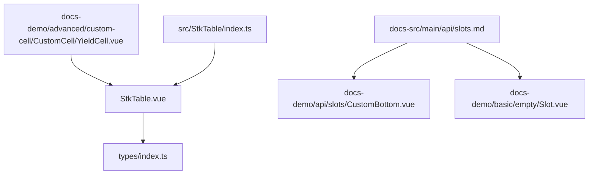
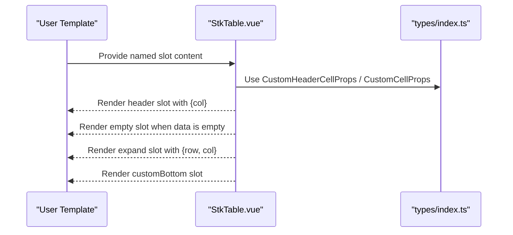
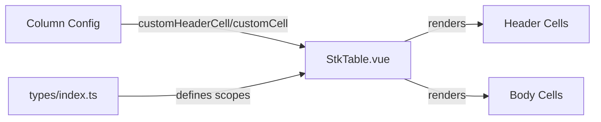

# Slots

<cite>
**Referenced Files in This Document**
- [StkTable.vue](file://src/StkTable/StkTable.vue)
- [types/index.ts](file://src/StkTable/types/index.ts)
- [slots.md](file://docs-src/main/api/slots.md)
- [CustomBottom.vue](file://docs-demo/api/slots/CustomBottom.vue)
- [Slot.vue](file://docs-demo/basic/empty/Slot.vue)
- [YieldCell.vue](file://docs-demo/advanced/custom-cell/CustomCell/YieldCell.vue)
- [index.ts](file://src/StkTable/index.ts)
</cite>

## Table of Contents
1. [Introduction](#introduction)
2. [Project Structure](#project-structure)
3. [Core Components](#core-components)
4. [Architecture Overview](#architecture-overview)
5. [Detailed Component Analysis](#detailed-component-analysis)
6. [Dependency Analysis](#dependency-analysis)
7. [Performance Considerations](#performance-considerations)
8. [Troubleshooting Guide](#troubleshooting-guide)
9. [Conclusion](#conclusion)

## Introduction
This document provides comprehensive slot documentation for the StkTable component. It covers all available slots, including the default slot, header slots, and scoped slots for custom rendering. It explains the slot scope data for rows, columns, and cells, and demonstrates practical customization patterns for headers, footers, and cell content. It also includes integration guidance with custom components, performance considerations, and best practices for building interactive and efficient tables.

## Project Structure
The StkTable component exposes several named slots that enable flexible customization of the table’s header, body, empty state, and footer area. The implementation resides in the StkTable Vue single-file component, while type definitions for slot scopes and column configuration live in the types module. Documentation and demos are provided under docs-src and docs-demo respectively.

**Diagram sources**
- [StkTable.vue](file://src/StkTable/StkTable.vue#L1-L207)
- [types/index.ts](file://src/StkTable/types/index.ts#L1-L318)
- [slots.md](file://docs-src/main/api/slots.md#L1-L21)
- [CustomBottom.vue](file://docs-demo/api/slots/CustomBottom.vue#L1-L53)
- [Slot.vue](file://docs-demo/basic/empty/Slot.vue#L1-L29)
- [YieldCell.vue](file://docs-demo/advanced/custom-cell/CustomCell/YieldCell.vue#L1-L28)
- [index.ts](file://src/StkTable/index.ts#L1-L5)

**Section sources**
- [StkTable.vue](file://src/StkTable/StkTable.vue#L1-L207)
- [types/index.ts](file://src/StkTable/types/index.ts#L1-L318)
- [slots.md](file://docs-src/main/api/slots.md#L1-L21)
- [index.ts](file://src/StkTable/index.ts#L1-L5)

## Core Components
- StkTable.vue: Implements the table layout, renders headers and body rows, and exposes named slots for customization.
- types/index.ts: Defines the slot scope interfaces for header and cell customizations, including row, column, and cell information.
- docs-src/main/api/slots.md: Official slot reference and usage notes.
- docs-demo samples: Practical examples for slot usage in real-world scenarios.

Key slot locations in StkTable.vue:
- Header slot: Provided via a named slot inside the header cell wrapper for flexible header rendering.
- Empty state slot: Rendered when the data source is empty.
- Expand row slot: Rendered for expanded rows.
- Footer slot: Rendered below the table body.

**Section sources**
- [StkTable.vue](file://src/StkTable/StkTable.vue#L61-L101)
- [StkTable.vue](file://src/StkTable/StkTable.vue#L103-L179)
- [StkTable.vue](file://src/StkTable/StkTable.vue#L192-L195)
- [types/index.ts](file://src/StkTable/types/index.ts#L25-L29)
- [types/index.ts](file://src/StkTable/types/index.ts#L8-L23)
- [slots.md](file://docs-src/main/api/slots.md#L3-L8)

## Architecture Overview
The StkTable component orchestrates slot rendering during header and body rendering. The header slot scope provides column metadata, while the body slots receive row and column context. The component also supports custom cell and header cell components via column configuration, complementing the slot-based customization.

**Diagram sources**
- [StkTable.vue](file://src/StkTable/StkTable.vue#L61-L101)
- [StkTable.vue](file://src/StkTable/StkTable.vue#L103-L179)
- [StkTable.vue](file://src/StkTable/StkTable.vue#L192-L195)
- [types/index.ts](file://src/StkTable/types/index.ts#L25-L29)
- [types/index.ts](file://src/StkTable/types/index.ts#L8-L23)

## Detailed Component Analysis

### Available Slots
- tableHeader: Scoped slot for customizing header content. Scope includes column metadata.
- empty: Scoped slot for customizing the empty state.
- expand: Scoped slot for customizing expanded row content. Scope includes row and column.
- customBottom: Named slot rendered below the table body.

Notes:
- The documentation recommends using column-level customHeaderCell/customCell for most customizations, as they integrate tightly with the table’s rendering pipeline and support advanced features like virtualization and merging.

**Section sources**
- [slots.md](file://docs-src/main/api/slots.md#L3-L8)
- [StkTable.vue](file://src/StkTable/StkTable.vue#L90-L94)
- [StkTable.vue](file://src/StkTable/StkTable.vue#L192-L195)
- [StkTable.vue](file://src/StkTable/StkTable.vue#L121-L123)

### Slot Scope Data
- tableHeader scope: { col }
  - Provides the column configuration for the current header cell.
- empty scope: none (default slot content)
  - Use to render custom empty state UI.
- expand scope: { row, col }
  - Provides the expanded row data and the column configuration associated with the expansion.
- customBottom scope: none (default slot content)
  - Use to render a custom footer or bottom bar.

These scopes are derived from the template rendering and the types definitions for custom cell/header cell props.

**Section sources**
- [StkTable.vue](file://src/StkTable/StkTable.vue#L90-L94)
- [StkTable.vue](file://src/StkTable/StkTable.vue#L121-L123)
- [StkTable.vue](file://src/StkTable/StkTable.vue#L192-L195)
- [types/index.ts](file://src/StkTable/types/index.ts#L25-L29)
- [types/index.ts](file://src/StkTable/types/index.ts#L8-L23)

### Examples of Slot-Based Customizations

#### Custom Empty State
Render a custom empty state with icon and call-to-action link.

- Template location: [Slot.vue](file://docs-demo/basic/empty/Slot.vue#L19-L28)
- Slot usage: [Slot.vue](file://docs-demo/basic/empty/Slot.vue#L20-L26)

**Section sources**
- [Slot.vue](file://docs-demo/basic/empty/Slot.vue#L1-L29)

#### Custom Bottom Bar
Add a custom bottom element (e.g., load-more indicator) below the table.

- Template location: [CustomBottom.vue](file://docs-demo/api/slots/CustomBottom.vue#L39-L45)
- Demo usage: [CustomBottom.vue](file://docs-demo/api/slots/CustomBottom.vue#L40-L44)

**Section sources**
- [CustomBottom.vue](file://docs-demo/api/slots/CustomBottom.vue#L1-L53)

#### Custom Header Content
Use the tableHeader slot to render custom header content per column.

- Slot usage in template: [StkTable.vue](file://src/StkTable/StkTable.vue#L90-L94)
- Scope props: [types/index.ts](file://src/StkTable/types/index.ts#L25-L29)

**Section sources**
- [StkTable.vue](file://src/StkTable/StkTable.vue#L90-L94)
- [types/index.ts](file://src/StkTable/types/index.ts#L25-L29)

#### Expanded Row Content
Render custom content for expanded rows using the expand slot.

- Slot usage in template: [StkTable.vue](file://src/StkTable/StkTable.vue#L121-L123)
- Scope props: [types/index.ts](file://src/StkTable/types/index.ts#L8-L23)

**Section sources**
- [StkTable.vue](file://src/StkTable/StkTable.vue#L121-L123)
- [types/index.ts](file://src/StkTable/types/index.ts#L8-L23)

### Integration with Custom Components
While column-level customCell/customHeaderCell are recommended for most use cases, slots can be combined with custom components for advanced scenarios. For example, a custom cell component can itself use named slots internally to compose complex cell layouts.

- Example of a custom cell component receiving scoped props: [YieldCell.vue](file://docs-demo/advanced/custom-cell/CustomCell/YieldCell.vue#L6-L15)

Best practices:
- Keep slot content lightweight to avoid performance regressions in virtualized lists.
- Prefer column-level customCell/customHeaderCell for dynamic data and advanced features.
- Use slots for static or contextual decorations around the table (e.g., customBottom).

**Section sources**
- [YieldCell.vue](file://docs-demo/advanced/custom-cell/CustomCell/YieldCell.vue#L1-L28)
- [slots.md](file://docs-src/main/api/slots.md#L10-L12)

### Slot Composition Patterns
- Conditional rendering: Use slot scope data to conditionally render different content based on column or row state.
- Composition with directives: Combine slots with v-if/v-show to toggle content visibility.
- Nested components: Wrap slot content in components to encapsulate logic and styles.

[No sources needed since this section provides general guidance]

## Dependency Analysis
The slot system interacts with:
- Column configuration (customCell, customHeaderCell) for cell-level customization.
- Rendering pipeline (thead/tbody) that binds slot content to specific DOM nodes.
- Type definitions that specify the shape of slot scopes.

**Diagram sources**
- [StkTable.vue](file://src/StkTable/StkTable.vue#L83-L89)
- [StkTable.vue](file://src/StkTable/StkTable.vue#L135-L153)
- [types/index.ts](file://src/StkTable/types/index.ts#L8-L29)

**Section sources**
- [StkTable.vue](file://src/StkTable/StkTable.vue#L83-L89)
- [StkTable.vue](file://src/StkTable/StkTable.vue#L135-L153)
- [types/index.ts](file://src/StkTable/types/index.ts#L8-L29)

## Performance Considerations
- Prefer column-level customCell/customHeaderCell over heavy slot content in virtualized tables to minimize re-renders.
- Avoid expensive computations inside slots; compute values in advance or use reactive refs.
- Use scoped slots minimally; pass only required props to reduce overhead.
- For large datasets, keep slot content simple and leverage built-in features (e.g., fixed columns, virtual scrolling) rather than complex DOM manipulation in slots.

[No sources needed since this section provides general guidance]

## Troubleshooting Guide
Common issues and resolutions:
- Empty slot not visible: Ensure the data source is truly empty and showNoData is enabled.
- Expand slot not rendering: Verify the row is expanded and the column configuration matches the expected structure.
- Header slot not applying styles: Confirm the slot is placed inside the header cell wrapper and that column-level customHeaderCell is not overriding the slot.

**Section sources**
- [StkTable.vue](file://src/StkTable/StkTable.vue#L192-L195)
- [StkTable.vue](file://src/StkTable/StkTable.vue#L121-L123)
- [StkTable.vue](file://src/StkTable/StkTable.vue#L90-L94)

## Conclusion
StkTable’s slot system offers flexible customization for headers, empty states, expanded rows, and footers. While column-level customCell/customHeaderCell are recommended for most scenarios, named slots provide powerful hooks for contextual decoration and layout. By understanding slot scopes, following performance best practices, and integrating with custom components thoughtfully, you can build highly customizable and efficient tables.