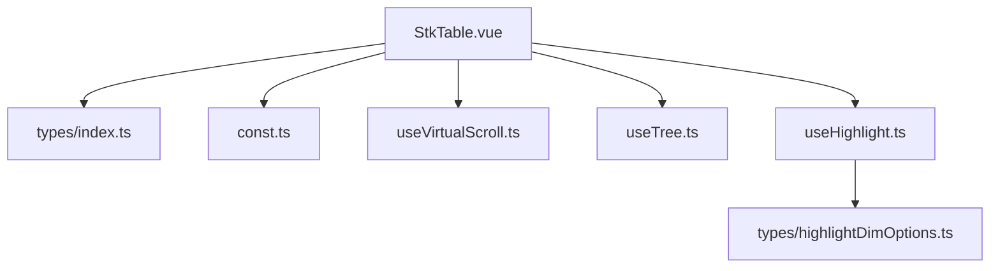
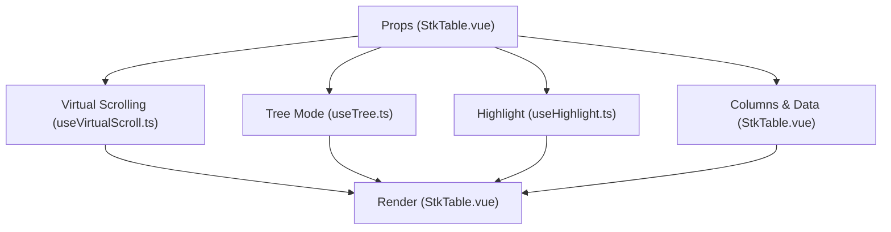
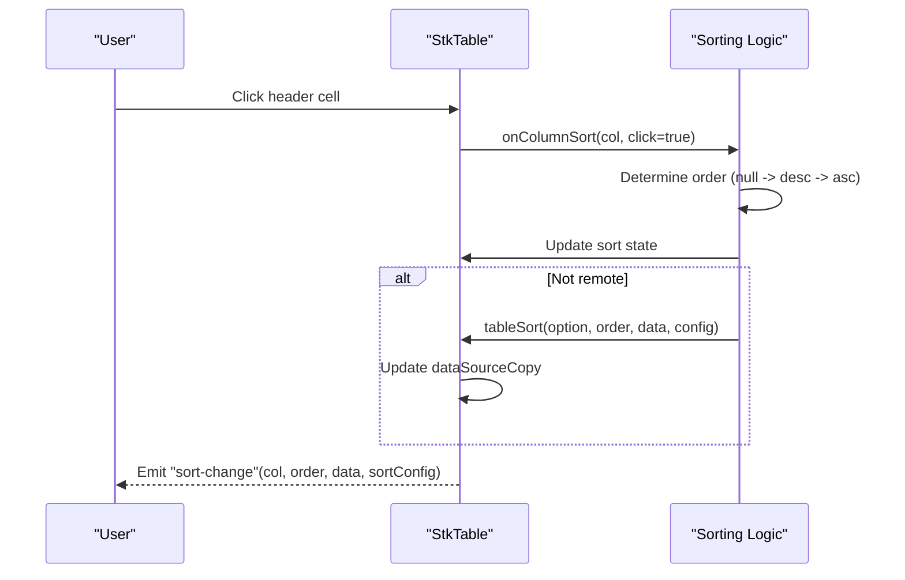
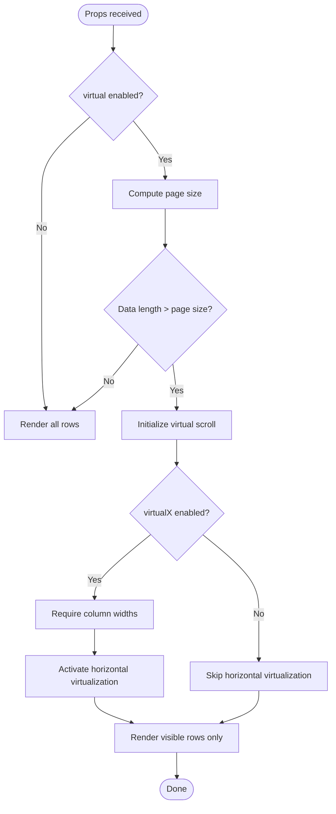
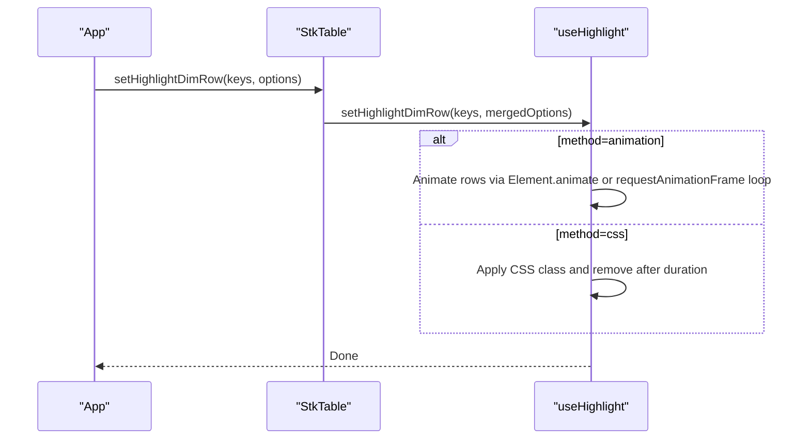
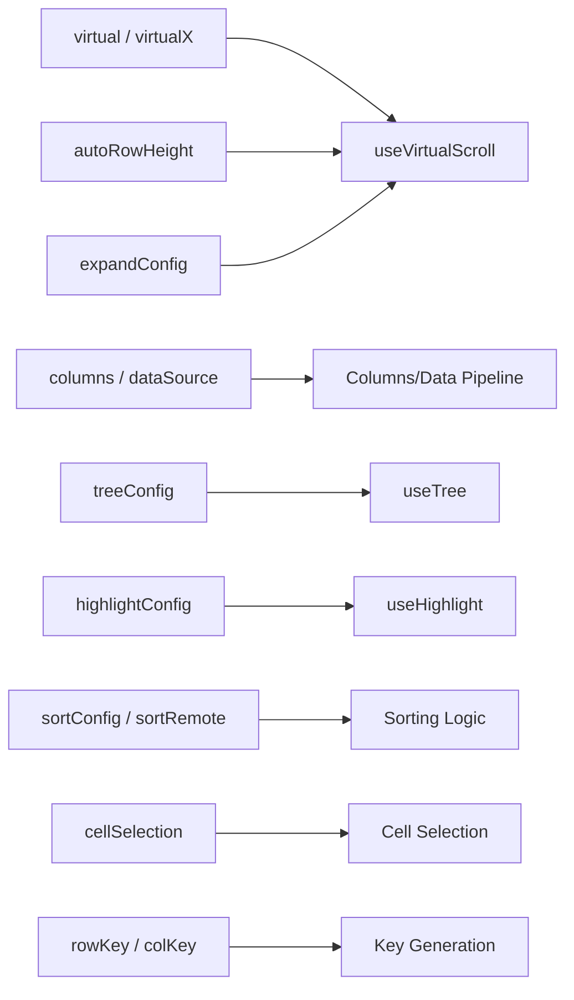

# Table Props

<cite>
**Referenced Files in This Document**
- [StkTable.vue](file://src/StkTable/StkTable.vue)
- [types/index.ts](file://src/StkTable/types/index.ts)
- [const.ts](file://src/StkTable/const.ts)
- [useVirtualScroll.ts](file://src/StkTable/useVirtualScroll.ts)
- [useTree.ts](file://src/StkTable/useTree.ts)
- [useHighlight.ts](file://src/StkTable/useHighlight.ts)
- [highlightDimOptions.ts](file://src/StkTable/types/highlightDimOptions.ts)
- [table-props.md](file://docs-src/main/api/table-props.md)
- [VirtualY.vue](file://docs-demo/advanced/virtual/VirtualY.vue)
- [Highlight.vue](file://docs-demo/advanced/highlight/Highlight.vue)
- [Tree.vue](file://docs-demo/basic/tree/Tree.vue)
</cite>

## Table of Contents
1. [Introduction](#introduction)
2. [Project Structure](#project-structure)
3. [Core Components](#core-components)
4. [Architecture Overview](#architecture-overview)
5. [Detailed Component Analysis](#detailed-component-analysis)
6. [Dependency Analysis](#dependency-analysis)
7. [Performance Considerations](#performance-considerations)
8. [Troubleshooting Guide](#troubleshooting-guide)
9. [Conclusion](#conclusion)
10. [Appendices](#appendices)

## Introduction
This document provides comprehensive documentation for the StkTable component props. It covers table-level props for data binding, configuration, and behavior control, including columns, dataSource, pagination simulation, sorting, and virtual scrolling. Advanced options such as tree data settings, highlight configurations, and performance optimization props are documented with precise TypeScript interface definitions, default values, and practical usage examples. Common prop combinations and their behavioral effects are also explained to help you configure the table effectively.

## Project Structure
The StkTable component is implemented in a single Vue SFC with supporting composable modules and type definitions. The props are declared inside the component script setup and accompanied by typed interfaces and constants.

**Diagram sources**
- [StkTable.vue](file://src/StkTable/StkTable.vue#L209-L476)
- [types/index.ts](file://src/StkTable/types/index.ts#L54-L318)
- [const.ts](file://src/StkTable/const.ts#L1-L51)
- [useVirtualScroll.ts](file://src/StkTable/useVirtualScroll.ts#L1-L200)
- [useTree.ts](file://src/StkTable/useTree.ts#L1-L162)
- [useHighlight.ts](file://src/StkTable/useHighlight.ts#L1-L200)
- [highlightDimOptions.ts](file://src/StkTable/types/highlightDimOptions.ts#L1-L27)

**Section sources**
- [StkTable.vue](file://src/StkTable/StkTable.vue#L209-L476)
- [types/index.ts](file://src/StkTable/types/index.ts#L54-L318)
- [const.ts](file://src/StkTable/const.ts#L1-L51)

## Core Components
This section documents the primary table-level props with their types, defaults, and intended behavior.

- width: string
  - Purpose: Sets the table wrapper width.
  - Type: string
  - Default: empty string
  - Notes: Deprecated in favor of styling the `.stk-table-main` selector in newer versions.
  - Practical example: See [VirtualY.vue](file://docs-demo/advanced/virtual/VirtualY.vue#L32-L33)

- minWidth: string
  - Purpose: Sets the minimum table width.
  - Type: string
  - Default: empty string
  - Notes: Deprecated; use CSS selectors instead.

- maxWidth: string
  - Purpose: Sets the maximum table width.
  - Type: string
  - Default: empty string
  - Notes: Deprecated; use CSS selectors instead.

- stripe: boolean
  - Purpose: Enables alternating row stripes.
  - Type: boolean
  - Default: false

- fixedMode: boolean
  - Purpose: Uses table-layout: fixed for layout calculations.
  - Type: boolean
  - Default: false
  - Notes: Useful for older browsers.

- headless: boolean
  - Purpose: Hides the table header.
  - Type: boolean
  - Default: false

- theme: 'light' | 'dark'
  - Purpose: Applies light or dark theme classes.
  - Type: union literal
  - Default: 'light'

- rowHeight: number
  - Purpose: Base row height for non-virtual and virtual modes.
  - Type: number
  - Default: constant from DEFAULT_ROW_HEIGHT
  - Notes: When autoRowHeight is enabled, this becomes the estimated row height for calculations.

- autoRowHeight: boolean | AutoRowHeightConfig<DT>
  - Purpose: Enables variable row heights; when true, rowHeight acts as an estimated height.
  - Type: boolean | object
  - Default: false
  - Sub-properties:
    - expectedHeight?: number | ((row: DT) => number)
  - Notes: Affects virtual scrolling row height calculation and rendering.

- rowHover: boolean
  - Purpose: Highlights the hovered row.
  - Type: boolean
  - Default: true

- rowActive: boolean | RowActiveOption<DT>
  - Purpose: Controls current row highlighting and selection behavior.
  - Type: boolean | object
  - Default: default row active configuration
  - Sub-properties:
    - enabled?: boolean
    - disabled?: (row: DT) => boolean
    - revokable?: boolean

- rowCurrentRevokable: boolean
  - Purpose: Allows toggling off the current row highlight by clicking again.
  - Type: boolean
  - Default: true
  - Notes: Deprecated; use rowActive.revokable instead.

- headerRowHeight: number | string | null
  - Purpose: Height of the table header row(s).
  - Type: number | string | null
  - Default: DEFAULT_ROW_HEIGHT

- virtual: boolean
  - Purpose: Enables vertical virtual scrolling.
  - Type: boolean
  - Default: false
  - Effects: Activates virtual scrolling pipeline; requires sufficient data to exceed page size.

- virtualX: boolean
  - Purpose: Enables horizontal virtual scrolling.
  - Type: boolean
  - Default: false
  - Requirements: Column widths must be set; otherwise horizontal virtual scrolling may not activate.

- columns: StkTableColumn<DT>[]
  - Purpose: Defines table columns and their rendering behavior.
  - Type: array of column definitions
  - Default: []
  - Notes: Shallow reactive; mutating items requires changing the array reference.

- dataSource: DT[]
  - Purpose: Provides the tabular data.
  - Type: array of records
  - Default: []
  - Notes: Shallow reactive; mutating items requires changing the array reference.

- rowKey: UniqKeyProp
  - Purpose: Unique identifier for rows.
  - Type: string | number | function
  - Default: empty string
  - Notes: Values must not be undefined.

- colKey: UniqKeyProp
  - Purpose: Unique identifier for columns.
  - Type: string | number | function
  - Default: undefined
  - Notes: If undefined, falls back to key or dataIndex.

- emptyCellText: string | ((option: { row: DT; col: StkTableColumn<DT> }) => string)
  - Purpose: Text to display for empty cells.
  - Type: string | function
  - Default: "--"

- noDataFull: boolean
  - Purpose: Makes the empty state span the full container height.
  - Type: boolean
  - Default: false

- showNoData: boolean
  - Purpose: Controls visibility of the empty state.
  - Type: boolean
  - Default: true

- sortRemote: boolean
  - Purpose: Disables local sorting; data remains unchanged.
  - Type: boolean
  - Default: false
  - Notes: Use with server-side sorting.

- showHeaderOverflow: boolean
  - Purpose: Truncates header text with ellipsis when it overflows.
  - Type: boolean
  - Default: false

- showOverflow: boolean
  - Purpose: Truncates cell text with ellipsis when it overflows.
  - Type: boolean
  - Default: false

- showTrHoverClass: boolean
  - Purpose: Adds a hover class to rows via CSS.
  - Type: boolean
  - Default: false

- cellHover: boolean
  - Purpose: Highlights hovered cells.
  - Type: boolean
  - Default: false

- cellActive: boolean
  - Purpose: Highlights the currently selected cell.
  - Type: boolean
  - Default: false

- selectedCellRevokable: boolean
  - Purpose: Allows clicking the same cell again to deselect it.
  - Type: boolean
  - Default: true

- cellSelection: boolean | CellSelectionConfig
  - Purpose: Enables cell range selection via drag.
  - Type: boolean | object
  - Default: false
  - Sub-properties:
    - formatCellForClipboard?: (row: DT, col: StkTableColumn<DT>, rawValue: any) => string

- headerDrag: boolean | HeaderDragConfig<DT>
  - Purpose: Allows dragging headers to reorder columns.
  - Type: boolean | object
  - Default: false
  - Sub-properties:
    - mode?: 'none' | 'insert' | 'swap'
    - disabled?: (col: StkTableColumn<DT>) => boolean

- rowClassName: (row: DT, i: number) => string
  - Purpose: Dynamically assigns CSS classes to rows.
  - Type: function
  - Default: returns empty string

- colResizable: boolean | ColResizableConfig<DT>
  - Purpose: Enables column width resizing; requires v-model:columns to update widths.
  - Type: boolean | object
  - Default: false
  - Sub-properties:
    - disabled?: (col: StkTableColumn<DT>) => boolean
  - Notes: When enabled, each column must have a width; minWidth/minWidth do not apply during resize.

- colMinWidth: number
  - Purpose: Minimum width for resizable columns.
  - Type: number
  - Default: 10

- bordered: boolean | 'h' | 'v' | 'body-v' | 'body-h'
  - Purpose: Renders borders for cells or body only.
  - Type: union literal
  - Default: true

- autoResize: boolean | (() => void)
  - Purpose: Automatically recalculates virtual scroll sizes on resize.
  - Type: boolean | function
  - Default: true

- fixedColShadow: boolean
  - Purpose: Shows shadows for fixed columns.
  - Type: boolean
  - Default: false

- optimizeVue2Scroll: boolean
  - Purpose: Optimizes scrolling for Vue 2 compatibility.
  - Type: boolean
  - Default: false

- sortConfig: SortConfig<DT>
  - Purpose: Global sorting behavior and defaults.
  - Type: object
  - Default: DEFAULT_SORT_CONFIG
  - Sub-properties:
    - defaultSort?: { key?: StkTableColumn<T>['key']; dataIndex: StkTableColumn<T>['dataIndex']; order: Order; sortField?: StkTableColumn<T>['sortField']; sortType?: StkTableColumn<T>['sortType']; sorter?: StkTableColumn<T>['sorter']; silent?: boolean }
    - emptyToBottom?: boolean
    - stringLocaleCompare?: boolean
    - sortChildren?: boolean

- hideHeaderTitle: boolean | string[]
  - Purpose: Hides header titles; can accept an array of column keys.
  - Type: boolean | array of strings
  - Default: false

- highlightConfig: HighlightConfig
  - Purpose: Configures highlight animations for rows and cells.
  - Type: object
  - Default: {}
  - Sub-properties:
    - duration?: number (seconds)
    - fps?: number (frames per second)

- seqConfig: SeqConfig
  - Purpose: Controls sequence column behavior.
  - Type: object
  - Default: {}
  - Sub-properties:
    - startIndex?: number

- expandConfig: ExpandConfig
  - Purpose: Controls expandable rows.
  - Type: object
  - Default: {}
  - Sub-properties:
    - height?: number

- dragRowConfig: DragRowConfig
  - Purpose: Controls row reordering via drag.
  - Type: object
  - Default: {}
  - Sub-properties:
    - mode?: 'none' | 'insert' | 'swap'

- treeConfig: TreeConfig
  - Purpose: Controls tree data behavior.
  - Type: object
  - Default: {}
  - Sub-properties:
    - defaultExpandAll?: boolean
    - defaultExpandKeys?: UniqKey[]
    - defaultExpandLevel?: number

- cellFixedMode: 'sticky' | 'relative'
  - Purpose: Chooses fixed header/column implementation mode.
  - Type: union literal
  - Default: 'sticky'
  - Notes: Legacy browsers force 'relative'; multi-level headers with virtual X require caution.

- smoothScroll: boolean
  - Purpose: Controls smooth scrolling behavior.
  - Type: boolean
  - Default: determined by browser version constant
  - Notes: When false, wheel events are proxied to avoid blank screen on fast scroll.

- scrollRowByRow: boolean | 'scrollbar'
  - Purpose: Scrolls by integer row increments.
  - Type: boolean | literal
  - Default: false
  - Notes: 'scrollbar' restricts behavior to scrollbar drag.

- scrollbar: boolean | ScrollbarOptions
  - Purpose: Enables custom scrollbars.
  - Type: boolean | object
  - Default: false
  - Sub-properties:
    - enabled?: boolean
    - width?: number
    - height?: number
    - minWidth?: number
    - minHeight?: number

**Section sources**
- [StkTable.vue](file://src/StkTable/StkTable.vue#L278-L476)
- [types/index.ts](file://src/StkTable/types/index.ts#L185-L318)
- [const.ts](file://src/StkTable/const.ts#L40-L51)
- [table-props.md](file://docs-src/main/api/table-props.md#L1-L220)

## Architecture Overview
The StkTable component orchestrates multiple subsystems to deliver advanced table features. The props feed into composables that manage virtual scrolling, tree expansion, highlighting, and more.

**Diagram sources**
- [StkTable.vue](file://src/StkTable/StkTable.vue#L278-L476)
- [useVirtualScroll.ts](file://src/StkTable/useVirtualScroll.ts#L60-L200)
- [useTree.ts](file://src/StkTable/useTree.ts#L12-L162)
- [useHighlight.ts](file://src/StkTable/useHighlight.ts#L27-L200)

## Detailed Component Analysis

### Columns and Data Binding
- columns: StkTableColumn<DT>
  - Defines each column’s key, type, alignment, width, fixed position, custom renderers, and merging behavior.
  - Supports nested headers via children.
  - Example usage: See [VirtualY.vue](file://docs-demo/advanced/virtual/VirtualY.vue#L6-L11)

- dataSource: DT[]
  - The primary data source for rows.
  - When tree data is detected (presence of tree-node columns), it is flattened automatically.

- rowKey and colKey
  - rowKey: Unique row identifier; supports string, number, or function.
  - colKey: Unique column identifier; supports string, number, or function; defaults to key or dataIndex.

- Pagination Simulation
  - StkTable does not provide built-in pagination controls. Use external pagination to slice dataSource and bind to the table.

**Section sources**
- [types/index.ts](file://src/StkTable/types/index.ts#L54-L120)
- [StkTable.vue](file://src/StkTable/StkTable.vue#L924-L931)
- [VirtualY.vue](file://docs-demo/advanced/virtual/VirtualY.vue#L13-L29)

### Sorting Behavior
- sortRemote: boolean
  - When true, disables local sorting; pass sorted data externally.

- sortConfig: SortConfig<DT>
  - Controls default sort on initialization and when order is null.
  - Options include emptyToBottom, stringLocaleCompare, and sortChildren.

- Column-level sorter
  - Each column can define its own sorter function or boolean flag.
  - Sorting triggers sort-change event with column, order, data, and sortConfig.

- Programmatic sorting
  - setSorter(colKey, order, options) allows programmatic control.
  - resetSorter() clears sorting state.

**Diagram sources**
- [StkTable.vue](file://src/StkTable/StkTable.vue#L1228-L1288)
- [types/index.ts](file://src/StkTable/types/index.ts#L185-L220)

**Section sources**
- [StkTable.vue](file://src/StkTable/StkTable.vue#L1228-L1288)
- [types/index.ts](file://src/StkTable/types/index.ts#L185-L220)

### Virtual Scrolling Settings
- virtual: boolean
  - Enables vertical virtualization when data length exceeds page size.

- virtualX: boolean
  - Enables horizontal virtualization; requires explicit column widths.

- autoRowHeight: boolean | AutoRowHeightConfig<DT>
  - When enabled, row heights are computed dynamically; affects virtual scroll calculations.

- expandConfig.height
  - When expandable rows are present, this height is used for expanded rows in virtual mode.

- scrollRowByRow: boolean | 'scrollbar'
  - Forces row-wise scrolling; useful for preventing blank screen during fast scrolls.

- smoothScroll: boolean
  - Controls whether wheel events are proxied to avoid blank screen on fast scroll.

**Diagram sources**
- [useVirtualScroll.ts](file://src/StkTable/useVirtualScroll.ts#L100-L132)
- [StkTable.vue](file://src/StkTable/StkTable.vue#L1415-L1447)

**Section sources**
- [useVirtualScroll.ts](file://src/StkTable/useVirtualScroll.ts#L60-L200)
- [StkTable.vue](file://src/StkTable/StkTable.vue#L1415-L1447)

### Tree Data Settings
- treeConfig: TreeConfig
  - defaultExpandAll?: boolean
  - defaultExpandKeys?: UniqKey[]
  - defaultExpandLevel?: number

- Automatic flattening
  - When tree columns are present, dataSource is flattened on mount and updates.

- Toggle behavior
  - toggle-tree-expand event fires when expanding/collapsing nodes.

**Section sources**
- [useTree.ts](file://src/StkTable/useTree.ts#L12-L162)
- [StkTable.vue](file://src/StkTable/StkTable.vue#L926-L929)
- [Tree.vue](file://docs-demo/basic/tree/Tree.vue#L10-L15)

### Highlight Configurations
- highlightConfig: HighlightConfig
  - duration?: number (seconds)
  - fps?: number (frames per second)

- Methods
  - setHighlightDimRow(keys, options)
  - setHighlightDimCell(rowKey, colKey, options)

- Options
  - method: 'animation' | 'css'
  - className?: string
  - keyframe?: Web Animations Keyframe specification
  - duration?: number

**Diagram sources**
- [useHighlight.ts](file://src/StkTable/useHighlight.ts#L133-L166)
- [highlightDimOptions.ts](file://src/StkTable/types/highlightDimOptions.ts#L1-L27)
- [Highlight.vue](file://docs-demo/advanced/highlight/Highlight.vue#L17-L28)

**Section sources**
- [useHighlight.ts](file://src/StkTable/useHighlight.ts#L27-L200)
- [highlightDimOptions.ts](file://src/StkTable/types/highlightDimOptions.ts#L1-L27)
- [Highlight.vue](file://docs-demo/advanced/highlight/Highlight.vue#L11-L75)

### Common Prop Combinations and Effects
- virtual + virtualX
  - Requires column widths; activates both vertical and horizontal virtualization.

- autoRowHeight + expandConfig.height
  - Ensures expanded rows use the configured height in virtual mode.

- sortRemote + sortConfig.defaultSort
  - Disables local sorting; initializes default sort silently if configured.

- cellSelection + formatCellForClipboard
  - Enables drag-to-select cells and ensures copied text matches custom cell content.

- treeConfig.defaultExpandAll + rowKey
  - Flattens tree data and expands all nodes on first load.

- highlightConfig with fps
  - Produces stepped animation frames for precise highlight timing.

**Section sources**
- [StkTable.vue](file://src/StkTable/StkTable.vue#L1276-L1287)
- [useVirtualScroll.ts](file://src/StkTable/useVirtualScroll.ts#L178-L190)
- [useTree.ts](file://src/StkTable/useTree.ts#L94-L106)
- [useHighlight.ts](file://src/StkTable/useHighlight.ts#L59-L65)

## Dependency Analysis
The props influence multiple internal systems. The following diagram shows how props connect to composables and runtime behavior.

**Diagram sources**
- [StkTable.vue](file://src/StkTable/StkTable.vue#L278-L476)
- [useVirtualScroll.ts](file://src/StkTable/useVirtualScroll.ts#L60-L200)
- [useTree.ts](file://src/StkTable/useTree.ts#L12-L162)
- [useHighlight.ts](file://src/StkTable/useHighlight.ts#L27-L200)

**Section sources**
- [StkTable.vue](file://src/StkTable/StkTable.vue#L862-L922)

## Performance Considerations
- Prefer virtual for large datasets to reduce DOM nodes.
- Set column widths when enabling virtualX to avoid unnecessary recalculations.
- Use autoRowHeight judiciously; it increases computation for dynamic row heights.
- Disable fixedColShadow if fixed columns are frequently updated to save rendering cost.
- Use smoothScroll=false for environments where fast wheeling causes blank screens.
- Limit highlight animations to necessary scopes to avoid excessive DOM updates.

## Troubleshooting Guide
- Empty state not showing
  - Ensure showNoData is true and dataSource is empty or falsy.

- Columns not resizing
  - Enable colResizable and ensure v-model:columns is bound so widths can be updated.

- Horizontal virtual scrolling not activating
  - Set column widths explicitly; virtualX requires measurable widths.

- Sorting not applied
  - If sortRemote is true, ensure external sorting is performed; otherwise verify column sorter configuration.

- Highlight not visible
  - Confirm highlightConfig.duration and method; for css method, ensure className exists and duration matches.

**Section sources**
- [StkTable.vue](file://src/StkTable/StkTable.vue#L192-L194)
- [StkTable.vue](file://src/StkTable/StkTable.vue#L840-L848)
- [useVirtualScroll.ts](file://src/StkTable/useVirtualScroll.ts#L127-L132)
- [useHighlight.ts](file://src/StkTable/useHighlight.ts#L109-L123)

## Conclusion
StkTable offers a comprehensive set of props to control data binding, appearance, behavior, and performance. By combining props like virtual, virtualX, autoRowHeight, sortConfig, treeConfig, and highlightConfig, you can tailor the table to a wide range of use cases. Use the provided TypeScript interfaces and examples to configure the component effectively.

## Appendices

### TypeScript Interfaces Summary
- StkTableColumn<DT>
  - key?: any
  - type?: 'seq' | 'expand' | 'dragRow' | 'tree-node'
  - dataIndex: keyof T & string
  - title?: string
  - align?: 'right' | 'left' | 'center'
  - headerAlign?: 'right' | 'left' | 'center'
  - sorter?: boolean | ((data: T[], option: { order: Order; column: any }) => T[])
  - width?: string | number
  - minWidth?: string | number
  - maxWidth?: string | number
  - headerClassName?: string
  - className?: string
  - sortField?: keyof T
  - sortType?: 'number' | 'string'
  - sortConfig?: Omit<SortConfig<T>, 'defaultSort'>
  - fixed?: 'left' | 'right' | null
  - customCell?: CustomCell<CustomCellProps<T>, T>
  - customHeaderCell?: CustomCell<CustomHeaderCellProps<T>, T>
  - children?: StkTableColumn<T>[]
  - mergeCells?: MergeCellsFn<T>

- SortConfig<T>
  - defaultSort?: { key?: StkTableColumn<T>['key']; dataIndex: StkTableColumn<T>['dataIndex']; order: Order; sortField?: StkTableColumn<T>['sortField']; sortType?: StkTableColumn<T>['sortType']; sorter?: StkTableColumn<T>['sorter']; silent?: boolean }
  - emptyToBottom?: boolean
  - stringLocaleCompare?: boolean
  - sortChildren?: boolean

- HighlightConfig
  - duration?: number
  - fps?: number

- SeqConfig
  - startIndex?: number

- ExpandConfig
  - height?: number

- DragRowConfig
  - mode?: 'none' | 'insert' | 'swap'

- TreeConfig
  - defaultExpandAll?: boolean
  - defaultExpandKeys?: UniqKey[]
  - defaultExpandLevel?: number

- HeaderDragConfig<DT>
  - mode?: 'none' | 'insert' | 'swap'
  - disabled?: (col: StkTableColumn<DT>) => boolean

- AutoRowHeightConfig<DT>
  - expectedHeight?: number | ((row: DT) => number)

- ColResizableConfig<DT>
  - disabled?: (col: StkTableColumn<DT>) => boolean

- RowActiveOption<DT>
  - enabled?: boolean
  - disabled?: (row: DT) => boolean
  - revokable?: boolean

- CellSelectionConfig<T>
  - formatCellForClipboard?: (row: T, col: StkTableColumn<T>, rawValue: any) => string

**Section sources**
- [types/index.ts](file://src/StkTable/types/index.ts#L54-L318)
- [const.ts](file://src/StkTable/const.ts#L40-L51)