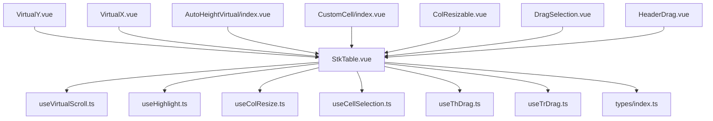
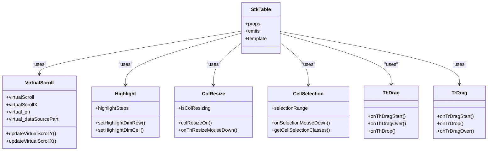
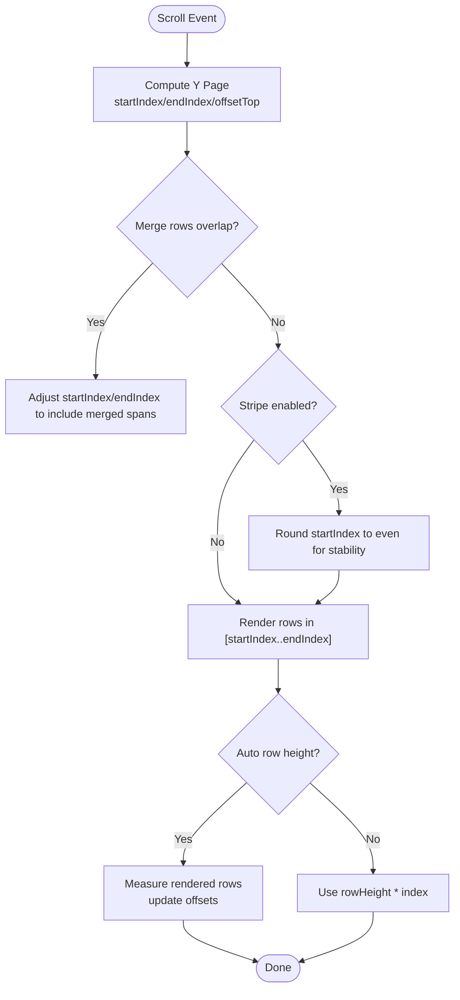
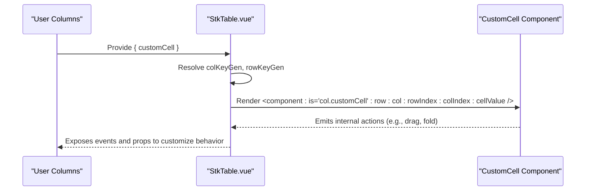
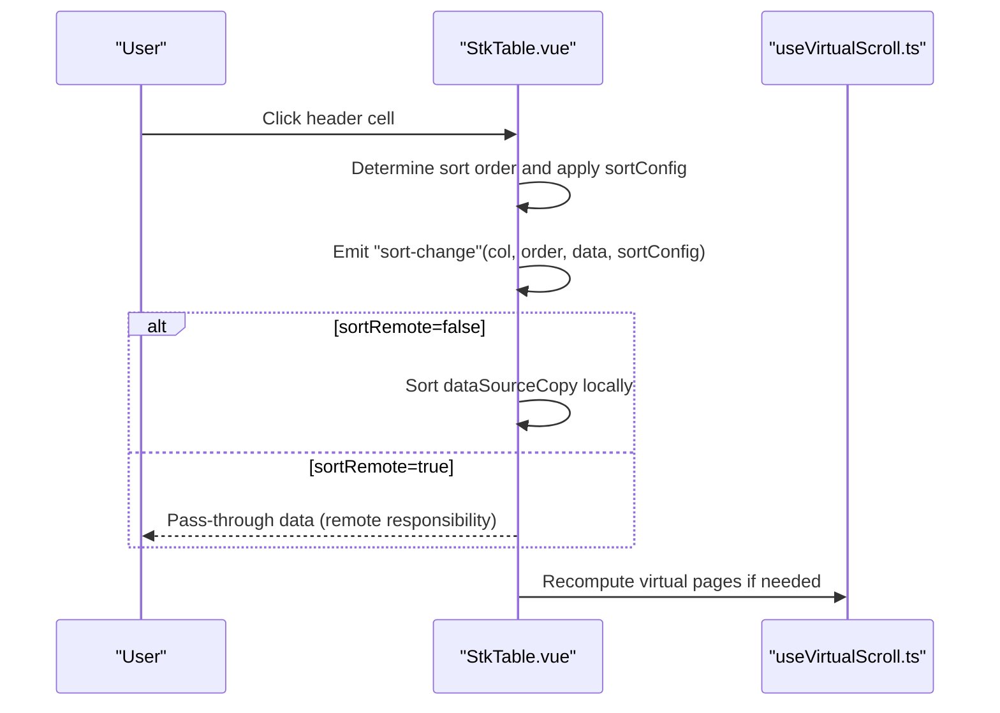
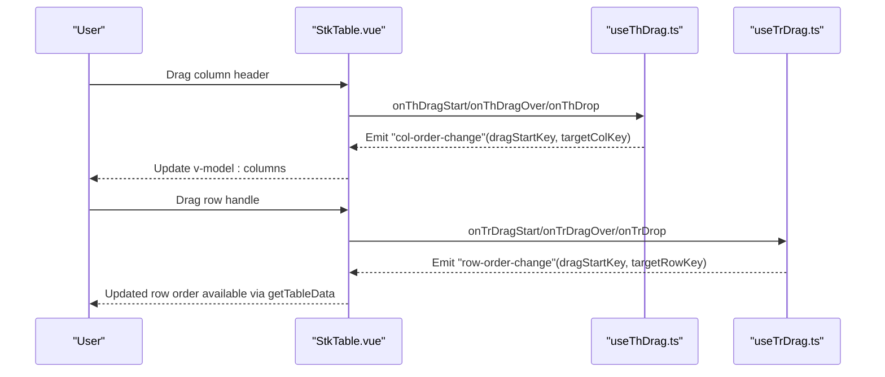
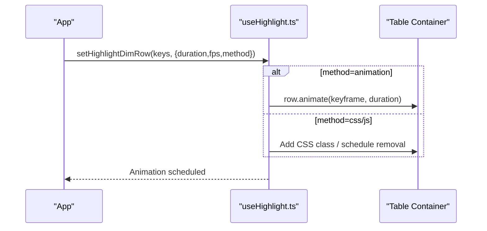
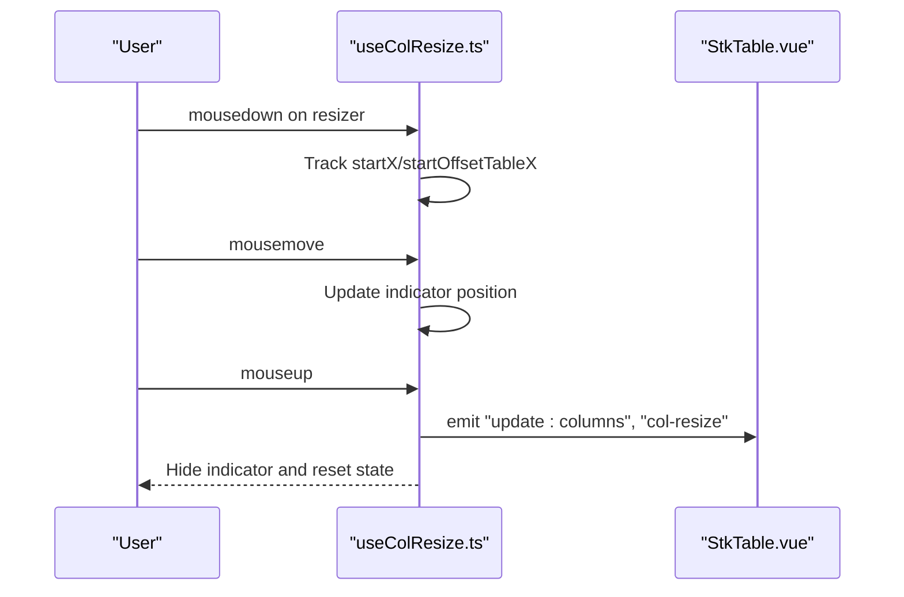
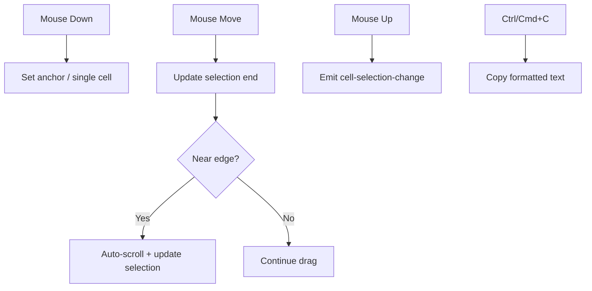
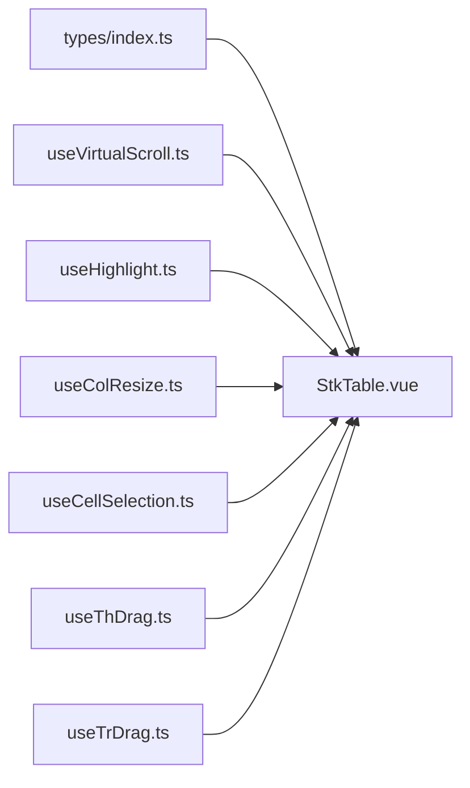

# Advanced Features

<cite>
**Referenced Files in This Document**
- [StkTable.vue](file://src/StkTable/StkTable.vue)
- [useVirtualScroll.ts](file://src/StkTable/useVirtualScroll.ts)
- [useHighlight.ts](file://src/StkTable/useHighlight.ts)
- [useColResize.ts](file://src/StkTable/useColResize.ts)
- [useCellSelection.ts](file://src/StkTable/useCellSelection.ts)
- [index.ts](file://src/StkTable/types/index.ts)
- [VirtualY.vue](file://docs-demo/advanced/virtual/VirtualY.vue)
- [VirtualX.vue](file://docs-demo/advanced/virtual/VirtualX.vue)
- [AutoHeightVirtual/index.vue](file://docs-demo/advanced/auto-height-virtual/AutoHeightVirtual/index.vue)
- [CustomCell/index.vue](file://docs-demo/advanced/custom-cell/CustomCell/index.vue)
- [ColResizable.vue](file://docs-demo/advanced/column-resize/ColResizable.vue)
- [DragSelection.vue](file://docs-demo/advanced/drag-selection/DragSelection.vue)
- [HeaderDrag.vue](file://docs-demo/advanced/header-drag/HeaderDrag.vue)
</cite>

## Table of Contents
1. [Introduction](#introduction)
2. [Project Structure](#project-structure)
3. [Core Components](#core-components)
4. [Architecture Overview](#architecture-overview)
5. [Detailed Component Analysis](#detailed-component-analysis)
6. [Dependency Analysis](#dependency-analysis)
7. [Performance Considerations](#performance-considerations)
8. [Troubleshooting Guide](#troubleshooting-guide)
9. [Conclusion](#conclusion)

## Introduction
This document explains advanced Stk Table Vue features with a focus on virtual scrolling (vertical, horizontal, auto-height), custom cell rendering (component-based and slot-based), advanced sorting, drag-and-drop for rows and columns, highlighting with animation options, column resizing, selection mechanisms, and complex interaction patterns. It also covers performance optimization techniques, memory management, and best practices for large datasets.

## Project Structure
The advanced features are implemented primarily in the core table component and composable hooks:
- Core template and props/events orchestrate rendering and interactions.
- Composables encapsulate cross-cutting concerns: virtual scrolling, highlighting, column resizing, cell selection, drag-and-drop, and more.
- Demo pages illustrate usage patterns for each feature.

**Diagram sources**
- [StkTable.vue](file://src/StkTable/StkTable.vue#L1-L200)
- [useVirtualScroll.ts](file://src/StkTable/useVirtualScroll.ts#L1-L120)
- [useHighlight.ts](file://src/StkTable/useHighlight.ts#L1-L120)
- [useColResize.ts](file://src/StkTable/useColResize.ts#L1-L120)
- [useCellSelection.ts](file://src/StkTable/useCellSelection.ts#L1-L120)
- [index.ts](file://src/StkTable/types/index.ts#L1-L120)
- [VirtualY.vue](file://docs-demo/advanced/virtual/VirtualY.vue#L1-L34)
- [VirtualX.vue](file://docs-demo/advanced/virtual/VirtualX.vue#L1-L29)
- [AutoHeightVirtual/index.vue](file://docs-demo/advanced/auto-height-virtual/AutoHeightVirtual/index.vue#L1-L42)
- [CustomCell/index.vue](file://docs-demo/advanced/custom-cell/CustomCell/index.vue#L1-L24)
- [ColResizable.vue](file://docs-demo/advanced/column-resize/ColResizable.vue#L1-L46)
- [DragSelection.vue](file://docs-demo/advanced/drag-selection/DragSelection.vue#L1-L59)
- [HeaderDrag.vue](file://docs-demo/advanced/header-drag/HeaderDrag.vue#L1-L39)

**Section sources**
- [StkTable.vue](file://src/StkTable/StkTable.vue#L1-L200)
- [index.ts](file://src/StkTable/types/index.ts#L1-L120)

## Core Components
- Virtual Scrolling: Centralized in useVirtualScroll with stores for vertical and horizontal paging, dynamic row height accounting, and optimized scroll handling for Vue 2 compatibility.
- Highlighting: useHighlight manages row and cell animations with CSS keyframes fallback and Web Animations API.
- Column Resizing: useColResize handles live indicator, min-width enforcement, and updates v-model:columns.
- Cell Selection: useCellSelection implements drag-to-select, keyboard shortcuts (copy), auto-scroll near edges, and normalized selection ranges.
- Drag-and-Drop: useThDrag and useTrDrag enable reordering via HTML5 drag events and emit col-order-change and row-order-change.

**Section sources**
- [useVirtualScroll.ts](file://src/StkTable/useVirtualScroll.ts#L1-L120)
- [useHighlight.ts](file://src/StkTable/useHighlight.ts#L1-L120)
- [useColResize.ts](file://src/StkTable/useColResize.ts#L1-L120)
- [useCellSelection.ts](file://src/StkTable/useCellSelection.ts#L1-L120)

## Architecture Overview
The table composes multiple hooks to handle advanced features while keeping the template declarative. Rendering is virtualized for large datasets, and interactions are coordinated through emitted events and shared refs.

**Diagram sources**
- [StkTable.vue](file://src/StkTable/StkTable.vue#L209-L621)
- [useVirtualScroll.ts](file://src/StkTable/useVirtualScroll.ts#L60-L120)
- [useHighlight.ts](file://src/StkTable/useHighlight.ts#L27-L80)
- [useColResize.ts](file://src/StkTable/useColResize.ts#L29-L80)
- [useCellSelection.ts](file://src/StkTable/useCellSelection.ts#L40-L100)
- [index.ts](file://src/StkTable/types/index.ts#L54-L120)

## Detailed Component Analysis

### Virtual Scrolling (Vertical, Horizontal, Auto Height)
- Vertical virtualization computes page size from container height and row height, tracks startIndex/endIndex, and offsets top padding. It supports auto row height by measuring rendered rows and adjusting offsets accordingly. A Vue 2 compatibility path defers updates to avoid white screen during fast scrolls.
- Horizontal virtualization tracks visible columns and preserves fixed-left/right columns outside the viewport. It calculates startIndex/endIndex and offsetLeft based on cumulative widths.
- Auto-height variant integrates with expandable rows and optional expected heights to compute accurate page boundaries.

**Diagram sources**
- [useVirtualScroll.ts](file://src/StkTable/useVirtualScroll.ts#L272-L403)

**Section sources**
- [useVirtualScroll.ts](file://src/StkTable/useVirtualScroll.ts#L1-L200)
- [useVirtualScroll.ts](file://src/StkTable/useVirtualScroll.ts#L200-L350)
- [useVirtualScroll.ts](file://src/StkTable/useVirtualScroll.ts#L350-L495)
- [VirtualY.vue](file://docs-demo/advanced/virtual/VirtualY.vue#L1-L34)
- [VirtualX.vue](file://docs-demo/advanced/virtual/VirtualX.vue#L1-L29)
- [AutoHeightVirtual/index.vue](file://docs-demo/advanced/auto-height-virtual/AutoHeightVirtual/index.vue#L1-L42)

### Custom Cell Rendering (Component-Based and Slot-Based)
- Component-based customization: Each column can specify customCell/customHeaderCell. The table renders either the provided component with typed props or falls back to default rendering. This enables rich, reusable cell components.
- Slot-based customization: Thead and body slots allow flexible markup injection for headers and cells.

**Diagram sources**
- [StkTable.vue](file://src/StkTable/StkTable.vue#L135-L153)
- [index.ts](file://src/StkTable/types/index.ts#L49-L120)
- [CustomCell/index.vue](file://docs-demo/advanced/custom-cell/CustomCell/index.vue#L1-L24)

**Section sources**
- [StkTable.vue](file://src/StkTable/StkTable.vue#L83-L171)
- [index.ts](file://src/StkTable/types/index.ts#L49-L120)
- [CustomCell/index.vue](file://docs-demo/advanced/custom-cell/CustomCell/index.vue#L1-L24)

### Advanced Sorting Capabilities
- Columns support sorter functions and per-column sortConfig. The table emits sort-change with the affected column, order, and data. Remote sorting is supported via sortRemote prop to prevent local mutation.
- Sorting integrates with header click handlers and maintains order cycling (null → desc → asc).

**Diagram sources**
- [StkTable.vue](file://src/StkTable/StkTable.vue#L478-L621)
- [index.ts](file://src/StkTable/types/index.ts#L185-L200)

**Section sources**
- [StkTable.vue](file://src/StkTable/StkTable.vue#L478-L621)
- [index.ts](file://src/StkTable/types/index.ts#L175-L200)

### Drag-and-Drop: Rows and Columns
- Column reordering: useThDrag coordinates dragstart/dragover/drop to emit col-order-change and update v-model:columns. Fixed columns are handled carefully to preserve layout.
- Row reordering: useTrDrag coordinates row-level drag-and-drop and emits row-order-change. The table’s template wires drag events on tbody/tr elements.

**Diagram sources**
- [StkTable.vue](file://src/StkTable/StkTable.vue#L53-L60)
- [StkTable.vue](file://src/StkTable/StkTable.vue#L73-L76)
- [StkTable.vue](file://src/StkTable/StkTable.vue#L115-L116)
- [HeaderDrag.vue](file://docs-demo/advanced/header-drag/HeaderDrag.vue#L1-L39)

**Section sources**
- [StkTable.vue](file://src/StkTable/StkTable.vue#L53-L60)
- [StkTable.vue](file://src/StkTable/StkTable.vue#L73-L76)
- [StkTable.vue](file://src/StkTable/StkTable.vue#L115-L116)
- [HeaderDrag.vue](file://docs-demo/advanced/header-drag/HeaderDrag.vue#L1-L39)

### Highlighting System with Animation Options
- Highlights animate rows or cells using Web Animations API with configurable duration and fps. For virtual mode, highlights are applied via Element.animate with iterationStart/iterations to resume from current time. CSS keyframes are supported as a fallback.
- The system tracks highlight state per row key and cleans up timers to prevent memory leaks.

**Diagram sources**
- [useHighlight.ts](file://src/StkTable/useHighlight.ts#L133-L166)
- [useHighlight.ts](file://src/StkTable/useHighlight.ts#L227-L250)

**Section sources**
- [useHighlight.ts](file://src/StkTable/useHighlight.ts#L1-L120)
- [useHighlight.ts](file://src/StkTable/useHighlight.ts#L120-L200)
- [useHighlight.ts](file://src/StkTable/useHighlight.ts#L200-L258)

### Column Resizing
- Enables live resizing with a draggable indicator. Min-width enforcement prevents collapsing columns. Updates v-model:columns and emits col-resize with the modified column.
- Handles fixed columns and reverse-direction adjustments for edge cases.

**Diagram sources**
- [useColResize.ts](file://src/StkTable/useColResize.ts#L83-L198)
- [ColResizable.vue](file://docs-demo/advanced/column-resize/ColResizable.vue#L1-L46)

**Section sources**
- [useColResize.ts](file://src/StkTable/useColResize.ts#L1-L120)
- [useColResize.ts](file://src/StkTable/useColResize.ts#L120-L215)
- [ColResizable.vue](file://docs-demo/advanced/column-resize/ColResizable.vue#L1-L46)

### Selection Mechanisms
- Drag-to-select supports Shift expansion and Ctrl/Cmd+C copy with optional custom formatter. Auto-scroll near edges improves UX when dragging selections beyond viewport bounds.
- The hook normalizes selection ranges and exposes helpers to compute selection classes for styling.

**Diagram sources**
- [useCellSelection.ts](file://src/StkTable/useCellSelection.ts#L132-L194)
- [useCellSelection.ts](file://src/StkTable/useCellSelection.ts#L209-L296)
- [useCellSelection.ts](file://src/StkTable/useCellSelection.ts#L307-L396)
- [DragSelection.vue](file://docs-demo/advanced/drag-selection/DragSelection.vue#L1-L59)

**Section sources**
- [useCellSelection.ts](file://src/StkTable/useCellSelection.ts#L1-L120)
- [useCellSelection.ts](file://src/StkTable/useCellSelection.ts#L120-L240)
- [useCellSelection.ts](file://src/StkTable/useCellSelection.ts#L240-L453)
- [DragSelection.vue](file://docs-demo/advanced/drag-selection/DragSelection.vue#L1-L59)

## Dependency Analysis
- StkTable.vue depends on multiple composable hooks for advanced features. Props and emits define the contract for each feature area.
- Types define the shape of columns, sorting, selection, and highlight configurations, ensuring strong typing across features.

**Diagram sources**
- [index.ts](file://src/StkTable/types/index.ts#L1-L120)
- [StkTable.vue](file://src/StkTable/StkTable.vue#L260-L267)

**Section sources**
- [index.ts](file://src/StkTable/types/index.ts#L1-L120)
- [StkTable.vue](file://src/StkTable/StkTable.vue#L260-L267)

## Performance Considerations
- Virtual scrolling reduces DOM nodes to visible items plus minimal padding. Prefer virtual for large datasets and set appropriate rowHeight or enable autoRowHeight with expectedHeight to minimize reflow.
- Horizontal virtualization requires explicit column widths to compute visibility efficiently.
- Highlight animations use requestAnimationFrame loops and cleanup timers to avoid memory leaks. Prefer animation method for smoother performance.
- Column resizing updates v-model:columns; batch updates and avoid frequent reflows by limiting unnecessary watchers.
- Selection auto-scroll uses requestAnimationFrame; disable if not needed to reduce CPU usage.
- For Vue 2, use optimizeVue2Scroll to defer updates during fast scrolls.

[No sources needed since this section provides general guidance]

## Troubleshooting Guide
- Virtual scroll not updating after data change: Ensure dataSource is reactive and call recomputation methods exposed by the virtual scroll store if needed.
- Auto height not respected: Provide expectedHeight in autoRowHeight or rely on measured heights; avoid toggling autoRowHeight mid-scroll.
- Highlight not visible: Verify theme color availability and duration/fps settings; confirm row keys match data row keys.
- Column resize not working: Ensure v-model:columns is bound and columns have width; min/max width constraints may prevent resizing.
- Selection copy not working: Confirm formatCellForClipboard returns strings and browser clipboard permissions are granted.
- Drag-and-drop not firing: Verify headerDrag and dragRowConfig are enabled; ensure event handlers are attached on thead/tr elements.

**Section sources**
- [useVirtualScroll.ts](file://src/StkTable/useVirtualScroll.ts#L241-L270)
- [useHighlight.ts](file://src/StkTable/useHighlight.ts#L133-L166)
- [useColResize.ts](file://src/StkTable/useColResize.ts#L163-L198)
- [useCellSelection.ts](file://src/StkTable/useCellSelection.ts#L347-L396)
- [StkTable.vue](file://src/StkTable/StkTable.vue#L570-L592)

## Conclusion
Stk Table Vue’s advanced features are modular and composable, enabling high-performance rendering and rich interactions. By leveraging virtual scrolling, component-based cell rendering, robust sorting, drag-and-drop, highlighting, resizing, and selection, applications can scale to very large datasets while maintaining responsiveness and usability. Follow the performance and troubleshooting guidance to ensure optimal runtime behavior.