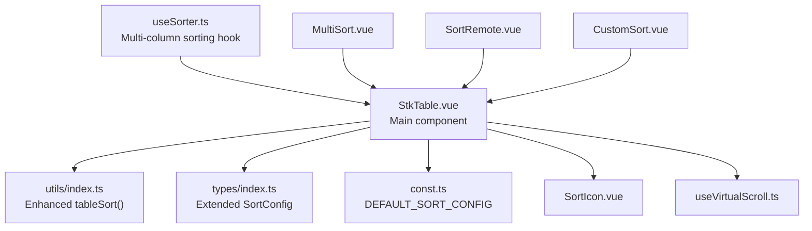
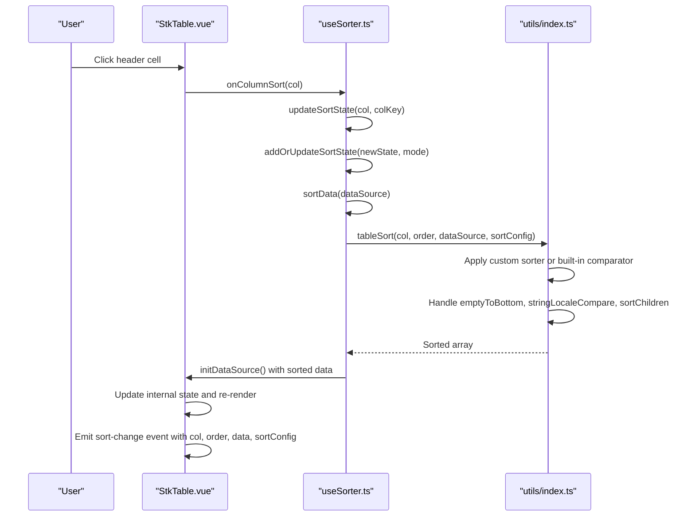
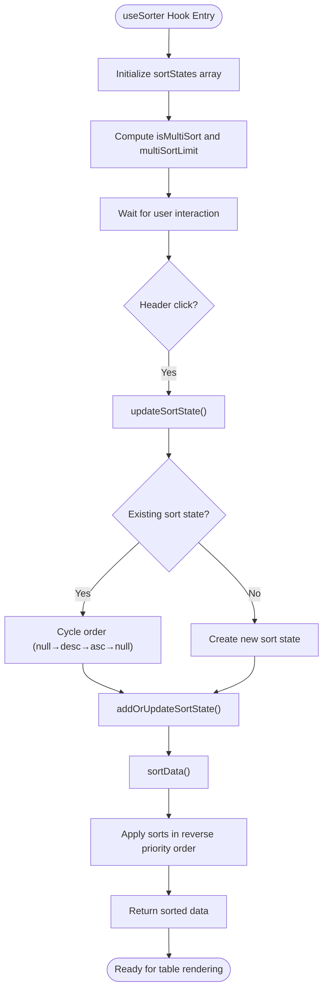
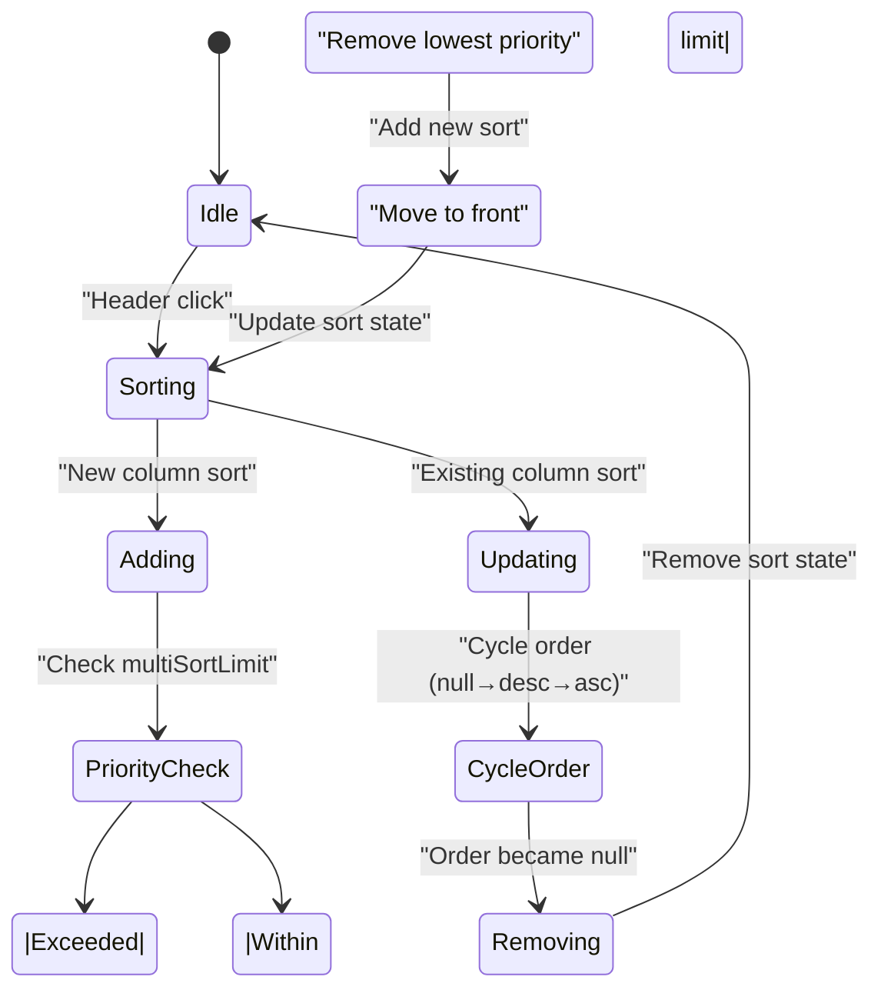
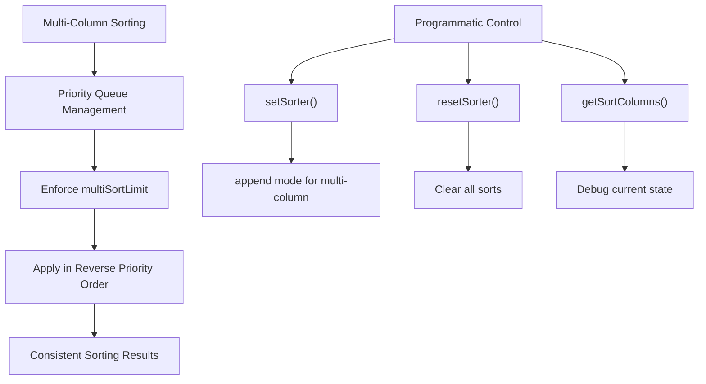
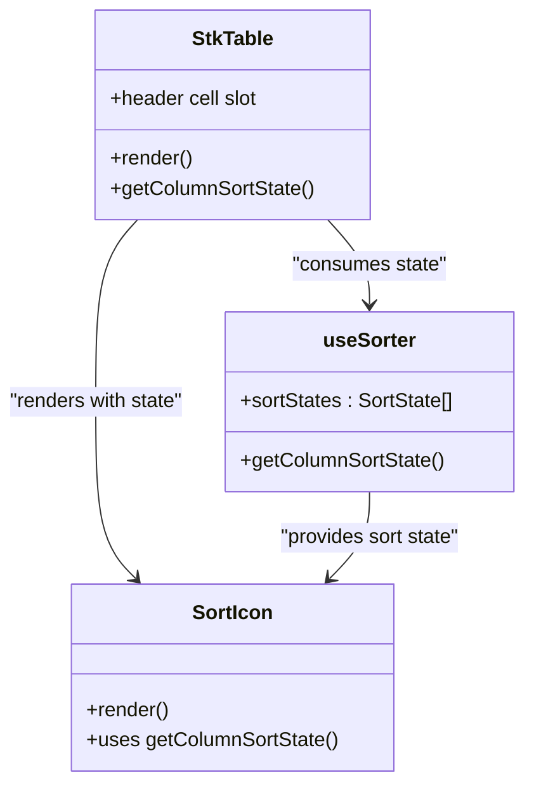
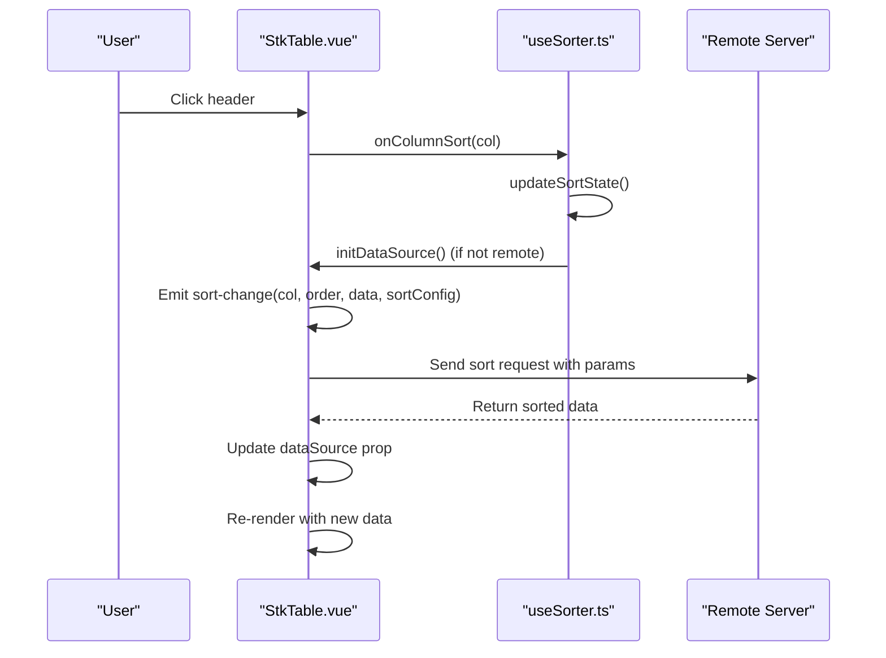
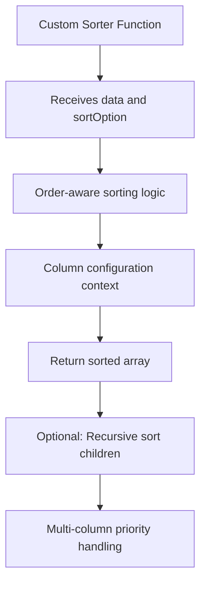
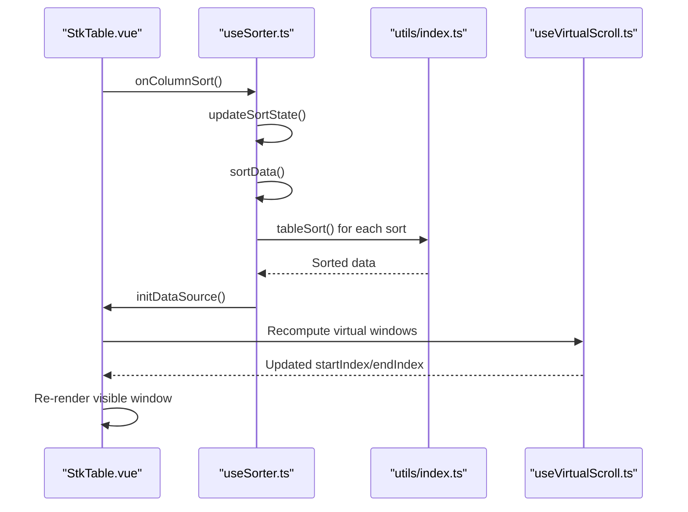
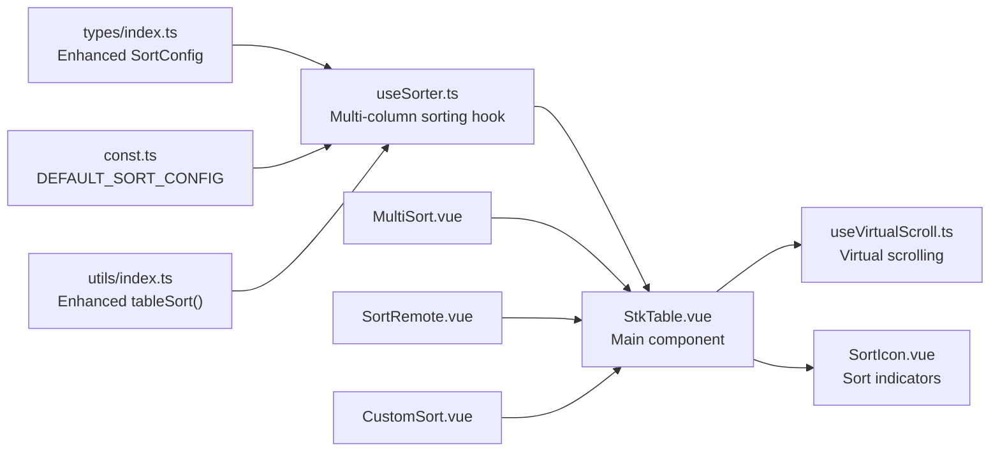

# Advanced Sorting

<cite>
**Referenced Files in This Document**
- [useSorter.ts](file://src/StkTable/useSorter.ts)
- [StkTable.vue](file://src/StkTable/StkTable.vue)
- [SortIcon.vue](file://src/StkTable/components/SortIcon.vue)
- [useVirtualScroll.ts](file://src/StkTable/useVirtualScroll.ts)
- [types/index.ts](file://src/StkTable/types/index.ts)
- [const.ts](file://src/StkTable/const.ts)
- [utils/index.ts](file://src/StkTable/utils/index.ts)
- [MultiSort.vue](file://docs-demo/basic/sort/MultiSort.vue)
- [SortRemote.vue](file://docs-demo/basic/sort/SortRemote.vue)
- [CustomSort.vue](file://docs-demo/basic/sort/CustomSort.vue)
- [DefaultSort.vue](file://docs-demo/basic/sort/DefaultSort.vue)
- [Sort.vue](file://docs-demo/basic/sort/Sort.vue)
</cite>

## Update Summary
**Changes Made**
- Complete overhaul of sorting architecture with new `useSorter.ts` hook replacing monolithic sorting approach
- Added comprehensive multi-column sorting capabilities with priority handling
- Enhanced sort state management with improved integration into table data flow
- Updated sort configuration with multiSort and multiSortLimit options
- Improved remote sorting integration with better event handling
- Added new sorting APIs: `setSorter`, `resetSorter`, `getSortColumns`, `getColumnSortState`

## Table of Contents
1. [Introduction](#introduction)
2. [Project Structure](#project-structure)
3. [Core Components](#core-components)
4. [Architecture Overview](#architecture-overview)
5. [Detailed Component Analysis](#detailed-component-analysis)
6. [Dependency Analysis](#dependency-analysis)
7. [Performance Considerations](#performance-considerations)
8. [Troubleshooting Guide](#troubleshooting-guide)
9. [Conclusion](#conclusion)
10. [Appendices](#appendices)

## Introduction
This document explains advanced sorting capabilities in Stk Table Vue, focusing on the new modular sorting architecture centered around the `useSorter.ts` hook. It covers multi-column sorting with priority handling, improved sort state management, and enhanced remote sorting integration. The document details sort state management, sort direction indicators, and performance optimization strategies for large datasets. Practical examples demonstrate complex sorting logic, handling sort conflicts with virtual scrolling, and creating custom sort icons and behaviors.

## Project Structure
The sorting system has been completely redesigned with a modular architecture:
- **useSorter.ts**: New hook managing multi-column sorting state and operations
- **StkTable.vue**: Main component consuming the useSorter hook
- **SortIcon.vue**: Sort indicator component integrated with multi-column state
- **Sorting utilities**: Enhanced tableSort() with improved tree recursion support
- **Types and configuration**: Extended SortConfig with multiSort capabilities
- **Virtual scrolling integration**: Optimized for multi-column sorting scenarios
- **Demo usage**: Updated examples demonstrating new multi-column sorting features

**Diagram sources**
- [useSorter.ts:22-262](file://src/StkTable/useSorter.ts#L22-L262)
- [StkTable.vue:819-826](file://src/StkTable/StkTable.vue#L819-L826)
- [utils/index.ts:153-207](file://src/StkTable/utils/index.ts#L153-L207)
- [types/index.ts:232-267](file://src/StkTable/types/index.ts#L232-L267)
- [const.ts:40-44](file://src/StkTable/const.ts#L40-L44)
- [SortIcon.vue:1-7](file://src/StkTable/components/SortIcon.vue#L1-L7)
- [useVirtualScroll.ts:1-120](file://src/StkTable/useVirtualScroll.ts#L1-L120)
- [MultiSort.vue:1-100](file://docs-demo/basic/sort/MultiSort.vue#L1-L100)
- [SortRemote.vue:1-67](file://docs-demo/basic/sort/SortRemote.vue#L1-L67)

**Section sources**
- [useSorter.ts:1-263](file://src/StkTable/useSorter.ts#L1-L263)
- [StkTable.vue:818-826](file://src/StkTable/StkTable.vue#L818-L826)
- [utils/index.ts:153-207](file://src/StkTable/utils/index.ts#L153-L207)
- [types/index.ts:232-267](file://src/StkTable/types/index.ts#L232-L267)
- [const.ts:40-44](file://src/StkTable/const.ts#L40-L44)
- [SortIcon.vue:1-7](file://src/StkTable/components/SortIcon.vue#L1-L7)
- [useVirtualScroll.ts:1-120](file://src/StkTable/useVirtualScroll.ts#L1-L120)
- [MultiSort.vue:1-100](file://docs-demo/basic/sort/MultiSort.vue#L1-L100)
- [SortRemote.vue:1-67](file://docs-demo/basic/sort/SortRemote.vue#L1-L67)

## Core Components
The new sorting architecture introduces several key components:

### useSorter Hook
- **Purpose**: Manages multi-column sorting state and operations
- **Features**: 
  - Multi-column sorting with configurable limits
  - Dynamic sort state management with priority handling
  - Integration with table data flow and virtual scrolling
  - Enhanced remote sorting support
- **API**: Returns comprehensive sorting functions and reactive state

### Enhanced Sort State Management
- **Multi-column support**: Maintains array of SortState entries with priority ordering
- **Dynamic limits**: Configurable maximum number of simultaneous sorts
- **Priority handling**: Automatic reordering based on interaction sequence
- **State persistence**: Robust state management across component lifecycle

### Improved Sort Configuration
- **multiSort**: Enables/disables multi-column sorting mode
- **multiSortLimit**: Controls maximum number of concurrent sorts (default: 3)
- **Enhanced defaultSort**: Better integration with multi-column scenarios

**Section sources**
- [useSorter.ts:22-262](file://src/StkTable/useSorter.ts#L22-L262)
- [types/index.ts:257-267](file://src/StkTable/types/index.ts#L257-L267)
- [StkTable.vue:819-826](file://src/StkTable/StkTable.vue#L819-L826)

## Architecture Overview
The new sorting architecture follows a clean separation of concerns with the useSorter hook handling all sorting logic while StkTable.vue focuses on UI integration.

**Diagram sources**
- [StkTable.vue:1339-1342](file://src/StkTable/StkTable.vue#L1339-L1342)
- [useSorter.ts:83-116](file://src/StkTable/useSorter.ts#L83-L116)
- [useSorter.ts:122-139](file://src/StkTable/useSorter.ts#L122-L139)
- [utils/index.ts:153-207](file://src/StkTable/utils/index.ts#L153-L207)

## Detailed Component Analysis

### useSorter Hook Implementation
The useSorter hook provides comprehensive multi-column sorting capabilities:

#### Key Features:
- **Multi-column state management**: Maintains `sortStates` array with priority ordering
- **Dynamic sort addition**: Supports adding new sorts while maintaining limits
- **Priority handling**: Automatically moves active sorts to front with highest priority
- **Enhanced configuration**: Integrates with both global and column-specific sort settings

#### State Management:
- **sortStates**: Reactive array of active sort configurations
- **isMultiSort**: Computed property determining multi-column mode
- **multiSortLimit**: Configurable limit for concurrent sorts (default: 3)

#### Core Methods:
- **updateSortState()**: Handles header click interactions and order cycling
- **addOrUpdateSortState()**: Manages sort state array with priority preservation
- **sortData()**: Applies multi-column sorting with proper priority handling
- **setSorter()**: Programmatic sorting control with append mode support

**Diagram sources**
- [useSorter.ts:30-139](file://src/StkTable/useSorter.ts#L30-L139)

**Section sources**
- [useSorter.ts:22-262](file://src/StkTable/useSorter.ts#L22-L262)

### Enhanced Sort State Management and Direction Cycling
The new architecture improves upon the previous single-column approach:

#### Multi-column State Handling:
- **Priority-based ordering**: Active sorts are maintained in priority order (first item has highest priority)
- **Automatic reordering**: When a column is clicked, it moves to the front of the sort queue
- **Limit enforcement**: Enforces `multiSortLimit` to prevent excessive concurrent sorts
- **Smart removal**: When order becomes null, removes the sort state entirely

#### Direction Cycling Logic:
- **Three-state cycle**: null → desc → asc → null (cycle continues indefinitely)
- **Smart default handling**: When removing a sort, automatically applies defaultSort if configured
- **Consistent behavior**: Same cycling logic works for both single and multi-column modes

**Diagram sources**
- [useSorter.ts:83-116](file://src/StkTable/useSorter.ts#L83-L116)
- [useSorter.ts:61-78](file://src/StkTable/useSorter.ts#L61-L78)

**Section sources**
- [useSorter.ts:83-116](file://src/StkTable/useSorter.ts#L83-L116)
- [useSorter.ts:61-78](file://src/StkTable/useSorter.ts#L61-L78)

### Multi-Column Sorting with Priority Handling
The new implementation fully supports multi-column sorting with sophisticated priority management:

#### Priority System:
- **Front-to-back priority**: First item in array has highest priority, last has lowest
- **Reverse application**: Sorting applies from lowest priority to highest priority
- **Stable results**: Ensures consistent sorting behavior across different priorities

#### Configuration Options:
- **multiSort**: Enables multi-column sorting mode (default: false)
- **multiSortLimit**: Maximum number of concurrent sorts (default: 3)
- **Flexible interaction**: Supports both single-click (replace) and modifier-click (append) behaviors

#### Programmatic Control:
- **setSorter()**: Primary method for programmatic sorting control
- **append mode**: When `append: true`, adds sort without clearing others
- **resetSorter()**: Clears all active sorts and restores default state
- **getSortColumns()**: Retrieves current sort configuration for debugging

**Diagram sources**
- [useSorter.ts:122-139](file://src/StkTable/useSorter.ts#L122-L139)
- [useSorter.ts:189-234](file://src/StkTable/useSorter.ts#L189-L234)
- [MultiSort.vue:51-66](file://docs-demo/basic/sort/MultiSort.vue#L51-L66)

**Section sources**
- [useSorter.ts:122-139](file://src/StkTable/useSorter.ts#L122-L139)
- [useSorter.ts:189-234](file://src/StkTable/useSorter.ts#L189-L234)
- [MultiSort.vue:51-66](file://docs-demo/basic/sort/MultiSort.vue#L51-L66)

### Enhanced Sort Direction Indicators and Icons
The SortIcon component now integrates seamlessly with the new multi-column sorting system:

#### Enhanced Integration:
- **Dynamic state detection**: Uses `getColumnSortState()` to determine current sort state
- **Priority indication**: Visual indicators show which sorts are active and their order
- **Consistent styling**: Applies appropriate CSS classes based on sort state and order

#### UI State Management:
- **isSorted flag**: Determines if a column is currently sorted
- **sorter-{order} class**: Applies specific classes for asc/desc/null states
- **Conditional rendering**: Only shows sort indicators for sortable columns

**Diagram sources**
- [StkTable.vue:1177-1196](file://src/StkTable/StkTable.vue#L1177-L1196)
- [useSorter.ts:45-47](file://src/StkTable/useSorter.ts#L45-L47)

**Section sources**
- [StkTable.vue:1177-1196](file://src/StkTable/StkTable.vue#L1177-L1196)
- [useSorter.ts:45-47](file://src/StkTable/useSorter.ts#L45-L47)

### Enhanced Remote Sorting Integration
The new architecture provides improved remote sorting capabilities:

#### Enhanced Event Handling:
- **Comprehensive data**: sort-change event now includes complete sort configuration
- **Multi-column support**: Properly handles multi-column sort state in remote scenarios
- **Silent mode**: Supports silent sorting without emitting events for programmatic control

#### Configuration Options:
- **sortRemote**: Enables server-side sorting mode
- **force option**: Allows bypassing remote mode for specific operations
- **silent option**: Prevents sort-change events for internal operations

#### Integration Patterns:
- **Server communication**: sort-change handler receives complete sort information
- **Data refresh**: External sorting updates dataSource prop to refresh table
- **Progress indication**: Can show loading states during remote sorting operations

**Diagram sources**
- [StkTable.vue:1339-1342](file://src/StkTable/StkTable.vue#L1339-L1342)
- [useSorter.ts:144-184](file://src/StkTable/useSorter.ts#L144-L184)
- [SortRemote.vue:26-55](file://docs-demo/basic/sort/SortRemote.vue#L26-L55)

**Section sources**
- [StkTable.vue:1339-1342](file://src/StkTable/StkTable.vue#L1339-L1342)
- [useSorter.ts:144-184](file://src/StkTable/useSorter.ts#L144-L184)
- [SortRemote.vue:26-55](file://docs-demo/basic/sort/SortRemote.vue#L26-L55)

### Enhanced Custom Sort Implementations
The new architecture maintains backward compatibility while extending custom sorting capabilities:

#### Enhanced Custom Sorter Interface:
- **Order awareness**: Custom sorters receive current order in sortOption parameter
- **Column context**: Access to complete column configuration in custom sorters
- **Integration points**: Works seamlessly with both single and multi-column modes

#### Examples and Patterns:
- **CustomSort.vue**: Demonstrates complex rating-based sorting with ordered arrays
- **DefaultSort.vue**: Shows defaultSort initialization with enhanced multi-column support
- **Sort.vue**: Basic sortable columns with improved state management

**Diagram sources**
- [utils/index.ts:172-182](file://src/StkTable/utils/index.ts#L172-L182)
- [CustomSort.vue:17-26](file://docs-demo/basic/sort/CustomSort.vue#L17-L26)

**Section sources**
- [utils/index.ts:172-182](file://src/StkTable/utils/index.ts#L172-L182)
- [CustomSort.vue:17-26](file://docs-demo/basic/sort/CustomSort.vue#L17-L26)
- [DefaultSort.vue:32-39](file://docs-demo/basic/sort/DefaultSort.vue#L32-L39)
- [Sort.vue:16-20](file://docs-demo/basic/sort/Sort.vue#L16-L20)

### Enhanced Handling Sort Conflicts with Virtual Scrolling
The new architecture optimizes virtual scrolling performance with multi-column sorting:

#### Performance Optimizations:
- **Efficient state updates**: Minimal reactive updates when sorting state changes
- **Batched operations**: Combines sorting and virtual scroll updates for optimal performance
- **Memory management**: Proper cleanup of sort state during component lifecycle

#### Integration Points:
- **sortData() method**: Centralized sorting logic for virtual scroll integration
- **initDataSource()**: Handles both sorting and virtual scroll initialization
- **State synchronization**: Ensures sort state and virtual scroll window stay in sync

**Diagram sources**
- [StkTable.vue:1007-1020](file://src/StkTable/StkTable.vue#L1007-L1020)
- [useSorter.ts:122-139](file://src/StkTable/useSorter.ts#L122-L139)
- [useVirtualScroll.ts:103-124](file://src/StkTable/useVirtualScroll.ts#L103-L124)

**Section sources**
- [StkTable.vue:1007-1020](file://src/StkTable/StkTable.vue#L1007-L1020)
- [useSorter.ts:122-139](file://src/StkTable/useSorter.ts#L122-L139)
- [useVirtualScroll.ts:103-124](file://src/StkTable/useVirtualScroll.ts#L103-L124)

### Enhanced Creating Custom Sort Icons and Behaviors
The new architecture provides better foundation for custom sort icon implementations:

#### Integration Points:
- **getColumnSortState()**: Access to current sort state for custom icon logic
- **Multi-column awareness**: Custom icons can show multiple active sorts
- **Priority indication**: Visual representation of sort priority order

#### Customization Options:
- **Multi-state indicators**: Show multiple active sorts with priority markers
- **Interactive behaviors**: Click handlers for opening sort menus or managing sort priority
- **Accessibility improvements**: Enhanced keyboard navigation and screen reader support

**Section sources**
- [StkTable.vue:1177-1196](file://src/StkTable/StkTable.vue#L1177-L1196)
- [useSorter.ts:45-47](file://src/StkTable/useSorter.ts#L45-L47)

## Dependency Analysis
The new architecture creates clean dependencies between components:

**Diagram sources**
- [types/index.ts:232-267](file://src/StkTable/types/index.ts#L232-L267)
- [useSorter.ts:22-29](file://src/StkTable/useSorter.ts#L22-L29)
- [const.ts:40-44](file://src/StkTable/const.ts#L40-L44)
- [utils/index.ts:153-207](file://src/StkTable/utils/index.ts#L153-L207)
- [StkTable.vue:819-826](file://src/StkTable/StkTable.vue#L819-L826)
- [useVirtualScroll.ts:1-120](file://src/StkTable/useVirtualScroll.ts#L1-L120)
- [SortIcon.vue:1-7](file://src/StkTable/components/SortIcon.vue#L1-L7)
- [MultiSort.vue:1-100](file://docs-demo/basic/sort/MultiSort.vue#L1-L100)
- [SortRemote.vue:1-67](file://docs-demo/basic/sort/SortRemote.vue#L1-L67)
- [CustomSort.vue:1-50](file://docs-demo/basic/sort/CustomSort.vue#L1-L50)

**Section sources**
- [types/index.ts:232-267](file://src/StkTable/types/index.ts#L232-L267)
- [useSorter.ts:22-29](file://src/StkTable/useSorter.ts#L22-L29)
- [const.ts:40-44](file://src/StkTable/const.ts#L40-L44)
- [utils/index.ts:153-207](file://src/StkTable/utils/index.ts#L153-L207)
- [StkTable.vue:819-826](file://src/StkTable/StkTable.vue#L819-L826)
- [useVirtualScroll.ts:1-120](file://src/StkTable/useVirtualScroll.ts#L1-L120)
- [SortIcon.vue:1-7](file://src/StkTable/components/SortIcon.vue#L1-L7)
- [MultiSort.vue:1-100](file://docs-demo/basic/sort/MultiSort.vue#L1-L100)
- [SortRemote.vue:1-67](file://docs-demo/basic/sort/SortRemote.vue#L1-L67)
- [CustomSort.vue:1-50](file://docs-demo/basic/sort/CustomSort.vue#L1-L50)

## Performance Considerations
The new architecture introduces several performance optimizations:

### Memory Optimization:
- **Efficient state storage**: sortStates array uses minimal memory footprint
- **Lazy evaluation**: Sort operations only performed when needed
- **Proper cleanup**: Sort state cleared during component unmount

### Computational Efficiency:
- **Multi-column optimization**: Single pass through data with multiple sort applications
- **Priority-based sorting**: Reduces unnecessary comparisons through proper priority handling
- **Virtual scroll integration**: Optimized for large datasets with virtual scrolling

### Network Performance (Remote Sorting):
- **Debounced requests**: Prevents excessive server requests during rapid sorting
- **Batched operations**: Combines multiple sort changes into single requests
- **Caching strategies**: Potential for client-side caching of sorted results

### Large Dataset Handling:
- **Virtual scrolling**: Essential for performance with multi-column sorting
- **Incremental sorting**: Sorts only visible data when possible
- **Memory management**: Proper cleanup of sort state during pagination

## Troubleshooting Guide
Common issues with the new multi-column sorting system:

### Multi-column Sorting Issues:
- **Sort not applying**: Verify multiSort is enabled in sortConfig
- **Sort limit exceeded**: Check multiSortLimit configuration (default: 3)
- **Priority confusion**: Remember that first item has highest priority
- **State not updating**: Ensure proper use of setSorter() for programmatic control

### Performance Issues:
- **Slow sorting**: Verify virtual scrolling is enabled for large datasets
- **Memory leaks**: Check that sort state is properly cleaned up
- **UI lag**: Consider debouncing sort operations for frequent changes

### Integration Problems:
- **Event handling**: Ensure sort-change event handlers properly process multi-column data
- **Remote sorting**: Verify server-side sorting logic handles multiple sort criteria
- **State synchronization**: Check that sort state and table data remain in sync

### Custom Sorter Issues:
- **Order detection**: Custom sorters receive order in sortOption parameter
- **Configuration access**: Access column-specific sortConfig through sortOption
- **Tree recursion**: Ensure proper handling of sortChildren for hierarchical data

**Section sources**
- [useSorter.ts:34-37](file://src/StkTable/useSorter.ts#L34-L37)
- [useSorter.ts:189-234](file://src/StkTable/useSorter.ts#L189-L234)
- [StkTable.vue:1007-1020](file://src/StkTable/StkTable.vue#L1007-L1020)

## Conclusion
The new Stk Table Vue sorting system represents a significant architectural improvement with the introduction of the useSorter hook. The modular design provides comprehensive multi-column sorting capabilities while maintaining excellent performance and developer experience. Key improvements include:

- **Complete overhaul**: Replaced monolithic sorting approach with clean, modular architecture
- **Multi-column support**: Full-featured multi-column sorting with priority handling
- **Enhanced state management**: Robust sort state management with automatic priority handling
- **Improved integration**: Better integration with table data flow and virtual scrolling
- **Remote sorting**: Enhanced remote sorting capabilities with comprehensive event handling
- **Performance optimization**: Optimized for large datasets and complex sorting scenarios

The new system provides a solid foundation for advanced sorting scenarios while maintaining backward compatibility and ease of use for simple sorting requirements.

## Appendices

### API and Configuration Summary
**Enhanced SortConfig Options**:
- **multiSort**: Enables multi-column sorting mode (default: false)
- **multiSortLimit**: Maximum concurrent sorts (default: 3)
- **Enhanced defaultSort**: Better integration with multi-column scenarios

**New useSorter Hook Exposed Methods**:
- **sortStates**: Reactive array of active sort configurations
- **sortCol**: Computed property for current primary sort column
- **onColumnSort()**: Header click handler for sorting
- **setSorter()**: Programmatic sorting control with append mode
- **resetSorter()**: Clear all active sorts
- **getSortColumns()**: Retrieve current sort configuration
- **dealDefaultSorter()**: Apply default sort configuration
- **getColumnSortState()**: Get state for specific column
- **sortData()**: Apply multi-column sorting to data

**Enhanced SortState Structure**:
- **key**: Column key identifier
- **dataIndex**: Data field being sorted
- **sortField**: Override field for sorting
- **sortType**: Data type ('number' | 'string')
- **order**: Current sort order (null | 'asc' | 'desc')

**Section sources**
- [types/index.ts:257-267](file://src/StkTable/types/index.ts#L257-L267)
- [useSorter.ts:261-261](file://src/StkTable/useSorter.ts#L261-L261)
- [StkTable.vue:1643-1670](file://src/StkTable/StkTable.vue#L1643-L1670)