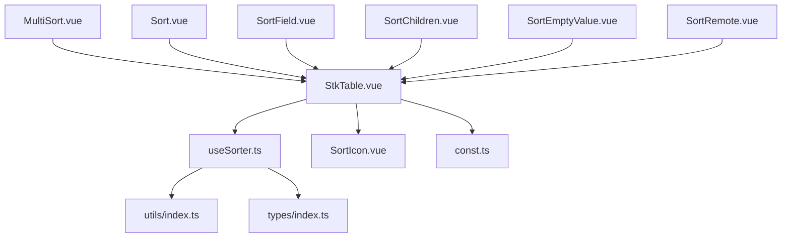
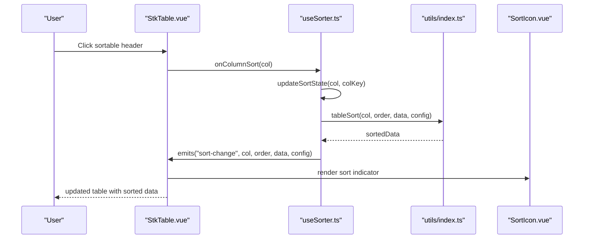
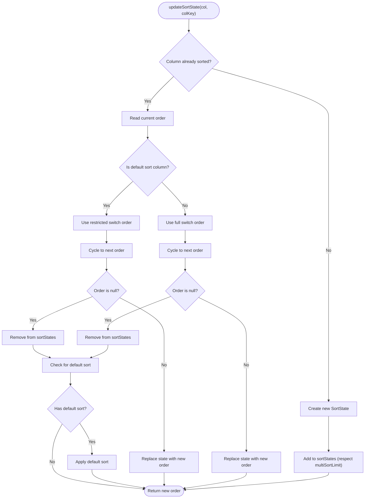
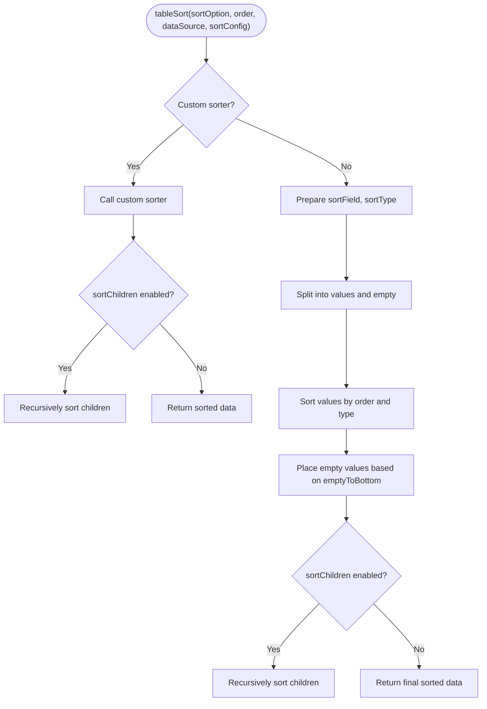
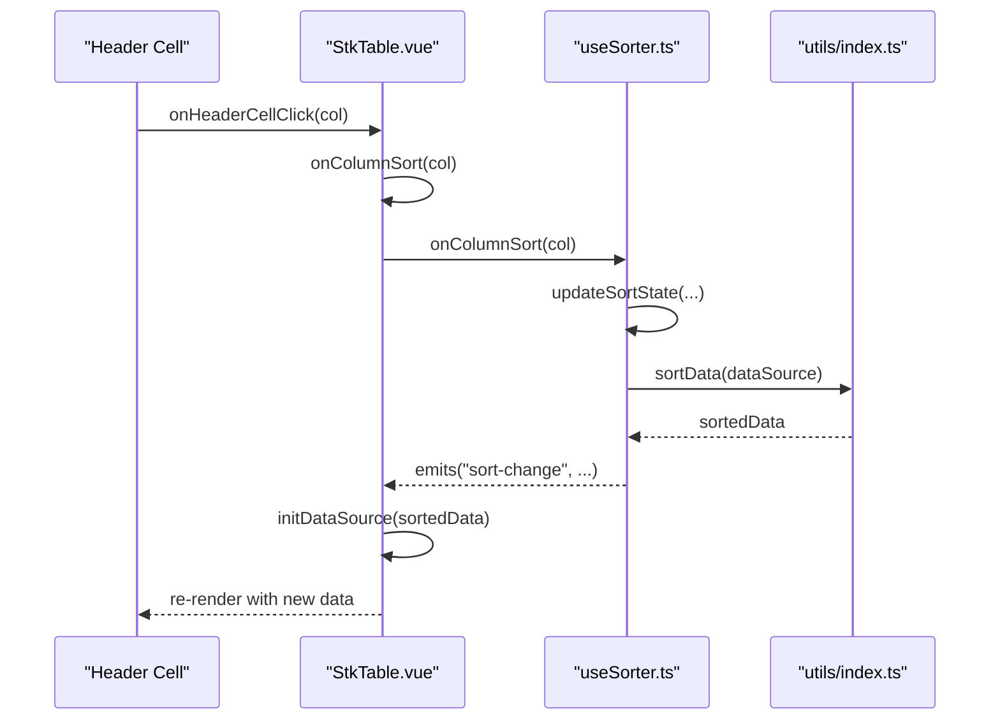
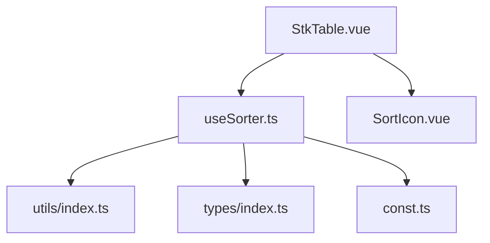

# Multi-Column Sorting

<cite>
**Referenced Files in This Document**
- [useSorter.ts](file://src/StkTable/useSorter.ts)
- [utils/index.ts](file://src/StkTable/utils/index.ts)
- [types/index.ts](file://src/StkTable/types/index.ts)
- [const.ts](file://src/StkTable/const.ts)
- [StkTable.vue](file://src/StkTable/StkTable.vue)
- [SortIcon.vue](file://src/StkTable/components/SortIcon.vue)
- [MultiSort.vue](file://docs-demo/basic/sort/MultiSort.vue)
- [Sort.vue](file://docs-demo/basic/sort/Sort.vue)
- [SortField.vue](file://docs-demo/basic/sort/SortField.vue)
- [SortChildren.vue](file://docs-demo/basic/sort/SortChildren.vue)
- [SortEmptyValue.vue](file://docs-demo/basic/sort/SortEmptyValue.vue)
- [SortRemote.vue](file://docs-demo/basic/sort/SortRemote.vue)
</cite>

## Update Summary
**Changes Made**
- Enhanced sorting cycle logic with improved default sort integration
- Refined state management for both default and regular columns
- Improved multi-column sorting state handling and limit enforcement
- Better default sort fallback mechanism when canceling sorts

## Table of Contents
1. [Introduction](#introduction)
2. [Project Structure](#project-structure)
3. [Core Components](#core-components)
4. [Architecture Overview](#architecture-overview)
5. [Detailed Component Analysis](#detailed-component-analysis)
6. [Dependency Analysis](#dependency-analysis)
7. [Performance Considerations](#performance-considerations)
8. [Troubleshooting Guide](#troubleshooting-guide)
9. [Conclusion](#conclusion)

## Introduction
This document explains the multi-column sorting feature in the table component. It covers how sorting states are managed, how multiple columns can be sorted simultaneously, and how the system integrates with the table rendering pipeline. The implementation supports both single-column and multi-column sorting modes, custom sorters, remote sorting, and advanced options like empty value placement and recursive sorting of tree nodes.

**Updated** Enhanced with improved state management for default sort configurations and refined sorting cycle logic that better distinguishes between default and regular columns.

## Project Structure
The multi-column sorting feature spans several modules:
- Core sorting logic and state management
- Utility functions for sorting arrays
- Type definitions for sorting configuration and state
- Table integration and UI rendering
- Demo implementations showcasing various sorting scenarios

**Diagram sources**
- [StkTable.vue](file://src/StkTable/StkTable.vue)
- [useSorter.ts](file://src/StkTable/useSorter.ts)
- [utils/index.ts](file://src/StkTable/utils/index.ts)
- [types/index.ts](file://src/StkTable/types/index.ts)
- [const.ts](file://src/StkTable/const.ts)
- [SortIcon.vue](file://src/StkTable/components/SortIcon.vue)
- [MultiSort.vue](file://docs-demo/basic/sort/MultiSort.vue)
- [Sort.vue](file://docs-demo/basic/sort/Sort.vue)
- [SortField.vue](file://docs-demo/basic/sort/SortField.vue)
- [SortChildren.vue](file://docs-demo/basic/sort/SortChildren.vue)
- [SortEmptyValue.vue](file://docs-demo/basic/sort/SortEmptyValue.vue)
- [SortRemote.vue](file://docs-demo/basic/sort/SortRemote.vue)

**Section sources**
- [StkTable.vue](file://src/StkTable/StkTable.vue)
- [useSorter.ts](file://src/StkTable/useSorter.ts)
- [utils/index.ts](file://src/StkTable/utils/index.ts)
- [types/index.ts](file://src/StkTable/types/index.ts)
- [const.ts](file://src/StkTable/const.ts)
- [SortIcon.vue](file://src/StkTable/components/SortIcon.vue)
- [MultiSort.vue](file://docs-demo/basic/sort/MultiSort.vue)
- [Sort.vue](file://docs-demo/basic/sort/Sort.vue)
- [SortField.vue](file://docs-demo/basic/sort/SortField.vue)
- [SortChildren.vue](file://docs-demo/basic/sort/SortChildren.vue)
- [SortEmptyValue.vue](file://docs-demo/basic/sort/SortEmptyValue.vue)
- [SortRemote.vue](file://docs-demo/basic/sort/SortRemote.vue)

## Core Components
- Sorting state manager: maintains an ordered list of active sorts and exposes methods to update, query, and reset sorting.
- Sorting utility: performs actual array sorting with support for custom comparators, locale-aware string comparison, and empty value placement.
- Table integration: wires sorting events to the table UI, updates data source, and renders sort indicators.

Key capabilities:
- Single-column vs multi-column sorting modes
- Configurable multi-column limit
- Default sort fallback
- Remote sorting support
- Recursive sorting for tree structures
- Empty value placement control

**Updated** Enhanced state management now includes improved sorting cycle logic that properly handles default sort columns differently from regular columns, with separate switch orders for each type.

**Section sources**
- [useSorter.ts](file://src/StkTable/useSorter.ts)
- [utils/index.ts](file://src/StkTable/utils/index.ts)
- [types/index.ts](file://src/StkTable/types/index.ts)
- [const.ts](file://src/StkTable/const.ts)
- [StkTable.vue](file://src/StkTable/StkTable.vue)

## Architecture Overview
The sorting architecture consists of a stateful hook that manages sort states, a sorting utility that applies sort orders to data, and the table component that triggers sorting actions and renders sort indicators.

**Diagram sources**
- [StkTable.vue](file://src/StkTable/StkTable.vue)
- [useSorter.ts](file://src/StkTable/useSorter.ts)
- [utils/index.ts](file://src/StkTable/utils/index.ts)
- [SortIcon.vue](file://src/StkTable/components/SortIcon.vue)

## Detailed Component Analysis

### Sorting State Management (`useSorter.ts`)
Responsibilities:
- Track active sort states as an ordered array
- Toggle sort order per column (null → desc → asc → null)
- Enforce multi-column mode and limits
- Apply default sort when canceling
- Emit sort-change events and return sorted data

**Updated** Enhanced with improved sorting cycle logic that distinguishes between default sort columns and regular columns. Default sort columns use a restricted switch order (null → desc → asc) while regular columns use the full cycle (null → desc → asc → null).

Key behaviors:
- Maintains sortStates as a reactive array
- Uses separate switch orders for default and regular columns
- In multi-column mode, adds new sorts at the front and respects multiSortLimit
- Supports defaultSort fallback when order becomes null
- Exposes helpers to query current sort columns and reset state

**Diagram sources**
- [useSorter.ts](file://src/StkTable/useSorter.ts)

**Section sources**
- [useSorter.ts](file://src/StkTable/useSorter.ts)

### Sorting Utility (`utils/index.ts`)
Responsibilities:
- Apply sorting to arrays using either built-in comparator or custom sorter
- Support numeric/string sorting and locale-aware comparison
- Separate empty values and place them according to configuration
- Recursively sort tree children when enabled

Key functions:
- tableSort: orchestrates sorting with order, column config, and sortConfig
- strCompare: handles numeric and locale-aware string comparisons
- separatedData: splits data into value and empty arrays
- insertToOrderedArray: inserts items into an already sorted array efficiently

**Diagram sources**
- [utils/index.ts](file://src/StkTable/utils/index.ts)

**Section sources**
- [utils/index.ts](file://src/StkTable/utils/index.ts)

### Table Integration (`StkTable.vue`)
Responsibilities:
- Initialize sorting via useSorter hook
- Render sort indicators on sortable headers
- Trigger sorting on header clicks
- Apply sorting during data initialization and filtering
- Expose public methods for programmatic sorting

Integration points:
- Uses sortStates and getColumnSortState to compute header classes
- Calls onColumnSort from header click handlers
- Invokes initDataSource which applies sortData internally
- Emits sort-change with current context

**Diagram sources**
- [StkTable.vue](file://src/StkTable/StkTable.vue)
- [useSorter.ts](file://src/StkTable/useSorter.ts)
- [utils/index.ts](file://src/StkTable/utils/index.ts)

**Section sources**
- [StkTable.vue](file://src/StkTable/StkTable.vue)

### Sorting Types and Configuration (`types/index.ts`, `const.ts`)
Defines:
- Order type: null, 'asc', 'desc'
- SortConfig: controls multiSort, multiSortLimit, defaultSort, emptyToBottom, stringLocaleCompare, sortChildren
- SortState: captures key, dataIndex, sortField, sortType, and order
- Default sort configuration constants

These types and defaults enable flexible sorting behavior across different use cases.

**Section sources**
- [types/index.ts](file://src/StkTable/types/index.ts)
- [const.ts](file://src/StkTable/const.ts)

### Demo Examples
- Multi-column sorting demo: shows enabling multiSort, setting multiple sorts programmatically, and retrieving current sort state.
- Basic sorting: demonstrates simple sortable columns.
- Sort field mapping: shows sorting by a different field than displayed.
- Sort children: enables recursive sorting of tree node children.
- Empty value handling: places null/undefined values at top or bottom.
- Remote sorting: keeps the component UI responsive while server-side sorting occurs.

**Section sources**
- [MultiSort.vue](file://docs-demo/basic/sort/MultiSort.vue)
- [Sort.vue](file://docs-demo/basic/sort/Sort.vue)
- [SortField.vue](file://docs-demo/basic/sort/SortField.vue)
- [SortChildren.vue](file://docs-demo/basic/sort/SortChildren.vue)
- [SortEmptyValue.vue](file://docs-demo/basic/sort/SortEmptyValue.vue)
- [SortRemote.vue](file://docs-demo/basic/sort/SortRemote.vue)

## Dependency Analysis
Sorting depends on:
- useSorter.ts for state management and event emission
- utils/index.ts for actual sorting implementation
- types/index.ts for type safety and configuration
- const.ts for default sort configuration
- StkTable.vue for UI integration and rendering

**Diagram sources**
- [StkTable.vue](file://src/StkTable/StkTable.vue)
- [useSorter.ts](file://src/StkTable/useSorter.ts)
- [utils/index.ts](file://src/StkTable/utils/index.ts)
- [types/index.ts](file://src/StkTable/types/index.ts)
- [const.ts](file://src/StkTable/const.ts)
- [SortIcon.vue](file://src/StkTable/components/SortIcon.vue)

**Section sources**
- [StkTable.vue](file://src/StkTable/StkTable.vue)
- [useSorter.ts](file://src/StkTable/useSorter.ts)
- [utils/index.ts](file://src/StkTable/utils/index.ts)
- [types/index.ts](file://src/StkTable/types/index.ts)
- [const.ts](file://src/StkTable/const.ts)
- [SortIcon.vue](file://src/StkTable/components/SortIcon.vue)

## Performance Considerations
- Multi-column sorting applies each sort in reverse order of the sortStates array, ensuring earlier entries have higher priority. This can increase complexity when many columns are sorted.
- For large datasets, prefer remote sorting to avoid heavy client-side computation.
- Using sortChildren triggers recursive sorting of nested structures, which increases cost proportional to tree depth and node count.
- Empty value placement affects sorting performance slightly due to pre-separation of values and empties.

**Updated** Enhanced state management improves performance by avoiding unnecessary state updates when dealing with default sort columns, and the refined sorting cycle logic reduces redundant operations during sort transitions.

## Troubleshooting Guide
Common issues and resolutions:
- Sorting does not apply: ensure the column has sorter configured and that sortRemote is not enabled unintentionally.
- Unexpected sort order in multi-column mode: verify multiSortLimit and the order of sorts in sortStates.
- Tree sorting not working: enable sortChildren in sortConfig to recursively sort child nodes.
- Empty values appear unexpectedly at the top: adjust emptyToBottom in sortConfig to move them to the bottom.
- Remote sorting not updating data: handle the sort-change event, fetch sorted data from the server, and update the data source accordingly.

**Updated** Default sort columns now properly respect their restricted sorting cycle, preventing unexpected behavior when clicking default sort headers multiple times. The system automatically applies default sort when canceling non-default columns, improving the user experience.

**Section sources**
- [useSorter.ts](file://src/StkTable/useSorter.ts)
- [utils/index.ts](file://src/StkTable/utils/index.ts)
- [types/index.ts](file://src/StkTable/types/index.ts)
- [SortRemote.vue](file://docs-demo/basic/sort/SortRemote.vue)

## Conclusion
The multi-column sorting feature provides a robust, configurable sorting mechanism integrated tightly with the table component. It supports single and multi-column modes, custom sorters, remote sorting, and advanced options like empty value placement and recursive tree sorting. By leveraging the useSorter hook and the sorting utility, developers can implement flexible sorting behaviors tailored to their applications.

**Updated** Recent enhancements improve the reliability and user experience of multi-column sorting through better state management, refined sorting cycle logic, and enhanced integration with default sort configurations. The system now provides more predictable behavior when dealing with default sort columns and offers improved performance through optimized state updates.