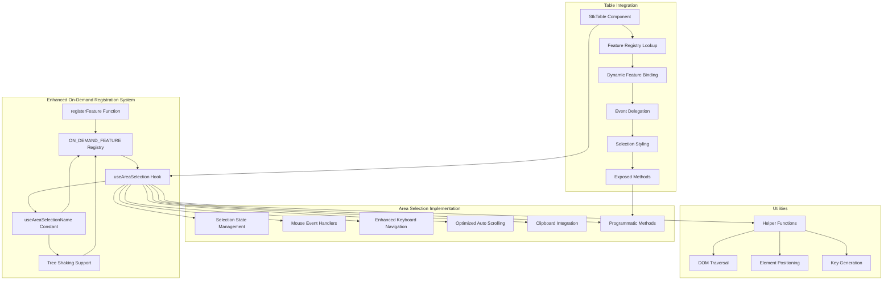
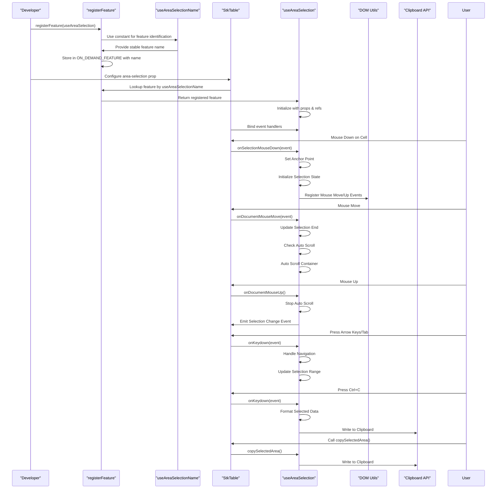
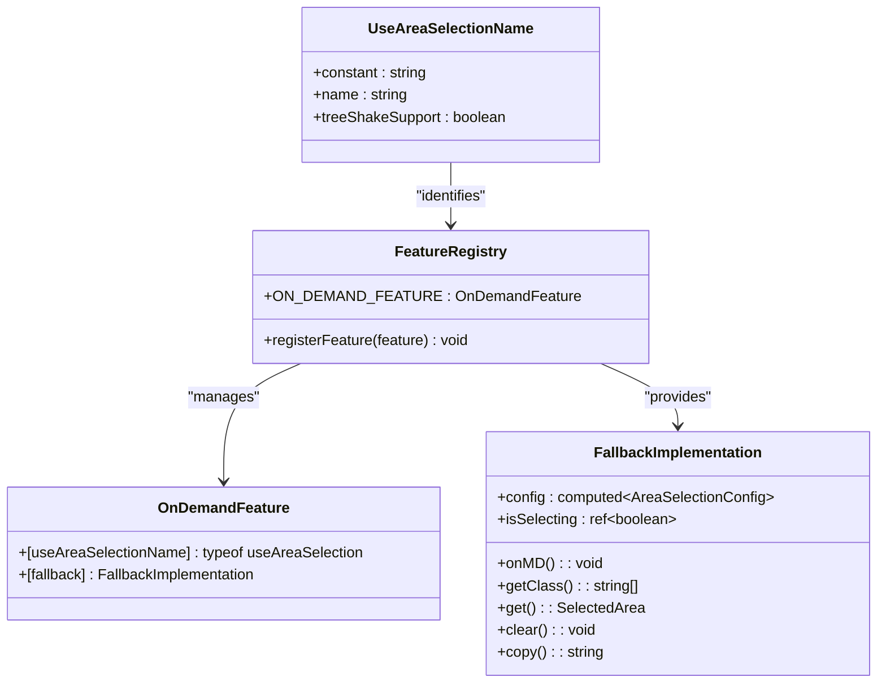
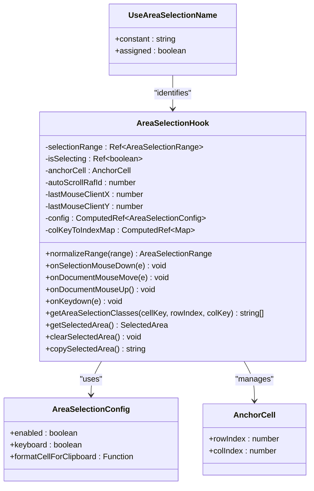
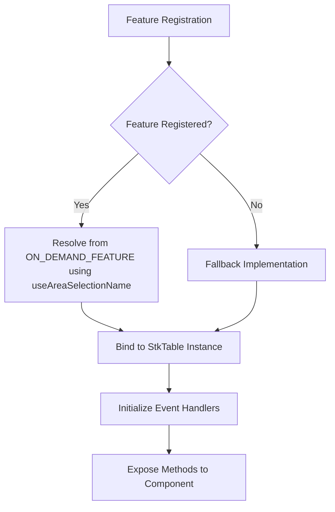
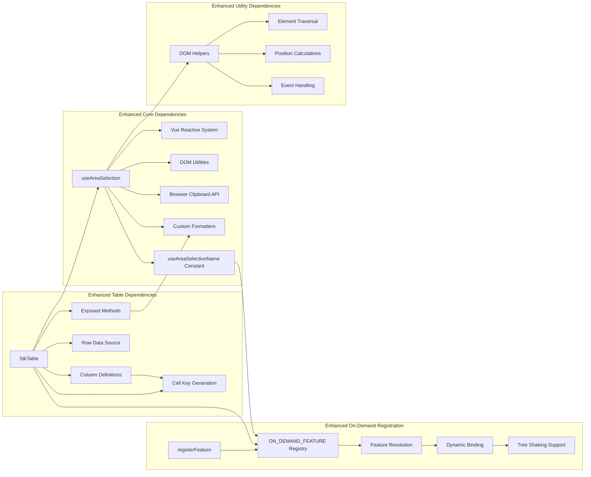

# Area Selection

<cite>
**Referenced Files in This Document**
- [AreaSelection.vue](file://docs-demo/advanced/area-selection/AreaSelection.vue)
- [useAreaSelection.ts](file://src/StkTable/features/useAreaSelection.ts)
- [registerFeature.ts](file://src/StkTable/registerFeature.ts)
- [const.ts](file://src/StkTable/features/const.ts)
- [StkTable.vue](file://src/StkTable/StkTable.vue)
- [index.ts](file://src/StkTable/types/index.ts)
- [index.ts](file://src/StkTable/utils/index.ts)
- [const.ts](file://src/StkTable/const.ts)
- [area-selection.md](file://docs-src/main/table/advanced/area-selection.md)
- [expose.md](file://docs-src/main/api/expose.md)
- [index.ts](file://src/StkTable/features/index.ts)
- [index.ts](file://src/StkTable/index.ts)
</cite>

## Update Summary
**Changes Made**
- Updated documentation to reflect the enhanced `useAreaSelectionName` constant implementation with improved tree-shaking support
- Enhanced on-demand feature registration system documentation with better integration and runtime feature resolution
- Added information about bundle optimization benefits and dead code elimination support
- Updated feature registration requirements with the new naming convention and improved tree-shaking capabilities
- Revised integration examples to demonstrate the improved registration system with enhanced tree-shaking support

## Table of Contents
1. [Introduction](#introduction)
2. [Project Structure](#project-structure)
3. [Core Components](#core-components)
4. [Architecture Overview](#architecture-overview)
5. [Detailed Component Analysis](#detailed-component-analysis)
6. [API Reference](#api-reference)
7. [Dependency Analysis](#dependency-analysis)
8. [Performance Considerations](#performance-considerations)
9. [Troubleshooting Guide](#troubleshooting-guide)
10. [Conclusion](#conclusion)

## Introduction
Area Selection is a powerful feature in StkTable that enables users to select rectangular regions of cells through mouse drag operations. This functionality provides intuitive data selection capabilities with support for keyboard shortcuts, automatic scrolling during selection, and clipboard integration for copying selected data.

**Enhanced** The area selection system now operates under an improved on-demand registration model with enhanced tree shaking capabilities. The introduction of the `useAreaSelectionName` constant provides better bundle optimization and allows developers to include only the features they need while enabling dead code elimination. The system now features improved integration with the registration system and enhanced tree-shaking support through consistent naming conventions.

The feature transforms a simple table into a sophisticated spreadsheet-like interface, allowing users to:
- Drag-select rectangular cell ranges
- Copy selected data to clipboard using Ctrl/Cmd+C or programmatic `copySelectedArea()` method
- Cancel selections with Esc key
- Programmatically access selected data via exposed methods including the new `copySelectedArea()`
- Navigate using arrow keys, Tab, and Shift combinations for enhanced keyboard accessibility

**Enhanced** The area selection system now provides dual access methods - both keyboard shortcuts and programmatic clipboard operations for maximum flexibility, integrated through the improved on-demand registration system with enhanced tree shaking capabilities and better bundle optimization.

## Project Structure
The Area Selection feature is implemented as a composable hook that integrates seamlessly with the main StkTable component through an enhanced on-demand registration system. The implementation follows Vue 3 Composition API patterns and maintains separation of concerns between the selection logic and the table rendering.



**Diagram sources**
- [registerFeature.ts:25-35](file://src/StkTable/registerFeature.ts#L25-L35)
- [useAreaSelection.ts:777-781](file://src/StkTable/features/useAreaSelection.ts#L777-L781)
- [StkTable.vue:897-916](file://src/StkTable/StkTable.vue#L897-L916)

**Section sources**
- [registerFeature.ts:1-36](file://src/StkTable/registerFeature.ts#L1-L36)
- [useAreaSelection.ts:1-781](file://src/StkTable/features/useAreaSelection.ts#L1-L781)
- [StkTable.vue:897-916](file://src/StkTable/StkTable.vue#L897-L916)

## Core Components

### Enhanced On-Demand Feature Registration
**Enhanced** The area selection system now uses an improved on-demand registration pattern that provides better bundle optimization and runtime flexibility through the `useAreaSelectionName` constant:

- `registerFeature()` function registers features globally in the `ON_DEMAND_FEATURE` registry
- `useAreaSelectionName` constant provides a stable identifier for tree shaking and dead code elimination
- `ON_DEMAND_FEATURE` serves as a lookup table for dynamically loaded features with enhanced runtime resolution
- Features are resolved at runtime based on the `useAreaSelectionName` property
- Provides fallback implementations when features are not registered
- Enables better bundle optimization through consistent naming conventions and enhanced tree-shaking support

### useAreaSelectionName Constant
**New** The `useAreaSelectionName` constant provides enhanced tree shaking capabilities:

- Defined as `'useAreaSelection'` on line 777-778
- Assigned to `useAreaSelection.name` for runtime identification
- Enables dead code elimination in bundlers that support static analysis
- Provides consistent feature identification across the application
- Improves bundle size optimization by allowing unused features to be removed
- **Enhanced** Now properly integrated with the registration system for better tree-shaking support

### Selection State Management
The core selection logic is encapsulated in the `useAreaSelection` composable, which manages:
- Current selection range with normalized coordinates
- Anchor point for shift-based selections
- Real-time selection updates during mouse movement
- Selection validation and bounds checking
- Enhanced keyboard navigation state management

### Mouse Event Handling
The implementation provides comprehensive mouse event handling:
- `onSelectionMouseDown`: Initiates selection with anchor point setting
- `onDocumentMouseMove`: Updates selection during drag operations with optimized edge detection
- `onDocumentMouseUp`: Finalizes selection and triggers events
- Automatic prevention of text selection during drag operations

### Enhanced Keyboard Navigation
**Enhanced** Built-in keyboard support includes comprehensive navigation capabilities:
- **Arrow Keys**: Move selection by single cells or extend selections with Shift
- **Tab Key**: Navigate between cells with wrap-around support
- **Shift + Arrow Keys**: Extend current selection range
- **Esc Key**: Cancel current selection
- **Ctrl/Cmd + C**: Copy selected range to clipboard in TSV format

**Enhanced** The keyboard system now provides Excel-like navigation with intelligent boundary handling and automatic scrolling optimization, integrated with the improved registration system and enhanced tree-shaking support.

### Optimized Auto Scrolling
**Enhanced** Intelligent auto-scrolling automatically scrolls the table container when the mouse approaches edges, with significant performance improvements:

- **requestAnimationFrame Optimization**: Smooth 60fps scrolling using modern browser APIs
- **Edge Detection Threshold**: 40px proximity threshold for initiating auto-scroll
- **Maximum Scroll Speed**: 15px per frame for consistent performance
- **Smart Positioning**: Uses `elementFromPoint` to maintain selection accuracy during scroll
- **Header Area Exclusion**: Prevents selection interference with table headers

### Programmatic Access
**Enhanced** The `copySelectedArea()` method provides programmatic access to copy selected table area content:
- Returns the copied text content (TSV format)
- Supports custom cell formatting through `formatCellForClipboard` configuration
- Handles clipboard operations with browser-native APIs
- Can be called programmatically from external code
- Returns the copied text content for immediate use

**Section sources**
- [registerFeature.ts:1-36](file://src/StkTable/registerFeature.ts#L1-L36)
- [useAreaSelection.ts:777-781](file://src/StkTable/features/useAreaSelection.ts#L777-L781)
- [useAreaSelection.ts:1-781](file://src/StkTable/features/useAreaSelection.ts#L1-L781)
- [StkTable.vue:897-916](file://src/StkTable/StkTable.vue#L897-L916)

## Architecture Overview



**Diagram sources**
- [registerFeature.ts:25-35](file://src/StkTable/registerFeature.ts#L25-L35)
- [useAreaSelection.ts:777-781](file://src/StkTable/features/useAreaSelection.ts#L777-L781)
- [StkTable.vue:897-916](file://src/StkTable/StkTable.vue#L897-L916)
- [useAreaSelection.ts:547-653](file://src/StkTable/features/useAreaSelection.ts#L547-L653)

The architecture demonstrates a clean separation of concerns with the enhanced on-demand registration system:
- **Feature Registration**: Developers explicitly register features they want to use with enhanced naming conventions and tree-shaking support
- **Runtime Resolution**: Features are resolved dynamically based on the `useAreaSelectionName` constant
- **Tree Shaking Support**: The constant enables better dead code elimination and bundle optimization
- **Event Delegation**: The StkTable component delegates selection events to the registered hook
- **State Management**: The hook maintains selection state independently from the table rendering
- **Utility Functions**: DOM traversal and positioning utilities are reused across the application
- **External APIs**: Clipboard integration uses browser-native APIs for optimal performance
- **Dual Access Methods**: Both keyboard shortcuts and programmatic methods provide flexible integration options

## Detailed Component Analysis

### Enhanced On-Demand Registration System



**Diagram sources**
- [registerFeature.ts:4-21](file://src/StkTable/registerFeature.ts#L4-L21)
- [useAreaSelection.ts:777-778](file://src/StkTable/features/useAreaSelection.ts#L777-L778)

#### Enhanced Feature Registration Process
The registration system provides a clean interface for feature management with improved tree shaking support:
- `registerFeature()` accepts one or multiple features
- Features are stored in the `ON_DEMAND_FEATURE` registry using the `useAreaSelectionName` constant
- Each feature is identified by its stable `useAreaSelectionName` property
- Provides fallback implementations when features are not registered
- Enables better bundle optimization through consistent naming conventions and enhanced tree-shaking support

#### Runtime Feature Resolution
**Enhanced** The StkTable component resolves features at runtime with improved naming support:
- Looks up features in `ON_DEMAND_FEATURE` registry using `useAreaSelectionName` constant
- Uses the `useAreaSelectionName` constant for feature identification
- Binds the resolved feature to the table instance
- Integrates event handlers and exposed methods automatically
- Supports enhanced tree shaking capabilities through consistent naming

**Section sources**
- [registerFeature.ts:1-36](file://src/StkTable/registerFeature.ts#L1-L36)
- [useAreaSelection.ts:777-781](file://src/StkTable/features/useAreaSelection.ts#L777-L781)
- [StkTable.vue:897-916](file://src/StkTable/StkTable.vue#L897-L916)

### Enhanced useAreaSelection Hook Implementation



**Diagram sources**
- [useAreaSelection.ts:12-781](file://src/StkTable/features/useAreaSelection.ts#L12-L781)
- [index.ts:355-375](file://src/StkTable/types/index.ts#L355-L375)
- [useAreaSelection.ts:777-778](file://src/StkTable/features/useAreaSelection.ts#L777-L778)

#### Enhanced Selection State Management
The hook maintains selection state through reactive references with improved keyboard support:
- `selectionRange`: Tracks the current selection boundary with enhanced normalization
- `isSelecting`: Indicates active drag operation state
- `anchorCell`: Stores the starting point for selections
- `config`: Computed configuration with keyboard navigation support

#### Optimized Auto Scrolling Mechanism
**Enhanced** The auto-scrolling system uses requestAnimationFrame for smooth performance with enhanced accuracy:
- **Edge Detection**: 40px threshold for initiating auto-scroll
- **Maximum Speed**: 15px per frame for consistent performance
- **Smart Positioning**: Uses `elementFromPoint` with 2px offset for precision
- **Header Exclusion**: Prevents selection interference with table headers
- **RAF Integration**: Uses `requestAnimationFrame` for smooth 60fps performance

#### Enhanced Clipboard Integration
**Enhanced** The clipboard functionality now supports both keyboard shortcuts and programmatic access with improved error handling:

```mermaid
flowchart TD
A[User Interaction] --> B{Method Type}
B --> |Keyboard Shortcut| C[Ctrl+C/Cmd+C]
B --> |Programmatic| D[copySelectedArea() Method]
B --> |Arrow Keys/Tab| E[Keyboard Navigation]
C --> F{Selection Active?}
D --> F
E --> G{Selection Exists?}
F --> |No| H[Return Empty String]
F --> |Yes| I[Normalize Selection Range]
G --> |No| J[Initialize Selection]
G --> |Yes| K[Update Selection Range]
I --> L[Iterate Through Rows]
L --> M[Iterate Through Columns]
M --> N[Format Cell Value]
N --> O[Custom Formatter Check]
O --> |Provided| P[Use Custom Formatter]
O --> |Not Provided| Q[Use Raw Value]
P --> R[Null Handling]
Q --> R
R --> S[Join with Tab Separators]
S --> T[Join Rows with Newlines]
T --> U[Write to Clipboard]
U --> V[Return Copied Text]
J --> W[Emit Selection Change]
K --> W
```

**Diagram sources**
- [useAreaSelection.ts:507-540](file://src/StkTable/features/useAreaSelection.ts#L507-L540)

The clipboard system handles:
- Custom formatting through `formatCellForClipboard` callback
- Null value handling with empty string fallback
- TSV (Tab-Separated Values) format compliance
- Browser compatibility through Promise-based API
- Programmatic method access for external integration
- Enhanced error handling for clipboard operations

**Section sources**
- [useAreaSelection.ts:1-781](file://src/StkTable/features/useAreaSelection.ts#L1-L781)
- [index.ts:355-375](file://src/StkTable/types/index.ts#L355-L375)

### StkTable Integration with Enhanced System

The StkTable component integrates area selection through the enhanced on-demand registration system with improved tree shaking support:

#### Dynamic Feature Binding
**Enhanced** The integration now uses dynamic feature resolution with the `useAreaSelectionName` constant:


**Diagram sources**
- [StkTable.vue:897-916](file://src/StkTable/StkTable.vue#L897-L916)
- [registerFeature.ts:8-21](file://src/StkTable/registerFeature.ts#L8-L21)
- [useAreaSelection.ts:777-778](file://src/StkTable/features/useAreaSelection.ts#L777-L778)

#### Enhanced Selection Styling
The integration adds visual feedback through CSS classes:
- `cell-range-selected`: Base selection class
- `cell-range-t/b/l/r`: Corner and edge highlighting
- Dynamic class application based on selection boundaries
- Integration with virtual scrolling and fixed columns

#### Enhanced Method Exposure
**Enhanced** The StkTable component now exposes the `copySelectedArea` method alongside other selection methods:
- `getSelectedArea()`: Get selected area information
- `clearSelectedArea()`: Clear current selection
- `copySelectedArea()`: Copy selected area to clipboard (programmatic)

**Section sources**
- [StkTable.vue:897-916](file://src/StkTable/StkTable.vue#L897-L916)
- [StkTable.vue:1241-1245](file://src/StkTable/StkTable.vue#L1241-L1245)
- [StkTable.vue:1719-1733](file://src/StkTable/StkTable.vue#L1719-L1733)

## API Reference

### Exposed Methods

**Enhanced** The StkTable component now exposes the following area selection methods through the enhanced on-demand registration system:

#### getSelectedArea()
Get information about the currently selected area.

**Returns**: `{ rows: DT[], cols: StkTableColumn<DT>[], range: AreaSelectionRange }`

#### clearSelectedArea()
Clear the current selection without triggering events.

#### copySelectedArea()
**New** Copy the selected area to clipboard in TSV format.

**Returns**: `string` - The copied text content

**Behavior**:
- Returns empty string if no selection exists
- Formats data as Tab-Separated Values
- Uses custom formatter if provided in configuration
- Writes to clipboard using browser native API
- Can be called programmatically from external code

### Configuration Options

#### areaSelection Config
The area selection feature accepts a configuration object with the following options:

- `enabled`: `boolean` - Enable/disable the feature
- `keyboard`: `boolean` - Enable/disable keyboard navigation (default: false)
- `formatCellForClipboard`: `(row: T, col: StkTableColumn<T>, rawValue: any) => string`
  - Custom formatter for clipboard content
  - Used when copying via keyboard shortcut or programmatic method
  - Ensures clipboard content matches display content for custom cells

#### Enhanced Feature Registration
**Enhanced** Features must be registered with the improved system before use:

```typescript
import { registerFeature, useAreaSelection } from 'stk-table-vue';

// Register the area selection feature
registerFeature(useAreaSelection);

// The useAreaSelectionName constant enables better tree shaking
console.log(useAreaSelection.name); // 'useAreaSelection'
```

**Section sources**
- [expose.md:186-205](file://docs-src/main/api/expose.md#L186-L205)
- [index.ts:355-375](file://src/StkTable/types/index.ts#L355-L375)
- [area-selection.md:7-15](file://docs-src/main/table/advanced/area-selection.md#L7-L15)
- [useAreaSelection.ts:777-778](file://src/StkTable/features/useAreaSelection.ts#L777-L778)

## Dependency Analysis



**Diagram sources**
- [registerFeature.ts:1-36](file://src/StkTable/registerFeature.ts#L1-L36)
- [useAreaSelection.ts:1-781](file://src/StkTable/features/useAreaSelection.ts#L1-L781)
- [StkTable.vue:897-916](file://src/StkTable/StkTable.vue#L897-L916)
- [useAreaSelection.ts:777-778](file://src/StkTable/features/useAreaSelection.ts#L777-L778)

The enhanced dependency structure ensures:
- **Low Coupling**: The selection logic is independent of table rendering
- **High Cohesion**: Related DOM manipulation is centralized in utility functions
- **Clean Interfaces**: Well-defined input/output contracts for all components
- **Extensibility**: Easy to add new selection modes or keyboard shortcuts
- **Enhanced On-Demand Loading**: Features are loaded only when explicitly registered
- **Tree Shaking Support**: The `useAreaSelectionName` constant enables better dead code elimination
- **Dual Access Methods**: Both keyboard shortcuts and programmatic methods provide flexible integration options

**Section sources**
- [registerFeature.ts:1-36](file://src/StkTable/registerFeature.ts#L1-L36)
- [index.ts:355-375](file://src/StkTable/types/index.ts#L355-L375)
- [useAreaSelection.ts:777-778](file://src/StkTable/features/useAreaSelection.ts#L777-L778)

## Performance Considerations

### Enhanced Memory Management
- **WeakMap Caching**: Row key generation uses WeakMap to prevent memory leaks
- **Computed Properties**: Selection calculations are cached through Vue's computed system
- **RAF Optimization**: Auto-scrolling uses requestAnimationFrame for optimal performance
- **Method Caching**: Clipboard formatting results are computed on-demand
- **Fallback Implementation**: Unregistered features use lightweight fallbacks
- **Tree Shaking Support**: The `useAreaSelectionName` constant enables better dead code elimination

### Computational Complexity
- **Selection Range Calculation**: O((rows × columns)) for cell key generation
- **DOM Queries**: Minimal DOM traversal through dataset attributes
- **Event Handling**: Efficient event delegation reduces listener overhead
- **Clipboard Operations**: Asynchronous operations prevent UI blocking
- **Keyboard Navigation**: Optimized key processing with boundary checking
- **Enhanced Feature Resolution**: Improved runtime lookup performance

### Browser Compatibility
- **Modern APIs**: Uses Clipboard API with fallback handling
- **Legacy Support**: Graceful degradation for older browsers
- **Performance Polyfills**: Throttling utilities prevent excessive computations
- **Keyboard Event Support**: Cross-platform Ctrl/Cmd key detection
- **RAF Support**: Fallback to setTimeout for older browsers
- **Tree Shaking Compatibility**: Works with modern bundlers that support static analysis

## Troubleshooting Guide

### Common Issues and Solutions

#### Selection Not Working
**Symptoms**: Clicking cells doesn't initiate selection
**Causes**: 
- `areaSelection` prop not enabled
- Feature not registered with `registerFeature()`
- Incorrect column definitions
- CSS conflicts affecting pointer events
- Missing `useAreaSelectionName` constant

**Solutions**:
- Verify `areaSelection` prop is set to `true` or configuration object
- Ensure `registerFeature(useAreaSelection)` is called before table usage
- Verify columns have proper `dataIndex` and `key` properties
- Check CSS styles aren't preventing pointer events
- Ensure the `useAreaSelectionName` constant is properly exported

#### Auto Scrolling Problems
**Symptoms**: Table doesn't scroll during selection
**Causes**:
- Container not scrollable
- Edge detection thresholds too small
- RequestAnimationFrame conflicts
- Feature not properly registered
- Tree shaking issues with `useAreaSelectionName`

**Solutions**:
- Ensure table container has `overflow: auto` style
- Adjust `EDGE_ZONE` constant if needed
- Check for conflicting animation frames
- Verify feature registration process
- Ensure the `useAreaSelectionName` constant is accessible at runtime

#### Clipboard Issues
**Symptoms**: Ctrl+C doesn't copy data or programmatic method fails
**Causes**:
- Clipboard permissions blocked
- Browser security restrictions
- Custom formatting errors
- No selection active
- Feature not registered
- Tree shaking removing essential code

**Solutions**:
- Verify clipboard permissions in browser settings
- Test in different browsers
- Implement proper error handling in custom formatter
- Ensure selection exists before calling `copySelectedArea()`
- Check browser compatibility for Clipboard API
- Verify feature registration
- Ensure the `useAreaSelectionName` constant is preserved during bundling

#### Keyboard Navigation Issues
**Symptoms**: Arrow keys or Tab don't work for navigation
**Causes**:
- `keyboard` option not enabled in configuration
- Feature not registered
- Other keyboard handlers interfering
- Virtual scrolling conflicts
- Tree shaking removing keyboard functionality

**Solutions**:
- Set `keyboard: true` in area selection configuration
- Ensure feature registration is complete
- Check for conflicting keyboard event handlers
- Verify virtual scrolling compatibility
- Ensure the `useAreaSelectionName` constant is properly included

#### Programmatic Method Issues
**Symptoms**: `copySelectedArea()` returns empty string or fails
**Causes**:
- No active selection
- Custom formatter throws errors
- Clipboard API not supported
- Feature not registered
- Tree shaking removing essential methods

**Solutions**:
- Verify selection exists before calling method
- Wrap custom formatter in try-catch blocks
- Provide fallback for unsupported browsers
- Ensure feature is properly registered
- Check return value for debugging
- Ensure the `useAreaSelectionName` constant is preserved

#### Tree Shaking Issues
**Symptoms**: Area selection functionality disappears after bundling
**Causes**:
- Bundler not recognizing `useAreaSelectionName` constant
- Dead code elimination removing unused features
- Incorrect import/export statements
- Tree shaking configuration issues

**Solutions**:
- Ensure `useAreaSelectionName` constant is properly exported
- Verify bundler supports static analysis for tree shaking
- Check that `registerFeature` is called before feature usage
- Review tree shaking configuration in build tools
- Ensure the constant is referenced at runtime

**Section sources**
- [registerFeature.ts:8-21](file://src/StkTable/registerFeature.ts#L8-L21)
- [useAreaSelection.ts:507-540](file://src/StkTable/features/useAreaSelection.ts#L507-L540)
- [area-selection.md:7-15](file://docs-src/main/table/advanced/area-selection.md#L7-L15)
- [useAreaSelection.ts:777-778](file://src/StkTable/features/useAreaSelection.ts#L777-L778)

## Conclusion

The Area Selection feature represents a sophisticated implementation of spreadsheet-like functionality within a Vue-based table component, now enhanced with an improved on-demand registration system and enhanced tree shaking capabilities. Its design emphasizes:

- **Modularity**: Clean separation between selection logic and table rendering
- **Performance**: Optimized DOM manipulation and efficient state management with requestAnimationFrame
- **Usability**: Intuitive mouse and enhanced keyboard interactions with comprehensive navigation support
- **Extensibility**: Well-structured APIs for customization and enhancement through the registration system
- **Bundle Optimization**: Enhanced on-demand loading prevents unused features from bloating the final bundle
- **Tree Shaking Support**: The `useAreaSelectionName` constant enables better dead code elimination and bundle optimization
- **Dual Access Methods**: Both keyboard shortcuts and programmatic methods provide flexible integration options

**Enhanced** The recent addition of the `copySelectedArea()` method, the `useAreaSelectionName` constant, and the improved on-demand registration system significantly enhance the feature's utility and integration flexibility. The implementation successfully bridges the gap between traditional table interfaces and interactive spreadsheet experiences, providing users with powerful data selection capabilities while maintaining excellent performance characteristics.

The combination of mouse-driven selection, comprehensive keyboard navigation (arrow keys, Tab, Shift combinations), and programmatic methods creates a comprehensive solution that caters to both user interaction and developer integration scenarios. The TSV format support ensures compatibility with spreadsheet applications, while the custom formatting options maintain flexibility for specialized use cases.

The enhanced on-demand registration system with the `useAreaSelectionName` constant provides developers with maximum flexibility in integrating area selection functionality into their applications, whether through simple user interactions or complex automated workflows. The enhanced keyboard navigation system offers Excel-like functionality with intelligent boundary handling and automatic scrolling optimization, making it a powerful tool for data manipulation and analysis tasks.

The dual-access approach (keyboard shortcuts + programmatic methods) combined with the enhanced on-demand registration system and tree shaking support provides developers with the best of both worlds: easy-to-use built-in functionality and fine-grained control over feature inclusion and behavior, while maintaining optimal bundle sizes through dead code elimination.

The `useAreaSelectionName` constant serves as a crucial bridge between the registration system and the runtime feature resolution, enabling better tree shaking capabilities and improving the overall developer experience through consistent naming conventions and enhanced bundle optimization.