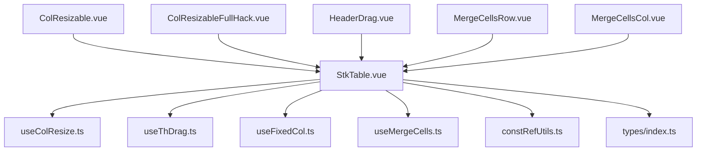
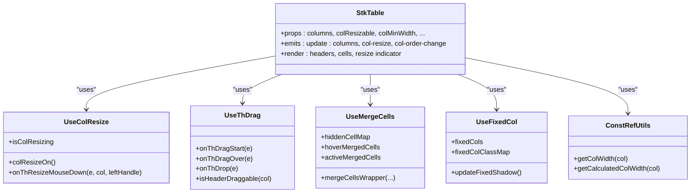
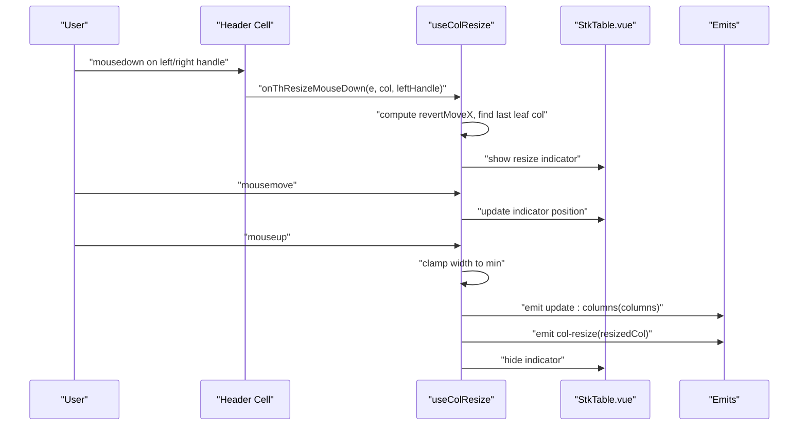
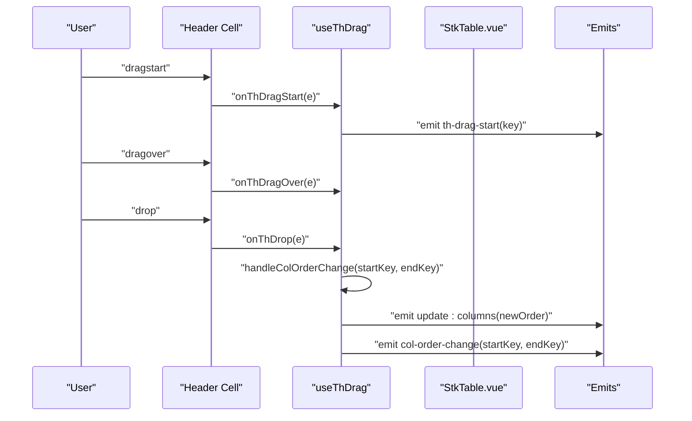
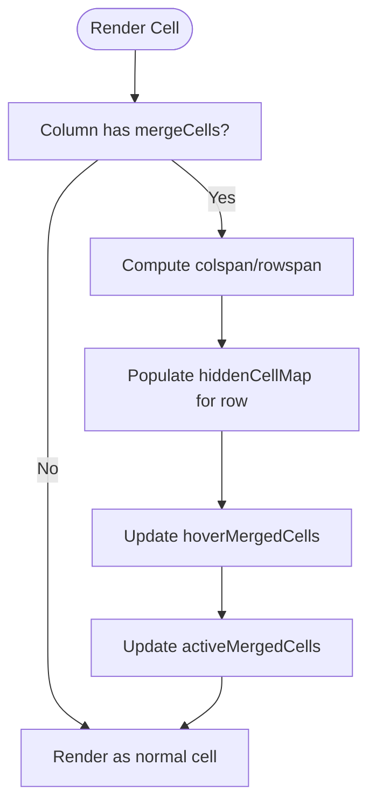
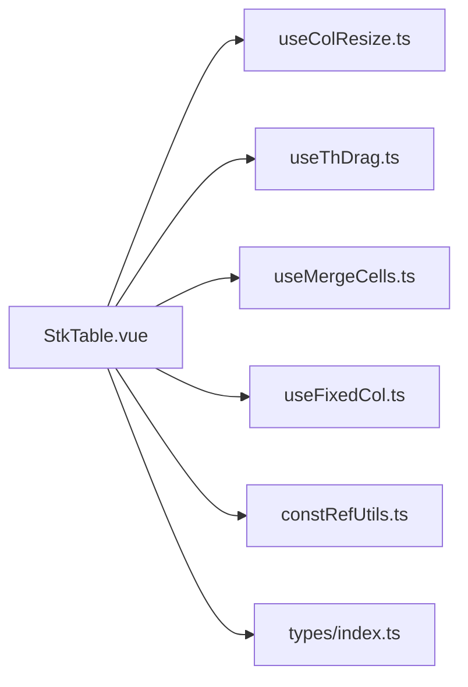

# Column Operations

<cite>
**Referenced Files in This Document**
- [StkTable.vue](file://src/StkTable/StkTable.vue)
- [useColResize.ts](file://src/StkTable/useColResize.ts)
- [useThDrag.ts](file://src/StkTable/useThDrag.ts)
- [useFixedCol.ts](file://src/StkTable/useFixedCol.ts)
- [useMergeCells.ts](file://src/StkTable/useMergeCells.ts)
- [constRefUtils.ts](file://src/StkTable/utils/constRefUtils.ts)
- [types/index.ts](file://src/StkTable/types/index.ts)
- [const.ts](file://src/StkTable/const.ts)
- [ColResizable.vue](file://docs-demo/advanced/column-resize/ColResizable.vue)
- [ColResizableFullHack.vue](file://docs-demo/advanced/column-resize/ColResizableFullHack.vue)
- [HeaderDrag.vue](file://docs-demo/advanced/header-drag/HeaderDrag.vue)
- [MergeCellsRow.vue](file://docs-demo/basic/merge-cells/MergeCellsRow.vue)
- [MergeCellsCol.vue](file://docs-demo/basic/merge-cells/MergeCellsCol.vue)
</cite>

## Table of Contents
1. [Introduction](#introduction)
2. [Project Structure](#project-structure)
3. [Core Components](#core-components)
4. [Architecture Overview](#architecture-overview)
5. [Detailed Component Analysis](#detailed-component-analysis)
6. [Dependency Analysis](#dependency-analysis)
7. [Performance Considerations](#performance-considerations)
8. [Troubleshooting Guide](#troubleshooting-guide)
9. [Conclusion](#conclusion)
10. [Appendices](#appendices)

## Introduction
This document explains column operation capabilities in Stk Table Vue, focusing on:
- Column resizing with resize handles, constraints, and persistence
- Column visibility toggling (conceptual overview)
- Column ordering via header drag-and-drop
- Column merging (rowspan/colspan) and interaction with resizing/ordering
- Resize algorithm, constraint enforcement, and user interaction patterns
- Practical examples and guidance for custom behaviors, conflict resolution, performance optimization, accessibility, and responsive design

## Project Structure
The column operation features are implemented as composable hooks integrated into the main table component. Demos illustrate usage patterns and advanced configurations.

**Diagram sources**
- [StkTable.vue](file://src/StkTable/StkTable.vue#L840-L848)
- [useColResize.ts](file://src/StkTable/useColResize.ts#L29-L37)
- [useThDrag.ts](file://src/StkTable/useThDrag.ts#L14-L26)
- [useFixedCol.ts](file://src/StkTable/useFixedCol.ts#L19-L26)
- [useMergeCells.ts](file://src/StkTable/useMergeCells.ts#L11-L11)
- [constRefUtils.ts](file://src/StkTable/utils/constRefUtils.ts#L9-L20)
- [types/index.ts](file://src/StkTable/types/index.ts#L54-L120)
- [ColResizable.vue](file://docs-demo/advanced/column-resize/ColResizable.vue#L36-L44)
- [ColResizableFullHack.vue](file://docs-demo/advanced/column-resize/ColResizableFullHack.vue#L33-L43)
- [HeaderDrag.vue](file://docs-demo/advanced/header-drag/HeaderDrag.vue#L30-L37)
- [MergeCellsRow.vue](file://docs-demo/basic/merge-cells/MergeCellsRow.vue#L65-L72)
- [MergeCellsCol.vue](file://docs-demo/basic/merge-cells/MergeCellsCol.vue#L31-L36)

**Section sources**
- [StkTable.vue](file://src/StkTable/StkTable.vue#L840-L848)
- [ColResizable.vue](file://docs-demo/advanced/column-resize/ColResizable.vue#L36-L44)
- [ColResizableFullHack.vue](file://docs-demo/advanced/column-resize/ColResizableFullHack.vue#L33-L43)
- [HeaderDrag.vue](file://docs-demo/advanced/header-drag/HeaderDrag.vue#L30-L37)
- [MergeCellsRow.vue](file://docs-demo/basic/merge-cells/MergeCellsRow.vue#L65-L72)
- [MergeCellsCol.vue](file://docs-demo/basic/merge-cells/MergeCellsCol.vue#L31-L36)

## Core Components
- Column resizing: Implemented by a composable that manages mouse events, indicator rendering, and width updates. It respects per-column and global constraints and emits resize events.
- Column ordering: Implemented by a composable that enables drag-and-drop reordering of headers with configurable modes (insert/swap) and per-column enablement.
- Column merging: Implemented by a composable that computes hidden cells and highlights for merged regions, supporting dynamic updates with virtualization.
- Fixed columns: Integrated to manage fixed column shadows and classes during resizing and scrolling.

Key integration points:
- The main table component wires resize and drag hooks, exposes resize indicator DOM, and reacts to column updates.
- Utilities provide width calculation helpers used across features.

**Section sources**
- [useColResize.ts](file://src/StkTable/useColResize.ts#L29-L215)
- [useThDrag.ts](file://src/StkTable/useThDrag.ts#L14-L103)
- [useMergeCells.ts](file://src/StkTable/useMergeCells.ts#L11-L140)
- [useFixedCol.ts](file://src/StkTable/useFixedCol.ts#L19-L156)
- [StkTable.vue](file://src/StkTable/StkTable.vue#L840-L848)
- [constRefUtils.ts](file://src/StkTable/utils/constRefUtils.ts#L9-L20)

## Architecture Overview
The column operation subsystem is composed of:
- Hooks for resizing and ordering
- A main table component orchestrating rendering, events, and state
- Utilities for width computation
- Types defining column configuration and behaviors

**Diagram sources**
- [StkTable.vue](file://src/StkTable/StkTable.vue#L840-L848)
- [useColResize.ts](file://src/StkTable/useColResize.ts#L29-L215)
- [useThDrag.ts](file://src/StkTable/useThDrag.ts#L14-L103)
- [useMergeCells.ts](file://src/StkTable/useMergeCells.ts#L11-L140)
- [useFixedCol.ts](file://src/StkTable/useFixedCol.ts#L19-L156)
- [constRefUtils.ts](file://src/StkTable/utils/constRefUtils.ts#L9-L20)

## Detailed Component Analysis

### Column Resizing
- Resize handles: Left and right resize handles are rendered on header cells. The left handle triggers a reverse movement calculation for certain fixed columns.
- Constraints:
  - Per-column minWidth overrides global colMinWidth when present.
  - During drag, movement is clamped so width never goes below the effective minimum.
  - After release, width is ensured to meet the minimum and persisted by updating the column’s width property.
- Persistence:
  - Emits update:columns with a slice of the columns array and col-resize with the resized column.
- Interaction:
  - Mouse events are attached to the window globally to support smooth dragging across the page.
  - A resize indicator is shown and positioned during dragging.

**Diagram sources**
- [useColResize.ts](file://src/StkTable/useColResize.ts#L83-L198)
- [StkTable.vue](file://src/StkTable/StkTable.vue#L77-L98)
- [constRefUtils.ts](file://src/StkTable/utils/constRefUtils.ts#L18-L20)

Key implementation references:
- Resize enablement and per-column disabling: [useColResize.ts](file://src/StkTable/useColResize.ts#L51-L56)
- Mouse down handler and fixed column logic: [useColResize.ts](file://src/StkTable/useColResize.ts#L83-L136)
- Mouse move and indicator positioning: [useColResize.ts](file://src/StkTable/useColResize.ts#L141-L158)
- Mouse up, clamp, persist, and emit: [useColResize.ts](file://src/StkTable/useColResize.ts#L163-L198)
- Width retrieval helpers: [constRefUtils.ts](file://src/StkTable/utils/constRefUtils.ts#L9-L20)
- Column type and minWidth/minWidth: [types/index.ts](file://src/StkTable/types/index.ts#L78-L83)

Practical examples:
- Basic resizable table with v-model:columns: [ColResizable.vue](file://docs-demo/advanced/column-resize/ColResizable.vue#L36-L44)
- Advanced resizable with per-column disable and minWidth: [ColResizableFullHack.vue](file://docs-demo/advanced/column-resize/ColResizableFullHack.vue#L33-L43)

**Section sources**
- [useColResize.ts](file://src/StkTable/useColResize.ts#L51-L198)
- [constRefUtils.ts](file://src/StkTable/utils/constRefUtils.ts#L9-L20)
- [types/index.ts](file://src/StkTable/types/index.ts#L78-L83)
- [ColResizable.vue](file://docs-demo/advanced/column-resize/ColResizable.vue#L36-L44)
- [ColResizableFullHack.vue](file://docs-demo/advanced/column-resize/ColResizableFullHack.vue#L33-L43)

### Column Ordering (Header Drag-and-Drop)
- Enables reordering of columns by dragging header cells.
- Modes:
  - insert: Move the dragged column to the drop position.
  - swap: Swap positions of dragged and dropped columns.
  - none: Disable reordering.
- Per-column enable/disable via a callback.
- Emits events for start/drop and order change.

**Diagram sources**
- [useThDrag.ts](file://src/StkTable/useThDrag.ts#L29-L93)
- [StkTable.vue](file://src/StkTable/StkTable.vue#L73-L76)

Key implementation references:
- Config and enablement: [useThDrag.ts](file://src/StkTable/useThDrag.ts#L17-L26)
- Drag handlers and order change logic: [useThDrag.ts](file://src/StkTable/useThDrag.ts#L29-L93)
- Column type and headerDrag config: [types/index.ts](file://src/StkTable/types/index.ts#L262-L273)

Example:
- Header drag with v-model:columns: [HeaderDrag.vue](file://docs-demo/advanced/header-drag/HeaderDrag.vue#L30-L37)

**Section sources**
- [useThDrag.ts](file://src/StkTable/useThDrag.ts#L17-L93)
- [types/index.ts](file://src/StkTable/types/index.ts#L262-L273)
- [HeaderDrag.vue](file://docs-demo/advanced/header-drag/HeaderDrag.vue#L30-L37)

### Column Merging (Rowspan/Colspan)
- Supports merging cells both horizontally (colspan) and vertically (rowspan) via a mergeCells function on columns.
- Computes which cells to hide and which to highlight based on merged regions.
- Integrates with virtualization and updates on data/partition changes.

**Diagram sources**
- [useMergeCells.ts](file://src/StkTable/useMergeCells.ts#L84-L115)
- [useMergeCells.ts](file://src/StkTable/useMergeCells.ts#L38-L74)
- [StkTable.vue](file://src/StkTable/StkTable.vue#L1227-L1228)

Key implementation references:
- Merge wrapper and hidden map: [useMergeCells.ts](file://src/StkTable/useMergeCells.ts#L38-L115)
- Watchers and state: [useMergeCells.ts](file://src/StkTable/useMergeCells.ts#L30-L34)
- Column type and mergeCells prop: [types/index.ts](file://src/StkTable/types/index.ts#L118-L119)

Examples:
- Row merging: [MergeCellsRow.vue](file://docs-demo/basic/merge-cells/MergeCellsRow.vue#L16-L38)
- Column merging: [MergeCellsCol.vue](file://docs-demo/basic/merge-cells/MergeCellsCol.vue#L7-L20)

**Section sources**
- [useMergeCells.ts](file://src/StkTable/useMergeCells.ts#L30-L115)
- [types/index.ts](file://src/StkTable/types/index.ts#L118-L119)
- [MergeCellsRow.vue](file://docs-demo/basic/merge-cells/MergeCellsRow.vue#L16-L38)
- [MergeCellsCol.vue](file://docs-demo/basic/merge-cells/MergeCellsCol.vue#L7-L20)

### Column Visibility Toggling (Conceptual Overview)
- The codebase does not include a built-in column visibility toggle feature.
- Typical approaches:
  - Filter columns before passing to the table.
  - Dynamically adjust columns and reinitialize virtualization if needed.
  - Persist visibility state externally and restore on mount.
- Integration considerations:
  - Ensure proper keying and watch updates.
  - Reinitialize virtualization and fixed column shadows after changes.

[No sources needed since this section doesn't analyze specific source files]

### Fixed Columns and Resize Interactions
- Fixed columns influence resize behavior:
  - Left-handle drag on a right-fixed column may require reversing movement to maintain layout.
  - Right-handle drag on a right-fixed column may target the next fixed column.
- Fixed column shadow highlighting is updated on scroll and column changes.

Key implementation references:
- Fixed column utilities: [useFixedCol.ts](file://src/StkTable/useFixedCol.ts#L91-L144)
- Resize fixed column logic: [useColResize.ts](file://src/StkTable/useColResize.ts#L98-L115)

**Section sources**
- [useFixedCol.ts](file://src/StkTable/useFixedCol.ts#L91-L144)
- [useColResize.ts](file://src/StkTable/useColResize.ts#L98-L115)

## Dependency Analysis
- StkTable.vue composes useColResize, useThDrag, useMergeCells, and useFixedCol.
- Width computation is centralized in constRefUtils and used across features.
- Types define column configuration, including minWidth/maxWidth and mergeCells.

**Diagram sources**
- [StkTable.vue](file://src/StkTable/StkTable.vue#L840-L848)
- [useColResize.ts](file://src/StkTable/useColResize.ts#L29-L37)
- [useThDrag.ts](file://src/StkTable/useThDrag.ts#L14-L26)
- [useMergeCells.ts](file://src/StkTable/useMergeCells.ts#L11-L11)
- [useFixedCol.ts](file://src/StkTable/useFixedCol.ts#L19-L26)
- [constRefUtils.ts](file://src/StkTable/utils/constRefUtils.ts#L9-L20)
- [types/index.ts](file://src/StkTable/types/index.ts#L54-L120)

**Section sources**
- [StkTable.vue](file://src/StkTable/StkTable.vue#L840-L848)
- [constRefUtils.ts](file://src/StkTable/utils/constRefUtils.ts#L9-L20)
- [types/index.ts](file://src/StkTable/types/index.ts#L54-L120)

## Performance Considerations
- Resize performance:
  - Use virtualization for large datasets to minimize DOM updates.
  - Keep per-column widths set when enabling col-resizable to avoid layout thrashing.
  - Debounce heavy operations if adding custom resize logic.
- Fixed columns:
  - Enable fixedColShadow judiciously; it recalculates shadow visibility on scroll.
- Merging:
  - Prefer lightweight mergeCells computations; avoid heavy DOM queries inside mergeCells.
  - Watch updates are scoped to virtual partitions to reduce unnecessary work.
- Accessibility:
  - Ensure keyboard navigation remains functional alongside mouse interactions.
  - Provide visible focus indicators and ARIA roles where appropriate.

[No sources needed since this section provides general guidance]

## Troubleshooting Guide
- Resize not persisting:
  - Ensure v-model:columns is bound and update:columns is handled to mutate the array reference.
  - Verify colResizable is truthy or configured properly.
  - References: [StkTable.vue](file://src/StkTable/StkTable.vue#L840-L848), [useColResize.ts](file://src/StkTable/useColResize.ts#L179-L180)
- Minimum width not enforced:
  - For non-virtual X, minWidth on the column takes precedence; for virtual X, ensure width is set and clamp occurs on mouseup.
  - References: [useColResize.ts](file://src/StkTable/useColResize.ts#L149-L171), [constRefUtils.ts](file://src/StkTable/utils/constRefUtils.ts#L9-L15)
- Resize conflicts with other features:
  - When wheeling, resizing is blocked to prevent scroll interference.
  - References: [StkTable.vue](file://src/StkTable/StkTable.vue#L1418-L1421)
- Header drag-and-drop not working:
  - Confirm headerDrag is enabled and columns are sortable; check disabled callback.
  - References: [useThDrag.ts](file://src/StkTable/useThDrag.ts#L17-L26), [types/index.ts](file://src/StkTable/types/index.ts#L262-L273)
- Merged cells overlap or misalign:
  - Ensure mergeCells returns correct indices relative to virtual partition; hiddenCellMap is recomputed on data/partition changes.
  - References: [useMergeCells.ts](file://src/StkTable/useMergeCells.ts#L30-L34), [useMergeCells.ts](file://src/StkTable/useMergeCells.ts#L84-L115)

**Section sources**
- [useColResize.ts](file://src/StkTable/useColResize.ts#L149-L180)
- [constRefUtils.ts](file://src/StkTable/utils/constRefUtils.ts#L9-L15)
- [StkTable.vue](file://src/StkTable/StkTable.vue#L1418-L1421)
- [useThDrag.ts](file://src/StkTable/useThDrag.ts#L17-L26)
- [types/index.ts](file://src/StkTable/types/index.ts#L262-L273)
- [useMergeCells.ts](file://src/StkTable/useMergeCells.ts#L30-L34)
- [useMergeCells.ts](file://src/StkTable/useMergeCells.ts#L84-L115)

## Conclusion
Stk Table Vue provides robust column operations:
- Resizable columns with precise constraints and persistence
- Draggable column ordering with flexible modes
- Powerful merging capabilities for complex layouts
- Tight integration with fixed columns and virtualization

These features are modular, well-typed, and demonstrated through practical examples. When extending behavior, follow the established patterns for event emission, width computation, and state updates to maintain consistency and performance.

[No sources needed since this section summarizes without analyzing specific files]

## Appendices

### Accessibility Considerations
- Keyboard navigation: Maintain focus order and ensure header cells remain focusable when drag-and-drop is enabled.
- Screen readers: Announce column resize actions and order changes via ARIA live regions if needed.
- High contrast and reduced motion: Respect user preferences and system settings.

[No sources needed since this section provides general guidance]

### Responsive Design Patterns
- Combine col-resizable with virtualization for large screens and small datasets.
- On narrow screens, consider disabling per-column minWidth to allow adaptive widths.
- Use fixed columns sparingly on mobile; prefer stacking or collapsing patterns.

[No sources needed since this section provides general guidance]