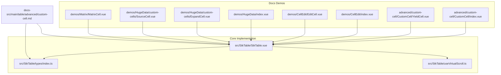
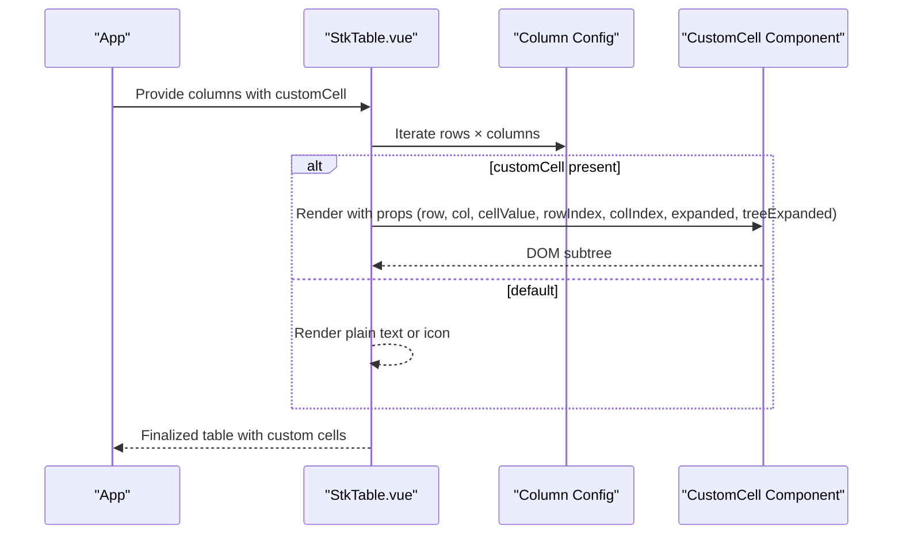
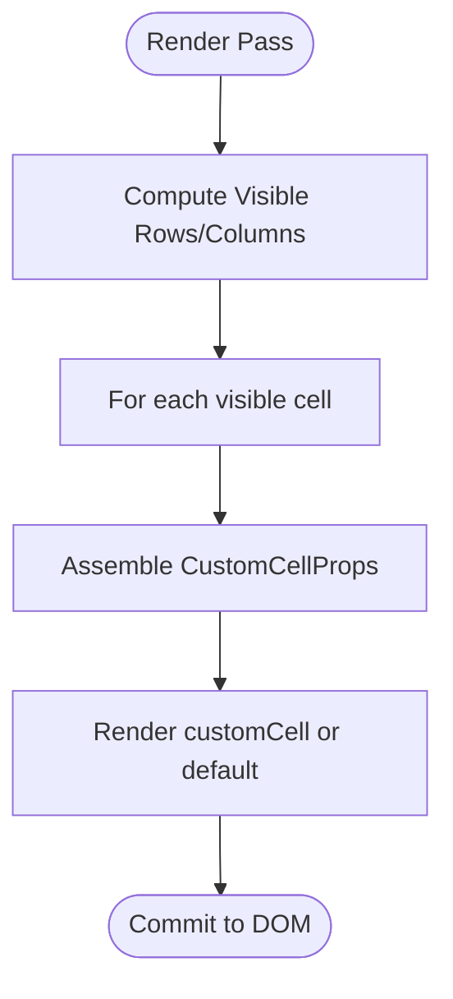
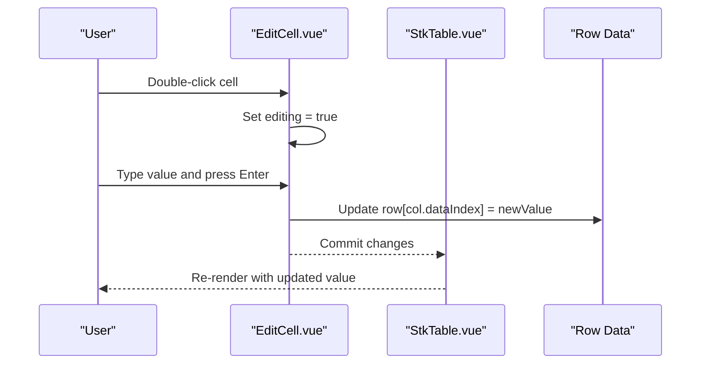
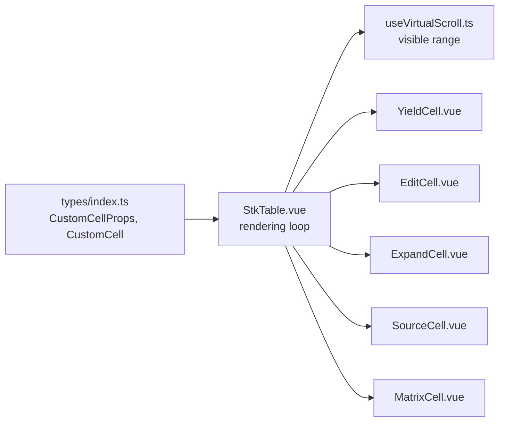

# Custom Cell Rendering

<cite>
**Referenced Files in This Document**
- [StkTable.vue](file://src/StkTable/StkTable.vue)
- [types/index.ts](file://src/StkTable/types/index.ts)
- [useVirtualScroll.ts](file://src/StkTable/useVirtualScroll.ts)
- [custom-cell.md](file://docs-src/main/table/advanced/custom-cell.md)
- [CustomCell/index.vue](file://docs-demo/advanced/custom-cell/CustomCell/index.vue)
- [YieldCell.vue](file://docs-demo/advanced/custom-cell/CustomCell/YieldCell.vue)
- [types.ts](file://docs-demo/advanced/custom-cell/CustomCell/types.ts)
- [CellEdit/index.vue](file://docs-demo/demos/CellEdit/index.vue)
- [EditCell.vue](file://docs-demo/demos/CellEdit/EditCell.vue)
- [type.ts](file://docs-demo/demos/CellEdit/type.ts)
- [HugeData/index.vue](file://docs-demo/demos/HugeData/index.vue)
- [ExpandCell.vue](file://docs-demo/demos/HugeData/custom-cells/ExpandCell.vue)
- [SourceCell.vue](file://docs-demo/demos/HugeData/custom-cells/SourceCell.vue)
- [types.ts](file://docs-demo/demos/HugeData/types.ts)
- [event.ts](file://docs-demo/demos/HugeData/event.ts)
- [MatrixCell.vue](file://docs-demo/demos/Matrix/MatrixCell.vue)
</cite>

## Table of Contents
1. [Introduction](#introduction)
2. [Project Structure](#project-structure)
3. [Core Components](#core-components)
4. [Architecture Overview](#architecture-overview)
5. [Detailed Component Analysis](#detailed-component-analysis)
6. [Dependency Analysis](#dependency-analysis)
7. [Performance Considerations](#performance-considerations)
8. [Troubleshooting Guide](#troubleshooting-guide)
9. [Conclusion](#conclusion)

## Introduction
This document explains custom cell rendering in Stk Table Vue with a focus on three implementation patterns:
- Slot-based cell customization via the table body and header slots
- Component-based cell rendering using the customCell and customHeaderCell column properties
- Yield-based cell implementation patterns using render functions and JSX

It documents the cell rendering lifecycle, prop passing mechanisms, and event handling within custom cells. It also provides comprehensive examples for editable cells, action buttons, progress indicators, and rich content displays, along with performance considerations and best practices for smooth scrolling with complex cell content.

## Project Structure
The repository organizes custom cell examples under docs-demo and the core table implementation under src/StkTable. The documentation for custom cells is located in docs-src.

**Diagram sources**
- [StkTable.vue](file://src/StkTable/StkTable.vue#L135-L153)
- [types/index.ts](file://src/StkTable/types/index.ts#L8-L23)
- [useVirtualScroll.ts](file://src/StkTable/useVirtualScroll.ts#L104-L108)
- [custom-cell.md](file://docs-src/main/table/advanced/custom-cell.md#L1-L147)
- [CustomCell/index.vue](file://docs-demo/advanced/custom-cell/CustomCell/index.vue#L1-L24)
- [YieldCell.vue](file://docs-demo/advanced/custom-cell/CustomCell/YieldCell.vue#L1-L28)
- [CellEdit/index.vue](file://docs-demo/demos/CellEdit/index.vue#L1-L50)
- [EditCell.vue](file://docs-demo/demos/CellEdit/EditCell.vue#L1-L92)
- [HugeData/index.vue](file://docs-demo/demos/HugeData/index.vue#L1-L200)
- [ExpandCell.vue](file://docs-demo/demos/HugeData/custom-cells/ExpandCell.vue#L1-L37)
- [SourceCell.vue](file://docs-demo/demos/HugeData/custom-cells/SourceCell.vue#L1-L19)
- [MatrixCell.vue](file://docs-demo/demos/Matrix/MatrixCell.vue#L1-L91)

**Section sources**
- [StkTable.vue](file://src/StkTable/StkTable.vue#L135-L153)
- [custom-cell.md](file://docs-src/main/table/advanced/custom-cell.md#L1-L147)

## Core Components
- Custom cell props interface: Defines the shape of props passed to customCell components, including row, col, cellValue, rowIndex, colIndex, expanded, and treeExpanded.
- Column configuration: Supports customCell and customHeaderCell to plug in custom renderers for body and header cells.
- Virtual scrolling integration: Renders only visible rows/columns and passes accurate indices and values to custom cells.

Key implementation references:
- CustomCellProps definition and CustomCell type
- Column customCell/customHeaderCell usage in template rendering
- Virtual data source slicing and index computation

**Section sources**
- [types/index.ts](file://src/StkTable/types/index.ts#L8-L23)
- [types/index.ts](file://src/StkTable/types/index.ts#L49-L52)
- [StkTable.vue](file://src/StkTable/StkTable.vue#L135-L153)
- [useVirtualScroll.ts](file://src/StkTable/useVirtualScroll.ts#L104-L108)

## Architecture Overview
The table renders cells by either:
- Using a default renderer for simple values
- Rendering a custom component when customCell is provided
- Falling back to slots for header customization

**Diagram sources**
- [StkTable.vue](file://src/StkTable/StkTable.vue#L135-L153)
- [types/index.ts](file://src/StkTable/types/index.ts#L8-L23)

## Detailed Component Analysis

### Slot-Based Cell Customization
- Body slot: The table exposes a slot for customizing expanded row content and other body areas.
- Header slot: The table supports a named slot for header content when no customHeaderCell is configured.

Practical usage:
- Use the expand row slot to render rich content when a row is expanded.
- Use the tableHeader slot to wrap header titles with additional UI.

**Section sources**
- [StkTable.vue](file://src/StkTable/StkTable.vue#L121-L124)
- [StkTable.vue](file://src/StkTable/StkTable.vue#L91-L93)

### Component-Based Cell Rendering
- Columns accept customCell and customHeaderCell as Vue components or render functions.
- The table passes a strongly typed CustomCellProps object to each custom cell component.

Implementation highlights:
- Props include row, col, cellValue, rowIndex, colIndex, expanded, and treeExpanded.
- The table conditionally renders a component or falls back to default text/icon rendering.

Examples:
- YieldCell demonstrates conditional styling and formatted display based on numeric values.
- EditCell demonstrates interactive editing with input controls and reactive updates.
- ExpandCell demonstrates emitting events to toggle row expansion.
- SourceCell demonstrates mapping discrete values to styled labels.
- MatrixCell demonstrates rich layout with gradient backgrounds and directional indicators.

**Section sources**
- [types/index.ts](file://src/StkTable/types/index.ts#L8-L23)
- [StkTable.vue](file://src/StkTable/StkTable.vue#L135-L153)
- [YieldCell.vue](file://docs-demo/advanced/custom-cell/CustomCell/YieldCell.vue#L1-L28)
- [EditCell.vue](file://docs-demo/demos/CellEdit/EditCell.vue#L1-L92)
- [ExpandCell.vue](file://docs-demo/demos/HugeData/custom-cells/ExpandCell.vue#L1-L37)
- [SourceCell.vue](file://docs-demo/demos/HugeData/custom-cells/SourceCell.vue#L1-L19)
- [MatrixCell.vue](file://docs-demo/demos/Matrix/MatrixCell.vue#L1-L91)

### Yield-Based Cell Implementation Patterns
- Render functions: Provide a concise way to render simple content directly from column configuration.
- JSX: Enable expressive markup with build tool support.

Guidance:
- Prefer render functions for lightweight transformations.
- Use JSX when you need dynamic, component-like composition inside column definitions.

**Section sources**
- [custom-cell.md](file://docs-src/main/table/advanced/custom-cell.md#L71-L109)

### Cell Rendering Lifecycle and Prop Passing
- Lifecycle: Cells are created during virtualized rendering of visible rows/columns. Props are recomputed per render pass.
- Prop passing: The table computes and passes row, col, cellValue, rowIndex, colIndex, expanded, and treeExpanded to custom cells.

**Diagram sources**
- [StkTable.vue](file://src/StkTable/StkTable.vue#L104-L176)
- [useVirtualScroll.ts](file://src/StkTable/useVirtualScroll.ts#L104-L108)
- [types/index.ts](file://src/StkTable/types/index.ts#L8-L23)

### Event Handling Within Custom Cells
- Emitting events: Custom cells can emit domain-specific events (e.g., toggling expand state).
- Listening to events: Parent components can subscribe to these events to orchestrate side effects.

Example pattern:
- ExpandCell emits a toggle-expand event; parent subscribes and toggles row expansion state.

**Section sources**
- [ExpandCell.vue](file://docs-demo/demos/HugeData/custom-cells/ExpandCell.vue#L8-L10)
- [event.ts](file://docs-demo/demos/HugeData/event.ts#L4-L6)

### Comprehensive Examples

#### Editable Cells
- Behavior: Double-click to enter edit mode; Enter to save, Escape to cancel; blur to commit or revert.
- Reactive updates: Editing updates the underlying row data; watchers keep local editValue in sync.
- Row-level editing: An auxiliary control switches entire rows into edit mode.

**Diagram sources**
- [EditCell.vue](file://docs-demo/demos/CellEdit/EditCell.vue#L38-L72)
- [CellEdit/index.vue](file://docs-demo/demos/CellEdit/index.vue#L32-L38)

**Section sources**
- [EditCell.vue](file://docs-demo/demos/CellEdit/EditCell.vue#L1-L92)
- [CellEdit/index.vue](file://docs-demo/demos/CellEdit/index.vue#L1-L50)
- [type.ts](file://docs-demo/demos/CellEdit/type.ts#L1-L15)

#### Action Buttons
- Pattern: Render clickable actions (e.g., expand/collapse) inside a custom cell component.
- Interaction: Emit events to parent; parent toggles row state.

**Section sources**
- [ExpandCell.vue](file://docs-demo/demos/HugeData/custom-cells/ExpandCell.vue#L1-L37)
- [event.ts](file://docs-demo/demos/HugeData/event.ts#L1-L7)
- [HugeData/index.vue](file://docs-demo/demos/HugeData/index.vue#L1-L200)

#### Progress Indicators
- Pattern: Use a rich layout with gradient backgrounds and directional indicators to visualize metrics.
- Data binding: Bind CSS variables to dynamic values for percent and color.

**Section sources**
- [MatrixCell.vue](file://docs-demo/demos/Matrix/MatrixCell.vue#L1-L91)

#### Rich Content Displays
- Pattern: Combine multiple values and icons into a single cell for compact, informative layouts.
- Styling: Use scoped styles and CSS custom properties for consistent theming.

**Section sources**
- [YieldCell.vue](file://docs-demo/advanced/custom-cell/CustomCell/YieldCell.vue#L1-L28)
- [SourceCell.vue](file://docs-demo/demos/HugeData/custom-cells/SourceCell.vue#L1-L19)

## Dependency Analysis
Custom cell rendering depends on:
- Column configuration specifying customCell/customHeaderCell
- Strongly typed props provided by the table
- Virtual scrolling for efficient rendering of large datasets

**Diagram sources**
- [types/index.ts](file://src/StkTable/types/index.ts#L8-L23)
- [StkTable.vue](file://src/StkTable/StkTable.vue#L135-L153)
- [useVirtualScroll.ts](file://src/StkTable/useVirtualScroll.ts#L104-L108)
- [YieldCell.vue](file://docs-demo/advanced/custom-cell/CustomCell/YieldCell.vue#L1-L28)
- [EditCell.vue](file://docs-demo/demos/CellEdit/EditCell.vue#L1-L92)
- [ExpandCell.vue](file://docs-demo/demos/HugeData/custom-cells/ExpandCell.vue#L1-L37)
- [SourceCell.vue](file://docs-demo/demos/HugeData/custom-cells/SourceCell.vue#L1-L19)
- [MatrixCell.vue](file://docs-demo/demos/Matrix/MatrixCell.vue#L1-L91)

**Section sources**
- [types/index.ts](file://src/StkTable/types/index.ts#L8-L23)
- [StkTable.vue](file://src/StkTable/StkTable.vue#L135-L153)
- [useVirtualScroll.ts](file://src/StkTable/useVirtualScroll.ts#L104-L108)

## Performance Considerations
- Keep custom cells lightweight:
  - Avoid heavy computations in templates; precompute where possible.
  - Minimize deep reactivity; use shallow refs for large datasets.
- Prefer render functions or simple components for trivial content to reduce overhead.
- Use virtual scrolling:
  - Ensure row heights are stable or configure autoRowHeight appropriately.
  - For horizontal virtualization, set explicit widths on columns.
- Optimize DOM:
  - Wrap custom cells in a single block element to avoid TextNode layout pitfalls.
  - Avoid inline layouts in virtualized contexts; prefer block-level containers.
- Reduce event listener noise:
  - Debounce or coalesce frequent events.
  - Limit global event subscriptions; prefer scoped emissions.

[No sources needed since this section provides general guidance]

## Troubleshooting Guide
Common issues and resolutions:
- Layout anomalies with virtual lists:
  - Ensure custom cells wrap content in a block-level element.
  - Avoid inline styles that can interfere with virtualized row heights.
- Excessive re-renders:
  - Memoize derived values; compute outside the render function.
  - Use shallow refs for row objects to prevent unnecessary invalidations.
- Horizontal virtual scrolling misalignment:
  - Provide explicit widths for all columns; avoid min/max width conflicts.
- Events not propagating:
  - Verify custom cells emit the correct event names and payload shapes.
  - Subscribe in the parent and update row state accordingly.

**Section sources**
- [custom-cell.md](file://docs-src/main/table/advanced/custom-cell.md#L8-L11)
- [ExpandCell.vue](file://docs-demo/demos/HugeData/custom-cells/ExpandCell.vue#L8-L10)
- [event.ts](file://docs-demo/demos/HugeData/event.ts#L4-L6)

## Conclusion
Stk Table Vue offers flexible, high-performance custom cell rendering through component-based, slot-based, and yield-based patterns. By leveraging the provided CustomCellProps, integrating with virtual scrolling, and following performance best practices, you can implement rich, interactive cells while maintaining smooth scrolling performance across large datasets.