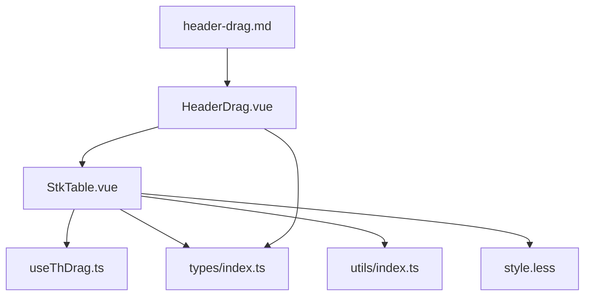
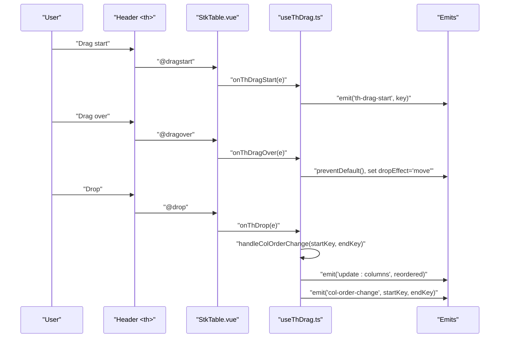
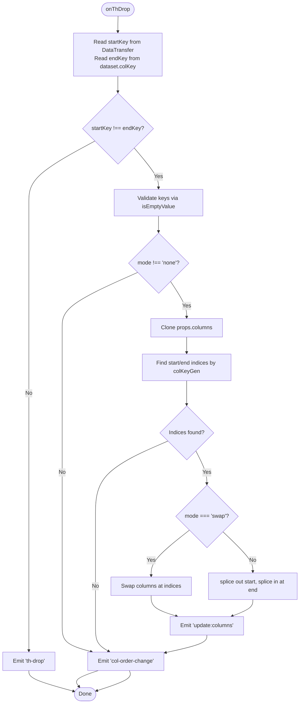
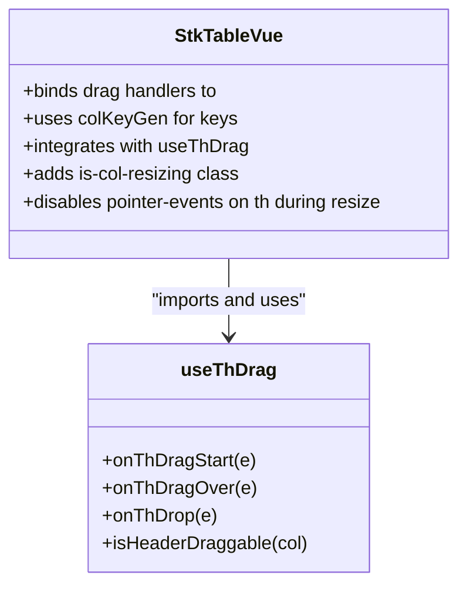
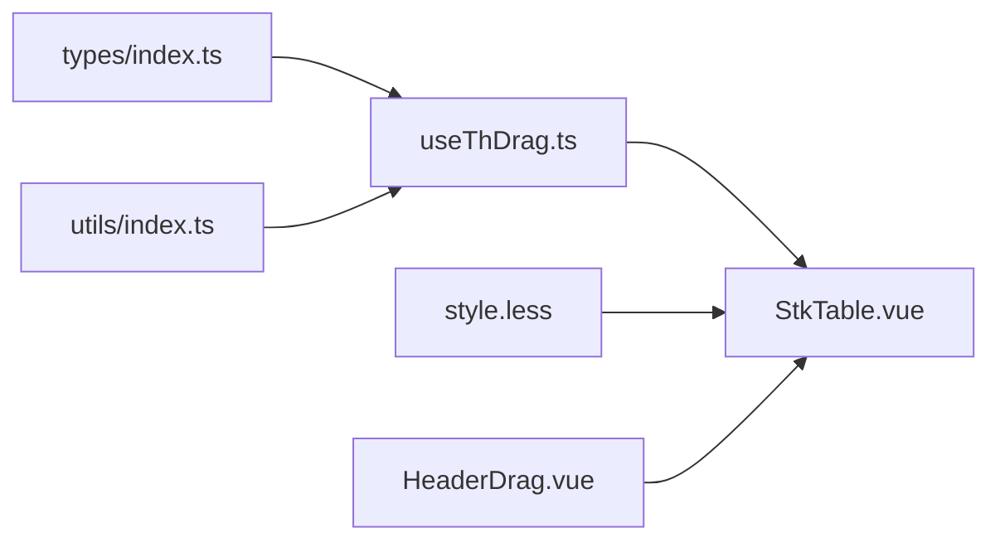

# Column Header Dragging

<cite>
**Referenced Files in This Document**
- [useThDrag.ts](file://src/StkTable/useThDrag.ts)
- [StkTable.vue](file://src/StkTable/StkTable.vue)
- [HeaderDrag.vue](file://docs-demo/advanced/header-drag/HeaderDrag.vue)
- [header-drag.md](file://docs-src/main/table/advanced/header-drag.md)
- [index.ts](file://src/StkTable/types/index.ts)
- [style.less](file://src/StkTable/style.less)
- [DragHandle.vue](file://src/StkTable/components/DragHandle.vue)
- [useTrDrag.ts](file://src/StkTable/useTrDrag.ts)
- [index.ts (utils)](file://src/StkTable/utils/index.ts)
</cite>

## Table of Contents
1. [Introduction](#introduction)
2. [Project Structure](#project-structure)
3. [Core Components](#core-components)
4. [Architecture Overview](#architecture-overview)
5. [Detailed Component Analysis](#detailed-component-analysis)
6. [Dependency Analysis](#dependency-analysis)
7. [Performance Considerations](#performance-considerations)
8. [Troubleshooting Guide](#troubleshooting-guide)
9. [Conclusion](#conclusion)
10. [Appendices](#appendices)

## Introduction
This document explains the column header dragging functionality in Stk Table Vue. It focuses on how column reordering works via drag-and-drop on table headers, including:
- How drag events are captured and processed
- Visual indicators during drag and drop zones
- Drop zone validation and column position updates
- The useThDrag composable and its configuration
- Drag threshold handling and column order preservation
- Practical examples: basic reordering, disabling specific columns, and preserving configurations
- Edge cases: minimum column visibility, drag direction constraints, and integration with column resizing
- Performance optimization for large tables and responsive design considerations

## Project Structure
The column header drag feature spans several modules:
- useThDrag composable encapsulates drag-and-drop logic for table headers
- StkTable.vue integrates useThDrag and binds drag handlers to header cells
- Demo and documentation illustrate usage and configuration
- Types define the headerDrag configuration interface
- Styles prevent pointer events during column resizing to avoid conflicts
- Utilities support key generation and validation

**Diagram sources**
- [StkTable.vue](file://src/StkTable/StkTable.vue#L69-L100)
- [useThDrag.ts](file://src/StkTable/useThDrag.ts#L1-L103)
- [types/index.ts](file://src/StkTable/types/index.ts#L54-L120)
- [style.less](file://src/StkTable/style.less#L127-L141)
- [HeaderDrag.vue](file://docs-demo/advanced/header-drag/HeaderDrag.vue#L1-L39)
- [header-drag.md](file://docs-src/main/table/advanced/header-drag.md#L1-L68)

**Section sources**
- [StkTable.vue](file://src/StkTable/StkTable.vue#L69-L100)
- [useThDrag.ts](file://src/StkTable/useThDrag.ts#L1-L103)
- [types/index.ts](file://src/StkTable/types/index.ts#L54-L120)
- [style.less](file://src/StkTable/style.less#L127-L141)
- [HeaderDrag.vue](file://docs-demo/advanced/header-drag/HeaderDrag.vue#L1-L39)
- [header-drag.md](file://docs-src/main/table/advanced/header-drag.md#L1-L68)

## Core Components
- useThDrag composable
  - Provides drag-and-drop handlers for table headers
  - Computes drag configuration from props.headerDrag
  - Emits events for drag lifecycle and column order changes
  - Updates columns via update:columns when reordering occurs
- StkTable.vue
  - Binds drag handlers to header cells
  - Uses colKeyGen to resolve column keys
  - Integrates with other features like column resizing and virtual scrolling
- Types
  - Defines HeaderDragConfig with mode and disabled callback
- Styles
  - Prevents pointer events during column resizing to avoid interfering with header drag
- Utilities
  - Provides isEmptyValue and other helpers used by useThDrag

**Section sources**
- [useThDrag.ts](file://src/StkTable/useThDrag.ts#L14-L101)
- [StkTable.vue](file://src/StkTable/StkTable.vue#L769-L771)
- [types/index.ts](file://src/StkTable/types/index.ts#L35-L47)
- [style.less](file://src/StkTable/style.less#L137-L141)
- [index.ts (utils)](file://src/StkTable/utils/index.ts#L4-L11)

## Architecture Overview
The column header drag pipeline connects UI events to state updates:

**Diagram sources**
- [StkTable.vue](file://src/StkTable/StkTable.vue#L73-L76)
- [useThDrag.ts](file://src/StkTable/useThDrag.ts#L29-L65)
- [useThDrag.ts](file://src/StkTable/useThDrag.ts#L68-L93)

**Section sources**
- [StkTable.vue](file://src/StkTable/StkTable.vue#L73-L76)
- [useThDrag.ts](file://src/StkTable/useThDrag.ts#L29-L65)
- [useThDrag.ts](file://src/StkTable/useThDrag.ts#L68-L93)

## Detailed Component Analysis

### useThDrag Composable
- Purpose: Encapsulate header drag-and-drop logic and column reordering
- Key behaviors:
  - Computes dragConfig from props.headerDrag, defaulting mode to insert and enabling when headerDrag is truthy
  - Validates draggable headers via dataset.colKey and draggable attribute
  - Records drag start key in DataTransfer and emits th-drag-start
  - On dragover, sets dropEffect and prevents default to enable drop
  - On drop, compares start and end keys; if different, computes indices and reorders columns
  - Supports two modes:
    - insert: removes the dragged column from its start index and inserts at the target index
    - swap: exchanges positions of dragged and target columns
  - Emits update:columns with the new columns array and col-order-change with the involved keys
  - Exposes isHeaderDraggable predicate to determine per-column draggability

**Diagram sources**
- [useThDrag.ts](file://src/StkTable/useThDrag.ts#L57-L93)

**Section sources**
- [useThDrag.ts](file://src/StkTable/useThDrag.ts#L14-L101)

### StkTable.vue Integration
- Binds drag handlers to header cells:
  - @dragstart="onThDragStart"
  - @dragover="onThDragOver"
  - @drop="onThDrop"
- Retrieves drag handlers from useThDrag and exposes isHeaderDraggable
- Uses colKeyGen to resolve column keys for drag operations
- Integrates with column resizing:
  - Adds class is-col-resizing to table when resizing
  - Disables pointer events on th during resizing to avoid conflicting interactions

**Diagram sources**
- [StkTable.vue](file://src/StkTable/StkTable.vue#L69-L100)
- [StkTable.vue](file://src/StkTable/StkTable.vue#L769-L771)
- [style.less](file://src/StkTable/style.less#L137-L141)

**Section sources**
- [StkTable.vue](file://src/StkTable/StkTable.vue#L69-L100)
- [StkTable.vue](file://src/StkTable/StkTable.vue#L769-L771)
- [style.less](file://src/StkTable/style.less#L137-L141)

### Types and Configuration
- HeaderDragConfig supports:
  - mode: 'none' | 'insert' | 'swap'
  - disabled: (col) => boolean to selectively disable dragging for specific columns
- Columns must be bound with v-model for reordering to persist changes

**Section sources**
- [types/index.ts](file://src/StkTable/types/index.ts#L35-L47)
- [header-drag.md](file://docs-src/main/table/advanced/header-drag.md#L31-L47)

### Practical Examples

- Basic column reordering
  - Enable header-drag and bind columns with v-model
  - See demo usage in the advanced header-drag example

- Prevent specific columns from being dragged
  - Use headerDrag.disabled to return true for columns that should remain fixed in place

- Maintain column configurations during reordering
  - Keep column metadata (width, fixed, customHeaderCell, etc.) intact; useThDrag only reorders the array

**Section sources**
- [HeaderDrag.vue](file://docs-demo/advanced/header-drag/HeaderDrag.vue#L29-L38)
- [header-drag.md](file://docs-src/main/table/advanced/header-drag.md#L3-L16)
- [types/index.ts](file://src/StkTable/types/index.ts#L35-L47)

### Edge Cases and Constraints

- Minimum column visibility
  - The implementation does not enforce a minimum number of visible columns; applications should manage this at the caller level if needed

- Drag direction constraints
  - The current implementation does not restrict drag direction; it operates purely on column indices

- Integration with column resizing
  - During resizing, pointer events on headers are disabled to avoid accidental header drag triggers
  - Ensure columns have widths configured when enabling resizing to maintain layout stability

- Mobile responsiveness
  - Native HTML5 drag-and-drop is used; on touch devices, behavior depends on browser support
  - Consider adding custom gesture handling if broader mobile compatibility is required

**Section sources**
- [style.less](file://src/StkTable/style.less#L137-L141)
- [header-drag.md](file://docs-src/main/table/advanced/header-drag.md#L304-L363)

## Dependency Analysis
- useThDrag depends on:
  - props.headerDrag for configuration
  - colKeyGen for resolving column keys
  - emits for lifecycle and reorder events
  - isEmptyValue for validation
- StkTable.vue depends on:
  - useThDrag for drag handlers
  - colKeyGen for key resolution
  - styles for pointer-event control during resizing

**Diagram sources**
- [useThDrag.ts](file://src/StkTable/useThDrag.ts#L1-L103)
- [StkTable.vue](file://src/StkTable/StkTable.vue#L769-L771)
- [types/index.ts](file://src/StkTable/types/index.ts#L54-L120)
- [style.less](file://src/StkTable/style.less#L127-L141)
- [HeaderDrag.vue](file://docs-demo/advanced/header-drag/HeaderDrag.vue#L1-L39)

**Section sources**
- [useThDrag.ts](file://src/StkTable/useThDrag.ts#L1-L103)
- [StkTable.vue](file://src/StkTable/StkTable.vue#L769-L771)
- [types/index.ts](file://src/StkTable/types/index.ts#L54-L120)
- [style.less](file://src/StkTable/style.less#L127-L141)
- [HeaderDrag.vue](file://docs-demo/advanced/header-drag/HeaderDrag.vue#L1-L39)

## Performance Considerations
- Reordering complexity
  - insert mode performs splice operations; worst-case O(n) per move
  - swap mode performs element exchange; O(1)
- Large tables
  - Prefer swap mode for frequent reordering
  - Minimize unnecessary re-renders by ensuring columns are reactive and only updated when needed
- Virtual scrolling and rendering
  - Header drag does not directly impact virtual scrolling; keep virtualization settings appropriate for your data volume
- Pointer event blocking during resizing
  - Prevents redundant event handling and improves UX consistency

[No sources needed since this section provides general guidance]

## Troubleshooting Guide
- Drag does not start
  - Ensure the header cell has draggable="true" and dataset.colKey set
  - Verify isHeaderDraggable returns true for the column

- Drop does not reorder columns
  - Confirm columns are bound with v-model so update:columns can mutate the array
  - Check that startKey and endKey differ; identical keys cancel reordering

- Conflicts with column resizing
  - During resizing, pointer events on headers are disabled; finish resizing before dragging

- Disabled columns still appear draggable
  - Provide a disabled callback in headerDrag that returns true for columns you want locked

**Section sources**
- [useThDrag.ts](file://src/StkTable/useThDrag.ts#L42-L54)
- [useThDrag.ts](file://src/StkTable/useThDrag.ts#L68-L93)
- [style.less](file://src/StkTable/style.less#L137-L141)
- [types/index.ts](file://src/StkTable/types/index.ts#L35-L47)

## Conclusion
Stk Table Vue’s column header dragging is implemented via a dedicated composable that integrates cleanly with the table component. It supports configurable modes (insert/swap), per-column draggability controls, and emits precise lifecycle and reorder events. By combining this with v-model binding and careful handling of column resizing, applications can deliver a robust, performant reordering experience across desktop and mobile environments.

[No sources needed since this section summarizes without analyzing specific files]

## Appendices

### API Summary
- Props
  - headerDrag: boolean | HeaderDragConfig
- Events
  - th-drag-start: (dragStartKey: string)
  - th-drop: (targetColKey: string)
  - col-order-change: (dragStartKey: string, targetColKey: string)
  - update:columns: (columns: StkTableColumn[])
- Methods exposed by useThDrag
  - onThDragStart, onThDragOver, onThDrop
  - isHeaderDraggable(col)

**Section sources**
- [header-drag.md](file://docs-src/main/table/advanced/header-drag.md#L50-L67)
- [useThDrag.ts](file://src/StkTable/useThDrag.ts#L95-L101)