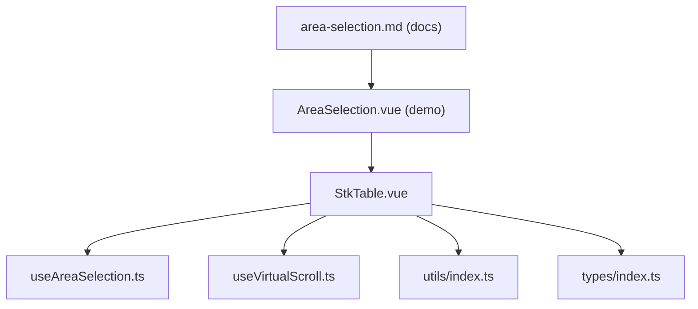
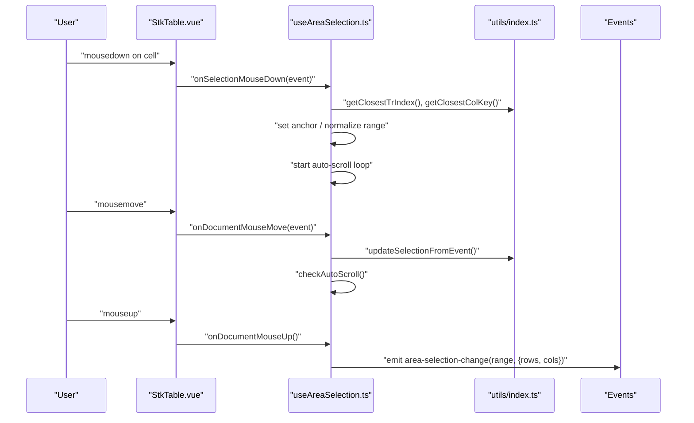
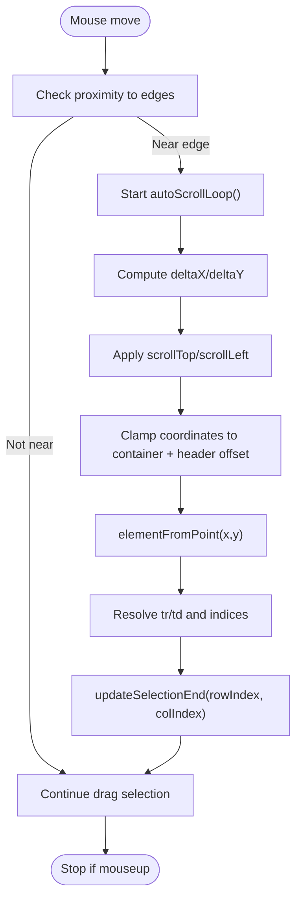
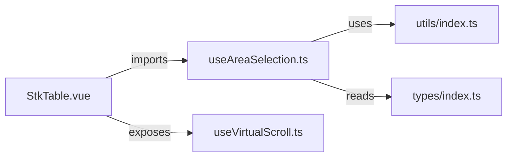

# Area Selection

<cite>
**Referenced Files in This Document**
- [useAreaSelection.ts](file://src/StkTable/useAreaSelection.ts)
- [StkTable.vue](file://src/StkTable/StkTable.vue)
- [types/index.ts](file://src/StkTable/types/index.ts)
- [utils/index.ts](file://src/StkTable/utils/index.ts)
- [useVirtualScroll.ts](file://src/StkTable/useVirtualScroll.ts)
- [AreaSelection.vue](file://docs-demo/advanced/area-selection/AreaSelection.vue)
- [area-selection.md](file://docs-src/main/table/advanced/area-selection.md)
- [area-selection.md](file://docs-src/en/main/table/advanced/area-selection.md)
</cite>

## Update Summary
**Changes Made**
- Updated feature name from "Drag Selection" to "Area Selection" throughout documentation
- Updated all references to useAreaSelection composable instead of useCellSelection
- Revised API documentation to reflect areaSelection prop and area-selection-change event
- Updated all code examples and diagrams to reference new area selection implementation
- Enhanced documentation to cover the renamed feature with improved functionality
- Updated troubleshooting guide with area selection specific edge cases

## Table of Contents
1. [Introduction](#introduction)
2. [Project Structure](#project-structure)
3. [Core Components](#core-components)
4. [Architecture Overview](#architecture-overview)
5. [Detailed Component Analysis](#detailed-component-analysis)
6. [Dependency Analysis](#dependency-analysis)
7. [Performance Considerations](#performance-considerations)
8. [Troubleshooting Guide](#troubleshooting-guide)
9. [Conclusion](#conclusion)
10. [Appendices](#appendices)

## Introduction
This document explains the area selection functionality for Stk Table Vue. The feature has been renamed from "Drag Selection" to "Area Selection" and provides comprehensive multi-row/column selection capabilities through mouse drag operations. It covers visual selection rectangles, keyboard modifier handling, selection state management, and the useAreaSelection composable. The documentation includes enhanced examples with improved styling and configuration for area selection functionality.

## Project Structure
Area selection is implemented as a composable hook that integrates with the main StkTable component. The composable manages selection state, mouse/touch events, automatic scrolling during drag, and emits selection updates. The main table component wires the composable into the cell rendering pipeline and applies selection styles.



**Diagram sources**
- [StkTable.vue](file://src/StkTable/StkTable.vue#L861-L867)
- [useAreaSelection.ts](file://src/StkTable/useAreaSelection.ts#L42-L51)
- [useVirtualScroll.ts](file://src/StkTable/useVirtualScroll.ts#L60-L69)
- [utils/index.ts](file://src/StkTable/utils/index.ts#L244-L257)
- [types/index.ts](file://src/StkTable/types/index.ts#L298-L317)
- [AreaSelection.vue](file://docs-demo/advanced/area-selection/AreaSelection.vue#L1-L62)
- [area-selection.md](file://docs-src/main/table/advanced/area-selection.md#L1-L17)

**Section sources**
- [StkTable.vue](file://src/StkTable/StkTable.vue#L861-L867)
- [useAreaSelection.ts](file://src/StkTable/useAreaSelection.ts#L42-L51)
- [AreaSelection.vue](file://docs-demo/advanced/area-selection/AreaSelection.vue#L1-L62)
- [area-selection.md](file://docs-src/main/table/advanced/area-selection.md#L1-L17)

## Core Components
- useAreaSelection composable: Manages selection state, mouse/touch handlers, auto-scroll during drag, keyboard shortcuts (copy, cancel), and emits selection changes.
- StkTable integration: Wires the composable into the table's cell rendering and applies selection classes.
- Utilities: Helper functions to resolve row/column indices from DOM nodes.
- Types: Defines selection range and configuration interfaces.

Key responsibilities:
- Track selection range and anchor point
- Compute selected cell keys for styling
- Normalize selection bounds
- Handle keyboard shortcuts (Ctrl/Cmd+C, Esc)
- Emit structured selection change events

**Section sources**
- [useAreaSelection.ts](file://src/StkTable/useAreaSelection.ts#L42-L51)
- [StkTable.vue](file://src/StkTable/StkTable.vue#L861-L867)
- [utils/index.ts](file://src/StkTable/utils/index.ts#L244-L257)
- [types/index.ts](file://src/StkTable/types/index.ts#L298-L317)

## Architecture Overview
The area selection flow spans the composable and the table component. The composable listens to mouse events on the table container and updates selection state. The table component applies selection classes to cells and emits selection change events.



**Diagram sources**
- [StkTable.vue](file://src/StkTable/StkTable.vue#L1315-L1322)
- [useAreaSelection.ts](file://src/StkTable/useAreaSelection.ts#L137-L172)
- [useAreaSelection.ts](file://src/StkTable/useAreaSelection.ts#L174-L186)
- [useAreaSelection.ts](file://src/StkTable/useAreaSelection.ts#L214-L282)
- [useAreaSelection.ts](file://src/StkTable/useAreaSelection.ts#L319-L330)
- [useAreaSelection.ts](file://src/StkTable/useAreaSelection.ts#L332-L345)
- [utils/index.ts](file://src/StkTable/utils/index.ts#L244-L257)

## Detailed Component Analysis

### useAreaSelection composable
Responsibilities:
- Selection state: selectionRange, isSelecting, anchorCell
- Event handling: mousedown, mousemove, mouseup, keydown
- Auto-scroll: detects proximity to edges and scrolls container via requestAnimationFrame
- Clipboard integration: formats and copies selected range to clipboard
- Selection classes: computes CSS classes for visual selection rectangle

Selection state management:
- Anchor point established on mousedown; subsequent mousemove updates selection end
- Shift-modified drag expands selection from anchor to current position
- Esc clears selection; Ctrl/Cmd+C copies selection to clipboard

Boundary detection and auto-scroll:
- Proximity threshold defines "edge zone"
- Delta calculation determines scroll direction and speed
- elementFromPoint used to resolve hovered cell after scroll

Visual selection classes:
- Top/bottom/left/right borders of selection rectangle
- Efficient class computation using normalized range and column key map

Clipboard formatting:
- Optional formatter callback to ensure copied text matches display

**Section sources**
- [useAreaSelection.ts](file://src/StkTable/useAreaSelection.ts#L52-L57)
- [useAreaSelection.ts](file://src/StkTable/useAreaSelection.ts#L137-L172)
- [useAreaSelection.ts](file://src/StkTable/useAreaSelection.ts#L174-L186)
- [useAreaSelection.ts](file://src/StkTable/useAreaSelection.ts#L214-L282)
- [useAreaSelection.ts](file://src/StkTable/useAreaSelection.ts#L284-L309)
- [useAreaSelection.ts](file://src/StkTable/useAreaSelection.ts#L319-L330)
- [useAreaSelection.ts](file://src/StkTable/useAreaSelection.ts#L332-L345)
- [useAreaSelection.ts](file://src/StkTable/useAreaSelection.ts#L347-L401)
- [useAreaSelection.ts](file://src/StkTable/useAreaSelection.ts#L409-L422)

### StkTable integration
Integration points:
- Exposes isSelecting flag to apply "is-cell-selecting" class on the container
- Applies selection classes to individual cells via getAreaSelectionClasses
- Hooks onCellMouseDown to delegate to composable when areaSelection is enabled
- Emits area-selection-change event with normalized rows and columns

Rendering:
- getAreaSelectionClasses adds "cell-range-*" classes for visual rectangle
- getRowIndex maps virtualized row indices to absolute positions for class computation

**Section sources**
- [StkTable.vue](file://src/StkTable/StkTable.vue#L28-L29)
- [StkTable.vue](file://src/StkTable/StkTable.vue#L1211-L1215)
- [StkTable.vue](file://src/StkTable/StkTable.vue#L1315-L1322)
- [StkTable.vue](file://src/StkTable/StkTable.vue#L861-L867)

### Demo Component Analysis
The demo component showcases the area selection functionality with enhanced styling and configuration.

The AreaSelection.vue component features:
- **Fixed height styling**: `style="height: 400px"` for consistent viewport
- **Explicit row-key property**: `row-key="id"` for better performance and stability
- **Expanded column configuration**: 8 columns with city-related data
- **Realistic data structure**: Cities array with 4 distinct city names repeated across columns
- **Improved event handling**: Better data processing efficiency with enhanced column mapping

```typescript
// Enhanced column configuration with 8 columns
const cols = [
    { title: 'ID', dataIndex: 'id', fixed: 'left', width: 50 },
    { title: 'Name', dataIndex: 'name', width: 120 },
    { title: 'Age', dataIndex: 'age', width: 80 },
    { title: 'City', dataIndex: 'city', width: 120 },
    { title: 'City', dataIndex: 'city1', width: 120 },
    { title: 'City', dataIndex: 'city2', width: 120 },
    { title: 'City', dataIndex: 'city3', width: 120 },
    { title: 'City', dataIndex: 'city4', width: 120 },
];

// Enhanced data generation with realistic city data
const rows = Array.from({ length: 100 }, (_, i) => ({
    id: i + 1,
    name: `User${i + 1}`,
    age: 20 + (i % 30),
    city: ['Beijing', 'Shanghai', 'Guangzhou', 'Shenzhen'][i % 4],
}));
```

**Section sources**
- [AreaSelection.vue](file://docs-demo/advanced/area-selection/AreaSelection.vue#L1-L62)

### Selection area calculation and boundary detection
Normalization:
- normalizeRange ensures min/max row/column indices regardless of drag direction

Boundary detection:
- EDGE_ZONE constant defines proximity threshold
- SCROLL_SPEED_MAX caps scroll delta per frame
- elementFromPoint clamped to container bounds plus header offset to avoid header interference



**Diagram sources**
- [useAreaSelection.ts](file://src/StkTable/useAreaSelection.ts#L214-L282)
- [useAreaSelection.ts](file://src/StkTable/useAreaSelection.ts#L284-L309)

**Section sources**
- [useAreaSelection.ts](file://src/StkTable/useAreaSelection.ts#L17-L24)
- [useAreaSelection.ts](file://src/StkTable/useAreaSelection.ts#L214-L282)
- [useAreaSelection.ts](file://src/StkTable/useAreaSelection.ts#L284-L309)

### Keyboard modifier handling
- Shift: Expands selection from anchor to current position
- Ctrl/Cmd+C: Copies selected range to clipboard using optional formatter
- Esc: Clears selection and emits empty selection

Clipboard behavior:
- Formats rows x columns grid with tab-separated values per line
- Uses optional formatCellForClipboard to match custom cell rendering

**Section sources**
- [useAreaSelection.ts](file://src/StkTable/useAreaSelection.ts#L146-L163)
- [useAreaSelection.ts](file://src/StkTable/useAreaSelection.ts#L357-L401)
- [types/index.ts](file://src/StkTable/types/index.ts#L307-L317)

### Practical examples
Enhanced examples showcasing the area selection functionality:

- **Basic area selection**: Enable areaSelection with `:area-selection="{ formatCellForClipboard: fn }"` and listen to `area-selection-change`
- **Range selection with keyboard modifiers**: Hold Shift while dragging to expand from anchor
- **Copy to clipboard**: Press Ctrl/Cmd+C to copy selected range with enhanced formatting
- **Clear selection**: Press Esc to cancel
- **Large dataset handling**: Test with 100 rows and 8 columns for performance validation

The demo provides:
- Fixed height container (400px) for consistent viewport
- Explicit row-key configuration for better performance
- Multiple city columns demonstrating complex column scenarios
- Realistic data structure with repeating city names
- Improved event handling for better data processing

**Section sources**
- [AreaSelection.vue](file://docs-demo/advanced/area-selection/AreaSelection.vue#L1-L62)
- [area-selection.md](file://docs-src/main/table/advanced/area-selection.md#L1-L17)

## Dependency Analysis
- useAreaSelection depends on:
  - StkTable props/emits for configuration and events
  - tableContainerRef for event listeners and scroll container
  - dataSourceCopy and tableHeaderLast for selection payload
  - colKeyGen and cellKeyGen for key resolution
  - getClosestTrIndex and getClosestColKey from utils for DOM queries

- StkTable integrates useAreaSelection and passes:
  - props.areaSelection configuration
  - emits for area-selection-change
  - refs for container and data/header arrays



**Diagram sources**
- [StkTable.vue](file://src/StkTable/StkTable.vue#L265)
- [useAreaSelection.ts](file://src/StkTable/useAreaSelection.ts#L1-L14)
- [utils/index.ts](file://src/StkTable/utils/index.ts#L244-L257)
- [types/index.ts](file://src/StkTable/types/index.ts#L298-L317)

**Section sources**
- [StkTable.vue](file://src/StkTable/StkTable.vue#L265)
- [useAreaSelection.ts](file://src/StkTable/useAreaSelection.ts#L1-L14)
- [utils/index.ts](file://src/StkTable/utils/index.ts#L244-L257)
- [types/index.ts](file://src/StkTable/types/index.ts#L298-L317)

## Performance Considerations
Enhanced performance considerations for larger datasets with expanded column configurations.

- **Large datasets with multiple columns**:
  - Selection computation is O(rows × cols) within the normalized range; with 8 columns vs 4, expect ~2x computational overhead
  - Avoid frequent re-computation by leveraging computed caches (selectedCellKeys, normalizedRange)
  - The demo with 100 rows × 8 columns demonstrates efficient handling

- **Virtual scrolling optimization**:
  - Selection classes are computed against absolute row indices; virtualization does not affect selection correctness
  - Auto-scroll uses requestAnimationFrame to batch DOM reads/writes and minimize layout thrash
  - Fixed height container (400px) improves scroll performance consistency

- **Clipboard operations with expanded data**:
  - Text generation scales with selected area; with 8 columns, expect larger clipboard payloads
  - Consider limiting clipboard size for very large selections (more than 50×8 cells)

- **Accessibility improvements**:
  - The table sets tabindex when areaSelection is enabled, enabling keyboard focus for selection-related actions
  - Demo maintains accessibility with proper ARIA attributes

**Section sources**
- [useAreaSelection.ts](file://src/StkTable/useAreaSelection.ts#L75-L95)
- [useAreaSelection.ts](file://src/StkTable/useAreaSelection.ts#L97-L102)
- [useAreaSelection.ts](file://src/StkTable/useAreaSelection.ts#L237-L282)
- [StkTable.vue](file://src/StkTable/StkTable.vue#L30)
- [useVirtualScroll.ts](file://src/StkTable/useVirtualScroll.ts#L99-L101)
- [AreaSelection.vue](file://docs-demo/advanced/area-selection/AreaSelection.vue#L4-L6)

## Troubleshooting Guide
Enhanced troubleshooting guide with area selection specific edge cases.

Common issues and resolutions:
- **Selection not updating during drag with multiple columns**:
  - Ensure mousedown is captured on cells and delegated to onSelectionMouseDown
  - Verify tableContainerRef is attached and events are registered
  - Check that colKeyGen properly resolves column keys for all 8 columns

- **Partial cell selection with fixed columns**:
  - elementFromPoint clamps coordinates to container bounds and header region; ensure table has proper header and body structure
  - Fixed left columns (ID column) should work seamlessly with area selection

- **Conflicts with row dragging**:
  - Row drag and cell drag use different drag APIs; ensure row drag handlers do not interfere with cell selection mouse events

- **Touch devices**:
  - The composable registers mousemove/mouseup on document; touchmove/touchend are not handled. Consider adding touch event handlers if needed

- **Dynamic data changes with expanded columns**:
  - Adding/removing rows/columns dynamically can invalidate selection indices. Reinitialize selection after structural changes
  - The demo with 8 columns requires careful column configuration to prevent selection errors

- **Performance issues with large datasets**:
  - Monitor selection computation time with 100 rows × 8 columns
  - Consider virtualization settings for optimal performance
  - Use fixed height containers to improve scroll performance consistency

**Section sources**
- [useAreaSelection.ts](file://src/StkTable/useAreaSelection.ts#L112-L128)
- [useAreaSelection.ts](file://src/StkTable/useAreaSelection.ts#L284-L309)
- [StkTable.vue](file://src/StkTable/StkTable.vue#L1315-L1322)
- [AreaSelection.vue](file://docs-demo/advanced/area-selection/AreaSelection.vue#L24-L40)

## Conclusion
The area selection feature in Stk Table Vue is built around a robust composable that handles mouse/touch interactions, auto-scrolling, keyboard shortcuts, and visual feedback. The renamed feature provides comprehensive multi-row/column selection capabilities with enhanced functionality. The demo component showcases improved styling, configuration, and data structure with 8 columns and realistic city data. It integrates cleanly with the table's rendering pipeline and supports virtual scrolling and large datasets with careful performance considerations. The provided demo and documentation illustrate practical usage and edge-case handling with the enhanced configuration.

## Appendices

### API and Types
- AreaSelectionRange: start/end row/column indices
- AreaSelectionConfig: optional formatCellForClipboard callback
- getAreaSelectionClasses: returns CSS classes for selection rectangle

**Section sources**
- [types/index.ts](file://src/StkTable/types/index.ts#L298-L317)
- [useAreaSelection.ts](file://src/StkTable/useAreaSelection.ts#L409-L422)

### Demo Configuration Reference
Reference for the demo component configuration:

```typescript
// Demo configuration
const cols = [
    { title: 'ID', dataIndex: 'id', fixed: 'left', width: 50 },
    { title: 'Name', dataIndex: 'name', width: 120 },
    { title: 'Age', dataIndex: 'age', width: 80 },
    { title: 'City', dataIndex: 'city', width: 120 },
    { title: 'City', dataIndex: 'city1', width: 120 },
    { title: 'City', dataIndex: 'city2', width: 120 },
    { title: 'City', dataIndex: 'city3', width: 120 },
    { title: 'City', dataIndex: 'city4', width: 120 },
];

const rows = Array.from({ length: 100 }, (_, i) => ({
    id: i + 1,
    name: `User${i + 1}`,
    age: 20 + (i % 30),
    city: ['Beijing', 'Shanghai', 'Guangzhou', 'Shenzhen'][i % 4],
}));
```

**Section sources**
- [AreaSelection.vue](file://docs-demo/advanced/area-selection/AreaSelection.vue#L22-L40)