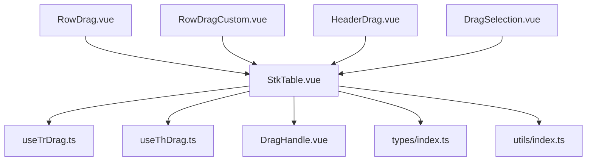
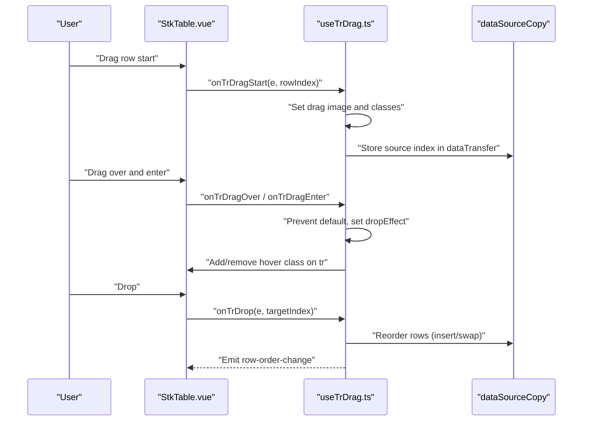
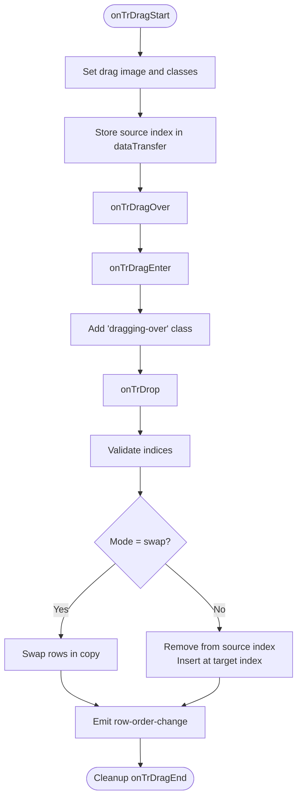
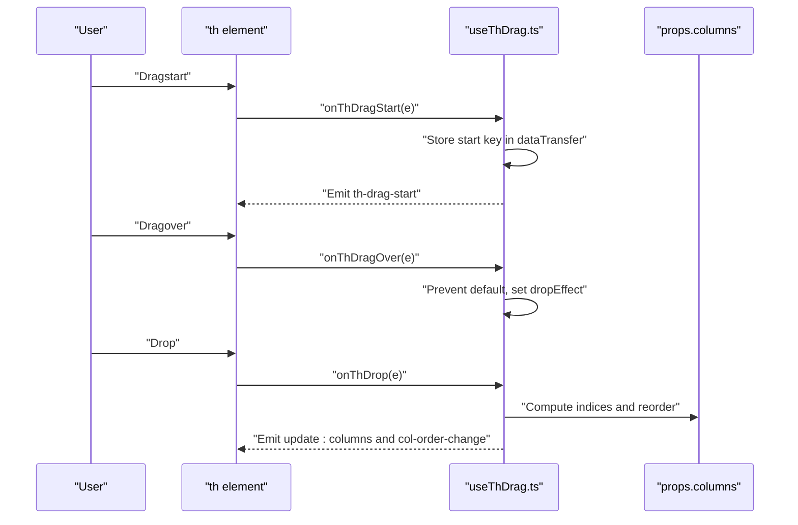
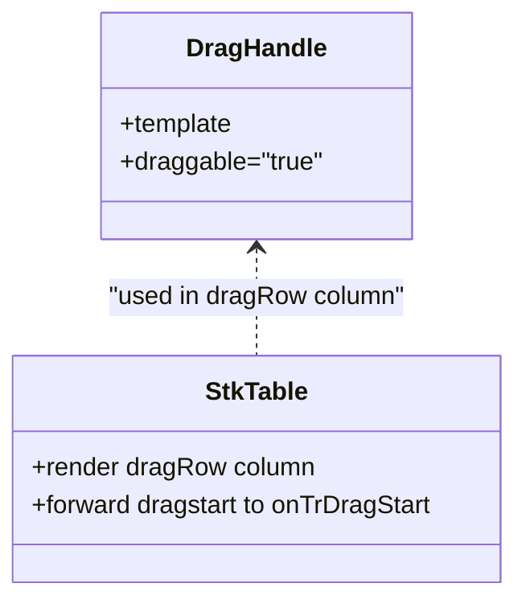
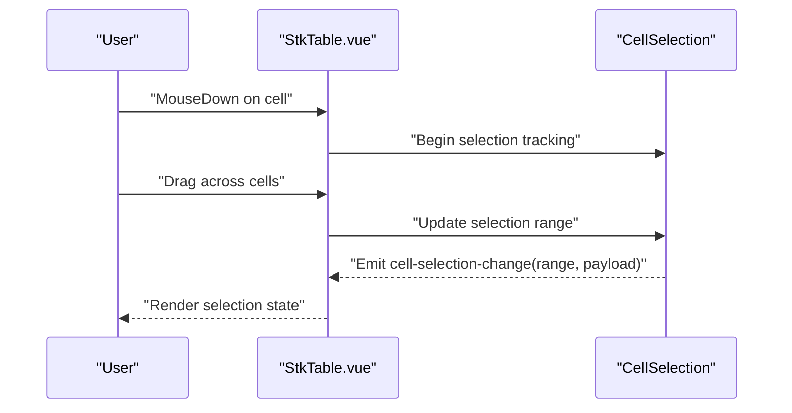
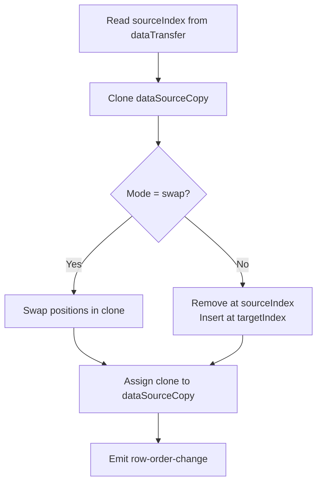
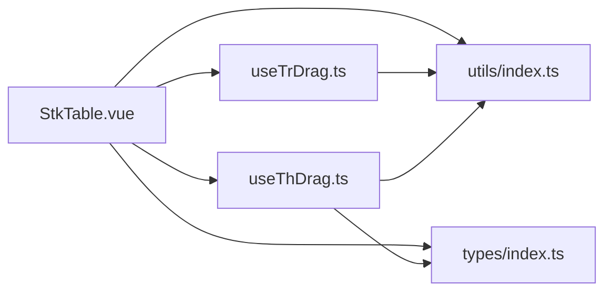

# Drag and Drop

<cite>
**Referenced Files in This Document**
- [StkTable.vue](file://src/StkTable/StkTable.vue)
- [useTrDrag.ts](file://src/StkTable/useTrDrag.ts)
- [useThDrag.ts](file://src/StkTable/useThDrag.ts)
- [DragHandle.vue](file://src/StkTable/components/DragHandle.vue)
- [index.ts](file://src/StkTable/types/index.ts)
- [index.ts](file://src/StkTable/utils/index.ts)
- [RowDrag.vue](file://docs-demo/advanced/row-drag/RowDrag.vue)
- [RowDragCustom.vue](file://docs-demo/advanced/row-drag/RowDragCustom.vue)
- [HeaderDrag.vue](file://docs-demo/advanced/header-drag/HeaderDrag.vue)
- [DragSelection.vue](file://docs-demo/advanced/drag-selection/DragSelection.vue)
</cite>

## Table of Contents
1. [Introduction](#introduction)
2. [Project Structure](#project-structure)
3. [Core Components](#core-components)
4. [Architecture Overview](#architecture-overview)
5. [Detailed Component Analysis](#detailed-component-analysis)
6. [Dependency Analysis](#dependency-analysis)
7. [Performance Considerations](#performance-considerations)
8. [Troubleshooting Guide](#troubleshooting-guide)
9. [Conclusion](#conclusion)
10. [Appendices](#appendices)

## Introduction
This document explains the drag-and-drop capabilities in Stk Table Vue, focusing on row dragging with visual feedback and drop zone validation, column header reordering, and drag selection for multi-row selection. It details the underlying algorithms, event handling, data transformations during drag operations, and integration with selection systems. Practical examples demonstrate custom drag behaviors, conflict handling with other interactions, and performance optimization for large datasets.

## Project Structure
The drag-and-drop features are implemented as composable hooks integrated into the main table component and supported by demo pages and types.

**Diagram sources**
- [StkTable.vue](file://src/StkTable/StkTable.vue#L1-L200)
- [useTrDrag.ts](file://src/StkTable/useTrDrag.ts#L1-L114)
- [useThDrag.ts](file://src/StkTable/useThDrag.ts#L1-L103)
- [DragHandle.vue](file://src/StkTable/components/DragHandle.vue#L1-L10)
- [index.ts](file://src/StkTable/types/index.ts#L249-L273)
- [index.ts](file://src/StkTable/utils/index.ts#L245-L258)
- [RowDrag.vue](file://docs-demo/advanced/row-drag/RowDrag.vue#L1-L53)
- [RowDragCustom.vue](file://docs-demo/advanced/row-drag/RowDragCustom.vue#L1-L176)
- [HeaderDrag.vue](file://docs-demo/advanced/header-drag/HeaderDrag.vue#L1-L39)
- [DragSelection.vue](file://docs-demo/advanced/drag-selection/DragSelection.vue#L1-L59)

**Section sources**
- [StkTable.vue](file://src/StkTable/StkTable.vue#L1-L200)
- [RowDrag.vue](file://docs-demo/advanced/row-drag/RowDrag.vue#L1-L53)
- [RowDragCustom.vue](file://docs-demo/advanced/row-drag/RowDragCustom.vue#L1-L176)
- [HeaderDrag.vue](file://docs-demo/advanced/header-drag/HeaderDrag.vue#L1-L39)
- [DragSelection.vue](file://docs-demo/advanced/drag-selection/DragSelection.vue#L1-L59)

## Core Components
- Row drag hook: Implements HTML5 Drag and Drop for rows with visual feedback and configurable insertion/swap modes.
- Column drag hook: Implements HTML5 Drag and Drop for column headers with insert/swap reordering and event emission.
- Drag handle component: Provides a reusable SVG handle for explicit row drag initiation.
- Types: Define drag configurations, column types, and event signatures.
- Utilities: Provide helpers for DOM traversal and drag image customization.

**Section sources**
- [useTrDrag.ts](file://src/StkTable/useTrDrag.ts#L1-L114)
- [useThDrag.ts](file://src/StkTable/useThDrag.ts#L1-L103)
- [DragHandle.vue](file://src/StkTable/components/DragHandle.vue#L1-L10)
- [index.ts](file://src/StkTable/types/index.ts#L249-L273)
- [index.ts](file://src/StkTable/utils/index.ts#L245-L258)

## Architecture Overview
The table component wires global drag events on the table body and header. Row drag events are handled by the row drag hook, which updates a shallow copy of the data source. Column drag events are handled by the column drag hook, which updates the columns array and emits reordering events.

**Diagram sources**
- [StkTable.vue](file://src/StkTable/StkTable.vue#L53-L116)
- [useTrDrag.ts](file://src/StkTable/useTrDrag.ts#L26-L103)

**Section sources**
- [StkTable.vue](file://src/StkTable/StkTable.vue#L53-L116)
- [useTrDrag.ts](file://src/StkTable/useTrDrag.ts#L19-L112)

## Detailed Component Analysis

### Row Drag Implementation
Row dragging uses HTML5 Drag and Drop APIs with explicit visual feedback and configurable behavior.

- Initialization and configuration
  - The row drag hook computes a default mode and merges user-provided config.
  - The table binds global drag handlers on the table element and per-row drop handlers on tbody tr elements.
- Drag lifecycle
  - Start: Sets drag image to the dragged row, adds a dragging class, stores source index in dataTransfer.
  - Over/Enter: Prevents default, sets dropEffect to move, toggles a “dragging-over” class on hovered tr.
  - End: Removes classes and resets internal flag.
  - Drop: Reads source index, validates indices, performs insert or swap on a shallow copy of the data source, and emits a row-order-change event.
- Visual feedback
  - Adds/removes CSS classes on the dragged and hovered rows.
  - Uses dataTransfer.setDragImage to customize the drag preview.

**Diagram sources**
- [useTrDrag.ts](file://src/StkTable/useTrDrag.ts#L26-L103)
- [StkTable.vue](file://src/StkTable/StkTable.vue#L53-L116)

**Section sources**
- [useTrDrag.ts](file://src/StkTable/useTrDrag.ts#L19-L112)
- [StkTable.vue](file://src/StkTable/StkTable.vue#L53-L116)

### Column Header Drag Reordering
Column header dragging enables reordering of columns via drag-and-drop on header cells.

- Configuration
  - The column drag hook computes a merged config including mode and disabled predicate.
- Drag lifecycle
  - Start: Stores the starting column key in dataTransfer and emits a start event.
  - Over: Validates draggable state and sets dropEffect to move.
  - Drop: Compares start and end keys, finds indices, performs insert or swap on a shallow copy of columns, emits update:columns and col-order-change.
- Integration
  - The table binds dragstart, dragover, and drop handlers on th elements and delegates to the hook.

**Diagram sources**
- [useThDrag.ts](file://src/StkTable/useThDrag.ts#L28-L93)
- [StkTable.vue](file://src/StkTable/StkTable.vue#L73-L76)

**Section sources**
- [useThDrag.ts](file://src/StkTable/useThDrag.ts#L14-L101)
- [StkTable.vue](file://src/StkTable/StkTable.vue#L61-L100)

### Custom Drag Handles
The built-in drag handle component provides a dedicated draggable area for initiating row drags. The table integrates this handle in dragRow-type columns and forwards dragstart events to the row drag handler.

- Built-in handle
  - A small SVG icon marked as draggable.
- Column integration
  - When a column’s type is dragRow, the table renders the handle and attaches onDragStart to forward to the row drag handler.
- Demo usage
  - The demo shows enabling header-drag and using a dragRow column to initiate row drags.

**Diagram sources**
- [DragHandle.vue](file://src/StkTable/components/DragHandle.vue#L1-L10)
- [StkTable.vue](file://src/StkTable/StkTable.vue#L150-L171)

**Section sources**
- [DragHandle.vue](file://src/StkTable/components/DragHandle.vue#L1-L10)
- [StkTable.vue](file://src/StkTable/StkTable.vue#L150-L171)
- [RowDrag.vue](file://docs-demo/advanced/row-drag/RowDrag.vue#L14-L25)

### Drag Selection for Multi-Row Selection
Drag selection allows selecting multiple rows by dragging across the table. The table exposes a cellSelection prop and emits cell-selection-change with the current selection range and payload.

- Configuration
  - Enable cellSelection and optionally provide a formatter for clipboard text.
- Behavior
  - The selection system tracks mouse interactions and emits a range and payload indicating selected rows/columns.
- Integration
  - The demo binds to cell-selection-change to display the current selection state.

**Diagram sources**
- [DragSelection.vue](file://docs-demo/advanced/drag-selection/DragSelection.vue#L1-L59)
- [StkTable.vue](file://src/StkTable/StkTable.vue#L347-L347)

**Section sources**
- [DragSelection.vue](file://docs-demo/advanced/drag-selection/DragSelection.vue#L1-L59)
- [StkTable.vue](file://src/StkTable/StkTable.vue#L347-L347)

### Underlying Algorithms and Data Transformation
- Row reordering
  - Uses splice operations to remove and insert items for insert mode, or swaps positions for swap mode.
  - Operates on a shallow copy of the data source to avoid mutating the original array until emitted.
- Column reordering
  - Finds indices by comparing column keys generated by colKeyGen, then applies splice or swap to reorder columns.
- Event emission
  - Emits row-order-change and col-order-change with source/target identifiers for downstream handling.

**Diagram sources**
- [useTrDrag.ts](file://src/StkTable/useTrDrag.ts#L80-L103)

**Section sources**
- [useTrDrag.ts](file://src/StkTable/useTrDrag.ts#L80-L103)
- [useThDrag.ts](file://src/StkTable/useThDrag.ts#L68-L93)

## Dependency Analysis
The table component composes drag behaviors and exposes them through props and events. Hooks encapsulate drag logic and rely on shared utilities for DOM traversal.

**Diagram sources**
- [StkTable.vue](file://src/StkTable/StkTable.vue#L260-L267)
- [useTrDrag.ts](file://src/StkTable/useTrDrag.ts#L1-L14)
- [useThDrag.ts](file://src/StkTable/useThDrag.ts#L1-L9)
- [index.ts](file://src/StkTable/types/index.ts#L249-L273)
- [index.ts](file://src/StkTable/utils/index.ts#L245-L258)

**Section sources**
- [StkTable.vue](file://src/StkTable/StkTable.vue#L260-L267)
- [useTrDrag.ts](file://src/StkTable/useTrDrag.ts#L1-L14)
- [useThDrag.ts](file://src/StkTable/useThDrag.ts#L1-L9)

## Performance Considerations
- Virtual scrolling
  - Row drag operates on a shallow copy of the visible data slice; heavy reordering on very large datasets should consider limiting frequent re-renders.
- Drag image customization
  - Using setDragImage on the entire row can be expensive; keep drag previews minimal.
- Event throttling
  - For high-frequency dragover/enter events, consider throttling DOM class toggling to reduce layout thrash.
- Data mutation
  - Always operate on a copy of the data source to avoid unnecessary reactive updates; emit changes after batch operations.

[No sources needed since this section provides general guidance]

## Troubleshooting Guide
- Drag not triggering drop
  - Ensure preventDefault is called in dragover and dragenter handlers to allow drop events to fire.
- Incorrect hover feedback
  - Verify that the “dragging-over” class is toggled on entering/exiting tr elements and removed on dragend.
- Column reordering not working
  - Confirm that header-drag is enabled and th elements are marked draggable; check that dataTransfer keys match expected column keys.
- Conflicts with selection
  - When combining drag selection with row drag, ensure selection handlers do not intercept dragstart/dragover unintentionally.

**Section sources**
- [useTrDrag.ts](file://src/StkTable/useTrDrag.ts#L42-L78)
- [useThDrag.ts](file://src/StkTable/useThDrag.ts#L42-L64)
- [StkTable.vue](file://src/StkTable/StkTable.vue#L53-L116)

## Conclusion
Stk Table Vue provides robust, extensible drag-and-drop capabilities for rows and columns, with clear separation of concerns via composable hooks. The implementation supports visual feedback, configurable reordering modes, and integration with selection systems. By leveraging shallow copies and emitting change events, applications can efficiently manage state transitions and maintain responsiveness even with large datasets.

[No sources needed since this section summarizes without analyzing specific files]

## Appendices

### Practical Examples and Patterns
- Built-in row drag with dragRow column
  - Enable a dragRow column and use the built-in handle to initiate drags; the table manages visuals and emits row-order-change.
  - See [RowDrag.vue](file://docs-demo/advanced/row-drag/RowDrag.vue#L14-L25).
- Custom drag handle with manual drag events
  - Render a custom handle per row and wire native dragstart/dragover/drop handlers to perform row reordering on the data source.
  - See [RowDragCustom.vue](file://docs-demo/advanced/row-drag/RowDragCustom.vue#L18-L41).
- Column header reordering
  - Enable header-drag and bind to update:columns and col-order-change to persist column order.
  - See [HeaderDrag.vue](file://docs-demo/advanced/header-drag/HeaderDrag.vue#L30-L37).
- Drag selection for multi-row selection
  - Enable cellSelection and listen to cell-selection-change to track selection ranges and payload.
  - See [DragSelection.vue](file://docs-demo/advanced/drag-selection/DragSelection.vue#L1-L14).

**Section sources**
- [RowDrag.vue](file://docs-demo/advanced/row-drag/RowDrag.vue#L1-L53)
- [RowDragCustom.vue](file://docs-demo/advanced/row-drag/RowDragCustom.vue#L1-L176)
- [HeaderDrag.vue](file://docs-demo/advanced/header-drag/HeaderDrag.vue#L1-L39)
- [DragSelection.vue](file://docs-demo/advanced/drag-selection/DragSelection.vue#L1-L59)