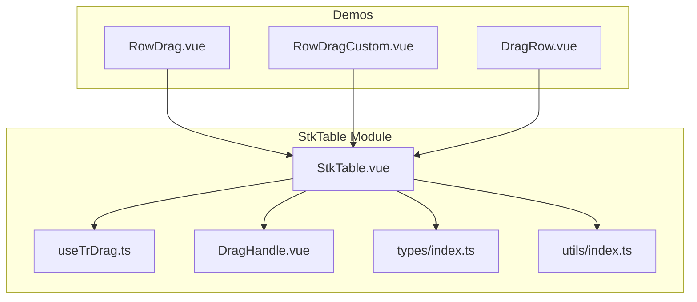
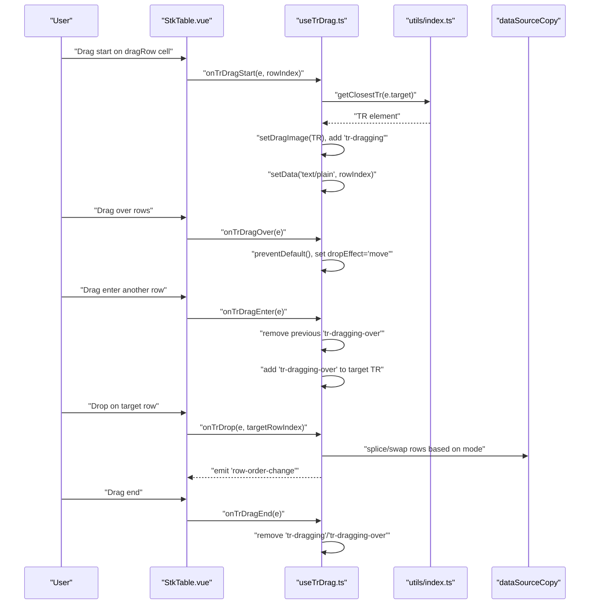
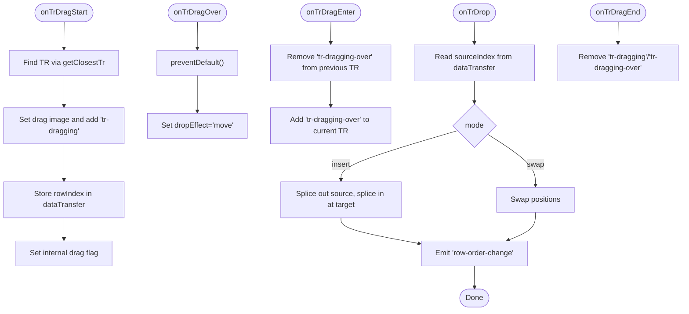
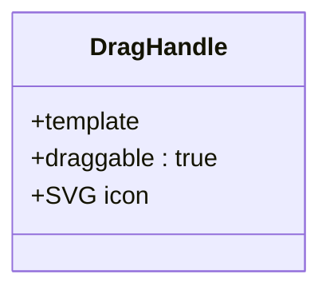
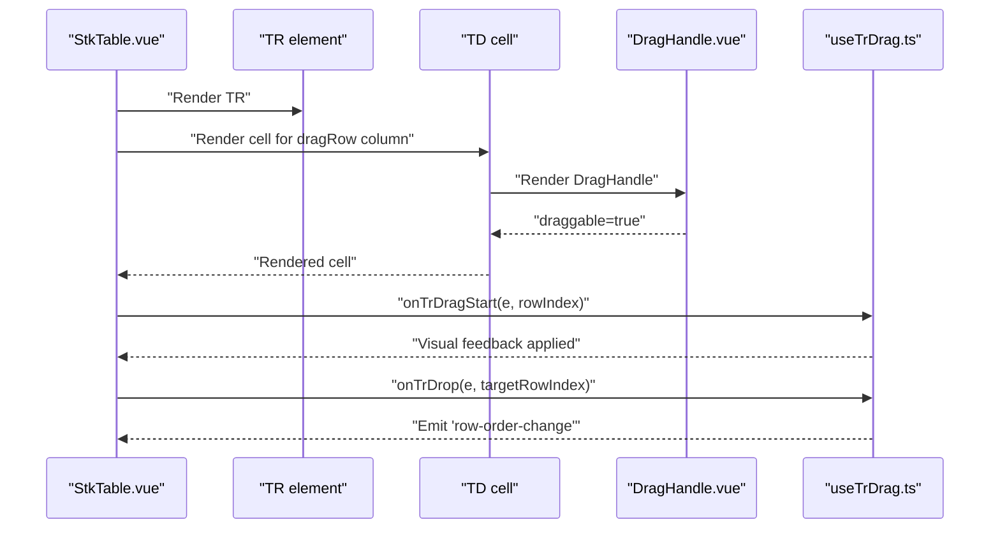
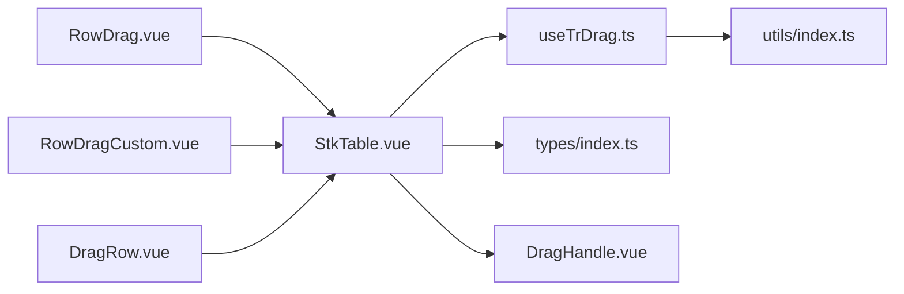

# Row Dragging

<cite>
**Referenced Files in This Document**
- [useTrDrag.ts](file://src/StkTable/useTrDrag.ts)
- [DragHandle.vue](file://src/StkTable/components/DragHandle.vue)
- [StkTable.vue](file://src/StkTable/StkTable.vue)
- [index.ts](file://src/StkTable/types/index.ts)
- [index.ts](file://src/StkTable/utils/index.ts)
- [RowDrag.vue](file://docs-demo/advanced/row-drag/RowDrag.vue)
- [RowDragCustom.vue](file://docs-demo/advanced/row-drag/RowDragCustom.vue)
- [DragRow.vue](file://test/DragRow.vue)
- [row-drag.md](file://docs-src/en/main/table/advanced/row-drag.md)
</cite>

## Table of Contents
1. [Introduction](#introduction)
2. [Project Structure](#project-structure)
3. [Core Components](#core-components)
4. [Architecture Overview](#architecture-overview)
5. [Detailed Component Analysis](#detailed-component-analysis)
6. [Dependency Analysis](#dependency-analysis)
7. [Performance Considerations](#performance-considerations)
8. [Troubleshooting Guide](#troubleshooting-guide)
9. [Conclusion](#conclusion)
10. [Appendices](#appendices)

## Introduction
This document explains the row dragging functionality in Stk Table Vue. It covers how to enable draggable rows via the built-in dragRow column type, how the useTrDrag composable implements drag-and-drop behavior, how drag handles are positioned and styled, and how drop zones are validated. It also documents event handling for drag start, drag over, drop, and drag end, along with practical examples for basic row reordering, custom drag handle implementation, and integration with virtual scrolling. Additional guidance is provided for performance with large datasets, resolving conflicts with selection systems, and accessibility considerations for keyboard navigation during drag operations.

## Project Structure
The row dragging feature spans several modules:
- A composable that encapsulates drag-and-drop logic for rows
- A reusable drag handle component
- The main table component wiring drag events and rendering dragRow cells
- Type definitions for dragRow configuration and column types
- Utility helpers for DOM traversal and index retrieval
- Demo pages showcasing built-in and custom drag handle implementations

**Diagram sources**
- [StkTable.vue](file://src/StkTable/StkTable.vue#L1-L200)
- [useTrDrag.ts](file://src/StkTable/useTrDrag.ts#L1-L114)
- [DragHandle.vue](file://src/StkTable/components/DragHandle.vue#L1-L10)
- [index.ts](file://src/StkTable/types/index.ts#L54-L120)
- [index.ts](file://src/StkTable/utils/index.ts#L244-L257)
- [RowDrag.vue](file://docs-demo/advanced/row-drag/RowDrag.vue#L1-L53)
- [RowDragCustom.vue](file://docs-demo/advanced/row-drag/RowDragCustom.vue#L1-L176)
- [DragRow.vue](file://test/DragRow.vue#L1-L195)

**Section sources**
- [StkTable.vue](file://src/StkTable/StkTable.vue#L1-L200)
- [useTrDrag.ts](file://src/StkTable/useTrDrag.ts#L1-L114)
- [DragHandle.vue](file://src/StkTable/components/DragHandle.vue#L1-L10)
- [index.ts](file://src/StkTable/types/index.ts#L54-L120)
- [index.ts](file://src/StkTable/utils/index.ts#L244-L257)
- [RowDrag.vue](file://docs-demo/advanced/row-drag/RowDrag.vue#L1-L53)
- [RowDragCustom.vue](file://docs-demo/advanced/row-drag/RowDragCustom.vue#L1-L176)
- [DragRow.vue](file://test/DragRow.vue#L1-L195)

## Core Components
- useTrDrag composable: Implements drag-and-drop lifecycle for rows, sets visual feedback classes, manages data transfer, and updates the data source according to configured mode.
- DragHandle component: Provides a reusable SVG-based drag handle that is draggable and styled for consistent UX.
- StkTable integration: Wires drag events at the table and row level, renders dragRow cells, and applies drag-related classes.
- Types and utilities: Define column types, dragRow configuration, and helper functions for DOM traversal and index extraction.

Key responsibilities:
- Event orchestration: Drag start, drag over, drag enter, drop, and drag end
- Visual feedback: Adds/removes CSS classes for dragging and drag-over states
- Data mutation: Reorders rows in the data source based on mode (insert or swap)
- Drop zone validation: Uses closest TR element to determine valid drop targets

**Section sources**
- [useTrDrag.ts](file://src/StkTable/useTrDrag.ts#L19-L114)
- [DragHandle.vue](file://src/StkTable/components/DragHandle.vue#L1-L10)
- [StkTable.vue](file://src/StkTable/StkTable.vue#L110-L176)
- [index.ts](file://src/StkTable/types/index.ts#L249-L253)
- [index.ts](file://src/StkTable/utils/index.ts#L244-L257)

## Architecture Overview
The row dragging architecture integrates a composable with the main table component and optional custom drag handles.

**Diagram sources**
- [useTrDrag.ts](file://src/StkTable/useTrDrag.ts#L26-L103)
- [index.ts](file://src/StkTable/utils/index.ts#L244-L257)
- [StkTable.vue](file://src/StkTable/StkTable.vue#L110-L176)

## Detailed Component Analysis

### useTrDrag Composable
Implements the drag-and-drop logic for rows:
- Computes dragRowConfig with a default mode of insert
- Handles drag start: captures TR element, sets drag image, adds dragging class, stores row index in data transfer
- Handles drag over: prevents default and sets drop effect
- Handles drag enter: toggles drag-over class on TR elements
- Handles drag end: removes visual classes and resets internal flag
- Handles drop: reads source index from data transfer, validates indices, reorders data source based on mode, and emits row-order-change

**Diagram sources**
- [useTrDrag.ts](file://src/StkTable/useTrDrag.ts#L26-L103)
- [index.ts](file://src/StkTable/utils/index.ts#L244-L257)

**Section sources**
- [useTrDrag.ts](file://src/StkTable/useTrDrag.ts#L19-L114)

### Drag Handle Component
Provides a reusable, draggable handle for initiating row drags:
- Renders an SVG icon inside a span with draggable="true"
- Applies a cursor style suitable for grabbing
- Integrates with the table’s dragRow column type

**Diagram sources**
- [DragHandle.vue](file://src/StkTable/components/DragHandle.vue#L1-L10)

**Section sources**
- [DragHandle.vue](file://src/StkTable/components/DragHandle.vue#L1-L10)

### StkTable Integration and Rendering
The main table component:
- Registers global drag handlers on the table element (dragover, dragenter, dragend)
- Renders rows and cells, including dragRow cells
- Injects a DragHandle component into dragRow cells
- Applies drag-related classes to rows and cells
- Emits row-order-change after successful reorder

**Diagram sources**
- [StkTable.vue](file://src/StkTable/StkTable.vue#L110-L176)
- [StkTable.vue](file://src/StkTable/StkTable.vue#L150-L171)
- [useTrDrag.ts](file://src/StkTable/useTrDrag.ts#L26-L103)

**Section sources**
- [StkTable.vue](file://src/StkTable/StkTable.vue#L110-L176)
- [StkTable.vue](file://src/StkTable/StkTable.vue#L150-L171)

### Drag Handle Positioning and Visual Feedback
- Positioning: The DragHandle is rendered inside the dragRow cell and acts as the drag initiator.
- Visual feedback: The composable toggles CSS classes on the dragged TR and the hovered TR to indicate drag state and drop zone.
- Styling: The DragHandle component defines hover and grab styles; the table applies drag-row-cell class to dragRow cells.

Practical implications:
- Users can click and drag the handle to move entire rows
- Hovering over a row highlights it as a valid drop target
- The drag image is the entire TR element, providing immediate visual feedback

**Section sources**
- [DragHandle.vue](file://src/StkTable/components/DragHandle.vue#L1-L10)
- [StkTable.vue](file://src/StkTable/StkTable.vue#L1223-L1225)
- [useTrDrag.ts](file://src/StkTable/useTrDrag.ts#L31-L32)
- [useTrDrag.ts](file://src/StkTable/useTrDrag.ts#L62-L63)

### Drop Zone Validation Logic
- The system identifies the target TR under the pointer using a utility function
- Drag enter removes previous drag-over class and applies it to the new TR
- Drop reads the source index from data transfer and validates against the target index
- Reordering respects the configured mode (insert or swap)

Edge cases handled:
- If source equals target, no change occurs
- If dataTransfer is missing, the operation is ignored
- Classes are cleaned up on drag end

**Section sources**
- [useTrDrag.ts](file://src/StkTable/useTrDrag.ts#L52-L78)
- [useTrDrag.ts](file://src/StkTable/useTrDrag.ts#L80-L103)
- [index.ts](file://src/StkTable/utils/index.ts#L244-L257)

### Event Handling Reference
- Drag start: Initializes drag state, sets drag image, stores row index
- Drag over: Allows drop and sets move effect
- Drag enter: Highlights target row
- Drop: Reorders data source and emits row-order-change
- Drag end: Cleans up visual classes

**Section sources**
- [useTrDrag.ts](file://src/StkTable/useTrDrag.ts#L26-L103)

### Practical Examples

#### Basic Row Reordering with Built-in dragRow Column
- Configure a column with type "dragRow"
- The table renders a DragHandle in each row for that column
- Dragging the handle reorders rows and emits row-order-change

References:
- [RowDrag.vue](file://docs-demo/advanced/row-drag/RowDrag.vue#L14-L25)
- [row-drag.md](file://docs-src/en/main/table/advanced/row-drag.md#L5-L12)

**Section sources**
- [RowDrag.vue](file://docs-demo/advanced/row-drag/RowDrag.vue#L14-L25)
- [row-drag.md](file://docs-src/en/main/table/advanced/row-drag.md#L5-L12)

#### Custom Drag Handle Implementation
- Render a custom draggable element inside a custom cell
- Manually manage drag events and update the data source
- Demonstrates full control over drag visuals and behavior

References:
- [RowDragCustom.vue](file://docs-demo/advanced/row-drag/RowDragCustom.vue#L11-L45)
- [RowDragCustom.vue](file://docs-demo/advanced/row-drag/RowDragCustom.vue#L58-L105)

**Section sources**
- [RowDragCustom.vue](file://docs-demo/advanced/row-drag/RowDragCustom.vue#L11-L45)
- [RowDragCustom.vue](file://docs-demo/advanced/row-drag/RowDragCustom.vue#L58-L105)

#### Integration with Virtual Scrolling
- Works with virtual lists; the same composable logic applies to visible rows
- Ensure row-key is set so the table can uniquely identify rows
- The demo toggles virtual mode to demonstrate behavior

References:
- [RowDrag.vue](file://docs-demo/advanced/row-drag/RowDrag.vue#L10-L12)
- [RowDrag.vue](file://docs-demo/advanced/row-drag/RowDrag.vue#L41-L49)

**Section sources**
- [RowDrag.vue](file://docs-demo/advanced/row-drag/RowDrag.vue#L10-L12)
- [RowDrag.vue](file://docs-demo/advanced/row-drag/RowDrag.vue#L41-L49)

## Dependency Analysis
- StkTable.vue depends on useTrDrag for drag-and-drop logic
- useTrDrag depends on utils for DOM traversal and index retrieval
- DragRow column type and DragHandle component are part of the rendering pipeline
- Demos consume the table with different configurations to showcase features

**Diagram sources**
- [StkTable.vue](file://src/StkTable/StkTable.vue#L261-L267)
- [useTrDrag.ts](file://src/StkTable/useTrDrag.ts#L1-L9)
- [index.ts](file://src/StkTable/utils/index.ts#L244-L257)
- [index.ts](file://src/StkTable/types/index.ts#L54-L120)
- [DragHandle.vue](file://src/StkTable/components/DragHandle.vue#L1-L10)
- [RowDrag.vue](file://docs-demo/advanced/row-drag/RowDrag.vue#L1-L53)
- [RowDragCustom.vue](file://docs-demo/advanced/row-drag/RowDragCustom.vue#L1-L176)
- [DragRow.vue](file://test/DragRow.vue#L1-L195)

**Section sources**
- [StkTable.vue](file://src/StkTable/StkTable.vue#L261-L267)
- [useTrDrag.ts](file://src/StkTable/useTrDrag.ts#L1-L9)
- [index.ts](file://src/StkTable/utils/index.ts#L244-L257)
- [index.ts](file://src/StkTable/types/index.ts#L54-L120)
- [DragHandle.vue](file://src/StkTable/components/DragHandle.vue#L1-L10)
- [RowDrag.vue](file://docs-demo/advanced/row-drag/RowDrag.vue#L1-L53)
- [RowDragCustom.vue](file://docs-demo/advanced/row-drag/RowDragCustom.vue#L1-L176)
- [DragRow.vue](file://test/DragRow.vue#L1-L195)

## Performance Considerations
- Virtual scrolling: The drag logic operates on currently visible rows; performance remains stable for large datasets.
- Data mutation: Reordering uses slice and splice operations; keep data sizes reasonable and avoid frequent re-renders by batching updates.
- Visual feedback: Adding/removing classes is lightweight; avoid heavy computations in drag handlers.
- Browser compatibility: The implementation relies on standard HTML5 drag-and-drop APIs; behavior may vary slightly across browsers.

[No sources needed since this section provides general guidance]

## Troubleshooting Guide
Common issues and resolutions:
- Drop does not trigger: Ensure drag over prevents default and sets dropEffect
- No visual feedback: Verify that 'tr-dragging' and 'tr-dragging-over' classes are applied and styled
- Wrong target row: Confirm that the TR element is correctly identified via the utility function
- Data not updating: Check that the data source is updated and that row-key is set properly

**Section sources**
- [useTrDrag.ts](file://src/StkTable/useTrDrag.ts#L42-L50)
- [useTrDrag.ts](file://src/StkTable/useTrDrag.ts#L52-L78)
- [index.ts](file://src/StkTable/utils/index.ts#L244-L257)

## Conclusion
Stk Table Vue provides a robust, extensible row dragging mechanism centered around the useTrDrag composable and the dragRow column type. With built-in visual feedback and flexible configuration, it supports both simple and advanced use cases. The demos illustrate straightforward integration and custom handle scenarios, while the underlying architecture ensures compatibility with virtual scrolling and maintainable code.

[No sources needed since this section summarizes without analyzing specific files]

## Appendices

### API and Types
- DragRow column type: Enables dragRow cells with an integrated handle
- DragRowConfig: Controls mode (none, insert, swap)
- Events: row-order-change emitted with source and target row keys

**Section sources**
- [index.ts](file://src/StkTable/types/index.ts#L67)
- [index.ts](file://src/StkTable/types/index.ts#L249-L253)
- [row-drag.md](file://docs-src/en/main/table/advanced/row-drag.md#L20-L28)