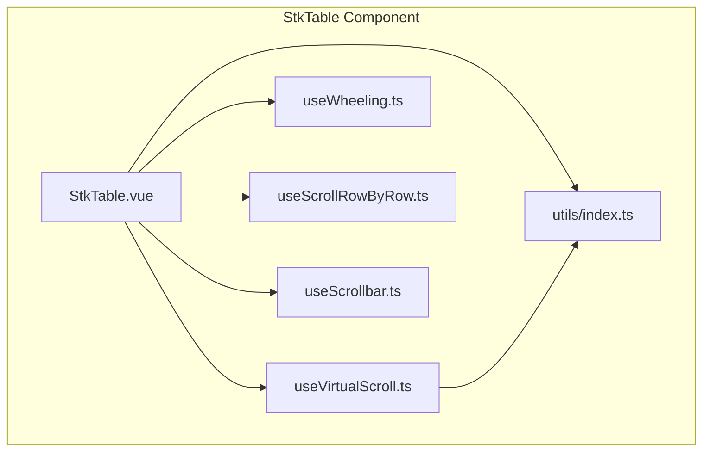
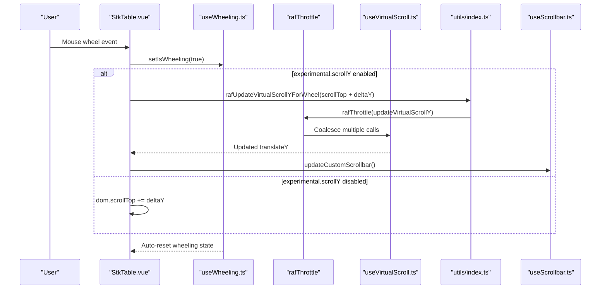
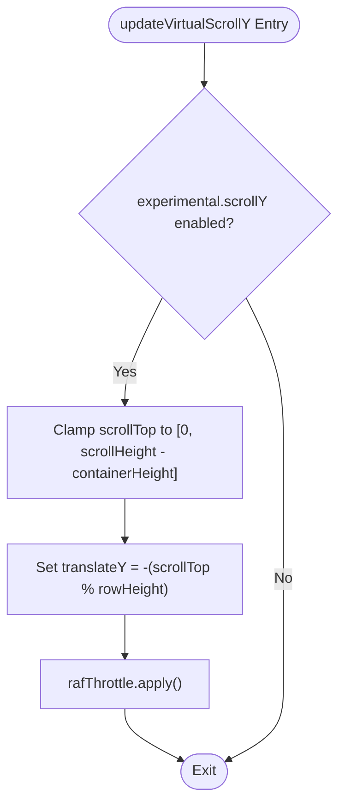
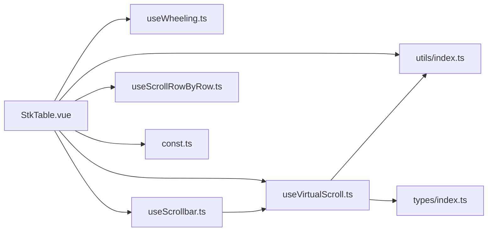

# Experimental Scroll

<cite>
**Referenced Files in This Document**
- [README.md](file://README.md)
- [package.json](file://package.json)
- [src/StkTable/StkTable.vue](file://src/StkTable/StkTable.vue)
- [src/StkTable/useVirtualScroll.ts](file://src/StkTable/useVirtualScroll.ts)
- [src/StkTable/useWheeling.ts](file://src/StkTable/useWheeling.ts)
- [src/StkTable/useScrollRowByRow.ts](file://src/StkTable/useScrollRowByRow.ts)
- [src/StkTable/useScrollbar.ts](file://src/StkTable/useScrollbar.ts)
- [src/StkTable/types/index.ts](file://src/StkTable/types/index.ts)
- [src/StkTable/const.ts](file://src/StkTable/const.ts)
- [src/StkTable/utils/index.ts](file://src/StkTable/utils/index.ts)
- [docs-demo/basic/scroll-row-by-row/ScrollRowByRow.vue](file://docs-demo/basic/scroll-row-by-row/ScrollRowByRow.vue)
- [docs-src/main/table/advanced/virtual.md](file://docs-src/main/table/advanced/virtual.md)
- [docs-src/main/other/experimental.md](file://docs-src/main/other/experimental.md)
- [docs-src/en/main/other/experimental.md](file://docs-src/en/main/other/experimental.md)
</cite>

## Update Summary
**Changes Made**
- Added documentation for new rafThrottle utility function for requestAnimationFrame-based throttling
- Enhanced experimental scroll feature documentation with new scrollY capability
- Updated wheel event handling to reflect requestAnimationFrame-based throttling improvements
- Improved virtual scrolling performance documentation with smooth scrolling enhancements
- Added comprehensive coverage of the new rafUpdateVirtualScrollYForWheel function
- Updated architecture diagrams to reflect the new throttling mechanism

## Table of Contents
1. [Introduction](#introduction)
2. [Project Structure](#project-structure)
3. [Core Components](#core-components)
4. [Architecture Overview](#architecture-overview)
5. [Detailed Component Analysis](#detailed-component-analysis)
6. [Dependency Analysis](#dependency-analysis)
7. [Performance Considerations](#performance-considerations)
8. [Troubleshooting Guide](#troubleshooting-guide)
9. [Conclusion](#conclusion)

## Introduction
This document explains the Enhanced Experimental Scroll feature in the Stk Table Vue project, focusing on the experimental virtual scroll behavior that uses CSS transforms to simulate vertical scrolling with improved performance through requestAnimationFrame-based throttling. The feature now includes a sophisticated rafThrottle utility that provides smooth scrolling performance by coalescing multiple scroll events within a single animation frame, significantly enhancing the transform-based scrolling experience.

## Project Structure
The Enhanced Experimental Scroll feature is implemented within the StkTable component and its supporting hooks. Key areas include:
- The main component that orchestrates events and applies experimental behavior
- Virtual scroll logic for Y and X axes with requestAnimationFrame throttling
- Wheel handling with rafThrottle utility for smooth scrolling performance
- Custom scrollbar integration with experimental mode
- Scroll-by-row functionality for fine-grained control
- New rafUpdateVirtualScrollYForWheel function for throttled scroll updates

**Diagram sources**
- [src/StkTable/StkTable.vue](file://src/StkTable/StkTable.vue#L1-L220)
- [src/StkTable/useVirtualScroll.ts](file://src/StkTable/useVirtualScroll.ts#L1-L120)
- [src/StkTable/useWheeling.ts](file://src/StkTable/useWheeling.ts#L1-L24)
- [src/StkTable/useScrollRowByRow.ts](file://src/StkTable/useScrollRowByRow.ts#L1-L114)
- [src/StkTable/useScrollbar.ts](file://src/StkTable/useScrollbar.ts#L1-L188)
- [src/StkTable/utils/index.ts](file://src/StkTable/utils/index.ts#L294-L314)

**Section sources**
- [README.md](file://README.md#L1-L173)
- [package.json](file://package.json#L1-L76)

## Core Components
- **ExperimentalConfig**: Defines experimental features, including scrollY simulation via transform.
- **useVirtualScroll**: Manages virtual scroll state for Y and X axes, including transform-based translation for experimental scrollY with requestAnimationFrame throttling.
- **useWheeling**: Tracks active wheeling state to prevent parent scroll interference and white screen issues.
- **useScrollbar**: Provides custom scrollbar behavior and integrates with experimental scrollY.
- **StkTable.vue**: Central orchestration of scroll events, applying experimental behavior when enabled with enhanced performance.
- **rafThrottle Utility**: New requestAnimationFrame-based throttling function for smooth scrolling performance.
- **rafUpdateVirtualScrollYForWheel**: Throttled wrapper function for virtual scroll updates using requestAnimationFrame.

**Section sources**
- [src/StkTable/types/index.ts](file://src/StkTable/types/index.ts#L319-L324)
- [src/StkTable/useVirtualScroll.ts](file://src/StkTable/useVirtualScroll.ts#L278-L427)
- [src/StkTable/useWheeling.ts](file://src/StkTable/useWheeling.ts#L1-L24)
- [src/StkTable/useScrollbar.ts](file://src/StkTable/useScrollbar.ts#L120-L144)
- [src/StkTable/StkTable.vue](file://src/StkTable/StkTable.vue#L791-L794)
- [src/StkTable/utils/index.ts](file://src/StkTable/utils/index.ts#L294-L314)

## Architecture Overview
The Enhanced Experimental Scroll feature modifies the traditional scroll-to-translate model by using transform-based positioning for vertical scrolling when enabled. This allows smoother animations and avoids layout thrashing while maintaining virtual scroll performance through requestAnimationFrame-based throttling. The new rafThrottle utility ensures that multiple rapid scroll events are coalesced into a single update per animation frame, providing optimal performance for smooth scrolling experiences.

**Diagram sources**
- [src/StkTable/StkTable.vue](file://src/StkTable/StkTable.vue#L1331-L1383)
- [src/StkTable/useWheeling.ts](file://src/StkTable/useWheeling.ts#L1-L24)
- [src/StkTable/useVirtualScroll.ts](file://src/StkTable/useVirtualScroll.ts#L278-L300)
- [src/StkTable/useScrollbar.ts](file://src/StkTable/useScrollbar.ts#L120-L144)
- [src/StkTable/utils/index.ts](file://src/StkTable/utils/index.ts#L294-L314)

## Detailed Component Analysis

### Enhanced ExperimentalConfig and Feature Flag
- The experimental flag scrollY enables transform-based vertical scrolling simulation.
- When enabled, the virtual scroll engine computes translateY offsets instead of adjusting scrollTop directly.
- **Updated**: Now integrates with rafThrottle utility for improved performance.

**Section sources**
- [src/StkTable/types/index.ts](file://src/StkTable/types/index.ts#L319-L324)
- [src/StkTable/const.ts](file://src/StkTable/const.ts#L23-L30)

### Virtual Scroll Engine (Y-axis) with RequestAnimationFrame Throttling
- updateVirtualScrollY handles scroll position updates differently when experimental.scrollY is enabled.
- It clamps scrollTop to valid bounds and sets translateY to align the viewport with the transformed content.
- **Enhanced**: Now uses requestAnimationFrame-based throttling through rafThrottle utility for smoother scrolling.
- This ensures smooth scrolling without triggering layout recalculations.

**Diagram sources**
- [src/StkTable/useVirtualScroll.ts](file://src/StkTable/useVirtualScroll.ts#L278-L297)
- [src/StkTable/utils/index.ts](file://src/StkTable/utils/index.ts#L294-L314)

**Section sources**
- [src/StkTable/useVirtualScroll.ts](file://src/StkTable/useVirtualScroll.ts#L278-L300)
- [src/StkTable/utils/index.ts](file://src/StkTable/utils/index.ts#L294-L314)

### Wheel Event Handling with Enhanced Performance
- The wheel handler prevents default behavior when actively wheeling near scroll boundaries.
- **Enhanced**: Uses rafUpdateVirtualScrollYForWheel function with requestAnimationFrame-based throttling for smoother scrolling.
- When experimental.scrollY is enabled, it delegates vertical scroll updates to the throttled virtual scroll engine; otherwise, it manipulates scrollTop directly.
- Horizontal wheel events are handled similarly for virtualX scenarios.

**Section sources**
- [src/StkTable/StkTable.vue](file://src/StkTable/StkTable.vue#L1331-L1383)
- [src/StkTable/useWheeling.ts](file://src/StkTable/useWheeling.ts#L1-L24)
- [src/StkTable/utils/index.ts](file://src/StkTable/utils/index.ts#L294-L314)

### New rafUpdateVirtualScrollYForWheel Function
- **New**: A specialized throttled wrapper around updateVirtualScrollY designed specifically for wheel events.
- Uses rafThrottle utility to coalesce rapid scroll events into a single update per animation frame.
- Maintains the same function signature as updateVirtualScrollY while adding performance optimization.
- Ensures smooth scrolling even during rapid wheel events by preventing excessive re-renders.

**Section sources**
- [src/StkTable/StkTable.vue](file://src/StkTable/StkTable.vue#L791-L794)
- [src/StkTable/utils/index.ts](file://src/StkTable/utils/index.ts#L294-L314)

### rafThrottle Utility Function
- **New**: A sophisticated requestAnimationFrame-based throttling mechanism that coalesces multiple function calls within a single animation frame.
- Only executes the last call made during the frame, discarding intermediate calls for optimal performance.
- Provides smooth scrolling performance by batching updates and reducing layout thrashing.
- Can be used as a drop-in replacement for direct function calls in performance-critical scenarios.

**Section sources**
- [src/StkTable/utils/index.ts](file://src/StkTable/utils/index.ts#L288-L314)

### Custom Scrollbar Integration
- The vertical scrollbar drag logic respects experimental.scrollY by computing scrollTop proportional to the thumb position.
- The scrollbar thumb position is recalculated after each virtual scroll update to reflect the transform-based translation.
- **Enhanced**: Integration works seamlessly with requestAnimationFrame-based throttling for smooth scrollbar updates.

**Section sources**
- [src/StkTable/useScrollbar.ts](file://src/StkTable/useScrollbar.ts#L120-L144)
- [src/StkTable/useVirtualScroll.ts](file://src/StkTable/useVirtualScroll.ts#L289-L297)

### Scroll-by-Row Mode Interaction
- Scroll-by-row functionality toggles row-by-row scrolling behavior based on drag state.
- When experimental.scrollY is enabled, the virtual scroll engine still applies transform-based translation, but the UI feedback and drag detection remain unchanged.
- **Enhanced**: Works with improved throttling for smoother row-by-row transitions.

**Section sources**
- [src/StkTable/useScrollRowByRow.ts](file://src/StkTable/useScrollRowByRow.ts#L1-L114)
- [docs-demo/basic/scroll-row-by-row/ScrollRowByRow.vue](file://docs-demo/basic/scroll-row-by-row/ScrollRowByRow.vue#L1-L51)

### Virtual List Basics
- Virtual scrolling improves performance for large datasets by rendering only visible items.
- The virtual list supports both Y and X axes, with autoResize handling responsive sizing.
- **Enhanced**: Now includes requestAnimationFrame-based throttling for improved performance.

**Section sources**
- [docs-src/main/table/advanced/virtual.md](file://docs-src/main/table/advanced/virtual.md#L1-L70)

## Dependency Analysis
The Enhanced Experimental Scroll feature integrates tightly with the virtual scroll engine, custom scrollbar, and new rafThrottle utility. The following diagram shows key dependencies:

**Diagram sources**
- [src/StkTable/StkTable.vue](file://src/StkTable/StkTable.vue#L222-L282)
- [src/StkTable/useVirtualScroll.ts](file://src/StkTable/useVirtualScroll.ts#L1-L73)
- [src/StkTable/useWheeling.ts](file://src/StkTable/useWheeling.ts#L1-L24)
- [src/StkTable/useScrollbar.ts](file://src/StkTable/useScrollbar.ts#L1-L32)
- [src/StkTable/useScrollRowByRow.ts](file://src/StkTable/useScrollRowByRow.ts#L1-L8)
- [src/StkTable/types/index.ts](file://src/StkTable/types/index.ts#L319-L324)
- [src/StkTable/const.ts](file://src/StkTable/const.ts#L1-L51)
- [src/StkTable/utils/index.ts](file://src/StkTable/utils/index.ts#L294-L314)

**Section sources**
- [src/StkTable/StkTable.vue](file://src/StkTable/StkTable.vue#L222-L282)
- [src/StkTable/useVirtualScroll.ts](file://src/StkTable/useVirtualScroll.ts#L1-L73)
- [src/StkTable/useScrollbar.ts](file://src/StkTable/useScrollbar.ts#L1-L32)

## Performance Considerations
- Transform-based scrolling reduces layout thrashing by avoiding direct scrollTop changes.
- **Enhanced**: requestAnimationFrame-based throttling through rafThrottle utility provides smoother scrolling performance by coalescing multiple calls within a single frame.
- The wheeling state prevents unnecessary propagation and maintains responsiveness during fast scrolling.
- Custom scrollbar updates are throttled to balance accuracy and performance.
- **New**: rafThrottle utility ensures only the last call is executed per animation frame, improving overall performance.
- **New**: rafUpdateVirtualScrollYForWheel function provides specialized throttling for wheel events, optimizing scroll performance during rapid user interactions.

## Troubleshooting Guide
- White screen during fast scrolling: Ensure smoothScroll is configured appropriately; the wheel handler prevents default behavior near boundaries.
- Scrollbar misalignment: Verify that experimental.scrollY is consistently enabled/disabled across initialization and updates.
- Scroll-by-row conflicts: Confirm that drag-based activation is not inadvertently toggled when using experimental scrollY.
- **New**: Performance issues with smooth scrolling: Check that rafThrottle is properly applied and not being called excessively.
- **New**: RequestAnimationFrame throttling not working: Verify that rafUpdateVirtualScrollYForWheel function is being used instead of direct updateVirtualScrollY calls.
- **New**: Excessive memory usage with throttled functions: Monitor that throttled functions are properly cleaned up when components unmount.
- **New**: Inconsistent scroll behavior: Ensure that experimental.scrollY is enabled consistently across all scroll-related operations.

**Section sources**
- [src/StkTable/StkTable.vue](file://src/StkTable/StkTable.vue#L1331-L1383)
- [src/StkTable/useScrollbar.ts](file://src/StkTable/useScrollbar.ts#L120-L144)
- [src/StkTable/useScrollRowByRow.ts](file://src/StkTable/useScrollRowByRow.ts#L48-L54)
- [src/StkTable/utils/index.ts](file://src/StkTable/utils/index.ts#L294-L314)

## Conclusion
The Enhanced Experimental Scroll feature significantly improves the virtual scrolling experience by leveraging transform-based vertical scrolling with requestAnimationFrame-based throttling when enabled. The new rafThrottle utility function provides smooth scrolling performance by coalescing multiple scroll events within a single animation frame, while the specialized rafUpdateVirtualScrollYForWheel function optimizes wheel event handling for rapid user interactions. This enhancement integrates seamlessly with the existing virtual scroll engine, wheel handling, and custom scrollbar systems to deliver a much smoother, more predictable scrolling behavior for large datasets while maintaining optimal performance characteristics. The addition of sophisticated throttling mechanisms ensures that the experimental feature provides both excellent user experience and efficient resource utilization.