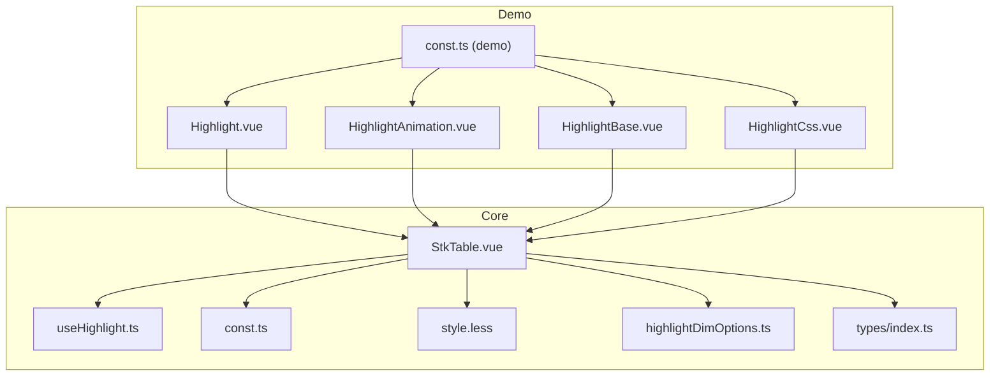
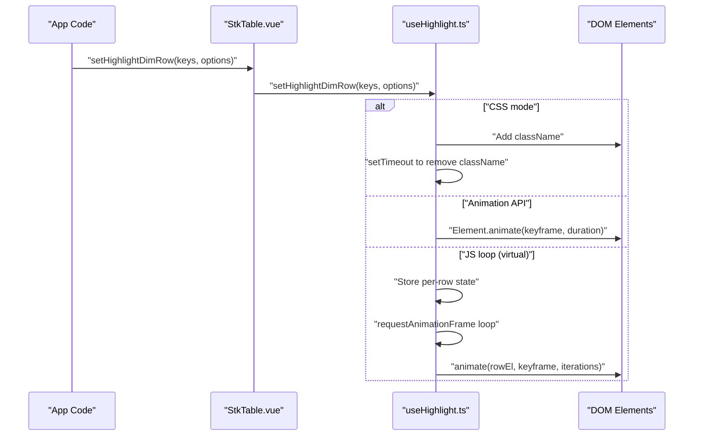
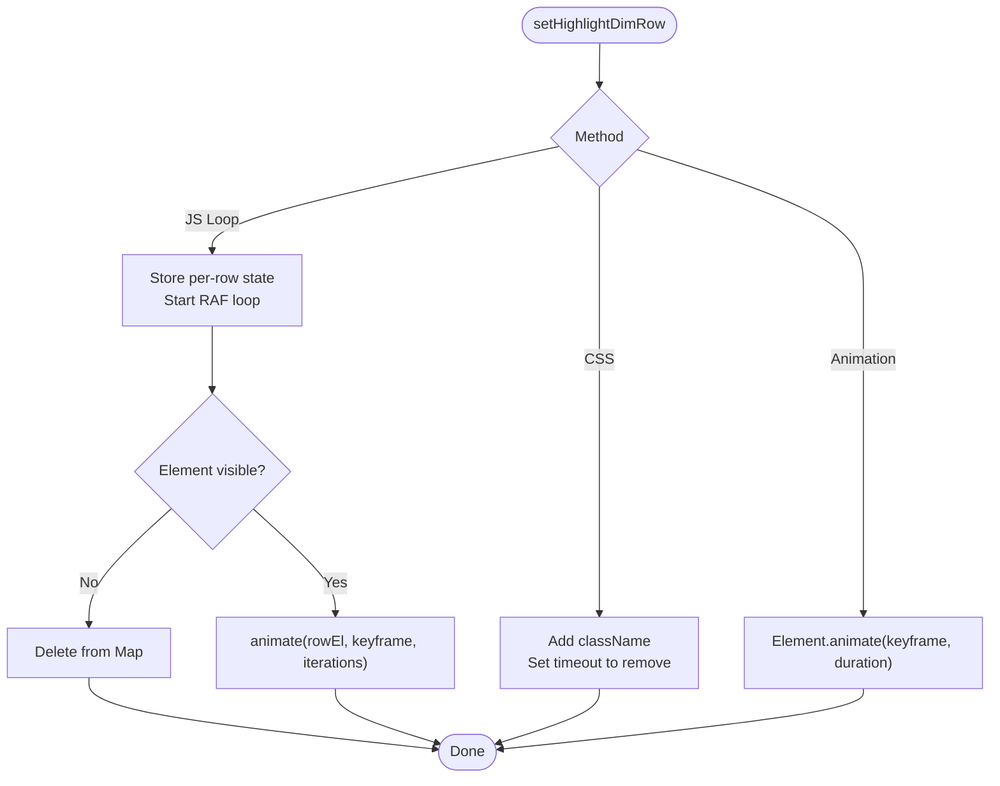
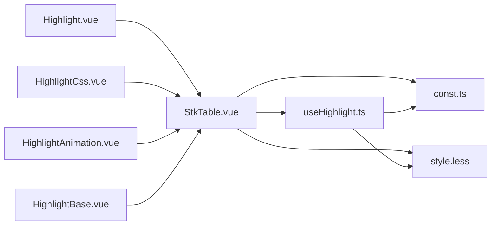

# Highlighting System

<cite>
**Referenced Files in This Document**
- [useHighlight.ts](file://src/StkTable/useHighlight.ts)
- [StkTable.vue](file://src/StkTable/StkTable.vue)
- [const.ts](file://src/StkTable/const.ts)
- [style.less](file://src/StkTable/style.less)
- [highlightDimOptions.ts](file://src/StkTable/types/highlightDimOptions.ts)
- [index.ts](file://src/StkTable/types/index.ts)
- [Highlight.vue](file://docs-demo/advanced/highlight/Highlight.vue)
- [HighlightAnimation.vue](file://docs-demo/advanced/highlight/HighlightAnimation.vue)
- [HighlightBase.vue](file://docs-demo/advanced/highlight/HighlightBase.vue)
- [HighlightCss.vue](file://docs-demo/advanced/highlight/HighlightCss.vue)
- [const.ts](file://docs-demo/advanced/highlight/const.ts)
</cite>

## Table of Contents
1. [Introduction](#introduction)
2. [Project Structure](#project-structure)
3. [Core Components](#core-components)
4. [Architecture Overview](#architecture-overview)
5. [Detailed Component Analysis](#detailed-component-analysis)
6. [Dependency Analysis](#dependency-analysis)
7. [Performance Considerations](#performance-considerations)
8. [Troubleshooting Guide](#troubleshooting-guide)
9. [Conclusion](#conclusion)
10. [Appendices](#appendices)

## Introduction
This document explains the highlighting system in Stk Table Vue, covering row highlighting, cell highlighting, and animated highlighting effects. It documents configuration options, animation parameters, and integration with selection systems. It also provides examples for implementing highlight triggers, managing highlight state across table operations, creating custom highlight effects, and offers performance and memory management guidance for smooth user experiences during highlight animations.

## Project Structure
The highlighting system spans several modules:
- Core logic: useHighlight.ts encapsulates highlight state, animation scheduling, and DOM updates.
- Public API exposure: StkTable.vue exposes setHighlightDimRow and setHighlightDimCell via defineExpose.
- Constants and styles: const.ts defines default colors and classes; style.less defines CSS animations and variables.
- Types: highlightDimOptions.ts and index.ts define configuration shapes and types.
- Demo pages: docs-demo/advanced/highlight demonstrate practical usage patterns.

**Diagram sources**
- [useHighlight.ts](file://src/StkTable/useHighlight.ts#L1-L258)
- [StkTable.vue](file://src/StkTable/StkTable.vue#L814-L814)
- [const.ts](file://src/StkTable/const.ts#L1-L51)
- [style.less](file://src/StkTable/style.less#L1-L690)
- [highlightDimOptions.ts](file://src/StkTable/types/highlightDimOptions.ts#L1-L27)
- [index.ts](file://src/StkTable/types/index.ts#L228-L233)
- [Highlight.vue](file://docs-demo/advanced/highlight/Highlight.vue#L1-L76)
- [HighlightAnimation.vue](file://docs-demo/advanced/highlight/HighlightAnimation.vue#L1-L70)
- [HighlightBase.vue](file://docs-demo/advanced/highlight/HighlightBase.vue#L1-L122)
- [HighlightCss.vue](file://docs-demo/advanced/highlight/HighlightCss.vue#L1-L75)
- [const.ts](file://docs-demo/advanced/highlight/const.ts#L1-L13)

**Section sources**
- [useHighlight.ts](file://src/StkTable/useHighlight.ts#L1-L258)
- [StkTable.vue](file://src/StkTable/StkTable.vue#L814-L814)
- [const.ts](file://src/StkTable/const.ts#L1-L51)
- [style.less](file://src/StkTable/style.less#L1-L690)
- [highlightDimOptions.ts](file://src/StkTable/types/highlightDimOptions.ts#L1-L27)
- [index.ts](file://src/StkTable/types/index.ts#L228-L233)
- [Highlight.vue](file://docs-demo/advanced/highlight/Highlight.vue#L1-L76)
- [HighlightAnimation.vue](file://docs-demo/advanced/highlight/HighlightAnimation.vue#L1-L70)
- [HighlightBase.vue](file://docs-demo/advanced/highlight/HighlightBase.vue#L1-L122)
- [HighlightCss.vue](file://docs-demo/advanced/highlight/HighlightCss.vue#L1-L75)
- [const.ts](file://docs-demo/advanced/highlight/const.ts#L1-L13)

## Core Components
- Highlight configuration
  - duration: Duration in seconds for highlight animations.
  - fps: Optional frame rate to derive step timing for stepped easing.
- Highlight methods
  - setHighlightDimRow(keys, options?): Highlights one or more rows.
  - setHighlightDimCell(rowKey, colKey, options?): Highlights a specific cell.
- Options
  - method: 'animation' | 'css'
  - keyframe: Web Animations API keyframe descriptor; overrides default highlight keyframe when provided.
  - className: CSS class name for CSS animation mode.
  - duration: Overrides default highlight duration in CSS mode.

These are exposed via StkTable.vue’s defineExpose and implemented in useHighlight.ts.

**Section sources**
- [index.ts](file://src/StkTable/types/index.ts#L228-L233)
- [highlightDimOptions.ts](file://src/StkTable/types/highlightDimOptions.ts#L1-L27)
- [StkTable.vue](file://src/StkTable/StkTable.vue#L1689-L1697)
- [useHighlight.ts](file://src/StkTable/useHighlight.ts#L109-L166)

## Architecture Overview
The highlighting pipeline integrates configuration, animation computation, and DOM updates across three modes:
- CSS keyframes: Adds/removes CSS classes with timeouts to remove classes after animation completes.
- Web Animations API: Uses Element.animate with computed keyframes and timing derived from highlightConfig.
- JS-driven loop: For virtual tables, schedules per-frame updates using requestAnimationFrame and stores per-row state.

**Diagram sources**
- [StkTable.vue](file://src/StkTable/StkTable.vue#L1689-L1697)
- [useHighlight.ts](file://src/StkTable/useHighlight.ts#L133-L166)
- [useHighlight.ts](file://src/StkTable/useHighlight.ts#L172-L199)
- [useHighlight.ts](file://src/StkTable/useHighlight.ts#L109-L123)
- [useHighlight.ts](file://src/StkTable/useHighlight.ts#L227-L250)

## Detailed Component Analysis

### useHighlight.ts
Responsibilities:
- Compute highlight defaults from props.highlightConfig (duration, fps).
- Derive keyframes and easing for JS stepping when fps is set.
- Manage per-row animation state for virtual tables.
- Provide setHighlightDimRow and setHighlightDimCell APIs.

Key behaviors:
- Row highlighting
  - CSS mode: toggles className on matching rows and clears after duration.
  - Animation API: calls Element.animate on each row element.
  - Virtual mode: stores per-row state and animates via JS loop.
- Cell highlighting
  - CSS mode: toggles className on the matched cell and clears after duration.
  - Animation API: calls Element.animate on the matched cell element.
- Timing and easing
  - If fps is provided, easing is set to steps(#frames) and duration is split accordingly.
  - Otherwise, uses continuous easing.

Memory and cleanup:
- Stores per-row state in a Map keyed by row key.
- Clears state and timers when animations finish or elements become invisible.

**Diagram sources**
- [useHighlight.ts](file://src/StkTable/useHighlight.ts#L133-L166)
- [useHighlight.ts](file://src/StkTable/useHighlight.ts#L172-L199)
- [useHighlight.ts](file://src/StkTable/useHighlight.ts#L227-L250)

**Section sources**
- [useHighlight.ts](file://src/StkTable/useHighlight.ts#L27-L98)
- [useHighlight.ts](file://src/StkTable/useHighlight.ts#L109-L166)
- [useHighlight.ts](file://src/StkTable/useHighlight.ts#L172-L219)
- [useHighlight.ts](file://src/StkTable/useHighlight.ts#L227-L250)

### StkTable.vue Integration
- Exposes setHighlightDimRow and setHighlightDimCell via defineExpose.
- Reads highlightConfig and passes it to useHighlight.
- Provides CSS variables for highlight duration and timing function.
- Uses rowKeyGen to map row keys to DOM ids for non-virtual mode.

Highlights:
- CSS variables bind to --highlight-duration and --highlight-timing-function.
- Rows and cells are identified by data attributes and ids.

**Section sources**
- [StkTable.vue](file://src/StkTable/StkTable.vue#L34-L38)
- [StkTable.vue](file://src/StkTable/StkTable.vue#L814-L814)
- [StkTable.vue](file://src/StkTable/StkTable.vue#L1689-L1697)
- [StkTable.vue](file://src/StkTable/StkTable.vue#L1062-L1083)

### Constants and Styles
- Defaults
  - HIGHLIGHT_COLOR: light/dark theme base colors for highlight.
  - HIGHLIGHT_DURATION: default duration in milliseconds.
  - HIGHLIGHT_ROW_CLASS and HIGHLIGHT_CELL_CLASS: default CSS class names.
- CSS
  - Variables: --highlight-duration and --highlight-timing-function.
  - Animations: keyframes for .highlight-row and .highlight-cell.
  - Steps timing is supported by splitting the variable for compatibility.

**Section sources**
- [const.ts](file://src/StkTable/const.ts#L10-L21)
- [style.less](file://src/StkTable/style.less#L2-L6)
- [style.less](file://src/StkTable/style.less#L27-L29)
- [style.less](file://src/StkTable/style.less#L462-L467)
- [style.less](file://src/StkTable/style.less#L591-L596)

### Types and Options
- HighlightConfig: duration and fps.
- HighlightDimRowOption and HighlightDimCellOption: union of base options plus method-specific overrides.
- Method options:
  - 'animation': uses Element.animate with optional custom keyframe.
  - 'css': toggles a CSS class with optional custom className and duration.

**Section sources**
- [index.ts](file://src/StkTable/types/index.ts#L228-L233)
- [highlightDimOptions.ts](file://src/StkTable/types/highlightDimOptions.ts#L1-L27)

### Demo Pages and Examples
- Basic animated highlights
  - Demonstrates periodic row and cell highlights with default animation mode.
- CSS-based highlights
  - Demonstrates CSS animation mode with custom classes and durations.
- Animation API with custom keyframes
  - Demonstrates custom keyframes and easing for row and cell highlights.
- Dynamic data and highlight triggers
  - Demonstrates adding data and triggering highlights immediately after updates.

Implementation patterns shown:
- Using ref to call setHighlightDimRow and setHighlightDimCell.
- Passing method: 'css' with className and duration for CSS mode.
- Passing method: 'animation' with custom keyframe and easing for Animation API mode.
- Managing intervals and cleanup on unmount.

**Section sources**
- [Highlight.vue](file://docs-demo/advanced/highlight/Highlight.vue#L1-L76)
- [HighlightCss.vue](file://docs-demo/advanced/highlight/HighlightCss.vue#L1-L75)
- [HighlightAnimation.vue](file://docs-demo/advanced/highlight/HighlightAnimation.vue#L1-L70)
- [HighlightBase.vue](file://docs-demo/advanced/highlight/HighlightBase.vue#L1-L122)
- [const.ts](file://docs-demo/advanced/highlight/const.ts#L1-L13)

## Dependency Analysis
- useHighlight depends on:
  - props.highlightConfig for duration/fps.
  - HIGHLIGHT_* constants for defaults.
  - tableContainerRef for CSS mode queries.
- StkTable.vue depends on:
  - useHighlight for highlight APIs.
  - const.ts for default colors and classes.
  - style.less for CSS animations and variables.
- Demos depend on:
  - StkTable.vue via ref to call highlight APIs.
  - Shared columns/data for rendering.

**Diagram sources**
- [StkTable.vue](file://src/StkTable/StkTable.vue#L814-L814)
- [useHighlight.ts](file://src/StkTable/useHighlight.ts#L28-L40)
- [const.ts](file://src/StkTable/const.ts#L10-L21)
- [style.less](file://src/StkTable/style.less#L462-L467)
- [Highlight.vue](file://docs-demo/advanced/highlight/Highlight.vue#L67-L74)
- [HighlightCss.vue](file://docs-demo/advanced/highlight/HighlightCss.vue#L42-L47)
- [HighlightAnimation.vue](file://docs-demo/advanced/highlight/HighlightAnimation.vue#L62-L68)
- [HighlightBase.vue](file://docs-demo/advanced/highlight/HighlightBase.vue#L88-L93)

**Section sources**
- [StkTable.vue](file://src/StkTable/StkTable.vue#L814-L814)
- [useHighlight.ts](file://src/StkTable/useHighlight.ts#L27-L40)
- [const.ts](file://src/StkTable/const.ts#L10-L21)
- [style.less](file://src/StkTable/style.less#L462-L467)
- [Highlight.vue](file://docs-demo/advanced/highlight/Highlight.vue#L67-L74)
- [HighlightCss.vue](file://docs-demo/advanced/highlight/HighlightCss.vue#L42-L47)
- [HighlightAnimation.vue](file://docs-demo/advanced/highlight/HighlightAnimation.vue#L62-L68)
- [HighlightBase.vue](file://docs-demo/advanced/highlight/HighlightBase.vue#L88-L93)

## Performance Considerations
- Prefer CSS animation mode for simple highlights:
  - Lower overhead than JS-driven frames.
  - Browser optimizes CSS animations efficiently.
- Use fps for stepped animations:
  - Converts easing to steps(#frames) for crisp, frame-aligned transitions.
  - Reduces per-frame JavaScript work.
- Limit concurrent highlights:
  - Batch highlight requests or throttle triggers to avoid overlapping animations.
- Virtual tables:
  - JS loop mode computes per-frame updates; keep fps reasonable to avoid excessive RAF cycles.
  - Ensure row visibility checks short-circuit unnecessary work.
- Memory management:
  - CSS mode cleans up className via timeouts; ensure duration matches custom animation duration.
  - JS loop mode clears per-row state when animations finish or elements go invisible.

[No sources needed since this section provides general guidance]

## Troubleshooting Guide
Common issues and resolutions:
- Highlight not visible
  - Verify rowKey and colKey match data and columns; ensure rowKeyGen produces stable keys.
  - Confirm CSS class names exist and durations match custom animations.
- Incorrect duration or easing
  - For CSS mode, ensure duration passed to setHighlightDimRow/Cell matches the CSS animation duration.
  - For Animation API mode, pass a custom keyframe with desired easing and duration.
- Highlights overlap or lag
  - Reduce fps or avoid simultaneous highlights on many rows/cells.
  - In CSS mode, ensure className removal timeouts are not prematurely cleared.
- Virtual table highlights inconsistent
  - Ensure elements are rendered before calling highlight; use nextTick after data updates.
  - Verify row ids match the pattern used by getTRProps.

**Section sources**
- [useHighlight.ts](file://src/StkTable/useHighlight.ts#L172-L199)
- [useHighlight.ts](file://src/StkTable/useHighlight.ts#L205-L219)
- [StkTable.vue](file://src/StkTable/StkTable.vue#L1062-L1083)
- [StkTable.vue](file://src/StkTable/StkTable.vue#L896-L907)

## Conclusion
Stk Table Vue provides a flexible, configurable highlighting system supporting both CSS and Web Animations API modes, with a JS-driven loop for virtual tables. By tuning duration and fps, supplying custom keyframes, and integrating with selection and data operations, you can deliver smooth, responsive highlight effects. Follow the performance and troubleshooting guidance to maintain a high-quality user experience.

[No sources needed since this section summarizes without analyzing specific files]

## Appendices

### Configuration Options Reference
- HighlightConfig
  - duration: number (seconds)
  - fps: number (optional)
- HighlightDimRowOption / HighlightDimCellOption
  - duration: number (overrides default)
  - method: 'animation' | 'css'
  - keyframe: Web Animations API keyframe descriptor (when method is 'animation')
  - className: CSS class name (when method is 'css')

**Section sources**
- [index.ts](file://src/StkTable/types/index.ts#L228-L233)
- [highlightDimOptions.ts](file://src/StkTable/types/highlightDimOptions.ts#L1-L27)

### API Surface
- setHighlightDimRow(keys, options?)
- setHighlightDimCell(rowKey, colKey, options?)

Exposed by StkTable.vue.

**Section sources**
- [StkTable.vue](file://src/StkTable/StkTable.vue#L1689-L1697)