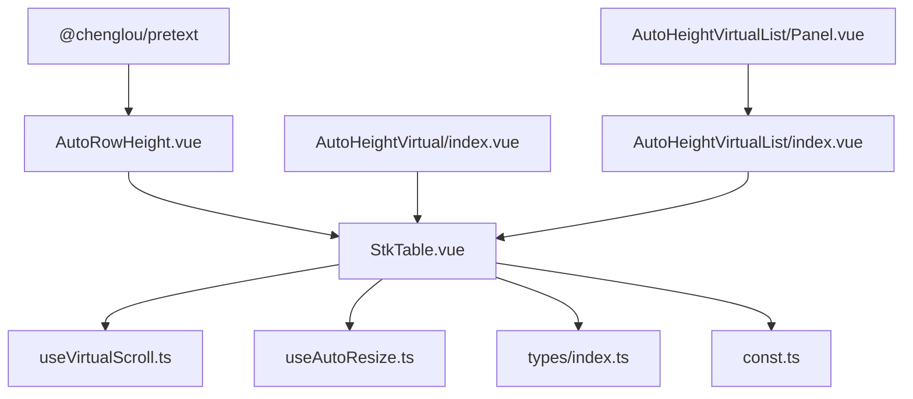
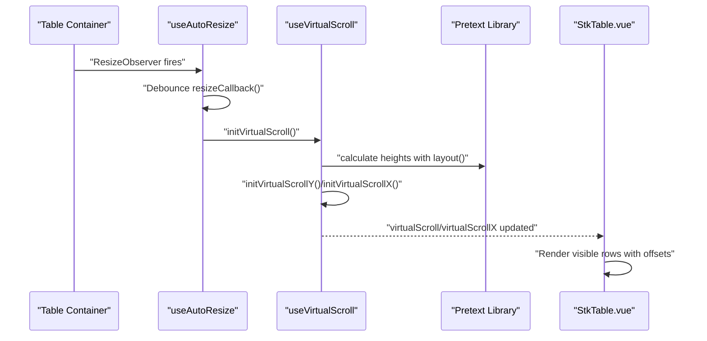
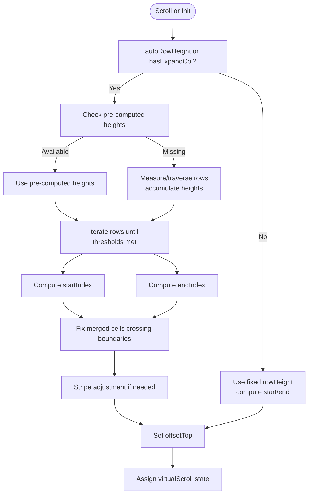
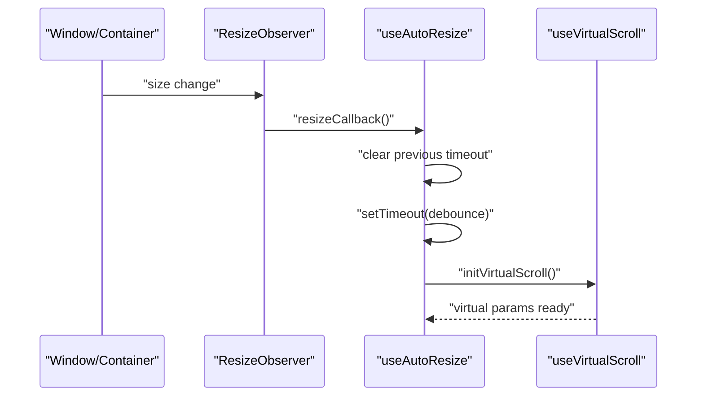
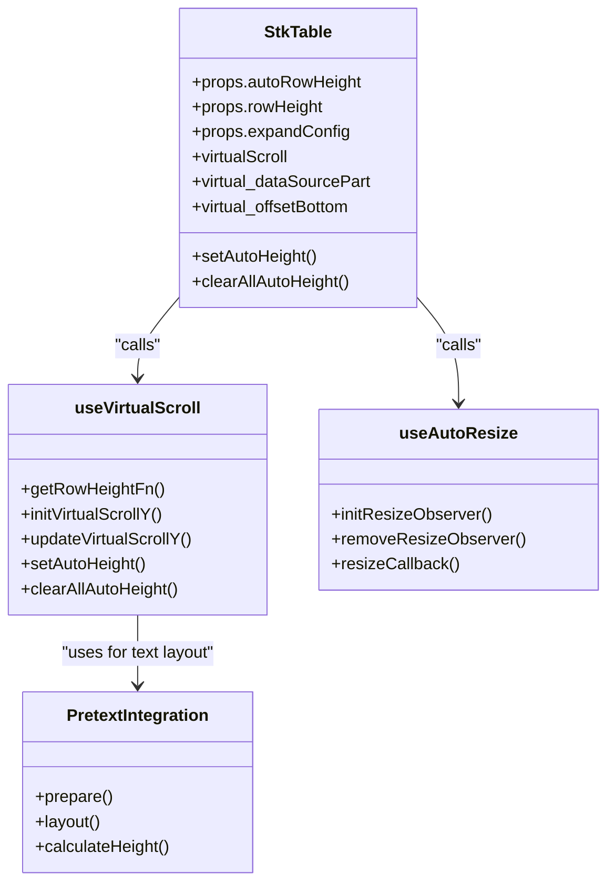
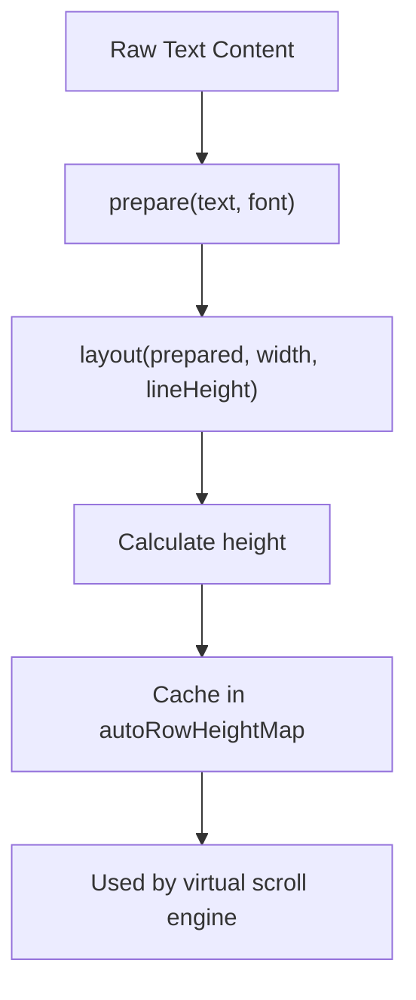
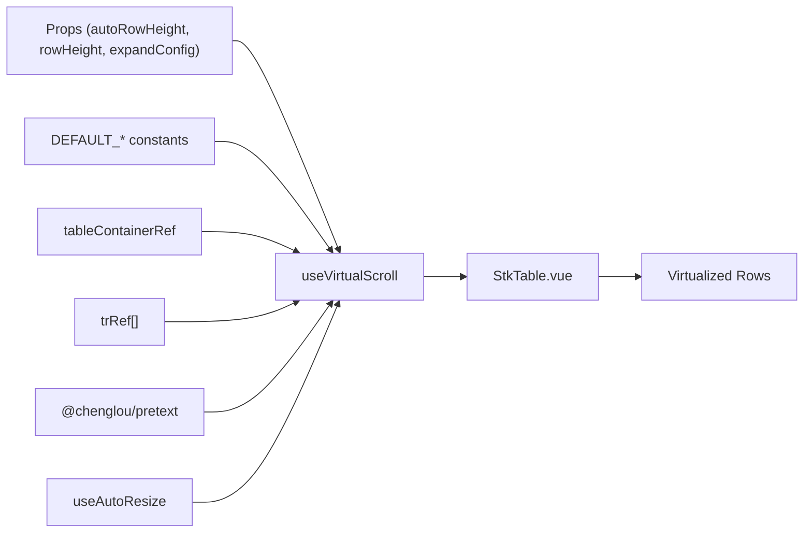

# Auto-Height Virtual Scrolling

<cite>
**Referenced Files in This Document**
- [useVirtualScroll.ts](file://src/StkTable/useVirtualScroll.ts)
- [useAutoResize.ts](file://src/StkTable/useAutoResize.ts)
- [StkTable.vue](file://src/StkTable/StkTable.vue)
- [types/index.ts](file://src/StkTable/types/index.ts)
- [const.ts](file://src/StkTable/const.ts)
- [auto-height-virtual.md](file://docs-src/main/table/advanced/auto-height-virtual.md)
- [AutoHeightVirtual/index.vue](file://docs-demo/advanced/auto-height-virtual/AutoHeightVirtual/index.vue)
- [AutoHeightVirtual/types.ts](file://docs-demo/advanced/auto-height-virtual/AutoHeightVirtual/types.ts)
- [AutoHeightVirtualList/index.vue](file://docs-demo/demos/VirtualList/AutoHeightVirtualList/index.vue)
- [AutoHeightVirtualList/Panel.vue](file://docs-demo/demos/VirtualList/AutoHeightVirtualList/Panel.vue)
- [AutoHeightVirtualList/types.ts](file://docs-demo/demos/VirtualList/AutoHeightVirtualList/types.ts)
- [AutoRowHeight.vue](file://test/AutoRowHeight.vue)
- [package.json](file://package.json)
</cite>

## Update Summary
**Changes Made**
- Added Pretext library integration for advanced text rendering and pre-computed measurements
- Enhanced auto-row height functionality with improved performance through pre-calculated row heights
- Updated testing infrastructure with Pretext-based test examples
- Improved documentation coverage for advanced text rendering techniques and conditional rendering improvements

## Table of Contents
1. [Introduction](#introduction)
2. [Project Structure](#project-structure)
3. [Core Components](#core-components)
4. [Architecture Overview](#architecture-overview)
5. [Detailed Component Analysis](#detailed-component-analysis)
6. [Advanced Text Rendering with Pretext](#advanced-text-rendering-with-pretext)
7. [Dependency Analysis](#dependency-analysis)
8. [Performance Considerations](#performance-considerations)
9. [Troubleshooting Guide](#troubleshooting-guide)
10. [Conclusion](#conclusion)
11. [Appendices](#appendices)

## Introduction
This document explains auto-height virtual scrolling in Stk Table Vue with enhanced functionality including Pretext library integration for advanced text rendering. It focuses on how dynamic row heights are measured and cached, how the viewport is managed with variable-height items, and how performance is optimized for large datasets with rich content. The enhanced version now supports pre-computed measurements through the Pretext library, improving text layout calculations for complex content scenarios.

## Project Structure
The auto-height virtual scrolling feature spans several modules with enhanced Pretext integration:
- Virtual scrolling engine: calculates visible range and offsets for variable-height rows with pre-computed measurements
- Auto-resize observer: detects container and column width changes to reinitialize virtualization
- Table component: orchestrates props, refs, and rendering of virtualized rows and columns
- Pretext integration: enables advanced text rendering and pre-computed height calculations
- Types and constants: define configuration shapes and defaults

**Diagram sources**
- [StkTable.vue:775-792](file://src/StkTable/StkTable.vue#L775-L792)
- [useVirtualScroll.ts:60-69](file://src/StkTable/useVirtualScroll.ts#L60-L69)
- [useAutoResize.ts:14-40](file://src/StkTable/useAutoResize.ts#L14-L40)
- [types/index.ts:275-278](file://src/StkTable/types/index.ts#L275-L278)
- [const.ts:6-8](file://src/StkTable/const.ts#L6-L8)
- [AutoRowHeight.vue:2-4](file://test/AutoRowHeight.vue#L2-L4)
- [AutoHeightVirtual/index.vue:24-34](file://docs-demo/advanced/auto-height-virtual/AutoHeightVirtual/index.vue#L24-L34)
- [AutoHeightVirtualList/index.vue:21-36](file://docs-demo/demos/VirtualList/AutoHeightVirtualList/index.vue#L21-L36)
- [AutoHeightVirtualList/Panel.vue:1-42](file://docs-demo/demos/VirtualList/AutoHeightVirtualList/Panel.vue#L1-L42)

**Section sources**
- [StkTable.vue:775-792](file://src/StkTable/StkTable.vue#L775-L792)
- [useVirtualScroll.ts:60-69](file://src/StkTable/useVirtualScroll.ts#L60-L69)
- [useAutoResize.ts:14-40](file://src/StkTable/useAutoResize.ts#L14-L40)
- [types/index.ts:275-278](file://src/StkTable/types/index.ts#L275-L278)
- [const.ts:6-8](file://src/StkTable/const.ts#L6-L8)
- [AutoRowHeight.vue:2-4](file://test/AutoRowHeight.vue#L2-L4)
- [AutoHeightVirtual/index.vue:24-34](file://docs-demo/advanced/auto-height-virtual/AutoHeightVirtual/index.vue#L24-L34)
- [AutoHeightVirtualList/index.vue:21-36](file://docs-demo/demos/VirtualList/AutoHeightVirtualList/index.vue#L21-L36)
- [AutoHeightVirtualList/Panel.vue:1-42](file://docs-demo/demos/VirtualList/AutoHeightVirtualList/Panel.vue#L1-L42)

## Core Components
- Virtual scrolling engine: computes visible rows and offsets for variable-height items, supports expandable rows and merged cells, and optimizes scroll updates for Vue 2 compatibility with pre-computed measurement support.
- Auto-resize observer: watches container size changes and recomputes virtualization parameters with debouncing.
- Table component: exposes props for enabling auto row height, expected height, and integrates with virtualization and resizing hooks.
- Pretext integration: provides advanced text rendering capabilities for accurate height calculations before rendering.

Key responsibilities:
- Dynamic row height measurement and caching via dataset keys with pre-computed support
- Accurate viewport calculation for variable-height items using Pretext for complex text layouts
- Debounced resize handling to avoid excessive recalculations
- Compatibility with expandable rows and merged cells
- Advanced text rendering for rich content scenarios

**Section sources**
- [useVirtualScroll.ts:177-189](file://src/StkTable/useVirtualScroll.ts#L177-L189)
- [useVirtualScroll.ts:240-270](file://src/StkTable/useVirtualScroll.ts#L240-L270)
- [useVirtualScroll.ts:273-406](file://src/StkTable/useVirtualScroll.ts#L273-L406)
- [useAutoResize.ts:76-90](file://src/StkTable/useAutoResize.ts#L76-L90)
- [StkTable.vue:282-480](file://src/StkTable/StkTable.vue#L282-L480)

## Architecture Overview
The auto-height virtual scrolling pipeline combines DOM observation, virtualization computation, Pretext-based text rendering, and reactive rendering.

**Diagram sources**
- [useAutoResize.ts:42-63](file://src/StkTable/useAutoResize.ts#L42-L63)
- [useAutoResize.ts:76-90](file://src/StkTable/useAutoResize.ts#L76-L90)
- [useVirtualScroll.ts:195-235](file://src/StkTable/useVirtualScroll.ts#L195-L235)
- [AutoRowHeight.vue:28-41](file://test/AutoRowHeight.vue#L28-L41)
- [StkTable.vue:104-179](file://src/StkTable/StkTable.vue#L104-L179)

## Detailed Component Analysis

### Virtual Scrolling Engine
The engine manages:
- Visible range computation for variable-height rows with pre-computed measurement support
- Offset calculations for top and bottom padding
- Debounced scroll updates for Vue 2 compatibility
- Integration with expandable rows and merged cells
- Pretext-based text rendering for accurate height calculations

**Diagram sources**
- [useVirtualScroll.ts:273-406](file://src/StkTable/useVirtualScroll.ts#L273-L406)
- [useVirtualScroll.ts:326-359](file://src/StkTable/useVirtualScroll.ts#L326-L359)

Key behaviors:
- Uses a Map keyed by row keys to cache measured heights with pre-computed height support
- Falls back to expected height when measurement is missing
- Integrates Pretext library for advanced text layout calculations
- Adjusts viewport for merged cells and expandable rows
- Optimizes scroll updates for Vue 2 by deferring state updates

**Section sources**
- [useVirtualScroll.ts:240-270](file://src/StkTable/useVirtualScroll.ts#L240-L270)
- [useVirtualScroll.ts:273-406](file://src/StkTable/useVirtualScroll.ts#L273-L406)
- [useVirtualScroll.ts:326-359](file://src/StkTable/useVirtualScroll.ts#L326-L359)

### Auto-Resize Observer
The observer:
- Watches container size changes and window resize events
- Debounces callbacks to reduce expensive recomputation
- Reinitializes virtualization when container or columns change

**Diagram sources**
- [useAutoResize.ts:42-63](file://src/StkTable/useAutoResize.ts#L42-L63)
- [useAutoResize.ts:76-90](file://src/StkTable/useAutoResize.ts#L76-L90)
- [useVirtualScroll.ts:195-235](file://src/StkTable/useVirtualScroll.ts#L195-L235)

**Section sources**
- [useAutoResize.ts:14-91](file://src/StkTable/useAutoResize.ts#L14-L91)
- [useVirtualScroll.ts:195-235](file://src/StkTable/useVirtualScroll.ts#L195-L235)

### Table Integration and Rendering
The table component:
- Exposes props for enabling auto row height and expected height
- Computes CSS variables for row heights and header heights
- Renders virtualized rows with top/bottom spacer heights
- Integrates with expandable rows and merged cells
- Supports pre-computed height injection via setAutoHeight method

**Diagram sources**
- [StkTable.vue:282-480](file://src/StkTable/StkTable.vue#L282-L480)
- [StkTable.vue:775-792](file://src/StkTable/StkTable.vue#L775-L792)
- [useVirtualScroll.ts:177-189](file://src/StkTable/useVirtualScroll.ts#L177-L189)
- [useVirtualScroll.ts:240-270](file://src/StkTable/useVirtualScroll.ts#L240-L270)
- [useAutoResize.ts:14-40](file://src/StkTable/useAutoResize.ts#L14-L40)
- [AutoRowHeight.vue:28-41](file://test/AutoRowHeight.vue#L28-L41)

**Section sources**
- [StkTable.vue:282-480](file://src/StkTable/StkTable.vue#L282-L480)
- [StkTable.vue:104-179](file://src/StkTable/StkTable.vue#L104-L179)
- [StkTable.vue:775-792](file://src/StkTable/StkTable.vue#L775-L792)

### Configuration Options
- autoRowHeight: boolean or AutoRowHeightConfig
  - When true, rowHeight becomes expected height for calculation
  - AutoRowHeightConfig.expectedHeight can be a number or a function(row)
  - Supports pre-computed height injection via setAutoHeight method
- rowHeight: number (used as expected height when autoRowHeight is true)
- expandConfig.height: number (height for expanded rows)
- optimizeVue2Scroll: boolean (defers state updates for smoother scroll)
- Pretext integration: automatic text layout calculations for complex content

Notes:
- Expected height takes precedence over rowHeight when computing viewport
- Expandable rows override per-row height during expansion
- Pretext library provides accurate text measurement for various fonts and styles
- Pre-computed heights significantly improve performance for static content

**Section sources**
- [types/index.ts:275-278](file://src/StkTable/types/index.ts#L275-L278)
- [auto-height-virtual.md:4-22](file://docs-src/main/table/advanced/auto-height-virtual.md#L4-L22)
- [useVirtualScroll.ts:177-189](file://src/StkTable/useVirtualScroll.ts#L177-L189)
- [useVirtualScroll.ts:262-269](file://src/StkTable/useVirtualScroll.ts#L262-L269)
- [AutoRowHeight.vue:28-41](file://test/AutoRowHeight.vue#L28-L41)

### Practical Examples
- Basic auto-height virtual table with multiple columns and rich content
- Single-column variable-height list with custom cell renderer
- Pretext-integrated table with pre-computed text heights for optimal performance

These examples demonstrate enabling virtual and auto-row-height props, setting expected height, implementing Pretext-based text rendering, and rendering variable-height content efficiently with pre-computed measurements.

**Section sources**
- [AutoHeightVirtual/index.vue:24-34](file://docs-demo/advanced/auto-height-virtual/AutoHeightVirtual/index.vue#L24-L34)
- [AutoHeightVirtual/types.ts:1-7](file://docs-demo/advanced/auto-height-virtual/AutoHeightVirtual/types.ts#L1-L7)
- [AutoHeightVirtualList/index.vue:21-36](file://docs-demo/demos/VirtualList/AutoHeightVirtualList/index.vue#L21-L36)
- [AutoHeightVirtualList/Panel.vue:1-42](file://docs-demo/demos/VirtualList/AutoHeightVirtualList/Panel.vue#L1-L42)
- [AutoRowHeight.vue:1-64](file://test/AutoRowHeight.vue#L1-L64)

## Advanced Text Rendering with Pretext

### Pretext Library Integration
The Pretext library integration enhances text rendering capabilities for auto-height virtual scrolling:

- **Advanced Layout Calculations**: Provides precise text measurement for various fonts, sizes, and styles
- **Pre-computed Measurements**: Enables caching of calculated heights for improved performance
- **Complex Content Support**: Handles multi-line text, different font weights, and special characters
- **Integration Points**: Seamlessly integrates with the existing auto-height measurement system

### Implementation Details
The Pretext integration works through the following process:

**Diagram sources**
- [AutoRowHeight.vue:28-41](file://test/AutoRowHeight.vue#L28-L41)

### Performance Benefits
- **Reduced DOM Measurements**: Pre-computed heights eliminate repeated DOM queries
- **Improved Initial Load**: Cached measurements provide instant height calculations
- **Better User Experience**: Smoother scrolling with predictable height calculations
- **Scalable Solution**: Efficient handling of large datasets with complex text content

**Section sources**
- [AutoRowHeight.vue:2-4](file://test/AutoRowHeight.vue#L2-L4)
- [AutoRowHeight.vue:28-41](file://test/AutoRowHeight.vue#L28-L41)
- [package.json:44-44](file://package.json#L44-L44)

## Dependency Analysis
- useVirtualScroll depends on:
  - Props for auto row height and expected height
  - Table container ref and row refs for measurement
  - Constants for defaults
  - Pretext library for advanced text rendering (optional)
- useAutoResize depends on:
  - Props for virtual/virtualX
  - Debounce timing
- StkTable orchestrates both and renders virtualized rows
- Pretext integration adds optional dependency for advanced text rendering

**Diagram sources**
- [useVirtualScroll.ts:60-69](file://src/StkTable/useVirtualScroll.ts#L60-L69)
- [useVirtualScroll.ts:177-189](file://src/StkTable/useVirtualScroll.ts#L177-L189)
- [const.ts:6-8](file://src/StkTable/const.ts#L6-L8)
- [useAutoResize.ts:14-40](file://src/StkTable/useAutoResize.ts#L14-L40)
- [StkTable.vue:775-792](file://src/StkTable/StkTable.vue#L775-L792)
- [AutoRowHeight.vue:2-4](file://test/AutoRowHeight.vue#L2-L4)

**Section sources**
- [useVirtualScroll.ts:60-69](file://src/StkTable/useVirtualScroll.ts#L60-L69)
- [useAutoResize.ts:14-40](file://src/StkTable/useAutoResize.ts#L14-L40)
- [StkTable.vue:775-792](file://src/StkTable/StkTable.vue#L775-L792)
- [AutoRowHeight.vue:2-4](file://test/AutoRowHeight.vue#L2-L4)

## Performance Considerations
- Measurement batching: measures DOM heights in batches when autoRowHeight is enabled to minimize layout thrashing
- **Enhanced Pretext Integration**: Pre-computed measurements significantly reduce DOM queries and improve initial load performance
- Debounced resize handling: reduces recomputation frequency on container/window resize
- Vue 2 scroll optimization: defers state updates for downward scrolls to prevent flicker
- Memory management: caches measured heights per row key; clears cache when needed
- Expected height: improves initial estimates and reduces iteration cost
- **Pre-computed Height Caching**: Stores calculated heights to avoid repeated text layout computations

Recommendations:
- Provide expectedHeight for large datasets to reduce traversal
- Use Pretext integration for complex text content to enable pre-computed measurements
- Implement pre-calculation strategies for static content to maximize performance benefits
- Keep custom cell renderers efficient to minimize measurement overhead
- Use optimizeVue2Scroll for Vue 2 environments

**Section sources**
- [useVirtualScroll.ts:292-301](file://src/StkTable/useVirtualScroll.ts#L292-L301)
- [useAutoResize.ts:76-90](file://src/StkTable/useAutoResize.ts#L76-L90)
- [useVirtualScroll.ts:396-405](file://src/StkTable/useVirtualScroll.ts#L396-L405)
- [AutoRowHeight.vue:35-41](file://test/AutoRowHeight.vue#L35-L41)

## Troubleshooting Guide
Common issues and resolutions:
- Scroll position instability after data changes
  - Ensure scrollTop is recalculated when data length changes; the engine clamps scrollTop to a safe maximum
- Incorrect visible range with merged cells
  - The engine adjusts startIndex/endIndex to include merged rows spanning the viewport
- Expandable rows affecting offsets
  - Expanded row height overrides per-row height during expansion; ensure expandConfig.height is set appropriately
- Memory growth with long lists
  - Clear cached heights periodically using clearAllAutoHeight when appropriate
- Keyboard navigation and focus
  - The table sets tabindex for cell selection; ensure custom cells preserve focusability and aria attributes as needed
- **Pretext Integration Issues**
  - Ensure Pretext library is properly installed and imported
  - Verify text content formatting matches Pretext expectations
  - Check that pre-computed heights are being injected correctly via setAutoHeight method
- **Performance Degradation**
  - Monitor pre-computed height cache effectiveness
  - Consider implementing lazy loading for very large datasets
  - Verify that text content complexity is appropriate for Pretext processing

**Section sources**
- [useVirtualScroll.ts:221-225](file://src/StkTable/useVirtualScroll.ts#L221-L225)
- [useVirtualScroll.ts:326-359](file://src/StkTable/useVirtualScroll.ts#L326-L359)
- [useVirtualScroll.ts:183-187](file://src/StkTable/useVirtualScroll.ts#L183-L187)
- [StkTable.vue:30-30](file://src/StkTable/StkTable.vue#L30-L30)
- [AutoRowHeight.vue:2-4](file://test/AutoRowHeight.vue#L2-L4)

## Conclusion
Stk Table Vue's auto-height virtual scrolling with Pretext integration balances correctness, performance, and advanced text rendering capabilities. The enhanced version leverages pre-computed measurements for optimal performance while maintaining backward compatibility. By combining DOM-based measurements with Pretext's advanced text layout calculations, it delivers responsive, scalable tables with rich content including complex text rendering scenarios.

## Appendices

### Configuration Reference
- autoRowHeight: boolean | AutoRowHeightConfig
  - expectedHeight: number | (row) => number
  - **pre-computed heights: setAutoHeight(rowKey, height)**
- rowHeight: number (acts as expected height when autoRowHeight is true)
- expandConfig.height: number (for expanded rows)
- optimizeVue2Scroll: boolean (defers scroll updates)
- **Pretext Integration**: Automatic text layout calculations for complex content

### Pretext Integration Methods
- **prepare(text, fontSpec)**: Prepares text for layout calculation
- **layout(prepared, width, lineHeight)**: Calculates text layout dimensions
- **setAutoHeight(rowKey, height)**: Injects pre-computed height into measurement cache

**Section sources**
- [types/index.ts:275-278](file://src/StkTable/types/index.ts#L275-L278)
- [auto-height-virtual.md:4-22](file://docs-src/main/table/advanced/auto-height-virtual.md#L4-L22)
- [AutoRowHeight.vue:28-41](file://test/AutoRowHeight.vue#L28-L41)
- [package.json:44-44](file://package.json#L44-L44)