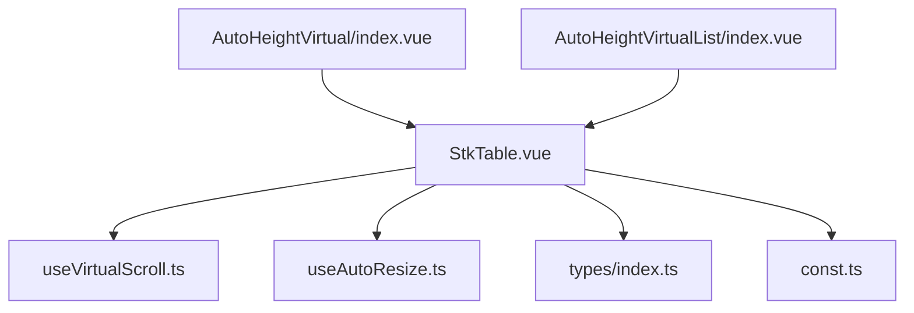
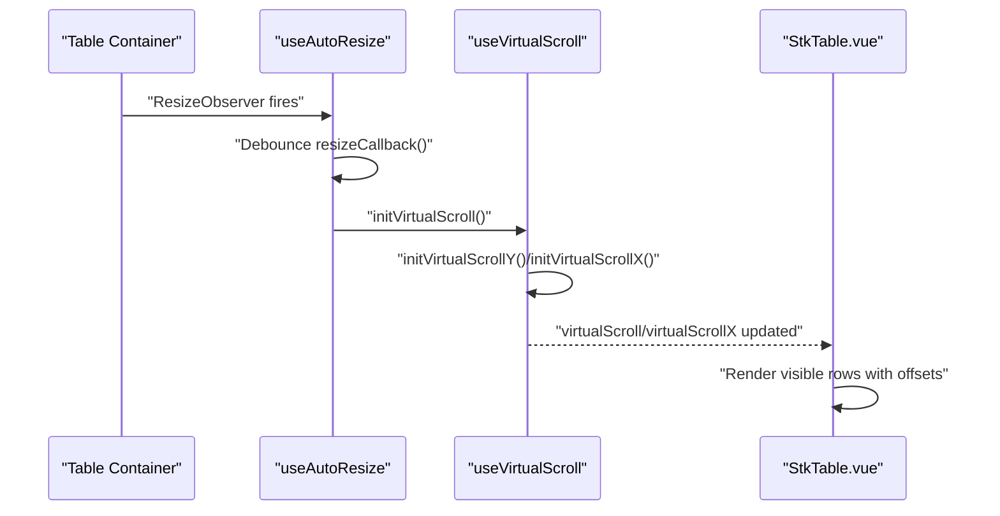
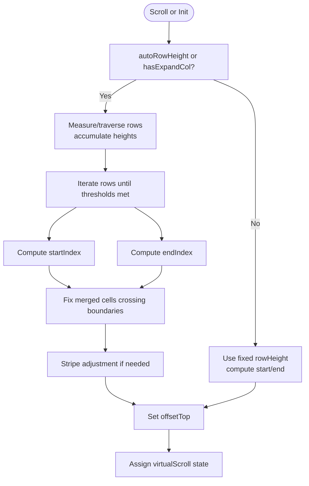
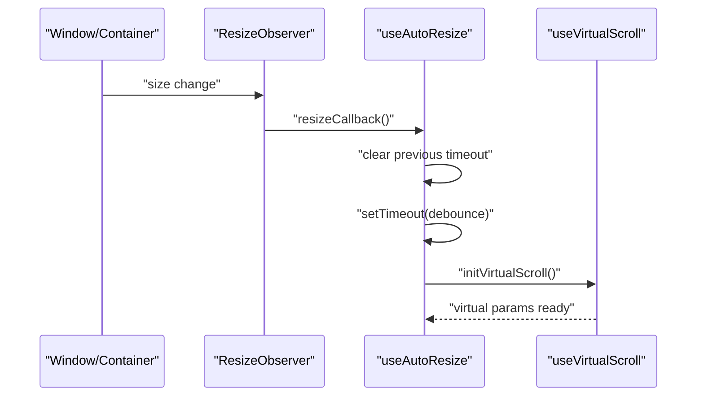
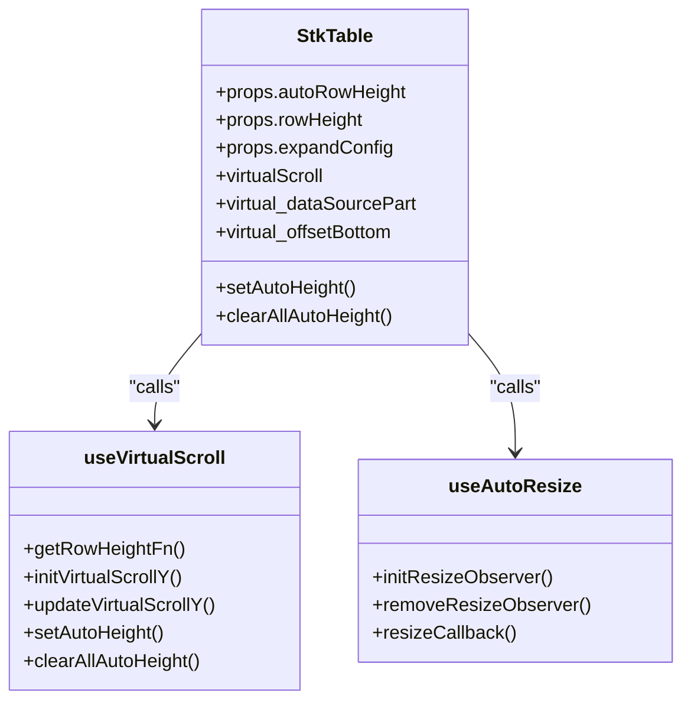
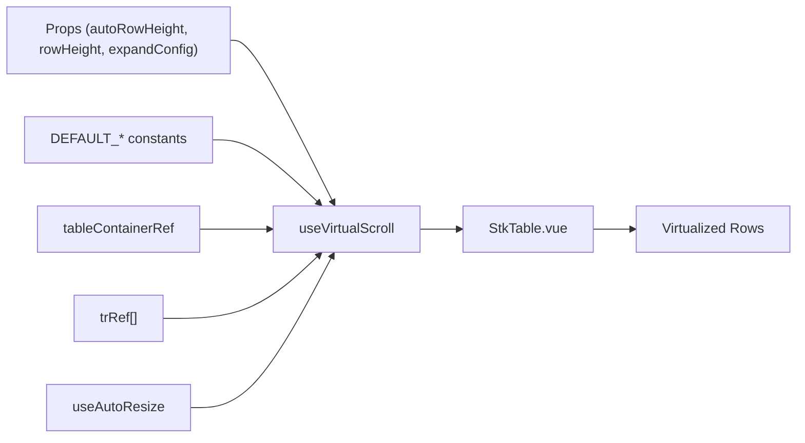

# Auto-Height Virtual Scrolling

<cite>
**Referenced Files in This Document**
- [useVirtualScroll.ts](file://src/StkTable/useVirtualScroll.ts)
- [useAutoResize.ts](file://src/StkTable/useAutoResize.ts)
- [StkTable.vue](file://src/StkTable/StkTable.vue)
- [types/index.ts](file://src/StkTable/types/index.ts)
- [const.ts](file://src/StkTable/const.ts)
- [auto-height-virtual.md](file://docs-src/main/table/advanced/auto-height-virtual.md)
- [AutoHeightVirtual/index.vue](file://docs-demo/advanced/auto-height-virtual/AutoHeightVirtual/index.vue)
- [AutoHeightVirtual/types.ts](file://docs-demo/advanced/auto-height-virtual/AutoHeightVirtual/types.ts)
- [AutoHeightVirtualList/index.vue](file://docs-demo/demos/VirtualList/AutoHeightVirtualList/index.vue)
</cite>

## Table of Contents
1. [Introduction](#introduction)
2. [Project Structure](#project-structure)
3. [Core Components](#core-components)
4. [Architecture Overview](#architecture-overview)
5. [Detailed Component Analysis](#detailed-component-analysis)
6. [Dependency Analysis](#dependency-analysis)
7. [Performance Considerations](#performance-considerations)
8. [Troubleshooting Guide](#troubleshooting-guide)
9. [Conclusion](#conclusion)
10. [Appendices](#appendices)

## Introduction
This document explains auto-height virtual scrolling in Stk Table Vue. It focuses on how dynamic row heights are measured and cached, how the viewport is managed with variable-height items, and how performance is optimized for large datasets with rich content. It also covers configuration options, memory management, and integration with other table features such as expandable rows, merged cells, and keyboard navigation.

## Project Structure
The auto-height virtual scrolling feature spans several modules:
- Virtual scrolling engine: calculates visible range and offsets for variable-height rows
- Auto-resize observer: detects container and column width changes to reinitialize virtualization
- Table component: orchestrates props, refs, and rendering of virtualized rows and columns
- Types and constants: define configuration shapes and defaults

**Diagram sources**
- [StkTable.vue](file://src/StkTable/StkTable.vue#L775-L792)
- [useVirtualScroll.ts](file://src/StkTable/useVirtualScroll.ts#L60-L69)
- [useAutoResize.ts](file://src/StkTable/useAutoResize.ts#L14-L40)
- [types/index.ts](file://src/StkTable/types/index.ts#L275-L278)
- [const.ts](file://src/StkTable/const.ts#L6-L8)
- [AutoHeightVirtual/index.vue](file://docs-demo/advanced/auto-height-virtual/AutoHeightVirtual/index.vue#L24-L34)
- [AutoHeightVirtualList/index.vue](file://docs-demo/demos/VirtualList/AutoHeightVirtualList/index.vue#L21-L36)

**Section sources**
- [StkTable.vue](file://src/StkTable/StkTable.vue#L775-L792)
- [useVirtualScroll.ts](file://src/StkTable/useVirtualScroll.ts#L60-L69)
- [useAutoResize.ts](file://src/StkTable/useAutoResize.ts#L14-L40)
- [types/index.ts](file://src/StkTable/types/index.ts#L275-L278)
- [const.ts](file://src/StkTable/const.ts#L6-L8)
- [AutoHeightVirtual/index.vue](file://docs-demo/advanced/auto-height-virtual/AutoHeightVirtual/index.vue#L24-L34)
- [AutoHeightVirtualList/index.vue](file://docs-demo/demos/VirtualList/AutoHeightVirtualList/index.vue#L21-L36)

## Core Components
- Virtual scrolling engine: computes visible rows and offsets for variable-height items, supports expandable rows and merged cells, and optimizes scroll updates for Vue 2 compatibility.
- Auto-resize observer: watches container size changes and recomputes virtualization parameters with debouncing.
- Table component: exposes props for enabling auto row height, expected height, and integrates with virtualization and resizing hooks.

Key responsibilities:
- Dynamic row height measurement and caching via dataset keys
- Accurate viewport calculation for variable-height items
- Debounced resize handling to avoid excessive recalculations
- Compatibility with expandable rows and merged cells

**Section sources**
- [useVirtualScroll.ts](file://src/StkTable/useVirtualScroll.ts#L177-L189)
- [useVirtualScroll.ts](file://src/StkTable/useVirtualScroll.ts#L240-L270)
- [useVirtualScroll.ts](file://src/StkTable/useVirtualScroll.ts#L273-L406)
- [useAutoResize.ts](file://src/StkTable/useAutoResize.ts#L76-L90)
- [StkTable.vue](file://src/StkTable/StkTable.vue#L282-L480)

## Architecture Overview
The auto-height virtual scrolling pipeline combines DOM observation, virtualization computation, and reactive rendering.

**Diagram sources**
- [useAutoResize.ts](file://src/StkTable/useAutoResize.ts#L42-L63)
- [useAutoResize.ts](file://src/StkTable/useAutoResize.ts#L76-L90)
- [useVirtualScroll.ts](file://src/StkTable/useVirtualScroll.ts#L195-L235)
- [StkTable.vue](file://src/StkTable/StkTable.vue#L104-L179)

## Detailed Component Analysis

### Virtual Scrolling Engine
The engine manages:
- Visible range computation for variable-height rows
- Offset calculations for top and bottom padding
- Debounced scroll updates for Vue 2 compatibility
- Integration with expandable rows and merged cells

**Diagram sources**
- [useVirtualScroll.ts](file://src/StkTable/useVirtualScroll.ts#L273-L406)
- [useVirtualScroll.ts](file://src/StkTable/useVirtualScroll.ts#L326-L359)

Key behaviors:
- Uses a Map keyed by row keys to cache measured heights
- Falls back to expected height when measurement is missing
- Adjusts viewport for merged cells and expandable rows
- Optimizes scroll updates for Vue 2 by deferring state updates

**Section sources**
- [useVirtualScroll.ts](file://src/StkTable/useVirtualScroll.ts#L240-L270)
- [useVirtualScroll.ts](file://src/StkTable/useVirtualScroll.ts#L273-L406)
- [useVirtualScroll.ts](file://src/StkTable/useVirtualScroll.ts#L326-L359)

### Auto-Resize Observer
The observer:
- Watches container size changes and window resize events
- Debounces callbacks to reduce expensive recomputation
- Reinitializes virtualization when container or columns change

**Diagram sources**
- [useAutoResize.ts](file://src/StkTable/useAutoResize.ts#L42-L63)
- [useAutoResize.ts](file://src/StkTable/useAutoResize.ts#L76-L90)
- [useVirtualScroll.ts](file://src/StkTable/useVirtualScroll.ts#L195-L235)

**Section sources**
- [useAutoResize.ts](file://src/StkTable/useAutoResize.ts#L14-L91)
- [useVirtualScroll.ts](file://src/StkTable/useVirtualScroll.ts#L195-L235)

### Table Integration and Rendering
The table component:
- Exposes props for enabling auto row height and expected height
- Computes CSS variables for row heights and header heights
- Renders virtualized rows with top/bottom spacer heights
- Integrates with expandable rows and merged cells

**Diagram sources**
- [StkTable.vue](file://src/StkTable/StkTable.vue#L282-L480)
- [StkTable.vue](file://src/StkTable/StkTable.vue#L775-L792)
- [useVirtualScroll.ts](file://src/StkTable/useVirtualScroll.ts#L177-L189)
- [useVirtualScroll.ts](file://src/StkTable/useVirtualScroll.ts#L240-L270)
- [useAutoResize.ts](file://src/StkTable/useAutoResize.ts#L14-L40)

**Section sources**
- [StkTable.vue](file://src/StkTable/StkTable.vue#L282-L480)
- [StkTable.vue](file://src/StkTable/StkTable.vue#L104-L179)
- [StkTable.vue](file://src/StkTable/StkTable.vue#L775-L792)

### Configuration Options
- autoRowHeight: boolean or AutoRowHeightConfig
  - When true, rowHeight becomes expected height for calculation
  - AutoRowHeightConfig.expectedHeight can be a number or a function(row)
- rowHeight: number (used as expected height when autoRowHeight is true)
- expandConfig.height: number (height for expanded rows)
- optimizeVue2Scroll: boolean (defers state updates for smoother scroll)

Notes:
- Expected height takes precedence over rowHeight when computing viewport
- Expandable rows override per-row height during expansion

**Section sources**
- [types/index.ts](file://src/StkTable/types/index.ts#L275-L278)
- [auto-height-virtual.md](file://docs-src/main/table/advanced/auto-height-virtual.md#L4-L22)
- [useVirtualScroll.ts](file://src/StkTable/useVirtualScroll.ts#L177-L189)
- [useVirtualScroll.ts](file://src/StkTable/useVirtualScroll.ts#L262-L269)

### Practical Examples
- Basic auto-height virtual table with multiple columns and rich content
- Single-column variable-height list with custom cell renderer

These examples demonstrate enabling virtual and auto-row-height props, setting expected height, and rendering variable-height content efficiently.

**Section sources**
- [AutoHeightVirtual/index.vue](file://docs-demo/advanced/auto-height-virtual/AutoHeightVirtual/index.vue#L24-L34)
- [AutoHeightVirtual/types.ts](file://docs-demo/advanced/auto-height-virtual/AutoHeightVirtual/types.ts#L1-L7)
- [AutoHeightVirtualList/index.vue](file://docs-demo/demos/VirtualList/AutoHeightVirtualList/index.vue#L21-L36)

## Dependency Analysis
- useVirtualScroll depends on:
  - Props for auto row height and expected height
  - Table container ref and row refs for measurement
  - Constants for defaults
- useAutoResize depends on:
  - Props for virtual/virtualX
  - Debounce timing
- StkTable orchestrates both and renders virtualized rows

**Diagram sources**
- [useVirtualScroll.ts](file://src/StkTable/useVirtualScroll.ts#L60-L69)
- [useVirtualScroll.ts](file://src/StkTable/useVirtualScroll.ts#L177-L189)
- [const.ts](file://src/StkTable/const.ts#L6-L8)
- [useAutoResize.ts](file://src/StkTable/useAutoResize.ts#L14-L40)
- [StkTable.vue](file://src/StkTable/StkTable.vue#L775-L792)

**Section sources**
- [useVirtualScroll.ts](file://src/StkTable/useVirtualScroll.ts#L60-L69)
- [useAutoResize.ts](file://src/StkTable/useAutoResize.ts#L14-L40)
- [StkTable.vue](file://src/StkTable/StkTable.vue#L775-L792)

## Performance Considerations
- Measurement batching: measures DOM heights in batches when autoRowHeight is enabled to minimize layout thrashing
- Debounced resize handling: reduces recomputation frequency on container/window resize
- Vue 2 scroll optimization: defers state updates for downward scrolls to prevent flicker
- Memory management: caches measured heights per row key; clears cache when needed
- Expected height: improves initial estimates and reduces iteration cost

Recommendations:
- Provide expectedHeight for large datasets to reduce traversal
- Keep custom cell renderers efficient to minimize measurement overhead
- Use optimizeVue2Scroll for Vue 2 environments

**Section sources**
- [useVirtualScroll.ts](file://src/StkTable/useVirtualScroll.ts#L292-L301)
- [useAutoResize.ts](file://src/StkTable/useAutoResize.ts#L76-L90)
- [useVirtualScroll.ts](file://src/StkTable/useVirtualScroll.ts#L396-L405)

## Troubleshooting Guide
Common issues and resolutions:
- Scroll position instability after data changes
  - Ensure scrollTop is recalculated when data length changes; the engine clamps scrollTop to a safe maximum
- Incorrect visible range with merged cells
  - The engine adjusts startIndex/endIndex to include merged rows spanning the viewport
- Expandable rows affecting offsets
  - Expanded row height overrides per-row height during expansion; ensure expandConfig.height is set appropriately
- Memory growth with long lists
  - Clear cached heights periodically using clearAllAutoHeight when appropriate
- Keyboard navigation and focus
  - The table sets tabindex for cell selection; ensure custom cells preserve focusability and aria attributes as needed

**Section sources**
- [useVirtualScroll.ts](file://src/StkTable/useVirtualScroll.ts#L221-L225)
- [useVirtualScroll.ts](file://src/StkTable/useVirtualScroll.ts#L326-L359)
- [useVirtualScroll.ts](file://src/StkTable/useVirtualScroll.ts#L183-L187)
- [StkTable.vue](file://src/StkTable/StkTable.vue#L30-L30)

## Conclusion
Stk Table Vue’s auto-height virtual scrolling balances correctness and performance by measuring and caching row heights, computing accurate viewport boundaries, and optimizing for both modern and legacy environments. With proper configuration—especially expected height—and careful custom cell design, it delivers responsive, scalable tables with rich content.

## Appendices

### Configuration Reference
- autoRowHeight: boolean | AutoRowHeightConfig
  - expectedHeight: number | (row) => number
- rowHeight: number (acts as expected height when autoRowHeight is true)
- expandConfig.height: number (for expanded rows)
- optimizeVue2Scroll: boolean (defers scroll updates)

**Section sources**
- [types/index.ts](file://src/StkTable/types/index.ts#L275-L278)
- [auto-height-virtual.md](file://docs-src/main/table/advanced/auto-height-virtual.md#L4-L22)