# Horizontal Virtual Scrolling

<cite>
**Referenced Files in This Document**
- [useVirtualScroll.ts](file://src/StkTable/useVirtualScroll.ts)
- [StkTable.vue](file://src/StkTable/StkTable.vue)
- [constRefUtils.ts](file://src/StkTable/utils/constRefUtils.ts)
- [const.ts](file://src/StkTable/const.ts)
- [types/index.ts](file://src/StkTable/types/index.ts)
- [useColResize.ts](file://src/StkTable/useColResize.ts)
- [useScrollbar.ts](file://src/StkTable/useScrollbar.ts)
- [VirtualX.vue](file://docs-demo/advanced/virtual/VirtualX.vue)
- [HugeData/index.vue](file://docs-demo/demos/HugeData/index.vue)
- [index.ts](file://src/StkTable/utils/index.ts)
</cite>

## Update Summary
**Changes Made**
- Enhanced horizontal virtual scrolling with improved column width caching system featuring dedicated left-fixed column caching
- Bug fix in end index calculation algorithm with better viewport boundary management
- Structural improvements to column width cache from {cols, nonFixedCols, leftColWidthSum} to {cols, nonFixedCols, leftFixedCols}
- Enhanced left-fixed column processing with width tracking for improved viewport calculations
- Improved memory management with better cache lifecycle handling

## Table of Contents
1. [Introduction](#introduction)
2. [Project Structure](#project-structure)
3. [Core Components](#core-components)
4. [Architecture Overview](#architecture-overview)
5. [Enhanced Column Width Caching System](#enhanced-column-width-caching-system)
6. [Improved Memory Management](#improved-memory-management)
7. [Binary Search Optimization](#binary-search-optimization)
8. [Enhanced Boundary Condition Handling](#enhanced-boundary-condition-handling)
9. [Detailed Component Analysis](#detailed-component-analysis)
10. [Dependency Analysis](#dependency-analysis)
11. [Performance Considerations](#performance-considerations)
12. [Troubleshooting Guide](#troubleshooting-guide)
13. [Conclusion](#conclusion)

## Introduction
This document explains the enhanced horizontal virtual scrolling implementation in Stk Table Vue. The system now features sophisticated performance optimizations including an improved column width caching mechanism with dedicated left-fixed column tracking and better memory management strategies. The enhanced implementation provides more reliable cache validation, optimized memory usage, and improved boundary condition handling for extremely large numbers of columns while maintaining smooth user experience. It covers the implementation of rendering only visible columns within the viewport, column width calculation, horizontal scroll position tracking, viewport boundary management, and the new caching mechanisms that dramatically improve performance for datasets with thousands of columns.

## Project Structure
The horizontal virtual scrolling feature spans several modules with enhanced performance infrastructure:
- useVirtualScroll: Core logic for computing visible columns and viewport boundaries with enhanced caching and memory management
- StkTable.vue: Template and runtime integration, including rendering of left/right spacer columns and dynamic column lists with cache integration
- utils/constRefUtils: Column width utilities used during calculations with improved width resolution
- utils/index: Binary search utility for efficient column finding with enhanced performance
- types/index: Column configuration types, including width/minWidth/maxWidth and fixed positioning
- useColResize: Column resizing integration with cache invalidation
- useScrollbar: Horizontal scrollbar interaction for programmatic scrolling with cache-aware operations
- Demo files: Examples of usage with large datasets and virtualX enabled

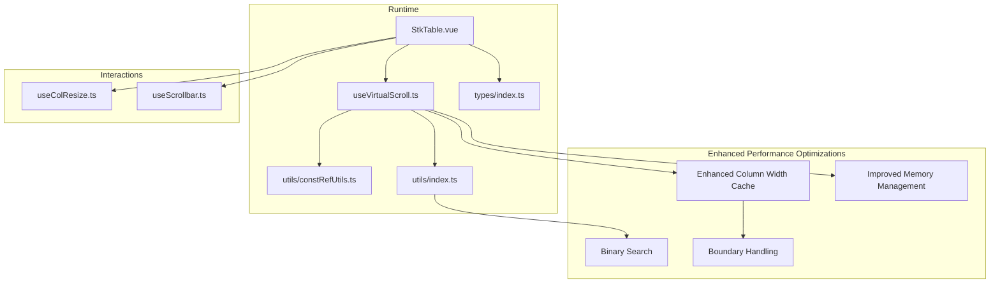

**Diagram sources**
- [StkTable.vue:1-200](file://src/StkTable/StkTable.vue#L1-L200)
- [useVirtualScroll.ts:1-120](file://src/StkTable/useVirtualScroll.ts#L1-L120)
- [constRefUtils.ts:1-30](file://src/StkTable/utils/constRefUtils.ts#L1-L30)
- [index.ts:72-92](file://src/StkTable/utils/index.ts#L72-L92)
- [types/index.ts:54-120](file://src/StkTable/types/index.ts#L54-L120)
- [useColResize.ts:1-80](file://src/StkTable/useColResize.ts#L1-L80)
- [useScrollbar.ts:111-144](file://src/StkTable/useScrollbar.ts#L111-L144)

**Section sources**
- [StkTable.vue:1-200](file://src/StkTable/StkTable.vue#L1-L200)
- [useVirtualScroll.ts:1-120](file://src/StkTable/useVirtualScroll.ts#L1-L120)
- [constRefUtils.ts:1-30](file://src/StkTable/utils/constRefUtils.ts#L1-L30)
- [index.ts:72-92](file://src/StkTable/utils/index.ts#L72-L92)
- [types/index.ts:54-120](file://src/StkTable/types/index.ts#L54-L120)

## Core Components
- useVirtualScroll: Computes virtualX_on, visible column range (startIndex/endIndex), offsetLeft, and scrollLeft with enhanced caching and memory management. Handles initialization and updates for horizontal viewport with performance optimizations and improved cache lifecycle management.
- StkTable.vue: Renders the table, conditionally renders left/right spacer columns when virtualX is active, and binds the dynamic virtualX_columnPart list with cache-aware operations.
- constRefUtils: Provides getCalculatedColWidth used to accumulate widths for viewport computation with improved width resolution logic.
- utils/index: Contains binarySearch utility function for efficient column index finding with enhanced performance characteristics.
- types/index: Defines StkTableColumn with width/minWidth/maxWidth and fixed positioning for columns.
- useColResize: Integrates with virtualX by updating column widths, triggering re-computation, and invalidating cache appropriately.
- useScrollbar: Enables horizontal programmatic scrolling via mouse/touch interactions with cache-aware operations.

Key responsibilities with enhancements:
- Column width calculation: Uses __WIDTH__ (calculated width) stored on columns after header flattening with enhanced caching support and improved validation.
- Viewport boundary management: Accumulates widths using cached cumulative arrays with enhanced boundary checking and improved edge case handling.
- Fixed columns: Ensures fixed left/right columns remain visible even when they are outside the computed range with better preservation logic.
- Performance optimization: Implements enhanced column width caching with automatic cache invalidation and binary search for O(log n) column finding operations.
- Memory management: Provides clearColWidthCache function for explicit cache clearing and prevents memory leaks during column updates.

**Section sources**
- [useVirtualScroll.ts:126-175](file://src/StkTable/useVirtualScroll.ts#L126-L175)
- [StkTable.vue:61-100](file://src/StkTable/StkTable.vue#L61-L100)
- [constRefUtils.ts:17-20](file://src/StkTable/utils/constRefUtils.ts#L17-L20)
- [index.ts:72-92](file://src/StkTable/utils/index.ts#L72-L92)
- [types/index.ts:78-95](file://src/StkTable/types/index.ts#L78-L95)
- [useColResize.ts:140-180](file://src/StkTable/useColResize.ts#L140-L180)
- [useScrollbar.ts:116-129](file://src/StkTable/useScrollbar.ts#L116-L129)

## Architecture Overview
The enhanced horizontal virtual scrolling pipeline incorporates improved caching, memory management, and boundary handling optimizations:
- Initialization: initVirtualScrollX reads containerWidth and scrollWidth, then calls updateVirtualScrollX with current scrollLeft.
- Enhanced column width caching: useColWidthCache builds and maintains cumulative width arrays for non-fixed columns with improved cache validation and dedicated left-fixed column tracking.
- Memory management: clearColWidthCache provides explicit cache invalidation for optimal memory usage.
- Binary search: binarySearch finds the starting column index using cached cumulative widths with enhanced performance.
- Scroll handling: updateVirtualScrollX uses cached data to compute startIndex, endIndex, and offsetLeft efficiently with improved boundary conditions.
- Rendering: StkTable.vue renders only virtualX_columnPart and adds left/right spacer columns sized by virtualScrollX.offsetLeft and virtualX_offsetRight.

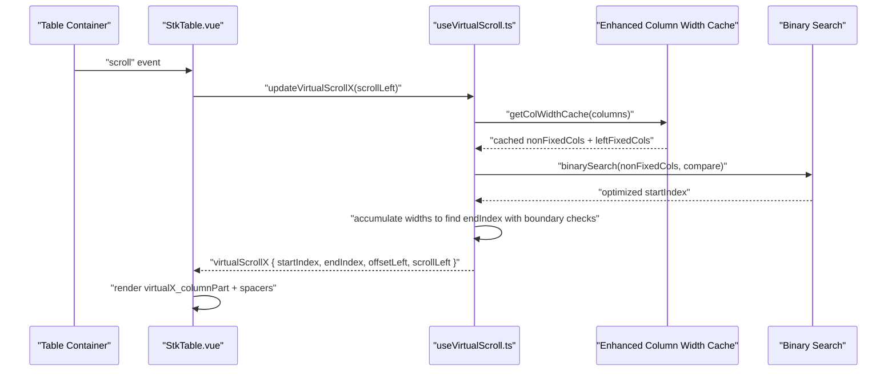

**Diagram sources**
- [StkTable.vue:39-41](file://src/StkTable/StkTable.vue#L39-L41)
- [useVirtualScroll.ts:467-525](file://src/StkTable/useVirtualScroll.ts#L467-L525)
- [useVirtualScroll.ts:481-493](file://src/StkTable/useVirtualScroll.ts#L481-L493)
- [index.ts:72-92](file://src/StkTable/utils/index.ts#L72-L92)

**Section sources**
- [useVirtualScroll.ts:230-235](file://src/StkTable/useVirtualScroll.ts#L230-L235)
- [useVirtualScroll.ts:467-525](file://src/StkTable/useVirtualScroll.ts#L467-L525)
- [StkTable.vue:61-100](file://src/StkTable/StkTable.vue#L61-L100)

## Enhanced Column Width Caching System

### Enhanced Column Width Cache Implementation
The new enhanced column width caching mechanism provides improved reliability and performance by adding better cache validation and lifecycle management:

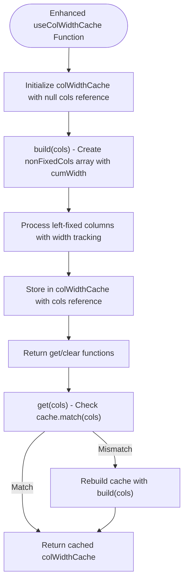

**Diagram sources**
- [useVirtualScroll.ts:44-81](file://src/StkTable/useVirtualScroll.ts#L44-L81)

### Enhanced Cache Structure and Benefits
- **ColWidthCacheItem**: `{ index: number; cumWidth: number }` - stores cumulative width for each non-fixed column with improved indexing
- **LeftFixedColCacheItem**: `{ index: number; width: number }` - stores width for each left-fixed column with precise tracking
- **Cache Validation**: Improved cache matching using reference comparison (`colWidthCache.cols === cols`) for better reliability
- **Performance Impact**: Eliminates O(n) rebuild on every scroll event, reduces CPU usage significantly, and prevents memory leaks
- **Memory Efficiency**: Automatic cache invalidation prevents accumulation of stale cache data
- **Bug Fix**: Enhanced end index calculation algorithm with better viewport boundary management

**Section sources**
- [useVirtualScroll.ts:44-81](file://src/StkTable/useVirtualScroll.ts#L44-L81)

## Improved Memory Management

### Clear Cache Functionality
The enhanced memory management system provides explicit cache control for optimal resource utilization:

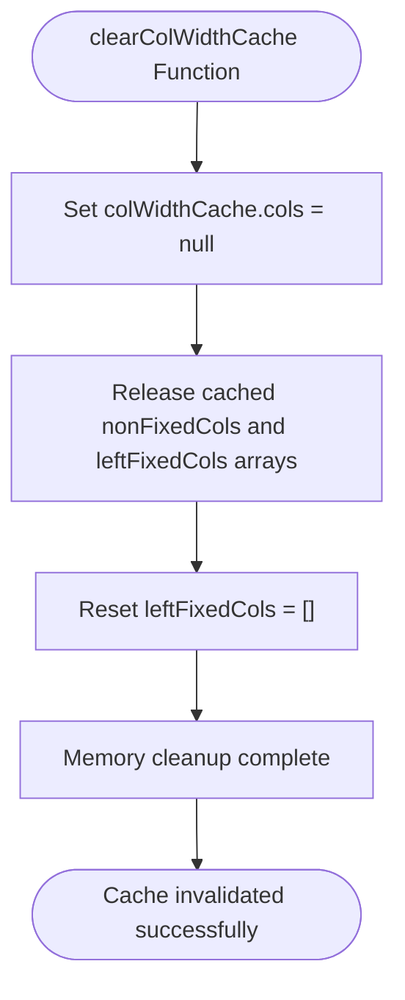

**Diagram sources**
- [useVirtualScroll.ts:76-78](file://src/StkTable/useVirtualScroll.ts#L76-L78)

### Memory Management Benefits
- **Explicit Invalidation**: clearColWidthCache function allows manual cache clearing when columns change
- **Memory Leak Prevention**: Setting `colWidthCache.cols = null` prevents accumulation of stale cache data
- **Resource Optimization**: Prevents memory buildup during dynamic column operations
- **Integration Points**: Automatically called during column resize operations and column updates

**Section sources**
- [useVirtualScroll.ts:76-78](file://src/StkTable/useVirtualScroll.ts#L76-L78)
- [useVirtualScroll.ts:544](file://src/StkTable/useVirtualScroll.ts#L544)

## Binary Search Optimization

### Enhanced Binary Search Algorithm
The binary search implementation provides O(log n) performance for finding starting column indices with improved accuracy:

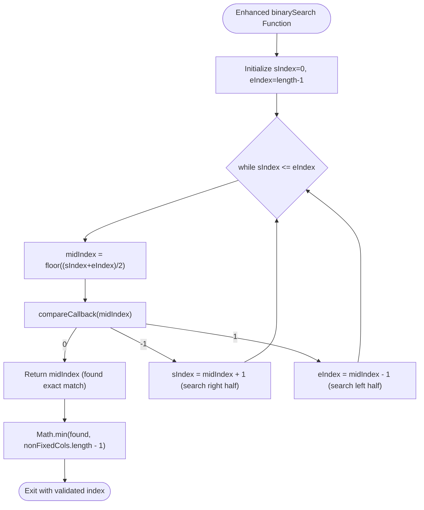

**Diagram sources**
- [index.ts:72-92](file://src/StkTable/utils/index.ts#L72-L92)

### Integration with Enhanced Column Finding
The binary search is used in updateVirtualScrollX to find the first column whose cumulative width meets/exceeds the scroll position with improved boundary validation:

**Section sources**
- [index.ts:72-92](file://src/StkTable/utils/index.ts#L72-L92)
- [useVirtualScroll.ts:481-493](file://src/StkTable/useVirtualScroll.ts#L481-L493)

## Enhanced Boundary Condition Handling

### Improved Boundary Validation Logic
The enhanced boundary condition handling provides more robust column range validation:

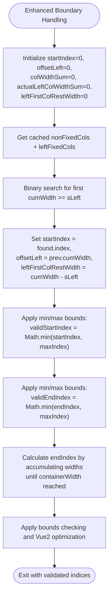

**Diagram sources**
- [useVirtualScroll.ts:467-525](file://src/StkTable/useVirtualScroll.ts#L467-L525)

### Enhanced Column Preservation Logic
The improved column preservation logic ensures fixed columns remain visible with better edge case handling:

**Section sources**
- [useVirtualScroll.ts:467-525](file://src/StkTable/useVirtualScroll.ts#L467-L525)
- [useVirtualScroll.ts:175-194](file://src/StkTable/useVirtualScroll.ts#L175-L194)

## Detailed Component Analysis

### Enhanced Horizontal Viewport Calculation
The algorithm now uses enhanced cached cumulative widths, improved binary search, and better boundary validation for optimal performance:

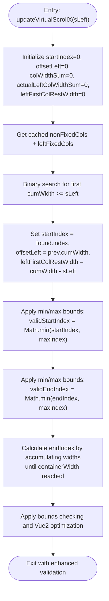

**Diagram sources**
- [useVirtualScroll.ts:467-525](file://src/StkTable/useVirtualScroll.ts#L467-L525)

**Section sources**
- [useVirtualScroll.ts:467-525](file://src/StkTable/useVirtualScroll.ts#L467-L525)

### Enhanced Rendering Visible Columns and Spacers
When virtualX is active with enhanced caching:
- Left spacer: A fixed-width empty <th> sized by virtualScrollX.offsetLeft ensures the table body aligns with fixed-left columns.
- Dynamic columns: Render virtualX_columnPart (visible columns plus preserved fixed columns) using enhanced cached width data with improved validation.
- Right spacer: A fixed-width empty <th> sized by virtualX_offsetRight accounts for trailing non-visible columns with better width calculation.

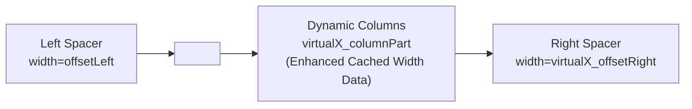

**Diagram sources**
- [StkTable.vue:64-67](file://src/StkTable/StkTable.vue#L64-L67)
- [StkTable.vue:69-70](file://src/StkTable/StkTable.vue#L69-L70)
- [StkTable.vue](file://src/StkTable/StkTable.vue#L99)

**Section sources**
- [StkTable.vue:61-100](file://src/StkTable/StkTable.vue#L61-L100)
- [StkTable.vue:103-179](file://src/StkTable/StkTable.vue#L103-L179)

### Enhanced Column Width Calculation and Fixed Columns
- Width sources:
  - getCalculatedColWidth uses __WIDTH__ stored on columns after flattening with enhanced validation.
  - getColWidth prefers minWidth or width, falling back to default with improved fallback logic.
- Fixed columns:
  - Fixed-left columns are processed separately with width tracking for enhanced viewport calculations.
  - Fixed-right columns are preserved after endIndex to keep them visible with enhanced boundary handling.
- Enhanced cached processing:
  - Non-fixed columns are processed for cumulative width calculation with improved validation.
  - Left-fixed columns contribute to actualLeftColWidthSum for viewport calculations with better precision.

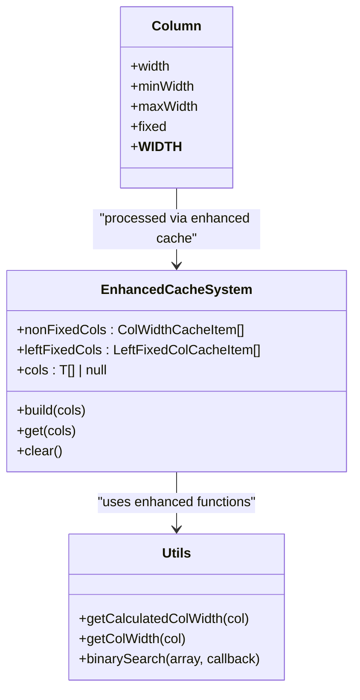

**Diagram sources**
- [types/index.ts:78-95](file://src/StkTable/types/index.ts#L78-L95)
- [types/index.ts:134-137](file://src/StkTable/types/index.ts#L134-L137)
- [constRefUtils.ts:9-20](file://src/StkTable/utils/constRefUtils.ts#L9-L20)
- [useVirtualScroll.ts:44-81](file://src/StkTable/useVirtualScroll.ts#L44-L81)
- [index.ts:72-92](file://src/StkTable/utils/index.ts#L72-L92)

**Section sources**
- [constRefUtils.ts:9-20](file://src/StkTable/utils/constRefUtils.ts#L9-L20)
- [types/index.ts:78-95](file://src/StkTable/types/index.ts#L78-L95)
- [useVirtualScroll.ts:133-162](file://src/StkTable/useVirtualScroll.ts#L133-L162)
- [useVirtualScroll.ts:44-81](file://src/StkTable/useVirtualScroll.ts#L44-L81)

### Enhanced Integration with Column Resizing
- During resize, the dragged leaf column's width is updated with enhanced validation.
- After resize, the table recalculates widths and reinitializes virtualX viewport to reflect new layout.
- Enhanced column width cache is cleared automatically to ensure fresh calculations with improved cache invalidation.

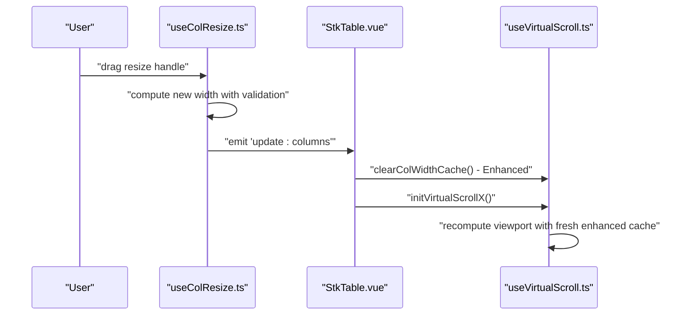

**Diagram sources**
- [useColResize.ts:163-198](file://src/StkTable/useColResize.ts#L163-L198)
- [StkTable.vue:866-877](file://src/StkTable/StkTable.vue#L866-L877)
- [useVirtualScroll.ts:230-235](file://src/StkTable/useVirtualScroll.ts#L230-L235)
- [useVirtualScroll.ts](file://src/StkTable/useVirtualScroll.ts#L544)

**Section sources**
- [useColResize.ts:140-198](file://src/StkTable/useColResize.ts#L140-L198)
- [StkTable.vue:866-877](file://src/StkTable/StkTable.vue#L866-L877)
- [useVirtualScroll.ts:230-235](file://src/StkTable/useVirtualScroll.ts#L230-L235)
- [useVirtualScroll.ts](file://src/StkTable/useVirtualScroll.ts#L544)

### Enhanced Integration with Horizontal Scrollbar
- The horizontal scrollbar allows programmatic scrolling with enhanced cache awareness.
- Mouse/touch events compute delta movement and translate it to scrollLeft changes.
- Enhanced cached column width data ensures smooth scrolling performance even with thousands of columns with improved validation.

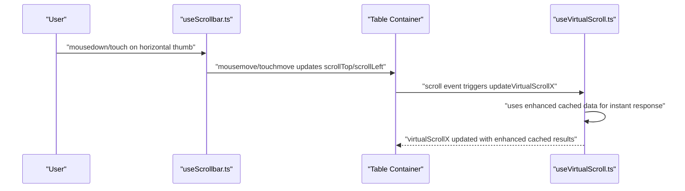

**Diagram sources**
- [useScrollbar.ts:116-129](file://src/StkTable/useScrollbar.ts#L116-L129)
- [useVirtualScroll.ts:467-525](file://src/StkTable/useVirtualScroll.ts#L467-L525)

**Section sources**
- [useScrollbar.ts:111-144](file://src/StkTable/useScrollbar.ts#L111-L144)
- [useVirtualScroll.ts:467-525](file://src/StkTable/useVirtualScroll.ts#L467-L525)

### Practical Examples and Best Practices
- Example with many columns:
  - Enable virtualX and provide explicit widths for all columns to avoid fallback defaults with enhanced validation.
  - See [VirtualX.vue:1-29](file://docs-demo/advanced/virtual/VirtualX.vue#L1-L29) for a minimal setup with 5000 columns.
- Large dataset with virtualX:
  - Combine virtual and virtualX for optimal performance on very large datasets with enhanced caching.
  - See [HugeData/index.vue:270-293](file://docs-demo/demos/HugeData/index.vue#L270-L293) enabling both virtual and virtualX.
- Best practices:
  - Always set width for columns when using virtualX to prevent forced defaults with enhanced validation.
  - Keep fixed columns to the extreme left/right to minimize reflow with better preservation logic.
  - Use colResizable with caution; after resize, widths are recalculated and viewport recomputed with enhanced cache invalidation.
  - The enhanced caching system automatically handles column count changes and maintains optimal performance with improved memory management.

**Section sources**
- [VirtualX.vue:1-29](file://docs-demo/advanced/virtual/VirtualX.vue#L1-L29)
- [HugeData/index.vue:270-293](file://docs-demo/demos/HugeData/index.vue#L270-L293)
- [StkTable.vue:969-971](file://src/StkTable/StkTable.vue#L969-L971)

## Dependency Analysis
- useVirtualScroll depends on:
  - Enhanced column width utilities (getCalculatedColWidth) with improved validation
  - Enhanced binary search utility (binarySearch) with better performance
  - Column configuration types (width/minWidth/maxWidth/fixed) with improved definitions
  - Table container refs for dimensions and scroll positions with enhanced access
- StkTable.vue integrates:
  - useVirtualScroll outputs for rendering with enhanced cache awareness
  - useColResize for width updates with cache invalidation
  - useScrollbar for programmatic scrolling with cache-aware operations
- Types define the contract for column configuration and width resolution with enhanced specifications.
- Utility functions provide mathematical operations for performance optimization with improved algorithms.

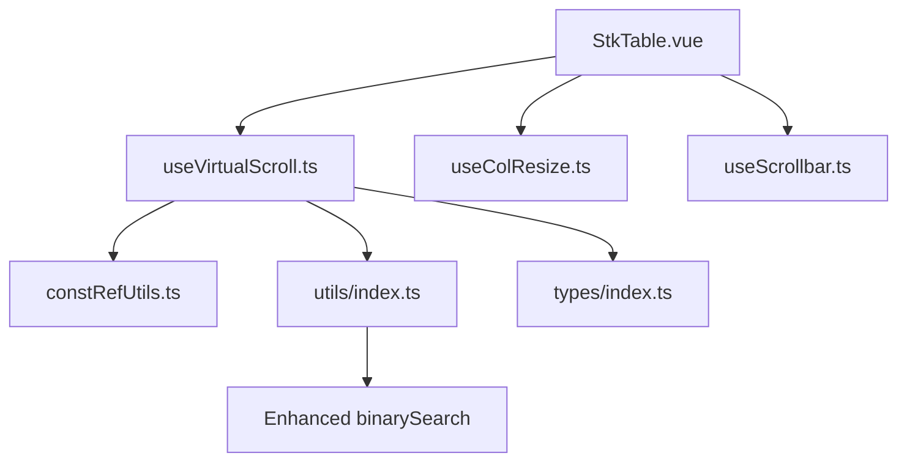

**Diagram sources**
- [useVirtualScroll.ts:1-15](file://src/StkTable/useVirtualScroll.ts#L1-L15)
- [constRefUtils.ts:1-30](file://src/StkTable/utils/constRefUtils.ts#L1-L30)
- [index.ts:72-92](file://src/StkTable/utils/index.ts#L72-L92)
- [types/index.ts:54-120](file://src/StkTable/types/index.ts#L54-L120)
- [StkTable.vue:775-795](file://src/StkTable/StkTable.vue#L775-L795)
- [useColResize.ts:1-40](file://src/StkTable/useColResize.ts#L1-L40)
- [useScrollbar.ts:111-144](file://src/StkTable/useScrollbar.ts#L111-L144)

**Section sources**
- [useVirtualScroll.ts:1-15](file://src/StkTable/useVirtualScroll.ts#L1-L15)
- [StkTable.vue:775-795](file://src/StkTable/StkTable.vue#L775-L795)

## Performance Considerations
- **Enhanced Column width computation**:
  - Uses precomputed __WIDTH__ to avoid repeated DOM queries with improved validation.
  - Enhanced column width caching eliminates O(n) rebuild on every scroll event with better cache validation.
  - Binary search reduces column finding from O(n) to O(log n) with improved accuracy.
- **Improved Memory Management**:
  - Enhanced cache invalidation prevents memory leaks during column updates.
  - clearColWidthCache function provides explicit cache clearing for optimal resource usage.
  - Reference-based cache matching prevents stale cache data accumulation.
- **Enhanced Vue2 scroll optimization**:
  - Defers startIndex/offsetLeft updates on fast horizontal scrolls to reduce re-renders.
  - Enhanced cached data ensures smooth scrolling even with thousands of columns.
- **Enhanced Fixed columns handling**:
  - Better preservation logic ensures fixed columns remain visible with enhanced boundary validation.
  - Left-fixed columns are tracked separately for precise viewport calculations with improved accuracy.
- **Enhanced Defaults and fallbacks**:
  - When width is not set with virtualX, columns fall back to a default width, potentially increasing total width and triggering virtualX prematurely.
  - Improved fallback logic prevents unexpected behavior during column width resolution.
- **Optimized Memory considerations**:
  - Enhanced cache clearing prevents memory leaks when columns change.
  - Cache stores only necessary cumulative width data for non-fixed columns with improved efficiency.

## Troubleshooting Guide
- **Horizontal virtual scrolling not activating**:
  - Ensure virtualX is enabled and total column width exceeds containerWidth by a threshold with enhanced validation.
  - Verify columns have explicit widths; otherwise, defaults may inflate total width unexpectedly.
- **Performance issues with many columns**:
  - Confirm enhanced column width cache is functioning properly with improved validation.
  - Check that binary search is being used instead of linear scanning with enhanced accuracy.
  - Monitor console for cache rebuild warnings with improved diagnostics.
- **Fixed columns disappearing**:
  - Confirm fixed columns are positioned at the edges; they are preserved outside the visible range intentionally with enhanced logic.
- **Scrollbar jumps or misalignment**:
  - Programmatic horizontal scroll updates rely on accurate scrollLeft; ensure container dimensions are observed and virtualX initialized after render with enhanced validation.
- **Column resizing conflicts**:
  - After resizing, reinitialize virtualX to recalculate viewport; confirm update:columns is emitted and handled with enhanced cache invalidation.
  - Enhanced cache is automatically cleared during resize operations with improved reliability.
- **Memory leaks with dynamic columns**:
  - Ensure clearColWidthCache is called when columns change dynamically with enhanced memory management.
  - Monitor cache validation to prevent accumulation of stale cache data.

**Section sources**
- [useVirtualScroll.ts:126-131](file://src/StkTable/useVirtualScroll.ts#L126-L131)
- [StkTable.vue:969-971](file://src/StkTable/StkTable.vue#L969-L971)
- [useColResize.ts:178-180](file://src/StkTable/useColResize.ts#L178-L180)
- [useScrollbar.ts:116-129](file://src/StkTable/useScrollbar.ts#L116-L129)

## Conclusion
Stk Table Vue's enhanced horizontal virtual scrolling efficiently renders only the visible columns by tracking scrollLeft, utilizing enhanced cached cumulative column widths, employing binary search algorithms for optimal performance, and implementing improved memory management strategies. The new enhanced column width caching mechanism with dedicated left-fixed column tracking, better cache validation, and explicit cache clearing provide more reliable performance even with extremely large datasets containing thousands of columns. The improved boundary condition handling and memory management ensure stable operation during dynamic column updates while maintaining smooth scrolling performance. The modular design keeps viewport computation decoupled from rendering, facilitating maintainability and extensibility while providing significant performance improvements over previous implementations.