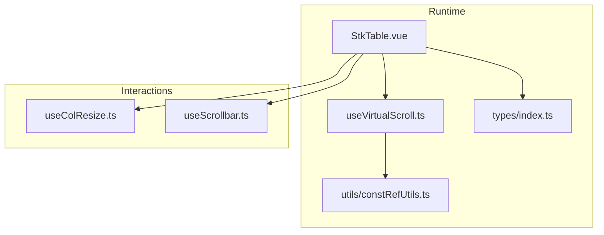
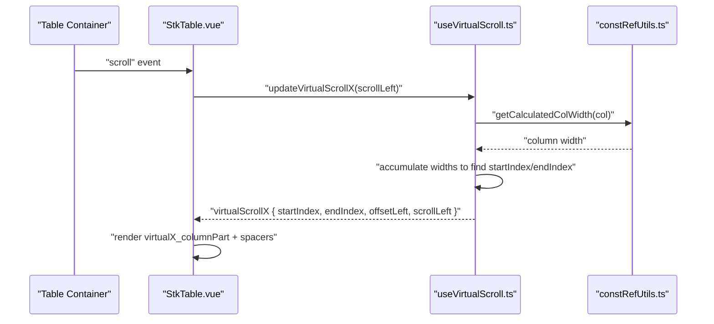
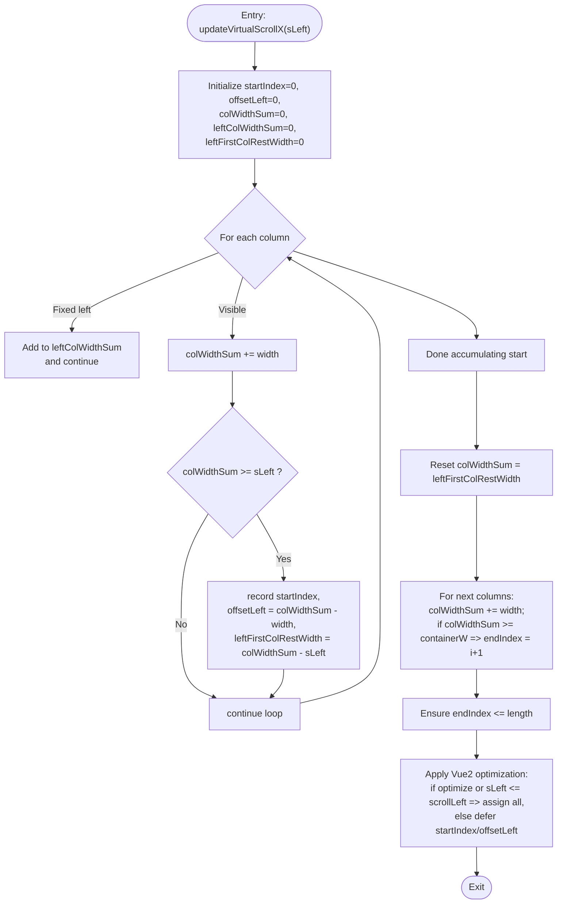
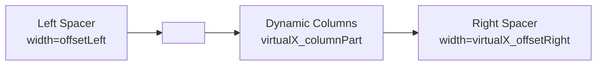
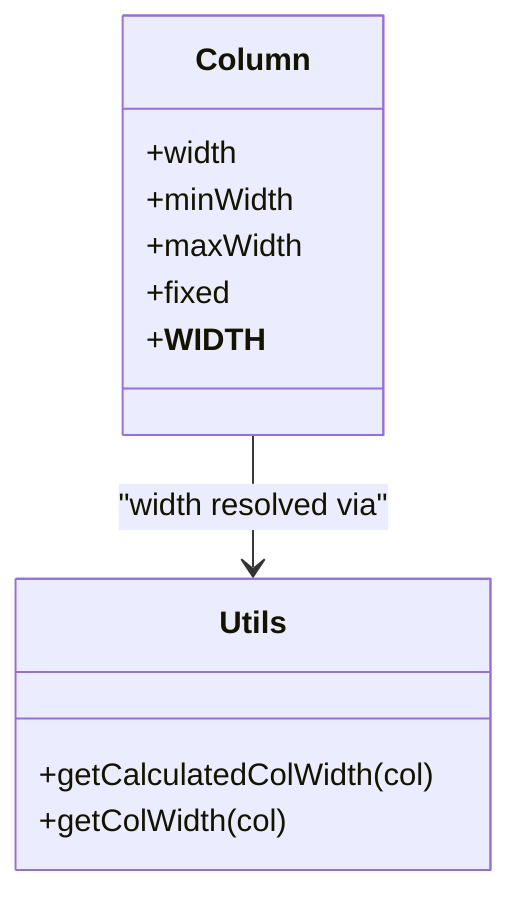
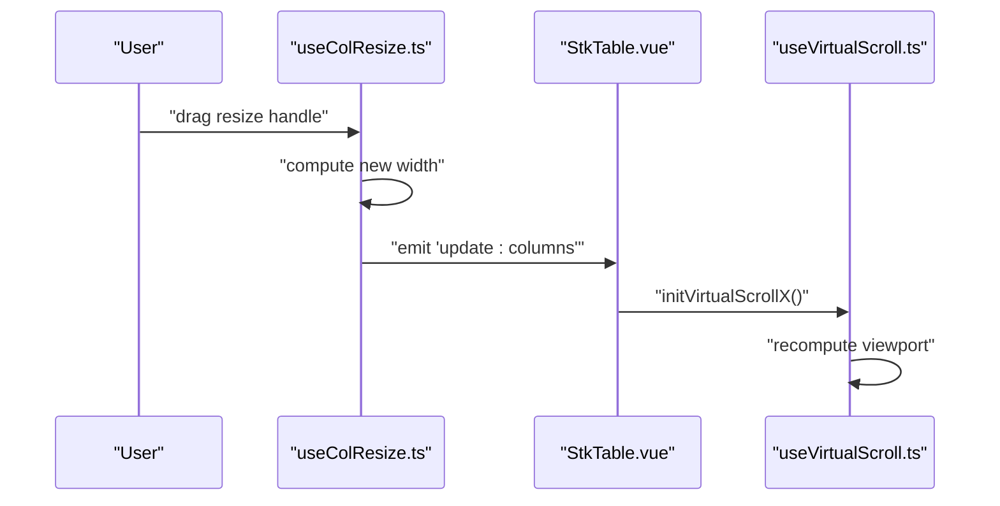
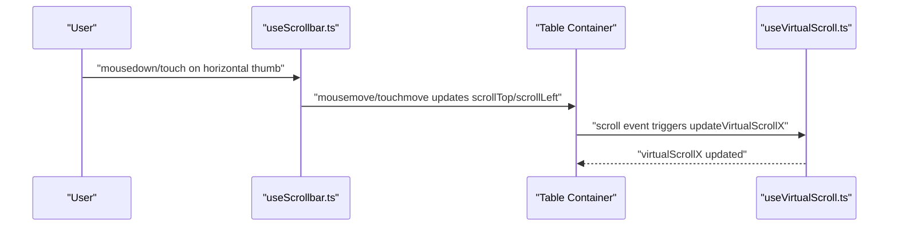
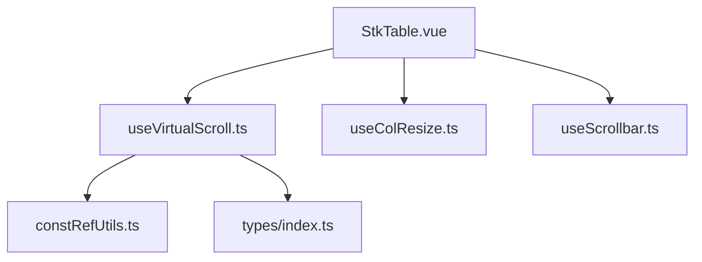

# Horizontal Virtual Scrolling

<cite>
**Referenced Files in This Document**
- [useVirtualScroll.ts](file://src/StkTable/useVirtualScroll.ts)
- [StkTable.vue](file://src/StkTable/StkTable.vue)
- [constRefUtils.ts](file://src/StkTable/utils/constRefUtils.ts)
- [const.ts](file://src/StkTable/const.ts)
- [types/index.ts](file://src/StkTable/types/index.ts)
- [useColResize.ts](file://src/StkTable/useColResize.ts)
- [useScrollbar.ts](file://src/StkTable/useScrollbar.ts)
- [VirtualX.vue](file://docs-demo/advanced/virtual/VirtualX.vue)
- [HugeData/index.vue](file://docs-demo/demos/HugeData/index.vue)
</cite>

## Table of Contents
1. [Introduction](#introduction)
2. [Project Structure](#project-structure)
3. [Core Components](#core-components)
4. [Architecture Overview](#architecture-overview)
5. [Detailed Component Analysis](#detailed-component-analysis)
6. [Dependency Analysis](#dependency-analysis)
7. [Performance Considerations](#performance-considerations)
8. [Troubleshooting Guide](#troubleshooting-guide)
9. [Conclusion](#conclusion)

## Introduction
This document explains the horizontal virtual scrolling implementation in Stk Table Vue. It focuses on how only visible columns within the viewport are rendered, how column widths are calculated, how horizontal scroll position is tracked, and how viewport boundaries are managed. It also documents configuration options, performance optimizations, integration with column resizing and fixed columns, and responsive design considerations.

## Project Structure
The horizontal virtual scrolling feature spans several modules:
- useVirtualScroll: Core logic for computing visible columns and viewport boundaries
- StkTable.vue: Template and runtime integration, including rendering of left/right spacer columns and dynamic column lists
- utils/constRefUtils: Column width utilities used during calculations
- types/index: Column configuration types, including width/minWidth/maxWidth and fixed positioning
- useColResize: Column resizing integration
- useScrollbar: Horizontal scrollbar interaction for programmatic scrolling
- Demo files: Examples of usage with large datasets and virtualX enabled

**Diagram sources**
- [StkTable.vue](file://src/StkTable/StkTable.vue#L1-L200)
- [useVirtualScroll.ts](file://src/StkTable/useVirtualScroll.ts#L1-L120)
- [constRefUtils.ts](file://src/StkTable/utils/constRefUtils.ts#L1-L30)
- [types/index.ts](file://src/StkTable/types/index.ts#L54-L120)
- [useColResize.ts](file://src/StkTable/useColResize.ts#L1-L80)
- [useScrollbar.ts](file://src/StkTable/useScrollbar.ts#L111-L144)

**Section sources**
- [StkTable.vue](file://src/StkTable/StkTable.vue#L1-L200)
- [useVirtualScroll.ts](file://src/StkTable/useVirtualScroll.ts#L1-L120)
- [constRefUtils.ts](file://src/StkTable/utils/constRefUtils.ts#L1-L30)
- [types/index.ts](file://src/StkTable/types/index.ts#L54-L120)

## Core Components
- useVirtualScroll: Computes virtualX_on, visible column range (startIndex/endIndex), offsetLeft, and scrollLeft. Handles initialization and updates for horizontal viewport.
- StkTable.vue: Renders the table, conditionally renders left/right spacer columns when virtualX is active, and binds the dynamic virtualX_columnPart list.
- constRefUtils: Provides getCalculatedColWidth used to accumulate widths for viewport computation.
- types/index: Defines StkTableColumn with width/minWidth/maxWidth and fixed positioning for columns.
- useColResize: Integrates with virtualX by updating column widths and triggering re-computation.
- useScrollbar: Enables horizontal programmatic scrolling via mouse/touch interactions.

Key responsibilities:
- Column width calculation: Uses __WIDTH__ (calculated width) stored on columns after header flattening.
- Viewport boundary management: Accumulates widths until exceeding scrollLeft (start) and container width (end).
- Fixed columns: Ensures fixed left/right columns remain visible even when they are outside the computed range.

**Section sources**
- [useVirtualScroll.ts](file://src/StkTable/useVirtualScroll.ts#L126-L175)
- [StkTable.vue](file://src/StkTable/StkTable.vue#L61-L100)
- [constRefUtils.ts](file://src/StkTable/utils/constRefUtils.ts#L17-L20)
- [types/index.ts](file://src/StkTable/types/index.ts#L78-L95)
- [useColResize.ts](file://src/StkTable/useColResize.ts#L140-L180)
- [useScrollbar.ts](file://src/StkTable/useScrollbar.ts#L116-L129)

## Architecture Overview
The horizontal virtual scrolling pipeline:
- Initialization: initVirtualScrollX reads containerWidth and scrollWidth, then calls updateVirtualScrollX with current scrollLeft.
- Scroll handling: updateVirtualScrollX iterates columns, accumulating widths to compute startIndex, endIndex, and offsetLeft.
- Rendering: StkTable.vue renders only virtualX_columnPart and adds left/right spacer columns sized by virtualScrollX.offsetLeft and virtualX_offsetRight.

**Diagram sources**
- [StkTable.vue](file://src/StkTable/StkTable.vue#L39-L41)
- [useVirtualScroll.ts](file://src/StkTable/useVirtualScroll.ts#L413-L477)
- [constRefUtils.ts](file://src/StkTable/utils/constRefUtils.ts#L17-L20)

**Section sources**
- [useVirtualScroll.ts](file://src/StkTable/useVirtualScroll.ts#L230-L235)
- [useVirtualScroll.ts](file://src/StkTable/useVirtualScroll.ts#L413-L477)
- [StkTable.vue](file://src/StkTable/StkTable.vue#L61-L100)

## Detailed Component Analysis

### Horizontal Viewport Calculation
The algorithm computes the visible column range by scanning from the first column and accumulating widths until the viewport is filled:
- Start accumulation from the first column; skip fixed-left columns for width accumulation but include them in the final list.
- Track colWidthSum; when it reaches/exceeds scrollLeft, record startIndex and offsetLeft.
- Continue accumulating to fill the container width (containerWidth - fixedLeftWidth).
- Compute endIndex as the first column where accumulated width meets/exceeds the container width.
- Apply bounds checks to ensure valid indices.

**Diagram sources**
- [useVirtualScroll.ts](file://src/StkTable/useVirtualScroll.ts#L413-L477)

**Section sources**
- [useVirtualScroll.ts](file://src/StkTable/useVirtualScroll.ts#L413-L477)

### Rendering Visible Columns and Spacers
When virtualX is active:
- Left spacer: A fixed-width empty <th> sized by virtualScrollX.offsetLeft ensures the table body aligns with fixed-left columns.
- Dynamic columns: Render virtualX_columnPart (visible columns plus preserved fixed columns).
- Right spacer: A fixed-width empty <th> sized by virtualX_offsetRight accounts for trailing non-visible columns.

**Diagram sources**
- [StkTable.vue](file://src/StkTable/StkTable.vue#L64-L67)
- [StkTable.vue](file://src/StkTable/StkTable.vue#L69-L70)
- [StkTable.vue](file://src/StkTable/StkTable.vue#L99)

**Section sources**
- [StkTable.vue](file://src/StkTable/StkTable.vue#L61-L100)
- [StkTable.vue](file://src/StkTable/StkTable.vue#L103-L179)

### Column Width Calculation and Fixed Columns
- Width sources:
  - getCalculatedColWidth uses __WIDTH__ stored on columns after flattening.
  - getColWidth prefers minWidth or width, falling back to default.
- Fixed columns:
  - Fixed-left columns are excluded from width accumulation but included in the final rendered list.
  - Fixed-right columns are preserved after endIndex to keep them visible.

**Diagram sources**
- [types/index.ts](file://src/StkTable/types/index.ts#L78-L95)
- [types/index.ts](file://src/StkTable/types/index.ts#L134-L137)
- [constRefUtils.ts](file://src/StkTable/utils/constRefUtils.ts#L9-L20)

**Section sources**
- [constRefUtils.ts](file://src/StkTable/utils/constRefUtils.ts#L9-L20)
- [types/index.ts](file://src/StkTable/types/index.ts#L78-L95)
- [useVirtualScroll.ts](file://src/StkTable/useVirtualScroll.ts#L133-L162)

### Integration with Column Resizing
- During resize, the dragged leaf column’s width is updated.
- After resize, the table recalculates widths and reinitializes virtualX viewport to reflect new layout.

**Diagram sources**
- [useColResize.ts](file://src/StkTable/useColResize.ts#L163-L198)
- [StkTable.vue](file://src/StkTable/StkTable.vue#L866-L877)
- [useVirtualScroll.ts](file://src/StkTable/useVirtualScroll.ts#L230-L235)

**Section sources**
- [useColResize.ts](file://src/StkTable/useColResize.ts#L140-L198)
- [StkTable.vue](file://src/StkTable/StkTable.vue#L866-L877)
- [useVirtualScroll.ts](file://src/StkTable/useVirtualScroll.ts#L230-L235)

### Integration with Horizontal Scrollbar
- The horizontal scrollbar allows programmatic scrolling.
- Mouse/touch events compute delta movement and translate it to scrollLeft changes.

**Diagram sources**
- [useScrollbar.ts](file://src/StkTable/useScrollbar.ts#L116-L129)
- [useVirtualScroll.ts](file://src/StkTable/useVirtualScroll.ts#L413-L477)

**Section sources**
- [useScrollbar.ts](file://src/StkTable/useScrollbar.ts#L111-L144)
- [useVirtualScroll.ts](file://src/StkTable/useVirtualScroll.ts#L413-L477)

### Practical Examples and Best Practices
- Example with many columns:
  - Enable virtualX and provide explicit widths for all columns to avoid fallback defaults.
  - See [VirtualX.vue](file://docs-demo/advanced/virtual/VirtualX.vue#L1-L29) for a minimal setup with 5000 columns.
- Large dataset with virtualX:
  - Combine virtual and virtualX for optimal performance on very large datasets.
  - See [HugeData/index.vue](file://docs-demo/demos/HugeData/index.vue#L270-L293) enabling both virtual and virtualX.
- Best practices:
  - Always set width for columns when using virtualX to prevent forced defaults.
  - Keep fixed columns to the extreme left/right to minimize reflow.
  - Use colResizable with caution; after resize, widths are recalculated and viewport recomputed.

**Section sources**
- [VirtualX.vue](file://docs-demo/advanced/virtual/VirtualX.vue#L1-L29)
- [HugeData/index.vue](file://docs-demo/demos/HugeData/index.vue#L270-L293)
- [StkTable.vue](file://src/StkTable/StkTable.vue#L969-L971)

## Dependency Analysis
- useVirtualScroll depends on:
  - Column width utilities (getCalculatedColWidth)
  - Column configuration types (width/minWidth/maxWidth/fixed)
  - Table container refs for dimensions and scroll positions
- StkTable.vue integrates:
  - useVirtualScroll outputs for rendering
  - useColResize for width updates
  - useScrollbar for programmatic scrolling
- Types define the contract for column configuration and width resolution.

**Diagram sources**
- [useVirtualScroll.ts](file://src/StkTable/useVirtualScroll.ts#L1-L15)
- [constRefUtils.ts](file://src/StkTable/utils/constRefUtils.ts#L1-L30)
- [types/index.ts](file://src/StkTable/types/index.ts#L54-L120)
- [StkTable.vue](file://src/StkTable/StkTable.vue#L775-L795)
- [useColResize.ts](file://src/StkTable/useColResize.ts#L1-L40)
- [useScrollbar.ts](file://src/StkTable/useScrollbar.ts#L111-L144)

**Section sources**
- [useVirtualScroll.ts](file://src/StkTable/useVirtualScroll.ts#L1-L15)
- [StkTable.vue](file://src/StkTable/StkTable.vue#L775-L795)

## Performance Considerations
- Column width computation:
  - Uses precomputed __WIDTH__ to avoid repeated DOM queries.
  - Accumulation is O(n) over visible columns per scroll event.
- Vue2 scroll optimization:
  - Defers startIndex/offsetLeft updates on fast horizontal scrolls to reduce re-renders.
- Fixed columns:
  - Preserving fixed columns avoids re-rendering entire column sets.
- Defaults and fallbacks:
  - When width is not set with virtualX, columns fall back to a default width, potentially increasing total width and triggering virtualX prematurely.

[No sources needed since this section provides general guidance]

## Troubleshooting Guide
- Horizontal virtual scrolling not activating:
  - Ensure virtualX is enabled and total column width exceeds containerWidth by a threshold.
  - Verify columns have explicit widths; otherwise, defaults may inflate total width unexpectedly.
- Fixed columns disappearing:
  - Confirm fixed columns are positioned at the edges; they are preserved outside the visible range intentionally.
- Scrollbar jumps or misalignment:
  - Programmatic horizontal scroll updates rely on accurate scrollLeft; ensure container dimensions are observed and virtualX initialized after render.
- Column resizing conflicts:
  - After resizing, reinitialize virtualX to recalculate viewport; confirm update:columns is emitted and handled.

**Section sources**
- [useVirtualScroll.ts](file://src/StkTable/useVirtualScroll.ts#L126-L131)
- [StkTable.vue](file://src/StkTable/StkTable.vue#L969-L971)
- [useColResize.ts](file://src/StkTable/useColResize.ts#L178-L180)
- [useScrollbar.ts](file://src/StkTable/useScrollbar.ts#L116-L129)

## Conclusion
Stk Table Vue’s horizontal virtual scrolling efficiently renders only the visible columns by tracking scrollLeft, accumulating column widths, and preserving fixed columns. Proper configuration of column widths, combined with optional column resizing and programmatic scrolling, enables smooth performance on extremely wide datasets. The modular design keeps viewport computation decoupled from rendering, facilitating maintainability and extensibility.