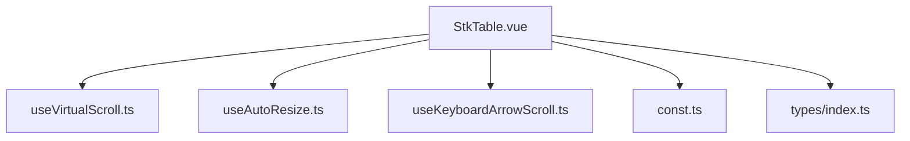
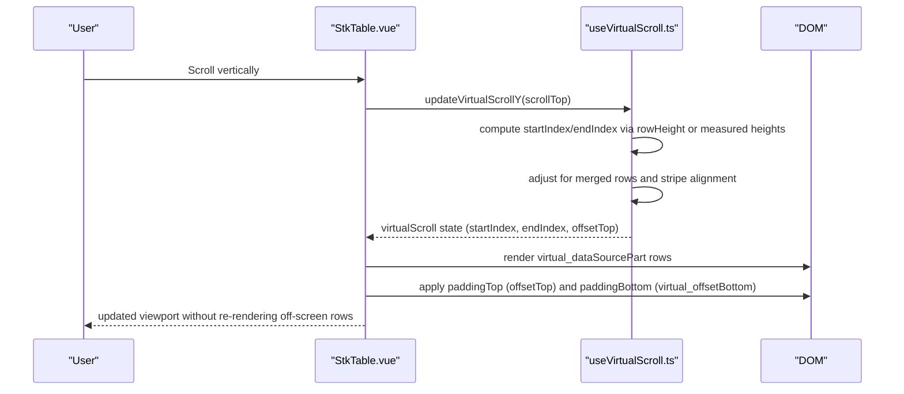
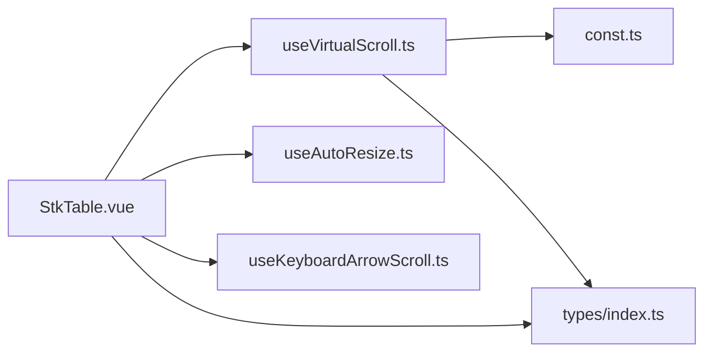

# Vertical Virtual Scrolling

<cite>
**Referenced Files in This Document**
- [useVirtualScroll.ts](file://src/StkTable/useVirtualScroll.ts)
- [StkTable.vue](file://src/StkTable/StkTable.vue)
- [types/index.ts](file://src/StkTable/types/index.ts)
- [const.ts](file://src/StkTable/const.ts)
- [useAutoResize.ts](file://src/StkTable/useAutoResize.ts)
- [useKeyboardArrowScroll.ts](file://src/StkTable/useKeyboardArrowScroll.ts)
- [virtual.md](file://docs-src/main/table/advanced/virtual.md)
- [VirtualY.vue](file://docs-demo/advanced/virtual/VirtualY.vue)
- [HugeData/index.vue](file://docs-demo/demos/HugeData/index.vue)
- [AutoHeightVirtual/index.vue](file://docs-demo/advanced/auto-height-virtual/AutoHeightVirtual/index.vue)
</cite>

## Table of Contents
1. [Introduction](#introduction)
2. [Project Structure](#project-structure)
3. [Core Components](#core-components)
4. [Architecture Overview](#architecture-overview)
5. [Detailed Component Analysis](#detailed-component-analysis)
6. [Dependency Analysis](#dependency-analysis)
7. [Performance Considerations](#performance-considerations)
8. [Troubleshooting Guide](#troubleshooting-guide)
9. [Conclusion](#conclusion)
10. [Appendices](#appendices)

## Introduction
This document explains the vertical virtual scrolling implementation in Stk Table Vue. It covers how only visible rows are rendered within the viewport, how viewport boundaries are calculated, how row heights are managed (including dynamic auto row heights), and how scroll position is tracked. It also documents configuration options, performance tuning parameters, practical examples, best practices, and integration with sorting/filtering.

## Project Structure
The vertical virtual scrolling feature is implemented in a dedicated composable and integrated into the main StkTable component. Supporting utilities handle auto-resize, keyboard navigation, and constants.

**Diagram sources**
- [StkTable.vue](file://src/StkTable/StkTable.vue#L775-L792)
- [useVirtualScroll.ts](file://src/StkTable/useVirtualScroll.ts#L60-L69)
- [useAutoResize.ts](file://src/StkTable/useAutoResize.ts#L14-L23)
- [useKeyboardArrowScroll.ts](file://src/StkTable/useKeyboardArrowScroll.ts#L32-L35)
- [const.ts](file://src/StkTable/const.ts#L1-L51)
- [types/index.ts](file://src/StkTable/types/index.ts#L54-L120)

**Section sources**
- [StkTable.vue](file://src/StkTable/StkTable.vue#L775-L792)
- [useVirtualScroll.ts](file://src/StkTable/useVirtualScroll.ts#L60-L69)
- [useAutoResize.ts](file://src/StkTable/useAutoResize.ts#L14-L23)
- [useKeyboardArrowScroll.ts](file://src/StkTable/useKeyboardArrowScroll.ts#L32-L35)
- [const.ts](file://src/StkTable/const.ts#L1-L51)
- [types/index.ts](file://src/StkTable/types/index.ts#L54-L120)

## Core Components
- useVirtualScroll: Computes viewport indices, offsets, and manages row height logic for vertical virtualization.
- StkTable.vue: Integrates virtual scrolling state, binds scroll events, renders only visible rows, and applies offsets for top/bottom padding.
- useAutoResize: Observes container size changes and reinitializes virtual scroll.
- useKeyboardArrowScroll: Handles keyboard arrow/page/Home/End navigation for virtualized tables.
- Types and constants: Define props, row/column types, defaults, and configuration options.

Key exports from useVirtualScroll include:
- virtualScroll: containerHeight, pageSize, startIndex, endIndex, rowHeight, offsetTop, scrollTop, scrollHeight
- virtual_on: computed flag indicating if virtualization is active
- virtual_dataSourcePart: computed slice of data to render
- virtual_offsetBottom: computed height for bottom spacer
- initVirtualScroll/initVirtualScrollY/initVirtualScrollX: initialization helpers
- updateVirtualScrollY/updateVirtualScrollX: viewport recalculation on scroll
- setAutoHeight/clearAllAutoHeight: dynamic row height management

**Section sources**
- [useVirtualScroll.ts](file://src/StkTable/useVirtualScroll.ts#L18-L50)
- [useVirtualScroll.ts](file://src/StkTable/useVirtualScroll.ts#L479-L496)
- [StkTable.vue](file://src/StkTable/StkTable.vue#L103-L179)
- [StkTable.vue](file://src/StkTable/StkTable.vue#L775-L792)
- [types/index.ts](file://src/StkTable/types/index.ts#L275-L278)
- [const.ts](file://src/StkTable/const.ts#L6-L8)

## Architecture Overview
The vertical virtual scrolling pipeline:

**Diagram sources**
- [StkTable.vue](file://src/StkTable/StkTable.vue#L39-L39)
- [useVirtualScroll.ts](file://src/StkTable/useVirtualScroll.ts#L273-L406)
- [StkTable.vue](file://src/StkTable/StkTable.vue#L103-L179)

## Detailed Component Analysis

### useVirtualScroll: Vertical Viewport Calculation and Rendering
Responsibilities:
- Compute page size from container height and row height
- Determine startIndex/endIndex based on scrollTop
- Manage offsetTop for top spacer and virtual_offsetBottom for bottom spacer
- Support fixed row heights and dynamic auto row heights
- Handle merged row spans and stripe alignment adjustments
- Optimize scroll updates for Vue 2 compatibility

Algorithm highlights:
- Page size calculation subtracts header row height contribution when not headless.
- For fixed row heights: startIndex = floor(scrollTop / rowHeight), endIndex = startIndex + pageSize.
- For dynamic auto row heights: iterate to accumulate row heights until viewport boundaries are met.
- Adjust startIndex/endIndex to avoid splitting merged rows.
- Apply stripe-aware correction to prevent visual misalignment.

Performance optimizations:
- Batch DOM measurements for TR elements when measuring auto row heights.
- Debounce/defer updates for downward scroll in Vue 2 to reduce churn.
- Use Map keyed by row key to cache measured auto heights.

Integration points:
- Exposes virtual_dataSourcePart to StkTable for rendering only visible rows.
- Provides virtual_offsetBottom to pad the table to match total scrollable height.

**Section sources**
- [useVirtualScroll.ts](file://src/StkTable/useVirtualScroll.ts#L204-L228)
- [useVirtualScroll.ts](file://src/StkTable/useVirtualScroll.ts#L273-L406)
- [useVirtualScroll.ts](file://src/StkTable/useVirtualScroll.ts#L326-L359)
- [useVirtualScroll.ts](file://src/StkTable/useVirtualScroll.ts#L400-L405)
- [useVirtualScroll.ts](file://src/StkTable/useVirtualScroll.ts#L240-L270)

### StkTable.vue: Rendering Visible Rows and Offsets
Behavior:
- Renders only virtual_dataSourcePart rows.
- Applies a top spacer with height equal to offsetTop and a bottom spacer with height equal to virtual_offsetBottom.
- Uses computed row indices adjusted by startIndex for accurate row numbering and selection.
- Updates custom scrollbar thumb position and handles scroll events.

Key bindings:
- @scroll triggers updateVirtualScrollY.
- v-if conditions ensure spacers are only rendered when virtualization is active and not in row-by-row scroll mode.

**Section sources**
- [StkTable.vue](file://src/StkTable/StkTable.vue#L103-L179)
- [StkTable.vue](file://src/StkTable/StkTable.vue#L1123-L1125)
- [StkTable.vue](file://src/StkTable/StkTable.vue#L39-L39)

### Dynamic Row Heights and Auto Row Height Config
- When autoRowHeight is enabled, row heights are measured from rendered TR elements and cached per row key.
- Expected height can be configured via AutoRowHeightConfig.expectedHeight (number or function).
- Expanded row height can override per-row height when expandConfig.height is provided.

Best practices:
- Prefer setting a reasonable rowHeight when possible to minimize measurement overhead.
- Use expectedHeight to reduce layout thrashing during initial render.
- Clear auto height cache when data shape changes significantly.

**Section sources**
- [useVirtualScroll.ts](file://src/StkTable/useVirtualScroll.ts#L177-L189)
- [useVirtualScroll.ts](file://src/StkTable/useVirtualScroll.ts#L240-L270)
- [types/index.ts](file://src/StkTable/types/index.ts#L275-L278)
- [StkTable.vue](file://src/StkTable/StkTable.vue#L1156-L1161)

### Scroll Position Tracking and Restoration
- scrollTop is recorded in virtualScroll and used to recalculate viewport indices.
- On mount and resize, initVirtualScroll initializes and restores scroll positions safely.
- For keyboard navigation, scrollTo is invoked with computed offsets.

Practical tips:
- Preserve scroll position across data changes by restoring scrollTop after updates.
- Use updateVirtualScrollY to programmatically jump to a specific scroll position.

**Section sources**
- [useVirtualScroll.ts](file://src/StkTable/useVirtualScroll.ts#L273-L277)
- [useVirtualScroll.ts](file://src/StkTable/useVirtualScroll.ts#L195-L228)
- [useKeyboardArrowScroll.ts](file://src/StkTable/useKeyboardArrowScroll.ts#L65-L96)

### Keyboard Navigation Support
- Requires mouse hover over the table body while virtualization is enabled.
- Supports ArrowUp/Down, ArrowLeft/Right, PageUp/Down, Home, End.
- Calculates body page size based on container height minus header height.

**Section sources**
- [useKeyboardArrowScroll.ts](file://src/StkTable/useKeyboardArrowScroll.ts#L32-L44)
- [useKeyboardArrowScroll.ts](file://src/StkTable/useKeyboardArrowScroll.ts#L65-L96)

### Integration with Sorting and Filtering
- Sorting and filtering typically alter data length or order; StkTable recomputes virtualization accordingly.
- After data updates, virtualization is reinitialized when needed to maintain correct viewport indices.
- For remote sorting, set sortRemote to true so the component does not sort locally.

**Section sources**
- [StkTable.vue](file://src/StkTable/StkTable.vue#L1039-L1064)
- [StkTable.vue](file://src/StkTable/StkTable.vue#L282-L429)

### Practical Examples and Patterns
- Large dataset demo with virtualization, sorting, and simulated live updates.
  - Example reference: [HugeData/index.vue](file://docs-demo/demos/HugeData/index.vue#L270-L293)
- Vertical virtual scrolling with fixed small height and large data.
  - Example reference: [VirtualY.vue](file://docs-demo/advanced/virtual/VirtualY.vue#L32-L32)
- Auto row height virtual table with variable content.
  - Example reference: [AutoHeightVirtual/index.vue](file://docs-demo/advanced/auto-height-virtual/AutoHeightVirtual/index.vue#L24-L34)

**Section sources**
- [HugeData/index.vue](file://docs-demo/demos/HugeData/index.vue#L270-L293)
- [VirtualY.vue](file://docs-demo/advanced/virtual/VirtualY.vue#L32-L32)
- [AutoHeightVirtual/index.vue](file://docs-demo/advanced/auto-height-virtual/AutoHeightVirtual/index.vue#L24-L34)

## Dependency Analysis

**Diagram sources**
- [StkTable.vue](file://src/StkTable/StkTable.vue#L775-L792)
- [useVirtualScroll.ts](file://src/StkTable/useVirtualScroll.ts#L1-L5)
- [useAutoResize.ts](file://src/StkTable/useAutoResize.ts#L1-L9)
- [useKeyboardArrowScroll.ts](file://src/StkTable/useKeyboardArrowScroll.ts#L1-L26)
- [const.ts](file://src/StkTable/const.ts#L1-L51)
- [types/index.ts](file://src/StkTable/types/index.ts#L1-L318)

**Section sources**
- [StkTable.vue](file://src/StkTable/StkTable.vue#L775-L792)
- [useVirtualScroll.ts](file://src/StkTable/useVirtualScroll.ts#L1-L5)
- [useAutoResize.ts](file://src/StkTable/useAutoResize.ts#L1-L9)
- [useKeyboardArrowScroll.ts](file://src/StkTable/useKeyboardArrowScroll.ts#L1-L26)
- [const.ts](file://src/StkTable/const.ts#L1-L51)
- [types/index.ts](file://src/StkTable/types/index.ts#L1-L318)

## Performance Considerations
- Prefer fixed rowHeight for predictable performance; it avoids layout reads and reduces reflow.
- Use autoRowHeight judiciously; measure only when necessary and leverage expectedHeight to minimize DOM queries.
- Enable optimizeVue2Scroll to defer updates on fast downward scrolls.
- Keep table width fixed or rely on virtualX for horizontal virtualization to avoid frequent reflows.
- Use autoResize to automatically recalculate viewport on container size changes.

[No sources needed since this section provides general guidance]

## Troubleshooting Guide
Common issues and resolutions:
- White screen or missing rows on fast scroll: Enable optimizeVue2Scroll to defer updates.
- Incorrect viewport after data length change: Call initVirtualScrollY after updating data.
- Merged rows partially visible: The algorithm adjusts startIndex/endIndex to avoid splitting merged cells; ensure mergeCells functions are deterministic.
- Keyboard navigation not working: Hover over the table body; ensure virtualization is enabled and scrollTo is available.

**Section sources**
- [useVirtualScroll.ts](file://src/StkTable/useVirtualScroll.ts#L396-L405)
- [useVirtualScroll.ts](file://src/StkTable/useVirtualScroll.ts#L326-L359)
- [useKeyboardArrowScroll.ts](file://src/StkTable/useKeyboardArrowScroll.ts#L65-L70)

## Conclusion
Stk Table Vue’s vertical virtual scrolling efficiently renders only visible rows by calculating viewport indices from scroll position, managing row heights (fixed and dynamic), and applying top/bottom spacers. With proper configuration—such as rowHeight, autoRowHeight, optimizeVue2Scroll, and autoResize—you can achieve smooth performance with large datasets while maintaining usability features like keyboard navigation, sorting, and filtering.

[No sources needed since this section summarizes without analyzing specific files]

## Appendices

### Configuration Options for Vertical Virtual Scrolling
- virtual: Enables vertical virtualization.
- virtualX: Enables horizontal virtualization (requires column widths).
- rowHeight: Base row height used when autoRowHeight is false.
- autoRowHeight: Enables dynamic row heights; supports expectedHeight configuration.
- optimizeVue2Scroll: Defers scroll updates on fast downward scrolls for Vue 2 compatibility.
- autoResize: Automatically recalculates viewport on container resize; can be disabled or customized.
- headerRowHeight: Controls header height contribution to page size calculation.
- expandConfig.height: Overrides row height for expanded rows in virtual mode.

**Section sources**
- [virtual.md](file://docs-src/main/table/advanced/virtual.md#L4-L11)
- [StkTable.vue](file://src/StkTable/StkTable.vue#L282-L429)
- [types/index.ts](file://src/StkTable/types/index.ts#L275-L278)
- [const.ts](file://src/StkTable/const.ts#L6-L8)
- [useAutoResize.ts](file://src/StkTable/useAutoResize.ts#L14-L23)

### Implementation Patterns for Large Datasets
- Use virtual with a fixed rowHeight for best performance.
- Combine virtual with sort-remote for server-side sorting to avoid local re-sorting.
- Simulate live updates with periodic data changes and highlight affected rows.
- Example references:
  - [HugeData/index.vue](file://docs-demo/demos/HugeData/index.vue#L270-L293)
  - [VirtualY.vue](file://docs-demo/advanced/virtual/VirtualY.vue#L32-L32)

**Section sources**
- [HugeData/index.vue](file://docs-demo/demos/HugeData/index.vue#L270-L293)
- [VirtualY.vue](file://docs-demo/advanced/virtual/VirtualY.vue#L32-L32)

### Best Practices for User Experience
- Provide a meaningful rowHeight to reduce layout shifts.
- Use expectedHeight to stabilize initial measurements.
- Keep keyboard navigation accessible by ensuring hover focus behavior.
- Consider stripe alignment corrections and merged row handling for visual consistency.

**Section sources**
- [useVirtualScroll.ts](file://src/StkTable/useVirtualScroll.ts#L361-L368)
- [useKeyboardArrowScroll.ts](file://src/StkTable/useKeyboardArrowScroll.ts#L32-L44)