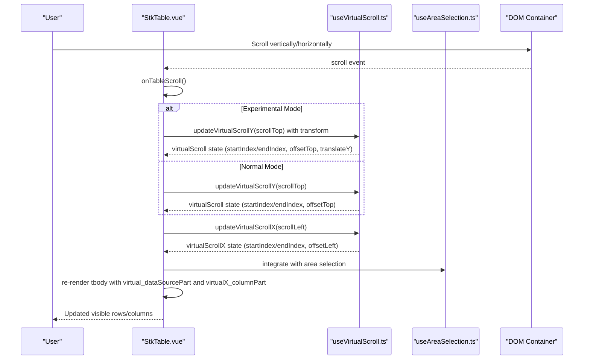
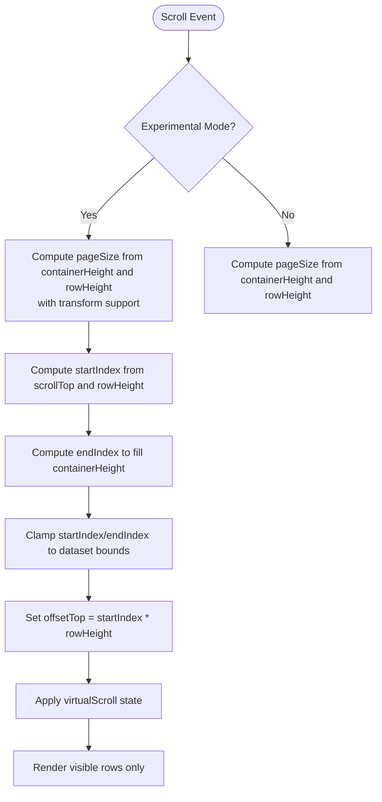
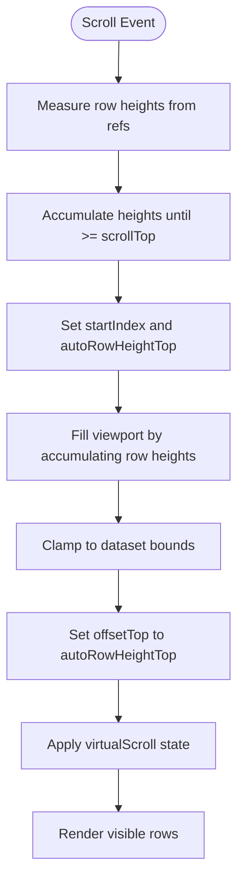
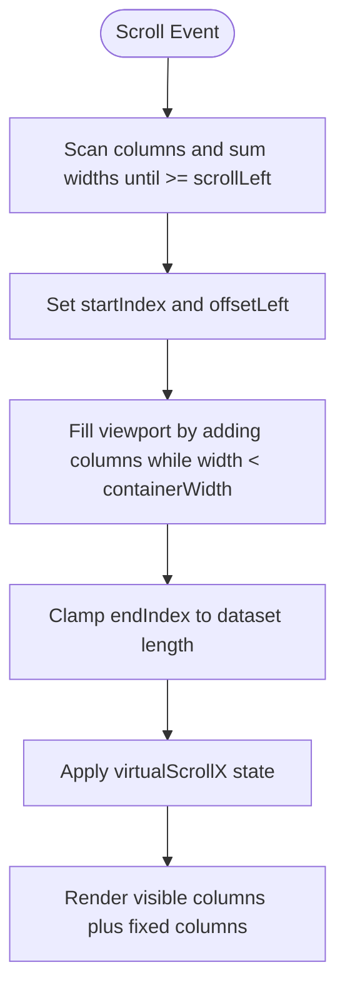
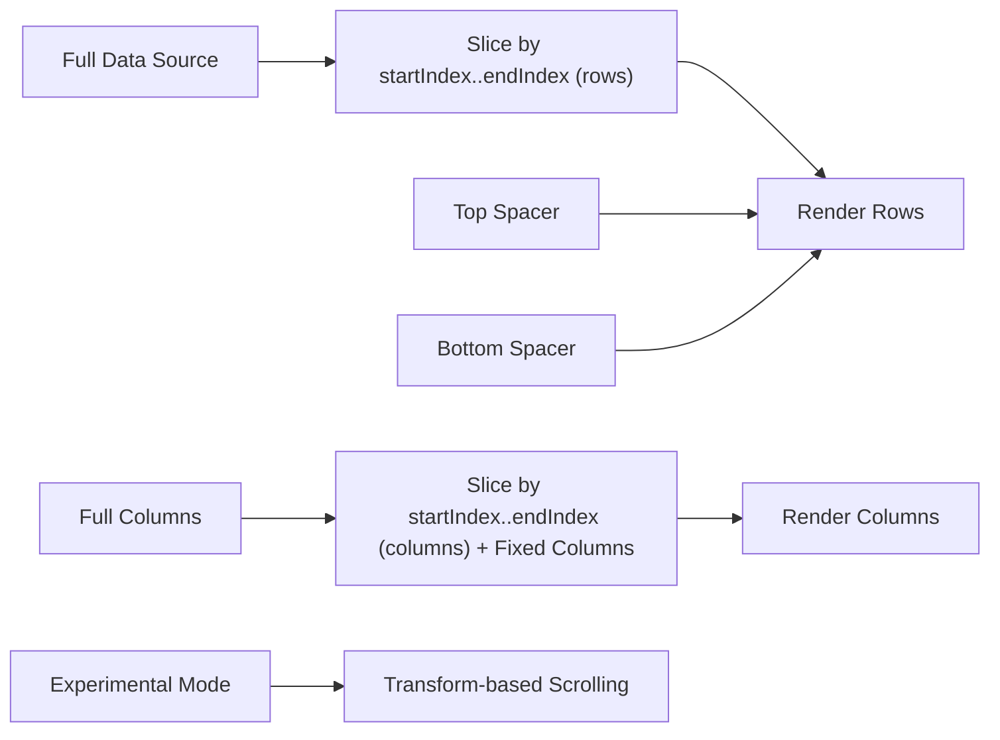
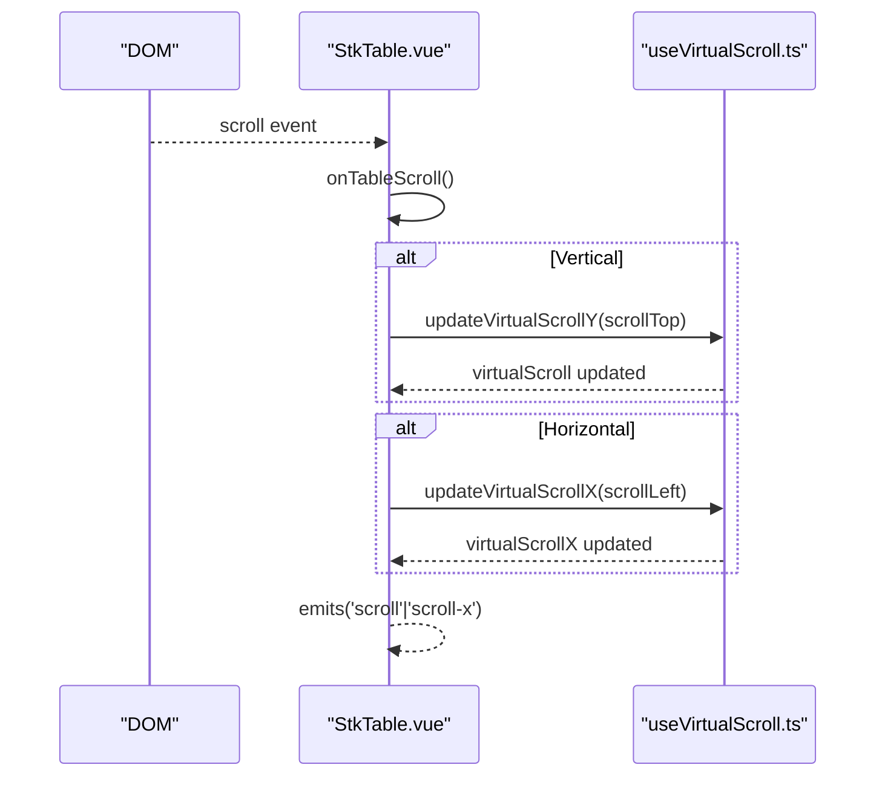
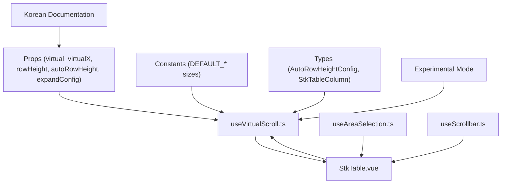

# Virtual Scrolling

<cite>
**Referenced Files in This Document**
- [useVirtualScroll.ts](file://src/StkTable/useVirtualScroll.ts)
- [StkTable.vue](file://src/StkTable/StkTable.vue)
- [types/index.ts](file://src/StkTable/types/index.ts)
- [const.ts](file://src/StkTable/const.ts)
- [virtual.md](file://docs-src/main/table/advanced/virtual.md)
- [auto-height-virtual.md](file://docs-src/main/table/advanced/auto-height-virtual.md)
- [experimental.md](file://docs-src/main/other/experimental.md)
- [optimize.md](file://docs-src/en/main/other/optimize.md)
- [VirtualY.vue](file://docs-demo/advanced/virtual/VirtualY.vue)
- [VirtualX.vue](file://docs-demo/advanced/virtual/VirtualX.vue)
- [AutoHeightVirtual/index.vue](file://docs-demo/advanced/auto-height-virtual/AutoHeightVirtual/index.vue)
- [useAreaSelection.ts](file://src/StkTable/features/useAreaSelection.ts)
- [useScrollbar.ts](file://src/StkTable/useScrollbar.ts)
- [virtual.md (Korean)](file://docs-src/ko/main/table/advanced/virtual.md)
- [auto-height-virtual.md (Korean)](file://docs-src/ko/main/table/advanced/auto-height-virtual.md)
- [experimental.md (Korean)](file://docs-src/ko/main/other/experimental.md)
</cite>

## Update Summary
**Changes Made**
- Enhanced documentation coverage with comprehensive Korean language documentation for virtual scrolling features
- Added detailed Korean documentation for auto-height virtual scrolling implementation
- Expanded Korean documentation for experimental scrollY mode with transform-based vertical scrolling
- Updated configuration options and examples to include Korean language references
- Enhanced integration documentation with Korean language examples and best practices

## Table of Contents
1. [Introduction](#introduction)
2. [Project Structure](#project-structure)
3. [Core Components](#core-components)
4. [Architecture Overview](#architecture-overview)
5. [Detailed Component Analysis](#detailed-component-analysis)
6. [Korean Documentation Enhancement](#korean-documentation-enhancement)
7. [Experimental Features](#experimental-features)
8. [Dependency Analysis](#dependency-analysis)
9. [Performance Considerations](#performance-considerations)
10. [Troubleshooting Guide](#troubleshooting-guide)
11. [Conclusion](#conclusion)
12. [Appendices](#appendices)

## Introduction
This document explains the virtual scrolling implementation in Stk Table Vue. It covers vertical virtual scrolling with fixed row heights, horizontal virtual scrolling for wide datasets, and auto-height virtual scrolling for dynamic content. It details the underlying algorithms, performance benefits, memory management, configuration options, viewport calculation, item rendering optimization, scroll position tracking, and integration with other table features. The implementation now includes comprehensive Korean language documentation covering auto-height virtual scrolling and advanced scrolling optimizations.

## Project Structure
Virtual scrolling is implemented primarily in a composable hook and integrated into the main table component. Supporting types and constants define configuration and behavior. Demo pages illustrate usage patterns for vertical, horizontal, and auto-height scenarios. The system now includes extensive Korean language documentation for enhanced international accessibility.

```mermaid
graph TB
subgraph "Virtual Scrolling Implementation"
Hook["useVirtualScroll.ts"]
Comp["StkTable.vue"]
Types["types/index.ts"]
Consts["const.ts"]
Experimental["Experimental Mode"]
End
subgraph "Documentation Demos"
DemoY["VirtualY.vue"]
DemoX["VirtualX.vue"]
DemoAH["AutoHeightVirtual/index.vue"]
DocsV["virtual.md"]
DocsAH["auto-height-virtual.md"]
DocsExp["experimental.md"]
DocsKoV["virtual.md (Korean)"]
DocsKoAH["auto-height-virtual.md (Korean)"]
DocsKoExp["experimental.md (Korean)"]
End
subgraph "Features Integration"
AreaSel["useAreaSelection.ts"]
ScrollBar["useScrollbar.ts"]
Optimize["optimize.md"]
End
Hook --> Comp
Types --> Hook
Consts --> Hook
Experimental --> Hook
DemoY --> Comp
DemoX --> Comp
DemoAH --> Comp
DocsV --> DemoY
DocsV --> DemoX
DocsAH --> DemoAH
DocsExp --> Experimental
DocsKoV --> DocsKoAH
DocsKoAH --> DocsKoExp
AreaSel --> Comp
ScrollBar --> Comp
Optimize --> Comp
```

**Diagram sources**
- [useVirtualScroll.ts:1-512](file://src/StkTable/useVirtualScroll.ts#L1-L512)
- [StkTable.vue:1-1743](file://src/StkTable/StkTable.vue#L1-L1743)
- [types/index.ts:1-318](file://src/StkTable/types/index.ts#L1-L318)
- [const.ts:1-51](file://src/StkTable/const.ts#L1-L51)
- [useAreaSelection.ts:1-777](file://src/StkTable/features/useAreaSelection.ts#L1-L777)
- [useScrollbar.ts:1-160](file://src/StkTable/useScrollbar.ts#L1-L160)
- [experimental.md:1-25](file://docs-src/main/other/experimental.md#L1-L25)
- [optimize.md:1-32](file://docs-src/en/main/other/optimize.md#L1-L32)
- [virtual.md (Korean):1-69](file://docs-src/ko/main/table/advanced/virtual.md#L1-L69)
- [auto-height-virtual.md (Korean):1-38](file://docs-src/ko/main/table/advanced/auto-height-virtual.md#L1-L38)
- [experimental.md (Korean):1-24](file://docs-src/ko/main/other/experimental.md#L1-L24)

**Section sources**
- [useVirtualScroll.ts:1-512](file://src/StkTable/useVirtualScroll.ts#L1-L512)
- [StkTable.vue:1-1743](file://src/StkTable/StkTable.vue#L1-L1743)
- [types/index.ts:1-318](file://src/StkTable/types/index.ts#L1-L318)
- [const.ts:1-51](file://src/StkTable/const.ts#L1-L51)
- [virtual.md:1-70](file://docs-src/main/table/advanced/virtual.md#L1-L70)
- [auto-height-virtual.md:1-38](file://docs-src/main/table/advanced/auto-height-virtual.md#L1-L38)
- [experimental.md:1-25](file://docs-src/main/other/experimental.md#L1-L25)
- [virtual.md (Korean):1-69](file://docs-src/ko/main/table/advanced/virtual.md#L1-L69)
- [auto-height-virtual.md (Korean):1-38](file://docs-src/ko/main/table/advanced/auto-height-virtual.md#L1-L38)
- [experimental.md (Korean):1-24](file://docs-src/ko/main/other/experimental.md#L1-L24)

## Core Components
- Virtual scrolling composable: Computes viewport bounds, manages offsets, tracks scroll positions, and optimizes updates for both Y and X axes with experimental mode support.
- Main table component: Wires scroll events, exposes initialization APIs, renders only visible items, and integrates with fixed columns, merged cells, area selection, and other features.
- Types and constants: Define configuration shapes, defaults, and shared constants for row/column sizing and behavior.
- Experimental features: Transform-based vertical scrolling simulation and enhanced area selection integration.
- Korean language documentation: Comprehensive Korean documentation covering auto-height virtual scrolling, configuration options, and advanced optimizations.

Key responsibilities:
- Vertical virtual scrolling: Determines visible rows based on scroll position and row height; handles auto-height and expanded row height overrides with experimental mode support.
- Horizontal virtual scrolling: Determines visible columns based on scrollLeft and cumulative widths; preserves fixed columns visibility.
- Auto-height virtual scrolling: Stores measured row heights and expected heights to compute viewport accurately.
- Experimental scrollY: Uses transform-based scrolling to simulate vertical scrolling for extremely large datasets.
- Korean localization: Provides complete Korean language support for all virtual scrolling documentation and examples.

**Section sources**
- [useVirtualScroll.ts:60-512](file://src/StkTable/useVirtualScroll.ts#L60-L512)
- [StkTable.vue:771-788](file://src/StkTable/StkTable.vue#L771-L788)
- [types/index.ts:275-278](file://src/StkTable/types/index.ts#L275-L278)
- [const.ts:6-8](file://src/StkTable/const.ts#L6-L8)
- [experimental.md:5-9](file://docs-src/main/other/experimental.md#L5-L9)
- [virtual.md (Korean):4-11](file://docs-src/ko/main/table/advanced/virtual.md#L4-L11)
- [auto-height-virtual.md (Korean):3-7](file://docs-src/ko/main/table/advanced/auto-height-virtual.md#L3-L7)

## Architecture Overview
The virtual scrolling pipeline connects DOM scroll events to viewport calculations and reactive re-rendering, with enhanced support for experimental features and area selection integration. The system now includes comprehensive Korean language documentation for better international accessibility.



**Diagram sources**
- [StkTable.vue:1434-1470](file://src/StkTable/StkTable.vue#L1434-L1470)
- [useVirtualScroll.ts:269-420](file://src/StkTable/useVirtualScroll.ts#L269-L420)
- [useVirtualScroll.ts:427-491](file://src/StkTable/useVirtualScroll.ts#L427-L491)
- [useAreaSelection.ts:660-721](file://src/StkTable/features/useAreaSelection.ts#L660-L721)

**Section sources**
- [StkTable.vue:1434-1470](file://src/StkTable/StkTable.vue#L1434-L1470)
- [useVirtualScroll.ts:269-420](file://src/StkTable/useVirtualScroll.ts#L269-L420)
- [useVirtualScroll.ts:427-491](file://src/StkTable/useVirtualScroll.ts#L427-L491)
- [useAreaSelection.ts:660-721](file://src/StkTable/features/useAreaSelection.ts#L660-L721)

## Detailed Component Analysis

### Vertical Virtual Scrolling (Fixed Row Heights)
Behavior:
- Computes page size based on container height and row height.
- Derives startIndex and endIndex from scrollTop and row height.
- Applies offsets to pad the top and bottom to match total dataset height.
- Optimizes scroll updates for Vue 2 compatibility by deferring updates when scrolling down quickly.
- Supports experimental scrollY mode with transform-based scrolling.



**Diagram sources**
- [useVirtualScroll.ts:205-224](file://src/StkTable/useVirtualScroll.ts#L205-L224)
- [useVirtualScroll.ts:318-321](file://src/StkTable/useVirtualScroll.ts#L318-L321)
- [useVirtualScroll.ts:370-388](file://src/StkTable/useVirtualScroll.ts#L370-L388)

**Section sources**
- [useVirtualScroll.ts:205-224](file://src/StkTable/useVirtualScroll.ts#L205-L224)
- [useVirtualScroll.ts:318-321](file://src/StkTable/useVirtualScroll.ts#L318-L321)
- [useVirtualScroll.ts:370-388](file://src/StkTable/useVirtualScroll.ts#L370-L388)

### Vertical Virtual Scrolling (Auto Height)
Behavior:
- Measures actual row heights via refs when auto height is enabled.
- Sums row heights cumulatively to locate startIndex and endIndex for the viewport.
- Respects expected height configuration and expanded row height overrides.
- Maintains stripe alignment by adjusting to even indices when needed.
- Supports experimental scrollY mode with transform-based scrolling.



**Diagram sources**
- [useVirtualScroll.ts:291-317](file://src/StkTable/useVirtualScroll.ts#L291-L317)
- [useVirtualScroll.ts:293-297](file://src/StkTable/useVirtualScroll.ts#L293-L297)
- [useVirtualScroll.ts:358-365](file://src/StkTable/useVirtualScroll.ts#L358-L365)
- [useVirtualScroll.ts:380-388](file://src/StkTable/useVirtualScroll.ts#L380-L388)

**Section sources**
- [useVirtualScroll.ts:291-317](file://src/StkTable/useVirtualScroll.ts#L291-L317)
- [useVirtualScroll.ts:293-297](file://src/StkTable/useVirtualScroll.ts#L293-L297)
- [useVirtualScroll.ts:358-365](file://src/StkTable/useVirtualScroll.ts#L358-L365)
- [useVirtualScroll.ts:380-388](file://src/StkTable/useVirtualScroll.ts#L380-L388)
- [types/index.ts:275-278](file://src/StkTable/types/index.ts#L275-L278)

### Horizontal Virtual Scrolling
Behavior:
- Computes visible columns by scanning cumulative widths until reaching scrollLeft.
- Preserves fixed-left and fixed-right columns outside the visible range.
- Updates startIndex, endIndex, and offsetLeft; applies Vue 2 optimization for rightward scrolls.



**Diagram sources**
- [useVirtualScroll.ts:427-491](file://src/StkTable/useVirtualScroll.ts#L427-L491)
- [useVirtualScroll.ts:134-163](file://src/StkTable/useVirtualScroll.ts#L134-L163)

**Section sources**
- [useVirtualScroll.ts:427-491](file://src/StkTable/useVirtualScroll.ts#L427-L491)
- [useVirtualScroll.ts:134-163](file://src/StkTable/useVirtualScroll.ts#L134-L163)

### Viewport Calculation and Rendering Optimization
- The table computes a partial data source slice for rows and a partial column set for columns.
- Top and bottom spacer rows adjust layout to reflect full dataset height.
- The component watches props and data changes to reinitialize virtualization when needed.
- Enhanced with experimental mode support for transform-based scrolling.



**Diagram sources**
- [useVirtualScroll.ts:104-108](file://src/StkTable/useVirtualScroll.ts#L104-L108)
- [useVirtualScroll.ts:134-163](file://src/StkTable/useVirtualScroll.ts#L134-L163)
- [useVirtualScroll.ts:110-125](file://src/StkTable/useVirtualScroll.ts#L110-L125)
- [useVirtualScroll.ts:204-206](file://src/StkTable/useVirtualScroll.ts#L204-L206)

**Section sources**
- [useVirtualScroll.ts:104-108](file://src/StkTable/useVirtualScroll.ts#L104-L108)
- [useVirtualScroll.ts:134-163](file://src/StkTable/useVirtualScroll.ts#L134-L163)
- [useVirtualScroll.ts:110-125](file://src/StkTable/useVirtualScroll.ts#L110-L125)

### Scroll Position Tracking and Events
- The scroll handler reads scrollTop and scrollLeft, compares with cached values, and updates virtual state.
- Emits scroll-related events for downstream integrations.
- Enhanced with experimental mode support for transform-based scrolling.



**Diagram sources**
- [StkTable.vue:1434-1470](file://src/StkTable/StkTable.vue#L1434-L1470)
- [useVirtualScroll.ts:269-420](file://src/StkTable/useVirtualScroll.ts#L269-L420)
- [useVirtualScroll.ts:427-491](file://src/StkTable/useVirtualScroll.ts#L427-L491)

**Section sources**
- [StkTable.vue:1434-1470](file://src/StkTable/StkTable.vue#L1434-L1470)
- [useVirtualScroll.ts:269-420](file://src/StkTable/useVirtualScroll.ts#L269-L420)
- [useVirtualScroll.ts:427-491](file://src/StkTable/useVirtualScroll.ts#L427-L491)

### Integration With Other Features
- Fixed columns: Ensures fixed-left/right columns remain visible during horizontal virtualization.
- Merged cells: Coordinates with merged cell logic to avoid rendering issues in virtualized rows.
- Expandable rows: Adjusts row height expectations and rendering when expanded content is present.
- Keyboard arrow scrolling: Integrates with arrow scroll utility to maintain virtualized viewport during keyboard navigation.
- Area selection: Enhanced integration with area selection features for better scrolling behavior.
- Experimental scrollY: Seamless integration with transform-based scrolling mode.

**Section sources**
- [useVirtualScroll.ts:134-163](file://src/StkTable/useVirtualScroll.ts#L134-L163)
- [useVirtualScroll.ts:184-189](file://src/StkTable/useVirtualScroll.ts#L184-L189)
- [StkTable.vue:821-828](file://src/StkTable/StkTable.vue#L821-L828)
- [useAreaSelection.ts:660-721](file://src/StkTable/features/useAreaSelection.ts#L660-L721)

## Korean Documentation Enhancement

### Comprehensive Korean Language Coverage
The virtual scrolling system now includes comprehensive Korean language documentation covering all aspects of virtual scrolling implementation, configuration, and optimization. This enhancement ensures better accessibility for Korean-speaking developers and provides localized guidance for implementing virtual scrolling features.

**Key Korean Documentation Areas:**
- Auto-height virtual scrolling configuration and implementation details
- Experimental scrollY mode with transform-based vertical scrolling
- Complete property documentation in Korean
- Practical examples and usage patterns
- Performance optimization guidelines tailored for Korean development teams

**Section sources**
- [virtual.md (Korean):1-69](file://docs-src/ko/main/table/advanced/virtual.md#L1-L69)
- [auto-height-virtual.md (Korean):1-38](file://docs-src/ko/main/table/advanced/auto-height-virtual.md#L1-L38)
- [experimental.md (Korean):1-24](file://docs-src/ko/main/other/experimental.md#L1-L24)

### Korean Auto-Height Virtual Scrolling Documentation
The Korean documentation provides detailed guidance for implementing auto-height virtual scrolling with comprehensive configuration options and examples. Developers can now access complete documentation in Korean for setting up expected row heights, configuring auto-row-height properties, and optimizing performance for variable content heights.

**Korean Documentation Highlights:**
- AutoRowHeightConfig interface documentation in Korean
- Expected height configuration examples
- CSS variable customization guidance
- Single column list implementation details
- Priority handling between expectedHeight and rowHeight

**Section sources**
- [auto-height-virtual.md (Korean):9-22](file://docs-src/ko/main/table/advanced/auto-height-virtual.md#L9-L22)
- [auto-height-virtual.md (Korean):29-34](file://docs-src/ko/main/table/advanced/auto-height-virtual.md#L29-L34)

### Korean Experimental Features Documentation
The Korean documentation includes comprehensive coverage of experimental features, particularly the scrollY mode with transform-based vertical scrolling. This documentation provides Korean-language guidance for implementing advanced scrolling optimizations and handling extremely large datasets.

**Korean Experimental Documentation Features:**
- Transform-based vertical scrolling simulation explanation
- Configuration examples with Korean comments
- Performance benefits and use cases
- Integration considerations with other features
- Troubleshooting guidance in Korean

**Section sources**
- [experimental.md (Korean):5-23](file://docs-src/ko/main/other/experimental.md#L5-L23)

## Experimental Features

### Experimental ScrollY Mode
The experimental scrollY feature provides transform-based vertical scrolling simulation for extremely large datasets where DOM element height limitations may cause issues.

**Key Features:**
- Transform-based vertical scrolling simulation
- DOM scrollTop always remains at 0 (simulated via transform)
- Enhanced performance for very large datasets
- Smooth scrolling experience with reduced DOM manipulation

**Configuration:**
```javascript
<StkTable
  virtual
  scroll-row-by-row
  :experimental="{ scrollY: true }"
  :data-source="dataSource"
  :columns="columns"
/>
```

**Benefits:**
- Solves DOM element height limitations for massive datasets
- Reduces memory usage by avoiding extremely tall DOM trees
- Provides smooth scrolling experience through transform manipulation
- Maintains virtual scrolling performance characteristics

**Section sources**
- [experimental.md:5-23](file://docs-src/main/other/experimental.md#L5-L23)
- [useVirtualScroll.ts:204-206](file://src/StkTable/useVirtualScroll.ts#L204-L206)
- [useVirtualScroll.ts:282-286](file://src/StkTable/useVirtualScroll.ts#L282-L286)
- [StkTable.vue:1402-1404](file://src/StkTable/StkTable.vue#L1402-L1404)

## Dependency Analysis
Virtual scrolling depends on:
- Props controlling virtualization modes and row height expectations.
- Computed header heights and column widths.
- Refs to container and row elements for measurements.
- Utility functions for column width calculation and merging.
- Experimental mode support for enhanced performance.
- Area selection integration for comprehensive feature set.



**Diagram sources**
- [useVirtualScroll.ts:6-69](file://src/StkTable/useVirtualScroll.ts#L6-L69)
- [const.ts:6-8](file://src/StkTable/const.ts#L6-L8)
- [types/index.ts:275-278](file://src/StkTable/types/index.ts#L275-L278)
- [StkTable.vue:278-476](file://src/StkTable/StkTable.vue#L278-L476)
- [useAreaSelection.ts:20-23](file://src/StkTable/features/useAreaSelection.ts#L20-L23)
- [useScrollbar.ts:23-31](file://src/StkTable/useScrollbar.ts#L23-L31)

**Section sources**
- [useVirtualScroll.ts:6-69](file://src/StkTable/useVirtualScroll.ts#L6-L69)
- [const.ts:6-8](file://src/StkTable/const.ts#L6-L8)
- [types/index.ts:275-278](file://src/StkTable/types/index.ts#L275-L278)
- [StkTable.vue:278-476](file://src/StkTable/StkTable.vue#L278-L476)
- [useAreaSelection.ts:20-23](file://src/StkTable/features/useAreaSelection.ts#L20-L23)
- [useScrollbar.ts:23-31](file://src/StkTable/useScrollbar.ts#L23-L31)

## Performance Considerations
- Rendering cost: Only visible rows and columns are rendered, dramatically reducing DOM nodes and layout work.
- Memory footprint: Maintains minimal state for viewport and offsets; measured heights are cached per row key.
- Scroll responsiveness: Vue 2 optimization defers updates on fast downward scrolls to reduce churn.
- Resize handling: Automatic recalculation via ResizeObserver/onresize ensures accurate viewport after layout changes.
- Experimental mode: Transform-based scrolling reduces DOM manipulation overhead for very large datasets.
- Area selection integration: Optimized scrolling behavior when combined with area selection features.
- Edge case handling: Improved scroll position restoration and boundary condition handling.
- Korean documentation optimization: Localized documentation improves developer productivity and reduces implementation errors.

## Troubleshooting Guide
Common issues and resolutions:
- Scroll position restoration: Use the exposed scrollTo API to restore scrollTop/left after data changes or layout shifts.
- Keyboard navigation: Ensure arrow scroll integration is active; it maintains virtualized viewport during arrow key scrolling.
- Mixed fixed and merged rows: Virtualization accounts for max row spans; verify merged cells do not exceed viewport assumptions.
- Auto height measurement: If row heights change dynamically, call setAutoHeight or clearAllAutoHeight to refresh cached heights.
- Horizontal virtualization with multi-level headers: Multi-level headers are not supported with virtualX; flatten headers or disable virtualX.
- Experimental mode issues: Ensure experimental.scrollY is properly configured; transform-based scrolling requires different scroll handling.
- Area selection conflicts: When using experimental mode with area selection, ensure proper integration for smooth scrolling behavior.
- Performance optimization: Use the provided optimization techniques including tr layering and highlight frame rate adjustment.
- Korean documentation access: Utilize the comprehensive Korean language documentation for localized troubleshooting guidance.

**Section sources**
- [StkTable.vue:1570-1581](file://src/StkTable/StkTable.vue#L1570-L1581)
- [StkTable.vue:821-828](file://src/StkTable/StkTable.vue#L821-L828)
- [useVirtualScroll.ts:323-356](file://src/StkTable/useVirtualScroll.ts#L323-L356)
- [useVirtualScroll.ts:243-253](file://src/StkTable/useVirtualScroll.ts#L243-L253)
- [StkTable.vue:965-967](file://src/StkTable/StkTable.vue#L965-L967)
- [optimize.md:1-32](file://docs-src/en/main/other/optimize.md#L1-L32)

## Conclusion
Stk Table Vue's virtual scrolling delivers significant performance improvements for large datasets by rendering only visible items, maintaining accurate viewport calculations, and integrating seamlessly with fixed columns, merged cells, expandable rows, and area selection features. The addition of experimental scrollY mode with transform-based scrolling provides enhanced performance for extremely large datasets, while improved edge case handling ensures reliable scroll position restoration and boundary condition management. With configurable row heights, optimized scroll handling, and comprehensive integration capabilities, it supports diverse UX needs while keeping memory usage low and responsiveness high. The enhanced Korean language documentation further improves accessibility and developer experience for international development teams.

## Appendices

### Configuration Options
- Vertical virtualization: Enable via prop and optionally set rowHeight or autoRowHeight.
- Horizontal virtualization: Enable via prop and ensure each column has width configured.
- Auto height: Configure expectedHeight or a function to estimate row height.
- Experimental scrollY: Enable transform-based vertical scrolling for large datasets.
- Area selection: Enhanced integration with area selection features for comprehensive functionality.
- Korean localization: Complete Korean language documentation for all configuration options and examples.

**Section sources**
- [virtual.md:4-11](file://docs-src/main/table/advanced/virtual.md#L4-L11)
- [auto-height-virtual.md:3-7](file://docs-src/main/table/advanced/auto-height-virtual.md#L3-L7)
- [experimental.md:5-23](file://docs-src/main/other/experimental.md#L5-L23)
- [types/index.ts:275-278](file://src/StkTable/types/index.ts#L275-L278)
- [virtual.md (Korean):4-11](file://docs-src/ko/main/table/advanced/virtual.md#L4-L11)
- [auto-height-virtual.md (Korean):3-7](file://docs-src/ko/main/table/advanced/auto-height-virtual.md#L3-L7)

### Practical Examples
- Vertical virtual scrolling with many rows: See demo usage.
- Horizontal virtual scrolling with many columns: See demo usage.
- Auto height virtual scrolling with variable content: See demo usage.
- Experimental scrollY mode with large datasets: See experimental documentation.
- Area selection with virtual scrolling: See area selection documentation.
- Korean language examples: Comprehensive Korean documentation with localized examples and best practices.

**Section sources**
- [VirtualY.vue:1-34](file://docs-demo/advanced/virtual/VirtualY.vue#L1-L34)
- [VirtualX.vue:1-29](file://docs-demo/advanced/virtual/VirtualX.vue#L1-L29)
- [AutoHeightVirtual/index.vue:1-42](file://docs-demo/advanced/auto-height-virtual/AutoHeightVirtual/index.vue#L1-L42)
- [experimental.md:11-23](file://docs-src/main/other/experimental.md#L11-L23)
- [virtual.md (Korean):18-21](file://docs-src/ko/main/table/advanced/virtual.md#L18-L21)
- [auto-height-virtual.md (Korean):25-27](file://docs-src/ko/main/table/advanced/auto-height-virtual.md#L25-L27)

### Performance Optimization Guidelines
- Use tr layering for complex custom cells and highlight animations.
- Configure highlight frame rates appropriately to balance visual quality and performance.
- Consider experimental scrollY mode for datasets exceeding DOM height limitations.
- Implement proper edge case handling for scroll position restoration.
- Monitor and adjust virtual scrolling parameters based on dataset characteristics.
- Utilize Korean documentation for localized optimization guidance and best practices.

**Section sources**
- [optimize.md:1-32](file://docs-src/en/main/other/optimize.md#L1-L32)
- [useVirtualScroll.ts:204-206](file://src/StkTable/useVirtualScroll.ts#L204-L206)
- [useAreaSelection.ts:660-721](file://src/StkTable/features/useAreaSelection.ts#L660-L721)
- [experimental.md (Korean):5-9](file://docs-src/ko/main/other/experimental.md#L5-L9)