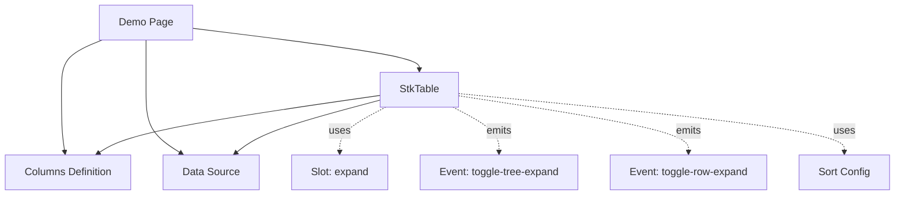
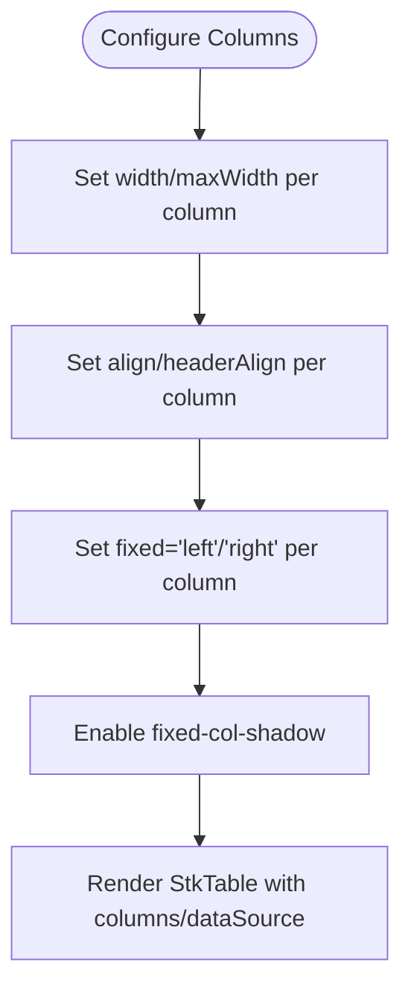
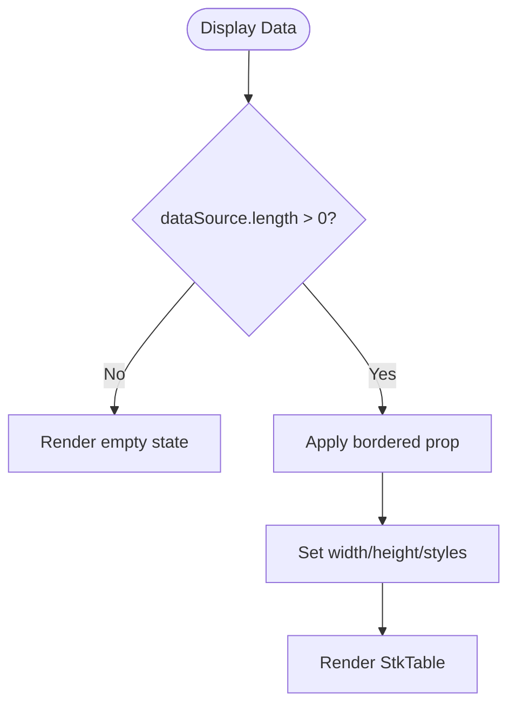
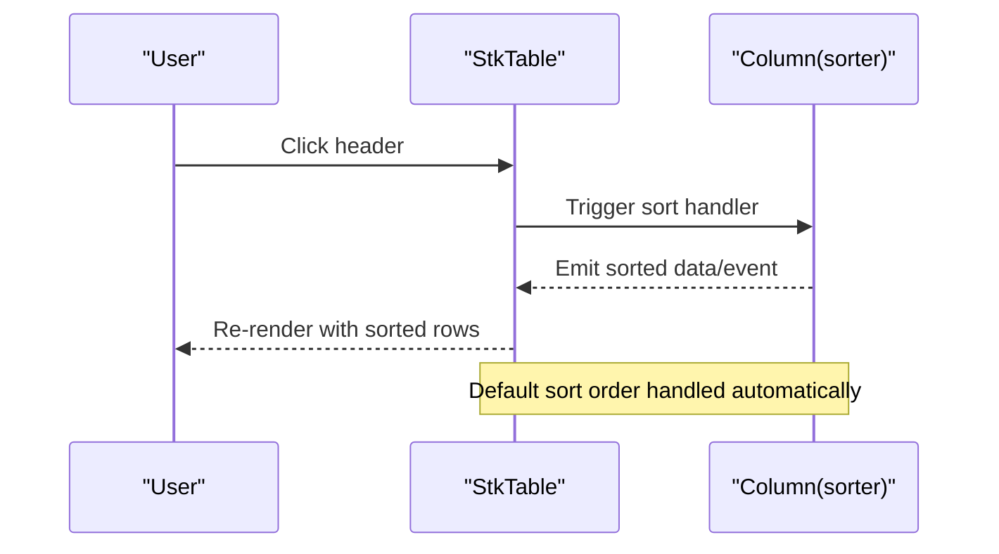
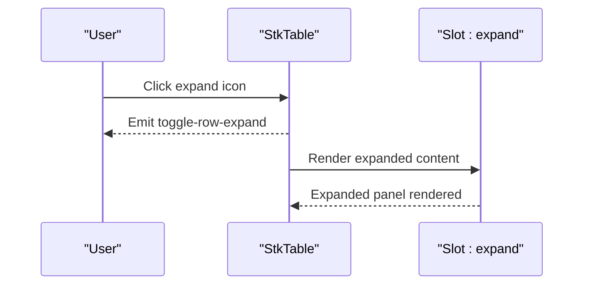
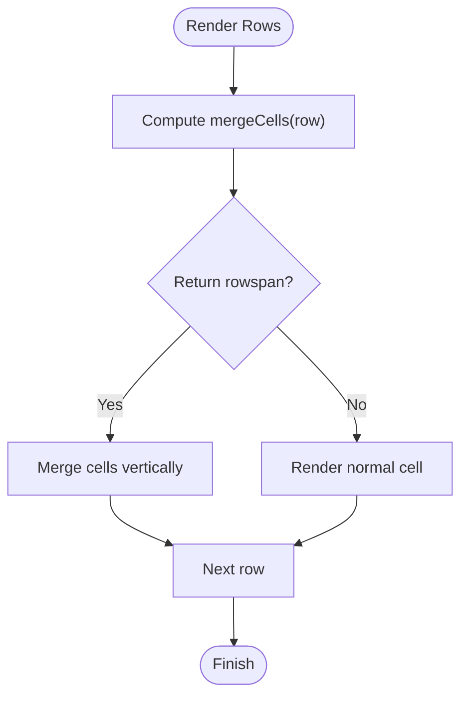
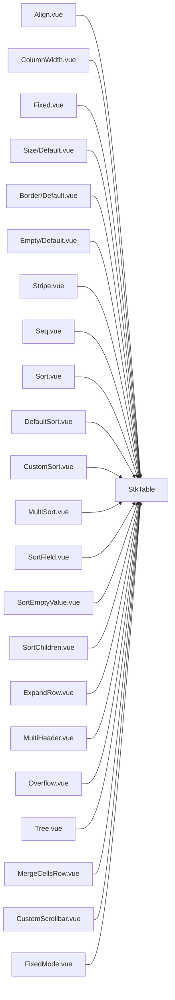

# Basic Features

<cite>
**Referenced Files in This Document**
- [Align.vue](file://docs-demo/basic/align/Align.vue)
- [ColumnWidth.vue](file://docs-demo/basic/column-width/ColumnWidth.vue)
- [Fixed.vue](file://docs-demo/basic/fixed/Fixed.vue)
- [Default.vue (Size)](file://docs-demo/basic/size/Default.vue)
- [Default.vue (Border)](file://docs-demo/basic/border/Default.vue)
- [Default.vue (Empty)](file://docs-demo/basic/empty/Default.vue)
- [Stripe.vue](file://docs-demo/basic/stripe/Stripe.vue)
- [Seq.vue](file://docs-demo/basic/seq/Seq.vue)
- [Sort.vue](file://docs-demo/basic/sort/Sort.vue)
- [DefaultSort.vue](file://docs-demo/basic/sort/DefaultSort.vue)
- [CustomSort.vue](file://docs-demo/basic/sort/CustomSort.vue)
- [MultiSort.vue](file://docs-demo/basic/sort/MultiSort.vue)
- [SortField.vue](file://docs-demo/basic/sort/SortField.vue)
- [SortEmptyValue.vue](file://docs-demo/basic/sort/SortEmptyValue.vue)
- [SortChildren.vue](file://docs-demo/basic/sort/SortChildren.vue)
- [ExpandRow.vue](file://docs-demo/basic/expand-row/ExpandRow.vue)
- [MultiHeader.vue](file://docs-demo/basic/multi-header/MultiHeader.vue)
- [Overflow.vue](file://docs-demo/basic/overflow/Overflow.vue)
- [Tree.vue](file://docs-demo/basic/tree/Tree.vue)
- [MergeCellsRow.vue](file://docs-demo/basic/merge-cells/MergeCellsRow.vue)
- [CustomScrollbar.vue](file://docs-demo/basic/scrollbar-style/CustomScrollbar.vue)
- [FixedMode.vue](file://docs-demo/basic/fixed-mode/FixedMode.vue)
</cite>

## Update Summary
**Changes Made**
- Updated DefaultSort demo component documentation to reflect corrected default sort order from 'desc' to 'asc'
- Enhanced sorting behavior demonstration with improved default sort configuration examples
- Added comprehensive coverage of sorting configuration options including defaultSort, multiSort, and custom sort functions

## Table of Contents
1. [Introduction](#introduction)
2. [Project Structure](#project-structure)
3. [Core Components](#core-components)
4. [Architecture Overview](#architecture-overview)
5. [Detailed Component Analysis](#detailed-component-analysis)
6. [Dependency Analysis](#dependency-analysis)
7. [Performance Considerations](#performance-considerations)
8. [Troubleshooting Guide](#troubleshooting-guide)
9. [Conclusion](#conclusion)

## Introduction
This document focuses on the basic features of Stk Table Vue, showcasing how to configure columns, manage widths and alignments, fix columns, display borders and empty states, enable sorting, sequence numbering, stripes, expandable rows, multi-level headers, overflow handling, tree data structures, merging cells, and customizing scrollbars. Practical examples are drawn from the demo suite to illustrate configuration options and typical use cases.

## Project Structure
The basic features are demonstrated across dedicated demo pages under docs-demo/basic. Each page demonstrates a single capability with minimal, focused examples. The StkTable component is reused across demos, configured via props and slots.

```mermaid
graph TB
subgraph "Basic Features Demos"
A["align/Align.vue"]
B["column-width/ColumnWidth.vue"]
C["fixed/Fixed.vue"]
D["size/Default.vue"]
E["border/Default.vue"]
F["empty/Default.vue"]
G["stripe/Stripe.vue"]
H["seq/Seq.vue"]
I["sort/Sort.vue"]
J["sort/DefaultSort.vue"]
K["sort/CustomSort.vue"]
L["sort/MultiSort.vue"]
M["sort/SortField.vue"]
N["sort/SortEmptyValue.vue"]
O["sort/SortChildren.vue"]
P["expand-row/ExpandRow.vue"]
Q["multi-header/MultiHeader.vue"]
R["overflow/Overflow.vue"]
S["tree/Tree.vue"]
T["merge-cells/MergeCellsRow.vue"]
U["scrollbar-style/CustomScrollbar.vue"]
V["fixed-mode/FixedMode.vue"]
end
A --> W["StkTable"]
B --> W
C --> W
D --> W
E --> W
F --> W
G --> W
H --> W
I --> W
J --> W
K --> W
L --> W
M --> W
N --> W
O --> W
P --> W
Q --> W
R --> W
S --> W
T --> W
U --> W
V --> W
```

**Diagram sources**
- [Align.vue:1-51](file://docs-demo/basic/align/Align.vue#L1-L51)
- [ColumnWidth.vue:1-46](file://docs-demo/basic/column-width/ColumnWidth.vue#L1-L46)
- [Fixed.vue:1-74](file://docs-demo/basic/fixed/Fixed.vue#L1-L74)
- [Default.vue (Size):1-59](file://docs-demo/basic/size/Default.vue#L1-L59)
- [Default.vue (Border):1-65](file://docs-demo/basic/border/Default.vue#L1-L65)
- [Default.vue (Empty):1-21](file://docs-demo/basic/empty/Default.vue#L1-L21)
- [Stripe.vue:1-25](file://docs-demo/basic/stripe/Stripe.vue#L1-L25)
- [Seq.vue:1-31](file://docs-demo/basic/seq/Seq.vue#L1-L31)
- [Sort.vue:1-40](file://docs-demo/basic/sort/Sort.vue#L1-L40)
- [DefaultSort.vue:1-44](file://docs-demo/basic/sort/DefaultSort.vue#L1-L44)
- [CustomSort.vue:1-50](file://docs-demo/basic/sort/CustomSort.vue#L1-L50)
- [MultiSort.vue:1-100](file://docs-demo/basic/sort/MultiSort.vue#L1-L100)
- [SortField.vue:1-49](file://docs-demo/basic/sort/SortField.vue#L1-L49)
- [SortEmptyValue.vue:1-37](file://docs-demo/basic/sort/SortEmptyValue.vue#L1-L37)
- [SortChildren.vue:1-19](file://docs-demo/basic/sort/SortChildren.vue#L1-L19)
- [ExpandRow.vue:1-55](file://docs-demo/basic/expand-row/ExpandRow.vue#L1-L55)
- [MultiHeader.vue:1-78](file://docs-demo/basic/multi-header/MultiHeader.vue#L1-L78)
- [Overflow.vue:1-73](file://docs-demo/basic/overflow/Overflow.vue#L1-L73)
- [Tree.vue:1-17](file://docs-demo/basic/tree/Tree.vue#L1-L17)
- [MergeCellsRow.vue:1-74](file://docs-demo/basic/merge-cells/MergeCellsRow.vue#L1-L74)
- [CustomScrollbar.vue:1-87](file://docs-demo/basic/scrollbar-style/CustomScrollbar.vue#L1-L87)
- [FixedMode.vue:1-46](file://docs-demo/basic/fixed-mode/FixedMode.vue#L1-L46)

**Section sources**
- [Align.vue:1-51](file://docs-demo/basic/align/Align.vue#L1-L51)
- [ColumnWidth.vue:1-46](file://docs-demo/basic/column-width/ColumnWidth.vue#L1-L46)
- [Fixed.vue:1-74](file://docs-demo/basic/fixed/Fixed.vue#L1-L74)
- [Default.vue (Size):1-59](file://docs-demo/basic/size/Default.vue#L1-L59)
- [Default.vue (Border):1-65](file://docs-demo/basic/border/Default.vue#L1-L65)
- [Default.vue (Empty):1-21](file://docs-demo/basic/empty/Default.vue#L1-L21)
- [Stripe.vue:1-25](file://docs-demo/basic/stripe/Stripe.vue#L1-L25)
- [Seq.vue:1-31](file://docs-demo/basic/seq/Seq.vue#L1-L31)
- [Sort.vue:1-40](file://docs-demo/basic/sort/Sort.vue#L1-L40)
- [DefaultSort.vue:1-44](file://docs-demo/basic/sort/DefaultSort.vue#L1-L44)
- [CustomSort.vue:1-50](file://docs-demo/basic/sort/CustomSort.vue#L1-L50)
- [MultiSort.vue:1-100](file://docs-demo/basic/sort/MultiSort.vue#L1-L100)
- [SortField.vue:1-49](file://docs-demo/basic/sort/SortField.vue#L1-L49)
- [SortEmptyValue.vue:1-37](file://docs-demo/basic/sort/SortEmptyValue.vue#L1-L37)
- [SortChildren.vue:1-19](file://docs-demo/basic/sort/SortChildren.vue#L1-L19)
- [ExpandRow.vue:1-55](file://docs-demo/basic/expand-row/ExpandRow.vue#L1-L55)
- [MultiHeader.vue:1-78](file://docs-demo/basic/multi-header/MultiHeader.vue#L1-L78)
- [Overflow.vue:1-73](file://docs-demo/basic/overflow/Overflow.vue#L1-L73)
- [Tree.vue:1-17](file://docs-demo/basic/tree/Tree.vue#L1-L17)
- [MergeCellsRow.vue:1-74](file://docs-demo/basic/merge-cells/MergeCellsRow.vue#L1-L74)
- [CustomScrollbar.vue:1-87](file://docs-demo/basic/scrollbar-style/CustomScrollbar.vue#L1-L87)
- [FixedMode.vue:1-46](file://docs-demo/basic/fixed-mode/FixedMode.vue#L1-L46)

## Core Components
- StkTable: The central table component used across demos. Props include columns, dataSource, bordered, stripe, virtual, fixed, fixed-mode, fixed-col-shadow, show-overflow, show-header-overflow, scrollbar, width, and row-key. Slots include expand.
- StkTableColumn: Defines column metadata such as title, dataIndex, width, maxWidth, align, headerAlign, fixed, type, mergeCells, and sorter configurations.

Key capabilities demonstrated:
- Column configuration: width, maxWidth, align, headerAlign, fixed, type, mergeCells.
- Data display: empty state, borders, sizing, overflow, fixed mode.
- Behavior: sorting (single and multi-column), sequence numbering, stripes, expandable rows, multi-level headers, tree data, merge cells, scrollbar customization.

**Section sources**
- [Align.vue:16-21](file://docs-demo/basic/align/Align.vue#L16-L21)
- [ColumnWidth.vue:12-17](file://docs-demo/basic/column-width/ColumnWidth.vue#L12-L17)
- [Fixed.vue:12-21](file://docs-demo/basic/fixed/Fixed.vue#L12-L21)
- [Default.vue (Border):9-14](file://docs-demo/basic/border/Default.vue#L9-L14)
- [Default.vue (Size):12-17](file://docs-demo/basic/size/Default.vue#L12-L17)
- [Default.vue (Empty):9-14](file://docs-demo/basic/empty/Default.vue#L9-L14)
- [Stripe.vue:8-13](file://docs-demo/basic/stripe/Stripe.vue#L8-L13)
- [Seq.vue:9-15](file://docs-demo/basic/seq/Seq.vue#L9-L15)
- [Sort.vue:16-20](file://docs-demo/basic/sort/Sort.vue#L16-L20)
- [DefaultSort.vue:32-39](file://docs-demo/basic/sort/DefaultSort.vue#L32-L39)
- [ExpandRow.vue:13-17](file://docs-demo/basic/expand-row/ExpandRow.vue#L13-L17)
- [MultiHeader.vue:6-56](file://docs-demo/basic/multi-header/MultiHeader.vue#L6-L56)
- [Overflow.vue:23-30](file://docs-demo/basic/overflow/Overflow.vue#L23-L30)
- [Tree.vue:2-4](file://docs-demo/basic/tree/Tree.vue#L2-L4)
- [MergeCellsRow.vue:16-38](file://docs-demo/basic/merge-cells/MergeCellsRow.vue#L16-L38)
- [CustomScrollbar.vue:5-21](file://docs-demo/basic/scrollbar-style/CustomScrollbar.vue#L5-L21)
- [FixedMode.vue:11-15](file://docs-demo/basic/fixed-mode/FixedMode.vue#L11-L15)

## Architecture Overview
Each demo composes a StkTable with a set of columns and a data source. Some demos toggle features via props (e.g., bordered, stripe, virtual, fixed-col-shadow, show-overflow, scrollbar). Expandable rows use a slot template. Multi-level headers nest children within columns. Tree data relies on hierarchical data and events. Merge cells compute row spans per row. Scrollbar customization passes an object with width and height. Sorting functionality includes default sort configuration, custom sort functions, and multi-column sorting support.

**Diagram sources**
- [ExpandRow.vue:40-51](file://docs-demo/basic/expand-row/ExpandRow.vue#L40-L51)
- [Tree.vue:5-15](file://docs-demo/basic/tree/Tree.vue#L5-L15)
- [DefaultSort.vue:32-39](file://docs-demo/basic/sort/DefaultSort.vue#L32-L39)
- [MultiSort.vue:37-40](file://docs-demo/basic/sort/MultiSort.vue#L37-L40)

**Section sources**
- [ExpandRow.vue:1-55](file://docs-demo/basic/expand-row/ExpandRow.vue#L1-L55)
- [Tree.vue:1-17](file://docs-demo/basic/tree/Tree.vue#L1-L17)
- [DefaultSort.vue:1-44](file://docs-demo/basic/sort/DefaultSort.vue#L1-L44)
- [MultiSort.vue:1-100](file://docs-demo/basic/sort/MultiSort.vue#L1-L100)

## Detailed Component Analysis

### Column Configuration: Width Management, Alignment, and Fixed Positioning
- Width management: Set width on individual columns and constrain long content with maxWidth. Combine with virtual scrolling for large datasets.
- Alignment: Configure cell alignment and header alignment independently per column.
- Fixed positioning: Fix columns to left or right with optional shadow indicator.

Practical examples:
- Width and maxWidth: [ColumnWidth.vue:12-17](file://docs-demo/basic/column-width/ColumnWidth.vue#L12-L17)
- Alignment: [Align.vue:16-21](file://docs-demo/basic/align/Align.vue#L16-L21)
- Fixed columns: [Fixed.vue:12-21](file://docs-demo/basic/fixed/Fixed.vue#L12-L21)

**Diagram sources**
- [ColumnWidth.vue:12-17](file://docs-demo/basic/column-width/ColumnWidth.vue#L12-L17)
- [Align.vue:16-21](file://docs-demo/basic/align/Align.vue#L16-L21)
- [Fixed.vue:12-21](file://docs-demo/basic/fixed/Fixed.vue#L12-L21)

**Section sources**
- [ColumnWidth.vue:1-46](file://docs-demo/basic/column-width/ColumnWidth.vue#L1-L46)
- [Align.vue:1-51](file://docs-demo/basic/align/Align.vue#L1-L51)
- [Fixed.vue:1-74](file://docs-demo/basic/fixed/Fixed.vue#L1-L74)

### Data Display: Empty States, Borders, and Sizing Options
- Empty state: When dataSource is empty, StkTable renders without rows.
- Borders: Toggle full borders or directional borders (horizontal/vertical/body variants).
- Sizing: Control table width and height via inline styles and props; combine with overflow containers.

Practical examples:
- Empty state: [Default.vue (Empty):9-16](file://docs-demo/basic/empty/Default.vue#L9-L16)
- Borders: [Default.vue (Border):9-51](file://docs-demo/basic/border/Default.vue#L9-L51)
- Sizing: [Default.vue (Size):12-28](file://docs-demo/basic/size/Default.vue#L12-L28)

**Diagram sources**
- [Default.vue (Empty):9-16](file://docs-demo/basic/empty/Default.vue#L9-L16)
- [Default.vue (Border):9-51](file://docs-demo/basic/border/Default.vue#L9-L51)
- [Default.vue (Size):12-28](file://docs-demo/basic/size/Default.vue#L12-L28)

**Section sources**
- [Default.vue (Empty):1-21](file://docs-demo/basic/empty/Default.vue#L1-L21)
- [Default.vue (Border):1-65](file://docs-demo/basic/border/Default.vue#L1-L65)
- [Default.vue (Size):1-59](file://docs-demo/basic/size/Default.vue#L1-L59)

### Sorting Functionality
- Enable sorting per column by setting sorter to true.
- Configure default sort order using sortConfig.defaultSort with order property ('asc' or 'desc').
- Support for custom sort functions and multi-column sorting.
- Enhanced sorting behavior with proper default sort order handling.

**Updated** Corrected DefaultSort demo component default sort order from 'desc' to 'asc' and enhanced sorting behavior demonstration

Practical examples:
- Basic sorting: [Sort.vue:16-30](file://docs-demo/basic/sort/Sort.vue#L16-L30)
- Default sort configuration: [DefaultSort.vue:32-39](file://docs-demo/basic/sort/DefaultSort.vue#L32-L39)
- Custom sort functions: [CustomSort.vue:18-26](file://docs-demo/basic/sort/CustomSort.vue#L18-L26)
- Multi-column sorting: [MultiSort.vue:37-40](file://docs-demo/basic/sort/MultiSort.vue#L37-L40)
- Sort field mapping: [SortField.vue:18-24](file://docs-demo/basic/sort/SortField.vue#L18-L24)
- Empty value handling: [SortEmptyValue.vue:32-32](file://docs-demo/basic/sort/SortEmptyValue.vue#L32-L32)
- Tree sorting: [SortChildren.vue:12-14](file://docs-demo/basic/sort/SortChildren.vue#L12-L14)

**Diagram sources**
- [Sort.vue:16-30](file://docs-demo/basic/sort/Sort.vue#L16-L30)
- [DefaultSort.vue:32-39](file://docs-demo/basic/sort/DefaultSort.vue#L32-L39)

**Section sources**
- [Sort.vue:1-40](file://docs-demo/basic/sort/Sort.vue#L1-L40)
- [DefaultSort.vue:1-44](file://docs-demo/basic/sort/DefaultSort.vue#L1-L44)
- [CustomSort.vue:1-50](file://docs-demo/basic/sort/CustomSort.vue#L1-L50)
- [MultiSort.vue:1-100](file://docs-demo/basic/sort/MultiSort.vue#L1-L100)
- [SortField.vue:1-49](file://docs-demo/basic/sort/SortField.vue#L1-L49)
- [SortEmptyValue.vue:1-37](file://docs-demo/basic/sort/SortEmptyValue.vue#L1-L37)
- [SortChildren.vue:1-19](file://docs-demo/basic/sort/SortChildren.vue#L1-L19)

### Sequence Numbering
- Add a sequence column by setting type to 'seq'.
- Works well with virtual scrolling and sorting.

Practical example:
- Sequence: [Seq.vue:9-15](file://docs-demo/basic/seq/Seq.vue#L9-L15)

**Section sources**
- [Seq.vue:1-31](file://docs-demo/basic/seq/Seq.vue#L1-L31)

### Stripe Patterns
- Enable alternating row backgrounds via the stripe prop.

Practical example:
- Stripes: [Stripe.vue:8-20](file://docs-demo/basic/stripe/Stripe.vue#L8-L20)

**Section sources**
- [Stripe.vue:1-25](file://docs-demo/basic/stripe/Stripe.vue#L1-L25)

### Expandable Rows
- Use a column with type 'expand' to render an expand icon.
- Provide an expand slot to define the expanded content.
- Control expanded row height via expand-config.
- Listen to toggle-row-expand event.

Practical example:
- Expandable rows: [ExpandRow.vue:13-51](file://docs-demo/basic/expand-row/ExpandRow.vue#L13-L51)

**Diagram sources**
- [ExpandRow.vue:40-51](file://docs-demo/basic/expand-row/ExpandRow.vue#L40-L51)

**Section sources**
- [ExpandRow.vue:1-55](file://docs-demo/basic/expand-row/ExpandRow.vue#L1-L55)

### Multi-Level Headers
- Build nested headers by assigning children arrays to columns.
- Supports fixed columns and virtual scrolling alongside multi-level headers.

Practical example:
- Multi-level headers: [MultiHeader.vue:6-56](file://docs-demo/basic/multi-header/MultiHeader.vue#L6-L56)

**Section sources**
- [MultiHeader.vue:1-78](file://docs-demo/basic/multi-header/MultiHeader.vue#L1-L78)

### Overflow Handling
- Control whether to show ellipsis or tooltips for cell content and header text.
- Use show-overflow and show-header-overflow props.
- Combine with virtual scrolling for large datasets.

Practical example:
- Overflow: [Overflow.vue:23-71](file://docs-demo/basic/overflow/Overflow.vue#L23-L71)

**Section sources**
- [Overflow.vue:1-73](file://docs-demo/basic/overflow/Overflow.vue#L1-L73)

### Tree Data Structures
- Render hierarchical data with tree nodes.
- Listen to toggle-tree-expand to react to expansion/collapse actions.
- Support for sorting tree children with sortChildren configuration.

Practical example:
- Tree: [Tree.vue:2-15](file://docs-demo/basic/tree/Tree.vue#L2-L15)
- Tree sorting: [SortChildren.vue:12-14](file://docs-demo/basic/sort/SortChildren.vue#L12-L14)

**Section sources**
- [Tree.vue:1-17](file://docs-demo/basic/tree/Tree.vue#L1-L17)
- [SortChildren.vue:1-19](file://docs-demo/basic/sort/SortChildren.vue#L1-L19)

### Merge Cells
- Dynamically compute rowspan per row using mergeCells on columns.
- Useful for grouping regions or countries within continents.

Practical example:
- Merge cells: [MergeCellsRow.vue:16-47](file://docs-demo/basic/merge-cells/MergeCellsRow.vue#L16-L47)

**Diagram sources**
- [MergeCellsRow.vue:20-36](file://docs-demo/basic/merge-cells/MergeCellsRow.vue#L20-L36)

**Section sources**
- [MergeCellsRow.vue:1-74](file://docs-demo/basic/merge-cells/MergeCellsRow.vue#L1-L74)

### Scrollbar Customization
- Enable native browser scrollbars or customize scrollbar dimensions.
- Pass an object with width and height to scrollbar prop.

Practical example:
- Custom scrollbar: [CustomScrollbar.vue:5-21](file://docs-demo/basic/scrollbar-style/CustomScrollbar.vue#L5-L21)

**Section sources**
- [CustomScrollbar.vue:1-87](file://docs-demo/basic/scrollbar-style/CustomScrollbar.vue#L1-L87)

### Fixed Mode and Width
- Use fixed-mode to maintain a responsive width while keeping columns fixed.
- Control width via the width prop and combine with virtual scrolling.

Practical example:
- Fixed mode: [FixedMode.vue:11-43](file://docs-demo/basic/fixed-mode/FixedMode.vue#L11-L43)

**Section sources**
- [FixedMode.vue:1-46](file://docs-demo/basic/fixed-mode/FixedMode.vue#L1-L46)

## Dependency Analysis
- Each demo depends on StkTable and defines its own columns and data source.
- Expandable rows depend on the expand slot; tree features rely on events.
- Fixed mode integrates with width and virtual scrolling.
- Sorting functionality integrates with all demos through sortConfig prop.

**Diagram sources**
- [Align.vue:1-51](file://docs-demo/basic/align/Align.vue#L1-L51)
- [ColumnWidth.vue:1-46](file://docs-demo/basic/column-width/ColumnWidth.vue#L1-L46)
- [Fixed.vue:1-74](file://docs-demo/basic/fixed/Fixed.vue#L1-L74)
- [Default.vue (Size):1-59](file://docs-demo/basic/size/Default.vue#L1-L59)
- [Default.vue (Border):1-65](file://docs-demo/basic/border/Default.vue#L1-L65)
- [Default.vue (Empty):1-21](file://docs-demo/basic/empty/Default.vue#L1-L21)
- [Stripe.vue:1-25](file://docs-demo/basic/stripe/Stripe.vue#L1-L25)
- [Seq.vue:1-31](file://docs-demo/basic/seq/Seq.vue#L1-L31)
- [Sort.vue:1-40](file://docs-demo/basic/sort/Sort.vue#L1-L40)
- [DefaultSort.vue:1-44](file://docs-demo/basic/sort/DefaultSort.vue#L1-L44)
- [CustomSort.vue:1-50](file://docs-demo/basic/sort/CustomSort.vue#L1-L50)
- [MultiSort.vue:1-100](file://docs-demo/basic/sort/MultiSort.vue#L1-L100)
- [SortField.vue:1-49](file://docs-demo/basic/sort/SortField.vue#L1-L49)
- [SortEmptyValue.vue:1-37](file://docs-demo/basic/sort/SortEmptyValue.vue#L1-L37)
- [SortChildren.vue:1-19](file://docs-demo/basic/sort/SortChildren.vue#L1-L19)
- [ExpandRow.vue:1-55](file://docs-demo/basic/expand-row/ExpandRow.vue#L1-L55)
- [MultiHeader.vue:1-78](file://docs-demo/basic/multi-header/MultiHeader.vue#L1-L78)
- [Overflow.vue:1-73](file://docs-demo/basic/overflow/Overflow.vue#L1-L73)
- [Tree.vue:1-17](file://docs-demo/basic/tree/Tree.vue#L1-L17)
- [MergeCellsRow.vue:1-74](file://docs-demo/basic/merge-cells/MergeCellsRow.vue#L1-L74)
- [CustomScrollbar.vue:1-87](file://docs-demo/basic/scrollbar-style/CustomScrollbar.vue#L1-L87)
- [FixedMode.vue:1-46](file://docs-demo/basic/fixed-mode/FixedMode.vue#L1-L46)

**Section sources**
- [Align.vue:1-51](file://docs-demo/basic/align/Align.vue#L1-L51)
- [ColumnWidth.vue:1-46](file://docs-demo/basic/column-width/ColumnWidth.vue#L1-L46)
- [Fixed.vue:1-74](file://docs-demo/basic/fixed/Fixed.vue#L1-L74)
- [Default.vue (Size):1-59](file://docs-demo/basic/size/Default.vue#L1-L59)
- [Default.vue (Border):1-65](file://docs-demo/basic/border/Default.vue#L1-L65)
- [Default.vue (Empty):1-21](file://docs-demo/basic/empty/Default.vue#L1-L21)
- [Stripe.vue:1-25](file://docs-demo/basic/stripe/Stripe.vue#L1-L25)
- [Seq.vue:1-31](file://docs-demo/basic/seq/Seq.vue#L1-L31)
- [Sort.vue:1-40](file://docs-demo/basic/sort/Sort.vue#L1-L40)
- [DefaultSort.vue:1-44](file://docs-demo/basic/sort/DefaultSort.vue#L1-L44)
- [CustomSort.vue:1-50](file://docs-demo/basic/sort/CustomSort.vue#L1-L50)
- [MultiSort.vue:1-100](file://docs-demo/basic/sort/MultiSort.vue#L1-L100)
- [SortField.vue:1-49](file://docs-demo/basic/sort/SortField.vue#L1-L49)
- [SortEmptyValue.vue:1-37](file://docs-demo/basic/sort/SortEmptyValue.vue#L1-L37)
- [SortChildren.vue:1-19](file://docs-demo/basic/sort/SortChildren.vue#L1-L19)
- [ExpandRow.vue:1-55](file://docs-demo/basic/expand-row/ExpandRow.vue#L1-L55)
- [MultiHeader.vue:1-78](file://docs-demo/basic/multi-header/MultiHeader.vue#L1-L78)
- [Overflow.vue:1-73](file://docs-demo/basic/overflow/Overflow.vue#L1-L73)
- [Tree.vue:1-17](file://docs-demo/basic/tree/Tree.vue#L1-L17)
- [MergeCellsRow.vue:1-74](file://docs-demo/basic/merge-cells/MergeCellsRow.vue#L1-L74)
- [CustomScrollbar.vue:1-87](file://docs-demo/basic/scrollbar-style/CustomScrollbar.vue#L1-L87)
- [FixedMode.vue:1-46](file://docs-demo/basic/fixed-mode/FixedMode.vue#L1-L46)

## Performance Considerations
- Prefer virtual scrolling for large datasets to reduce DOM nodes and improve rendering performance.
- Limit the number of columns and rows; use maxWidth to prevent excessive horizontal space.
- Avoid unnecessary re-renders by stabilizing data structures and using row-key consistently.
- Use efficient sort algorithms and minimize custom sort complexity for better performance.

## Troubleshooting Guide
- Empty state: Ensure dataSource is an array; StkTable renders no rows when empty.
- Fixed columns: Verify fixed='left' or fixed='right' and consider enabling fixed-col-shadow for visibility.
- Expandable rows: Confirm the expand slot is provided and expand-config height is appropriate.
- Multi-level headers: Ensure children arrays are correctly nested; mixing fixed and multi-level headers requires careful width management.
- Overflow: Enable show-overflow and/or show-header-overflow to reveal truncated content.
- Tree data: Provide hierarchical data and handle toggle-tree-expand events to update expanded state.
- Merge cells: Ensure mergeCells returns valid rowspan values; adjust when data changes dynamically.
- Scrollbar customization: Pass a proper object with width and height to scrollbar prop.
- Sorting issues: Verify defaultSort configuration includes correct dataIndex and order properties; check custom sort functions for proper implementation.

**Section sources**
- [Default.vue (Empty):9-16](file://docs-demo/basic/empty/Default.vue#L9-L16)
- [Fixed.vue:12-21](file://docs-demo/basic/fixed/Fixed.vue#L12-L21)
- [ExpandRow.vue:40-51](file://docs-demo/basic/expand-row/ExpandRow.vue#L40-L51)
- [MultiHeader.vue:6-56](file://docs-demo/basic/multi-header/MultiHeader.vue#L6-L56)
- [Overflow.vue:64-71](file://docs-demo/basic/overflow/Overflow.vue#L64-L71)
- [Tree.vue:5-15](file://docs-demo/basic/tree/Tree.vue#L5-L15)
- [MergeCellsRow.vue:20-36](file://docs-demo/basic/merge-cells/MergeCellsRow.vue#L20-L36)
- [CustomScrollbar.vue:5-21](file://docs-demo/basic/scrollbar-style/CustomScrollbar.vue#L5-L21)
- [DefaultSort.vue:32-39](file://docs-demo/basic/sort/DefaultSort.vue#L32-L39)

## Conclusion
Stk Table Vue's basic features provide a robust foundation for building data-rich tables. By combining column configuration (width, alignment, fixed), display options (borders, sizing, overflow), behavior controls (sorting with proper default order handling, sequence, stripes), and advanced features (expandable rows, multi-level headers, tree data, merge cells, scrollbars), developers can tailor tables to diverse use cases. The demos offer clear, reusable patterns for integrating these features effectively, with enhanced sorting behavior that now properly handles default sort orders including the corrected 'asc' default for DefaultSort component.