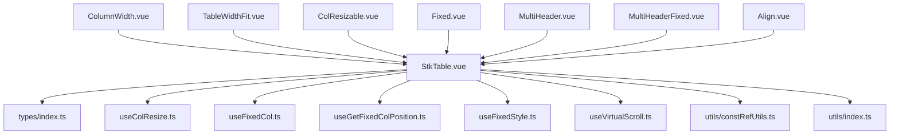
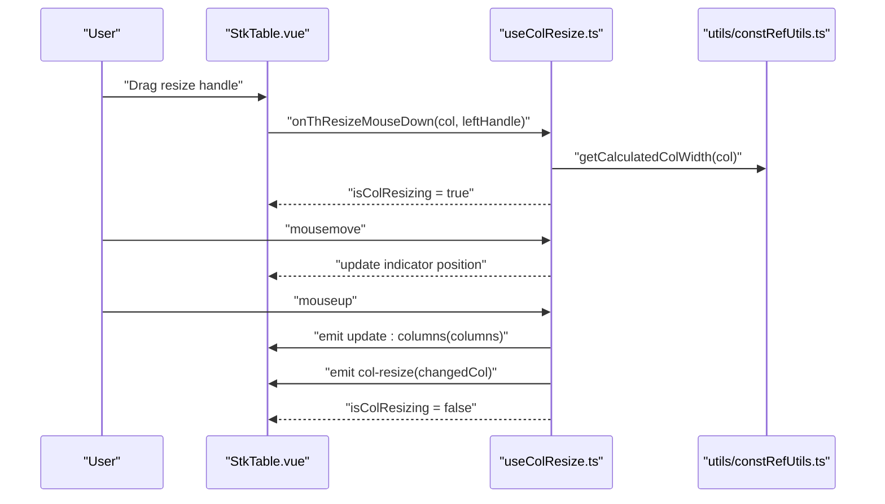
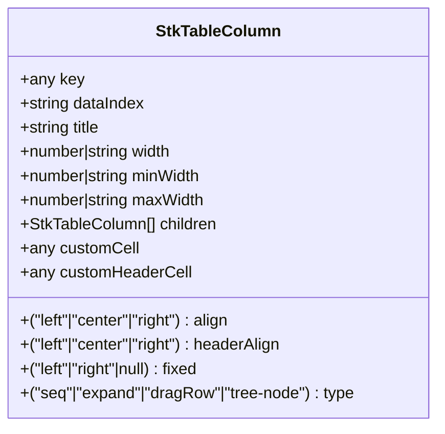
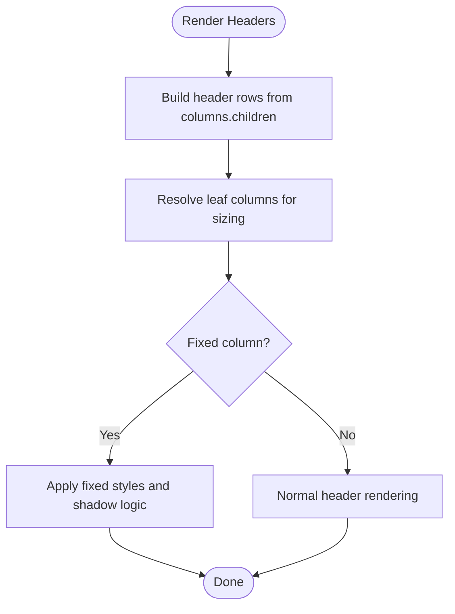
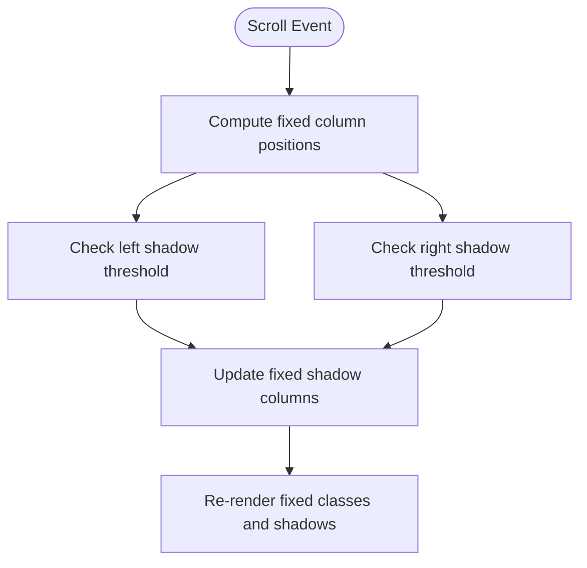
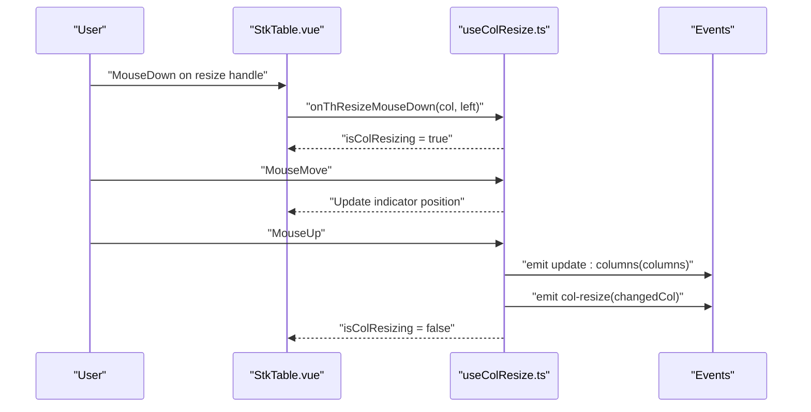
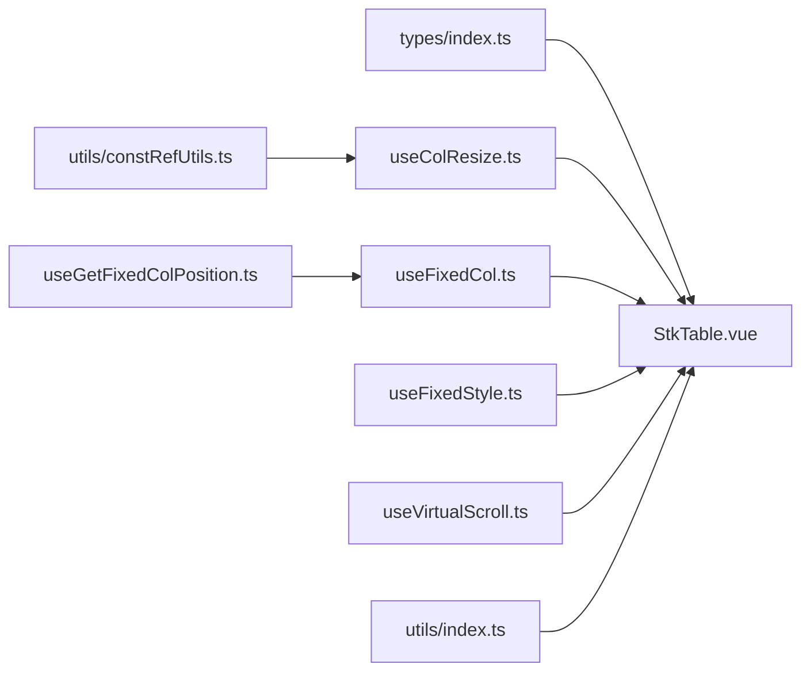

# Column Management

<cite>
**Referenced Files in This Document**
- [StkTable.vue](file://src/StkTable/StkTable.vue)
- [types/index.ts](file://src/StkTable/types/index.ts)
- [useColResize.ts](file://src/StkTable/useColResize.ts)
- [useFixedCol.ts](file://src/StkTable/useFixedCol.ts)
- [useFixedStyle.ts](file://src/StkTable/useFixedStyle.ts)
- [useGetFixedColPosition.ts](file://src/StkTable/useGetFixedColPosition.ts)
- [useVirtualScroll.ts](file://src/StkTable/useVirtualScroll.ts)
- [utils/constRefUtils.ts](file://src/StkTable/utils/constRefUtils.ts)
- [utils/index.ts](file://src/StkTable/utils/index.ts)
- [ColumnWidth.vue](file://docs-demo/basic/column-width/ColumnWidth.vue)
- [TableWidthFit.vue](file://docs-demo/basic/column-width/TableWidthFit.vue)
- [ColResizable.vue](file://docs-demo/advanced/column-resize/ColResizable.vue)
- [Fixed.vue](file://docs-demo/basic/fixed/Fixed.vue)
- [MultiHeader.vue](file://docs-demo/basic/multi-header/MultiHeader.vue)
- [MultiHeaderFixed.vue](file://docs-demo/basic/multi-header/MultiHeaderFixed.vue)
- [Align.vue](file://docs-demo/basic/align/Align.vue)
</cite>

## Table of Contents
1. [Introduction](#introduction)
2. [Project Structure](#project-structure)
3. [Core Components](#core-components)
4. [Architecture Overview](#architecture-overview)
5. [Detailed Component Analysis](#detailed-component-analysis)
6. [Dependency Analysis](#dependency-analysis)
7. [Performance Considerations](#performance-considerations)
8. [Troubleshooting Guide](#troubleshooting-guide)
9. [Conclusion](#conclusion)
10. [Appendices](#appendices)

## Introduction
This document explains column management in Stk Table Vue, focusing on how columns are configured, sized, aligned, and behave responsively. It covers:
- Width management: explicit widths, min/max constraints, and fit-to-content strategies
- Alignment settings: per-column and per-header alignment
- Multi-level headers: nested column groups and leaf column configurations
- Fixed columns: left/right fixation and shadow behavior
- Column resizing: interactive resizing and programmatic updates
- Responsive behavior: virtual scrolling, overflow handling, and mobile-friendly patterns

## Project Structure
The column management features span the main table component, typed column definitions, and supporting composables for resizing, fixing, and positioning. Demo pages illustrate practical usage patterns.

**Diagram sources**
- [StkTable.vue](file://src/StkTable/StkTable.vue#L1-L200)
- [types/index.ts](file://src/StkTable/types/index.ts#L54-L120)
- [useColResize.ts](file://src/StkTable/useColResize.ts#L1-L215)
- [useFixedCol.ts](file://src/StkTable/useFixedCol.ts#L1-L151)
- [useGetFixedColPosition.ts](file://src/StkTable/useGetFixedColPosition.ts#L1-L200)
- [useFixedStyle.ts](file://src/StkTable/useFixedStyle.ts#L1-L200)
- [useVirtualScroll.ts](file://src/StkTable/useVirtualScroll.ts#L1-L200)
- [utils/constRefUtils.ts](file://src/StkTable/utils/constRefUtils.ts#L1-L200)
- [utils/index.ts](file://src/StkTable/utils/index.ts#L1-L200)
- [ColumnWidth.vue](file://docs-demo/basic/column-width/ColumnWidth.vue#L1-L46)
- [TableWidthFit.vue](file://docs-demo/basic/column-width/TableWidthFit.vue#L1-L52)
- [ColResizable.vue](file://docs-demo/advanced/column-resize/ColResizable.vue#L1-L46)
- [Fixed.vue](file://docs-demo/basic/fixed/Fixed.vue#L1-L74)
- [MultiHeader.vue](file://docs-demo/basic/multi-header/MultiHeader.vue#L1-L78)
- [MultiHeaderFixed.vue](file://docs-demo/basic/multi-header/MultiHeaderFixed.vue#L1-L81)
- [Align.vue](file://docs-demo/basic/align/Align.vue#L1-L51)

**Section sources**
- [StkTable.vue](file://src/StkTable/StkTable.vue#L1-L200)
- [types/index.ts](file://src/StkTable/types/index.ts#L54-L120)

## Core Components
- Column configuration model: defines column properties such as width, alignment, fixed position, children (for multi-level headers), and optional custom renderers.
- Resizing engine: interactive column width adjustment with minimum width enforcement and event emission.
- Fixed column manager: computes fixed classes, shadows, and positions for left/right fixed columns.
- Position calculator: resolves fixed column offsets for shadow and layout logic.
- Virtual scrolling integration: ensures column widths are respected during horizontal virtualization.

Key column configuration options:
- width, minWidth, maxWidth: explicit sizing and bounds
- align, headerAlign: cell/header text alignment
- fixed: 'left' | 'right' | null
- children: nested headers forming multi-level structures
- customCell, customHeaderCell: slot-based customization
- type: special column types (seq, expand, dragRow, tree-node)

**Section sources**
- [types/index.ts](file://src/StkTable/types/index.ts#L54-L120)
- [useColResize.ts](file://src/StkTable/useColResize.ts#L50-L56)
- [useFixedCol.ts](file://src/StkTable/useFixedCol.ts#L34-L60)
- [useGetFixedColPosition.ts](file://src/StkTable/useGetFixedColPosition.ts#L1-L200)
- [useVirtualScroll.ts](file://src/StkTable/useVirtualScroll.ts#L1-L200)

## Architecture Overview
The table renders headers and cells from the columns array. Multi-level headers are flattened into rows for rendering. Fixed columns are tracked and styled separately. Resizing updates column widths and emits events for reactive updates.

**Diagram sources**
- [StkTable.vue](file://src/StkTable/StkTable.vue#L70-L100)
- [useColResize.ts](file://src/StkTable/useColResize.ts#L83-L198)
- [utils/constRefUtils.ts](file://src/StkTable/utils/constRefUtils.ts#L1-L200)

## Detailed Component Analysis

### Column Configuration Model
The column interface supports:
- Sizing: width, minWidth, maxWidth
- Alignment: align, headerAlign
- Behavior: fixed, sorter, sortField, sortType, sortConfig
- Rendering: customCell, customHeaderCell
- Structure: children for multi-level headers
- Types: seq, expand, dragRow, tree-node

**Diagram sources**
- [types/index.ts](file://src/StkTable/types/index.ts#L54-L120)

**Section sources**
- [types/index.ts](file://src/StkTable/types/index.ts#L54-L120)

### Width Management and Sizing Strategies
- Explicit width: set width on columns; required for horizontal virtualization
- Min/max constraints: enforce minimum and maximum widths during resizing
- Fit-to-content: combine fixed widths with flexible remaining space; demo shows a fixed main table width
- Percentage-based layouts: define widths as percentages via strings (e.g., "50px", "30%"); ensure consistent units across columns

Practical examples:
- Fixed widths with optional maxWidth: see [ColumnWidth.vue](file://docs-demo/basic/column-width/ColumnWidth.vue#L12-L17)
- Mixed fixed and flexible columns with constrained max width: see [TableWidthFit.vue](file://docs-demo/basic/column-width/TableWidthFit.vue#L12-L18)
- Percentage widths: configure width as a string with unit (e.g., "30%") in column definitions

**Section sources**
- [ColumnWidth.vue](file://docs-demo/basic/column-width/ColumnWidth.vue#L12-L17)
- [TableWidthFit.vue](file://docs-demo/basic/column-width/TableWidthFit.vue#L12-L18)
- [types/index.ts](file://src/StkTable/types/index.ts#L78-L83)

### Alignment Settings (Left, Center, Right)
- Per-column cell alignment via align
- Per-header alignment via headerAlign
- Demonstrated with radio controls toggling alignment values

Example usage:
- Configure align and headerAlign on a column definition: see [Align.vue](file://docs-demo/basic/align/Align.vue#L16-L21)

**Section sources**
- [Align.vue](file://docs-demo/basic/align/Align.vue#L16-L21)
- [types/index.ts](file://src/StkTable/types/index.ts#L72-L75)

### Multi-Level Headers and Leaf Columns
- Nested children form multi-level header rows
- Leaf columns are terminal nodes; resizing propagates to the last child for accurate measurement
- Fixed columns can be applied at any level; demos show fixed left/right headers with nested children

Examples:
- Complex nested hierarchy with mixed fixed and unfixed leaves: see [MultiHeader.vue](file://docs-demo/basic/multi-header/MultiHeader.vue#L6-L56)
- Fully fixed multi-level headers: see [MultiHeaderFixed.vue](file://docs-demo/basic/multi-header/MultiHeaderFixed.vue#L6-L59)

**Diagram sources**
- [StkTable.vue](file://src/StkTable/StkTable.vue#L61-L101)
- [useFixedCol.ts](file://src/StkTable/useFixedCol.ts#L85-L140)
- [MultiHeader.vue](file://docs-demo/basic/multi-header/MultiHeader.vue#L6-L56)
- [MultiHeaderFixed.vue](file://docs-demo/basic/multi-header/MultiHeaderFixed.vue#L6-L59)

**Section sources**
- [StkTable.vue](file://src/StkTable/StkTable.vue#L61-L101)
- [MultiHeader.vue](file://docs-demo/basic/multi-header/MultiHeader.vue#L6-L56)
- [MultiHeaderFixed.vue](file://docs-demo/basic/multi-header/MultiHeaderFixed.vue#L6-L59)

### Fixed Column Support and Shadow Behavior
- Fixed columns are marked with fixed: 'left' or fixed: 'right'
- Shadow highlighting indicates which fixed column edges are visible based on scroll position
- Shadow computation considers cumulative widths and viewport boundaries

Examples:
- Left/right fixed columns with shadow toggle: see [Fixed.vue](file://docs-demo/basic/fixed/Fixed.vue#L12-L21)

**Diagram sources**
- [useFixedCol.ts](file://src/StkTable/useFixedCol.ts#L85-L140)
- [useGetFixedColPosition.ts](file://src/StkTable/useGetFixedColPosition.ts#L1-L200)
- [Fixed.vue](file://docs-demo/basic/fixed/Fixed.vue#L12-L21)

**Section sources**
- [useFixedCol.ts](file://src/StkTable/useFixedCol.ts#L34-L60)
- [useFixedCol.ts](file://src/StkTable/useFixedCol.ts#L85-L140)
- [Fixed.vue](file://docs-demo/basic/fixed/Fixed.vue#L12-L21)

### Column Resizing and Dynamic Width Adjustments
- Interactive resizing: drag handles adjust column width with minimum width enforcement
- Programmatic updates: v-model:columns enables two-way binding to reflect width changes
- Events: emits update:columns and col-resize for external synchronization

Examples:
- Resizable columns with v-model binding: see [ColResizable.vue](file://docs-demo/advanced/column-resize/ColResizable.vue#L9-L15)
- Resizing behavior and constraints: see [useColResize.ts](file://src/StkTable/useColResize.ts#L83-L198)

**Diagram sources**
- [ColResizable.vue](file://docs-demo/advanced/column-resize/ColResizable.vue#L36-L44)
- [useColResize.ts](file://src/StkTable/useColResize.ts#L83-L198)

**Section sources**
- [ColResizable.vue](file://docs-demo/advanced/column-resize/ColResizable.vue#L9-L15)
- [useColResize.ts](file://src/StkTable/useColResize.ts#L50-L56)
- [useColResize.ts](file://src/StkTable/useColResize.ts#L141-L198)

### Responsive Design and Mobile-Friendly Behaviors
- Horizontal virtualization requires explicit widths; use virtualX for performance with large datasets
- Overflow handling: showOverflow and showHeaderOverflow control truncation behavior
- Custom scrollbar: optional custom scrollbar configuration for smoother UX
- Mobile-friendly patterns: keep columns readable; avoid excessive fixed columns on small screens; leverage minWidth to prevent collapse

Integration points:
- Virtual scrolling: ensure columns have width for horizontal virtualization
- Overflow: enable showOverflow and showHeaderOverflow for long content
- Scrollbar: customize scrollbar appearance and behavior

**Section sources**
- [StkTable.vue](file://src/StkTable/StkTable.vue#L314-L318)
- [StkTable.vue](file://src/StkTable/StkTable.vue#L334-L337)
- [StkTable.vue](file://src/StkTable/StkTable.vue#L423-L424)

## Dependency Analysis
Column management depends on several internal modules:
- Column model: StkTableColumn
- Resizing: useColResize
- Fixed columns: useFixedCol, useGetFixedColPosition, useFixedStyle
- Virtualization: useVirtualScroll
- Utilities: constRefUtils for width calculations

**Diagram sources**
- [types/index.ts](file://src/StkTable/types/index.ts#L54-L120)
- [StkTable.vue](file://src/StkTable/StkTable.vue#L1-L200)
- [useColResize.ts](file://src/StkTable/useColResize.ts#L1-L215)
- [useFixedCol.ts](file://src/StkTable/useFixedCol.ts#L1-L151)
- [useGetFixedColPosition.ts](file://src/StkTable/useGetFixedColPosition.ts#L1-L200)
- [useFixedStyle.ts](file://src/StkTable/useFixedStyle.ts#L1-L200)
- [useVirtualScroll.ts](file://src/StkTable/useVirtualScroll.ts#L1-L200)
- [utils/constRefUtils.ts](file://src/StkTable/utils/constRefUtils.ts#L1-L200)
- [utils/index.ts](file://src/StkTable/utils/index.ts#L1-L200)

**Section sources**
- [types/index.ts](file://src/StkTable/types/index.ts#L54-L120)
- [StkTable.vue](file://src/StkTable/StkTable.vue#L1-L200)

## Performance Considerations
- Prefer explicit widths for horizontal virtualization to avoid layout thrashing
- Limit fixed columns on narrow screens to reduce reflow
- Use minWidth to prevent columns from collapsing during resizing
- Leverage showOverflow judiciously to balance readability and performance
- For large datasets, enable virtual and virtualX to minimize DOM nodes

## Troubleshooting Guide
Common issues and resolutions:
- Columns collapse or overlap:
  - Ensure each column has a width; for virtualX, widths are mandatory
  - Set minWidth to prevent unintended shrinkage
- Resizing does nothing:
  - Verify col-resizable is enabled and v-model:columns is bound
  - Confirm columns are not marked as disabled in the resizing configuration
- Fixed column shadows not appearing:
  - Enable fixed-col-shadow and ensure fixed columns are present
  - Check scroll position thresholds for shadow visibility
- Multi-level headers misalign:
  - Ensure children arrays are properly structured
  - Verify leaf columns have widths for accurate layout

**Section sources**
- [useColResize.ts](file://src/StkTable/useColResize.ts#L50-L56)
- [useColResize.ts](file://src/StkTable/useColResize.ts#L141-L198)
- [useFixedCol.ts](file://src/StkTable/useFixedCol.ts#L85-L140)
- [MultiHeader.vue](file://docs-demo/basic/multi-header/MultiHeader.vue#L6-L56)

## Conclusion
Stk Table Vue provides a robust, extensible column management system. With explicit width control, alignment options, multi-level headers, fixed columns, and interactive resizing, it supports diverse layouts and responsive needs. Combine these features with virtualization and overflow controls to build performant, user-friendly tables across devices.

## Appendices

### Practical Examples Index
- Column width basics and max-width constraints: [ColumnWidth.vue](file://docs-demo/basic/column-width/ColumnWidth.vue#L12-L17)
- Mixed fixed and flexible columns with constrained max width: [TableWidthFit.vue](file://docs-demo/basic/column-width/TableWidthFit.vue#L12-L18)
- Resizable columns with v-model binding: [ColResizable.vue](file://docs-demo/advanced/column-resize/ColResizable.vue#L9-L15)
- Fixed left/right columns with shadow toggle: [Fixed.vue](file://docs-demo/basic/fixed/Fixed.vue#L12-L21)
- Complex multi-level headers: [MultiHeader.vue](file://docs-demo/basic/multi-header/MultiHeader.vue#L6-L56)
- Fully fixed multi-level headers: [MultiHeaderFixed.vue](file://docs-demo/basic/multi-header/MultiHeaderFixed.vue#L6-L59)
- Alignment controls for cell and header: [Align.vue](file://docs-demo/basic/align/Align.vue#L16-L21)