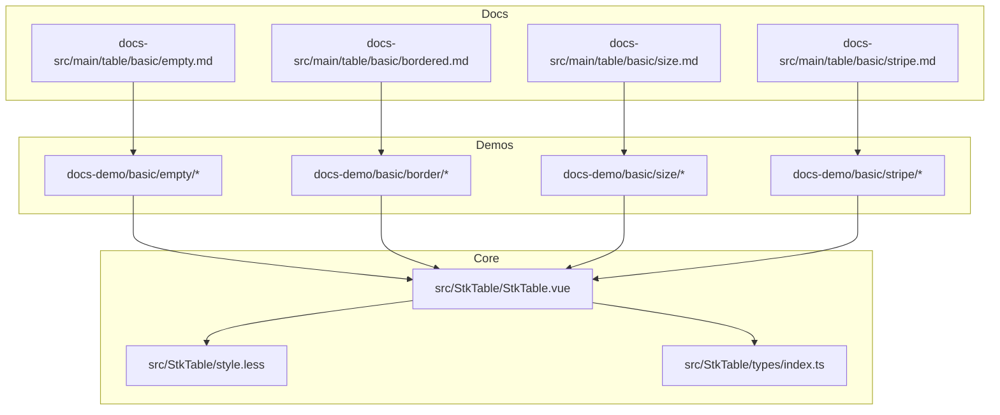
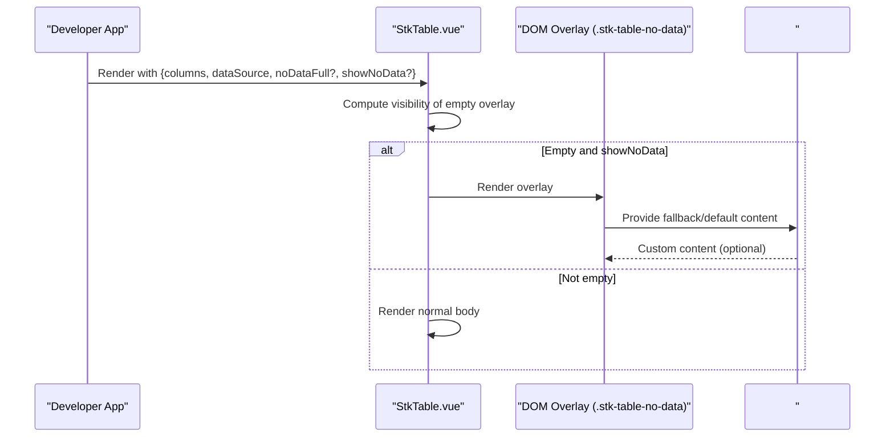
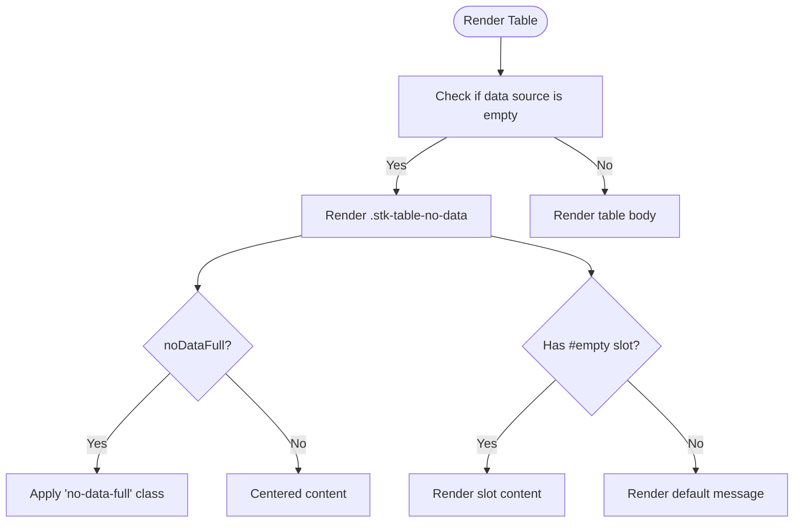
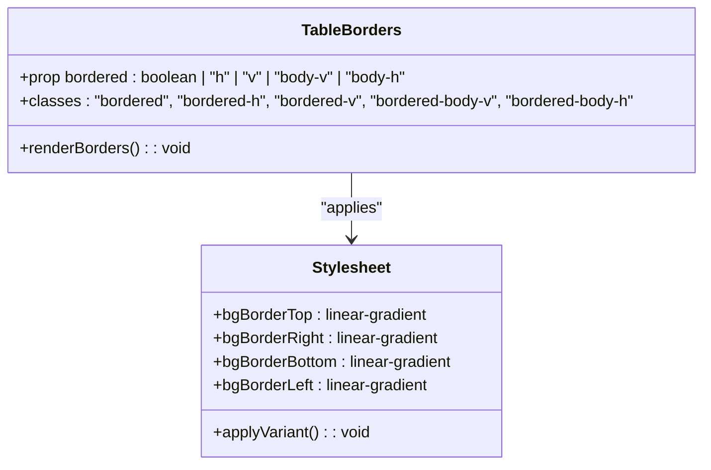
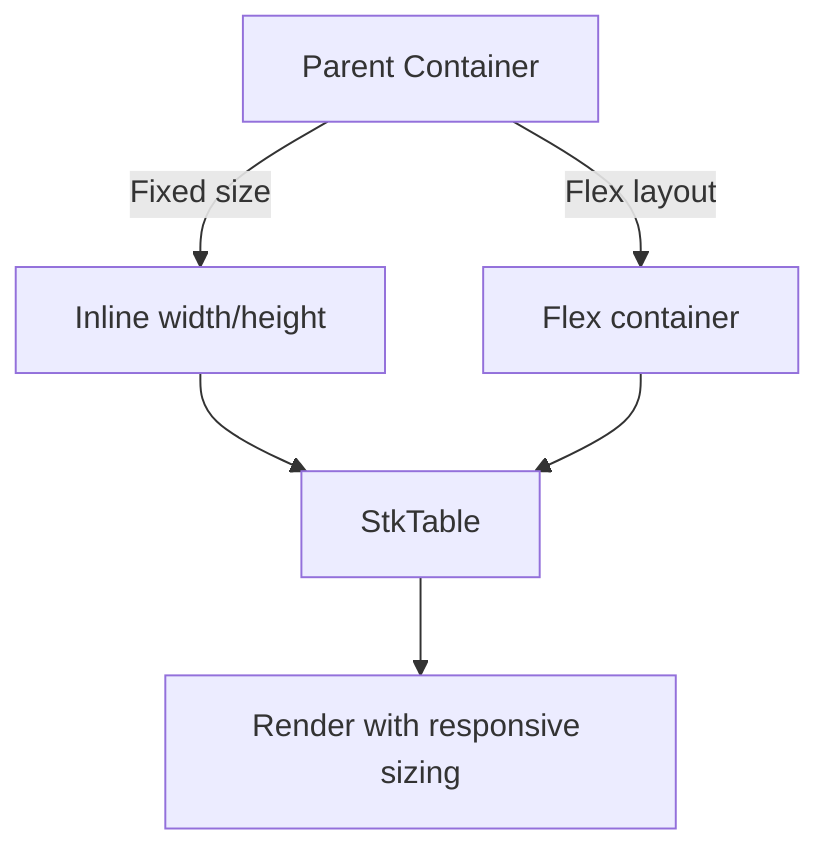
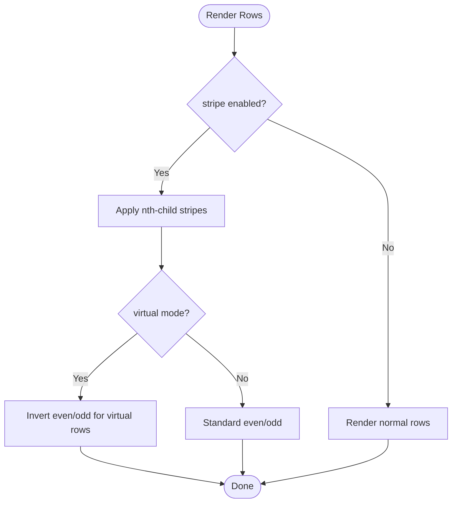
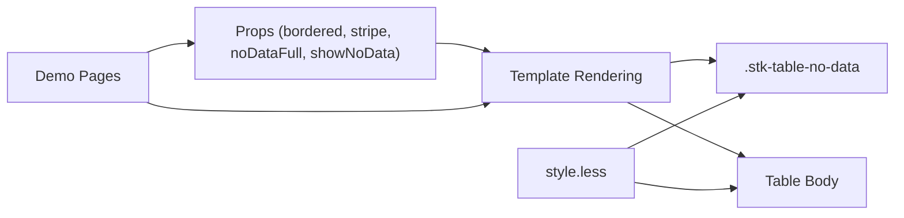

# Data Display

<cite>
**Referenced Files in This Document**
- [StkTable.vue](file://src/StkTable/StkTable.vue)
- [style.less](file://src/StkTable/style.less)
- [index.ts](file://src/StkTable/types/index.ts)
- [Default.vue](file://docs-demo/basic/empty/Default.vue)
- [NoDataFull.vue](file://docs-demo/basic/empty/NoDataFull.vue)
- [Slot.vue](file://docs-demo/basic/empty/Slot.vue)
- [Default.vue](file://docs-demo/basic/border/Default.vue)
- [Default.vue](file://docs-demo/basic/size/Default.vue)
- [Flex.vue](file://docs-demo/basic/size/Flex.vue)
- [Stripe.vue](file://docs-demo/basic/stripe/Stripe.vue)
- [StripeVt.vue](file://docs-demo/basic/stripe/StripeVt.vue)
- [empty.md](file://docs-src/main/table/basic/empty.md)
- [bordered.md](file://docs-src/main/table/basic/bordered.md)
- [size.md](file://docs-src/main/table/basic/size.md)
- [stripe.md](file://docs-src/main/table/basic/stripe.md)
</cite>

## Table of Contents
1. [Introduction](#introduction)
2. [Project Structure](#project-structure)
3. [Core Components](#core-components)
4. [Architecture Overview](#architecture-overview)
5. [Detailed Component Analysis](#detailed-component-analysis)
6. [Dependency Analysis](#dependency-analysis)
7. [Performance Considerations](#performance-considerations)
8. [Troubleshooting Guide](#troubleshooting-guide)
9. [Conclusion](#conclusion)
10. [Appendices](#appendices)

## Introduction
This document explains the data display features of Stk Table Vue with a focus on empty state handling, border styling, size variants, and stripe patterns. It synthesizes implementation details from the core table component, styles, and demo pages to help both developers and designers configure and customize the table’s visual presentation effectively.

## Project Structure
The data display features are implemented in the core table component and its associated styles, with comprehensive demos and documentation covering empty states, borders, sizes, and stripes.

**Diagram sources**
- [StkTable.vue](file://src/StkTable/StkTable.vue#L1-L207)
- [style.less](file://src/StkTable/style.less#L1-L690)
- [index.ts](file://src/StkTable/types/index.ts#L1-L318)
- [Default.vue](file://docs-demo/basic/empty/Default.vue#L1-L21)
- [NoDataFull.vue](file://docs-demo/basic/empty/NoDataFull.vue#L1-L29)
- [Slot.vue](file://docs-demo/basic/empty/Slot.vue#L1-L29)
- [Default.vue](file://docs-demo/basic/border/Default.vue#L1-L65)
- [Default.vue](file://docs-demo/basic/size/Default.vue#L1-L59)
- [Flex.vue](file://docs-demo/basic/size/Flex.vue#L1-L60)
- [Stripe.vue](file://docs-demo/basic/stripe/Stripe.vue#L1-L25)
- [StripeVt.vue](file://docs-demo/basic/stripe/StripeVt.vue#L1-L35)
- [empty.md](file://docs-src/main/table/basic/empty.md#L1-L25)
- [bordered.md](file://docs-src/main/table/basic/bordered.md#L1-L16)
- [size.md](file://docs-src/main/table/basic/size.md#L1-L22)
- [stripe.md](file://docs-src/main/table/basic/stripe.md#L1-L9)

**Section sources**
- [StkTable.vue](file://src/StkTable/StkTable.vue#L1-L207)
- [style.less](file://src/StkTable/style.less#L1-L690)
- [index.ts](file://src/StkTable/types/index.ts#L1-L318)
- [empty.md](file://docs-src/main/table/basic/empty.md#L1-L25)
- [bordered.md](file://docs-src/main/table/basic/bordered.md#L1-L16)
- [size.md](file://docs-src/main/table/basic/size.md#L1-L22)
- [stripe.md](file://docs-src/main/table/basic/stripe.md#L1-L9)

## Core Components
- Empty state rendering and placement: The table conditionally renders a no-data overlay when the data source is empty and the no-data display is enabled. The overlay supports a full-page mode and a custom slot-based content area.
- Border styling: The table exposes a bordered prop supporting boolean and directional variants, with CSS leveraging background gradients to simulate borders and maintain visual continuity during scroll.
- Size variants: The table adapts to fixed container sizes via inline styles and to flex layouts via flex properties, enabling responsive sizing without explicit width/height props.
- Stripe patterns: Alternating row colors are applied via CSS nth-child selectors, with special handling for virtualized modes to ensure correct stripe alignment.

**Section sources**
- [StkTable.vue](file://src/StkTable/StkTable.vue#L192-L194)
- [style.less](file://src/StkTable/style.less#L143-L204)
- [Default.vue](file://docs-demo/basic/size/Default.vue#L50-L56)
- [Flex.vue](file://docs-demo/basic/size/Flex.vue#L33-L58)
- [Stripe.vue](file://docs-demo/basic/stripe/Stripe.vue#L23-L24)
- [StripeVt.vue](file://docs-demo/basic/stripe/StripeVt.vue#L27-L33)

## Architecture Overview
The data display pipeline integrates props, template rendering, and styles to produce a configurable, responsive, and visually consistent table.

**Diagram sources**
- [StkTable.vue](file://src/StkTable/StkTable.vue#L192-L194)
- [Slot.vue](file://docs-demo/basic/empty/Slot.vue#L20-L27)

## Detailed Component Analysis

### Empty State Handling
- Default empty message: When the data source is empty and no custom content is provided, the overlay displays a default message.
- Full-page empty state: When configured, the overlay expands to fill the container height.
- Custom slot-based content: A named slot allows inserting custom components and localized messages.

Implementation highlights:
- Overlay rendering is controlled by a conditional block that checks the data source and a flag to show the no-data overlay.
- The overlay uses a sticky positioning strategy to remain visible while scrolling.
- The slot name is empty, enabling custom content injection.

**Diagram sources**
- [StkTable.vue](file://src/StkTable/StkTable.vue#L192-L194)
- [style.less](file://src/StkTable/style.less#L598-L615)
- [Default.vue](file://docs-demo/basic/empty/Default.vue#L16-L20)
- [NoDataFull.vue](file://docs-demo/basic/empty/NoDataFull.vue#L15-L27)
- [Slot.vue](file://docs-demo/basic/empty/Slot.vue#L20-L27)

**Section sources**
- [StkTable.vue](file://src/StkTable/StkTable.vue#L192-L194)
- [style.less](file://src/StkTable/style.less#L598-L615)
- [Default.vue](file://docs-demo/basic/empty/Default.vue#L16-L20)
- [NoDataFull.vue](file://docs-demo/basic/empty/NoDataFull.vue#L15-L27)
- [Slot.vue](file://docs-demo/basic/empty/Slot.vue#L20-L27)
- [empty.md](file://docs-src/main/table/basic/empty.md#L1-L25)

### Border Styling Options
- Directional border variants: The bordered prop accepts boolean or directional strings to control which borders are rendered.
- Implementation technique: Instead of relying solely on border properties, the styles use background image gradients to draw borders on cells, ensuring continuity during horizontal/vertical scrolling.
- Variants supported:
  - true: full borders
  - false: no borders
  - "h": horizontal borders only
  - "v": vertical borders only
  - "body-v": body-only vertical borders
  - "body-h": body-only horizontal borders

**Diagram sources**
- [StkTable.vue](file://src/StkTable/StkTable.vue#L15-L17)
- [style.less](file://src/StkTable/style.less#L143-L186)
- [Default.vue](file://docs-demo/basic/border/Default.vue#L29-L51)
- [bordered.md](file://docs-src/main/table/basic/bordered.md#L1-L16)

**Section sources**
- [StkTable.vue](file://src/StkTable/StkTable.vue#L15-L17)
- [style.less](file://src/StkTable/style.less#L143-L186)
- [Default.vue](file://docs-demo/basic/border/Default.vue#L29-L51)
- [bordered.md](file://docs-src/main/table/basic/bordered.md#L1-L16)

### Size Variants and Responsive Sizing
- Fixed size mode: Control width and height via inline styles; the table adapts to the container’s bounding box.
- Flex mode: Place the table inside a flex container so that it grows/shrinks to fill available space without explicit dimensions.
- Responsive behavior: The table uses flex properties and fit-content widths to accommodate dynamic containers.

**Diagram sources**
- [Default.vue](file://docs-demo/basic/size/Default.vue#L50-L56)
- [Flex.vue](file://docs-demo/basic/size/Flex.vue#L33-L58)
- [size.md](file://docs-src/main/table/basic/size.md#L1-L22)

**Section sources**
- [Default.vue](file://docs-demo/basic/size/Default.vue#L50-L56)
- [Flex.vue](file://docs-demo/basic/size/Flex.vue#L33-L58)
- [size.md](file://docs-src/main/table/basic/size.md#L1-L22)

### Stripe Patterns and Readability Enhancements
- Stripe toggling: Enable striped rows via a boolean prop.
- Virtualized stripe behavior: The CSS accounts for virtualization by inverting the even/odd pattern for virtualized rows to keep stripes aligned with visible content.
- Hover and active states: Additional classes enhance interactivity with hover and active row backgrounds.

**Diagram sources**
- [style.less](file://src/StkTable/style.less#L188-L204)
- [Stripe.vue](file://docs-demo/basic/stripe/Stripe.vue#L23-L24)
- [StripeVt.vue](file://docs-demo/basic/stripe/StripeVt.vue#L27-L33)

**Section sources**
- [style.less](file://src/StkTable/style.less#L188-L204)
- [Stripe.vue](file://docs-demo/basic/stripe/Stripe.vue#L23-L24)
- [StripeVt.vue](file://docs-demo/basic/stripe/StripeVt.vue#L27-L33)
- [stripe.md](file://docs-src/main/table/basic/stripe.md#L1-L9)

## Dependency Analysis
- Template depends on props to compute classes and conditional rendering.
- Styles depend on CSS variables for theme-aware colors and stripe backgrounds.
- Demos demonstrate usage patterns for empty states, borders, sizes, and stripes.

**Diagram sources**
- [StkTable.vue](file://src/StkTable/StkTable.vue#L15-L17)
- [style.less](file://src/StkTable/style.less#L143-L204)
- [Default.vue](file://docs-demo/basic/size/Default.vue#L50-L56)
- [Flex.vue](file://docs-demo/basic/size/Flex.vue#L33-L58)
- [Slot.vue](file://docs-demo/basic/empty/Slot.vue#L20-L27)

**Section sources**
- [StkTable.vue](file://src/StkTable/StkTable.vue#L15-L17)
- [style.less](file://src/StkTable/style.less#L143-L204)
- [Default.vue](file://docs-demo/basic/size/Default.vue#L50-L56)
- [Flex.vue](file://docs-demo/basic/size/Flex.vue#L33-L58)
- [Slot.vue](file://docs-demo/basic/empty/Slot.vue#L20-L27)

## Performance Considerations
- Virtual scrolling: When enabled, stripe patterns adjust to maintain visual consistency with visible rows.
- Scrollbar integration: Custom scrollbars are optional and can be toggled via a prop to balance aesthetics and performance.
- Overflow handling: Text overflow is managed via CSS to prevent layout thrashing.

[No sources needed since this section provides general guidance]

## Troubleshooting Guide
- Empty overlay not appearing:
  - Verify the data source is truly empty and showNoData is enabled.
  - Confirm no custom #empty slot is unintentionally overriding the default.
- Full-page empty state not filling:
  - Ensure the noDataFull prop is set and the container has a defined height.
- Borders disappearing on scroll:
  - This is expected due to the gradient-based border technique. Add custom CSS borders to the container if needed.
- Stripes misaligned in virtual lists:
  - Confirm stripe is enabled and virtual mode is active; the component applies a compensating selector for virtualized rows.

**Section sources**
- [StkTable.vue](file://src/StkTable/StkTable.vue#L192-L194)
- [style.less](file://src/StkTable/style.less#L143-L186)
- [NoDataFull.vue](file://docs-demo/basic/empty/NoDataFull.vue#L15-L27)
- [bordered.md](file://docs-src/main/table/basic/bordered.md#L13-L16)
- [StripeVt.vue](file://docs-demo/basic/stripe/StripeVt.vue#L27-L33)

## Conclusion
Stk Table Vue offers robust data display capabilities with flexible empty state handling, comprehensive border styling, responsive sizing modes, and stripe patterns optimized for both regular and virtualized lists. The demos and documentation provide practical examples to tailor the table’s appearance to diverse UI needs.

[No sources needed since this section summarizes without analyzing specific files]

## Appendices

### API and Props Summary (Data Display)
- Empty state
  - noDataFull: boolean — controls whether the empty overlay fills the container height.
  - showNoData: boolean — toggles the visibility of the empty overlay.
  - Slot: empty — inject custom content for the empty state.
- Borders
  - bordered: boolean | "h" | "v" | "body-v" | "body-h" — controls border visibility and direction.
- Size and Layout
  - Inline width/height via style for fixed sizing.
  - Flex layout for adaptive sizing within a flex container.
- Stripe
  - stripe: boolean — enables/disables alternating row colors.

**Section sources**
- [StkTable.vue](file://src/StkTable/StkTable.vue#L286-L476)
- [style.less](file://src/StkTable/style.less#L143-L204)
- [Default.vue](file://docs-demo/basic/size/Default.vue#L50-L56)
- [Flex.vue](file://docs-demo/basic/size/Flex.vue#L33-L58)
- [Slot.vue](file://docs-demo/basic/empty/Slot.vue#L20-L27)
- [bordered.md](file://docs-src/main/table/basic/bordered.md#L1-L16)
- [empty.md](file://docs-src/main/table/basic/empty.md#L1-L25)
- [size.md](file://docs-src/main/table/basic/size.md#L1-L22)
- [stripe.md](file://docs-src/main/table/basic/stripe.md#L1-L9)