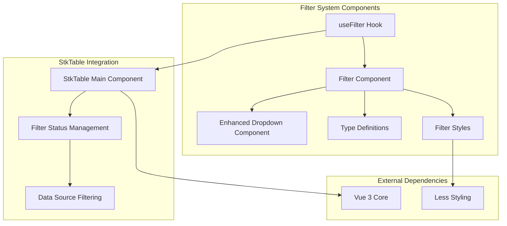
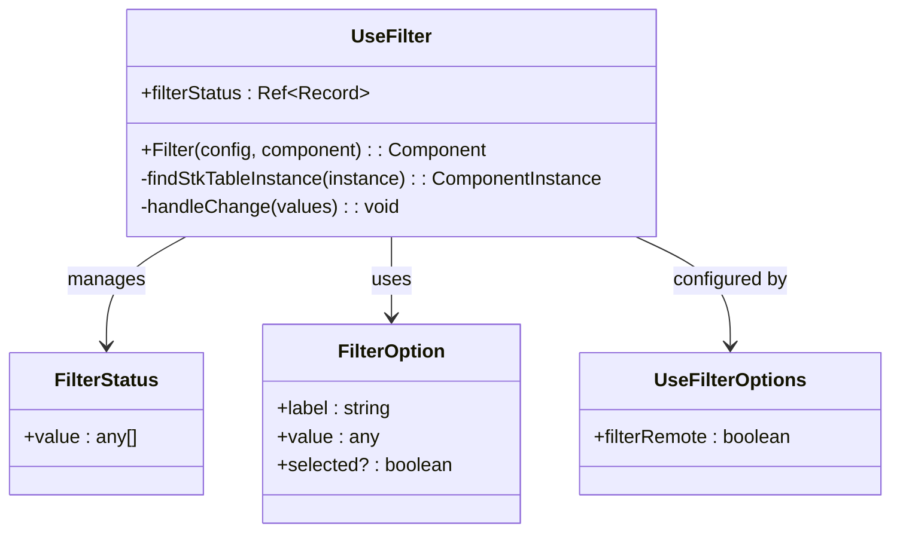
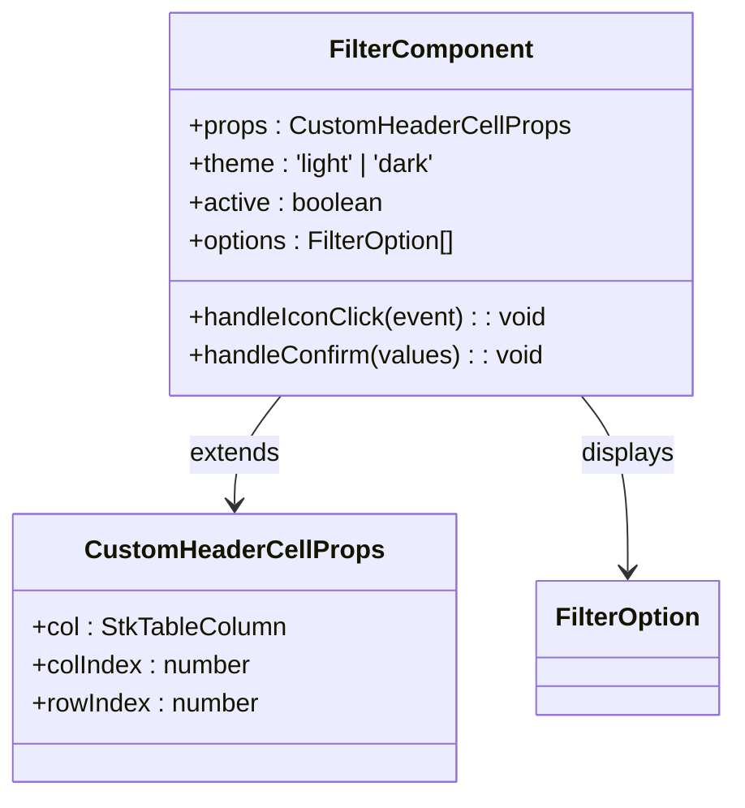
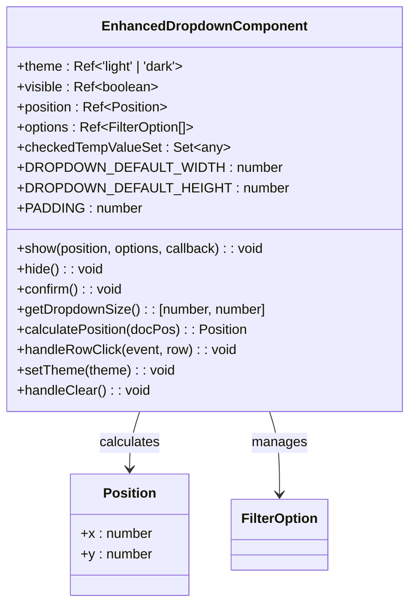
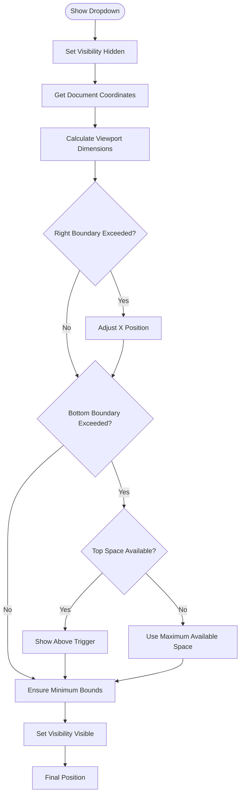
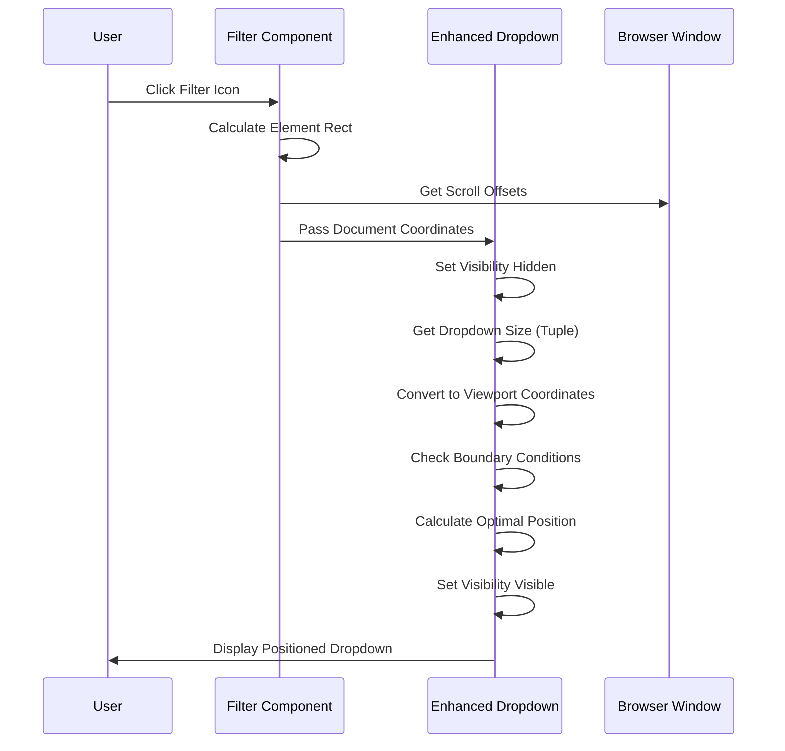
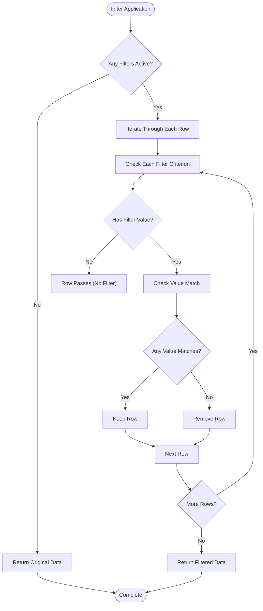
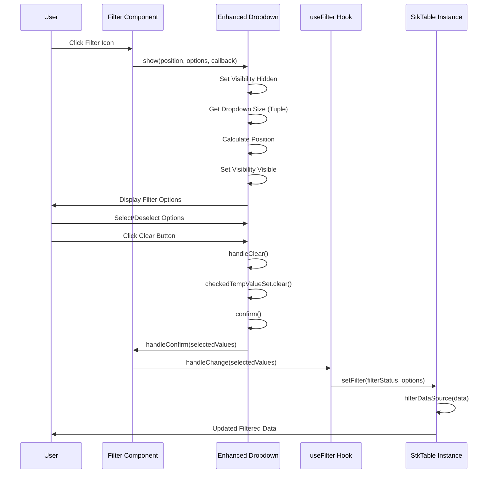
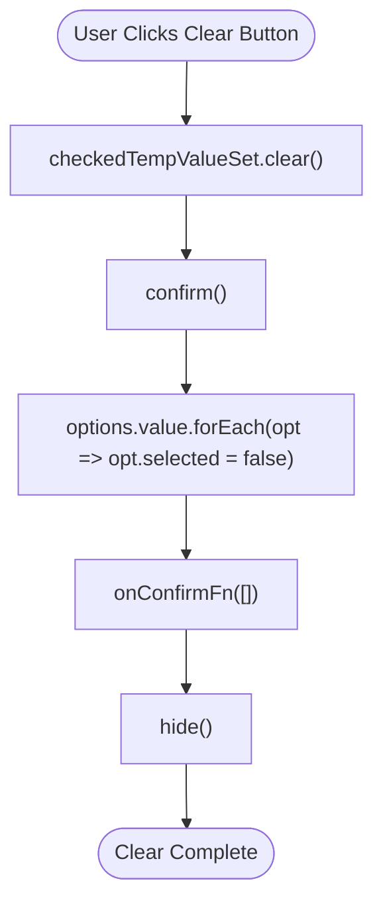
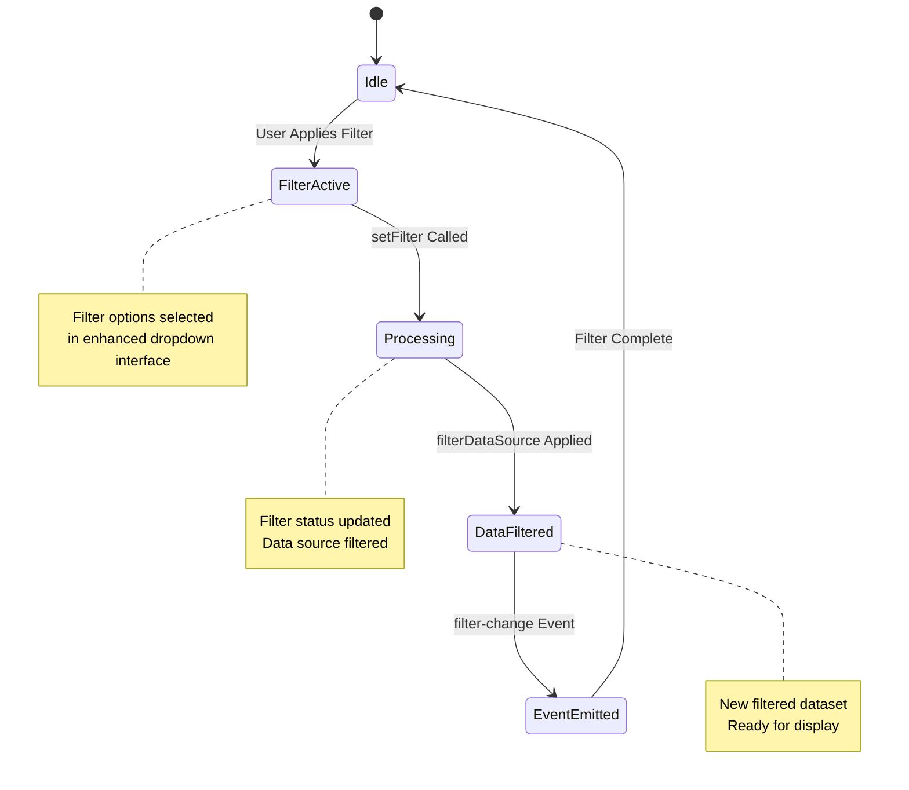

# Filter System

<cite>
**Referenced Files in This Document**
- [useFilter.ts](file://src/StkTable/components/Filter/useFilter.ts)
- [Filter.vue](file://src/StkTable/components/Filter/Filter.vue)
- [Dropdown/index.vue](file://src/StkTable/components/Filter/Dropdown/index.vue)
- [types.ts](file://src/StkTable/components/Filter/types.ts)
- [Filter.less](file://src/StkTable/components/Filter/Filter.less)
- [StkTable.vue](file://src/StkTable/StkTable.vue)
- [index.ts](file://src/StkTable/index.ts)
- [FilterDemo.vue](file://docs-demo/basic/filter/FilterDemo.vue)
</cite>

## Update Summary
**Changes Made**
- Enhanced dropdown clear button functionality with improved synchronization to parent table component
- Added confirm() call in handleClear() method to ensure proper filter state synchronization
- Updated clear button behavior to immediately apply cleared selections to filter status
- Enhanced filter state management during clear operations

## Table of Contents
1. [Introduction](#introduction)
2. [System Architecture](#system-architecture)
3. [Core Components](#core-components)
4. [Enhanced Positioning System](#enhanced-positioning-system)
5. [Filter Implementation](#filter-implementation)
6. [Integration with StkTable](#integration-with-stktable)
7. [Usage Examples](#usage-examples)
8. [Styling and Theming](#styling-and-theming)
9. [Performance Considerations](#performance-considerations)
10. [Troubleshooting Guide](#troubleshooting-guide)
11. [Conclusion](#conclusion)

## Introduction

The Filter System is a comprehensive filtering solution integrated into the StkTable component library. It provides users with the ability to apply multi-value filters to table columns through an intuitive dropdown interface. The system supports both local and remote filtering modes, allowing developers to customize how filtering is applied based on their specific requirements.

The filter system consists of several key components working together to provide a seamless filtering experience: a filter hook for managing filter state, a filter component for rendering filter controls in table headers, an enhanced dropdown component with improved positioning system for selecting filter options, and integration with the main StkTable component for applying filters to data sources.

## System Architecture

The filter system follows a modular architecture with clear separation of concerns:

**Diagram sources**
- [useFilter.ts:1-91](file://src/StkTable/components/Filter/useFilter.ts#L1-L91)
- [Filter.vue:1-62](file://src/StkTable/components/Filter/Filter.vue#L1-L62)
- [Dropdown/index.vue:1-185](file://src/StkTable/components/Filter/Dropdown/index.vue#L1-L185)
- [StkTable.vue:1022-1046](file://src/StkTable/StkTable.vue#L1022-L1046)

The architecture demonstrates a clean separation where the useFilter hook manages filter state and creates filter components, while the StkTable component handles the actual data filtering logic. The enhanced dropdown component provides the user interface for selecting filter options with improved positioning capabilities.

**Section sources**
- [useFilter.ts:1-91](file://src/StkTable/components/Filter/useFilter.ts#L1-L91)
- [StkTable.vue:1022-1046](file://src/StkTable/StkTable.vue#L1022-L1046)

## Core Components

### Filter Hook (useFilter)

The `useFilter` hook serves as the primary interface for implementing filtering functionality in StkTable. It manages filter state and creates filter components for table headers.

**Diagram sources**
- [useFilter.ts:33-91](file://src/StkTable/components/Filter/useFilter.ts#L33-L91)
- [types.ts:10-18](file://src/StkTable/components/Filter/types.ts#L10-L18)

The hook maintains a reactive filter status object that tracks the current filter selections for each column. It provides a factory function for creating filter components that can be injected into table column headers.

**Section sources**
- [useFilter.ts:28-91](file://src/StkTable/components/Filter/useFilter.ts#L28-L91)
- [types.ts:10-18](file://src/StkTable/components/Filter/types.ts#L10-L18)

### Filter Component

The Filter component renders the filter control in table headers and handles user interactions for opening the filter dropdown.

**Diagram sources**
- [Filter.vue:7-39](file://src/StkTable/components/Filter/Filter.vue#L7-L39)

The component inherits from the standard header cell props and adds filter-specific functionality including theme support and option display.

**Section sources**
- [Filter.vue:1-62](file://src/StkTable/components/Filter/Filter.vue#L1-L62)

### Enhanced Dropdown Component

The dropdown component provides the interactive interface for selecting filter options with an enhanced positioning system.

**Diagram sources**
- [Dropdown/index.vue:42-94](file://src/StkTable/components/Filter/Dropdown/index.vue#L42-L94)

The enhanced dropdown includes refined padding constants, automatic positioning calculations, and improved boundary detection for optimal viewport positioning.

**Section sources**
- [Dropdown/index.vue:1-185](file://src/StkTable/components/Filter/Dropdown/index.vue#L1-L185)

## Enhanced Positioning System

### Automatic Position Calculation

The enhanced dropdown positioning system automatically calculates the best placement for the filter dropdown based on viewport boundaries and available space.

**Diagram sources**
- [Dropdown/index.vue:92-105](file://src/StkTable/components/Filter/Dropdown/index.vue#L92-L105)
- [Dropdown/index.vue:53-90](file://src/StkTable/components/Filter/Dropdown/index.vue#L53-L90)

**Updated** Enhanced with improved visibility management to prevent flickering during show animations and refined padding calculation with 6px safety distance.

The positioning system considers document-relative coordinates, viewport boundaries, and safety padding to ensure the dropdown is always fully visible. The enhanced system now includes:

- **Visibility Management**: Dropdown is temporarily hidden during position calculation to prevent visual flickering
- **Tuple Size Calculation**: `getDropdownSize()` returns `[width, height]` tuple arrays for precise sizing
- **Reduced Padding**: Changed from 8px to 6px safety distance for better viewport utilization
- **Improved Flicker Prevention**: Visibility toggling prevents layout thrashing during animation

### Safety Padding Constants

The system implements refined safety padding constants to prevent dropdown overlap with viewport edges:

| Constant | Value | Purpose |
|----------|-------|---------|
| `DROPDOWN_DEFAULT_WIDTH` | 300px | Default width for initial size calculation |
| `DROPDOWN_DEFAULT_HEIGHT` | 400px | Default height for initial size calculation |
| `PADDING` | 6px | **Updated** Reduced safety distance from 8px to 6px |

**Updated** The padding constant has been reduced from 8px to 6px to provide better viewport utilization while maintaining safe distances from edges.

### Document-Relative Coordinate Handling

The positioning system converts element coordinates to document-relative positions, accounting for scroll offsets:

**Diagram sources**
- [Filter.vue:22-47](file://src/StkTable/components/Filter/Filter.vue#L22-L47)
- [Dropdown/index.vue:92-105](file://src/StkTable/components/Filter/Dropdown/index.vue#L92-L105)

**Updated** Enhanced with improved visibility management during the show animation process to prevent flickering artifacts.

**Section sources**
- [Dropdown/index.vue:31-105](file://src/StkTable/components/Filter/Dropdown/index.vue#L31-L105)
- [Filter.vue:22-47](file://src/StkTable/components/Filter/Filter.vue#L22-L47)

## Filter Implementation

### Data Filtering Logic

The filtering system applies filters to data sources using a multi-criteria approach where each column's filter conditions are combined with logical AND operations.

**Diagram sources**
- [StkTable.vue:1036-1046](file://src/StkTable/StkTable.vue#L1036-L1046)

The filtering algorithm evaluates each row against all active filter criteria, ensuring that only rows meeting all filter conditions are included in the final dataset.

**Section sources**
- [StkTable.vue:1036-1046](file://src/StkTable/StkTable.vue#L1036-L1046)

### Filter State Management

The system maintains filter state through a reactive object structure that maps column keys to their respective filter values.

**Diagram sources**
- [useFilter.ts:65-68](file://src/StkTable/components/Filter/useFilter.ts#L65-L68)
- [StkTable.vue:1022-1034](file://src/StkTable/StkTable.vue#L1022-L1034)

**Updated** Enhanced with improved visibility management during the dropdown show animation to prevent visual flickering.

**Section sources**
- [useFilter.ts:33-91](file://src/StkTable/components/Filter/useFilter.ts#L33-L91)
- [StkTable.vue:1022-1034](file://src/StkTable/StkTable.vue#L1022-L1034)

### Clear Button Functionality

**Updated** The clear button functionality has been enhanced to ensure proper synchronization with the parent table component.

The clear button in the dropdown footer provides users with the ability to reset all filter selections instantly. The enhanced implementation now includes:

- **Immediate Synchronization**: The `handleClear()` method now calls `confirm()` after clearing selections
- **State Consistency**: Ensures filter state is properly synchronized with the parent table component
- **User Experience**: Provides immediate visual feedback when clearing filter selections

**Diagram sources**
- [Dropdown/index.vue:147-150](file://src/StkTable/components/Filter/Dropdown/index.vue#L147-L150)
- [Dropdown/index.vue:128-132](file://src/StkTable/components/Filter/Dropdown/index.vue#L128-L132)

**Section sources**
- [Dropdown/index.vue:147-150](file://src/StkTable/components/Filter/Dropdown/index.vue#L147-L150)

## Integration with StkTable

### Exposed Methods

The StkTable component exposes a `setFilter` method that allows external components to programmatically control filtering state.

| Method | Parameters | Description |
|--------|------------|-------------|
| `setFilter` | `status: Record<UniqKey, FilterStatus> \| null` `option?: { remote?: boolean }` | Sets the filter status and optionally triggers remote filtering |

### Event Emission

The filter system emits a `filter-change` event whenever filter state changes occur, providing real-time feedback to applications.

**Diagram sources**
- [StkTable.vue:1022-1034](file://src/StkTable/StkTable.vue#L1022-L1034)
- [StkTable.vue:681-685](file://src/StkTable/StkTable.vue#L681-L685)

**Section sources**
- [StkTable.vue:1022-1034](file://src/StkTable/StkTable.vue#L1022-L1034)
- [StkTable.vue:681-685](file://src/StkTable/StkTable.vue#L681-L685)

## Usage Examples

### Basic Filter Setup

The most common usage pattern involves importing the filter hook and applying it to table columns.

**Section sources**
- [FilterDemo.vue:21-28](file://docs-demo/basic/filter/FilterDemo.vue#L21-L28)

### Advanced Configuration

For more complex scenarios, developers can configure filter options including remote filtering capabilities and custom filter handlers.

**Section sources**
- [useFilter.ts:33-34](file://src/StkTable/components/Filter/useFilter.ts#L33-L34)

## Styling and Theming

### Theme Support

The filter system supports both light and dark themes, with automatic theme detection from the parent StkTable component.

| Theme Variant | Color Variables | Visual Effects |
|---------------|----------------|----------------|
| Light Theme | `--text-color: rgba(0, 0, 0, 0.85)` `--bg-color: #ffffff` `--border-color: #e8e8e8` | Light background with subtle borders |
| Dark Theme | `--text-color: rgba(255, 255, 255, 0.85)` `--bg-color: #181c21` `--border-color: #303439` | Dark background with contrasting borders |

### Responsive Design

The enhanced filter dropdown adapts to different screen sizes and positions itself relative to the filter icon for optimal user experience, with improved boundary detection and automatic positioning calculations.

**Section sources**
- [Filter.less:27-58](file://src/StkTable/components/Filter/Filter.less#L27-L58)
- [Dropdown/index.vue:78-88](file://src/StkTable/components/Filter/Dropdown/index.vue#L78-L88)

## Performance Considerations

### Virtual Scrolling Compatibility

The filter system is fully compatible with StkTable's virtual scrolling features, ensuring smooth performance even with large datasets.

### Memory Management

The enhanced dropdown component properly cleans up event listeners and temporary state when hidden, preventing memory leaks in long-running applications.

### Optimization Strategies

- **Debounced Updates**: Filter changes are processed efficiently to avoid excessive re-renders
- **Selective Rendering**: Only affected components are re-rendered when filter state changes
- **Efficient Data Structures**: Uses Set objects for O(1) lookup performance in filter operations
- **Boundary Detection**: Optimized viewport boundary calculations reduce layout thrashing
- **Visibility Management**: Improved show/hide animation prevents visual flickering
- **Tuple Size Calculation**: More efficient width/height calculations using tuple arrays
- **Enhanced Clear Functionality**: Immediate synchronization prevents state inconsistencies

**Updated** Enhanced with improved visibility management, tuple-based size calculations, and synchronized clear button functionality for better performance.

## Troubleshooting Guide

### Common Issues

**Issue**: Filter dropdown not appearing
- **Solution**: Ensure the filter component is properly mounted within a StkTable instance
- **Check**: Verify that `customHeaderCell` prop is correctly configured on table columns

**Issue**: Filters not applying to data
- **Solution**: Confirm that `setFilter` method is being called with proper filter status
- **Check**: Verify that `filterRemote` option is correctly configured for remote filtering scenarios

**Issue**: Theme inconsistencies
- **Solution**: Ensure parent StkTable component has proper theme configuration
- **Check**: Verify CSS variables are properly defined in the component styles

**Issue**: Dropdown positioned incorrectly
- **Solution**: Verify that the page has proper scroll offsets and viewport dimensions
- **Check**: Ensure the filter icon element has proper bounding rectangle calculations

**Issue**: Visual flickering during dropdown show
- **Solution**: The enhanced positioning system now includes visibility management to prevent flickering
- **Check**: Verify that the dropdown element has proper CSS transitions and animations

**Issue**: Reduced padding affecting positioning
- **Solution**: The padding has been reduced from 8px to 6px for better viewport utilization
- **Check**: Verify that the new 6px safety distance works correctly with your viewport constraints

**Issue**: Clear button not working properly
- **Solution**: The clear button now calls `confirm()` to ensure proper synchronization
- **Check**: Verify that the `handleClear()` method is properly clearing selections and calling `confirm()`

**Issue**: Filter state inconsistencies after clearing
- **Solution**: The enhanced clear functionality ensures immediate synchronization with parent table component
- **Check**: Monitor filter status updates after clicking the clear button

### Debugging Tips

1. **Console Logging**: Monitor `filter-change` events to track filter state changes
2. **State Inspection**: Use Vue DevTools to inspect the reactive filter status object
3. **Network Monitoring**: For remote filtering, monitor network requests to ensure proper API calls
4. **Position Debugging**: Check calculated positions in the browser console for positioning issues
5. **Visibility Debugging**: Monitor dropdown visibility states during show/hide animations
6. **Clear Button Debugging**: Verify that `handleClear()` method properly clears selections and calls `confirm()`

**Section sources**
- [StkTable.vue:681-685](file://src/StkTable/StkTable.vue#L681-L685)
- [useFilter.ts:65-68](file://src/StkTable/components/Filter/useFilter.ts#L65-L68)
- [Dropdown/index.vue:147-150](file://src/StkTable/components/Filter/Dropdown/index.vue#L147-L150)

## Conclusion

The Filter System provides a robust, flexible solution for implementing filtering functionality in StkTable components. Its modular architecture allows for easy integration while maintaining excellent performance characteristics. The system supports both simple and complex filtering scenarios through its comprehensive API and configuration options.

**Key Enhancements**:
- **Enhanced Positioning System**: Improved boundary detection with automatic positioning calculations
- **Refined Padding Calculation**: Reduced from 8px to 6px safety distance for better viewport utilization
- **Tuple Size Calculation**: Enhanced dropdown size calculation returning `[width, height]` tuple arrays
- **Improved Visibility Management**: Added visibility control during show animations to prevent flickering
- **Fallback Positioning**: Intelligent positioning logic for edge cases
- **Enhanced Clear Button Functionality**: Added confirm() call in handleClear() method for proper synchronization

Key benefits include:
- **Intuitive User Interface**: Clean dropdown interface with checkbox selection, improved positioning, and synchronized clear functionality
- **Flexible Configuration**: Support for both local and remote filtering modes
- **Performance Optimized**: Efficient filtering algorithms with virtual scrolling compatibility
- **Theme Support**: Consistent theming across light and dark modes
- **Developer Friendly**: Simple API with comprehensive type definitions
- **Responsive Design**: Adaptive positioning system for various viewport sizes
- **Visual Stability**: Enhanced animation management prevents visual flickering
- **State Consistency**: Improved filter state synchronization prevents inconsistencies

The system is designed to scale from basic filtering needs to complex enterprise applications requiring sophisticated data manipulation capabilities.