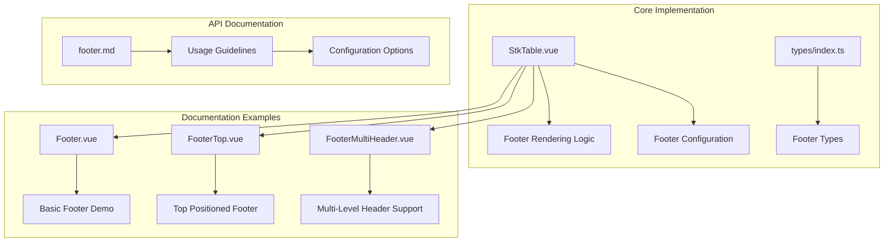
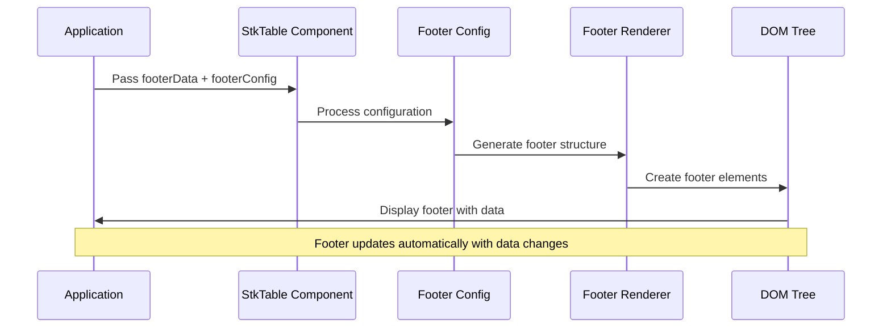
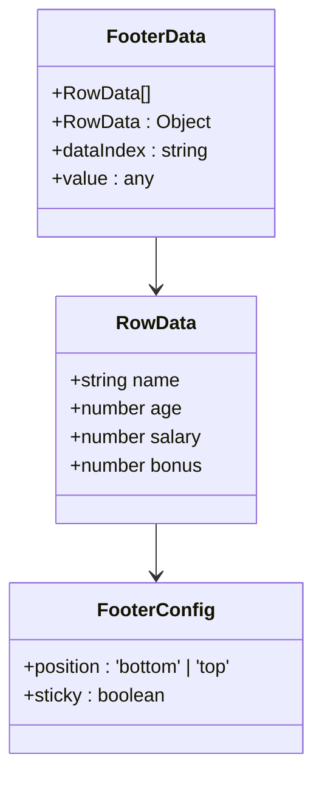
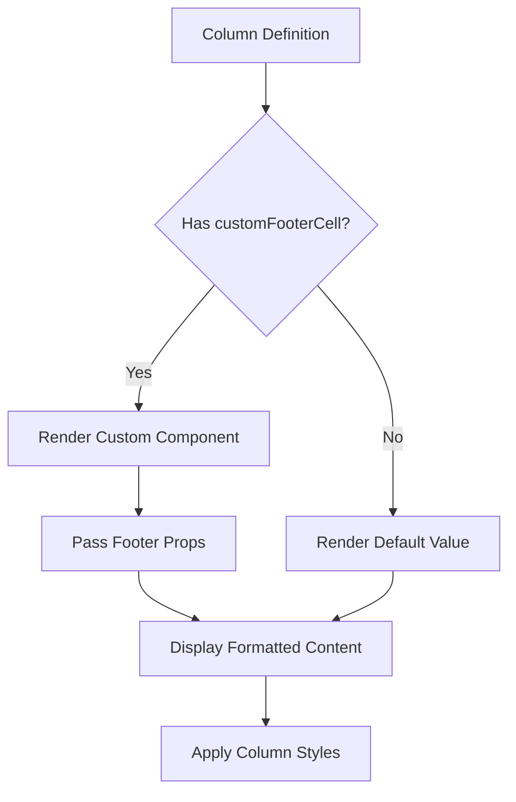
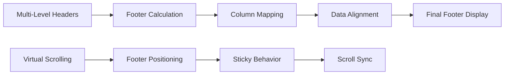
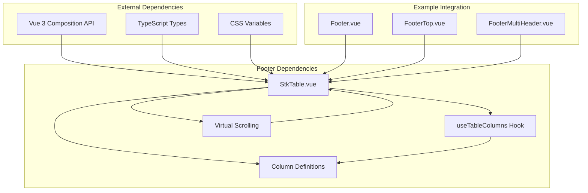

# Footer Data Support

<cite>
**Referenced Files in This Document**
- [StkTable.vue](file://src/StkTable/StkTable.vue)
- [Footer.vue](file://docs-demo/basic/footer/Footer.vue)
- [FooterTop.vue](file://docs-demo/basic/footer/FooterTop.vue)
- [FooterMultiHeader.vue](file://docs-demo/basic/footer/FooterMultiHeader.vue)
- [index.ts](file://src/StkTable/types/index.ts)
- [footer.md](file://docs-src/main/table/basic/footer.md)
</cite>

## Table of Contents
1. [Introduction](#introduction)
2. [Project Structure](#project-structure)
3. [Core Components](#core-components)
4. [Architecture Overview](#architecture-overview)
5. [Detailed Component Analysis](#detailed-component-analysis)
6. [Dependency Analysis](#dependency-analysis)
7. [Performance Considerations](#performance-considerations)
8. [Troubleshooting Guide](#troubleshooting-guide)
9. [Conclusion](#conclusion)

## Introduction

Footer Data Support is a feature in the stk-table-vue library that enables displaying summary rows at the bottom of tables. This functionality allows developers to present calculated totals, averages, or other aggregated data alongside the main table content. The feature supports both bottom and top positioning, custom styling through customFooterCell components, and works seamlessly with multi-level headers and virtual scrolling scenarios.

## Project Structure

The footer data support implementation spans across multiple files in the stk-table-vue project:

**Diagram sources**
- [StkTable.vue:105-130](file://src/StkTable/StkTable.vue#L105-L130)
- [index.ts:383-391](file://src/StkTable/types/index.ts#L383-L391)

**Section sources**
- [StkTable.vue:105-130](file://src/StkTable/StkTable.vue#L105-L130)
- [Footer.vue:1-88](file://docs-demo/basic/footer/Footer.vue#L1-L88)
- [FooterTop.vue:1-88](file://docs-demo/basic/footer/FooterTop.vue#L1-L88)
- [FooterMultiHeader.vue:1-74](file://docs-demo/basic/footer/FooterMultiHeader.vue#L1-L74)

## Core Components

The footer data support system consists of several key components working together:

### Footer Configuration System
The footer system is controlled through two main properties:
- `footerData`: Array containing footer row data
- `footerConfig`: Configuration object controlling footer positioning

### Footer Rendering Engine
The rendering engine dynamically generates footer markup based on:
- Column definitions from the main table
- Footer data arrays
- Virtual scrolling compatibility
- Multi-level header support

### Custom Footer Cell Support
Each column can define custom footer cell rendering through the `customFooterCell` property, enabling specialized formatting and styling for footer content.

**Section sources**
- [StkTable.vue:477-480](file://src/StkTable/StkTable.vue#L477-L480)
- [StkTable.vue:105-130](file://src/StkTable/StkTable.vue#L105-L130)
- [index.ts:127-136](file://src/StkTable/types/index.ts#L127-L136)

## Architecture Overview

The footer data support follows a modular architecture pattern within the StkTable component:

**Diagram sources**
- [StkTable.vue:105-130](file://src/StkTable/StkTable.vue#L105-L130)
- [Footer.vue:37-77](file://docs-demo/basic/footer/Footer.vue#L37-L77)

The architecture ensures seamless integration with existing table functionality while maintaining separation of concerns between configuration, rendering, and data management.

## Detailed Component Analysis

### Footer Data Structure

The footer data system uses a flexible array-based approach where each element represents a footer row:

**Diagram sources**
- [Footer.vue:7-13](file://docs-demo/basic/footer/Footer.vue#L7-L13)
- [index.ts:383-391](file://src/StkTable/types/index.ts#L383-L391)

### Footer Positioning System

The positioning system supports two modes controlled by the `position` property:

| Position | Behavior | Use Case |
|----------|----------|----------|
| 'bottom' | Standard footer at table bottom | Default usage, summaries |
| 'top' | Sticky footer at table top | Header-like summaries |

### Custom Footer Cell Implementation

The `customFooterCell` property enables sophisticated footer rendering:

**Diagram sources**
- [index.ts:127-136](file://src/StkTable/types/index.ts#L127-L136)
- [StkTable.vue:114-127](file://src/StkTable/StkTable.vue#L114-L127)

**Section sources**
- [Footer.vue:16-22](file://docs-demo/basic/footer/Footer.vue#L16-L22)
- [FooterTop.vue:16-22](file://docs-demo/basic/footer/FooterTop.vue#L16-L22)
- [FooterMultiHeader.vue:15-28](file://docs-demo/basic/footer/FooterMultiHeader.vue#L15-L28)

### Multi-Level Header Compatibility

The footer system seamlessly integrates with complex table structures:

**Diagram sources**
- [FooterMultiHeader.vue:46-54](file://docs-demo/basic/footer/FooterMultiHeader.vue#L46-L54)
- [StkTable.vue:105-130](file://src/StkTable/StkTable.vue#L105-L130)

**Section sources**
- [FooterMultiHeader.vue:44-54](file://docs-demo/basic/footer/FooterMultiHeader.vue#L44-L54)

## Dependency Analysis

The footer data support system maintains loose coupling with other table features:

**Diagram sources**
- [StkTable.vue:325-537](file://src/StkTable/StkTable.vue#L325-L537)
- [index.ts:63-141](file://src/StkTable/types/index.ts#L63-L141)

The dependency structure ensures maintainability while allowing for future enhancements without breaking existing functionality.

**Section sources**
- [StkTable.vue:325-537](file://src/StkTable/StkTable.vue#L325-L537)
- [index.ts:63-141](file://src/StkTable/types/index.ts#L63-L141)

## Performance Considerations

The footer data support system is optimized for performance through several mechanisms:

### Efficient Rendering
- Virtual DOM updates only when footer data changes
- Minimal re-computation of column layouts
- Optimized style calculations for footer elements

### Memory Management
- WeakMap-based caching for row keys
- Efficient column key generation
- Lazy evaluation of footer calculations

### Virtual Scrolling Integration
- Automatic footer positioning during scroll events
- Maintains footer stickiness across large datasets
- Optimized rendering for virtualized table content

## Troubleshooting Guide

Common issues and solutions when implementing footer data support:

### Footer Not Displaying
**Symptoms**: Footer data appears but footer rows are not visible
**Causes**: 
- Empty footerData array
- Incorrect dataIndex mapping
- Column width conflicts in virtual mode

**Solutions**:
- Verify footerData contains valid objects
- Ensure dataIndex matches column definitions
- Check column widths for virtual scrolling compatibility

### Positioning Issues
**Symptoms**: Footer appears in wrong location or moves unexpectedly
**Causes**:
- Incorrect footerConfig.position value
- Conflicts with other sticky elements
- Dynamic height changes

**Solutions**:
- Set position to 'bottom' or 'top' explicitly
- Review CSS z-index stacking context
- Monitor container height changes

### Performance Problems
**Symptoms**: Slow rendering with large datasets
**Causes**:
- Excessive footerData updates
- Complex customFooterCell components
- Frequent re-renders

**Solutions**:
- Batch footerData updates
- Optimize custom component rendering
- Use computed properties for derived data

**Section sources**
- [Footer.vue:37-77](file://docs-demo/basic/footer/Footer.vue#L37-L77)
- [FooterTop.vue:37-77](file://docs-demo/basic/footer/FooterTop.vue#L37-L77)
- [FooterMultiHeader.vue:44-54](file://docs-demo/basic/footer/FooterMultiHeader.vue#L44-L54)

## Conclusion

Footer Data Support in stk-table-vue provides a robust, flexible solution for displaying summary information in table interfaces. The implementation offers:

- **Seamless Integration**: Works with all existing table features
- **Flexible Positioning**: Supports both top and bottom placement
- **Custom Rendering**: Extensive customization through customFooterCell
- **Performance Optimization**: Efficient rendering and memory management
- **Multi-Level Header Support**: Compatible with complex table structures

The feature enhances the usability of data tables by providing immediate access to calculated summaries while maintaining the performance and flexibility required for modern web applications. Developers can easily implement footer data support by following the documented patterns and leveraging the provided examples as starting points.