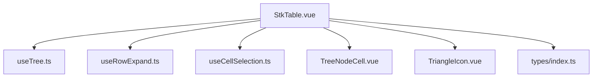
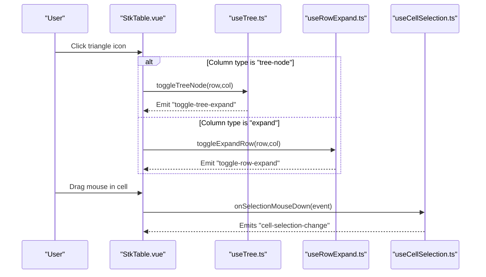
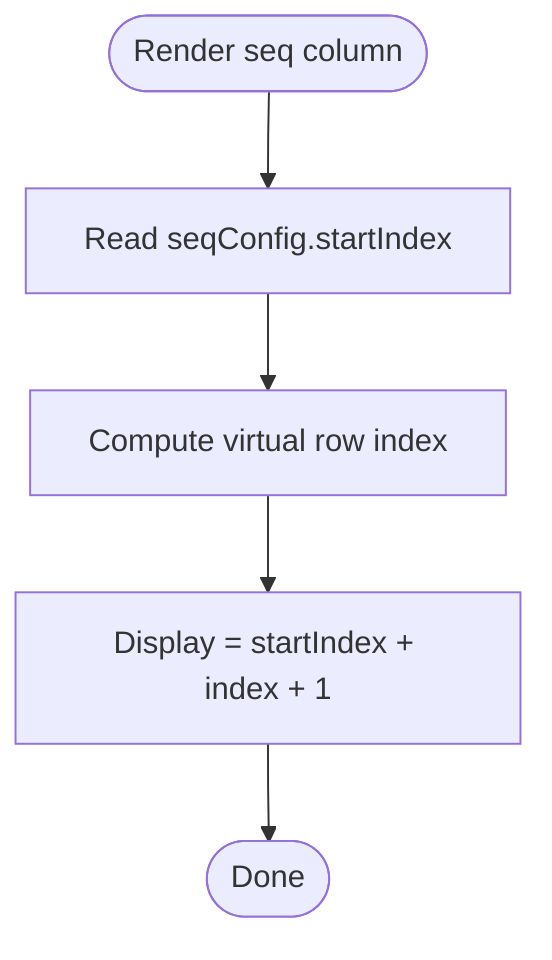
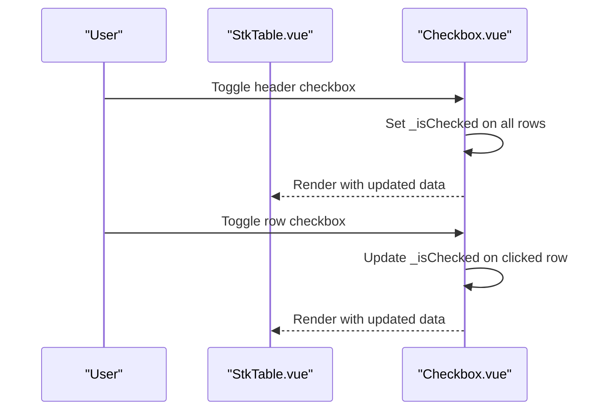
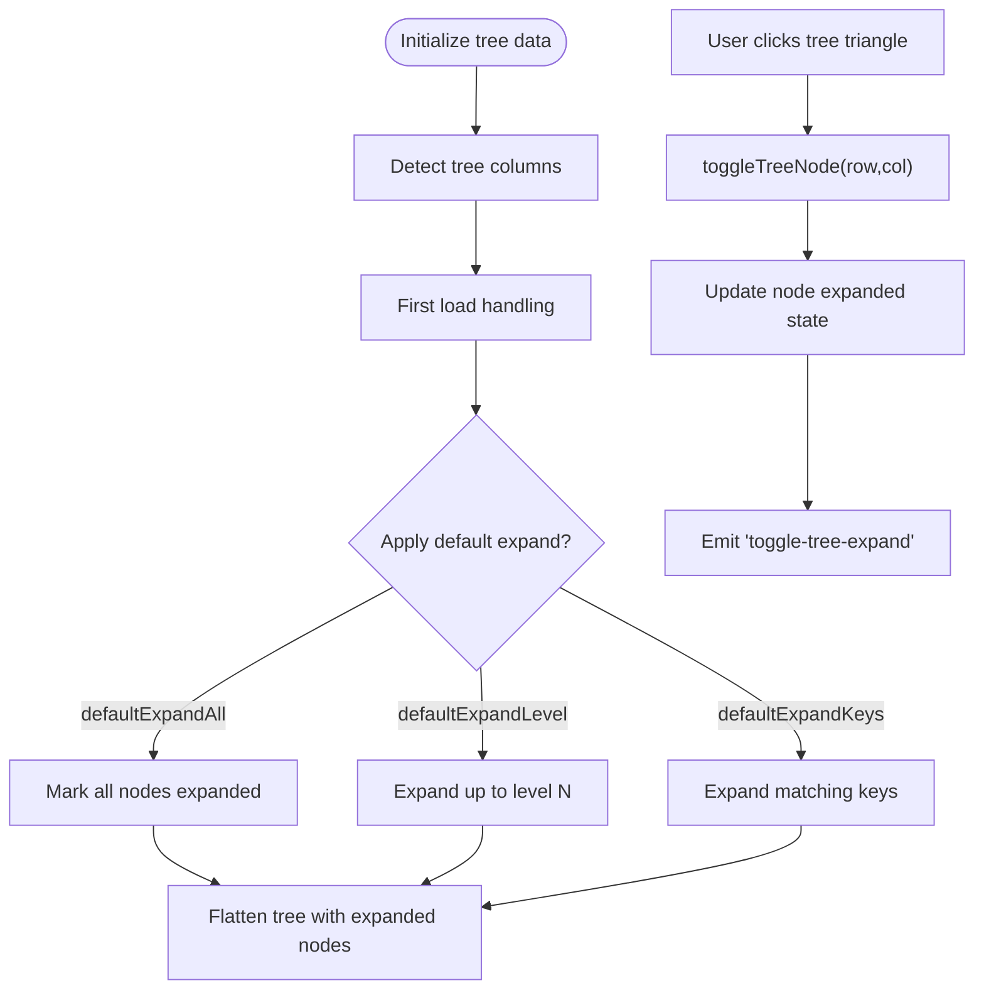
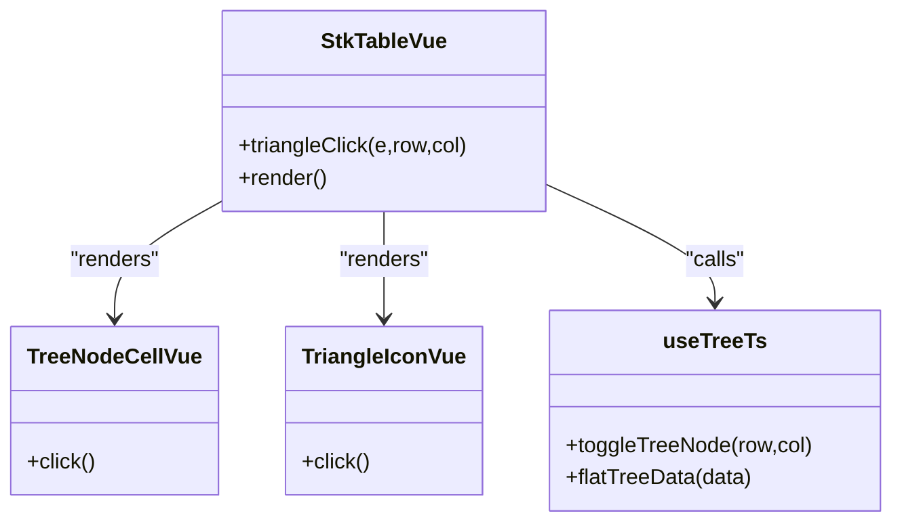
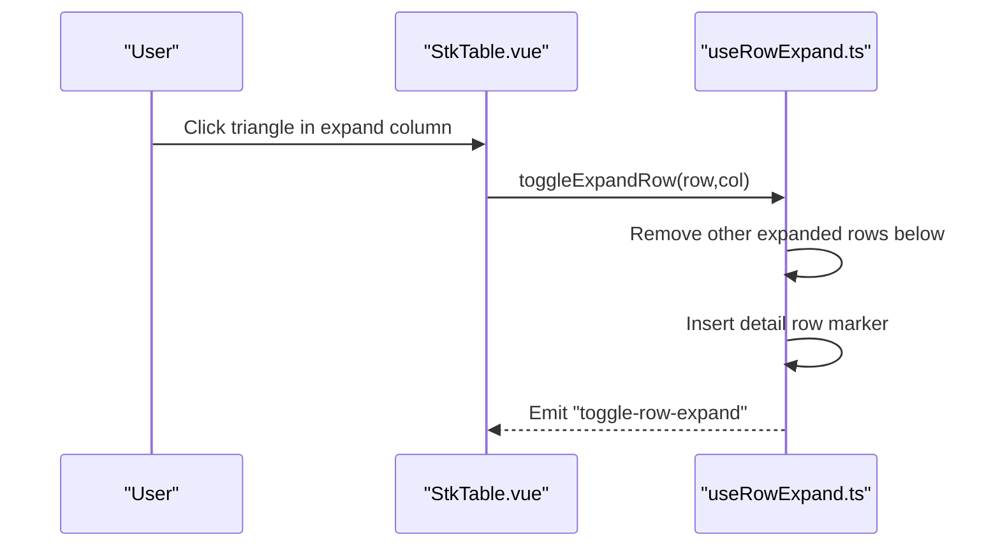
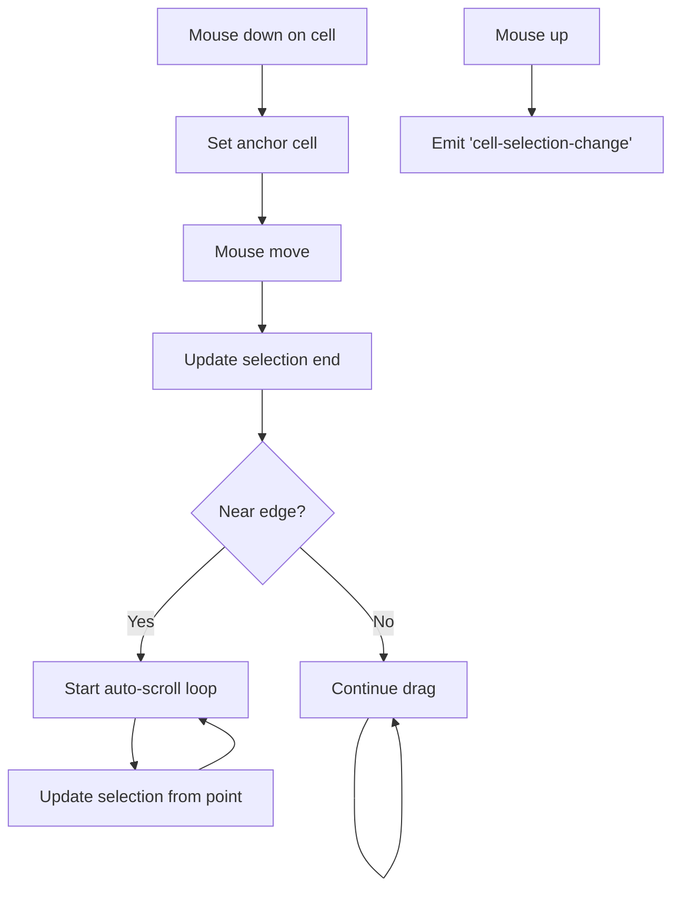
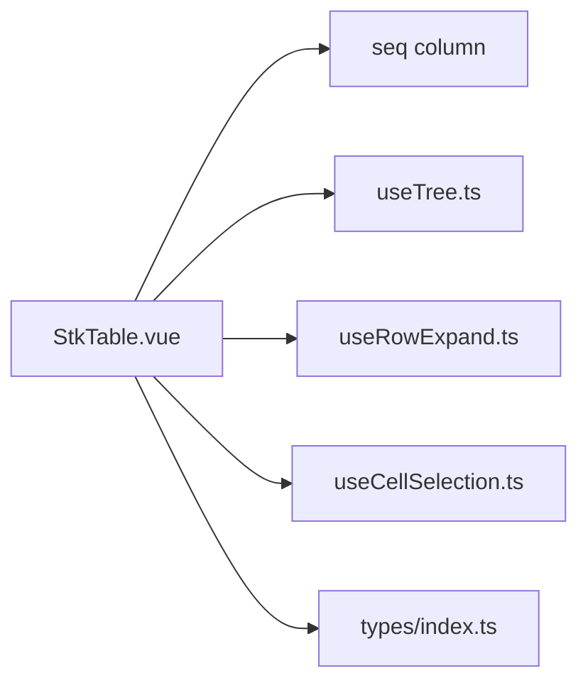

# Interaction Controls

<cite>
**Referenced Files in This Document**
- [StkTable.vue](file://src/StkTable/StkTable.vue)
- [useTree.ts](file://src/StkTable/useTree.ts)
- [useRowExpand.ts](file://src/StkTable/useRowExpand.ts)
- [useCellSelection.ts](file://src/StkTable/useCellSelection.ts)
- [types/index.ts](file://src/StkTable/types/index.ts)
- [TreeNodeCell.vue](file://src/StkTable/components/TreeNodeCell.vue)
- [TriangleIcon.vue](file://src/StkTable/components/TriangleIcon.vue)
- [Seq.vue](file://docs-demo/basic/seq/Seq.vue)
- [SeqStartIndex.vue](file://docs-demo/basic/seq/SeqStartIndex.vue)
- [Checkbox.vue](file://docs-demo/basic/checkbox/Checkbox.vue)
- [Tree.vue](file://docs-demo/basic/tree/Tree.vue)
- [TreeDefaultExpandAll.vue](file://docs-demo/basic/tree/TreeDefaultExpandAll.vue)
- [TreeDefaultExpandKeys.vue](file://docs-demo/basic/tree/TreeDefaultExpandKeys.vue)
- [TreeDefaultExpandLevel.vue](file://docs-demo/basic/tree/TreeDefaultExpandLevel.vue)
- [TreeVirtualList.vue](file://docs-demo/basic/tree/TreeVirtualList.vue)
</cite>

## Table of Contents
1. [Introduction](#introduction)
2. [Project Structure](#project-structure)
3. [Core Components](#core-components)
4. [Architecture Overview](#architecture-overview)
5. [Detailed Component Analysis](#detailed-component-analysis)
6. [Dependency Analysis](#dependency-analysis)
7. [Performance Considerations](#performance-considerations)
8. [Troubleshooting Guide](#troubleshooting-guide)
9. [Conclusion](#conclusion)
10. [Appendices](#appendices)

## Introduction
This document explains the interaction controls in Stk Table Vue with a focus on:
- Sequence numbering with configurable starting indices and custom numbering schemes
- Checkbox selection for row selection and multi-selection scenarios
- Tree data structure implementation including expand/collapse behavior, default expansion options, and virtual scrolling for large tree datasets

It also provides practical examples for implementing numbered rows, checkbox selection, and hierarchical tree structures with various expansion strategies.

## Project Structure
The interaction controls are implemented as composable modules integrated into the main table component. The table component orchestrates:
- Sequence column rendering and numbering calculation
- Tree node expansion and flattening
- Row expansion for detail rows
- Cell selection via drag and keyboard shortcuts
- Virtual scrolling for large datasets

**Diagram sources**
- [StkTable.vue](file://src/StkTable/StkTable.vue#L850-L860)
- [useTree.ts](file://src/StkTable/useTree.ts#L12-L161)
- [useRowExpand.ts](file://src/StkTable/useRowExpand.ts#L11-L88)
- [useCellSelection.ts](file://src/StkTable/useCellSelection.ts#L42-L456)
- [TreeNodeCell.vue](file://src/StkTable/components/TreeNodeCell.vue)
- [TriangleIcon.vue](file://src/StkTable/components/TriangleIcon.vue)
- [types/index.ts](file://src/StkTable/types/index.ts#L235-L261)

**Section sources**
- [StkTable.vue](file://src/StkTable/StkTable.vue#L850-L860)
- [types/index.ts](file://src/StkTable/types/index.ts#L235-L261)

## Core Components
- Sequence numbering: Implemented via a dedicated column type and a configuration option for the starting index.
- Tree controls: Managed by a tree composable that handles expand/collapse, flattening, and default expansion strategies.
- Row expansion: Supports expanding a detail row beneath a base row.
- Cell selection: Provides drag-to-select ranges, keyboard shortcuts, and auto-scroll near edges.

**Section sources**
- [StkTable.vue](file://src/StkTable/StkTable.vue#L157-L169)
- [types/index.ts](file://src/StkTable/types/index.ts#L235-L261)
- [useTree.ts](file://src/StkTable/useTree.ts#L12-L161)
- [useRowExpand.ts](file://src/StkTable/useRowExpand.ts#L11-L88)
- [useCellSelection.ts](file://src/StkTable/useCellSelection.ts#L42-L456)

## Architecture Overview
The table component wires together multiple interaction modules. The sequence column reads a configuration for the starting index and computes the displayed number per row. Tree operations rely on a flattening pass that respects default expansion options. Row expansion inserts a special detail row. Cell selection tracks a selection range and applies styles during drag.

**Diagram sources**
- [StkTable.vue](file://src/StkTable/StkTable.vue#L1337-L1343)
- [useTree.ts](file://src/StkTable/useTree.ts#L17-L20)
- [useRowExpand.ts](file://src/StkTable/useRowExpand.ts#L18-L21)
- [useCellSelection.ts](file://src/StkTable/useCellSelection.ts#L137-L172)

## Detailed Component Analysis

### Sequence Numbering
Sequence numbering is implemented as a column type with a configuration option for the starting index. The table renders the sequence column by combining the configured start index with the virtualized row index.

Key behaviors:
- Column type: seq
- Config: startIndex (defaults to 0)
- Rendering: The displayed number equals startIndex + virtual row index + 1

Implementation highlights:
- Column type definition supports seq
- Sequence rendering logic uses props.seqConfig.startIndex and the computed row index
- Examples demonstrate default and custom starting indices

**Diagram sources**
- [StkTable.vue](file://src/StkTable/StkTable.vue#L157-L159)
- [types/index.ts](file://src/StkTable/types/index.ts#L235-L241)

Practical examples:
- Default sequence numbering: [Seq.vue](file://docs-demo/basic/seq/Seq.vue#L9-L15)
- Custom starting index: [SeqStartIndex.vue](file://docs-demo/basic/seq/SeqStartIndex.vue#L31-L35)

**Section sources**
- [StkTable.vue](file://src/StkTable/StkTable.vue#L157-L159)
- [types/index.ts](file://src/StkTable/types/index.ts#L235-L241)
- [Seq.vue](file://docs-demo/basic/seq/Seq.vue#L9-L15)
- [SeqStartIndex.vue](file://docs-demo/basic/seq/SeqStartIndex.vue#L31-L35)

### Checkbox Selection (Row Selection and Multi-Selection)
Checkbox selection is implemented using custom header and cell renderers. The examples show:
- A checkbox column with a custom header that supports “select all” and “indeterminate” states
- Per-row checkboxes bound to a flag in the data
- Computed selections for UI feedback

Key behaviors:
- Column type: custom renderer (checkbox)
- Full selection: computed flag checks all items
- Partial selection: computed flag indicates indeterminate state
- Selected items: computed list filters items by the selection flag

**Diagram sources**
- [Checkbox.vue](file://docs-demo/basic/checkbox/Checkbox.vue#L66-L81)
- [Checkbox.vue](file://docs-demo/basic/checkbox/Checkbox.vue#L82-L92)

Practical example:
- Checkbox selection demo: [Checkbox.vue](file://docs-demo/basic/checkbox/Checkbox.vue#L60-L97)

**Section sources**
- [Checkbox.vue](file://docs-demo/basic/checkbox/Checkbox.vue#L47-L58)
- [Checkbox.vue](file://docs-demo/basic/checkbox/Checkbox.vue#L66-L92)

### Tree Data Structure and Expand/Collapse
Tree support is implemented by a dedicated composable that:
- Flattens hierarchical data according to expansion state
- Handles expand/collapse toggles
- Applies default expansion strategies (all, keys, or level)
- Emits events for external handling

**Diagram sources**
- [useTree.ts](file://src/StkTable/useTree.ts#L12-L161)
- [StkTable.vue](file://src/StkTable/StkTable.vue#L924-L931)

Default expansion strategies:
- Expand all: [TreeDefaultExpandAll.vue](file://docs-demo/basic/tree/TreeDefaultExpandAll.vue#L9-L11)
- Expand by keys: [TreeDefaultExpandKeys.vue](file://docs-demo/basic/tree/TreeDefaultExpandKeys.vue#L10-L12)
- Expand by level: [TreeDefaultExpandLevel.vue](file://docs-demo/basic/tree/TreeDefaultExpandLevel.vue#L9-L11)

Tree configuration options:
- defaultExpandAll
- defaultExpandKeys
- defaultExpandLevel

**Section sources**
- [useTree.ts](file://src/StkTable/useTree.ts#L12-L161)
- [types/index.ts](file://src/StkTable/types/index.ts#L255-L260)
- [TreeDefaultExpandAll.vue](file://docs-demo/basic/tree/TreeDefaultExpandAll.vue#L9-L11)
- [TreeDefaultExpandKeys.vue](file://docs-demo/basic/tree/TreeDefaultExpandKeys.vue#L10-L12)
- [TreeDefaultExpandLevel.vue](file://docs-demo/basic/tree/TreeDefaultExpandLevel.vue#L9-L11)

### Tree Rendering and Icons
Tree rendering integrates a specialized cell component and triangle icon. The table routes triangle clicks to the tree toggle handler when the column type is tree-node.

**Diagram sources**
- [StkTable.vue](file://src/StkTable/StkTable.vue#L1337-L1343)
- [TreeNodeCell.vue](file://src/StkTable/components/TreeNodeCell.vue)
- [TriangleIcon.vue](file://src/StkTable/components/TriangleIcon.vue)
- [useTree.ts](file://src/StkTable/useTree.ts#L17-L20)

**Section sources**
- [StkTable.vue](file://src/StkTable/StkTable.vue#L1337-L1343)
- [TreeNodeCell.vue](file://src/StkTable/components/TreeNodeCell.vue)
- [TriangleIcon.vue](file://src/StkTable/components/TriangleIcon.vue)
- [useTree.ts](file://src/StkTable/useTree.ts#L17-L20)

### Row Expansion (Detail Rows)
Row expansion allows inserting a detail row immediately below a base row. The composable manages insertion/removal of the detail row and emits events.

Key behaviors:
- Column type: expand
- Toggle: sets/unsets the expanded state for the row
- Insertion: adds a special row marker with the original row and column reference
- Emission: fires a toggle-row-expand event

**Diagram sources**
- [StkTable.vue](file://src/StkTable/StkTable.vue#L1337-L1343)
- [useRowExpand.ts](file://src/StkTable/useRowExpand.ts#L18-L21)
- [useRowExpand.ts](file://src/StkTable/useRowExpand.ts#L64-L72)

**Section sources**
- [useRowExpand.ts](file://src/StkTable/useRowExpand.ts#L11-L88)

### Cell Selection (Drag-to-Select, Copy, and Auto-Scroll)
Cell selection enables:
- Drag-to-select rectangular ranges
- Shift-based extension of selection
- Keyboard shortcuts (Esc to clear, Ctrl/Cmd+C to copy)
- Auto-scroll near edges while dragging

Highlights:
- Range normalization to min/max bounds
- Selection classes applied to cells in the range
- Clipboard formatting via optional callback
- Edge detection and requestAnimationFrame-based scrolling

**Diagram sources**
- [useCellSelection.ts](file://src/StkTable/useCellSelection.ts#L137-L172)
- [useCellSelection.ts](file://src/StkTable/useCellSelection.ts#L217-L282)
- [useCellSelection.ts](file://src/StkTable/useCellSelection.ts#L333-L345)

**Section sources**
- [useCellSelection.ts](file://src/StkTable/useCellSelection.ts#L42-L456)

### Example Implementations
- Numbered rows:
  - Default sequence: [Seq.vue](file://docs-demo/basic/seq/Seq.vue#L9-L15)
  - Custom start index: [SeqStartIndex.vue](file://docs-demo/basic/seq/SeqStartIndex.vue#L31-L35)
- Checkbox selection:
  - [Checkbox.vue](file://docs-demo/basic/checkbox/Checkbox.vue#L60-L97)
- Hierarchical tree structures:
  - Basic tree: [Tree.vue](file://docs-demo/basic/tree/Tree.vue#L10-L15)
  - Expand all: [TreeDefaultExpandAll.vue](file://docs-demo/basic/tree/TreeDefaultExpandAll.vue#L9-L11)
  - Expand by keys: [TreeDefaultExpandKeys.vue](file://docs-demo/basic/tree/TreeDefaultExpandKeys.vue#L10-L12)
  - Expand by level: [TreeDefaultExpandLevel.vue](file://docs-demo/basic/tree/TreeDefaultExpandLevel.vue#L9-L11)
  - Large tree with virtual scrolling: [TreeVirtualList.vue](file://docs-demo/basic/tree/TreeVirtualList.vue#L56-L63)

**Section sources**
- [Seq.vue](file://docs-demo/basic/seq/Seq.vue#L9-L15)
- [SeqStartIndex.vue](file://docs-demo/basic/seq/SeqStartIndex.vue#L31-L35)
- [Checkbox.vue](file://docs-demo/basic/checkbox/Checkbox.vue#L60-L97)
- [Tree.vue](file://docs-demo/basic/tree/Tree.vue#L10-L15)
- [TreeDefaultExpandAll.vue](file://docs-demo/basic/tree/TreeDefaultExpandAll.vue#L9-L11)
- [TreeDefaultExpandKeys.vue](file://docs-demo/basic/tree/TreeDefaultExpandKeys.vue#L10-L12)
- [TreeDefaultExpandLevel.vue](file://docs-demo/basic/tree/TreeDefaultExpandLevel.vue#L9-L11)
- [TreeVirtualList.vue](file://docs-demo/basic/tree/TreeVirtualList.vue#L56-L63)

## Dependency Analysis
The table component composes multiple interaction modules. The sequence column depends on configuration; tree operations depend on default expansion options; row expansion and cell selection operate independently but integrate through the table’s event system.

**Diagram sources**
- [StkTable.vue](file://src/StkTable/StkTable.vue#L850-L860)
- [types/index.ts](file://src/StkTable/types/index.ts#L235-L261)

**Section sources**
- [StkTable.vue](file://src/StkTable/StkTable.vue#L850-L860)
- [types/index.ts](file://src/StkTable/types/index.ts#L235-L261)

## Performance Considerations
- Virtual scrolling is essential for large tree datasets. The tree flattening occurs once per data initialization and during sorting to keep the dataset linear for the virtualizer.
- Auto-scroll during drag selection uses requestAnimationFrame to avoid layout thrashing.
- Row height can be customized for expanded rows in virtual mode to maintain accurate virtualization.

[No sources needed since this section provides general guidance]

## Troubleshooting Guide
Common issues and resolutions:
- Tree expand failures: The tree composable logs warnings when a row key is not found during expansion attempts. Ensure row keys are present and match the configured row key generator.
- Unexpected selection clearing: Keyboard shortcut Esc clears the selection. Verify that the table container has focus if you rely on keyboard shortcuts.
- Multi-level headers with horizontal virtualization: Multi-level headers are not supported with horizontal virtualization; the table logs an error to prevent invalid configurations.

**Section sources**
- [useTree.ts](file://src/StkTable/useTree.ts#L42-L45)
- [useCellSelection.ts](file://src/StkTable/useCellSelection.ts#L361-L366)
- [StkTable.vue](file://src/StkTable/StkTable.vue#L965-L967)

## Conclusion
Stk Table Vue provides robust interaction controls:
- Sequence numbering is flexible with a configurable starting index
- Tree structures support expand/collapse, default expansion strategies, and virtual scrolling for large datasets
- Row expansion and cell selection offer ergonomic UX patterns
- The modular architecture keeps these features cohesive and easy to configure

[No sources needed since this section summarizes without analyzing specific files]

## Appendices
- Configuration reference:
  - Sequence: startIndex
  - Tree: defaultExpandAll, defaultExpandKeys, defaultExpandLevel
- Events:
  - toggle-tree-expand
  - toggle-row-expand
  - cell-selection-change

**Section sources**
- [types/index.ts](file://src/StkTable/types/index.ts#L235-L261)
- [StkTable.vue](file://src/StkTable/StkTable.vue#L604-L616)