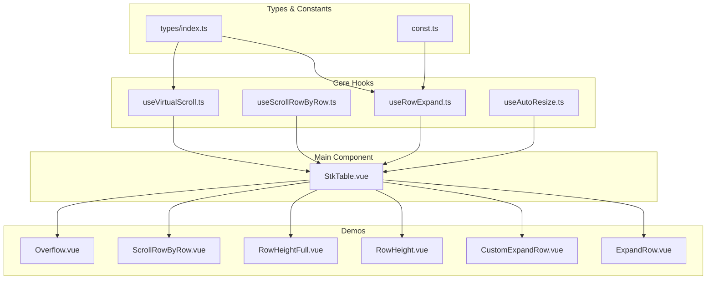
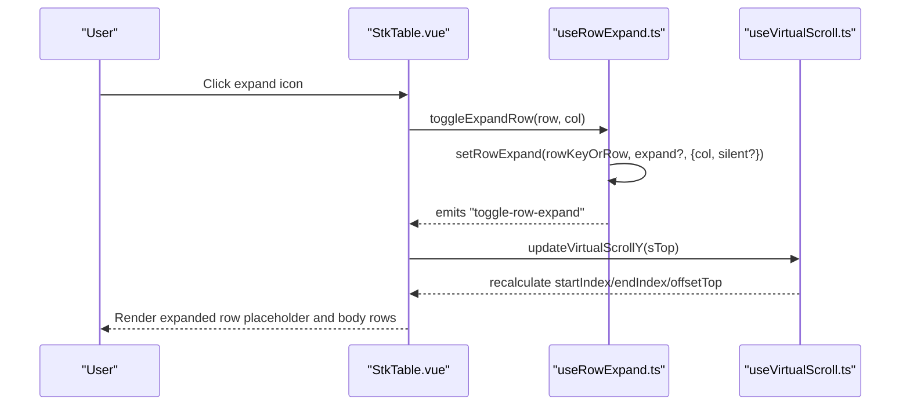
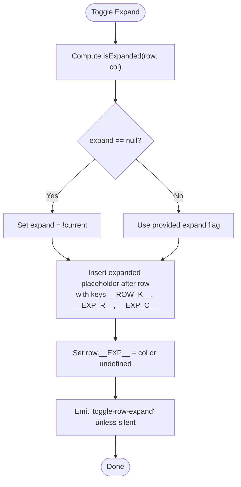
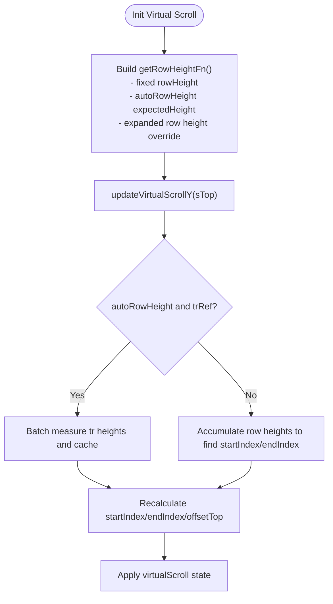
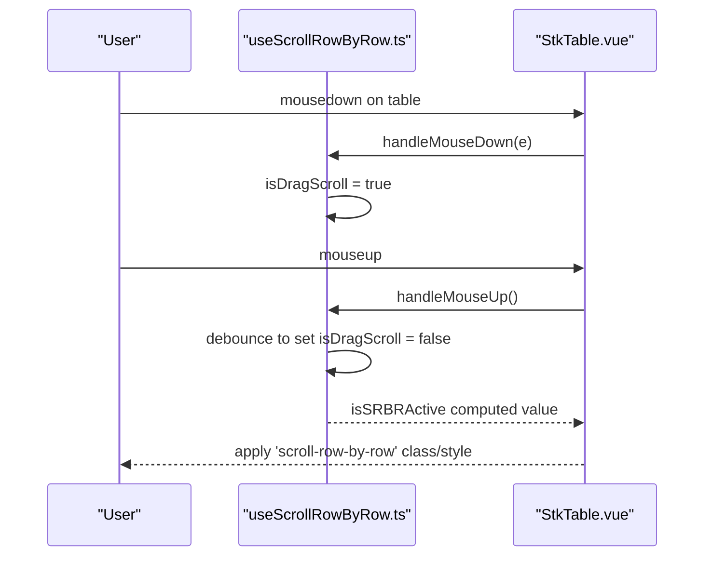
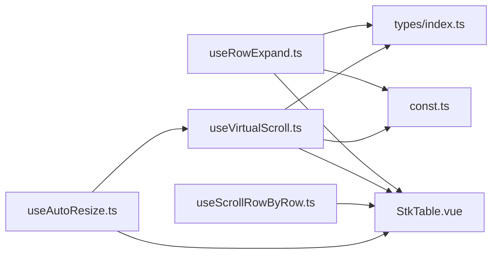

# Row Behavior

<cite>
**Referenced Files in This Document**
- [useRowExpand.ts](file://src/StkTable/useRowExpand.ts)
- [useScrollRowByRow.ts](file://src/StkTable/useScrollRowByRow.ts)
- [useVirtualScroll.ts](file://src/StkTable/useVirtualScroll.ts)
- [useAutoResize.ts](file://src/StkTable/useAutoResize.ts)
- [types/index.ts](file://src/StkTable/types/index.ts)
- [const.ts](file://src/StkTable/const.ts)
- [StkTable.vue](file://src/StkTable/StkTable.vue)
- [ExpandRow.vue](file://docs-demo/basic/expand-row/ExpandRow.vue)
- [CustomExpandRow.vue](file://docs-demo/basic/expand-row/CustomExpandRow.vue)
- [RowHeight.vue](file://docs-demo/basic/row-height/RowHeight.vue)
- [RowHeightFull.vue](file://docs-demo/basic/row-height/RowHeightFull.vue)
- [ScrollRowByRow.vue](file://docs-demo/basic/scroll-row-by-row/ScrollRowByRow.vue)
- [Overflow.vue](file://docs-demo/basic/overflow/Overflow.vue)
</cite>

## Table of Contents
1. [Introduction](#introduction)
2. [Project Structure](#project-structure)
3. [Core Components](#core-components)
4. [Architecture Overview](#architecture-overview)
5. [Detailed Component Analysis](#detailed-component-analysis)
6. [Dependency Analysis](#dependency-analysis)
7. [Performance Considerations](#performance-considerations)
8. [Troubleshooting Guide](#troubleshooting-guide)
9. [Conclusion](#conclusion)
10. [Appendices](#appendices)

## Introduction
This document explains row behavior features in Stk Table Vue, focusing on:
- Expandable rows: default expand behavior and custom expand components
- Row height management: fixed heights and auto-adjusting heights
- Scroll behavior: row-by-row scrolling for improved UX
- Overflow handling for content exceeding cell boundaries

It provides implementation guidance, code-level insights, and practical examples drawn from the repository’s demos and core modules.

## Project Structure
The row behavior features are implemented via composable hooks and integrated into the main table component. Demos illustrate usage patterns for expandable rows, row height configuration, scroll-by-row behavior, and overflow handling.

**Diagram sources**
- [useRowExpand.ts](file://src/StkTable/useRowExpand.ts#L1-L89)
- [useScrollRowByRow.ts](file://src/StkTable/useScrollRowByRow.ts#L1-L114)
- [useVirtualScroll.ts](file://src/StkTable/useVirtualScroll.ts#L1-L499)
- [useAutoResize.ts](file://src/StkTable/useAutoResize.ts#L1-L92)
- [types/index.ts](file://src/StkTable/types/index.ts#L1-L318)
- [const.ts](file://src/StkTable/const.ts#L1-L51)
- [StkTable.vue](file://src/StkTable/StkTable.vue#L1-L200)
- [ExpandRow.vue](file://docs-demo/basic/expand-row/ExpandRow.vue#L1-L55)
- [CustomExpandRow.vue](file://docs-demo/basic/expand-row/CustomExpandRow.vue#L1-L109)
- [RowHeight.vue](file://docs-demo/basic/row-height/RowHeight.vue#L1-L48)
- [RowHeightFull.vue](file://docs-demo/basic/row-height/RowHeightFull.vue#L1-L43)
- [ScrollRowByRow.vue](file://docs-demo/basic/scroll-row-by-row/ScrollRowByRow.vue#L1-L51)
- [Overflow.vue](file://docs-demo/basic/overflow/Overflow.vue#L1-L73)

**Section sources**
- [StkTable.vue](file://src/StkTable/StkTable.vue#L1-L200)
- [useRowExpand.ts](file://src/StkTable/useRowExpand.ts#L1-L89)
- [useScrollRowByRow.ts](file://src/StkTable/useScrollRowByRow.ts#L1-L114)
- [useVirtualScroll.ts](file://src/StkTable/useVirtualScroll.ts#L1-L499)
- [useAutoResize.ts](file://src/StkTable/useAutoResize.ts#L1-L92)
- [types/index.ts](file://src/StkTable/types/index.ts#L1-L318)
- [const.ts](file://src/StkTable/const.ts#L1-L51)

## Core Components
- Expandable rows: managed by a dedicated hook that toggles expanded state and inserts/removes the expanded row placeholder into the data source.
- Row height management: supports fixed row height and auto-adjusting heights with expected height estimation and per-row measurement.
- Scroll behavior: row-by-row scrolling can be activated globally or triggered only by dragging the scrollbar, with debounced state transitions.
- Overflow handling: configurable visibility of truncated content in cells and headers.

**Section sources**
- [useRowExpand.ts](file://src/StkTable/useRowExpand.ts#L11-L88)
- [useVirtualScroll.ts](file://src/StkTable/useVirtualScroll.ts#L178-L190)
- [useScrollRowByRow.ts](file://src/StkTable/useScrollRowByRow.ts#L8-L114)
- [types/index.ts](file://src/StkTable/types/index.ts#L243-L247)

## Architecture Overview
The main table component orchestrates rendering, virtualization, and user interactions. Hooks encapsulate cross-cutting concerns:
- Expandable rows: insert/remove expanded placeholders and emit events
- Virtual scroll: compute visible range, offsets, and row heights
- Auto resize: reinitialize virtual scroll on container size changes
- Scroll row-by-row: manage activation and mouse interaction state

**Diagram sources**
- [StkTable.vue](file://src/StkTable/StkTable.vue#L1-L200)
- [useRowExpand.ts](file://src/StkTable/useRowExpand.ts#L11-L88)
- [useVirtualScroll.ts](file://src/StkTable/useVirtualScroll.ts#L274-L407)

## Detailed Component Analysis

### Expandable Rows
- Default expand behavior: clicking the expand column toggles expansion for the clicked row. The hook ensures only one expanded row exists below the target row and emits a toggle event.
- Custom expand components: the table renders a slot for the expanded content and supports custom expand cells with per-column triggers. Expanded row height can be configured.

**Diagram sources**
- [useRowExpand.ts](file://src/StkTable/useRowExpand.ts#L14-L82)
- [const.ts](file://src/StkTable/const.ts#L34-L35)

Practical examples:
- Default expandable rows with a dedicated expand column and slot content
  - [ExpandRow.vue](file://docs-demo/basic/expand-row/ExpandRow.vue#L13-L52)
- Custom expand cells with per-column triggers and programmatic control
  - [CustomExpandRow.vue](file://docs-demo/basic/expand-row/CustomExpandRow.vue#L14-L87)

**Section sources**
- [useRowExpand.ts](file://src/StkTable/useRowExpand.ts#L11-L88)
- [const.ts](file://src/StkTable/const.ts#L34-L35)
- [ExpandRow.vue](file://docs-demo/basic/expand-row/ExpandRow.vue#L13-L52)
- [CustomExpandRow.vue](file://docs-demo/basic/expand-row/CustomExpandRow.vue#L14-L87)

### Row Height Management
- Fixed height: set via props for uniform row height.
- Auto-adjusting height: enable auto row height with optional expected height; the system measures rendered rows and caches heights for accurate virtualization.
- Expanded row height: when an expand column exists, expanded rows can use a separate configured height.

**Diagram sources**
- [useVirtualScroll.ts](file://src/StkTable/useVirtualScroll.ts#L178-L190)
- [useVirtualScroll.ts](file://src/StkTable/useVirtualScroll.ts#L274-L407)

Practical examples:
- Fixed row height and header row height
  - [RowHeight.vue](file://docs-demo/basic/row-height/RowHeight.vue#L39-L46)
- Full-height responsive layout with header row height
  - [RowHeightFull.vue](file://docs-demo/basic/row-height/RowHeightFull.vue#L24-L29)

**Section sources**
- [useVirtualScroll.ts](file://src/StkTable/useVirtualScroll.ts#L178-L190)
- [useVirtualScroll.ts](file://src/StkTable/useVirtualScroll.ts#L240-L271)
- [RowHeight.vue](file://docs-demo/basic/row-height/RowHeight.vue#L39-L46)
- [RowHeightFull.vue](file://docs-demo/basic/row-height/RowHeightFull.vue#L24-L29)

### Scroll Behavior: Row-by-Row Scrolling
- Activation modes:
  - True: enable row-by-row scrolling continuously
  - "scrollbar": only activate while dragging the vertical scrollbar
- Debounced state transitions prevent flicker during scrollbar drags.
- The main component conditionally applies styles/classes based on activation state.

**Diagram sources**
- [useScrollRowByRow.ts](file://src/StkTable/useScrollRowByRow.ts#L91-L105)
- [useScrollRowByRow.ts](file://src/StkTable/useScrollRowByRow.ts#L14-L45)
- [StkTable.vue](file://src/StkTable/StkTable.vue#L26-L26)

Practical example:
- Enable row-by-row scrolling and restrict to scrollbar drag
  - [ScrollRowByRow.vue](file://docs-demo/basic/scroll-row-by-row/ScrollRowByRow.vue#L36-L49)

**Section sources**
- [useScrollRowByRow.ts](file://src/StkTable/useScrollRowByRow.ts#L8-L114)
- [StkTable.vue](file://src/StkTable/StkTable.vue#L26-L26)
- [ScrollRowByRow.vue](file://docs-demo/basic/scroll-row-by-row/ScrollRowByRow.vue#L36-L49)

### Overflow Handling
- Configure whether to show overflow in cells and headers.
- Combine with column maxWidth and virtualization for controlled clipping and scrolling.

Practical example:
- Toggle overflow visibility and header overflow, with virtualization
  - [Overflow.vue](file://docs-demo/basic/overflow/Overflow.vue#L64-L72)

**Section sources**
- [StkTable.vue](file://src/StkTable/StkTable.vue#L22-L23)
- [Overflow.vue](file://docs-demo/basic/overflow/Overflow.vue#L64-L72)

## Dependency Analysis
- useRowExpand depends on:
  - Types for row/column definitions and row key generation
  - Constants for expanded row key prefix
  - Emits to notify consumers of toggle events
- useVirtualScroll depends on:
  - Props for row height, auto height, expand config
  - Computed row height function and DOM measurements
  - Container refs for scroll and size calculations
- useScrollRowByRow depends on:
  - Props for activation mode
  - Container refs for event listeners
- useAutoResize depends on:
  - Props for virtualization flags and debounce
  - Container refs for observing size changes

**Diagram sources**
- [useRowExpand.ts](file://src/StkTable/useRowExpand.ts#L1-L9)
- [useVirtualScroll.ts](file://src/StkTable/useVirtualScroll.ts#L1-L15)
- [useScrollRowByRow.ts](file://src/StkTable/useScrollRowByRow.ts#L1-L6)
- [useAutoResize.ts](file://src/StkTable/useAutoResize.ts#L1-L9)
- [types/index.ts](file://src/StkTable/types/index.ts#L1-L318)
- [const.ts](file://src/StkTable/const.ts#L1-L51)
- [StkTable.vue](file://src/StkTable/StkTable.vue#L1-L200)

**Section sources**
- [useRowExpand.ts](file://src/StkTable/useRowExpand.ts#L1-L9)
- [useVirtualScroll.ts](file://src/StkTable/useVirtualScroll.ts#L1-L15)
- [useScrollRowByRow.ts](file://src/StkTable/useScrollRowByRow.ts#L1-L6)
- [useAutoResize.ts](file://src/StkTable/useAutoResize.ts#L1-L9)
- [types/index.ts](file://src/StkTable/types/index.ts#L1-L318)
- [const.ts](file://src/StkTable/const.ts#L1-L51)

## Performance Considerations
- Virtualization: use virtual and virtualX to render only visible rows and columns; adjust rowHeight and headerRowHeight accordingly.
- Auto row height: batch DOM measurements and cache measured heights to minimize layout thrash.
- Debounced scroll row-by-row: reduces frequent state updates during scrollbar drags.
- Resize observer: automatically reinitialize virtual scroll on container size changes with debouncing.

[No sources needed since this section provides general guidance]

## Troubleshooting Guide
- Expand row fails silently:
  - The hook logs a warning when the target row key is not found. Ensure rowKey matches the generated key and data source is reactive.
  - See [useRowExpand.ts](file://src/StkTable/useRowExpand.ts#L40-L43)
- Unexpected expanded row placement:
  - Only one expanded row is kept below the target row; subsequent expanded rows are removed. Verify column ordering and key prefixes.
  - See [useRowExpand.ts](file://src/StkTable/useRowExpand.ts#L45-L55)
- Auto row height not updating:
  - Trigger re-measurement by refreshing data or calling internal height setters if needed; ensure trRef is populated.
  - See [useVirtualScroll.ts](file://src/StkTable/useVirtualScroll.ts#L292-L302)
- Scroll row-by-row not activating:
  - Confirm activation mode and that mouse events are captured on the table container.
  - See [useScrollRowByRow.ts](file://src/StkTable/useScrollRowByRow.ts#L91-L105)
- Overflow not visible:
  - Toggle showOverflow and showHeaderOverflow props; ensure columns have maxWidth set.
  - See [Overflow.vue](file://docs-demo/basic/overflow/Overflow.vue#L64-L72)

**Section sources**
- [useRowExpand.ts](file://src/StkTable/useRowExpand.ts#L40-L43)
- [useRowExpand.ts](file://src/StkTable/useRowExpand.ts#L45-L55)
- [useVirtualScroll.ts](file://src/StkTable/useVirtualScroll.ts#L292-L302)
- [useScrollRowByRow.ts](file://src/StkTable/useScrollRowByRow.ts#L91-L105)
- [Overflow.vue](file://docs-demo/basic/overflow/Overflow.vue#L64-L72)

## Conclusion
Stk Table Vue provides robust row behavior controls:
- Expandable rows with default and custom triggers, plus explicit programmatic control
- Flexible row height strategies combining fixed and auto-adjusting approaches
- Smooth scroll-by-row behavior with configurable activation modes
- Practical overflow handling for constrained layouts

These capabilities are cleanly separated into composable hooks and integrated into the main table component, enabling efficient rendering and a responsive user experience.

[No sources needed since this section summarizes without analyzing specific files]

## Appendices

### API and Configuration References
- Expand configuration
  - [types/index.ts](file://src/StkTable/types/index.ts#L243-L247)
- Row height configuration
  - [useVirtualScroll.ts](file://src/StkTable/useVirtualScroll.ts#L178-L190)
- Scroll row-by-row props and behavior
  - [useScrollRowByRow.ts](file://src/StkTable/useScrollRowByRow.ts#L8-L54)
- Overflow props
  - [StkTable.vue](file://src/StkTable/StkTable.vue#L22-L23)

**Section sources**
- [types/index.ts](file://src/StkTable/types/index.ts#L243-L247)
- [useVirtualScroll.ts](file://src/StkTable/useVirtualScroll.ts#L178-L190)
- [useScrollRowByRow.ts](file://src/StkTable/useScrollRowByRow.ts#L8-L54)
- [StkTable.vue](file://src/StkTable/StkTable.vue#L22-L23)