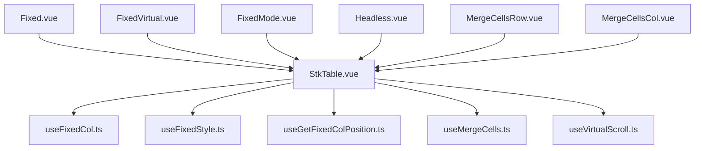
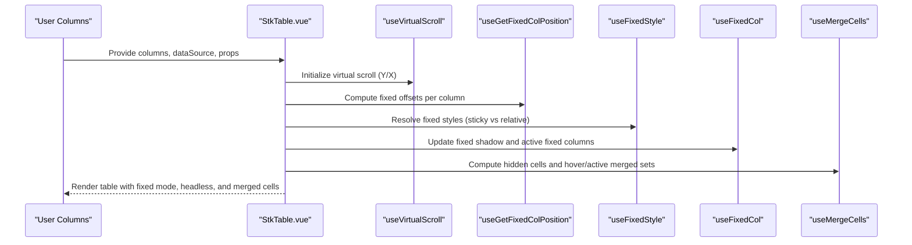
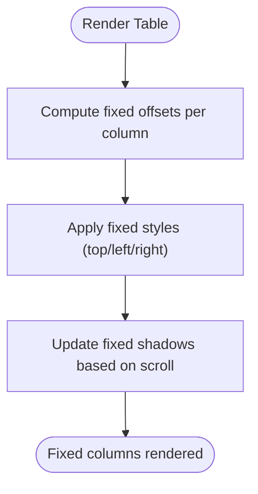
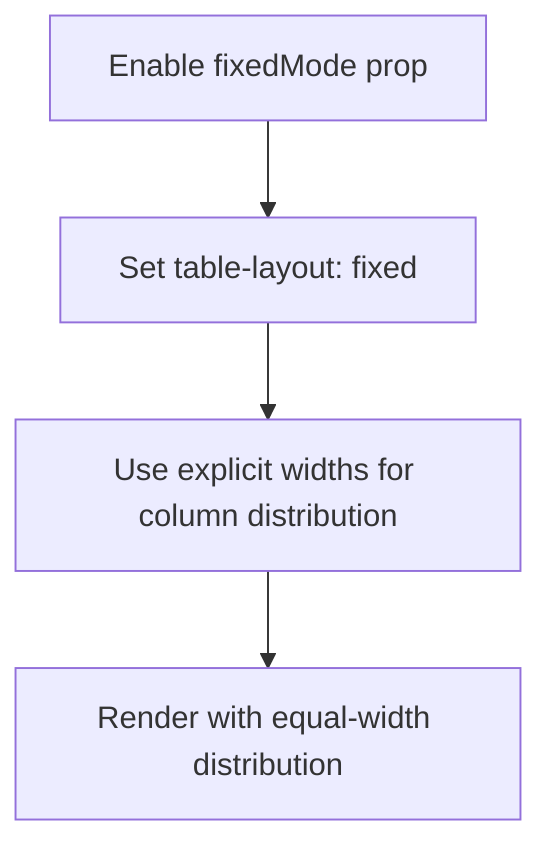
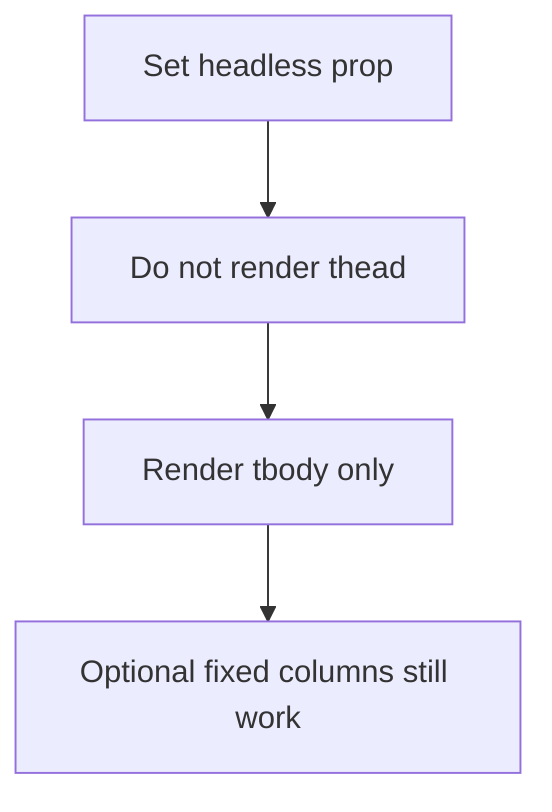
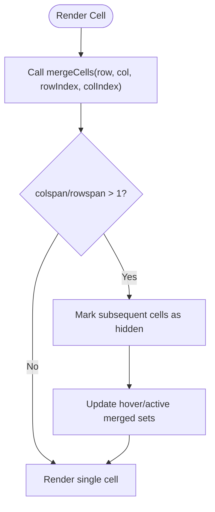
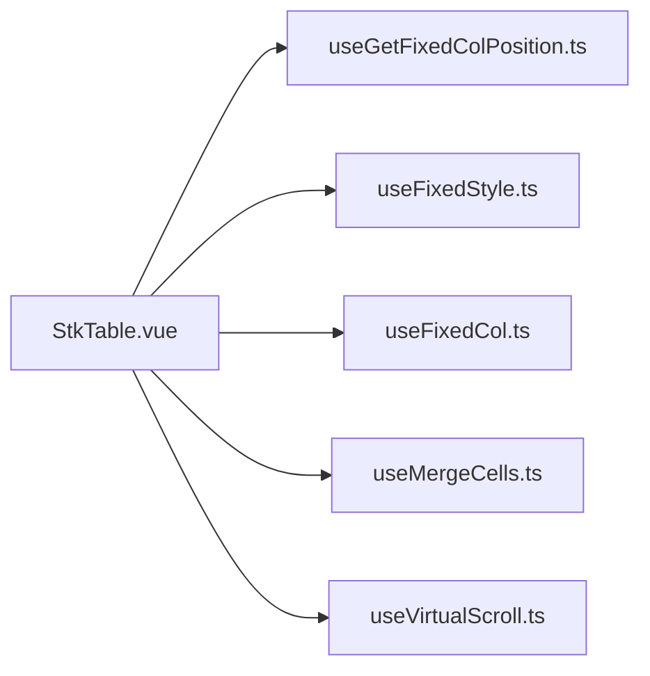

# Table Layout

<cite>
**Referenced Files in This Document**
- [StkTable.vue](file://src/StkTable/StkTable.vue)
- [useFixedCol.ts](file://src/StkTable/useFixedCol.ts)
- [useFixedStyle.ts](file://src/StkTable/useFixedStyle.ts)
- [useGetFixedColPosition.ts](file://src/StkTable/useGetFixedColPosition.ts)
- [useMergeCells.ts](file://src/StkTable/useMergeCells.ts)
- [Fixed.vue](file://docs-demo/basic/fixed/Fixed.vue)
- [FixedVirtual.vue](file://docs-demo/basic/fixed/FixedVirtual.vue)
- [FixedMode.vue](file://docs-demo/basic/fixed-mode/FixedMode.vue)
- [Headless.vue](file://docs-demo/basic/headless/Headless.vue)
- [MergeCellsRow.vue](file://docs-demo/basic/merge-cells/MergeCellsRow.vue)
- [MergeCellsCol.vue](file://docs-demo/basic/merge-cells/MergeCellsCol.vue)
- [fixed.md](file://docs-src/main/table/basic/fixed.md)
- [fixed-mode.md](file://docs-src/main/table/basic/fixed-mode.md)
- [headless.md](file://docs-src/main/table/basic/headless.md)
- [merge-cells.md](file://docs-src/main/table/basic/merge-cells.md)
</cite>

## Table of Contents
1. [Introduction](#introduction)
2. [Project Structure](#project-structure)
3. [Core Components](#core-components)
4. [Architecture Overview](#architecture-overview)
5. [Detailed Component Analysis](#detailed-component-analysis)
6. [Dependency Analysis](#dependency-analysis)
7. [Performance Considerations](#performance-considerations)
8. [Troubleshooting Guide](#troubleshooting-guide)
9. [Conclusion](#conclusion)
10. [Appendices](#appendices)

## Introduction
This document explains the table layout features in Stk Table Vue with a focus on fixed columns (standard and virtual scrolling modes), fixed mode configuration, headless table creation, and merge cells for row-wise and column-wise cell spanning. It also covers layout optimization techniques and performance considerations for large datasets, with concrete examples drawn from the repository’s demos and documentation.

## Project Structure
The table layout features are implemented primarily in the core table component and several composable utilities:
- Core table rendering and props: [StkTable.vue](file://src/StkTable/StkTable.vue)
- Fixed column logic: [useFixedCol.ts](file://src/StkTable/useFixedCol.ts), [useFixedStyle.ts](file://src/StkTable/useFixedStyle.ts), [useGetFixedColPosition.ts](file://src/StkTable/useGetFixedColPosition.ts)
- Merge cells logic: [useMergeCells.ts](file://src/StkTable/useMergeCells.ts)
- Demos and documentation for layout features:
  - Fixed columns: [Fixed.vue](file://docs-demo/basic/fixed/Fixed.vue), [FixedVirtual.vue](file://docs-demo/basic/fixed/FixedVirtual.vue)
  - Fixed mode: [FixedMode.vue](file://docs-demo/basic/fixed-mode/FixedMode.vue)
  - Headless: [Headless.vue](file://docs-demo/basic/headless/Headless.vue)
  - Merge cells: [MergeCellsRow.vue](file://docs-demo/basic/merge-cells/MergeCellsRow.vue), [MergeCellsCol.vue](file://docs-demo/basic/merge-cells/MergeCellsCol.vue)
  - Docs: [fixed.md](file://docs-src/main/table/basic/fixed.md), [fixed-mode.md](file://docs-src/main/table/basic/fixed-mode.md), [headless.md](file://docs-src/main/table/basic/headless.md), [merge-cells.md](file://docs-src/main/table/basic/merge-cells.md)

**Diagram sources**
- [StkTable.vue](file://src/StkTable/StkTable.vue#L1-L200)
- [useFixedCol.ts](file://src/StkTable/useFixedCol.ts#L1-L156)
- [useFixedStyle.ts](file://src/StkTable/useFixedStyle.ts#L1-L76)
- [useGetFixedColPosition.ts](file://src/StkTable/useGetFixedColPosition.ts#L1-L66)
- [useMergeCells.ts](file://src/StkTable/useMergeCells.ts#L1-L140)
- [Fixed.vue](file://docs-demo/basic/fixed/Fixed.vue#L1-L74)
- [FixedVirtual.vue](file://docs-demo/basic/fixed/FixedVirtual.vue#L1-L85)
- [FixedMode.vue](file://docs-demo/basic/fixed-mode/FixedMode.vue#L1-L46)
- [Headless.vue](file://docs-demo/basic/headless/Headless.vue#L1-L45)
- [MergeCellsRow.vue](file://docs-demo/basic/merge-cells/MergeCellsRow.vue#L1-L74)
- [MergeCellsCol.vue](file://docs-demo/basic/merge-cells/MergeCellsCol.vue#L1-L38)

**Section sources**
- [StkTable.vue](file://src/StkTable/StkTable.vue#L1-L200)
- [useFixedCol.ts](file://src/StkTable/useFixedCol.ts#L1-L156)
- [useFixedStyle.ts](file://src/StkTable/useFixedStyle.ts#L1-L76)
- [useGetFixedColPosition.ts](file://src/StkTable/useGetFixedColPosition.ts#L1-L66)
- [useMergeCells.ts](file://src/StkTable/useMergeCells.ts#L1-L140)

## Core Components
- Fixed columns: Implemented via composable hooks that compute fixed positions, styles, and shadow visibility, and integrate with virtual scrolling.
- Fixed mode (table-layout: fixed): Controlled by a dedicated prop to switch the table’s layout algorithm for column width distribution.
- Headless tables: Controlled by a prop to hide the header section while keeping body rendering intact.
- Merge cells: A composable that computes hidden cells and highlights for merged regions, supporting both row-wise and column-wise spanning.

**Section sources**
- [StkTable.vue](file://src/StkTable/StkTable.vue#L278-L476)
- [useFixedCol.ts](file://src/StkTable/useFixedCol.ts#L19-L155)
- [useFixedStyle.ts](file://src/StkTable/useFixedStyle.ts#L19-L75)
- [useGetFixedColPosition.ts](file://src/StkTable/useGetFixedColPosition.ts#L15-L65)
- [useMergeCells.ts](file://src/StkTable/useMergeCells.ts#L11-L139)

## Architecture Overview
The layout pipeline integrates props, computed helpers, and composable utilities to render fixed columns, apply fixed mode, render headless tables, and manage merged cells.

**Diagram sources**
- [StkTable.vue](file://src/StkTable/StkTable.vue#L771-L800)
- [useGetFixedColPosition.ts](file://src/StkTable/useGetFixedColPosition.ts#L15-L65)
- [useFixedStyle.ts](file://src/StkTable/useFixedStyle.ts#L19-L75)
- [useFixedCol.ts](file://src/StkTable/useFixedCol.ts#L19-L155)
- [useMergeCells.ts](file://src/StkTable/useMergeCells.ts#L11-L139)

## Detailed Component Analysis

### Fixed Columns (Standard Mode)
Fixed columns are configured per column and supported in both standard and virtual X modes. The implementation:
- Computes fixed offsets for left/right fixed columns.
- Applies fixed styles using sticky or relative positioning depending on mode.
- Updates shadow visibility based on scroll position and fixed column boundaries.

**Diagram sources**
- [useGetFixedColPosition.ts](file://src/StkTable/useGetFixedColPosition.ts#L15-L65)
- [useFixedStyle.ts](file://src/StkTable/useFixedStyle.ts#L19-L75)
- [useFixedCol.ts](file://src/StkTable/useFixedCol.ts#L90-L145)

Practical example:
- Standard fixed columns: [Fixed.vue](file://docs-demo/basic/fixed/Fixed.vue#L10-L73)
- Virtual X fixed columns: [FixedVirtual.vue](file://docs-demo/basic/fixed/FixedVirtual.vue#L9-L84)

Configuration highlights:
- Per-column fixed direction via column property.
- Optional fixed column shadow toggle.
- Width requirements for proper fixed column behavior.

**Section sources**
- [useGetFixedColPosition.ts](file://src/StkTable/useGetFixedColPosition.ts#L15-L65)
- [useFixedStyle.ts](file://src/StkTable/useFixedStyle.ts#L19-L75)
- [useFixedCol.ts](file://src/StkTable/useFixedCol.ts#L19-L155)
- [fixed.md](file://docs-src/main/table/basic/fixed.md#L1-L56)
- [Fixed.vue](file://docs-demo/basic/fixed/Fixed.vue#L10-L73)
- [FixedVirtual.vue](file://docs-demo/basic/fixed/FixedVirtual.vue#L9-L84)

### Fixed Mode (table-layout: fixed)
Fixed mode switches the table to use CSS table-layout: fixed, enabling predictable column width distribution. It is controlled by a dedicated prop and documented with examples.

**Diagram sources**
- [StkTable.vue](file://src/StkTable/StkTable.vue#L278-L476)
- [fixed-mode.md](file://docs-src/main/table/basic/fixed-mode.md#L1-L19)
- [FixedMode.vue](file://docs-demo/basic/fixed-mode/FixedMode.vue#L24-L43)

Practical example:
- Fixed mode with headless: [FixedMode.vue](file://docs-demo/basic/fixed-mode/FixedMode.vue#L24-L43)

**Section sources**
- [StkTable.vue](file://src/StkTable/StkTable.vue#L278-L476)
- [fixed-mode.md](file://docs-src/main/table/basic/fixed-mode.md#L1-L19)
- [FixedMode.vue](file://docs-demo/basic/fixed-mode/FixedMode.vue#L24-L43)

### Headless Tables (No Header Rows)
Headless tables hide the header section while preserving body rendering. This enables vertical label/value layouts and single-column lists.

**Diagram sources**
- [StkTable.vue](file://src/StkTable/StkTable.vue#L61-L101)
- [headless.md](file://docs-src/main/table/basic/headless.md#L1-L22)
- [Headless.vue](file://docs-demo/basic/headless/Headless.vue#L24-L32)

Practical example:
- Vertical headless layout: [Headless.vue](file://docs-demo/basic/headless/Headless.vue#L9-L32)

**Section sources**
- [StkTable.vue](file://src/StkTable/StkTable.vue#L61-L101)
- [headless.md](file://docs-src/main/table/basic/headless.md#L1-L22)
- [Headless.vue](file://docs-demo/basic/headless/Headless.vue#L9-L32)

### Merge Cells (Row-wise and Column-wise Spanning)
Merge cells allow row-wise and column-wise spanning by specifying a merge function per column. The composable:
- Computes hidden cells for spans.
- Manages hover and active merged cell highlighting.
- Rebuilds on data or header changes.

**Diagram sources**
- [useMergeCells.ts](file://src/StkTable/useMergeCells.ts#L84-L115)

Practical examples:
- Row-wise merge: [MergeCellsRow.vue](file://docs-demo/basic/merge-cells/MergeCellsRow.vue#L16-L73)
- Column-wise merge: [MergeCellsCol.vue](file://docs-demo/basic/merge-cells/MergeCellsCol.vue#L7-L37)
- Merge cells documentation: [merge-cells.md](file://docs-src/main/table/basic/merge-cells.md#L1-L59)

**Section sources**
- [useMergeCells.ts](file://src/StkTable/useMergeCells.ts#L11-L139)
- [merge-cells.md](file://docs-src/main/table/basic/merge-cells.md#L1-L59)
- [MergeCellsRow.vue](file://docs-demo/basic/merge-cells/MergeCellsRow.vue#L16-L73)
- [MergeCellsCol.vue](file://docs-demo/basic/merge-cells/MergeCellsCol.vue#L7-L37)

## Dependency Analysis
The table layout relies on a small set of cohesive composable utilities that are wired into the core table component.

**Diagram sources**
- [StkTable.vue](file://src/StkTable/StkTable.vue#L771-L800)
- [useGetFixedColPosition.ts](file://src/StkTable/useGetFixedColPosition.ts#L15-L65)
- [useFixedStyle.ts](file://src/StkTable/useFixedStyle.ts#L19-L75)
- [useFixedCol.ts](file://src/StkTable/useFixedCol.ts#L19-L155)
- [useMergeCells.ts](file://src/StkTable/useMergeCells.ts#L11-L139)

**Section sources**
- [StkTable.vue](file://src/StkTable/StkTable.vue#L771-L800)
- [useGetFixedColPosition.ts](file://src/StkTable/useGetFixedColPosition.ts#L15-L65)
- [useFixedStyle.ts](file://src/StkTable/useFixedStyle.ts#L19-L75)
- [useFixedCol.ts](file://src/StkTable/useFixedCol.ts#L19-L155)
- [useMergeCells.ts](file://src/StkTable/useMergeCells.ts#L11-L139)

## Performance Considerations
- Fixed columns:
  - Sticky vs relative positioning affects rendering cost; relative mode may adjust fixed positions dynamically with scroll.
  - Fixed column shadow updates occur on scroll; disabling shadow reduces recomputation overhead.
  - Width calculation for fixed columns requires explicit widths; missing widths degrade fixed behavior.
- Fixed mode:
  - table-layout: fixed distributes widths predictably; ensure widths are set for accurate column sizing.
- Headless tables:
  - Rendering body only reduces header overhead; useful for dense vertical layouts.
- Merge cells:
  - In virtual lists, merge computation iterates across visible data; avoid extremely large spans.
  - Horizontal virtual lists currently do not support merge cells.

[No sources needed since this section provides general guidance]

## Troubleshooting Guide
- Fixed columns not sticking:
  - Ensure preceding columns have widths for left-fixed and following columns for right-fixed.
  - Verify fixed mode and shadow settings match expectations.
- Unexpected white space or misalignment:
  - Confirm table width and column widths are set appropriately when using fixed mode.
- Merge cells not rendering:
  - Ensure mergeCells returns valid colspan/rowspan and that data changes trigger recomputation.
  - Avoid extremely large spans in virtual lists.

**Section sources**
- [fixed.md](file://docs-src/main/table/basic/fixed.md#L26-L55)
- [merge-cells.md](file://docs-src/main/table/basic/merge-cells.md#L47-L54)

## Conclusion
Stk Table Vue provides robust layout controls for fixed columns, fixed mode, headless tables, and merge cells. By leveraging the composable utilities and following the documented configuration patterns, developers can build efficient, visually consistent tables for varied data presentation needs, including large datasets with virtual scrolling.

## Appendices
- Example references:
  - Fixed columns: [Fixed.vue](file://docs-demo/basic/fixed/Fixed.vue#L10-L73), [FixedVirtual.vue](file://docs-demo/basic/fixed/FixedVirtual.vue#L9-L84)
  - Fixed mode: [FixedMode.vue](file://docs-demo/basic/fixed-mode/FixedMode.vue#L24-L43)
  - Headless: [Headless.vue](file://docs-demo/basic/headless/Headless.vue#L24-L32)
  - Merge cells: [MergeCellsRow.vue](file://docs-demo/basic/merge-cells/MergeCellsRow.vue#L16-L73), [MergeCellsCol.vue](file://docs-demo/basic/merge-cells/MergeCellsCol.vue#L7-L37)