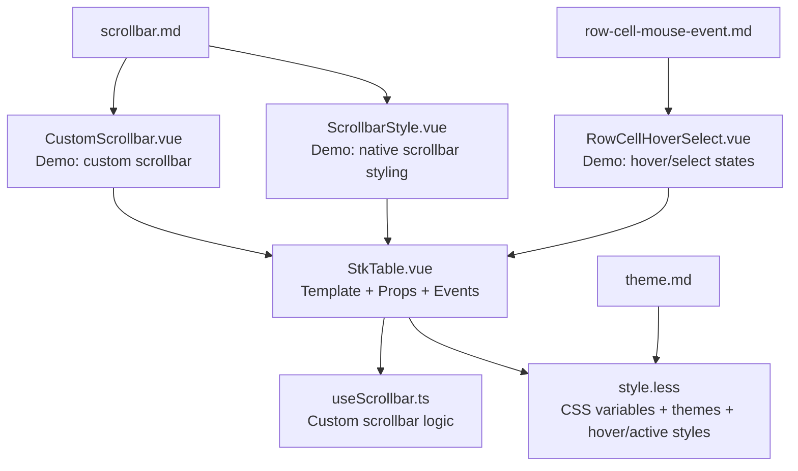
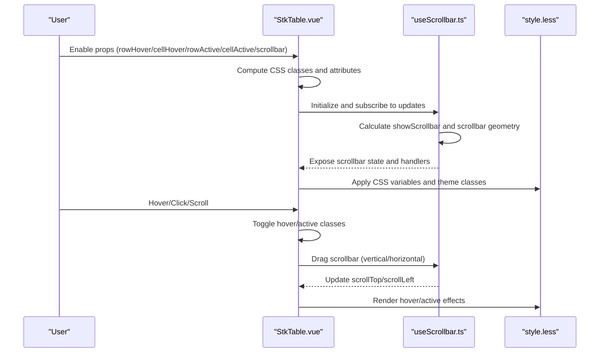
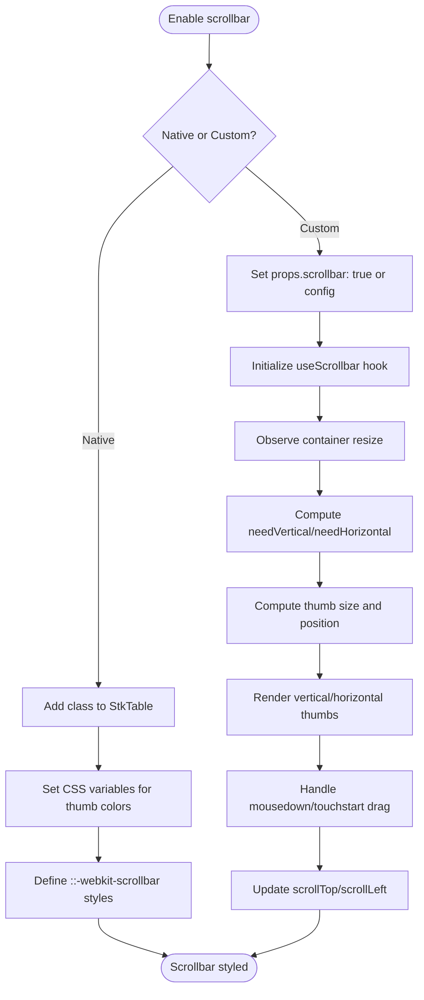
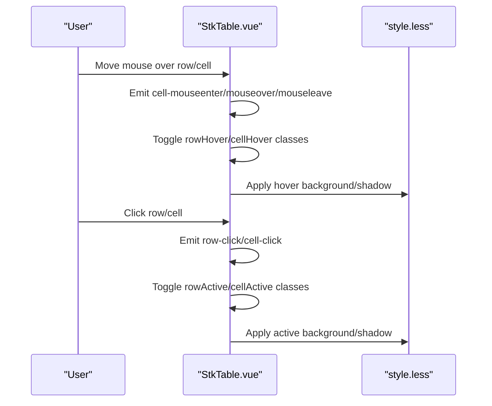
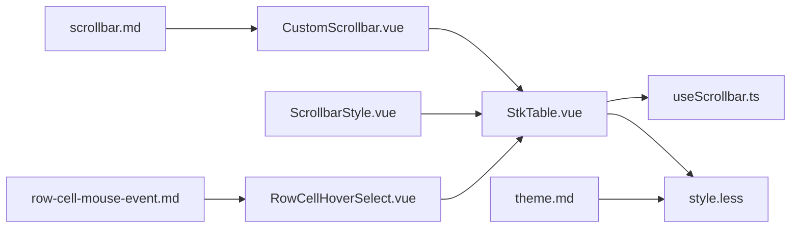

# Visual Customization

<cite>
**Referenced Files in This Document**
- [StkTable.vue](file://src/StkTable/StkTable.vue)
- [useScrollbar.ts](file://src/StkTable/useScrollbar.ts)
- [style.less](file://src/StkTable/style.less)
- [ScrollbarStyle.vue](file://docs-demo/basic/scrollbar-style/ScrollbarStyle.vue)
- [CustomScrollbar.vue](file://docs-demo/basic/scrollbar-style/CustomScrollbar.vue)
- [RowCellHoverSelect.vue](file://docs-demo/basic/row-cell-mouse-event/RowCellHoverSelect.vue)
- [scrollbar.md](file://docs-src/main/table/basic/scrollbar.md)
- [row-cell-mouse-event.md](file://docs-src/main/table/basic/row-cell-mouse-event.md)
- [theme.md](file://docs-src/main/table/basic/theme.md)
- [Stripe.vue](file://docs-demo/basic/stripe/Stripe.vue)
</cite>

## Table of Contents
1. [Introduction](#introduction)
2. [Project Structure](#project-structure)
3. [Core Components](#core-components)
4. [Architecture Overview](#architecture-overview)
5. [Detailed Component Analysis](#detailed-component-analysis)
6. [Dependency Analysis](#dependency-analysis)
7. [Performance Considerations](#performance-considerations)
8. [Troubleshooting Guide](#troubleshooting-guide)
9. [Conclusion](#conclusion)

## Introduction
This document explains visual customization features in Stk Table Vue, focusing on:
- Scrollbar styling: default native behavior and fully customized scrollbar appearance
- Mouse event handling for row and cell interactions: hover effects and selection feedback
- Visual enhancements for UX: custom styling and interactive feedback
It includes practical examples and code references to help you implement custom scrollbars, hover effects, and responsive visual feedback.

## Project Structure
The visual customization features span three layers:
- Template and props orchestration: StkTable.vue
- Styling and theme: style.less
- Hooks for custom scrollbar behavior: useScrollbar.ts
- Demo pages and docs: docs-demo and docs-src

**Diagram sources**
- [StkTable.vue](file://src/StkTable/StkTable.vue#L1-L200)
- [useScrollbar.ts](file://src/StkTable/useScrollbar.ts#L1-L190)
- [style.less](file://src/StkTable/style.less#L1-L120)
- [CustomScrollbar.vue](file://docs-demo/basic/scrollbar-style/CustomScrollbar.vue#L1-L87)
- [ScrollbarStyle.vue](file://docs-demo/basic/scrollbar-style/ScrollbarStyle.vue#L1-L71)
- [RowCellHoverSelect.vue](file://docs-demo/basic/row-cell-mouse-event/RowCellHoverSelect.vue#L1-L83)
- [scrollbar.md](file://docs-src/main/table/basic/scrollbar.md#L1-L88)
- [row-cell-mouse-event.md](file://docs-src/main/table/basic/row-cell-mouse-event.md#L1-L39)
- [theme.md](file://docs-src/main/table/basic/theme.md#L1-L9)

**Section sources**
- [StkTable.vue](file://src/StkTable/StkTable.vue#L1-L200)
- [style.less](file://src/StkTable/style.less#L1-L120)
- [useScrollbar.ts](file://src/StkTable/useScrollbar.ts#L1-L190)
- [CustomScrollbar.vue](file://docs-demo/basic/scrollbar-style/CustomScrollbar.vue#L1-L87)
- [ScrollbarStyle.vue](file://docs-demo/basic/scrollbar-style/ScrollbarStyle.vue#L1-L71)
- [RowCellHoverSelect.vue](file://docs-demo/basic/row-cell-mouse-event/RowCellHoverSelect.vue#L1-L83)
- [scrollbar.md](file://docs-src/main/table/basic/scrollbar.md#L1-L88)
- [row-cell-mouse-event.md](file://docs-src/main/table/basic/row-cell-mouse-event.md#L1-L39)
- [theme.md](file://docs-src/main/table/basic/theme.md#L1-L9)

## Core Components
- StkTable.vue: Renders the table, binds props for hover/active states, and toggles CSS classes for visual feedback. It also renders custom scrollbar thumbs and wires events.
- useScrollbar.ts: Provides custom scrollbar logic, including sizing, dragging, and visibility detection for both axes.
- style.less: Defines CSS variables for theme-aware colors, hover/active styles, and custom scrollbar visuals. Includes dark/light theme overrides.

Key visual features:
- Hover and active states for rows and cells via CSS classes and variables
- Native scrollbar styling via CSS variables and ::-webkit-scrollbar
- Fully custom scrollbar DOM with draggable thumbs and dynamic sizing

**Section sources**
- [StkTable.vue](file://src/StkTable/StkTable.vue#L1-L200)
- [useScrollbar.ts](file://src/StkTable/useScrollbar.ts#L1-L190)
- [style.less](file://src/StkTable/style.less#L1-L120)

## Architecture Overview
The visual customization pipeline:
- Props enable/disable hover/active states and custom scrollbar
- StkTable.vue computes CSS classes and renders custom scrollbar elements
- useScrollbar.ts calculates thumb sizes and positions and handles drag interactions
- style.less applies theme-aware colors and hover/active effects

**Diagram sources**
- [StkTable.vue](file://src/StkTable/StkTable.vue#L1-L200)
- [useScrollbar.ts](file://src/StkTable/useScrollbar.ts#L1-L190)
- [style.less](file://src/StkTable/style.less#L1-L120)

## Detailed Component Analysis

### Custom Scrollbar Implementation
Two approaches are supported:
- Native scrollbar styling: apply a class and style ::-webkit-scrollbar
- Built-in custom scrollbar: enable via props and optionally configure width/height/min dimensions

**Diagram sources**
- [useScrollbar.ts](file://src/StkTable/useScrollbar.ts#L1-L190)
- [StkTable.vue](file://src/StkTable/StkTable.vue#L180-L206)
- [style.less](file://src/StkTable/style.less#L656-L690)
- [scrollbar.md](file://docs-src/main/table/basic/scrollbar.md#L23-L75)

Implementation highlights:
- Props: scrollbar accepts boolean or ScrollbarOptions to enable and configure
- Hook: calculates visibility and geometry; exposes handlers for dragging
- DOM: renders two sticky divs as draggable thumbs; supports touch and mouse
- Styles: CSS variables control thumb colors and sizes; hover/active transitions

Examples:
- Native styling demo: [ScrollbarStyle.vue](file://docs-demo/basic/scrollbar-style/ScrollbarStyle.vue#L1-L71)
- Custom scrollbar demo: [CustomScrollbar.vue](file://docs-demo/basic/scrollbar-style/CustomScrollbar.vue#L1-L87)
- Docs: [scrollbar.md](file://docs-src/main/table/basic/scrollbar.md#L1-L88)

**Section sources**
- [useScrollbar.ts](file://src/StkTable/useScrollbar.ts#L1-L190)
- [StkTable.vue](file://src/StkTable/StkTable.vue#L180-L206)
- [style.less](file://src/StkTable/style.less#L656-L690)
- [scrollbar.md](file://docs-src/main/table/basic/scrollbar.md#L1-L88)
- [ScrollbarStyle.vue](file://docs-demo/basic/scrollbar-style/ScrollbarStyle.vue#L1-L71)
- [CustomScrollbar.vue](file://docs-demo/basic/scrollbar-style/CustomScrollbar.vue#L1-L87)

### Mouse Event Handling and Visual Feedback
Row and cell hover/active states are controlled by props and reflected via CSS classes and variables.

Key behaviors:
- rowHover: adds hover class to rows; configurable via prop
- cellHover: adds hover class to cells; configurable via prop
- rowActive: adds active class to rows; supports disabling per row and revocable selection
- cellActive: adds active class to cells; supports revocable selection
- CSS variables control hover/active colors and durations
- Dark/light theme adjusts colors automatically

Examples:
- Interactive demo: [RowCellHoverSelect.vue](file://docs-demo/basic/row-cell-mouse-event/RowCellHoverSelect.vue#L1-L83)
- Docs: [row-cell-mouse-event.md](file://docs-src/main/table/basic/row-cell-mouse-event.md#L1-L39)
- Theme docs: [theme.md](file://docs-src/main/table/basic/theme.md#L1-L9)
- Hover/active styles: [style.less](file://src/StkTable/style.less#L188-L228)

**Diagram sources**
- [StkTable.vue](file://src/StkTable/StkTable.vue#L530-L555)
- [style.less](file://src/StkTable/style.less#L188-L228)
- [RowCellHoverSelect.vue](file://docs-demo/basic/row-cell-mouse-event/RowCellHoverSelect.vue#L1-L83)
- [row-cell-mouse-event.md](file://docs-src/main/table/basic/row-cell-mouse-event.md#L1-L39)

**Section sources**
- [StkTable.vue](file://src/StkTable/StkTable.vue#L530-L555)
- [style.less](file://src/StkTable/style.less#L188-L228)
- [RowCellHoverSelect.vue](file://docs-demo/basic/row-cell-mouse-event/RowCellHoverSelect.vue#L1-L83)
- [row-cell-mouse-event.md](file://docs-src/main/table/basic/row-cell-mouse-event.md#L1-L39)
- [theme.md](file://docs-src/main/table/basic/theme.md#L1-L9)

### Visual Enhancement Techniques
- Theme-aware variables: --th-bgc, --td-bgc, --tr-hover-bgc, --tr-active-bgc, --td-hover-color, --td-active-color
- Hover effects: row-hover and cell-hover classes apply background or inset shadows
- Active effects: row-active and cell-active classes apply stronger background or inset shadows
- Stripe pattern: optional zebra stripes with hover/active overrides
- Highlight animations: configurable duration and steps for highlight feedback

References:
- Variables and hover/active rules: [style.less](file://src/StkTable/style.less#L188-L228)
- Stripe and hover/active combinations: [style.less](file://src/StkTable/style.less#L188-L204)
- Demo: [Stripe.vue](file://docs-demo/basic/stripe/Stripe.vue#L1-L25)

**Section sources**
- [style.less](file://src/StkTable/style.less#L188-L228)
- [Stripe.vue](file://docs-demo/basic/stripe/Stripe.vue#L1-L25)

## Dependency Analysis
- StkTable.vue depends on useScrollbar.ts for custom scrollbar logic
- StkTable.vue reads CSS variables from style.less for theme-aware visuals
- Demos depend on StkTable.vue and showcase different visual configurations

**Diagram sources**
- [StkTable.vue](file://src/StkTable/StkTable.vue#L1-L200)
- [useScrollbar.ts](file://src/StkTable/useScrollbar.ts#L1-L190)
- [style.less](file://src/StkTable/style.less#L1-L120)
- [CustomScrollbar.vue](file://docs-demo/basic/scrollbar-style/CustomScrollbar.vue#L1-L87)
- [ScrollbarStyle.vue](file://docs-demo/basic/scrollbar-style/ScrollbarStyle.vue#L1-L71)
- [RowCellHoverSelect.vue](file://docs-demo/basic/row-cell-mouse-event/RowCellHoverSelect.vue#L1-L83)
- [scrollbar.md](file://docs-src/main/table/basic/scrollbar.md#L1-L88)
- [row-cell-mouse-event.md](file://docs-src/main/table/basic/row-cell-mouse-event.md#L1-L39)
- [theme.md](file://docs-src/main/table/basic/theme.md#L1-L9)

**Section sources**
- [StkTable.vue](file://src/StkTable/StkTable.vue#L1-L200)
- [useScrollbar.ts](file://src/StkTable/useScrollbar.ts#L1-L190)
- [style.less](file://src/StkTable/style.less#L1-L120)
- [CustomScrollbar.vue](file://docs-demo/basic/scrollbar-style/CustomScrollbar.vue#L1-L87)
- [ScrollbarStyle.vue](file://docs-demo/basic/scrollbar-style/ScrollbarStyle.vue#L1-L71)
- [RowCellHoverSelect.vue](file://docs-demo/basic/row-cell-mouse-event/RowCellHoverSelect.vue#L1-L83)
- [scrollbar.md](file://docs-src/main/table/basic/scrollbar.md#L1-L88)
- [row-cell-mouse-event.md](file://docs-src/main/table/basic/row-cell-mouse-event.md#L1-L39)
- [theme.md](file://docs-src/main/table/basic/theme.md#L1-L9)

## Performance Considerations
- Custom scrollbar uses ResizeObserver and throttled updates to avoid excessive recalculations
- Dragging uses mouse/touch events with cleanup to prevent leaks
- CSS variables minimize reflows; hover/active effects rely on class toggling
- Virtual scrolling reduces DOM nodes; ensure custom scrollbar remains efficient with large datasets

[No sources needed since this section provides general guidance]

## Troubleshooting Guide
Common issues and resolutions:
- Custom scrollbar not visible
  - Ensure props.scrollbar is enabled or passed a config object
  - Verify container has overflow and dimensions
  - References: [useScrollbar.ts](file://src/StkTable/useScrollbar.ts#L29-L41), [StkTable.vue](file://src/StkTable/StkTable.vue#L180-L206)
- Native scrollbar styling not applied
  - Confirm the class is applied to the StkTable element
  - Check ::-webkit-scrollbar selectors and CSS variable overrides
  - References: [ScrollbarStyle.vue](file://docs-demo/basic/scrollbar-style/ScrollbarStyle.vue#L37-L70), [scrollbar.md](file://docs-src/main/table/basic/scrollbar.md#L3-L22)
- Hover/active states not triggering
  - Verify rowHover/cellHover/rowActive/cellActive props are enabled
  - Ensure no conflicting CSS overrides the hover/active classes
  - References: [RowCellHoverSelect.vue](file://docs-demo/basic/row-cell-mouse-event/RowCellHoverSelect.vue#L11-L21), [style.less](file://src/StkTable/style.less#L188-L228)
- Dark/light theme colors unexpected
  - Adjust CSS variables for --sb-thumb-color/--sb-thumb-hover-color or other theme variables
  - References: [style.less](file://src/StkTable/style.less#L50-L110), [theme.md](file://docs-src/main/table/basic/theme.md#L1-L9)

**Section sources**
- [useScrollbar.ts](file://src/StkTable/useScrollbar.ts#L29-L41)
- [StkTable.vue](file://src/StkTable/StkTable.vue#L180-L206)
- [ScrollbarStyle.vue](file://docs-demo/basic/scrollbar-style/ScrollbarStyle.vue#L37-L70)
- [scrollbar.md](file://docs-src/main/table/basic/scrollbar.md#L3-L22)
- [RowCellHoverSelect.vue](file://docs-demo/basic/row-cell-mouse-event/RowCellHoverSelect.vue#L11-L21)
- [style.less](file://src/StkTable/style.less#L50-L110)
- [theme.md](file://docs-src/main/table/basic/theme.md#L1-L9)

## Conclusion
Stk Table Vue offers flexible visual customization:
- Native scrollbar styling via CSS variables and ::-webkit-scrollbar
- Fully customizable scrollbar with built-in DOM and drag interactions
- Rich hover/active states for rows and cells, with theme-aware colors
- Responsive feedback through CSS classes and variables
Use the provided demos and props to implement tailored experiences that improve usability and aesthetics.