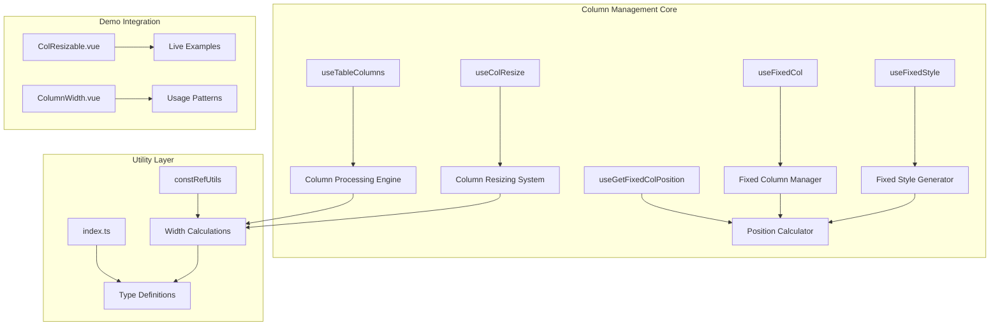
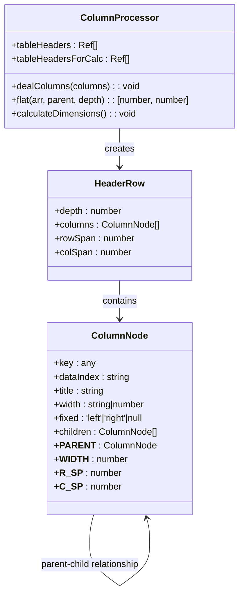
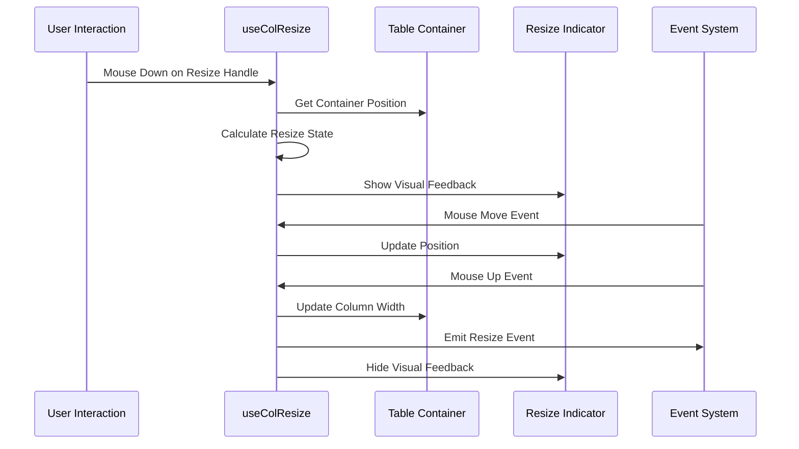
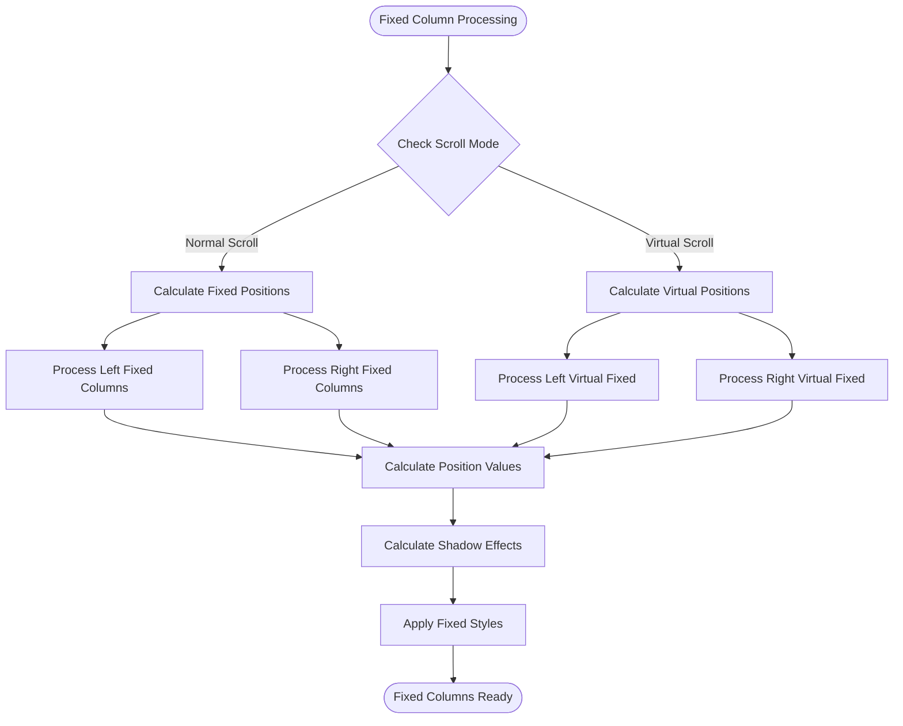
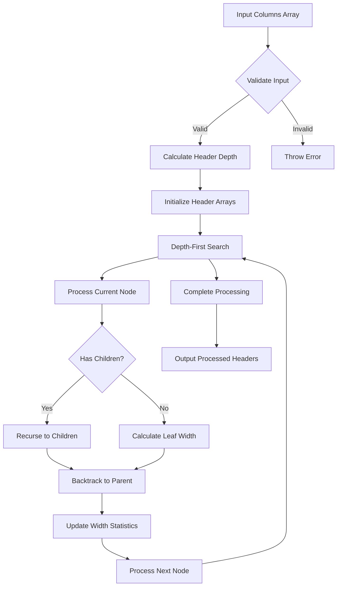
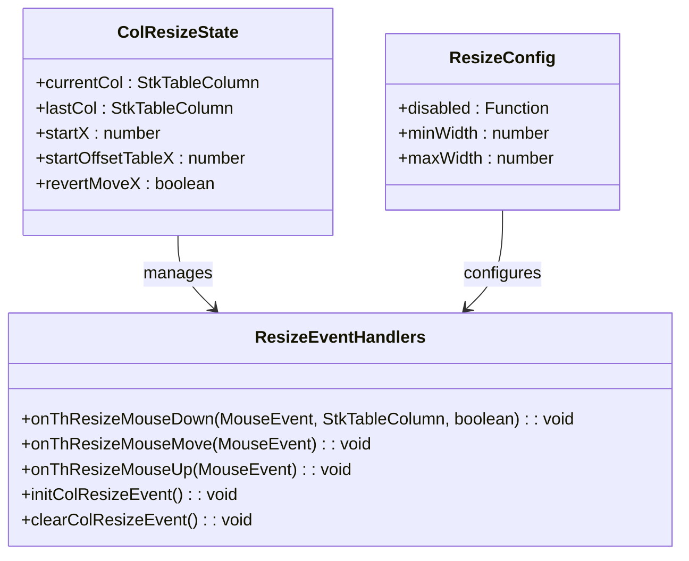
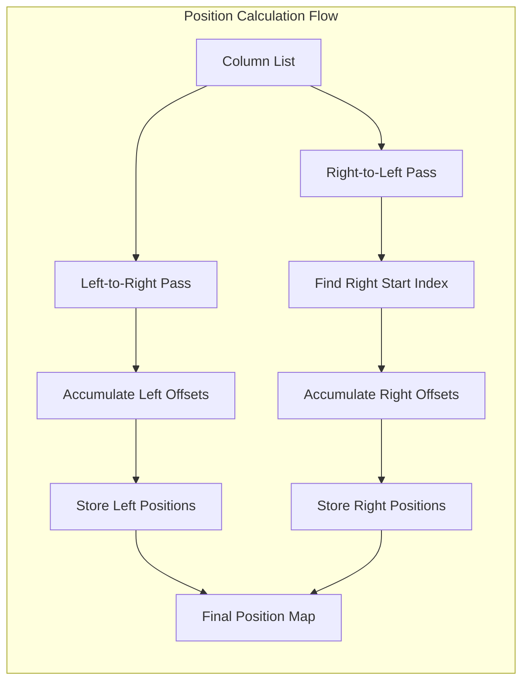
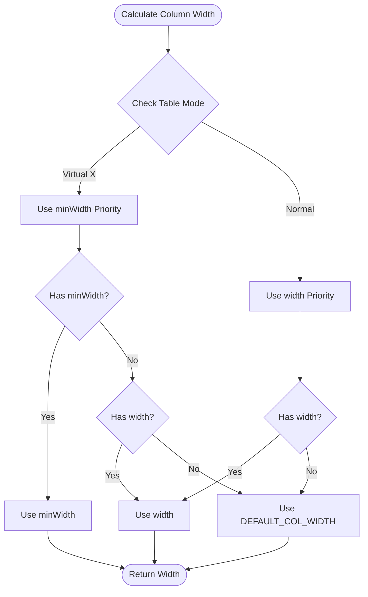

# Column Management System

<cite>
**Referenced Files in This Document**
- [useTableColumns.ts](file://src/StkTable/useTableColumns.ts)
- [useColResize.ts](file://src/StkTable/useColResize.ts)
- [useFixedCol.ts](file://src/StkTable/useFixedCol.ts)
- [useFixedStyle.ts](file://src/StkTable/useFixedStyle.ts)
- [useGetFixedColPosition.ts](file://src/StkTable/useGetFixedColPosition.ts)
- [constRefUtils.ts](file://src/StkTable/utils/constRefUtils.ts)
- [index.ts](file://src/StkTable/types/index.ts)
- [ColResizable.vue](file://docs-demo/advanced/column-resize/ColResizable.vue)
- [ColumnWidth.vue](file://docs-demo/basic/column-width/ColumnWidth.vue)
</cite>

## Table of Contents
1. [Introduction](#introduction)
2. [System Architecture](#system-architecture)
3. [Core Components](#core-components)
4. [Column Processing Engine](#column-processing-engine)
5. [Column Resizing System](#column-resizing-system)
6. [Fixed Column Management](#fixed-column-management)
7. [Column Width Calculation](#column-width-calculation)
8. [Integration Examples](#integration-examples)
9. [Performance Considerations](#performance-considerations)
10. [Troubleshooting Guide](#troubleshooting-guide)
11. [Conclusion](#conclusion)

## Introduction

The Column Management System is a comprehensive solution for handling table columns in the StkTable Vue component library. This system manages column configuration, multi-level header processing, column resizing, fixed columns, and responsive column width calculations. It provides a robust foundation for building complex table interfaces with advanced column manipulation capabilities.

The system is designed to handle various column scenarios including simple single-level headers, complex multi-level headers, resizable columns, fixed-positioned columns, and virtual scrolling environments. It ensures optimal performance while maintaining flexibility for different use cases.

## System Architecture

The Column Management System follows a modular architecture with clear separation of concerns:

**Diagram sources**
- [useTableColumns.ts](file://src/StkTable/useTableColumns.ts#L15-L137)
- [useColResize.ts](file://src/StkTable/useColResize.ts#L29-L214)
- [useFixedCol.ts](file://src/StkTable/useFixedCol.ts#L19-L155)

## Core Components

### Column Processing Engine

The Column Processing Engine serves as the central hub for all column-related operations. It handles multi-level header processing, column flattening, and maintains the relationship between parent and child columns.

**Diagram sources**
- [useTableColumns.ts](file://src/StkTable/useTableColumns.ts#L38-L130)
- [index.ts](file://src/StkTable/types/index.ts#L54-L138)

**Section sources**
- [useTableColumns.ts](file://src/StkTable/useTableColumns.ts#L15-L137)
- [index.ts](file://src/StkTable/types/index.ts#L54-L138)

### Column Resizing System

The Column Resizing System provides interactive column width adjustment capabilities with support for both left and right resize handles, minimum width constraints, and visual feedback during resizing operations.

**Diagram sources**
- [useColResize.ts](file://src/StkTable/useColResize.ts#L83-L198)

**Section sources**
- [useColResize.ts](file://src/StkTable/useColResize.ts#L29-L214)

### Fixed Column Management

The Fixed Column Management system handles the positioning, styling, and shadow effects of fixed columns in both normal and virtual scrolling modes.

**Diagram sources**
- [useFixedCol.ts](file://src/StkTable/useFixedCol.ts#L91-L145)
- [useFixedStyle.ts](file://src/StkTable/useFixedStyle.ts#L34-L72)

**Section sources**
- [useFixedCol.ts](file://src/StkTable/useFixedCol.ts#L19-L155)
- [useFixedStyle.ts](file://src/StkTable/useFixedStyle.ts#L19-L75)

## Column Processing Engine

### Multi-Level Header Processing

The system supports complex multi-level header structures with automatic row span and column span calculation. The processing algorithm uses a depth-first search approach to traverse nested column configurations.

**Diagram sources**
- [useTableColumns.ts](file://src/StkTable/useTableColumns.ts#L80-L125)

### Column Flattening Algorithm

The column flattening process transforms hierarchical column configurations into flat arrays organized by header depth level, enabling efficient rendering and positioning calculations.

**Section sources**
- [useTableColumns.ts](file://src/StkTable/useTableColumns.ts#L38-L130)

## Column Resizing System

### Resize State Management

The resize system maintains comprehensive state information including current resizing column, mouse position tracking, and resize direction calculations.

**Diagram sources**
- [useColResize.ts](file://src/StkTable/useColResize.ts#L5-L48)
- [useColResize.ts](file://src/StkTable/useColResize.ts#L83-L198)

### Resize Constraints and Validation

The system enforces strict width constraints ensuring columns maintain minimum and maximum width limits during resizing operations.

**Section sources**
- [useColResize.ts](file://src/StkTable/useColResize.ts#L141-L198)

## Fixed Column Management

### Position Calculation System

The fixed column positioning system calculates precise positions for columns in both normal and virtual scrolling scenarios, accounting for scroll offsets and container dimensions.

**Diagram sources**
- [useGetFixedColPosition.ts](file://src/StkTable/useGetFixedColPosition.ts#L23-L61)

**Section sources**
- [useFixedCol.ts](file://src/StkTable/useFixedCol.ts#L91-L145)
- [useFixedStyle.ts](file://src/StkTable/useFixedStyle.ts#L34-L72)
- [useGetFixedColPosition.ts](file://src/StkTable/useGetFixedColPosition.ts#L15-L65)

## Column Width Calculation

### Width Resolution Strategy

The width calculation system implements a sophisticated resolution strategy that prioritizes appropriate width values based on the current table mode and configuration.

**Diagram sources**
- [constRefUtils.ts](file://src/StkTable/utils/constRefUtils.ts#L9-L20)

**Section sources**
- [constRefUtils.ts](file://src/StkTable/utils/constRefUtils.ts#L1-L30)

## Integration Examples

### Live Resizing Demo

The column resizing functionality is demonstrated through a comprehensive live demo showcasing real-time column width adjustments with visual feedback and persistent state updates.

**Section sources**
- [ColResizable.vue](file://docs-demo/advanced/column-resize/ColResizable.vue#L1-L46)

### Column Width Configuration

The basic column width demonstration showcases various width configuration options including fixed widths, maximum width constraints, and responsive behavior in virtual scrolling environments.

**Section sources**
- [ColumnWidth.vue](file://docs-demo/basic/column-width/ColumnWidth.vue#L1-L46)

## Performance Considerations

### Optimized Rendering Pipeline

The column management system implements several performance optimizations including:

- **Lazy Evaluation**: Computed properties and reactive references minimize unnecessary recalculations
- **Efficient Data Structures**: Shallow refs and optimized arrays reduce memory overhead
- **Batch Updates**: Grouped operations prevent excessive re-renders
- **Constraint Validation**: Early exit conditions avoid redundant processing

### Memory Management

The system employs careful memory management strategies:

- **WeakMap Usage**: Reference-based storage for internal relationships
- **Computed Caching**: Memoized calculations prevent repeated computations
- **Event Cleanup**: Proper event listener management prevents memory leaks

## Troubleshooting Guide

### Common Issues and Solutions

**Multi-level Header Limitations**
- Issue: Multi-level headers not supported with horizontal virtual scrolling
- Solution: Disable horizontal virtual scrolling when using complex headers

**Fixed Column Positioning**
- Issue: Fixed columns not appearing in expected positions
- Solution: Verify column ordering and ensure proper fixed property assignment

**Resize Handle Conflicts**
- Issue: Resize handles not responding to mouse events
- Solution: Check colResizable configuration and ensure proper event binding

**Width Calculation Errors**
- Issue: Unexpected column widths in virtual mode
- Solution: Verify minWidth vs width priority and default value fallbacks

**Section sources**
- [useTableColumns.ts](file://src/StkTable/useTableColumns.ts#L65-L67)
- [useColResize.ts](file://src/StkTable/useColResize.ts#L151-L153)

## Conclusion

The Column Management System provides a comprehensive solution for handling complex table column scenarios in modern web applications. Its modular architecture, robust processing engine, and extensive configuration options make it suitable for a wide range of use cases from simple data tables to complex analytical interfaces.

The system's emphasis on performance, accessibility, and developer experience ensures reliable operation across diverse environments while maintaining flexibility for customization. The integration with Vue's reactivity system enables seamless updates and optimal rendering performance.

Future enhancements could include additional column manipulation features, enhanced keyboard navigation support, and expanded customization options for advanced use cases.