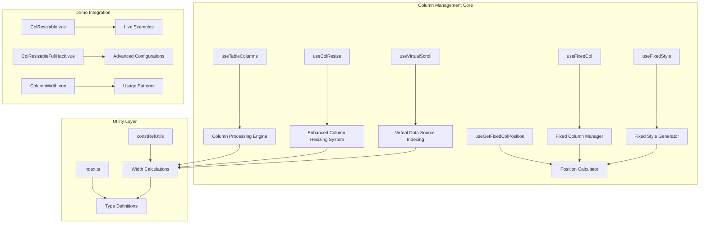
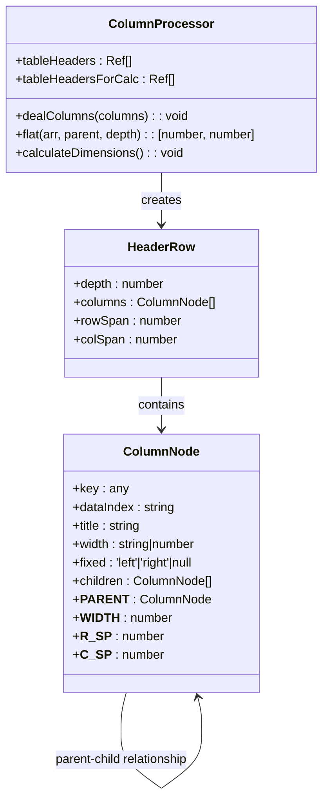
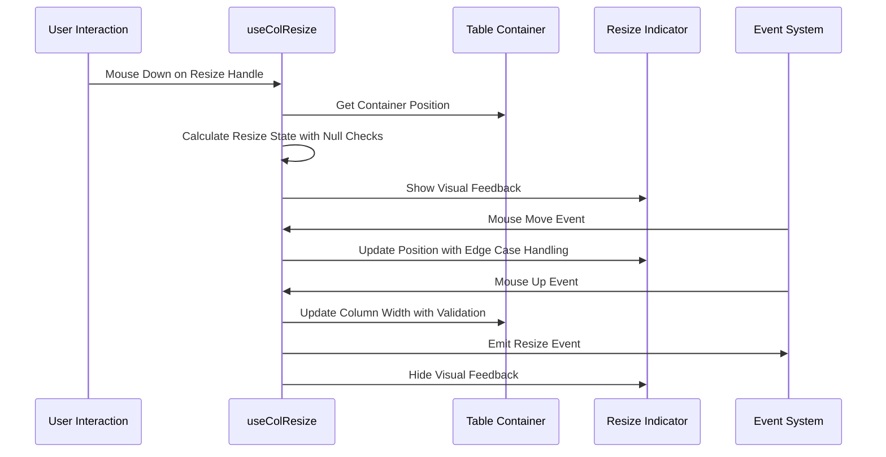
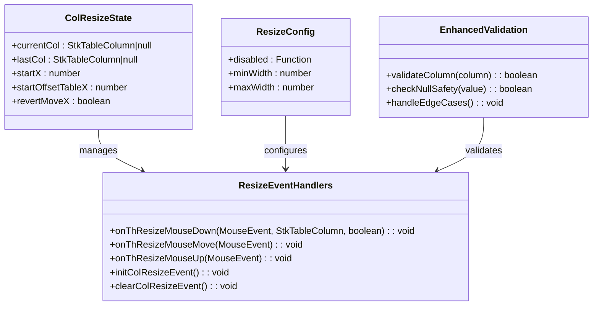
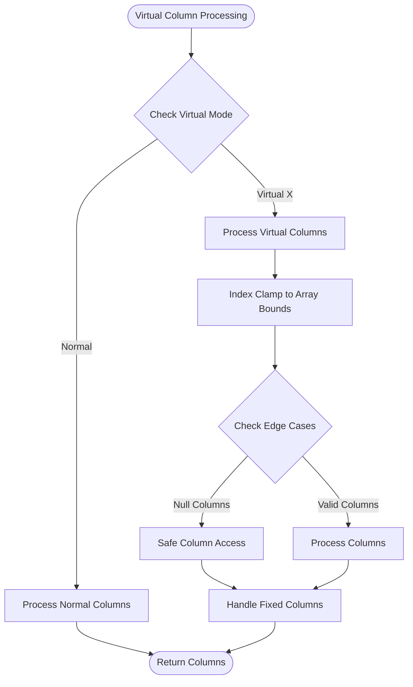
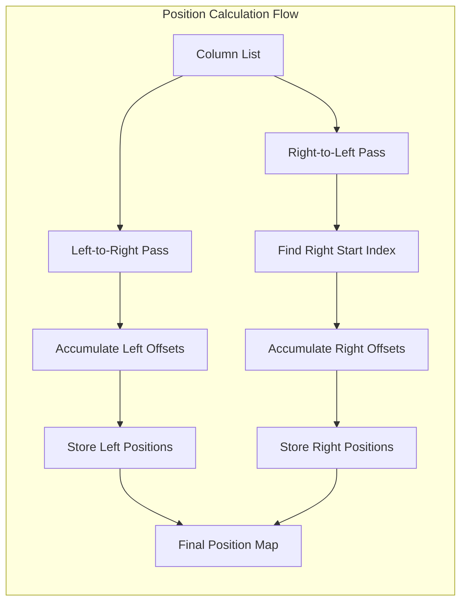

# Column Management System

<cite>
**Referenced Files in This Document**
- [useTableColumns.ts](file://src/StkTable/useTableColumns.ts)
- [useColResize.ts](file://src/StkTable/useColResize.ts)
- [useFixedCol.ts](file://src/StkTable/useFixedCol.ts)
- [useFixedStyle.ts](file://src/StkTable/useFixedStyle.ts)
- [useGetFixedColPosition.ts](file://src/StkTable/useGetFixedColPosition.ts)
- [useVirtualScroll.ts](file://src/StkTable/useVirtualScroll.ts)
- [constRefUtils.ts](file://src/StkTable/utils/constRefUtils.ts)
- [index.ts](file://src/StkTable/types/index.ts)
- [ColResizable.vue](file://docs-demo/advanced/column-resize/ColResizable.vue)
- [ColResizableFullHack.vue](file://docs-demo/advanced/column-resize/ColResizableFullHack.vue)
- [ColumnWidth.vue](file://docs-demo/basic/column-width/ColumnWidth.vue)
</cite>

## Update Summary
**Changes Made**
- Enhanced Column Resizing System section with improved null checking and edge case handling
- Added Virtual Data Source Indexing section for better virtual scrolling column management
- Updated troubleshooting guide with new edge case scenarios
- Improved error handling documentation for virtual data source operations

## Table of Contents
1. [Introduction](#introduction)
2. [System Architecture](#system-architecture)
3. [Core Components](#core-components)
4. [Column Processing Engine](#column-processing-engine)
5. [Enhanced Column Resizing System](#enhanced-column-resizing-system)
6. [Virtual Data Source Indexing](#virtual-data-source-indexing)
7. [Fixed Column Management](#fixed-column-management)
8. [Column Width Calculation](#column-width-calculation)
9. [Integration Examples](#integration-examples)
10. [Performance Considerations](#performance-considerations)
11. [Troubleshooting Guide](#troubleshooting-guide)
12. [Conclusion](#conclusion)

## Introduction

The Column Management System is a comprehensive solution for handling table columns in the StkTable Vue component library. This system manages column configuration, multi-level header processing, column resizing, fixed columns, and responsive column width calculations. It provides a robust foundation for building complex table interfaces with advanced column manipulation capabilities.

The system is designed to handle various column scenarios including simple single-level headers, complex multi-level headers, resizable columns, fixed-positioned columns, and virtual scrolling environments. It ensures optimal performance while maintaining flexibility for different use cases.

## System Architecture

The Column Management System follows a modular architecture with clear separation of concerns:

**Diagram sources**
- [useTableColumns.ts:15-130](file://src/StkTable/useTableColumns.ts#L15-L130)
- [useColResize.ts:29-201](file://src/StkTable/useColResize.ts#L29-L201)
- [useFixedCol.ts:19-155](file://src/StkTable/useFixedCol.ts#L19-L155)
- [useVirtualScroll.ts:126-154](file://src/StkTable/useVirtualScroll.ts#L126-L154)

## Core Components

### Column Processing Engine

The Column Processing Engine serves as the central hub for all column-related operations. It handles multi-level header processing, column flattening, and maintains the relationship between parent and child columns.

**Diagram sources**
- [useTableColumns.ts:38-130](file://src/StkTable/useTableColumns.ts#L38-L130)
- [index.ts:54-138](file://src/StkTable/types/index.ts#L54-L138)

**Section sources**
- [useTableColumns.ts:15-137](file://src/StkTable/useTableColumns.ts#L15-L137)
- [index.ts:54-138](file://src/StkTable/types/index.ts#L54-L138)

## Enhanced Column Resizing System

**Updated** Enhanced with improved null checking and better edge case handling for virtual data source indexing

The Column Resizing System provides interactive column width adjustment capabilities with support for both left and right resize handles, minimum width constraints, and visual feedback during resizing operations. Recent enhancements include robust null checking and improved edge case handling.

**Diagram sources**
- [useColResize.ts:73-188](file://src/StkTable/useColResize.ts#L73-L188)

### Enhanced Resize State Management

The resize system now includes comprehensive null checking and edge case validation:

**Diagram sources**
- [useColResize.ts:5-48](file://src/StkTable/useColResize.ts#L5-L48)
- [useColResize.ts:73-188](file://src/StkTable/useColResize.ts#L73-L188)

**Section sources**
- [useColResize.ts:29-201](file://src/StkTable/useColResize.ts#L29-L201)

### Improved Null Checking and Edge Case Handling

Recent enhancements include:

- **Null Safety**: All column operations now include null checks before accessing column properties
- **Edge Case Validation**: Enhanced validation for virtual data source indexing scenarios
- **Graceful Degradation**: Improved error handling when columns become unavailable during resize operations
- **Type Safety**: Enhanced TypeScript definitions for better compile-time safety

**Section sources**
- [useColResize.ts:73-188](file://src/StkTable/useColResize.ts#L73-L188)

## Virtual Data Source Indexing

**New Section** Added to document enhanced virtual data source indexing capabilities

The Virtual Data Source Indexing system provides robust column management for virtual scrolling environments with enhanced edge case handling and null checking.

**Diagram sources**
- [useVirtualScroll.ts:126-154](file://src/StkTable/useVirtualScroll.ts#L126-L154)

### Enhanced Index Clamping and Null Safety

The virtual scrolling system now includes:

- **Index Clamping**: Automatic clamping of start and end indices to array bounds
- **Null Column Handling**: Safe access to columns with null checks
- **Edge Case Protection**: Robust handling of dynamic column count changes
- **Fixed Column Preservation**: Ensures fixed columns remain visible during virtual scrolling

**Section sources**
- [useVirtualScroll.ts:126-154](file://src/StkTable/useVirtualScroll.ts#L126-L154)

## Fixed Column Management

### Position Calculation System

The fixed column positioning system calculates precise positions for columns in both normal and virtual scrolling scenarios, accounting for scroll offsets and container dimensions.

**Diagram sources**
- [useGetFixedColPosition.ts:23-61](file://src/StkTable/useGetFixedColPosition.ts#L23-L61)

**Section sources**
- [useFixedCol.ts:91-145](file://src/StkTable/useFixedCol.ts#L91-L145)
- [useFixedStyle.ts:34-72](file://src/StkTable/useFixedStyle.ts#L34-L72)
- [useGetFixedColPosition.ts:15-65](file://src/StkTable/useGetFixedColPosition.ts#L15-L65)

## Column Width Calculation

### Width Resolution Strategy

The width calculation system implements a sophisticated resolution strategy that prioritizes appropriate width values based on the current table mode and configuration.

**Diagram sources**
- [constRefUtils.ts:9-20](file://src/StkTable/utils/constRefUtils.ts#L9-L20)

**Section sources**
- [constRefUtils.ts:1-30](file://src/StkTable/utils/constRefUtils.ts#L1-L30)

## Integration Examples

### Live Resizing Demo

The column resizing functionality is demonstrated through comprehensive live demos showcasing real-time column width adjustments with visual feedback and persistent state updates.

**Section sources**
- [ColResizable.vue:1-46](file://docs-demo/advanced/column-resize/ColResizable.vue#L1-L46)
- [ColResizableFullHack.vue:1-51](file://docs-demo/advanced/column-resize/ColResizableFullHack.vue#L1-L51)

### Column Width Configuration

The basic column width demonstration showcases various width configuration options including fixed widths, maximum width constraints, and responsive behavior in virtual scrolling environments.

**Section sources**
- [ColumnWidth.vue:1-46](file://docs-demo/basic/column-width/ColumnWidth.vue#L1-L46)

## Performance Considerations

### Optimized Rendering Pipeline

The column management system implements several performance optimizations including:

- **Lazy Evaluation**: Computed properties and reactive references minimize unnecessary recalculations
- **Efficient Data Structures**: Shallow refs and optimized arrays reduce memory overhead
- **Batch Updates**: Grouped operations prevent excessive re-renders
- **Constraint Validation**: Early exit conditions avoid redundant processing
- **Enhanced Null Checking**: Reduced error handling overhead through proactive null safety

### Memory Management

The system employs careful memory management strategies:

- **WeakMap Usage**: Reference-based storage for internal relationships
- **Computed Caching**: Memoized calculations prevent repeated computations
- **Event Cleanup**: Proper event listener management prevents memory leaks
- **Virtual Scrolling Optimization**: Efficient column indexing reduces memory footprint

## Troubleshooting Guide

### Common Issues and Solutions

**Multi-level Header Limitations**
- Issue: Multi-level headers not supported with horizontal virtual scrolling
- Solution: Disable horizontal virtual scrolling when using complex headers

**Fixed Column Positioning**
- Issue: Fixed columns not appearing in expected positions
- Solution: Verify column ordering and ensure proper fixed property assignment

**Resize Handle Conflicts**
- Issue: Resize handles not responding to mouse events
- Solution: Check colResizable configuration and ensure proper event binding

**Width Calculation Errors**
- Issue: Unexpected column widths in virtual mode
- Solution: Verify minWidth vs width priority and default value fallbacks

**Enhanced Edge Case Handling**
- Issue: Column resize fails with dynamic column changes
- Solution: Ensure proper null checking and index validation in virtual environments
- Issue: Fixed columns disappear during virtual scrolling
- Solution: Verify index clamping and edge case protection mechanisms

**Section sources**
- [useTableColumns.ts:65-67](file://src/StkTable/useTableColumns.ts#L65-L67)
- [useColResize.ts:151-153](file://src/StkTable/useColResize.ts#L151-L153)
- [useVirtualScroll.ts:133-136](file://src/StkTable/useVirtualScroll.ts#L133-L136)

## Conclusion

The Column Management System provides a comprehensive solution for handling complex table column scenarios in modern web applications. Its modular architecture, robust processing engine, and extensive configuration options make it suitable for a wide range of use cases from simple data tables to complex analytical interfaces.

The recent enhancements to the column resizing system with improved null checking and better edge case handling for virtual data source indexing significantly improve the system's reliability and performance. These improvements ensure that column operations remain stable even under challenging conditions such as dynamic column changes, virtual scrolling environments, and edge case scenarios.

The system's emphasis on performance, accessibility, and developer experience ensures reliable operation across diverse environments while maintaining flexibility for customization. The integration with Vue's reactivity system enables seamless updates and optimal rendering performance.

Future enhancements could include additional column manipulation features, enhanced keyboard navigation support, and expanded customization options for advanced use cases.