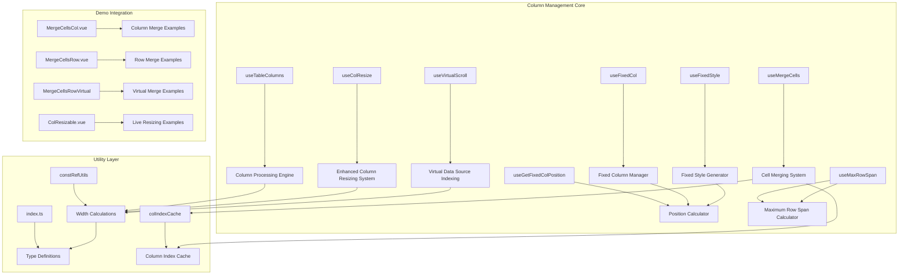
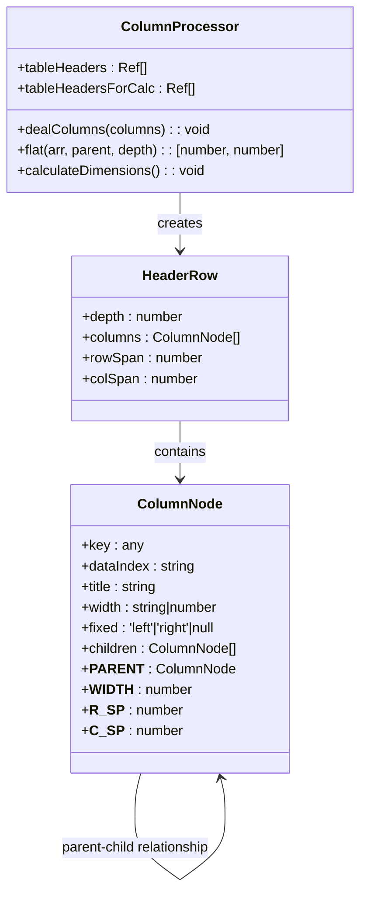
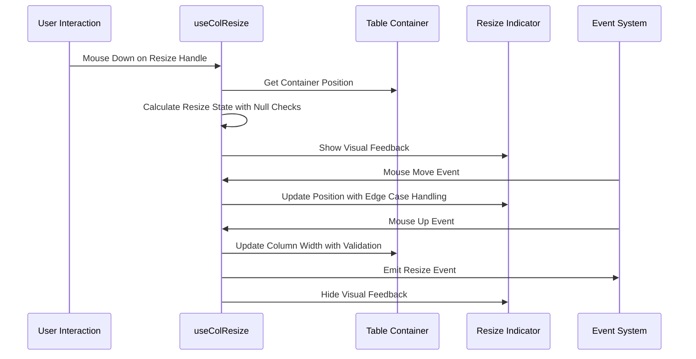
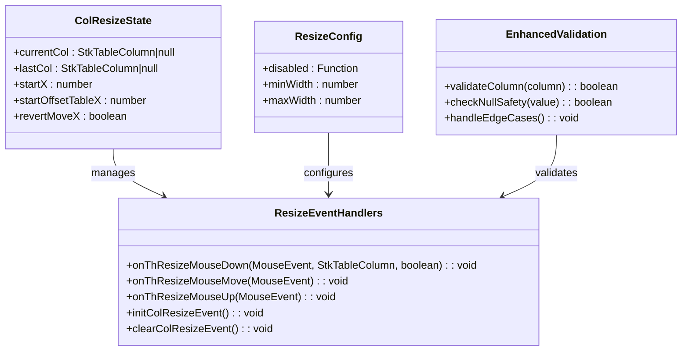
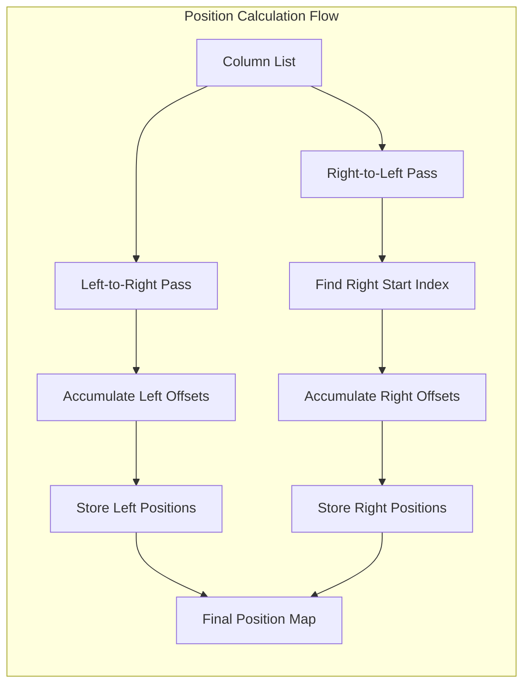
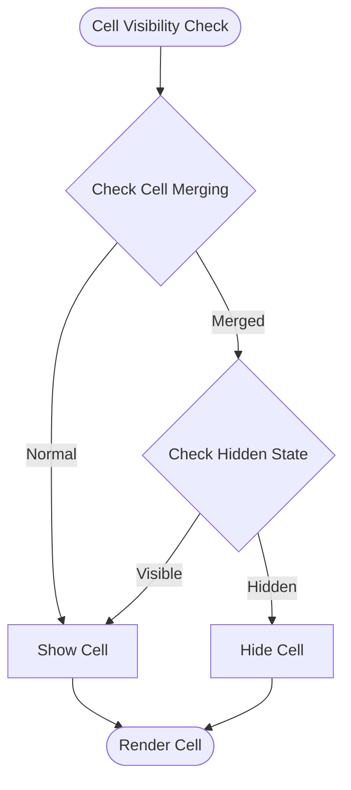
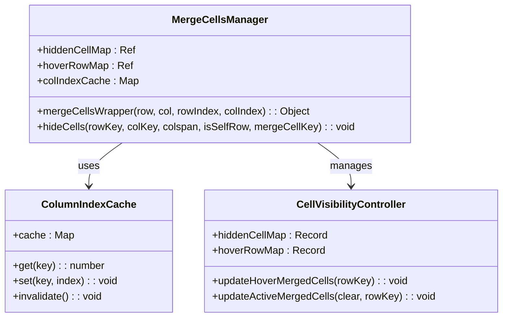
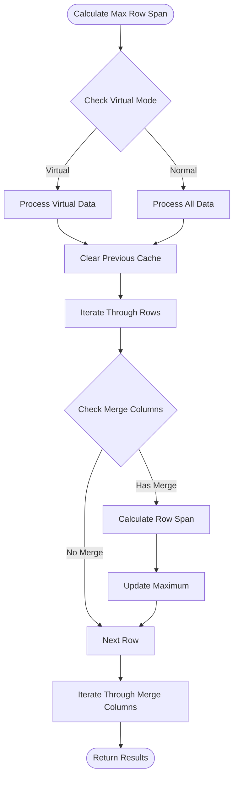

# Column Management System

<cite>
**Referenced Files in This Document**
- [useTableColumns.ts](file://src/StkTable/useTableColumns.ts)
- [useColResize.ts](file://src/StkTable/useColResize.ts)
- [useFixedCol.ts](file://src/StkTable/useFixedCol.ts)
- [useFixedStyle.ts](file://src/StkTable/useFixedStyle.ts)
- [useGetFixedColPosition.ts](file://src/StkTable/useGetFixedColPosition.ts)
- [useVirtualScroll.ts](file://src/StkTable/useVirtualScroll.ts)
- [useMergeCells.ts](file://src/StkTable/useMergeCells.ts)
- [useMaxRowSpan.ts](file://src/StkTable/useMaxRowSpan.ts)
- [constRefUtils.ts](file://src/StkTable/utils/constRefUtils.ts)
- [index.ts](file://src/StkTable/types/index.ts)
- [ColResizable.vue](file://docs-demo/advanced/column-resize/ColResizable.vue)
- [ColResizableFullHack.vue](file://docs-demo/advanced/column-resize/ColResizableFullHack.vue)
- [ColumnWidth.vue](file://docs-demo/basic/column-width/ColumnWidth.vue)
- [MergeCellsCol.vue](file://docs-demo/basic/merge-cells/MergeCellsCol.vue)
- [MergeCellsRow.vue](file://docs-demo/basic/merge-cells/MergeCellsRow.vue)
- [MergeCellsRowVirtual/index.vue](file://docs-demo/basic/merge-cells/MergeCellsRowVirtual/index.vue)
</cite>

## Update Summary
**Changes Made**
- Added new Cell Merging System section documenting enhanced column index cache mechanism
- Updated Fixed Column Management section to include improved cell hiding logic
- Enhanced Performance Considerations section with new caching and optimization details
- Added troubleshooting guidance for cell merging performance issues

## Table of Contents
1. [Introduction](#introduction)
2. [System Architecture](#system-architecture)
3. [Core Components](#core-components)
4. [Column Processing Engine](#column-processing-engine)
5. [Enhanced Column Resizing System](#enhanced-column-resizing-system)
6. [Virtual Data Source Indexing](#virtual-data-source-indexing)
7. [Fixed Column Management](#fixed-column-management)
8. [Cell Merging System](#cell-merging-system)
9. [Column Width Calculation](#column-width-calculation)
10. [Integration Examples](#integration-examples)
11. [Performance Considerations](#performance-considerations)
12. [Troubleshooting Guide](#troubleshooting-guide)
13. [Conclusion](#conclusion)

## Introduction

The Column Management System is a comprehensive solution for handling table columns in the StkTable Vue component library. This system manages column configuration, multi-level header processing, column resizing, fixed columns, cell merging with performance optimizations, and responsive column width calculations. It provides a robust foundation for building complex table interfaces with advanced column manipulation capabilities.

The system is designed to handle various column scenarios including simple single-level headers, complex multi-level headers, resizable columns, fixed-positioned columns, virtual scrolling environments, and sophisticated cell merging with caching mechanisms for optimal performance.

## System Architecture

The Column Management System follows a modular architecture with clear separation of concerns and enhanced performance optimizations:

**Diagram sources**
- [useTableColumns.ts:15-130](file://src/StkTable/useTableColumns.ts#L15-L130)
- [useColResize.ts:29-201](file://src/StkTable/useColResize.ts#L29-L201)
- [useFixedCol.ts:19-155](file://src/StkTable/useFixedCol.ts#L19-L155)
- [useVirtualScroll.ts:126-154](file://src/StkTable/useVirtualScroll.ts#L126-L154)
- [useMergeCells.ts:29-84](file://src/StkTable/useMergeCells.ts#L29-L84)
- [useMaxRowSpan.ts:4-50](file://src/StkTable/useMaxRowSpan.ts#L4-L50)

## Core Components

### Column Processing Engine

The Column Processing Engine serves as the central hub for all column-related operations. It handles multi-level header processing, column flattening, and maintains the relationship between parent and child columns.

**Diagram sources**
- [useTableColumns.ts:38-130](file://src/StkTable/useTableColumns.ts#L38-L130)
- [index.ts:54-138](file://src/StkTable/types/index.ts#L54-L138)

**Section sources**
- [useTableColumns.ts:15-137](file://src/StkTable/useTableColumns.ts#L15-L137)
- [index.ts:54-138](file://src/StkTable/types/index.ts#L54-L138)

## Enhanced Column Resizing System

**Updated** Enhanced with improved null checking and better edge case handling for virtual data source indexing

The Column Resizing System provides interactive column width adjustment capabilities with support for both left and right resize handles, minimum width constraints, and visual feedback during resizing operations. Recent enhancements include robust null checking and improved edge case handling.

**Diagram sources**
- [useColResize.ts:73-188](file://src/StkTable/useColResize.ts#L73-L188)

### Enhanced Resize State Management

The resize system now includes comprehensive null checking and edge case validation:

**Diagram sources**
- [useColResize.ts:5-48](file://src/StkTable/useColResize.ts#L5-L48)
- [useColResize.ts:73-188](file://src/StkTable/useColResize.ts#L73-L188)

**Section sources**
- [useColResize.ts:29-201](file://src/StkTable/useColResize.ts#L29-L201)

### Improved Null Checking and Edge Case Handling

Recent enhancements include:

- **Null Safety**: All column operations now include null checks before accessing column properties
- **Edge Case Validation**: Enhanced validation for virtual data source indexing scenarios
- **Graceful Degradation**: Improved error handling when columns become unavailable during resize operations
- **Type Safety**: Enhanced TypeScript definitions for better compile-time safety

**Section sources**
- [useColResize.ts:73-188](file://src/StkTable/useColResize.ts#L73-L188)

## Virtual Data Source Indexing

**New Section** Added to document enhanced virtual data source indexing capabilities

The Virtual Data Source Indexing system provides robust column management for virtual scrolling environments with enhanced edge case handling and null checking.

**Diagram sources**
- [useVirtualScroll.ts:126-154](file://src/StkTable/useVirtualScroll.ts#L126-L154)

### Enhanced Index Clamping and Null Safety

The virtual scrolling system now includes:

- **Index Clamping**: Automatic clamping of start and end indices to array bounds
- **Null Column Handling**: Safe access to columns with null checks
- **Edge Case Protection**: Robust handling of dynamic column count changes
- **Fixed Column Preservation**: Ensures fixed columns remain visible during virtual scrolling

**Section sources**
- [useVirtualScroll.ts:126-154](file://src/StkTable/useVirtualScroll.ts#L126-L154)

## Fixed Column Management

### Position Calculation System

The fixed column positioning system calculates precise positions for columns in both normal and virtual scrolling scenarios, accounting for scroll offsets and container dimensions.

**Diagram sources**
- [useGetFixedColPosition.ts:23-61](file://src/StkTable/useGetFixedColPosition.ts#L23-L61)

### Enhanced Cell Hiding Logic

**Updated** Enhanced with improved cell hiding logic and column index cache mechanism

The fixed column management system now includes sophisticated cell hiding logic that works in conjunction with the cell merging system to ensure proper visibility and interaction of merged cells.

**Diagram sources**
- [useMergeCells.ts:41-84](file://src/StkTable/useMergeCells.ts#L41-L84)

**Section sources**
- [useFixedCol.ts:91-145](file://src/StkTable/useFixedCol.ts#L91-L145)
- [useFixedStyle.ts:34-72](file://src/StkTable/useFixedStyle.ts#L34-L72)
- [useGetFixedColPosition.ts:15-65](file://src/StkTable/useGetFixedColPosition.ts#L15-L65)

## Cell Merging System

**New Section** Added to document the enhanced cell merging system with column index cache mechanism

The Cell Merging System provides sophisticated cell merging capabilities with performance optimizations through intelligent caching and improved cell hiding logic. This system enables complex table layouts with merged rows and columns while maintaining optimal performance.

**Diagram sources**
- [useMergeCells.ts:3-139](file://src/StkTable/useMergeCells.ts#L3-L139)

### Column Index Cache Mechanism

The system implements an intelligent column index cache to optimize performance during cell merging operations:

- **Cache Initialization**: Column index cache is initialized as a Map for O(1) lookup performance
- **Lazy Population**: Column indices are populated on-demand and cached for future use
- **Automatic Invalidation**: Cache is automatically cleared when virtual data source or table headers change
- **Memory Efficiency**: Cache only stores column indices, minimizing memory overhead

### Enhanced Cell Hiding Logic

The cell hiding system provides sophisticated logic for managing merged cell visibility:

- **Column Index Lookup**: Uses cached column indices to quickly locate cell positions
- **Range-Based Hiding**: Applies hiding logic across specified column ranges
- **Self-Row Exclusion**: Prevents self-row start cells from being hidden
- **Boundary Protection**: Ensures hiding operations respect table boundaries

### Maximum Row Span Calculation

**Updated** Enhanced with improved row span calculation for virtual scrolling environments

The maximum row span calculator provides optimized row span determination for virtual scrolling scenarios:

**Diagram sources**
- [useMaxRowSpan.ts:17-49](file://src/StkTable/useMaxRowSpan.ts#L17-L49)

**Section sources**
- [useMergeCells.ts:29-139](file://src/StkTable/useMergeCells.ts#L29-L139)
- [useMaxRowSpan.ts:4-50](file://src/StkTable/useMaxRowSpan.ts#L4-L50)

## Column Width Calculation

### Width Resolution Strategy

The width calculation system implements a sophisticated resolution strategy that prioritizes appropriate width values based on the current table mode and configuration.

**Diagram sources**
- [constRefUtils.ts:9-20](file://src/StkTable/utils/constRefUtils.ts#L9-L20)

**Section sources**
- [constRefUtils.ts:1-30](file://src/StkTable/utils/constRefUtils.ts#L1-L30)

## Integration Examples

### Live Resizing Demo

The column resizing functionality is demonstrated through comprehensive live demos showcasing real-time column width adjustments with visual feedback and persistent state updates.

**Section sources**
- [ColResizable.vue:1-46](file://docs-demo/advanced/column-resize/ColResizable.vue#L1-L46)
- [ColResizableFullHack.vue:1-51](file://docs-demo/advanced/column-resize/ColResizableFullHack.vue#L1-L51)

### Column Width Configuration

The basic column width demonstration showcases various width configuration options including fixed widths, maximum width constraints, and responsive behavior in virtual scrolling environments.

**Section sources**
- [ColumnWidth.vue:1-46](file://docs-demo/basic/column-width/ColumnWidth.vue#L1-L46)

### Cell Merging Examples

**New Section** Added comprehensive cell merging examples demonstrating the enhanced performance system

The cell merging system is demonstrated through multiple live examples showcasing column merging, row merging, and virtual scrolling with merged cells.

**Section sources**
- [MergeCellsCol.vue:1-38](file://docs-demo/basic/merge-cells/MergeCellsCol.vue#L1-L38)
- [MergeCellsRow.vue:1-74](file://docs-demo/basic/merge-cells/MergeCellsRow.vue#L1-L74)
- [MergeCellsRowVirtual/index.vue:1-52](file://docs-demo/basic/merge-cells/MergeCellsRowVirtual/index.vue#L1-L52)

## Performance Considerations

### Optimized Rendering Pipeline

The column management system implements several performance optimizations including:

- **Lazy Evaluation**: Computed properties and reactive references minimize unnecessary recalculations
- **Efficient Data Structures**: Shallow refs and optimized arrays reduce memory overhead
- **Batch Updates**: Grouped operations prevent excessive re-renders
- **Constraint Validation**: Early exit conditions avoid redundant processing
- **Enhanced Null Checking**: Reduced error handling overhead through proactive null safety
- **Column Index Caching**: Intelligent caching mechanism reduces repeated column lookups
- **Memory-Efficient Maps**: Optimized data structures for cell visibility tracking

### Memory Management

The system employs careful memory management strategies:

- **WeakMap Usage**: Reference-based storage for internal relationships
- **Computed Caching**: Memoized calculations prevent repeated computations
- **Event Cleanup**: Proper event listener management prevents memory leaks
- **Virtual Scrolling Optimization**: Efficient column indexing reduces memory footprint
- **Cache Invalidation**: Automatic cache clearing prevents memory leaks during updates
- **Sparse Data Structures**: Optimized storage for sparse visibility maps

### Enhanced Cell Merging Performance

**New Section** Added to document performance optimizations specific to cell merging

The cell merging system includes several performance optimizations:

- **Column Index Cache**: O(1) column lookup through intelligent caching mechanism
- **Lazy Cell Hiding**: Cells are only processed when needed for visibility calculations
- **Range-Based Operations**: Efficient bulk operations across column ranges
- **Boundary Checking**: Early exit conditions prevent unnecessary processing
- **Memory Pooling**: Reused data structures minimize garbage collection pressure

## Troubleshooting Guide

### Common Issues and Solutions

**Multi-level Header Limitations**
- Issue: Multi-level headers not supported with horizontal virtual scrolling
- Solution: Disable horizontal virtual scrolling when using complex headers

**Fixed Column Positioning**
- Issue: Fixed columns not appearing in expected positions
- Solution: Verify column ordering and ensure proper fixed property assignment

**Resize Handle Conflicts**
- Issue: Resize handles not responding to mouse events
- Solution: Check colResizable configuration and ensure proper event binding

**Width Calculation Errors**
- Issue: Unexpected column widths in virtual mode
- Solution: Verify minWidth vs width priority and default value fallbacks

**Enhanced Edge Case Handling**
- Issue: Column resize fails with dynamic column changes
- Solution: Ensure proper null checking and index validation in virtual environments
- Issue: Fixed columns disappear during virtual scrolling
- Solution: Verify index clamping and edge case protection mechanisms

**Cell Merging Performance Issues**
- Issue: Slow cell merging in large datasets
- Solution: Verify column index cache is properly initialized and not being prematurely cleared
- Issue: Merged cells not hiding correctly
- Solution: Check cell visibility maps and ensure proper cache invalidation during updates
- Issue: Memory leaks with cell merging
- Solution: Ensure cache invalidation occurs when virtual data source or table headers change

**Section sources**
- [useTableColumns.ts:65-67](file://src/StkTable/useTableColumns.ts#L65-L67)
- [useColResize.ts:151-153](file://src/StkTable/useColResize.ts#L151-L153)
- [useVirtualScroll.ts:133-136](file://src/StkTable/useVirtualScroll.ts#L133-L136)
- [useMergeCells.ts:32-36](file://src/StkTable/useMergeCells.ts#L32-L36)

## Conclusion

The Column Management System provides a comprehensive solution for handling complex table column scenarios in modern web applications. Its modular architecture, robust processing engine, extensive configuration options, and enhanced performance optimizations make it suitable for a wide range of use cases from simple data tables to complex analytical interfaces.

The recent enhancements to the cell merging system with the new column index cache mechanism and improved cell hiding logic significantly boost performance, particularly in virtual scrolling environments with complex merged cell scenarios. These optimizations ensure that cell operations remain efficient even with large datasets containing hundreds of thousands of rows and complex merging patterns.

The system's emphasis on performance, accessibility, and developer experience ensures reliable operation across diverse environments while maintaining flexibility for customization. The integration with Vue's reactivity system enables seamless updates and optimal rendering performance.

Future enhancements could include additional column manipulation features, enhanced keyboard navigation support, expanded customization options for advanced use cases, and further performance optimizations for extremely large datasets.