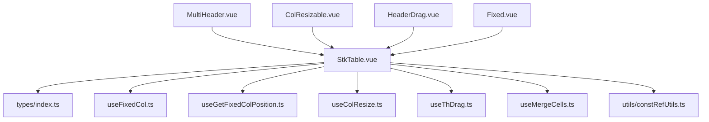
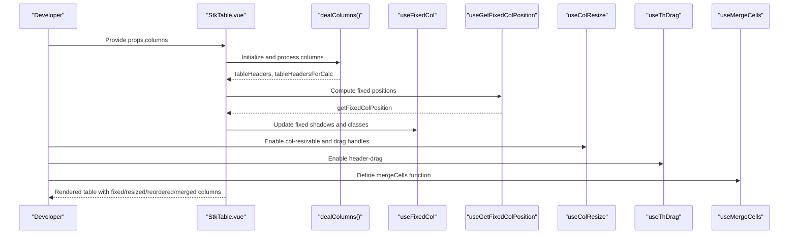
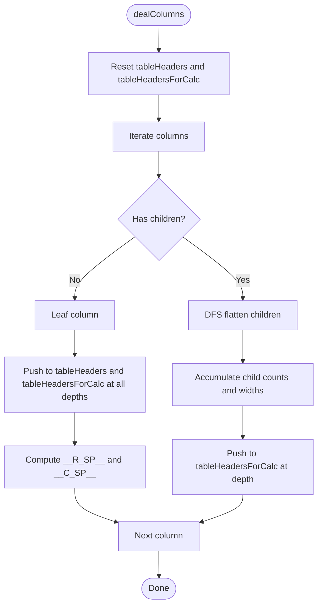
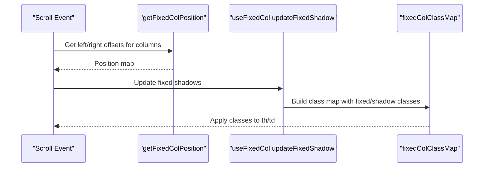
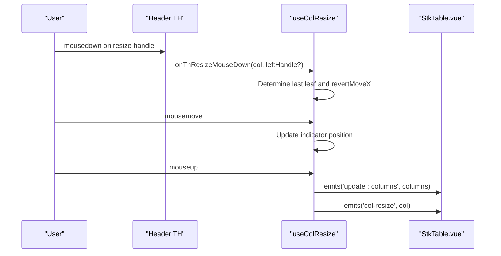
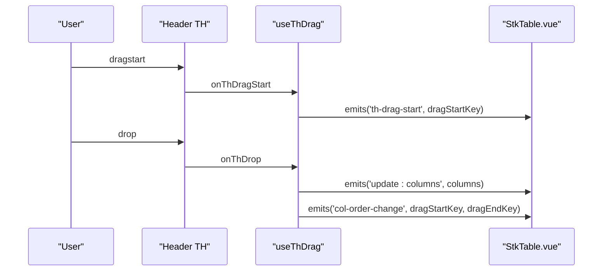
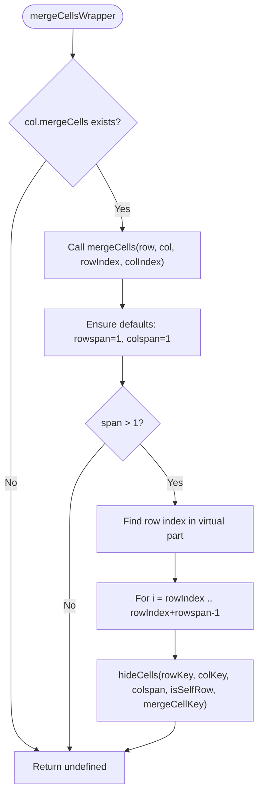
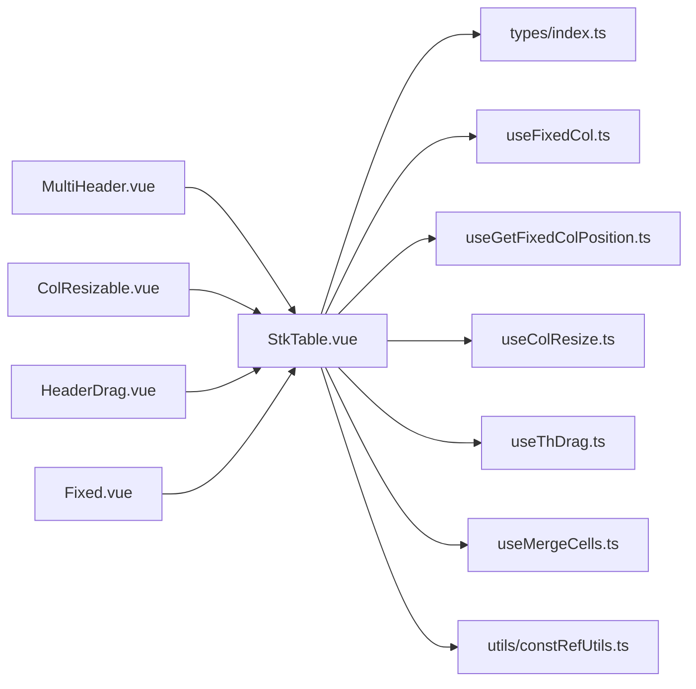

# Column Management System

<cite>
**Referenced Files in This Document**
- [StkTable.vue](file://src/StkTable/StkTable.vue)
- [types/index.ts](file://src/StkTable/types/index.ts)
- [useFixedCol.ts](file://src/StkTable/useFixedCol.ts)
- [useGetFixedColPosition.ts](file://src/StkTable/useGetFixedColPosition.ts)
- [useColResize.ts](file://src/StkTable/useColResize.ts)
- [useThDrag.ts](file://src/StkTable/useThDrag.ts)
- [useMergeCells.ts](file://src/StkTable/useMergeCells.ts)
- [constRefUtils.ts](file://src/StkTable/utils/constRefUtils.ts)
- [MultiHeader.vue](file://docs-demo/basic/multi-header/MultiHeader.vue)
- [ColResizable.vue](file://docs-demo/advanced/column-resize/ColResizable.vue)
- [HeaderDrag.vue](file://docs-demo/advanced/header-drag/HeaderDrag.vue)
- [Fixed.vue](file://docs-demo/basic/fixed/Fixed.vue)
- [stk-table-column.md](file://docs-src/main/api/stk-table-column.md)
</cite>

## Table of Contents
1. [Introduction](#introduction)
2. [Project Structure](#project-structure)
3. [Core Components](#core-components)
4. [Architecture Overview](#architecture-overview)
5. [Detailed Component Analysis](#detailed-component-analysis)
6. [Dependency Analysis](#dependency-analysis)
7. [Performance Considerations](#performance-considerations)
8. [Troubleshooting Guide](#troubleshooting-guide)
9. [Conclusion](#conclusion)
10. [Appendices](#appendices)

## Introduction
This document explains how Stk Table Vue manages dynamic column configurations. It covers the StkTableColumn interface, multi-level header construction, column fixing (left/right), responsive behavior, visibility toggling, resizing, drag-and-drop reordering, and cell merging. It also details the relationship between tableHeaders and tableHeadersForCalc, column spanning for merged cells, and how column configurations influence virtual scrolling calculations.

## Project Structure
The column management system is implemented in the StkTable component and supporting composables:
- Column definition and types live in types/index.ts
- Rendering and orchestration in StkTable.vue
- Column fixing, resizing, dragging, and merging in dedicated composables
- Utility helpers for widths and IDs in constRefUtils.ts
- Demo pages illustrate complex setups

**Diagram sources**
- [StkTable.vue](file://src/StkTable/StkTable.vue#L942-L1033)
- [types/index.ts](file://src/StkTable/types/index.ts#L54-L120)
- [useFixedCol.ts](file://src/StkTable/useFixedCol.ts#L19-L151)
- [useGetFixedColPosition.ts](file://src/StkTable/useGetFixedColPosition.ts#L15-L66)
- [useColResize.ts](file://src/StkTable/useColResize.ts#L29-L215)
- [useThDrag.ts](file://src/StkTable/useThDrag.ts#L14-L103)
- [useMergeCells.ts](file://src/StkTable/useMergeCells.ts#L11-L122)
- [constRefUtils.ts](file://src/StkTable/utils/constRefUtils.ts#L9-L20)
- [MultiHeader.vue](file://docs-demo/basic/multi-header/MultiHeader.vue#L6-L56)
- [ColResizable.vue](file://docs-demo/advanced/column-resize/ColResizable.vue#L9-L15)
- [HeaderDrag.vue](file://docs-demo/advanced/header-drag/HeaderDrag.vue#L9-L15)
- [Fixed.vue](file://docs-demo/basic/fixed/Fixed.vue#L12-L21)

**Section sources**
- [StkTable.vue](file://src/StkTable/StkTable.vue#L942-L1033)
- [types/index.ts](file://src/StkTable/types/index.ts#L54-L120)

## Core Components
- StkTableColumn interface defines all column properties including key, title, width, alignment, sorting, fixed position, children for multi-level headers, custom renderers, and mergeCells function.
- The StkTable component orchestrates column processing, rendering, and interactions via composables.

Key column properties:
- key: Unique column identifier (defaults to dataIndex if not provided)
- type: Special column types (seq, expand, dragRow)
- dataIndex: Field name in row data
- title: Header text
- align/headerAlign: Text alignment for cell/header
- sorter/sortField/sortType/sortConfig: Sorting behavior
- width/minWidth/maxWidth: Sizing controls
- fixed: 'left' | 'right' | null
- customCell/customHeaderCell: Custom renderers
- children: Nested columns for multi-level headers
- mergeCells: Function to compute rowspan/colspan for merged cells

**Section sources**
- [types/index.ts](file://src/StkTable/types/index.ts#L54-L120)
- [stk-table-column.md](file://docs-src/main/api/stk-table-column.md#L16-L83)

## Architecture Overview
The column lifecycle:
1. Columns are normalized and flattened into tableHeaders and tableHeadersForCalc
2. Fixed column positions are computed per level
3. Rendering uses tableHeaders for display and tableHeadersForCalc for layout and fixed column logic
4. Interactions (resize, drag, merge) update state and trigger re-render

**Diagram sources**
- [StkTable.vue](file://src/StkTable/StkTable.vue#L942-L1033)
- [useFixedCol.ts](file://src/StkTable/useFixedCol.ts#L85-L140)
- [useGetFixedColPosition.ts](file://src/StkTable/useGetFixedColPosition.ts#L17-L62)
- [useColResize.ts](file://src/StkTable/useColResize.ts#L83-L198)
- [useThDrag.ts](file://src/StkTable/useThDrag.ts#L68-L93)
- [useMergeCells.ts](file://src/StkTable/useMergeCells.ts#L66-L97)

## Detailed Component Analysis

### StkTableColumn Interface and Properties
- Defines all column metadata and behavior
- Includes special private fields (__R_SP__, __C_SP__, __PARENT__, __WIDTH__) used internally for fixed and virtual scrolling calculations
- Supports nested children for multi-level headers

Practical implications:
- width is mandatory for horizontal virtual scrolling
- minWidth/maxWidth apply outside virtual X mode
- fixed columns require accurate width computation for shadow and overlay logic

**Section sources**
- [types/index.ts](file://src/StkTable/types/index.ts#L54-L138)
- [stk-table-column.md](file://docs-src/main/api/stk-table-column.md#L16-L83)

### Multi-Level Headers and Column Spanning
- dealColumns flattens columns into tableHeaders (rendered) and tableHeadersForCalc (layout/computations)
- For each column:
  - If it has children, it becomes a group header with rowspan spanning levels
  - Leaf columns contribute to colSpan calculation for ancestors
  - Widths are accumulated for parents to support fixed column logic and virtual X
- tableHeaderLast is the last row of tableHeadersForCalc, used for leaf-level operations (e.g., resizing indicators)

**Diagram sources**
- [StkTable.vue](file://src/StkTable/StkTable.vue#L942-L1033)

**Section sources**
- [StkTable.vue](file://src/StkTable/StkTable.vue#L942-L1033)

### Column Fixing Mechanisms (Left/Right)
- Fixed column positions are computed per level using cumulative widths for left and reverse iteration for right
- Shadows are shown when fixed columns overlap viewport edges during scroll
- Classes are dynamically applied to th/td for fixed styles and shadows

Key behaviors:
- Left-fixed columns sum widths from the left
- Right-fixed columns sum widths from the right
- Shadow detection compares fixed positions against scrollLeft and container width
- Relative vs sticky modes affect where fixed columns are positioned

**Diagram sources**
- [useGetFixedColPosition.ts](file://src/StkTable/useGetFixedColPosition.ts#L17-L62)
- [useFixedCol.ts](file://src/StkTable/useFixedCol.ts#L85-L140)

**Section sources**
- [useGetFixedColPosition.ts](file://src/StkTable/useGetFixedColPosition.ts#L17-L62)
- [useFixedCol.ts](file://src/StkTable/useFixedCol.ts#L85-L140)
- [StkTable.vue](file://src/StkTable/StkTable.vue#L1148-L1165)

### Responsive Column Behavior
- Horizontal virtual scrolling requires explicit width on each column
- Column widths are converted to numbers for internal calculations
- getCalculatedColWidth prefers stored __WIDTH__ for virtual X correctness

Responsive considerations:
- Without width, horizontal virtual scrolling cannot compute visible columns accurately
- minWidth/maxWidth are used outside virtual X mode
- Dynamic updates to columns trigger recomputation and shadow refresh

**Section sources**
- [constRefUtils.ts](file://src/StkTable/utils/constRefUtils.ts#L9-L20)
- [StkTable.vue](file://src/StkTable/StkTable.vue#L1082-L1105)

### Column Visibility Toggling
- The component does not provide a built-in visibility toggle API
- To hide/show columns, manipulate props.columns (e.g., filter array) and ensure a new array reference so the component reacts
- After updating columns, the component reinitializes virtual X and fixed shadows automatically

Common pattern:
- Maintain a reactive columns array
- Filter entries to remove unwanted columns
- Emit update:columns if using two-way binding for column edits

**Section sources**
- [StkTable.vue](file://src/StkTable/StkTable.vue#L862-L874)

### Column Resizing Functionality
- Enables interactive resizing via left/right resize handles on headers
- Uses mouse events to track movement and update col.width
- Enforces minimum width and updates props.columns via update:columns
- Handles fixed right columns specially (left handle may adjust neighbor; right handle may adjust next fixed column)

**Diagram sources**
- [useColResize.ts](file://src/StkTable/useColResize.ts#L83-L198)
- [StkTable.vue](file://src/StkTable/StkTable.vue#L840-L848)

**Section sources**
- [useColResize.ts](file://src/StkTable/useColResize.ts#L29-L215)
- [ColResizable.vue](file://docs-demo/advanced/column-resize/ColResizable.vue#L9-L15)

### Drag-and-Drop Reordering
- Header drag-and-drop allows reordering columns by dragging th elements
- Supports insert and swap modes
- Emits update:columns and col-order-change events

**Diagram sources**
- [useThDrag.ts](file://src/StkTable/useThDrag.ts#L29-L93)
- [StkTable.vue](file://src/StkTable/StkTable.vue#L765-L766)

**Section sources**
- [useThDrag.ts](file://src/StkTable/useThDrag.ts#L14-L103)
- [HeaderDrag.vue](file://docs-demo/advanced/header-drag/HeaderDrag.vue#L9-L15)

### Column Merging Capabilities
- mergeCells function computes rowspan/colspan per cell
- Hidden cells are tracked per row to avoid duplicating merged content
- Hover/active states propagate to merged cells for highlighting
- Works with virtualized data source parts

**Diagram sources**
- [useMergeCells.ts](file://src/StkTable/useMergeCells.ts#L66-L97)

**Section sources**
- [useMergeCells.ts](file://src/StkTable/useMergeCells.ts#L11-L122)

### Relationship Between tableHeaders and tableHeadersForCalc
- tableHeaders: Rendered structure for display (used for thead rendering)
- tableHeadersForCalc: Auxiliary structure used for fixed column calculations and multi-level header layout
- tableHeaderLast: Last row of tableHeadersForCalc (leaf-level columns)
- __R_SP__ and __C_SP__: Internal row/col span markers computed during flattening

Implications:
- Fixed column logic relies on tableHeadersForCalc to compute positions
- Multi-level headers depend on accurate __R_SP__/__C_SP__ values
- Virtual X uses tableHeaderLast for leaf-level operations (e.g., resize indicators)

**Section sources**
- [StkTable.vue](file://src/StkTable/StkTable.vue#L675-L698)
- [StkTable.vue](file://src/StkTable/StkTable.vue#L942-L1033)

### How Column Configurations Affect Virtual Scrolling Calculations
- Horizontal virtual scrolling requires width on each column; widths are converted to numbers
- __WIDTH__ stores computed widths for accurate virtual X calculations
- Fixed column shadows and classes are recalculated after column updates and scroll events
- When columns change or virtualX toggles, the component reinitializes virtual X and updates fixed shadows

**Section sources**
- [constRefUtils.ts](file://src/StkTable/utils/constRefUtils.ts#L9-L20)
- [StkTable.vue](file://src/StkTable/StkTable.vue#L862-L894)
- [useFixedCol.ts](file://src/StkTable/useFixedCol.ts#L85-L140)

## Dependency Analysis

**Diagram sources**
- [StkTable.vue](file://src/StkTable/StkTable.vue#L942-L1033)
- [types/index.ts](file://src/StkTable/types/index.ts#L54-L120)
- [useFixedCol.ts](file://src/StkTable/useFixedCol.ts#L19-L151)
- [useGetFixedColPosition.ts](file://src/StkTable/useGetFixedColPosition.ts#L15-L66)
- [useColResize.ts](file://src/StkTable/useColResize.ts#L29-L215)
- [useThDrag.ts](file://src/StkTable/useThDrag.ts#L14-L103)
- [useMergeCells.ts](file://src/StkTable/useMergeCells.ts#L11-L122)
- [constRefUtils.ts](file://src/StkTable/utils/constRefUtils.ts#L9-L20)
- [MultiHeader.vue](file://docs-demo/basic/multi-header/MultiHeader.vue#L6-L56)
- [ColResizable.vue](file://docs-demo/advanced/column-resize/ColResizable.vue#L9-L15)
- [HeaderDrag.vue](file://docs-demo/advanced/header-drag/HeaderDrag.vue#L9-L15)
- [Fixed.vue](file://docs-demo/basic/fixed/Fixed.vue#L12-L21)

**Section sources**
- [StkTable.vue](file://src/StkTable/StkTable.vue#L942-L1033)

## Performance Considerations
- Prefer explicit width on columns for horizontal virtual scrolling to avoid expensive layout queries
- Minimize unnecessary column updates; mutating existing objects inside columns will not trigger reactions—replace the columns array reference when changing structure
- Fixed column shadows are opt-in (fixedColShadow) to reduce DOM updates
- Merge cells rely on virtual data partitions; keep virtualization enabled for large datasets to maintain responsiveness

## Troubleshooting Guide
- Multi-level headers with horizontal virtual scrolling: Not supported; the component logs an error and disables virtual X for multi-level headers
- Resizing not working: Ensure col-resizable is enabled and columns are bound with v-model:columns; each column must have a width defined
- Fixed columns not aligning: Verify fixed columns are placed on the leftmost/rightmost positions when using relative mode; sticky mode supports multi-level headers better
- Merged cells not appearing: Ensure mergeCells returns valid rowspan/colspan and that the virtual data partition is correctly aligned

**Section sources**
- [StkTable.vue](file://src/StkTable/StkTable.vue#L965-L967)
- [useColResize.ts](file://src/StkTable/useColResize.ts#L51-L56)
- [useFixedCol.ts](file://src/StkTable/useFixedCol.ts#L135-L137)

## Conclusion
Stk Table Vue’s column management system provides a robust foundation for dynamic, interactive tables. By leveraging the StkTableColumn interface, multi-level headers, fixed columns, resizing, drag-and-drop, and merging, developers can build complex layouts. Proper width configuration and careful handling of column updates are essential for optimal performance, especially under horizontal virtual scrolling.

## Appendices

### Practical Examples and Patterns
- Multi-level headers: Use children to create grouped headers; ensure widths are set for leaf nodes
  - Example: [MultiHeader.vue](file://docs-demo/basic/multi-header/MultiHeader.vue#L6-L56)
- Fixed columns: Combine fixed: 'left'/'right' with fixed-col-shadow for visual cues
  - Example: [Fixed.vue](file://docs-demo/basic/fixed/Fixed.vue#L12-L21)
- Resizable columns: Enable col-resizable and bind columns with v-model:columns
  - Example: [ColResizable.vue](file://docs-demo/advanced/column-resize/ColResizable.vue#L9-L15)
- Reorderable columns: Enable header-drag to allow drag-and-drop reordering
  - Example: [HeaderDrag.vue](file://docs-demo/advanced/header-drag/HeaderDrag.vue#L9-L15)

### Column Configuration Reference
- StkTableColumn properties and behaviors are defined in the types module and documented API page
  - Types: [types/index.ts](file://src/StkTable/types/index.ts#L54-L120)
  - API docs: [stk-table-column.md](file://docs-src/main/api/stk-table-column.md#L16-L83)