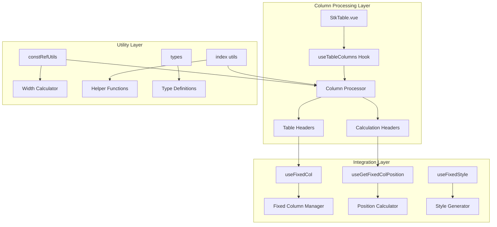
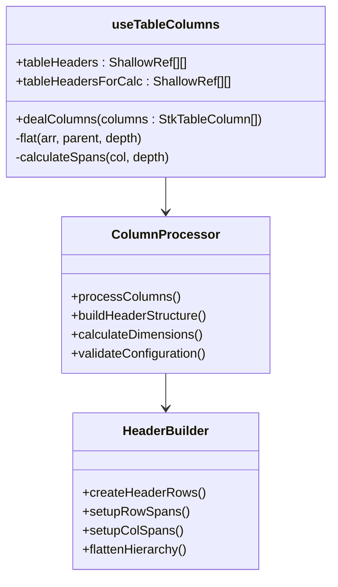
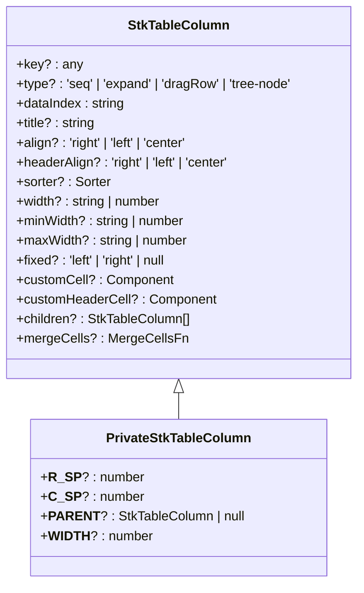
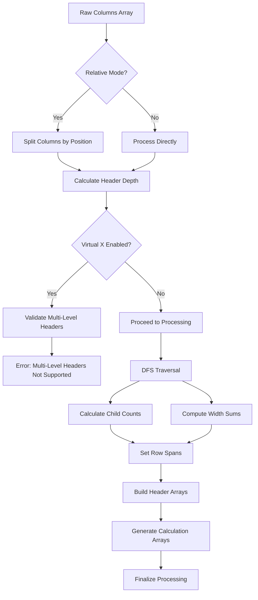
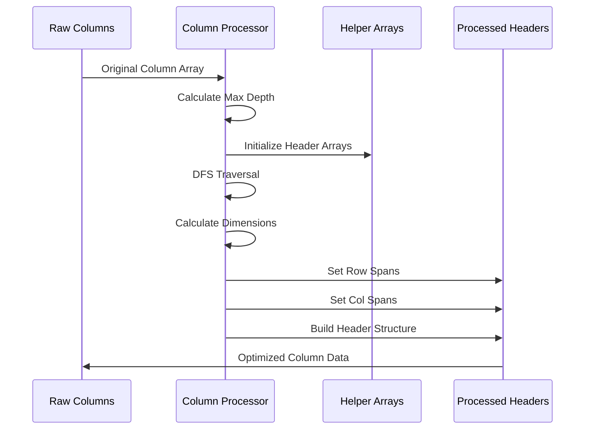
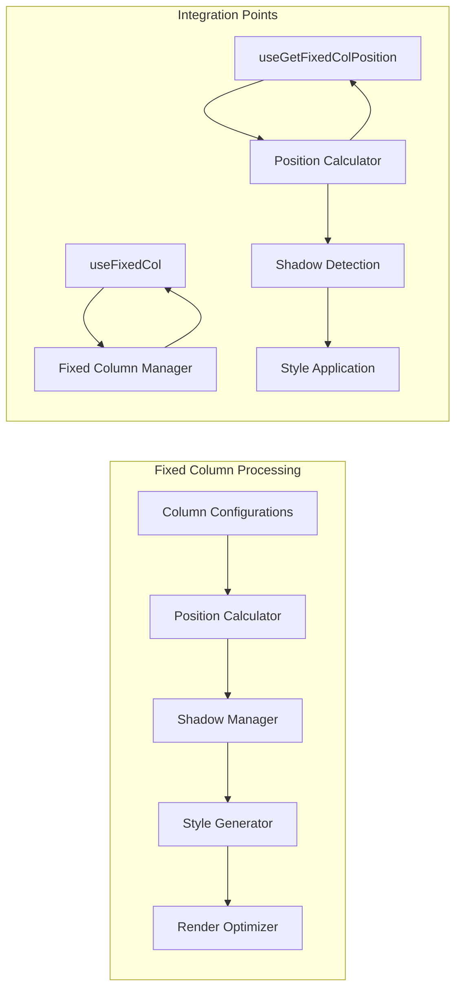
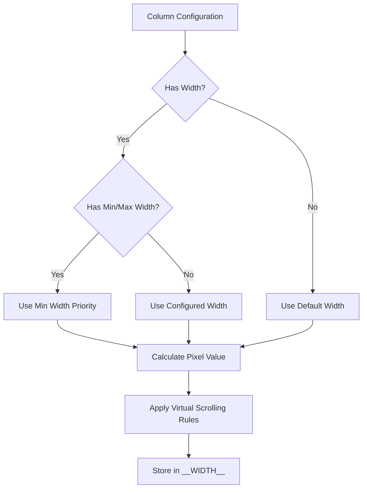
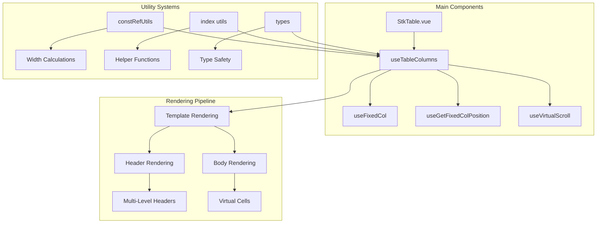

# Column Processing System

<cite>
**Referenced Files in This Document**
- [useTableColumns.ts](file://src/StkTable/useTableColumns.ts)
- [types/index.ts](file://src/StkTable/types/index.ts)
- [constRefUtils.ts](file://src/StkTable/utils/constRefUtils.ts)
- [index.ts](file://src/StkTable/utils/index.ts)
- [StkTable.vue](file://src/StkTable/StkTable.vue)
- [useFixedCol.ts](file://src/StkTable/useFixedCol.ts)
- [useGetFixedColPosition.ts](file://src/StkTable/useGetFixedColPosition.ts)
- [const.ts](file://src/StkTable/const.ts)
- [stk-table-column.md](file://docs-src/main/api/stk-table-column.md)
</cite>

## Table of Contents
1. [Introduction](#introduction)
2. [System Architecture](#system-architecture)
3. [Core Components](#core-components)
4. [Column Processing Pipeline](#column-processing-pipeline)
5. [Multi-Level Header Support](#multi-level-header-support)
6. [Fixed Column Processing](#fixed-column-processing)
7. [Column Width Management](#column-width-management)
8. [Performance Optimizations](#performance-optimizations)
9. [Integration Points](#integration-points)
10. [Troubleshooting Guide](#troubleshooting-guide)
11. [Conclusion](#conclusion)

## Introduction

The Column Processing System is a core component of the StkTable Vue library responsible for transforming raw column configurations into optimized data structures for rendering complex table layouts. This system handles multi-level headers, column flattening, fixed column positioning, and width calculations essential for modern virtualized table implementations.

The system operates as a reactive pipeline that processes column configurations passed to the StkTable component, generating optimized internal structures for efficient rendering and interaction. It supports advanced features like virtual scrolling, fixed columns, custom cell rendering, and dynamic column manipulation.

## System Architecture

The Column Processing System follows a modular architecture with clear separation of concerns:

**Diagram sources**
- [StkTable.vue](file://src/StkTable/StkTable.vue#L684-L687)
- [useTableColumns.ts](file://src/StkTable/useTableColumns.ts#L15-L137)

The architecture consists of several key layers:

1. **Entry Point**: StkTable.vue component that orchestrates the entire column processing workflow
2. **Processing Engine**: useTableColumns hook that performs the core column transformations
3. **Utility Layer**: Supporting functions for width calculations, helper utilities, and type definitions
4. **Integration Layer**: Fixed column management and positioning systems

## Core Components

### useTableColumns Hook

The primary processing engine responsible for transforming raw column configurations into optimized internal structures.

**Diagram sources**
- [useTableColumns.ts](file://src/StkTable/useTableColumns.ts#L15-L137)

The hook maintains two critical data structures:

1. **tableHeaders**: Contains processed column configurations organized by header level
2. **tableHeadersForCalc**: Auxiliary structure used for calculations and fixed column positioning

**Section sources**
- [useTableColumns.ts](file://src/StkTable/useTableColumns.ts#L15-L137)

### Column Type System

The system defines comprehensive type definitions for column configurations and processing metadata.

**Diagram sources**
- [types/index.ts](file://src/StkTable/types/index.ts#L54-L138)

**Section sources**
- [types/index.ts](file://src/StkTable/types/index.ts#L54-L138)

## Column Processing Pipeline

The column processing pipeline transforms raw column configurations through several stages:

**Diagram sources**
- [useTableColumns.ts](file://src/StkTable/useTableColumns.ts#L38-L130)

### Processing Stages

1. **Input Validation**: Validates column configurations and handles relative mode adjustments
2. **Depth Calculation**: Determines the maximum header depth using recursive traversal
3. **Multi-Level Header Validation**: Ensures compatibility with virtual scrolling
4. **Flattening Algorithm**: Performs depth-first search to process nested column structures
5. **Dimension Calculation**: Computes row spans, column spans, and accumulated widths
6. **Output Generation**: Creates optimized data structures for rendering

**Section sources**
- [useTableColumns.ts](file://src/StkTable/useTableColumns.ts#L38-L130)

## Multi-Level Header Support

The system provides comprehensive support for multi-level table headers through intelligent flattening and spanning calculations.

### Header Flattening Process

**Diagram sources**
- [useTableColumns.ts](file://src/StkTable/useTableColumns.ts#L80-L125)

### Span Calculation Logic

The system automatically calculates appropriate row and column spans for multi-level headers:

- **Row Span**: Determined by `maxDeep - depth + 1` for leaf nodes
- **Column Span**: Equals the count of child columns for parent nodes
- **Width Accumulation**: Parent widths calculated from child widths during recursion

**Section sources**
- [useTableColumns.ts](file://src/StkTable/useTableColumns.ts#L111-L119)

## Fixed Column Processing

The fixed column system integrates seamlessly with the column processing pipeline to handle complex positioning scenarios.

### Fixed Column Architecture

**Diagram sources**
- [useFixedCol.ts](file://src/StkTable/useFixedCol.ts#L19-L155)
- [useGetFixedColPosition.ts](file://src/StkTable/useGetFixedColPosition.ts#L15-L65)

### Position Calculation Algorithm

The position calculator determines fixed column positions using cumulative width calculations:

1. **Left Fixed Columns**: Sum widths from the left boundary to calculate cumulative positions
2. **Right Fixed Columns**: Calculate positions from the right boundary using reverse iteration
3. **Shadow Detection**: Monitors scroll position to determine when column shadows should be visible

**Section sources**
- [useGetFixedColPosition.ts](file://src/StkTable/useGetFixedColPosition.ts#L17-L62)
- [useFixedCol.ts](file://src/StkTable/useFixedCol.ts#L91-L145)

## Column Width Management

The width management system provides flexible column sizing with support for various units and virtual scrolling requirements.

### Width Calculation Strategy

**Diagram sources**
- [constRefUtils.ts](file://src/StkTable/utils/constRefUtils.ts#L9-L20)

### Virtual Scrolling Compatibility

The width system adapts to virtual scrolling requirements:

- **Non-Virtual Mode**: Uses configured widths directly
- **Virtual Mode**: Requires explicit width configuration for accurate calculations
- **Legacy Browser Support**: Falls back to default widths when units are unsupported

**Section sources**
- [constRefUtils.ts](file://src/StkTable/utils/constRefUtils.ts#L9-L20)
- [const.ts](file://src/StkTable/const.ts#L4-L30)

## Performance Optimizations

The column processing system implements several performance optimizations for large datasets and complex configurations.

### Reactive Optimization Strategies

1. **Shallow Ref Usage**: Minimizes reactive overhead for large column arrays
2. **Computed Properties**: Caches expensive calculations like fixed positions
3. **WeakMap Storage**: Efficient key-value storage for row and column identification
4. **Lazy Evaluation**: Defers computation until data is actually needed

### Memory Management

- **Reference Reuse**: Maintains references to original column objects to avoid unnecessary cloning
- **Efficient Arrays**: Uses primitive arrays for internal structures to minimize memory footprint
- **Cleanup Functions**: Provides cleanup mechanisms for event listeners and observers

**Section sources**
- [useTableColumns.ts](file://src/StkTable/useTableColumns.ts#L27-L32)
- [StkTable.vue](file://src/StkTable/StkTable.vue#L762-L763)

## Integration Points

The column processing system integrates with multiple subsystems to provide a cohesive table experience.

### Component Integration

**Diagram sources**
- [StkTable.vue](file://src/StkTable/StkTable.vue#L275-L281)

### Event System Integration

The column processing system participates in the table's event ecosystem:

- **Column Resize Events**: Triggers updates when column widths change
- **Sort Events**: Coordinates with sorting functionality
- **Scroll Events**: Updates fixed column positioning during scrolling
- **Selection Events**: Integrates with cell selection capabilities

**Section sources**
- [StkTable.vue](file://src/StkTable/StkTable.vue#L684-L789)

## Troubleshooting Guide

### Common Issues and Solutions

#### Multi-Level Header Problems
- **Issue**: Multi-level headers not displaying correctly with virtual scrolling
- **Solution**: Disable virtual X mode or restructure columns to single level
- **Prevention**: Check header depth before enabling virtual scrolling

#### Fixed Column Positioning Issues
- **Issue**: Fixed columns appear in wrong positions
- **Solution**: Ensure all columns have explicit width configurations
- **Debugging**: Verify column width calculations and position stores

#### Performance Degradation
- **Issue**: Slow rendering with large column sets
- **Solution**: Use shallow references and avoid deep column cloning
- **Optimization**: Consider column virtualization for very large datasets

#### Width Calculation Errors
- **Issue**: Incorrect column widths in fixed mode
- **Solution**: Verify width units and browser compatibility
- **Validation**: Test width calculations across different browsers

**Section sources**
- [useTableColumns.ts](file://src/StkTable/useTableColumns.ts#L65-L67)
- [constRefUtils.ts](file://src/StkTable/utils/constRefUtils.ts#L9-L15)

## Conclusion

The Column Processing System represents a sophisticated solution for handling complex table column configurations in modern web applications. Through its modular architecture, comprehensive type system, and performance optimizations, it provides a robust foundation for building feature-rich table components.

Key strengths of the system include:

- **Flexibility**: Supports complex multi-level headers and various column types
- **Performance**: Optimized for large datasets and virtual scrolling scenarios  
- **Integration**: Seamlessly integrates with all table features and utilities
- **Maintainability**: Clear separation of concerns and comprehensive type safety

The system continues to evolve with ongoing enhancements to support emerging table requirements while maintaining backward compatibility and performance standards.