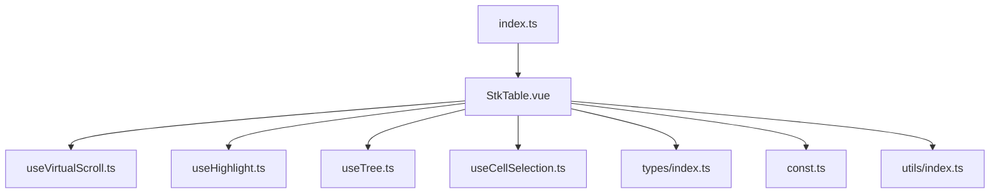
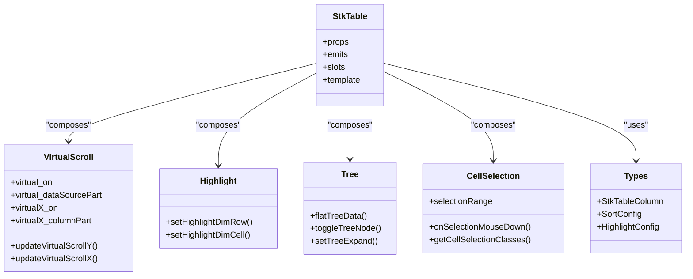
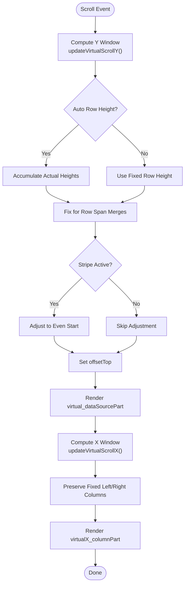
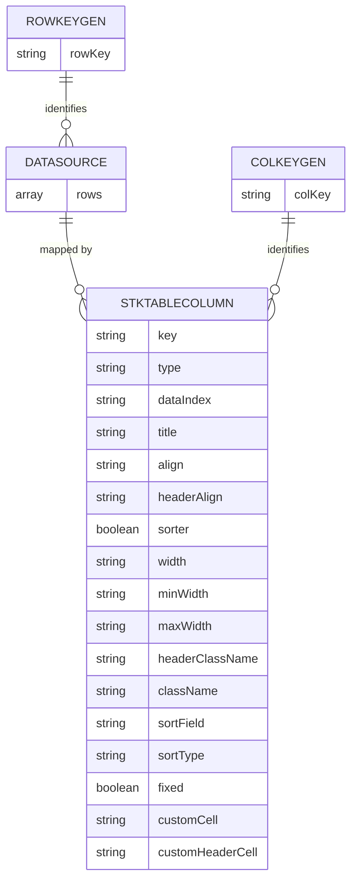
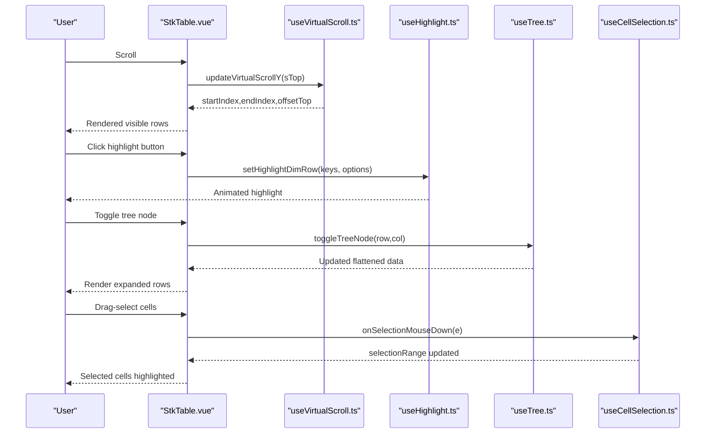
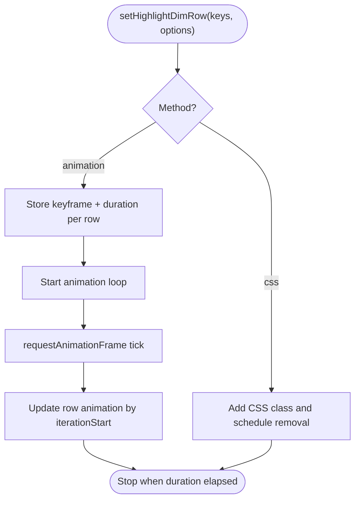
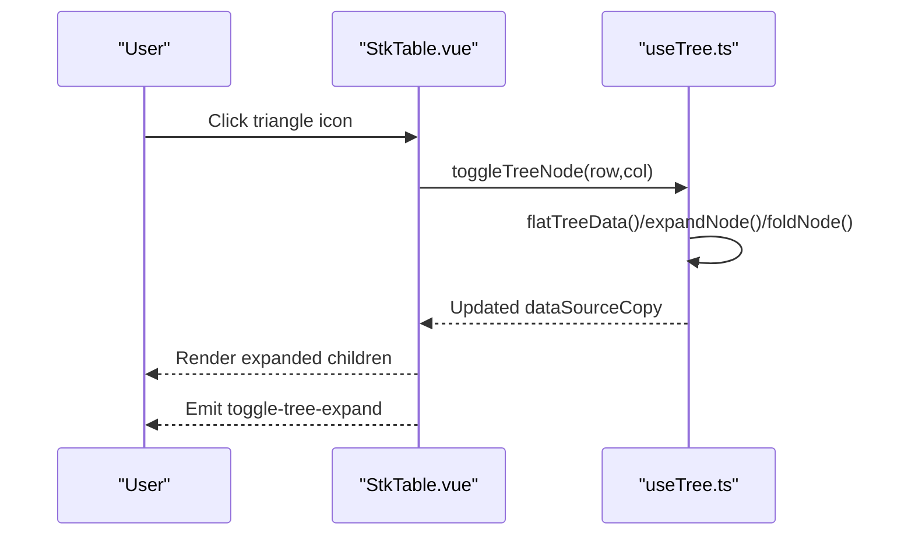
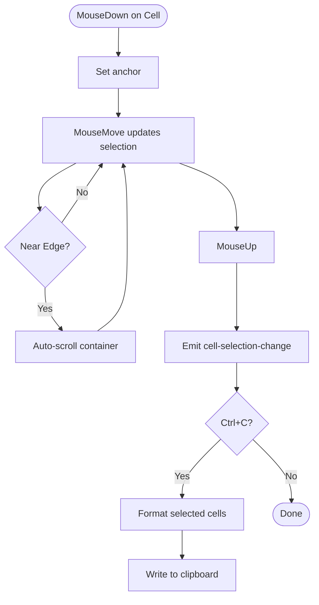
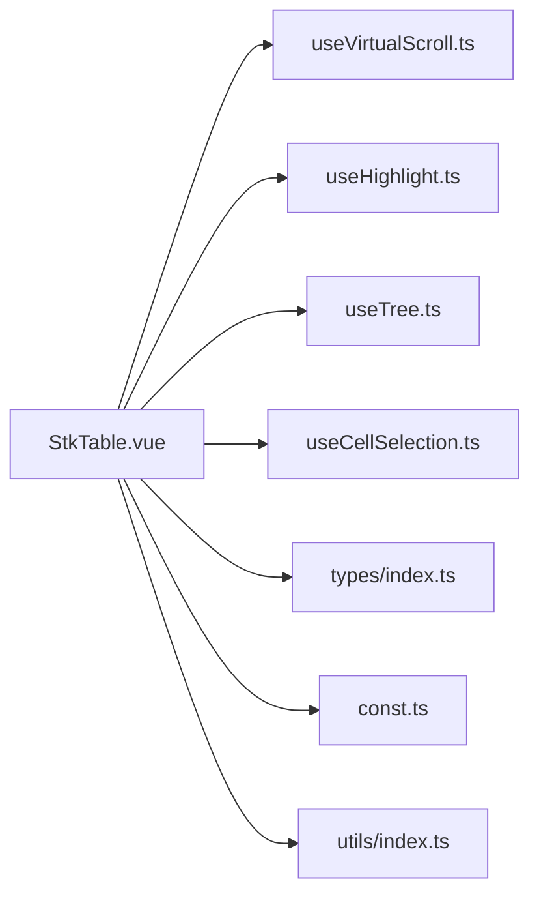

# Core Concepts

<cite>
**Referenced Files in This Document**
- [StkTable.vue](file://src/StkTable/StkTable.vue)
- [useVirtualScroll.ts](file://src/StkTable/useVirtualScroll.ts)
- [useHighlight.ts](file://src/StkTable/useHighlight.ts)
- [useTree.ts](file://src/StkTable/useTree.ts)
- [useCellSelection.ts](file://src/StkTable/useCellSelection.ts)
- [types/index.ts](file://src/StkTable/types/index.ts)
- [const.ts](file://src/StkTable/const.ts)
- [utils/index.ts](file://src/StkTable/utils/index.ts)
- [index.ts](file://src/StkTable/index.ts)
- [README.md](file://README.md)
- [VirtualY.vue](file://docs-demo/advanced/virtual/VirtualY.vue)
- [Highlight.vue](file://docs-demo/advanced/highlight/Highlight.vue)
- [Tree.vue](file://docs-demo/basic/tree/Tree.vue)
- [Checkbox.vue](file://docs-demo/basic/checkbox/Checkbox.vue)
</cite>

## Table of Contents
1. [Introduction](#introduction)
2. [Project Structure](#project-structure)
3. [Core Components](#core-components)
4. [Architecture Overview](#architecture-overview)
5. [Detailed Component Analysis](#detailed-component-analysis)
6. [Dependency Analysis](#dependency-analysis)
7. [Performance Considerations](#performance-considerations)
8. [Troubleshooting Guide](#troubleshooting-guide)
9. [Conclusion](#conclusion)

## Introduction
This document explains the core concepts of Stk Table Vue with a focus on:
- Virtual scrolling mechanics and when to enable it
- Column management system and data binding patterns
- Relationship between props, events, and slots
- Reactive architecture, state management, and feature integration
- Highlighting system, tree data structures, and selection mechanisms
- Practical examples and conceptual diagrams

## Project Structure
At the heart of Stk Table Vue is a single reactive component that orchestrates multiple feature hooks:
- StkTable.vue: The main component template and script setup
- useVirtualScroll.ts: Implements virtual scrolling for large datasets
- useHighlight.ts: Provides animated row/cell highlighting
- useTree.ts: Manages tree data expansion and flattening
- useCellSelection.ts: Enables keyboard/mouse-driven cell selection
- types/index.ts: Defines props, events, slots, and data structures
- const.ts: Constants for defaults and behavior
- utils/index.ts: Sorting and helper utilities

**Diagram sources**
- [StkTable.vue](file://src/StkTable/StkTable.vue#L209-L800)
- [useVirtualScroll.ts](file://src/StkTable/useVirtualScroll.ts#L60-L495)
- [useHighlight.ts](file://src/StkTable/useHighlight.ts#L27-L258)
- [useTree.ts](file://src/StkTable/useTree.ts#L12-L162)
- [useCellSelection.ts](file://src/StkTable/useCellSelection.ts#L40-L453)
- [types/index.ts](file://src/StkTable/types/index.ts#L54-L318)
- [const.ts](file://src/StkTable/const.ts#L1-L51)
- [utils/index.ts](file://src/StkTable/utils/index.ts#L153-L200)
- [index.ts](file://src/StkTable/index.ts#L1-L5)

**Section sources**
- [index.ts](file://src/StkTable/index.ts#L1-L5)
- [README.md](file://README.md#L15-L20)

## Core Components
- StkTable.vue: Declares props, emits, and template rendering. It composes features via hooks and reactive refs.
- useVirtualScroll: Computes visible windows for rows and columns, manages offsets and page sizes, and integrates auto row height and expandable rows.
- useHighlight: Exposes methods to animate row or cell highlights with configurable duration and FPS.
- useTree: Flattens tree data, toggles node expansion, and emits toggle events.
- useCellSelection: Tracks selection ranges, supports keyboard shortcuts, and auto-scrolls near edges during drag selection.
- Types and constants: Define column shapes, sort behavior, highlight options, and defaults.

**Section sources**
- [StkTable.vue](file://src/StkTable/StkTable.vue#L278-L476)
- [useVirtualScroll.ts](file://src/StkTable/useVirtualScroll.ts#L60-L495)
- [useHighlight.ts](file://src/StkTable/useHighlight.ts#L27-L258)
- [useTree.ts](file://src/StkTable/useTree.ts#L12-L162)
- [useCellSelection.ts](file://src/StkTable/useCellSelection.ts#L40-L453)
- [types/index.ts](file://src/StkTable/types/index.ts#L54-L318)
- [const.ts](file://src/StkTable/const.ts#L1-L51)

## Architecture Overview
Stk Table Vue follows a modular composition pattern:
- Props drive behavior (virtual, autoRowHeight, highlightConfig, treeConfig, etc.)
- Emits surface user actions (sort-change, row-click, cell-selected, toggle-tree-expand, etc.)
- Slots allow custom header/body content
- Hooks encapsulate cross-cutting concerns (virtual scroll, highlight, tree, selection)
- Reactive computations keep visible subsets minimal and efficient

**Diagram sources**
- [StkTable.vue](file://src/StkTable/StkTable.vue#L763-L800)
- [useVirtualScroll.ts](file://src/StkTable/useVirtualScroll.ts#L476-L494)
- [useHighlight.ts](file://src/StkTable/useHighlight.ts#L252-L256)
- [useTree.ts](file://src/StkTable/useTree.ts#L156-L160)
- [useCellSelection.ts](file://src/StkTable/useCellSelection.ts#L442-L451)
- [types/index.ts](file://src/StkTable/types/index.ts#L54-L120)

## Detailed Component Analysis

### Virtual Scrolling Mechanics
Virtual scrolling renders only the visible subset of rows and columns, dramatically reducing DOM nodes and layout costs for large datasets.

Key behaviors:
- Visible window calculation: Determines startIndex/endIndex for rows and columns based on scroll position and container size.
- Auto row height: Accumulates actual heights for variable row heights and expands/collapses accordingly.
- Expandable rows: Adjusts offsets and visibility when expanded rows increase row height.
- X-axis virtualization: Maintains fixed columns outside the viewport and computes offsetLeft for seamless horizontal scrolling.
- Vue 2 scroll optimization: Uses timeouts to batch updates and avoid excessive re-renders.

**Diagram sources**
- [useVirtualScroll.ts](file://src/StkTable/useVirtualScroll.ts#L273-L403)
- [useVirtualScroll.ts](file://src/StkTable/useVirtualScroll.ts#L410-L474)

Practical example:
- Enabling virtual scrolling with a large dataset demonstrates smooth scrolling and minimal DOM footprint.

**Section sources**
- [useVirtualScroll.ts](file://src/StkTable/useVirtualScroll.ts#L100-L132)
- [useVirtualScroll.ts](file://src/StkTable/useVirtualScroll.ts#L273-L374)
- [useVirtualScroll.ts](file://src/StkTable/useVirtualScroll.ts#L410-L474)
- [VirtualY.vue](file://docs-demo/advanced/virtual/VirtualY.vue#L31-L34)

### Column Management System and Data Binding
Columns define rendering, sorting, and behavior. Data binding occurs via rowKey and colKey generators, enabling stable identity for selection, highlighting, and virtualization.

Highlights:
- Column shape: Supports type-specific columns (seq, expand, dragRow, tree-node), widths, alignment, fixed positions, custom renderers, and merge rules.
- Key generation: rowKeyGen and colKeyGen compute stable keys for rows and columns.
- Empty cell handling: emptyCellText supports static or function-based placeholders.
- Multi-level headers: tableHeaders and tableHeadersForCalc manage complex header layouts and row spans.

**Diagram sources**
- [types/index.ts](file://src/StkTable/types/index.ts#L54-L120)
- [StkTable.vue](file://src/StkTable/StkTable.vue#L719-L737)

**Section sources**
- [types/index.ts](file://src/StkTable/types/index.ts#L54-L120)
- [StkTable.vue](file://src/StkTable/StkTable.vue#L719-L746)

### Props, Events, and Slots
Props control behavior and appearance. Emits surface user interactions. Slots allow customization of headers and empty states.

- Props: virtual, virtualX, rowHeight, autoRowHeight, highlightConfig, treeConfig, cellSelection, colResizable, bordered, fixedMode, theme, etc.
- Emits: sort-change, row-click, current-change, cell-selected, row-dblclick, header-row-menu, row-menu, cell-click, cell-mouseenter, cell-mouseleave, cell-mouseover, cell-mousedown, header-cell-click, scroll, scroll-x, col-order-change, th-drag-start, th-drop, row-order-change, col-resize, toggle-row-expand, toggle-tree-expand, cell-selection-change, update:columns.
- Slots: tableHeader, empty, customBottom, and named slots for expand and drag icons.

**Diagram sources**
- [StkTable.vue](file://src/StkTable/StkTable.vue#L478-L621)
- [useVirtualScroll.ts](file://src/StkTable/useVirtualScroll.ts#L273-L403)
- [useHighlight.ts](file://src/StkTable/useHighlight.ts#L133-L166)
- [useTree.ts](file://src/StkTable/useTree.ts#L17-L70)
- [useCellSelection.ts](file://src/StkTable/useCellSelection.ts#L132-L168)

**Section sources**
- [StkTable.vue](file://src/StkTable/StkTable.vue#L278-L476)
- [StkTable.vue](file://src/StkTable/StkTable.vue#L478-L621)

### Highlighting System
Highlights animate row or cell backgrounds with configurable duration and FPS. It supports animation API and CSS keyframes, with special handling for virtualized rows.

Key points:
- Configurable duration and FPS translate to steps-based easing for crisp animations.
- Animation loop tracks visibility and updates frames efficiently.
- Methods: setHighlightDimRow and setHighlightDimCell.

**Diagram sources**
- [useHighlight.ts](file://src/StkTable/useHighlight.ts#L133-L166)
- [useHighlight.ts](file://src/StkTable/useHighlight.ts#L70-L98)

**Section sources**
- [useHighlight.ts](file://src/StkTable/useHighlight.ts#L27-L65)
- [useHighlight.ts](file://src/StkTable/useHighlight.ts#L109-L123)
- [useHighlight.ts](file://src/StkTable/useHighlight.ts#L133-L166)
- [Highlight.vue](file://docs-demo/advanced/highlight/Highlight.vue#L17-L32)

### Tree Data Structures and Expansion
Tree support enables hierarchical data with expand/collapse controls. The component flattens data according to expansion state and emits toggle events.

Highlights:
- Flat tree traversal builds a linear dataset preserving hierarchy.
- Default expansion options: expand all, by keys, or by level.
- Toggle updates internal state and emits toggle-tree-expand.

**Diagram sources**
- [useTree.ts](file://src/StkTable/useTree.ts#L17-L70)
- [useTree.ts](file://src/StkTable/useTree.ts#L121-L125)
- [Tree.vue](file://docs-demo/basic/tree/Tree.vue#L5-L7)

**Section sources**
- [useTree.ts](file://src/StkTable/useTree.ts#L12-L162)
- [Tree.vue](file://docs-demo/basic/tree/Tree.vue#L1-L17)

### Selection Mechanisms
Cell selection supports mouse drag, keyboard shortcuts (Shift for range, Escape to clear), and clipboard copy. It tracks selection ranges and computes selected cells.

Highlights:
- Anchor-based selection with Shift extension.
- Edge auto-scroll during drag selection.
- Clipboard copy with optional custom formatter.

**Diagram sources**
- [useCellSelection.ts](file://src/StkTable/useCellSelection.ts#L132-L168)
- [useCellSelection.ts](file://src/StkTable/useCellSelection.ts#L210-L272)
- [useCellSelection.ts](file://src/StkTable/useCellSelection.ts#L347-L396)

**Section sources**
- [useCellSelection.ts](file://src/StkTable/useCellSelection.ts#L40-L453)
- [Checkbox.vue](file://docs-demo/basic/checkbox/Checkbox.vue#L1-L126)

### Sorting Utilities
Sorting utilities support remote/local sorting, default sort triggers, and optional recursive sorting of children.

Highlights:
- tableSort handles asc/desc ordering, empty-to-bottom, localeCompare, and custom comparators.
- insertToOrderedArray inserts items into sorted arrays efficiently.

**Section sources**
- [utils/index.ts](file://src/StkTable/utils/index.ts#L153-L200)
- [utils/index.ts](file://src/StkTable/utils/index.ts#L25-L66)

## Dependency Analysis
The component’s strength lies in its modular hooks and shared types. Dependencies are primarily internal, with clear boundaries:
- StkTable.vue depends on useVirtualScroll, useHighlight, useTree, useCellSelection, types, const, and utils.
- Props and emits define external contracts with consumers.
- Slots provide extension points without tight coupling.

**Diagram sources**
- [StkTable.vue](file://src/StkTable/StkTable.vue#L263-L267)
- [index.ts](file://src/StkTable/index.ts#L1-L5)

**Section sources**
- [StkTable.vue](file://src/StkTable/StkTable.vue#L263-L267)
- [index.ts](file://src/StkTable/index.ts#L1-L5)

## Performance Considerations
- Enable virtual when data length exceeds a few hundred rows; it reduces DOM nodes and improves scroll performance.
- Prefer fixed widths for virtualX to avoid layout thrashing; the hook computes column visibility based on total width vs container width.
- Use autoRowHeight judiciously; actual heights are measured and cached to minimize reflows.
- Disable unnecessary features (e.g., fixedColShadow) in performance-critical scenarios.
- For Vue 2, consider optimizeVue2Scroll to tune scroll behavior.

[No sources needed since this section provides general guidance]

## Troubleshooting Guide
Common issues and remedies:
- Virtual scroll not activating: Ensure data length exceeds computed page size and virtual prop is true.
- X virtualization not working: Verify column widths are set; the hook compares total width against container width.
- Highlight not visible in virtual mode: The animation loop targets visible rows; ensure row keys match and elements exist.
- Tree toggle not reflected: Confirm tree-node column type and that data has children; verify toggle-tree-expand handler updates state.
- Selection not copying: Ensure cellSelection is enabled and formatCellForClipboard is provided if custom cells alter display text.

**Section sources**
- [useVirtualScroll.ts](file://src/StkTable/useVirtualScroll.ts#L100-L132)
- [useVirtualScroll.ts](file://src/StkTable/useVirtualScroll.ts#L231-L236)
- [useHighlight.ts](file://src/StkTable/useHighlight.ts#L144-L161)
- [useTree.ts](file://src/StkTable/useTree.ts#L64-L66)
- [useCellSelection.ts](file://src/StkTable/useCellSelection.ts#L335-L341)

## Conclusion
Stk Table Vue’s core strengths are modularity and performance:
- Virtual scrolling keeps rendering efficient for large datasets
- A cohesive props/events/slots contract enables flexible customization
- Feature hooks encapsulate complexity while remaining composable
- Built-in utilities for sorting, highlighting, tree navigation, and selection provide a complete solution for interactive tables

[No sources needed since this section summarizes without analyzing specific files]