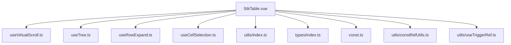
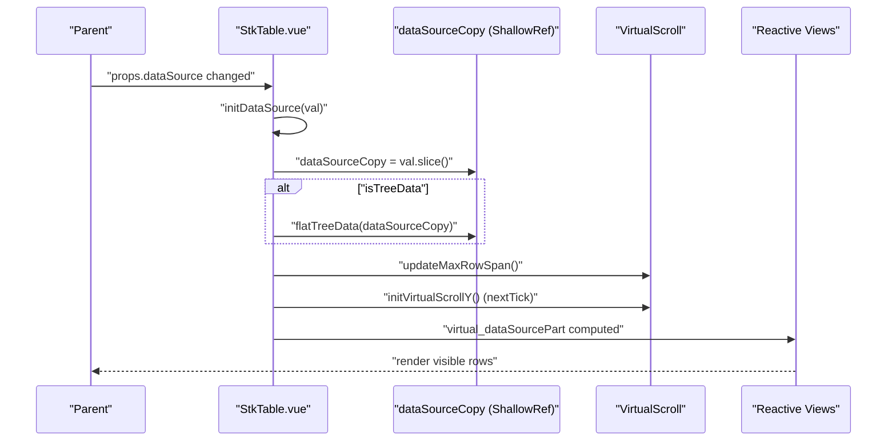
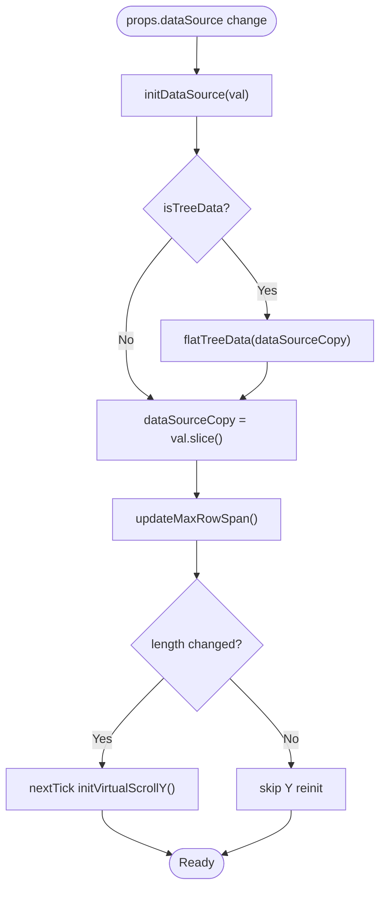
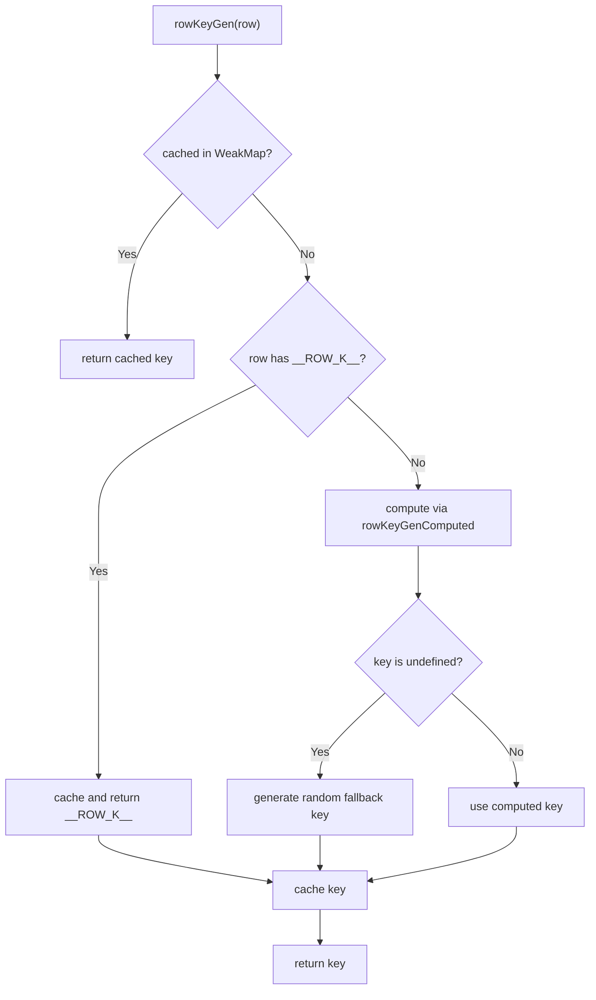
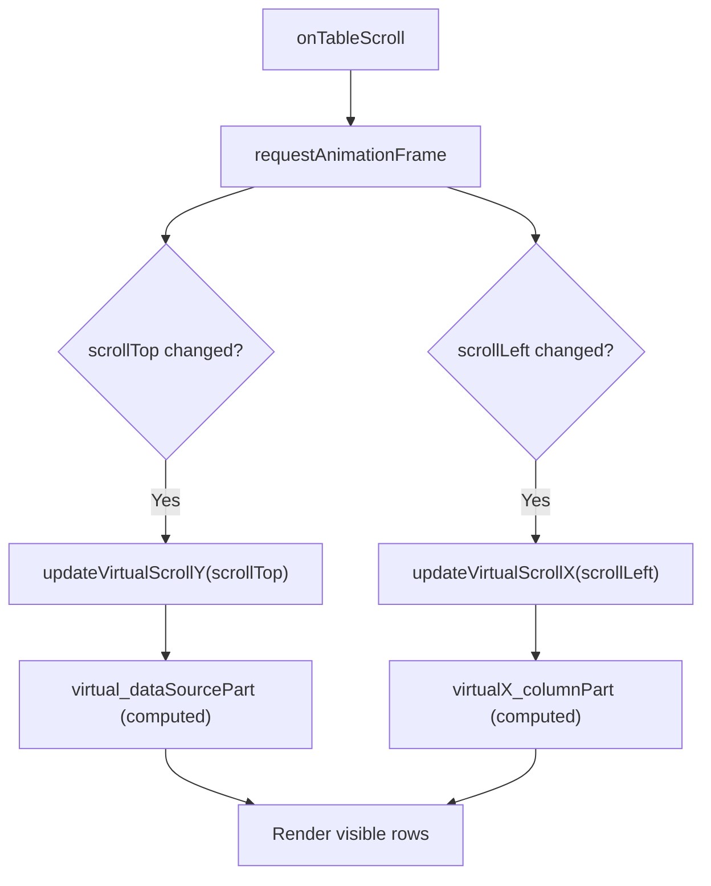
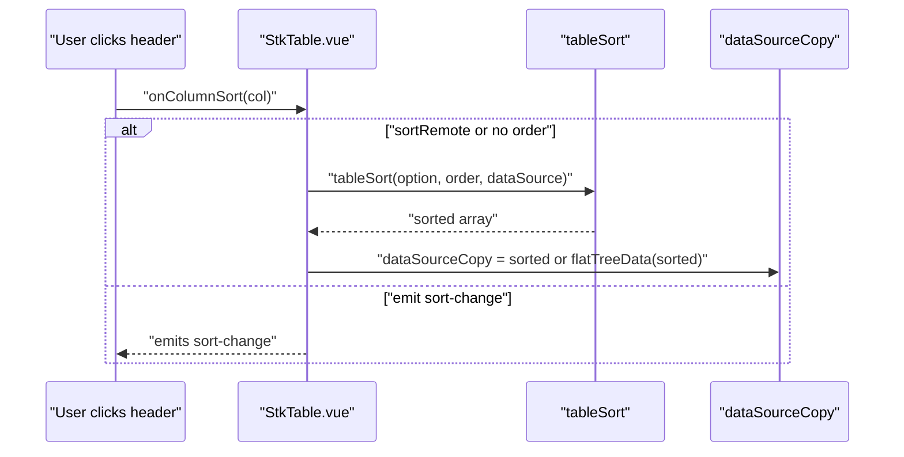
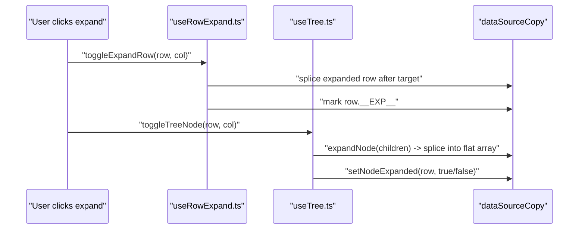
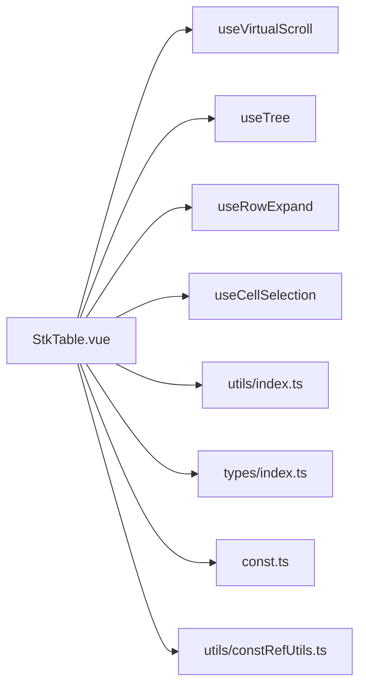

# Data Binding and Reactive Architecture

<cite>
**Referenced Files in This Document**
- [StkTable.vue](file://src/StkTable/StkTable.vue)
- [types/index.ts](file://src/StkTable/types/index.ts)
- [useVirtualScroll.ts](file://src/StkTable/useVirtualScroll.ts)
- [utils/index.ts](file://src/StkTable/utils/index.ts)
- [const.ts](file://src/StkTable/const.ts)
- [utils/constRefUtils.ts](file://src/StkTable/utils/constRefUtils.ts)
- [useTree.ts](file://src/StkTable/useTree.ts)
- [useRowExpand.ts](file://src/StkTable/useRowExpand.ts)
- [useCellSelection.ts](file://src/StkTable/useCellSelection.ts)
- [utils/useTriggerRef.ts](file://src/StkTable/utils/useTriggerRef.ts)
- [mockData.ts](file://docs-demo/demos/HugeData/mockData.ts)
- [key.md](file://docs-src/main/table/basic/key.md)
</cite>

## Table of Contents
1. [Introduction](#introduction)
2. [Project Structure](#project-structure)
3. [Core Components](#core-components)
4. [Architecture Overview](#architecture-overview)
5. [Detailed Component Analysis](#detailed-component-analysis)
6. [Dependency Analysis](#dependency-analysis)
7. [Performance Considerations](#performance-considerations)
8. [Troubleshooting Guide](#troubleshooting-guide)
9. [Conclusion](#conclusion)

## Introduction
This document explains Stk Table Vue’s data binding patterns and reactive architecture with a focus on:
- The dataSource prop structure and how it is transformed into internal state
- Row key generation strategies and caching
- Data transformation processes for virtual scrolling and tree/expand features
- How reactivity propagates across props, internal state, and computed properties
- Immutability patterns, shallow reactive references, and performance trade-offs
- Virtual scrolling calculations, data copying strategies, and reference management
- Practical examples of different data binding approaches and best practices for large datasets

## Project Structure
At the heart of the component is a single-file Vue 3 component that orchestrates multiple composable modules:
- StkTable.vue: central orchestration, props, watchers, computed, and template bindings
- useVirtualScroll.ts: virtualization engine for Y/X axes, slicing, offsets, and auto-height
- useTree.ts and useRowExpand.ts: data flattening and expansion toggling
- useCellSelection.ts: selection state and keyboard/mouse handlers
- utils/index.ts: sorting helpers and shared utilities
- types/index.ts: TypeScript interfaces and type guards
- const.ts and utils/constRefUtils.ts: constants and column width helpers
- utils/useTriggerRef.ts: a small helper to trigger shallowRef updates

**Diagram sources**
- [StkTable.vue](file://src/StkTable/StkTable.vue#L209-L922)
- [useVirtualScroll.ts](file://src/StkTable/useVirtualScroll.ts#L60-L498)
- [useTree.ts](file://src/StkTable/useTree.ts#L12-L161)
- [useRowExpand.ts](file://src/StkTable/useRowExpand.ts#L11-L88)
- [useCellSelection.ts](file://src/StkTable/useCellSelection.ts#L42-L456)
- [utils/index.ts](file://src/StkTable/utils/index.ts#L154-L208)
- [types/index.ts](file://src/StkTable/types/index.ts#L54-L120)
- [const.ts](file://src/StkTable/const.ts#L1-L51)
- [utils/constRefUtils.ts](file://src/StkTable/utils/constRefUtils.ts#L1-L30)
- [utils/useTriggerRef.ts](file://src/StkTable/utils/useTriggerRef.ts#L15-L33)

**Section sources**
- [StkTable.vue](file://src/StkTable/StkTable.vue#L209-L922)
- [useVirtualScroll.ts](file://src/StkTable/useVirtualScroll.ts#L60-L498)
- [useTree.ts](file://src/StkTable/useTree.ts#L12-L161)
- [useRowExpand.ts](file://src/StkTable/useRowExpand.ts#L11-L88)
- [useCellSelection.ts](file://src/StkTable/useCellSelection.ts#L42-L456)
- [utils/index.ts](file://src/StkTable/utils/index.ts#L154-L208)
- [types/index.ts](file://src/StkTable/types/index.ts#L54-L120)
- [const.ts](file://src/StkTable/const.ts#L1-L51)
- [utils/constRefUtils.ts](file://src/StkTable/utils/constRefUtils.ts#L1-L30)
- [utils/useTriggerRef.ts](file://src/StkTable/utils/useTriggerRef.ts#L15-L33)

## Core Components
- DataSource lifecycle: props.dataSource is shallow-copied into a shallowRef dataSourceCopy during initialization and whenever props.dataSource changes. Tree data is flattened before virtualization.
- Virtual scrolling: computed slices of visible rows and columns are derived from scroll positions and container sizes. Offsets and totals are recomputed reactively.
- Key generators: rowKeyGen caches computed keys in a WeakMap; colKeyGen is a computed factory based on props.colKey; cellKeyGen combines row and col keys.
- Sorting: tableSort produces a new array via slicing and sorting; in remote mode, the component emits events and expects external updates.
- Selection and interactions: cell selection range is tracked via refs and computed sets; row and cell selection state is updated reactively.

**Section sources**
- [StkTable.vue](file://src/StkTable/StkTable.vue#L896-L931)
- [StkTable.vue](file://src/StkTable/StkTable.vue#L1035-L1059)
- [StkTable.vue](file://src/StkTable/StkTable.vue#L1062-L1088)
- [useVirtualScroll.ts](file://src/StkTable/useVirtualScroll.ts#L104-L125)
- [useVirtualScroll.ts](file://src/StkTable/useVirtualScroll.ts#L134-L176)
- [utils/index.ts](file://src/StkTable/utils/index.ts#L154-L208)

## Architecture Overview
The component’s reactive pipeline connects props to internal state and computed views:

**Diagram sources**
- [StkTable.vue](file://src/StkTable/StkTable.vue#L896-L931)
- [StkTable.vue](file://src/StkTable/StkTable.vue#L1035-L1059)
- [useVirtualScroll.ts](file://src/StkTable/useVirtualScroll.ts#L205-L229)

## Detailed Component Analysis

### Data Source Prop and Transformation
- Initialization: props.dataSource is shallow-copied to dataSourceCopy. If tree columns exist, data is flattened to a linear structure for virtualization.
- Updates: watcher on props.dataSource triggers initDataSource and recomputes virtualization and row spans. If length changes, Y virtualization is reinitialized after rendering.
- Remote sorting: when sortRemote is true, sorting is skipped internally; the component emits sort-change and expects the parent to update dataSource.

**Diagram sources**
- [StkTable.vue](file://src/StkTable/StkTable.vue#L896-L931)
- [StkTable.vue](file://src/StkTable/StkTable.vue#L1035-L1059)
- [useTree.ts](file://src/StkTable/useTree.ts#L121-L125)

**Section sources**
- [StkTable.vue](file://src/StkTable/StkTable.vue#L896-L931)
- [StkTable.vue](file://src/StkTable/StkTable.vue#L1035-L1059)
- [useTree.ts](file://src/StkTable/useTree.ts#L121-L125)

### Row Key Generation and Caching
- rowKeyGenComputed is a computed that resolves either a function or property accessor from props.rowKey.
- rowKeyGen caches keys in a WeakMap keyed by row object to avoid recomputation and to keep keys stable across renders.
- Fallback: if the resolved key is undefined, a random key is generated to ensure uniqueness for UI state (e.g., highlighting).

**Diagram sources**
- [StkTable.vue](file://src/StkTable/StkTable.vue#L1062-L1083)

**Section sources**
- [StkTable.vue](file://src/StkTable/StkTable.vue#L1062-L1083)

### Column Key Generation and Cell Keys
- colKeyGen is a computed function derived from props.colKey. It defaults to col.key || col.dataIndex.
- cellKeyGen combines rowKeyGen(row) and colKeyGen(col) with a separator constant to form a stable cell identity.

**Section sources**
- [StkTable.vue](file://src/StkTable/StkTable.vue#L728-L737)
- [StkTable.vue](file://src/StkTable/StkTable.vue#L1086-L1088)
- [const.ts](file://src/StkTable/const.ts#L37-L38)

### Virtual Scrolling Calculations
- Y-axis virtualization:
  - Computes pageSize from container height and row height; adjusts for header height.
  - updateVirtualScrollY calculates startIndex/endIndex from scrollTop, supports autoRowHeight and merged rows.
  - virtual_dataSourcePart is a computed slice of dataSourceCopy for rendering.
- X-axis virtualization:
  - Uses tableHeaderLast to compute visible columns; preserves fixed left/right columns outside the viewport.
  - updateVirtualScrollX computes startIndex/endIndex from scrollLeft and column widths.

**Diagram sources**
- [StkTable.vue](file://src/StkTable/StkTable.vue#L1463-L1497)
- [useVirtualScroll.ts](file://src/StkTable/useVirtualScroll.ts#L274-L407)
- [useVirtualScroll.ts](file://src/StkTable/useVirtualScroll.ts#L414-L478)

**Section sources**
- [useVirtualScroll.ts](file://src/StkTable/useVirtualScroll.ts#L104-L125)
- [useVirtualScroll.ts](file://src/StkTable/useVirtualScroll.ts#L134-L176)
- [useVirtualScroll.ts](file://src/StkTable/useVirtualScroll.ts#L274-L407)
- [useVirtualScroll.ts](file://src/StkTable/useVirtualScroll.ts#L414-L478)

### Sorting and Data Immutability
- tableSort creates a new array by slicing and sorting; respects emptyToBottom, stringLocaleCompare, and sortChildren.
- In remote mode, the component emits sort-change with the proposed order and data snapshot; the parent updates props.dataSource accordingly.
- Tree data is flattened prior to sorting to maintain a flat list for virtualization.

**Diagram sources**
- [StkTable.vue](file://src/StkTable/StkTable.vue#L1239-L1299)
- [utils/index.ts](file://src/StkTable/utils/index.ts#L154-L208)
- [useTree.ts](file://src/StkTable/useTree.ts#L121-L125)

**Section sources**
- [utils/index.ts](file://src/StkTable/utils/index.ts#L154-L208)
- [StkTable.vue](file://src/StkTable/StkTable.vue#L1239-L1299)
- [useTree.ts](file://src/StkTable/useTree.ts#L121-L125)

### Tree Expansion and Row Expansion
- Tree expansion:
  - flatTreeData recursively flattens expanded nodes; default expand options are applied on first load.
  - toggleTreeNode/privateSetTreeExpand modify the flat array and update row flags.
- Row expansion:
  - setRowExpand inserts a synthetic expanded row with a prefixed key and clears previous expansions below the target.

**Diagram sources**
- [useRowExpand.ts](file://src/StkTable/useRowExpand.ts#L18-L82)
- [useTree.ts](file://src/StkTable/useTree.ts#L17-L74)
- [useTree.ts](file://src/StkTable/useTree.ts#L127-L154)

**Section sources**
- [useRowExpand.ts](file://src/StkTable/useRowExpand.ts#L18-L82)
- [useTree.ts](file://src/StkTable/useTree.ts#L17-L74)
- [useTree.ts](file://src/StkTable/useTree.ts#L127-L154)

### Cell Selection and Interaction State
- selectionRange tracks the current rectangular selection; normalizedRange and selectedCellKeys are computed from it.
- getCellSelectionClasses applies range-related classes to cells for visual feedback.
- Keyboard shortcuts (Ctrl/Cmd+C) copy the selected range to clipboard using a formatter callback if provided.

**Section sources**
- [useCellSelection.ts](file://src/StkTable/useCellSelection.ts#L52-L102)
- [useCellSelection.ts](file://src/StkTable/useCellSelection.ts#L409-L422)
- [useCellSelection.ts](file://src/StkTable/useCellSelection.ts#L357-L401)

### Shallow Reactivity and Performance
- dataSourceCopy is a shallowRef to minimize deep reactivity overhead while still enabling reactive updates.
- rowKeyGen uses a WeakMap cache keyed by row object to avoid unnecessary recomputation and to keep keys stable across renders.
- Virtual scrolling relies on computed slices and offsets; autoRowHeight stores measured heights in a Map keyed by rowKey to avoid repeated DOM reads.
- useTriggerRef demonstrates a pattern to trigger shallowRef updates when underlying value changes without mutating the ref directly.

**Section sources**
- [StkTable.vue](file://src/StkTable/StkTable.vue#L717-L717)
- [StkTable.vue](file://src/StkTable/StkTable.vue#L1062-L1083)
- [useVirtualScroll.ts](file://src/StkTable/useVirtualScroll.ts#L241-L254)
- [utils/useTriggerRef.ts](file://src/StkTable/utils/useTriggerRef.ts#L15-L33)

## Dependency Analysis
The component’s dependencies are primarily composables and utilities:

**Diagram sources**
- [StkTable.vue](file://src/StkTable/StkTable.vue#L209-L922)
- [useVirtualScroll.ts](file://src/StkTable/useVirtualScroll.ts#L60-L498)
- [useTree.ts](file://src/StkTable/useTree.ts#L12-L161)
- [useRowExpand.ts](file://src/StkTable/useRowExpand.ts#L11-L88)
- [useCellSelection.ts](file://src/StkTable/useCellSelection.ts#L42-L456)
- [utils/index.ts](file://src/StkTable/utils/index.ts#L154-L208)
- [types/index.ts](file://src/StkTable/types/index.ts#L54-L120)
- [const.ts](file://src/StkTable/const.ts#L1-L51)
- [utils/constRefUtils.ts](file://src/StkTable/utils/constRefUtils.ts#L1-L30)

**Section sources**
- [StkTable.vue](file://src/StkTable/StkTable.vue#L209-L922)
- [useVirtualScroll.ts](file://src/StkTable/useVirtualScroll.ts#L60-L498)
- [useTree.ts](file://src/StkTable/useTree.ts#L12-L161)
- [useRowExpand.ts](file://src/StkTable/useRowExpand.ts#L11-L88)
- [useCellSelection.ts](file://src/StkTable/useCellSelection.ts#L42-L456)
- [utils/index.ts](file://src/StkTable/utils/index.ts#L154-L208)
- [types/index.ts](file://src/StkTable/types/index.ts#L54-L120)
- [const.ts](file://src/StkTable/const.ts#L1-L51)
- [utils/constRefUtils.ts](file://src/StkTable/utils/constRefUtils.ts#L1-L30)

## Performance Considerations
- Prefer shallowRef for large arrays to reduce deep reactivity costs.
- Cache row keys with WeakMap to avoid recomputation and to stabilize keys for UI state.
- Use virtual scrolling for large datasets; ensure column widths are set for X virtualization.
- For variable row heights, leverage autoRowHeight and measure DOM heights once per row key; avoid frequent reflows.
- Keep props immutable on the parent; pass new arrays to props.dataSource to trigger efficient updates.
- Use sortRemote for server-side sorting to avoid heavy client-side computations.

[No sources needed since this section provides general guidance]

## Troubleshooting Guide
- Empty or missing data: Ensure props.dataSource is an array; the component warns on invalid input and skips updates.
- Virtual scrolling not working: Verify props.virtual/virtualX and that column widths are set for X virtualization.
- Row keys not stable: Provide a deterministic rowKey function or ensure row objects have a stable identity; undefined keys fall back to random keys.
- Sorting not applied: If sortRemote is true, listen to sort-change and update props.dataSource accordingly.
- Tree expansion issues: Confirm treeConfig defaults and that data is properly flattened before virtualization.

**Section sources**
- [StkTable.vue](file://src/StkTable/StkTable.vue#L1035-L1039)
- [StkTable.vue](file://src/StkTable/StkTable.vue#L1239-L1299)
- [StkTable.vue](file://src/StkTable/StkTable.vue#L1062-L1083)
- [useTree.ts](file://src/StkTable/useTree.ts#L121-L125)

## Conclusion
Stk Table Vue’s reactive architecture centers on shallow reactive references for large datasets, computed-derived virtualized slices, and carefully managed key generation. The component transforms props.dataSource into a mutable shallowRef copy, applies transformations (flattening, sorting, expansion), and exposes computed views for rendering. By combining virtual scrolling, caching, and immutable transformations, it achieves responsive performance for large datasets while maintaining predictable data flow and clear separation of concerns.