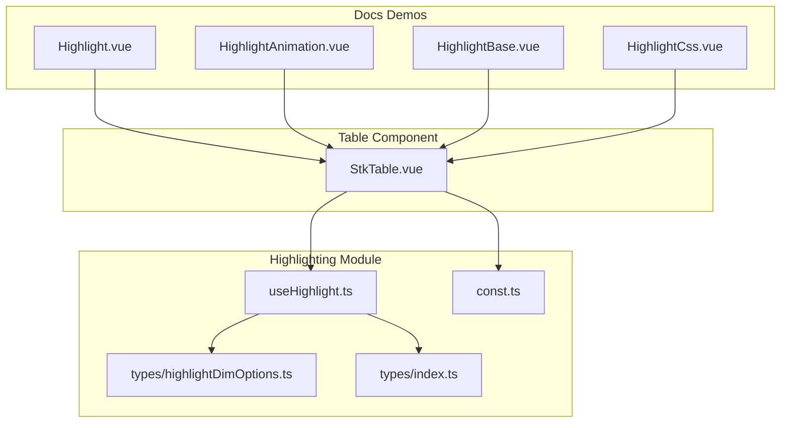
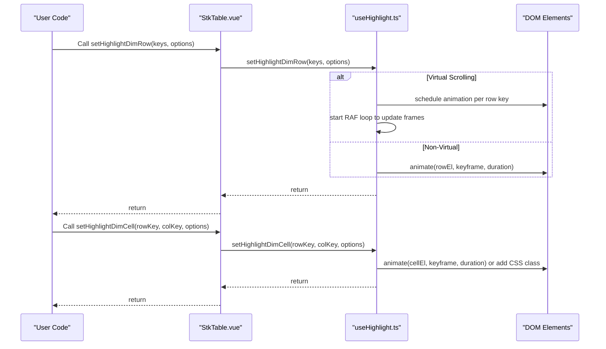
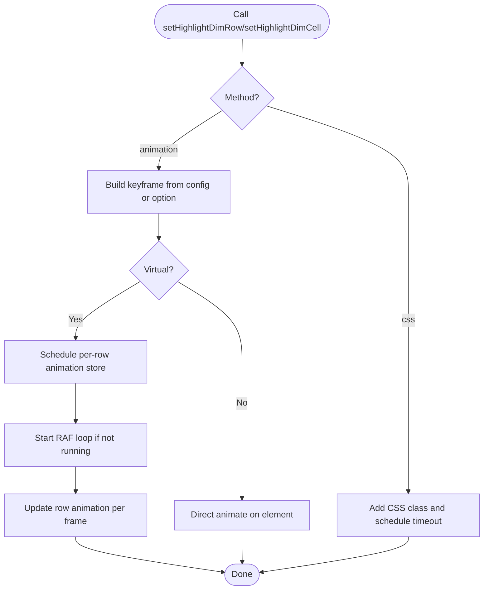
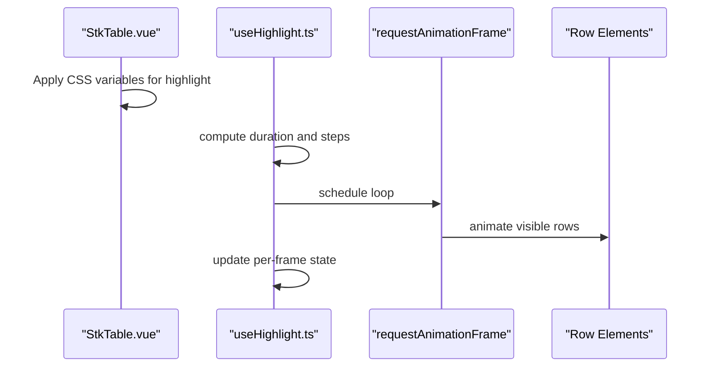
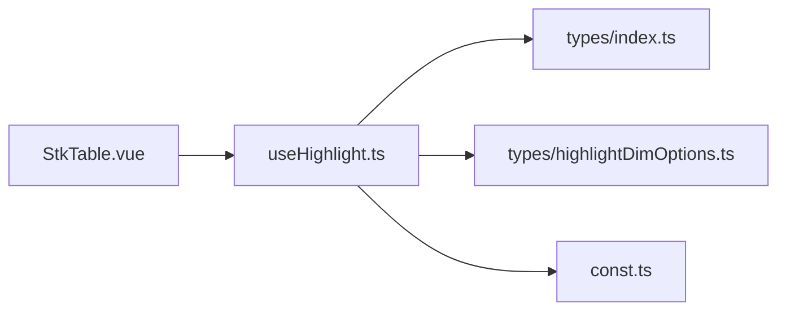

# Highlighting and Selection System

<cite>
**Referenced Files in This Document**
- [useHighlight.ts](file://src/StkTable/useHighlight.ts)
- [highlightDimOptions.ts](file://src/StkTable/types/highlightDimOptions.ts)
- [index.ts](file://src/StkTable/types/index.ts)
- [const.ts](file://src/StkTable/const.ts)
- [StkTable.vue](file://src/StkTable/StkTable.vue)
- [highlight.md](file://docs-src/main/table/advanced/highlight.md)
- [Highlight.vue](file://docs-demo/advanced/highlight/Highlight.vue)
- [HighlightAnimation.vue](file://docs-demo/advanced/highlight/HighlightAnimation.vue)
- [HighlightBase.vue](file://docs-demo/advanced/highlight/HighlightBase.vue)
- [HighlightCss.vue](file://docs-demo/advanced/highlight/HighlightCss.vue)
- [const.ts (demo)](file://docs-demo/advanced/highlight/const.ts)
</cite>

## Table of Contents
1. [Introduction](#introduction)
2. [Project Structure](#project-structure)
3. [Core Components](#core-components)
4. [Architecture Overview](#architecture-overview)
5. [Detailed Component Analysis](#detailed-component-analysis)
6. [Dependency Analysis](#dependency-analysis)
7. [Performance Considerations](#performance-considerations)
8. [Troubleshooting Guide](#troubleshooting-guide)
9. [Conclusion](#conclusion)
10. [Appendices](#appendices)

## Introduction
This document explains the highlighting and selection system for rows and cells in the table. It covers how highlights are configured, animated, and controlled; how highlight state is managed; and how highlighting behaves under virtual scrolling. Practical examples demonstrate custom animations, CSS-based highlights, and integration with user interactions.

## Project Structure
The highlighting system spans several modules:
- Hook that implements highlight logic and animation orchestration
- Type definitions for highlight configuration and options
- Constants for default colors, durations, and CSS class names
- Table component that exposes highlight APIs and applies global styles
- Demo pages showcasing different highlighting modes and configurations

**Diagram sources**
- [useHighlight.ts](file://src/StkTable/useHighlight.ts#L1-L258)
- [highlightDimOptions.ts](file://src/StkTable/types/highlightDimOptions.ts#L1-L27)
- [index.ts](file://src/StkTable/types/index.ts#L228-L233)
- [const.ts](file://src/StkTable/const.ts#L10-L21)
- [StkTable.vue](file://src/StkTable/StkTable.vue#L814-L814)
- [Highlight.vue](file://docs-demo/advanced/highlight/Highlight.vue#L1-L76)
- [HighlightAnimation.vue](file://docs-demo/advanced/highlight/HighlightAnimation.vue#L1-L70)
- [HighlightBase.vue](file://docs-demo/advanced/highlight/HighlightBase.vue#L1-L122)
- [HighlightCss.vue](file://docs-demo/advanced/highlight/HighlightCss.vue#L1-L75)

**Section sources**
- [useHighlight.ts](file://src/StkTable/useHighlight.ts#L1-L258)
- [highlightDimOptions.ts](file://src/StkTable/types/highlightDimOptions.ts#L1-L27)
- [index.ts](file://src/StkTable/types/index.ts#L228-L233)
- [const.ts](file://src/StkTable/const.ts#L10-L21)
- [StkTable.vue](file://src/StkTable/StkTable.vue#L814-L814)
- [highlight.md](file://docs-src/main/table/advanced/highlight.md#L1-L163)

## Core Components
- Highlight hook: Provides APIs to highlight rows and cells, computes animation parameters, and manages animation loops and timeouts.
- Highlight configuration: Global options controlling duration and FPS for highlight animations.
- Highlight options: Per-call options supporting animation API, CSS class-based animations, and custom keyframes.
- Table integration: Exposes highlight APIs via the table instance and applies global CSS variables for animation behavior.

Key responsibilities:
- Compute highlight duration and steps from configuration
- Animate rows and cells using Element.animate or CSS classes
- Manage animation lifecycle and cleanup
- Support both virtual and non-virtual scrolling contexts

**Section sources**
- [useHighlight.ts](file://src/StkTable/useHighlight.ts#L27-L256)
- [index.ts](file://src/StkTable/types/index.ts#L228-L233)
- [highlightDimOptions.ts](file://src/StkTable/types/highlightDimOptions.ts#L1-L27)
- [const.ts](file://src/StkTable/const.ts#L10-L21)
- [StkTable.vue](file://src/StkTable/StkTable.vue#L34-L38)
- [StkTable.vue](file://src/StkTable/StkTable.vue#L814-L814)

## Architecture Overview
The highlighting system is composed of:
- A hook that encapsulates highlight logic and animation scheduling
- A table component that wires the hook into the table instance and exposes APIs
- Optional demo pages that illustrate usage patterns

**Diagram sources**
- [StkTable.vue](file://src/StkTable/StkTable.vue#L814-L814)
- [useHighlight.ts](file://src/StkTable/useHighlight.ts#L133-L166)
- [useHighlight.ts](file://src/StkTable/useHighlight.ts#L109-L123)

## Detailed Component Analysis

### Highlight Hook: useHighlight
The hook centralizes highlight behavior:
- Computes highlight duration and steps from props and configuration
- Supports three animation modes:
  - Animation API: Uses Element.animate with keyframes and timing
  - CSS class: Adds/removes CSS classes with timeouts for cleanup
- Manages animation state for rows and cells, including visibility tracking and RAF-driven updates
- Handles cleanup via timeouts and clearing internal maps

**Diagram sources**
- [useHighlight.ts](file://src/StkTable/useHighlight.ts#L35-L65)
- [useHighlight.ts](file://src/StkTable/useHighlight.ts#L133-L166)
- [useHighlight.ts](file://src/StkTable/useHighlight.ts#L109-L123)
- [useHighlight.ts](file://src/StkTable/useHighlight.ts#L70-L98)

**Section sources**
- [useHighlight.ts](file://src/StkTable/useHighlight.ts#L27-L256)

### Highlight Configuration Options
- Global configuration:
  - duration: Total highlight duration in seconds
  - fps: Desired frame rate for stepped animation
- Per-call options:
  - method: animation | css
  - keyframe: Custom keyframes for Animation API
  - className: CSS class name for CSS method
  - duration: Animation duration (CSS method also uses this to remove class after animation)

Notes:
- If a custom keyframe is provided, fps is ignored
- Steps-based easing is derived from duration and fps

**Section sources**
- [index.ts](file://src/StkTable/types/index.ts#L228-L233)
- [highlightDimOptions.ts](file://src/StkTable/types/highlightDimOptions.ts#L1-L27)
- [highlight.md](file://docs-src/main/table/advanced/highlight.md#L24-L44)

### Highlight Modes and Trigger Conditions
- Row highlighting:
  - Accepts an array of row keys
  - Supports animation and CSS modes
- Cell highlighting:
  - Accepts a single row key and column key
  - Supports animation and CSS modes
- Trigger conditions:
  - Rows: Typically triggered by data changes or user actions
  - Cells: Can be triggered by user interactions or periodic updates

Practical examples:
- Periodic row highlights on interval
- On-demand cell highlights with custom keyframes
- CSS-based highlights with custom classes

**Section sources**
- [useHighlight.ts](file://src/StkTable/useHighlight.ts#L133-L166)
- [useHighlight.ts](file://src/StkTable/useHighlight.ts#L109-L123)
- [Highlight.vue](file://docs-demo/advanced/highlight/Highlight.vue#L17-L32)
- [HighlightAnimation.vue](file://docs-demo/advanced/highlight/HighlightAnimation.vue#L10-L27)
- [HighlightBase.vue](file://docs-demo/advanced/highlight/HighlightBase.vue#L23-L78)
- [HighlightCss.vue](file://docs-demo/advanced/highlight/HighlightCss.vue#L8-L35)

### Highlight Persistence Across Scrolls
- Virtual scrolling:
  - Animation API mode schedules per-row animation stores and updates frames via RAF
  - Visibility tracking ensures animations resume when rows become visible
- Non-virtual scrolling:
  - Direct Element.animate is applied to visible rows

Behavioral note:
- Cell highlights are not persisted across virtual scrolling transitions in the current implementation.

**Section sources**
- [useHighlight.ts](file://src/StkTable/useHighlight.ts#L144-L161)
- [useHighlight.ts](file://src/StkTable/useHighlight.ts#L227-L250)
- [highlight.md](file://docs-src/main/table/advanced/highlight.md#L126-L127)

### Relationship Between Highlighting and Virtual Scrolling
- The table component computes CSS variables for highlight duration and steps and applies them to the container
- The highlight hook uses these variables to drive stepped animations when fps is configured
- During viewport changes, the hook resumes animations for visible rows

**Diagram sources**
- [StkTable.vue](file://src/StkTable/StkTable.vue#L34-L38)
- [useHighlight.ts](file://src/StkTable/useHighlight.ts#L35-L40)
- [useHighlight.ts](file://src/StkTable/useHighlight.ts#L70-L98)
- [useHighlight.ts](file://src/StkTable/useHighlight.ts#L227-L250)

**Section sources**
- [StkTable.vue](file://src/StkTable/StkTable.vue#L34-L38)
- [useHighlight.ts](file://src/StkTable/useHighlight.ts#L35-L40)
- [useHighlight.ts](file://src/StkTable/useHighlight.ts#L70-L98)
- [useHighlight.ts](file://src/StkTable/useHighlight.ts#L227-L250)

### Practical Examples and Integrations
- Basic periodic highlights:
  - Demonstrates row and cell highlights with intervals
- Custom animation highlights:
  - Shows custom keyframes and easing for both rows and cells
- CSS-based highlights:
  - Demonstrates adding/removing CSS classes with custom animations
- Global configuration:
  - Adjusts duration and FPS for all highlights

**Section sources**
- [Highlight.vue](file://docs-demo/advanced/highlight/Highlight.vue#L1-L76)
- [HighlightAnimation.vue](file://docs-demo/advanced/highlight/HighlightAnimation.vue#L1-L70)
- [HighlightBase.vue](file://docs-demo/advanced/highlight/HighlightBase.vue#L1-L122)
- [HighlightCss.vue](file://docs-demo/advanced/highlight/HighlightCss.vue#L1-L75)
- [const.ts (demo)](file://docs-demo/advanced/highlight/const.ts#L1-L13)

## Dependency Analysis
The table component depends on the highlight hook for highlight APIs. The hook depends on:
- Highlight configuration types
- Highlight option types
- Constants for default colors and classes
- Table’s row key generation and container reference

**Diagram sources**
- [StkTable.vue](file://src/StkTable/StkTable.vue#L814-L814)
- [useHighlight.ts](file://src/StkTable/useHighlight.ts#L1-L11)
- [index.ts](file://src/StkTable/types/index.ts#L228-L233)
- [highlightDimOptions.ts](file://src/StkTable/types/highlightDimOptions.ts#L1-L27)
- [const.ts](file://src/StkTable/const.ts#L10-L21)

**Section sources**
- [StkTable.vue](file://src/StkTable/StkTable.vue#L814-L814)
- [useHighlight.ts](file://src/StkTable/useHighlight.ts#L1-L11)
- [index.ts](file://src/StkTable/types/index.ts#L228-L233)
- [highlightDimOptions.ts](file://src/StkTable/types/highlightDimOptions.ts#L1-L27)
- [const.ts](file://src/StkTable/const.ts#L10-L21)

## Performance Considerations
- Prefer lower FPS for smoother performance when many highlights occur
- Use animation API with steps-based easing for efficient rendering
- Avoid excessive simultaneous highlights; batch updates when possible
- CSS method requires manual class removal; ensure duration matches CSS animation time to prevent lingering styles

[No sources needed since this section provides general guidance]

## Troubleshooting Guide
Common issues and resolutions:
- Highlights not visible:
  - Ensure props.rowKey is set so rows can be identified
  - Verify that elements exist in the DOM before animating
- CSS highlights not clearing:
  - Match the duration option with the CSS animation duration
- Animation not respecting FPS:
  - Custom keyframes override FPS; either remove custom keyframes or adjust steps manually

**Section sources**
- [highlight.md](file://docs-src/main/table/advanced/highlight.md#L7-L11)
- [highlight.md](file://docs-src/main/table/advanced/highlight.md#L79-L81)
- [highlight.md](file://docs-src/main/table/advanced/highlight.md#L41-L43)

## Conclusion
The highlighting and selection system provides flexible, performant ways to draw attention to rows and cells. By combining global configuration, per-call options, and animation modes, applications can implement responsive and visually appealing feedback. The system integrates cleanly with virtual scrolling and offers practical examples for common use cases.

[No sources needed since this section summarizes without analyzing specific files]

## Appendices

### API Reference
- setHighlightDimRow(rowKeyValues, option)
  - Highlights one or more rows
  - Option supports method, className, keyframe, and duration
- setHighlightDimCell(rowKeyValue, colKeyValue, option)
  - Highlights a single cell
  - Option supports method, className, keyframe, and duration

**Section sources**
- [highlight.md](file://docs-src/main/table/advanced/highlight.md#L110-L135)
- [useHighlight.ts](file://src/StkTable/useHighlight.ts#L133-L166)
- [useHighlight.ts](file://src/StkTable/useHighlight.ts#L109-L123)