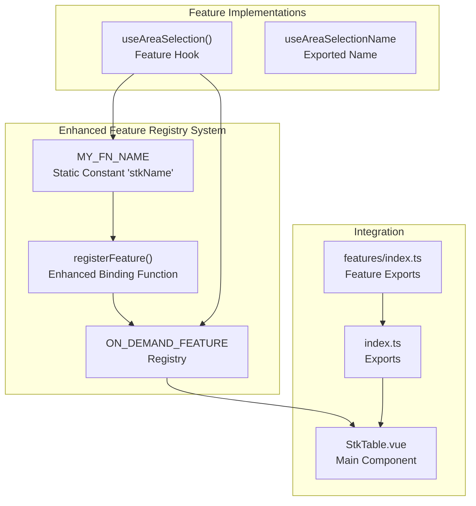
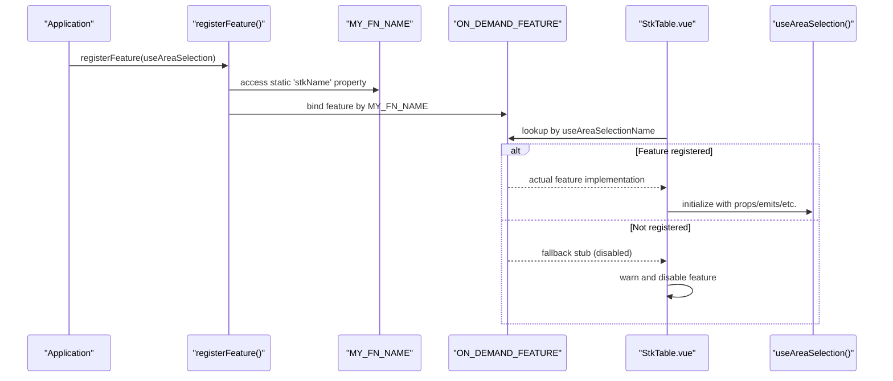
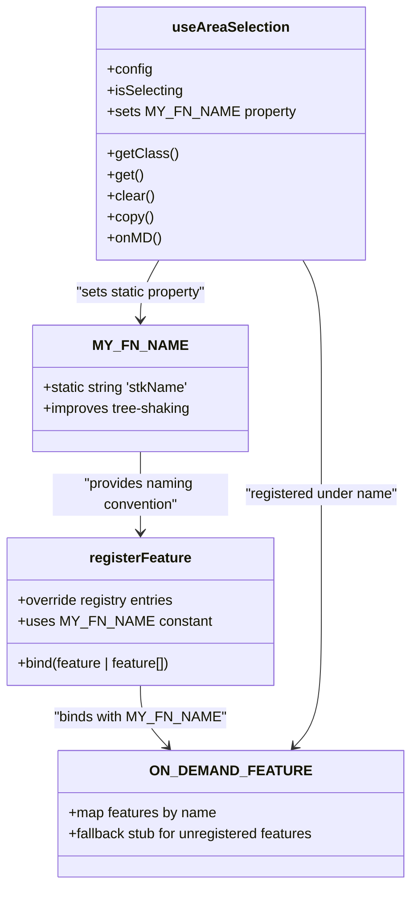
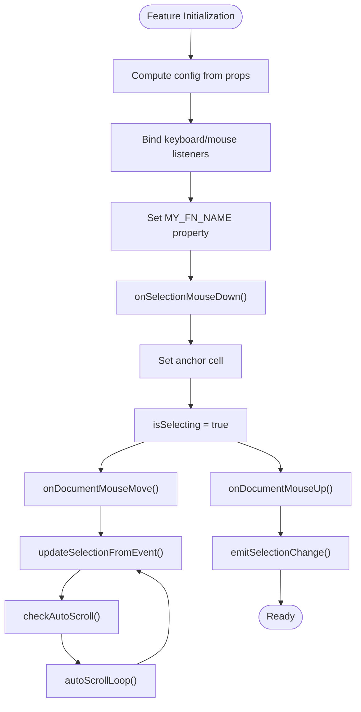
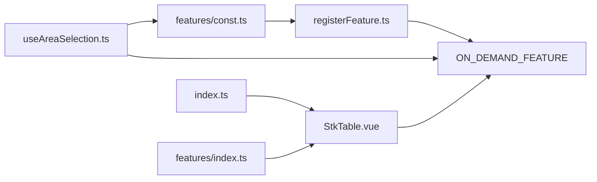

# On-Demand Feature Registration

<cite>
**Referenced Files in This Document**
- [registerFeature.ts](file://src/StkTable/registerFeature.ts)
- [index.ts](file://src/StkTable/index.ts)
- [useAreaSelection.ts](file://src/StkTable/features/useAreaSelection.ts)
- [StkTable.vue](file://src/StkTable/StkTable.vue)
- [features/index.ts](file://src/StkTable/features/index.ts)
- [features/const.ts](file://src/StkTable/features/const.ts)
- [StkTable.vue (docs-demo)](file://docs-demo/StkTable.vue)
</cite>

## Update Summary
**Changes Made**
- Enhanced feature registration system with new MY_FN_NAME constant for improved tree-shaking capabilities
- Updated registration mechanism to use static 'stkName' property instead of dynamic function names
- Improved dead code elimination during build processes for better bundle optimization
- Maintained backward compatibility while enhancing performance characteristics

## Table of Contents
1. [Introduction](#introduction)
2. [Project Structure](#project-structure)
3. [Core Components](#core-components)
4. [Architecture Overview](#architecture-overview)
5. [Detailed Component Analysis](#detailed-component-analysis)
6. [Dependency Analysis](#dependency-analysis)
7. [Performance Considerations](#performance-considerations)
8. [Troubleshooting Guide](#troubleshooting-guide)
9. [Conclusion](#conclusion)

## Introduction
This document explains the On-Demand Feature Registration system used by the table component. It enables optional features (such as area selection) to be conditionally included at runtime, reducing bundle size and improving performance when features are not needed. The mechanism centers around a registry that lazily binds feature implementations only when explicitly registered by the application. Recent enhancements include improved tree-shaking capabilities through the use of a dedicated MY_FN_NAME constant for better dead code elimination during build processes.

## Project Structure
The feature registration system spans several modules:
- A central registry that holds feature implementations keyed by feature name
- A registration function that binds features into the registry using static naming conventions
- Feature implementations (e.g., area selection) that conform to a common interface and use the MY_FN_NAME constant
- Integration points inside the main table component that consume the registry

**Diagram sources**
- [registerFeature.ts:1-36](file://src/StkTable/registerFeature.ts#L1-L36)
- [useAreaSelection.ts:6](file://src/StkTable/features/useAreaSelection.ts#L6)
- [useAreaSelection.ts:780](file://src/StkTable/features/useAreaSelection.ts#L780)
- [features/const.ts:1](file://src/StkTable/features/const.ts#L1)
- [StkTable.vue:268](file://src/StkTable/StkTable.vue#L268)
- [index.ts:4-5](file://src/StkTable/index.ts#L4-L5)
- [features/index.ts:1](file://src/StkTable/features/index.ts#L1)

**Section sources**
- [registerFeature.ts:1-36](file://src/StkTable/registerFeature.ts#L1-L36)
- [index.ts:4-5](file://src/StkTable/index.ts#L4-L5)
- [features/index.ts:1](file://src/StkTable/features/index.ts#L1)
- [features/const.ts:1](file://src/StkTable/features/const.ts#L1)

## Core Components
- **ON_DEMAND_FEATURE**: A registry mapping feature names to their implementations. By default, it provides a safe fallback for unregistered features.
- **registerFeature**: An enhanced function that accepts one or more feature implementations and binds them into the registry using the MY_FN_NAME constant for improved tree-shaking capabilities.
- **MY_FN_NAME**: A new static constant (`'stkName'`) that provides consistent naming for features across build processes, enabling better dead code elimination.
- **useAreaSelection**: An example feature hook implementing area selection functionality, including mouse and keyboard interactions, selection state, and clipboard operations. Now uses the MY_FN_NAME constant for enhanced compatibility.

Key behaviors:
- **Safe fallback**: When a feature is not registered, the registry returns a stub implementation that disables functionality and logs a warning.
- **Enhanced runtime binding**: Features become active only after being registered via the provided function, using the MY_FN_NAME constant for consistent naming.
- **Improved tree-shaking**: The static 'stkName' property allows build tools to better optimize unused features during bundling.
- **Integration**: The main table component reads from the registry using the feature's name to obtain the bound implementation.

**Section sources**
- [registerFeature.ts:4-36](file://src/StkTable/registerFeature.ts#L4-L36)
- [features/const.ts:1](file://src/StkTable/features/const.ts#L1)
- [useAreaSelection.ts:778-781](file://src/StkTable/features/useAreaSelection.ts#L778-L781)

## Architecture Overview
The feature system follows a plugin-like architecture with enhanced tree-shaking capabilities:
- Application code decides which features to enable by calling the registration function.
- The main component queries the registry by feature name to obtain the implementation.
- If a feature is not registered, the fallback stub ensures graceful degradation.
- The MY_FN_NAME constant provides consistent naming that improves build-time optimization.

**Diagram sources**
- [registerFeature.ts:25-36](file://src/StkTable/registerFeature.ts#L25-L36)
- [registerFeature.ts:28](file://src/StkTable/registerFeature.ts#L28)
- [features/const.ts:1](file://src/StkTable/features/const.ts#L1)
- [StkTable.vue:905-916](file://src/StkTable/StkTable.vue#L905-L916)

**Section sources**
- [registerFeature.ts:25-36](file://src/StkTable/registerFeature.ts#L25-L36)
- [features/const.ts:1](file://src/StkTable/features/const.ts#L1)
- [StkTable.vue:905-916](file://src/StkTable/StkTable.vue#L905-L916)

## Detailed Component Analysis

### Enhanced Feature Registry and Registration
The registry and registration function form the core of the on-demand system with improved tree-shaking capabilities:
- **ON_DEMAND_FEATURE** defines the registry type and provides a fallback implementation for area selection.
- **registerFeature** accepts either a single feature or an array and binds them into the registry using the MY_FN_NAME constant for consistent naming.
- **MY_FN_NAME** provides a static string ('stkName') that enables better dead code elimination during build processes.

**Diagram sources**
- [registerFeature.ts:4-36](file://src/StkTable/registerFeature.ts#L4-L36)
- [features/const.ts:1](file://src/StkTable/features/const.ts#L1)
- [useAreaSelection.ts:778-781](file://src/StkTable/features/useAreaSelection.ts#L778-L781)

**Section sources**
- [registerFeature.ts:4-36](file://src/StkTable/registerFeature.ts#L4-L36)
- [features/const.ts:1](file://src/StkTable/features/const.ts#L1)

### Area Selection Feature Implementation
The area selection feature provides enhanced tree-shaking capabilities:
- **Selection state management** (current range, anchor cell, dragging flag)
- **Mouse interaction handlers** for drag selection
- **Keyboard navigation** (arrow keys, Tab, Escape, Ctrl+C/Cmd+C)
- **Clipboard copy functionality**
- **Scroll-to-view logic** for virtualized tables
- **CSS class generation** for rendering selection borders
- **Enhanced naming** through MY_FN_NAME constant for improved build optimization

**Diagram sources**
- [useAreaSelection.ts:302-475](file://src/StkTable/features/useAreaSelection.ts#L302-L475)
- [useAreaSelection.ts:477-490](file://src/StkTable/features/useAreaSelection.ts#L477-L490)
- [useAreaSelection.ts:780](file://src/StkTable/features/useAreaSelection.ts#L780)

**Section sources**
- [useAreaSelection.ts:12-781](file://src/StkTable/features/useAreaSelection.ts#L12-L781)

### Integration in the Main Table Component
The main table component integrates the feature through the registry with enhanced naming:
- **Imports** the registry and the feature hook
- **Calls** the registry lookup using the feature's name
- **Initializes** the returned implementation with component props, emits, refs, and utilities
- **Uses** the feature's methods for rendering and interaction
- **Benefits** from improved tree-shaking through consistent naming conventions

**Diagram sources**
- [StkTable.vue:268](file://src/StkTable/StkTable.vue#L268)
- [StkTable.vue:313](file://src/StkTable/StkTable.vue#L313)
- [StkTable.vue:905-916](file://src/StkTable/StkTable.vue#L905-L916)

**Section sources**
- [StkTable.vue:268-313](file://src/StkTable/StkTable.vue#L268-L313)
- [StkTable.vue:905-916](file://src/StkTable/StkTable.vue#L905-L916)

### Example Usage in Documentation Demo
The documentation demo shows how to enable the area selection feature with enhanced registration:
- **Import** the feature hook and registration function
- **Call** the registration function with the feature
- **The main table component** will now use the registered implementation with improved tree-shaking support

**Section sources**
- [StkTable.vue (docs-demo):5-11](file://docs-demo/StkTable.vue#L5-L11)

## Dependency Analysis
The feature system exhibits low coupling and high cohesion with enhanced tree-shaking capabilities:
- **Registry** decouples feature consumers from implementations
- **Registration function** centralizes binding logic with improved naming conventions
- **MY_FN_NAME constant** provides consistent naming for better build optimization
- **Main component** depends only on the registry and feature names
- **No circular dependencies** are introduced
- **Enhanced dead code elimination** during build processes

**Diagram sources**
- [index.ts:4-5](file://src/StkTable/index.ts#L4-L5)
- [features/index.ts:1](file://src/StkTable/features/index.ts#L1)
- [registerFeature.ts:25-36](file://src/StkTable/registerFeature.ts#L25-L36)
- [features/const.ts:1](file://src/StkTable/features/const.ts#L1)
- [StkTable.vue:268](file://src/StkTable/StkTable.vue#L268)

**Section sources**
- [index.ts:4-5](file://src/StkTable/index.ts#L4-L5)
- [features/index.ts:1](file://src/StkTable/features/index.ts#L1)
- [registerFeature.ts:25-36](file://src/StkTable/registerFeature.ts#L25-L36)
- [features/const.ts:1](file://src/StkTable/features/const.ts#L1)
- [StkTable.vue:268](file://src/StkTable/StkTable.vue#L268)

## Performance Considerations
- **Enhanced lazy loading**: Features are only initialized when registered, avoiding overhead for unused features.
- **Improved minimal footprint**: The fallback stub is lightweight and disables functionality safely.
- **Better tree-shaking**: The MY_FN_NAME constant enables superior dead code elimination during build processes, resulting in smaller bundles.
- **Virtual scrolling compatibility**: The area selection feature accounts for virtual scrolling and fixed columns to maintain accurate selection rendering and scrolling behavior.
- **Build-time optimization**: Static naming conventions allow build tools to more effectively eliminate unused code.

## Troubleshooting Guide
Common issues and resolutions:
- **Feature not working**: Ensure the feature is registered before the component renders. The registry will log a warning when a feature is accessed without being registered.
- **Selection styles missing**: Verify that the component consumes the feature's class generator and applies the returned class list to cells.
- **Keyboard shortcuts not responding**: Confirm that the component's tabindex is set appropriately and that the feature's keyboard handler is active.
- **Bundle size concerns**: The enhanced MY_FN_NAME system should improve tree-shaking, but verify that unused features are truly eliminated in production builds.
- **Registration issues**: Ensure that features are properly exported and that the MY_FN_NAME constant is accessible during the registration process.

**Section sources**
- [registerFeature.ts:9-20](file://src/StkTable/registerFeature.ts#L9-L20)
- [StkTable.vue:31-31](file://src/StkTable/StkTable.vue#L31)
- [useAreaSelection.ts:547-653](file://src/StkTable/features/useAreaSelection.ts#L547-L653)

## Conclusion
The On-Demand Feature Registration system provides a clean, extensible way to include optional features like area selection. The recent enhancements with the MY_FN_NAME constant significantly improve tree-shaking capabilities and dead code elimination during build processes, resulting in smaller bundles and better performance. By deferring initialization until registration and offering a safe fallback, it improves performance and developer experience while maintaining backward compatibility and enabling better optimization for production deployments.