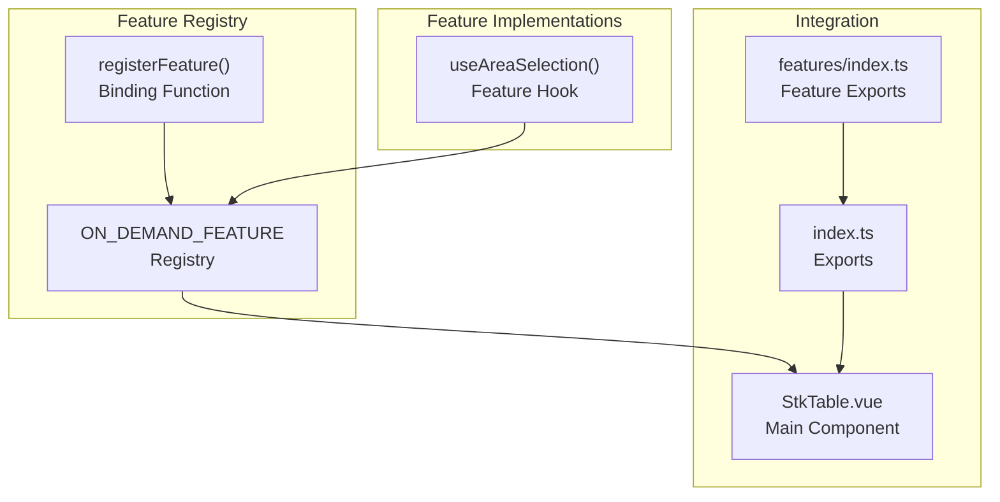
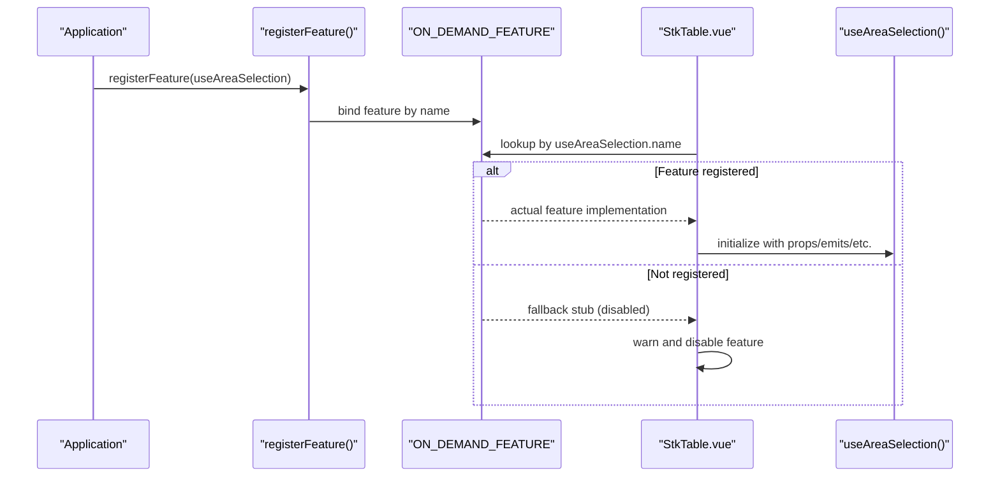
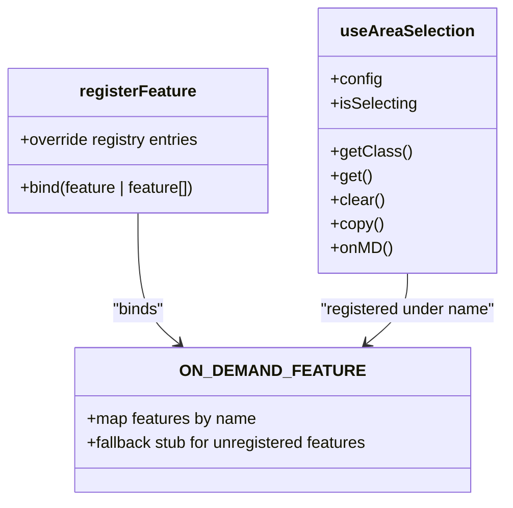
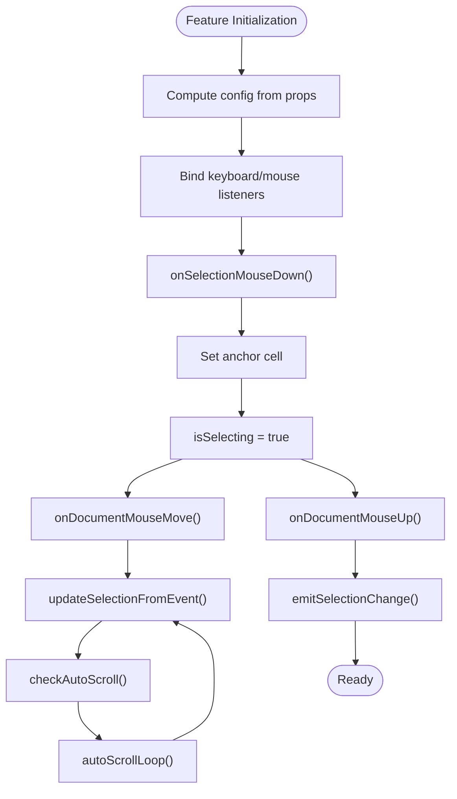
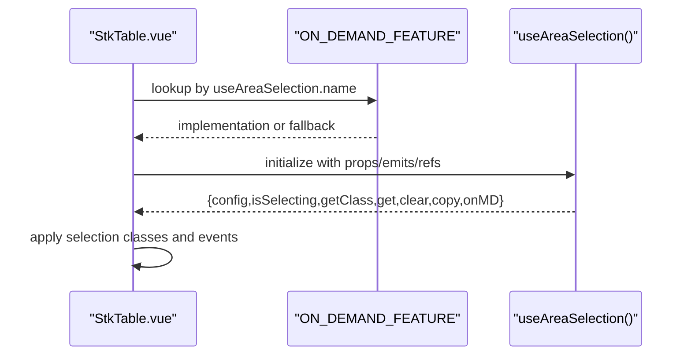
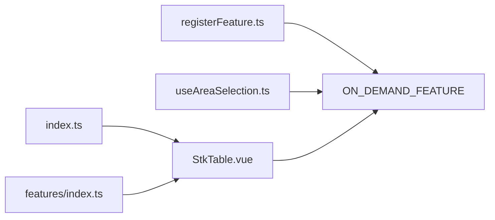

# On-Demand Feature Registration

<cite>
**Referenced Files in This Document**
- [registerFeature.ts](file://src/StkTable/registerFeature.ts)
- [index.ts](file://src/StkTable/index.ts)
- [useAreaSelection.ts](file://src/StkTable/features/useAreaSelection.ts)
- [StkTable.vue](file://src/StkTable/StkTable.vue)
- [features/index.ts](file://src/StkTable/features/index.ts)
- [StkTable.vue (docs-demo)](file://docs-demo/StkTable.vue)
</cite>

## Table of Contents
1. [Introduction](#introduction)
2. [Project Structure](#project-structure)
3. [Core Components](#core-components)
4. [Architecture Overview](#architecture-overview)
5. [Detailed Component Analysis](#detailed-component-analysis)
6. [Dependency Analysis](#dependency-analysis)
7. [Performance Considerations](#performance-considerations)
8. [Troubleshooting Guide](#troubleshooting-guide)
9. [Conclusion](#conclusion)

## Introduction
This document explains the On-Demand Feature Registration system used by the table component. It enables optional features (such as area selection) to be conditionally included at runtime, reducing bundle size and improving performance when features are not needed. The mechanism centers around a registry that lazily binds feature implementations only when explicitly registered by the application.

## Project Structure
The feature registration system spans several modules:
- A central registry that holds feature implementations keyed by feature name
- A registration function that binds features into the registry
- Feature implementations (e.g., area selection) that conform to a common interface
- Integration points inside the main table component that consume the registry

**Diagram sources**
- [registerFeature.ts:1-31](file://src/StkTable/registerFeature.ts#L1-L31)
- [useAreaSelection.ts:1-777](file://src/StkTable/features/useAreaSelection.ts#L1-L777)
- [StkTable.vue:260-459](file://src/StkTable/StkTable.vue#L260-L459)
- [index.ts:1-10](file://src/StkTable/index.ts#L1-L10)
- [features/index.ts:1-2](file://src/StkTable/features/index.ts#L1-L2)

**Section sources**
- [registerFeature.ts:1-31](file://src/StkTable/registerFeature.ts#L1-L31)
- [index.ts:1-10](file://src/StkTable/index.ts#L1-L10)
- [features/index.ts:1-2](file://src/StkTable/features/index.ts#L1-L2)

## Core Components
- ON_DEMAND_FEATURE: A registry mapping feature names to their implementations. By default, it provides a safe fallback for unregistered features.
- registerFeature: A function that accepts one or more feature implementations and binds them into the registry under their respective names.
- useAreaSelection: An example feature hook implementing area selection functionality, including mouse and keyboard interactions, selection state, and clipboard operations.

Key behaviors:
- Safe fallback: When a feature is not registered, the registry returns a stub implementation that disables functionality and logs a warning.
- Runtime binding: Features become active only after being registered via the provided function.
- Integration: The main table component reads from the registry using the feature's name to obtain the bound implementation.

**Section sources**
- [registerFeature.ts:4-31](file://src/StkTable/registerFeature.ts#L4-L31)
- [useAreaSelection.ts:12-777](file://src/StkTable/features/useAreaSelection.ts#L12-L777)

## Architecture Overview
The feature system follows a plugin-like architecture:
- Application code decides which features to enable by calling the registration function.
- The main component queries the registry by feature name to obtain the implementation.
- If a feature is not registered, the fallback stub ensures graceful degradation.

**Diagram sources**
- [registerFeature.ts:25-31](file://src/StkTable/registerFeature.ts#L25-L31)
- [registerFeature.ts:8-21](file://src/StkTable/registerFeature.ts#L8-L21)
- [StkTable.vue:905-916](file://src/StkTable/StkTable.vue#L905-L916)

**Section sources**
- [registerFeature.ts:25-31](file://src/StkTable/registerFeature.ts#L25-L31)
- [StkTable.vue:905-916](file://src/StkTable/StkTable.vue#L905-L916)

## Detailed Component Analysis

### Feature Registry and Registration
The registry and registration function form the core of the on-demand system:
- ON_DEMAND_FEATURE defines the registry type and provides a fallback implementation for area selection.
- registerFeature accepts either a single feature or an array and binds them into the registry using their `.name` property.

**Diagram sources**
- [registerFeature.ts:4-31](file://src/StkTable/registerFeature.ts#L4-L31)
- [useAreaSelection.ts:767-777](file://src/StkTable/features/useAreaSelection.ts#L767-L777)

**Section sources**
- [registerFeature.ts:4-31](file://src/StkTable/registerFeature.ts#L4-L31)

### Area Selection Feature Implementation
The area selection feature provides:
- Selection state management (current range, anchor cell, dragging flag)
- Mouse interaction handlers for drag selection
- Keyboard navigation (arrow keys, Tab, Escape, Ctrl+C/Cmd+C)
- Clipboard copy functionality
- Scroll-to-view logic for virtualized tables
- CSS class generation for rendering selection borders

**Diagram sources**
- [useAreaSelection.ts:302-475](file://src/StkTable/features/useAreaSelection.ts#L302-L475)
- [useAreaSelection.ts:477-490](file://src/StkTable/features/useAreaSelection.ts#L477-L490)

**Section sources**
- [useAreaSelection.ts:12-777](file://src/StkTable/features/useAreaSelection.ts#L12-L777)

### Integration in the Main Table Component
The main table component integrates the feature through the registry:
- Imports the registry and the feature hook
- Calls the registry lookup using the feature's name
- Initializes the returned implementation with component props, emits, refs, and utilities
- Uses the feature's methods for rendering and interaction

**Diagram sources**
- [StkTable.vue:268](file://src/StkTable/StkTable.vue#L268)
- [StkTable.vue:313](file://src/StkTable/StkTable.vue#L313)
- [StkTable.vue:905-916](file://src/StkTable/StkTable.vue#L905-L916)

**Section sources**
- [StkTable.vue:268-313](file://src/StkTable/StkTable.vue#L268-L313)
- [StkTable.vue:905-916](file://src/StkTable/StkTable.vue#L905-L916)

### Example Usage in Documentation Demo
The documentation demo shows how to enable the area selection feature:
- Import the feature hook and registration function
- Call the registration function with the feature
- The main table component will now use the registered implementation

**Section sources**
- [StkTable.vue (docs-demo):5-11](file://docs-demo/StkTable.vue#L5-L11)

## Dependency Analysis
The feature system exhibits low coupling and high cohesion:
- Registry decouples feature consumers from implementations
- Registration function centralizes binding logic
- Main component depends only on the registry and feature names
- No circular dependencies are introduced

**Diagram sources**
- [index.ts:4-5](file://src/StkTable/index.ts#L4-L5)
- [features/index.ts:1](file://src/StkTable/features/index.ts#L1)
- [registerFeature.ts:25-31](file://src/StkTable/registerFeature.ts#L25-L31)
- [StkTable.vue:268](file://src/StkTable/StkTable.vue#L268)

**Section sources**
- [index.ts:4-5](file://src/StkTable/index.ts#L4-L5)
- [features/index.ts:1](file://src/StkTable/features/index.ts#L1)
- [registerFeature.ts:25-31](file://src/StkTable/registerFeature.ts#L25-L31)
- [StkTable.vue:268](file://src/StkTable/StkTable.vue#L268)

## Performance Considerations
- Lazy loading: Features are only initialized when registered, avoiding overhead for unused features.
- Minimal footprint: The fallback stub is lightweight and disables functionality safely.
- Virtual scrolling compatibility: The area selection feature accounts for virtual scrolling and fixed columns to maintain accurate selection rendering and scrolling behavior.

## Troubleshooting Guide
Common issues and resolutions:
- Feature not working: Ensure the feature is registered before the component renders. The registry will log a warning when a feature is accessed without being registered.
- Selection styles missing: Verify that the component consumes the feature's class generator and applies the returned class list to cells.
- Keyboard shortcuts not responding: Confirm that the component's tabindex is set appropriately and that the feature's keyboard handler is active.

**Section sources**
- [registerFeature.ts:9-20](file://src/StkTable/registerFeature.ts#L9-L20)
- [StkTable.vue:31-31](file://src/StkTable/StkTable.vue#L31)
- [useAreaSelection.ts:547-653](file://src/StkTable/features/useAreaSelection.ts#L547-L653)

## Conclusion
The On-Demand Feature Registration system provides a clean, extensible way to include optional features like area selection. By deferring initialization until registration and offering a safe fallback, it improves performance and developer experience while maintaining backward compatibility.