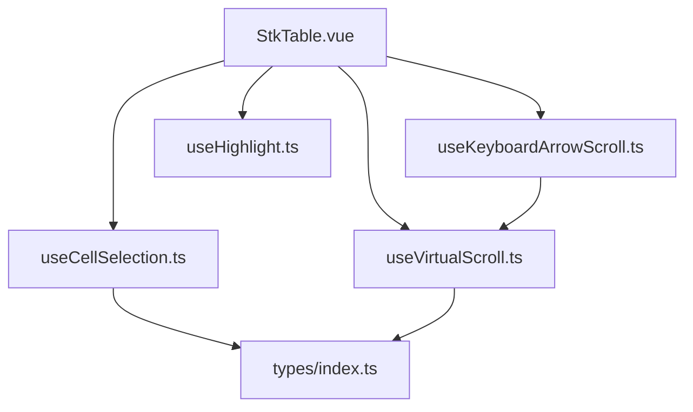
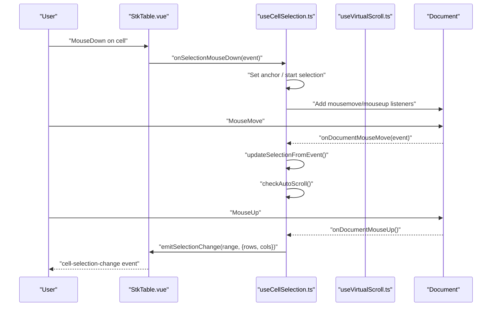
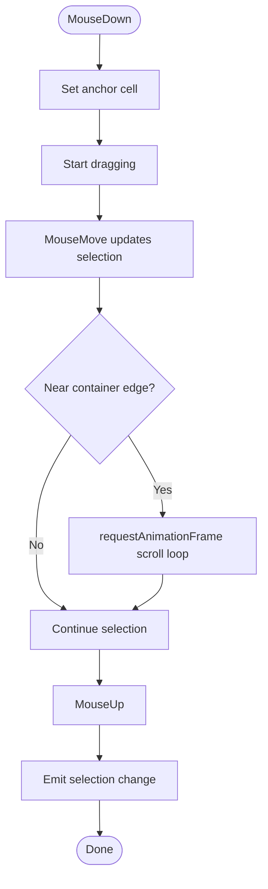
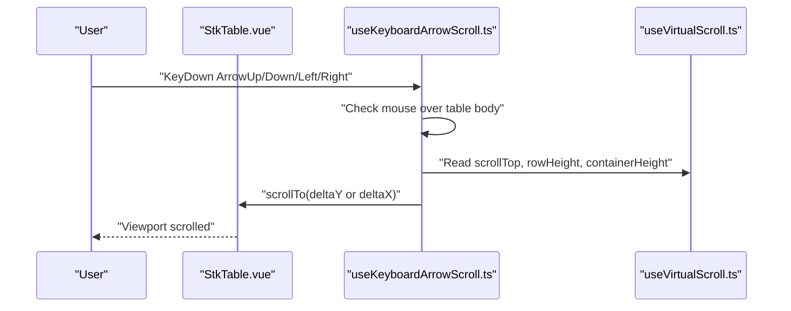
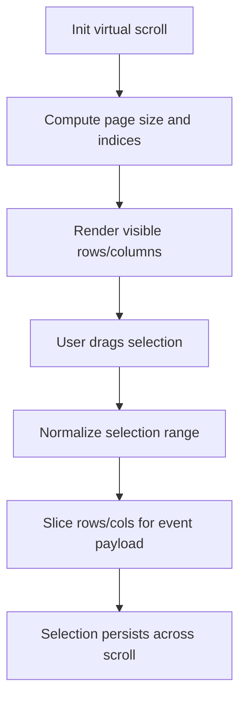
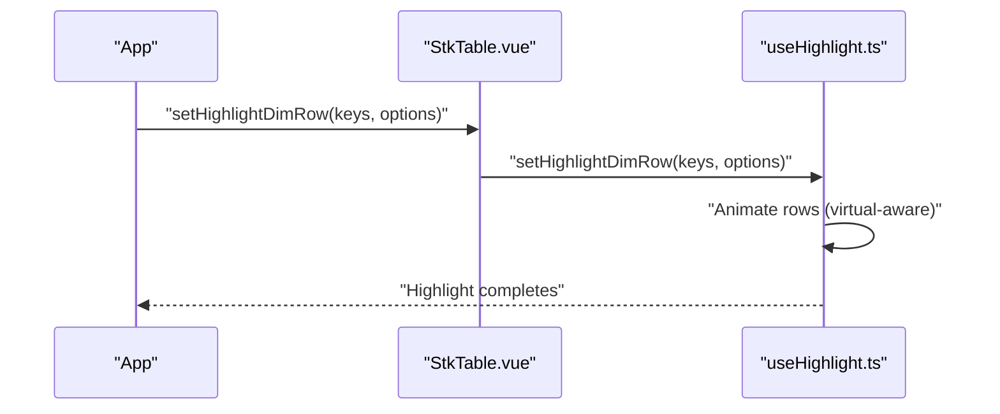
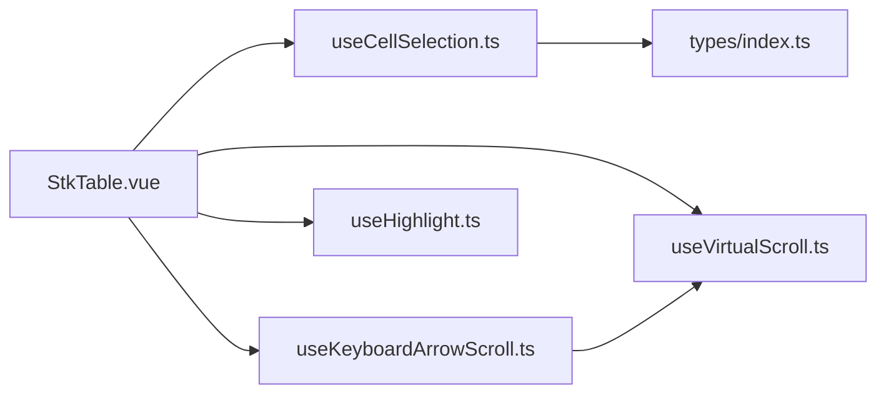

# Selection and Interaction Mechanisms

<cite>
**Referenced Files in This Document**
- [useCellSelection.ts](file://src/StkTable/useCellSelection.ts)
- [useKeyboardArrowScroll.ts](file://src/StkTable/useKeyboardArrowScroll.ts)
- [useVirtualScroll.ts](file://src/StkTable/useVirtualScroll.ts)
- [useHighlight.ts](file://src/StkTable/useHighlight.ts)
- [types/index.ts](file://src/StkTable/types/index.ts)
- [StkTable.vue](file://src/StkTable/StkTable.vue)
- [DragSelection.vue](file://docs-demo/advanced/drag-selection/DragSelection.vue)
- [RowCellHoverSelect.vue](file://docs-demo/basic/row-cell-mouse-event/RowCellHoverSelect.vue)
- [Highlight.vue](file://docs-demo/advanced/highlight/Highlight.vue)
</cite>

## Table of Contents
1. [Introduction](#introduction)
2. [Project Structure](#project-structure)
3. [Core Components](#core-components)
4. [Architecture Overview](#architecture-overview)
5. [Detailed Component Analysis](#detailed-component-analysis)
6. [Dependency Analysis](#dependency-analysis)
7. [Performance Considerations](#performance-considerations)
8. [Troubleshooting Guide](#troubleshooting-guide)
9. [Conclusion](#conclusion)
10. [Appendices](#appendices)

## Introduction
This document explains the selection and interaction mechanisms of the table, focusing on:
- Row selection and cell selection
- Keyboard navigation and shortcuts
- Multi-selection via Shift drag and drag selection ranges
- Selection state management and persistence across virtual scrolling
- Accessibility and integration with highlighting and drag-and-drop
- Practical examples and performance guidance for large datasets

## Project Structure
The selection and interaction features are implemented as composable hooks integrated into the main table component. The key pieces are:
- Cell selection hook for drag-range selection, keyboard shortcuts, and auto-scroll during selection
- Keyboard arrow navigation for virtual scrolling
- Virtual scrolling engine that renders only visible items
- Highlighting utilities for visual feedback
- Types and configuration interfaces for selection and interaction

**Diagram sources**
- [StkTable.vue](file://src/StkTable/StkTable.vue#L265-L265)
- [useCellSelection.ts](file://src/StkTable/useCellSelection.ts#L42-L51)
- [useKeyboardArrowScroll.ts](file://src/StkTable/useKeyboardArrowScroll.ts#L32-L35)
- [useVirtualScroll.ts](file://src/StkTable/useVirtualScroll.ts#L60-L69)
- [useHighlight.ts](file://src/StkTable/useHighlight.ts#L27-L27)
- [types/index.ts](file://src/StkTable/types/index.ts#L298-L317)

**Section sources**
- [StkTable.vue](file://src/StkTable/StkTable.vue#L265-L265)
- [useCellSelection.ts](file://src/StkTable/useCellSelection.ts#L42-L51)
- [useKeyboardArrowScroll.ts](file://src/StkTable/useKeyboardArrowScroll.ts#L32-L35)
- [useVirtualScroll.ts](file://src/StkTable/useVirtualScroll.ts#L60-L69)
- [useHighlight.ts](file://src/StkTable/useHighlight.ts#L27-L27)
- [types/index.ts](file://src/StkTable/types/index.ts#L298-L317)

## Core Components
- Cell selection manager: Provides drag-to-select ranges, Shift multi-range extension, keyboard shortcuts (copy and cancel), and selection classes for rendering.
- Keyboard arrow navigation: Handles arrow/page/home/end keys while ensuring the mouse is hovering over the table body.
- Virtual scrolling: Renders only visible rows/columns and manages offsets and indices for large datasets.
- Highlighting: Adds animated highlights for rows and cells, including integration with virtual scrolling.
- Types: Defines selection range, configuration, and callbacks for selection behavior.

**Section sources**
- [useCellSelection.ts](file://src/StkTable/useCellSelection.ts#L42-L456)
- [useKeyboardArrowScroll.ts](file://src/StkTable/useKeyboardArrowScroll.ts#L32-L112)
- [useVirtualScroll.ts](file://src/StkTable/useVirtualScroll.ts#L60-L497)
- [useHighlight.ts](file://src/StkTable/useHighlight.ts#L27-L257)
- [types/index.ts](file://src/StkTable/types/index.ts#L298-L317)

## Architecture Overview
The selection and interaction pipeline integrates the following:
- The table registers listeners for mouse and keyboard events.
- Cell selection tracks the anchor point and updates the selection range as the mouse moves.
- During drag selection, the system auto-scrolls the container near edges using requestAnimationFrame.
- When the mouse is released, a selection change event is emitted with the normalized range and sliced rows/columns.
- Keyboard arrow navigation scrolls the virtual viewport when the mouse is hovering over the table body.
- Highlighting utilities animate row/cell highlights independently of selection.

**Diagram sources**
- [useCellSelection.ts](file://src/StkTable/useCellSelection.ts#L137-L172)
- [useCellSelection.ts](file://src/StkTable/useCellSelection.ts#L174-L186)
- [useCellSelection.ts](file://src/StkTable/useCellSelection.ts#L214-L282)
- [useCellSelection.ts](file://src/StkTable/useCellSelection.ts#L319-L330)
- [useCellSelection.ts](file://src/StkTable/useCellSelection.ts#L332-L345)
- [StkTable.vue](file://src/StkTable/StkTable.vue#L616-L620)

## Detailed Component Analysis

### Cell Selection Manager
Responsibilities:
- Track selection range with anchor and end points
- Normalize selection bounds for consistent rendering
- Compute selected cell keys for fast lookup
- Provide keyboard shortcuts (Ctrl/Cmd+C to copy, Escape to clear)
- Emit selection change events with sliced rows and columns
- Provide helper classes for rendering selection borders
- Auto-scroll the container when dragging near edges

Key behaviors:
- Anchor-based selection: On mousedown, set anchor; on Shift+drag, extend selection from anchor.
- Edge auto-scroll: When mouse approaches container edges, scroll smoothly using requestAnimationFrame and elementFromPoint to resolve the hovered cell.
- Clipboard copy: Build tab-separated text from the selected rectangle, optionally formatting via a callback.

**Diagram sources**
- [useCellSelection.ts](file://src/StkTable/useCellSelection.ts#L137-L172)
- [useCellSelection.ts](file://src/StkTable/useCellSelection.ts#L174-L186)
- [useCellSelection.ts](file://src/StkTable/useCellSelection.ts#L214-L282)
- [useCellSelection.ts](file://src/StkTable/useCellSelection.ts#L319-L345)

**Section sources**
- [useCellSelection.ts](file://src/StkTable/useCellSelection.ts#L42-L456)
- [types/index.ts](file://src/StkTable/types/index.ts#L298-L317)
- [DragSelection.vue](file://docs-demo/advanced/drag-selection/DragSelection.vue#L1-L59)

### Keyboard Navigation and Shortcuts
- Arrow keys move the viewport by single row height or 50px horizontally.
- PageUp/PageDown scroll by a page-sized amount adjusted by header height.
- Home/End jump to top/bottom.
- Only effective when the mouse pointer is over the table body (mouseenter/leave detection).
- Uses virtual scroll stores to compute page size and current scroll positions.

**Diagram sources**
- [useKeyboardArrowScroll.ts](file://src/StkTable/useKeyboardArrowScroll.ts#L65-L96)
- [useVirtualScroll.ts](file://src/StkTable/useVirtualScroll.ts#L72-L81)
- [useVirtualScroll.ts](file://src/StkTable/useVirtualScroll.ts#L273-L406)

**Section sources**
- [useKeyboardArrowScroll.ts](file://src/StkTable/useKeyboardArrowScroll.ts#L32-L112)
- [useVirtualScroll.ts](file://src/StkTable/useVirtualScroll.ts#L72-L81)

### Virtual Scrolling and Selection Persistence
- Virtual scrolling computes visible rows and columns, offsets, and page sizes.
- Selection range normalization ensures consistent rendering regardless of anchor vs. end order.
- The selection manager slices rows and columns from the visible dataset for the event payload.
- Edge auto-scroll during selection accounts for header height and table layout.

**Diagram sources**
- [useVirtualScroll.ts](file://src/StkTable/useVirtualScroll.ts#L195-L228)
- [useVirtualScroll.ts](file://src/StkTable/useVirtualScroll.ts#L413-L477)
- [useCellSelection.ts](file://src/StkTable/useCellSelection.ts#L17-L24)
- [useCellSelection.ts](file://src/StkTable/useCellSelection.ts#L332-L345)

**Section sources**
- [useVirtualScroll.ts](file://src/StkTable/useVirtualScroll.ts#L60-L497)
- [useCellSelection.ts](file://src/StkTable/useCellSelection.ts#L17-L24)
- [useCellSelection.ts](file://src/StkTable/useCellSelection.ts#L332-L345)

### Highlighting Integration
- Highlights can be applied to cells or entire rows with configurable duration and FPS.
- In virtual mode, animations are driven by timestamps and element visibility checks.
- Highlights do not interfere with selection state; they are independent visual cues.

**Diagram sources**
- [useHighlight.ts](file://src/StkTable/useHighlight.ts#L133-L166)
- [useHighlight.ts](file://src/StkTable/useHighlight.ts#L144-L153)
- [Highlight.vue](file://docs-demo/advanced/highlight/Highlight.vue#L17-L28)

**Section sources**
- [useHighlight.ts](file://src/StkTable/useHighlight.ts#L27-L257)
- [Highlight.vue](file://docs-demo/advanced/highlight/Highlight.vue#L1-L76)

### Drag-and-Drop Integration
- The table supports row drag-and-drop and header drag-and-drop.
- While distinct from cell selection, drag operations can coexist with selection visuals and state.
- Dragging rows does not alter the cell selection state; they are orthogonal features.

**Section sources**
- [StkTable.vue](file://src/StkTable/StkTable.vue#L771-L771)
- [StkTable.vue](file://src/StkTable/StkTable.vue#L769-L771)

### Accessibility and Keyboard Shortcuts
- The table container can receive focus when cell selection is enabled, enabling keyboard shortcuts.
- Supported shortcuts:
  - Ctrl/Cmd+C to copy selected range to clipboard (formatted via a callback if provided)
  - Escape to clear selection
- Keyboard arrow navigation requires the mouse to be hovering over the table body.

**Section sources**
- [StkTable.vue](file://src/StkTable/StkTable.vue#L30-L30)
- [useCellSelection.ts](file://src/StkTable/useCellSelection.ts#L357-L401)
- [useKeyboardArrowScroll.ts](file://src/StkTable/useKeyboardArrowScroll.ts#L69-L70)

## Dependency Analysis
- StkTable.vue composes useCellSelection, useKeyboardArrowScroll, useVirtualScroll, and useHighlight.
- useCellSelection depends on types for selection range and configuration.
- useKeyboardArrowScroll depends on useVirtualScroll stores for scroll calculations.
- useVirtualScroll provides stores consumed by both selection and keyboard navigation.

**Diagram sources**
- [StkTable.vue](file://src/StkTable/StkTable.vue#L265-L265)
- [useCellSelection.ts](file://src/StkTable/useCellSelection.ts#L42-L51)
- [useKeyboardArrowScroll.ts](file://src/StkTable/useKeyboardArrowScroll.ts#L32-L35)
- [useVirtualScroll.ts](file://src/StkTable/useVirtualScroll.ts#L60-L69)
- [useHighlight.ts](file://src/StkTable/useHighlight.ts#L27-L27)
- [types/index.ts](file://src/StkTable/types/index.ts#L298-L317)

**Section sources**
- [StkTable.vue](file://src/StkTable/StkTable.vue#L265-L265)
- [useCellSelection.ts](file://src/StkTable/useCellSelection.ts#L42-L51)
- [useKeyboardArrowScroll.ts](file://src/StkTable/useKeyboardArrowScroll.ts#L32-L35)
- [useVirtualScroll.ts](file://src/StkTable/useVirtualScroll.ts#L60-L69)
- [useHighlight.ts](file://src/StkTable/useHighlight.ts#L27-L27)
- [types/index.ts](file://src/StkTable/types/index.ts#L298-L317)

## Performance Considerations
- Selection computation:
  - Selection range normalization and selected cell key set construction are O(width×height) within the visible rectangle.
  - Using a Set for selected keys enables fast containment checks.
- Auto-scroll during selection:
  - Uses requestAnimationFrame to avoid blocking the UI.
  - elementFromPoint is used to resolve the hovered cell after scroll; limit calls by throttling updates.
- Virtual scrolling:
  - Only renders visible rows/columns; selection slicing uses shallow copies of the visible subset.
  - Page size and indices are recomputed efficiently; merging spans and auto row heights are handled incrementally.
- Clipboard copy:
  - Builds a tab-separated string row-by-row; consider batching large selections if needed.

[No sources needed since this section provides general guidance]

## Troubleshooting Guide
Common issues and resolutions:
- Selection not updating during drag:
  - Ensure mousemove and mouseup listeners are attached on mousedown and removed on mouseup.
  - Verify that updateSelectionFromEvent resolves row and column indices correctly.
- Escape key does nothing:
  - Confirm the table container is focusable and the keydown listener is registered.
- Copy to clipboard fails:
  - The implementation falls back to console warnings; ensure browser permissions allow clipboard access.
- Keyboard navigation ineffective:
  - Ensure the mouse pointer is over the table body; the handler exits early otherwise.
- Highlights not visible in virtual mode:
  - Verify row keys match and that elements are visible; animations rely on element presence.

**Section sources**
- [useCellSelection.ts](file://src/StkTable/useCellSelection.ts#L112-L128)
- [useCellSelection.ts](file://src/StkTable/useCellSelection.ts#L357-L401)
- [useKeyboardArrowScroll.ts](file://src/StkTable/useKeyboardArrowScroll.ts#L69-L70)
- [useHighlight.ts](file://src/StkTable/useHighlight.ts#L144-L153)

## Conclusion
The selection and interaction system combines a robust cell selection manager, precise keyboard navigation for virtualized tables, and efficient virtual scrolling to support large datasets. Highlights and drag-and-drop operate independently, allowing flexible UX patterns. By leveraging normalized ranges, efficient slicing, and auto-scroll during selection, the system remains responsive and accessible.

[No sources needed since this section summarizes without analyzing specific files]

## Appendices

### Example: Implementing Drag Selection
- Enable cell selection and listen for selection changes.
- Optionally format copied content via the configuration callback.
- Inspect the emitted range and payload to update application state.

**Section sources**
- [DragSelection.vue](file://docs-demo/advanced/drag-selection/DragSelection.vue#L1-L59)
- [types/index.ts](file://src/StkTable/types/index.ts#L306-L317)
- [StkTable.vue](file://src/StkTable/StkTable.vue#L616-L620)

### Example: Handling Selection in Large Datasets
- Use virtual scrolling to render only visible rows.
- Rely on selection slicing for rows and columns to minimize overhead.
- For very large selections, consider debouncing clipboard operations.

**Section sources**
- [useVirtualScroll.ts](file://src/StkTable/useVirtualScroll.ts#L103-L107)
- [useCellSelection.ts](file://src/StkTable/useCellSelection.ts#L332-L345)

### Example: Custom Selection Behavior
- Provide a formatCellForClipboard callback to ensure copied text matches rendered content.
- Use getSelectedCells to programmatically retrieve the current selection payload.

**Section sources**
- [types/index.ts](file://src/StkTable/types/index.ts#L306-L317)
- [useCellSelection.ts](file://src/StkTable/useCellSelection.ts#L426-L438)

### Example: Keyboard Navigation and Accessibility
- Ensure the table container is focusable when cell selection is enabled.
- Use arrow keys to navigate within the viewport; combine with Shift for multi-selection.

**Section sources**
- [StkTable.vue](file://src/StkTable/StkTable.vue#L30-L30)
- [useKeyboardArrowScroll.ts](file://src/StkTable/useKeyboardArrowScroll.ts#L65-L96)

### Example: Highlighting Integration
- Animate row or cell highlights independently of selection.
- Configure duration and FPS for smooth transitions.

**Section sources**
- [useHighlight.ts](file://src/StkTable/useHighlight.ts#L27-L257)
- [Highlight.vue](file://docs-demo/advanced/highlight/Highlight.vue#L1-L76)