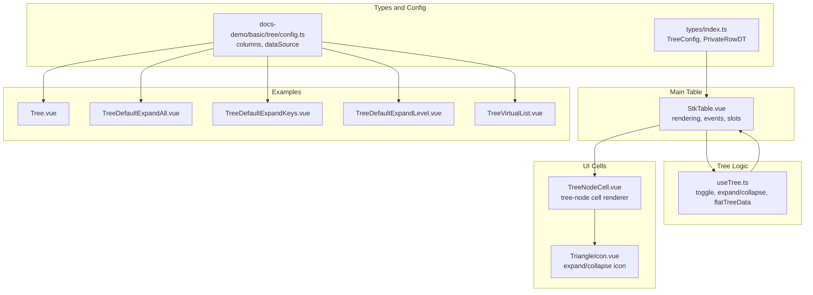
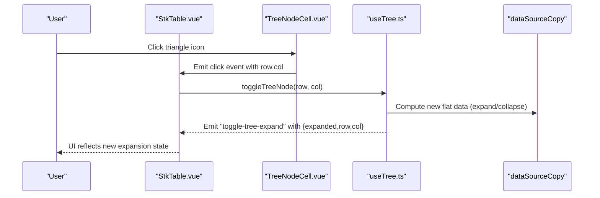
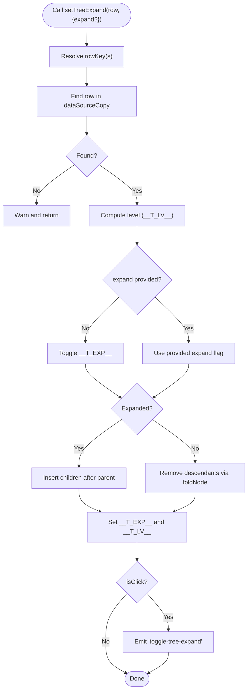
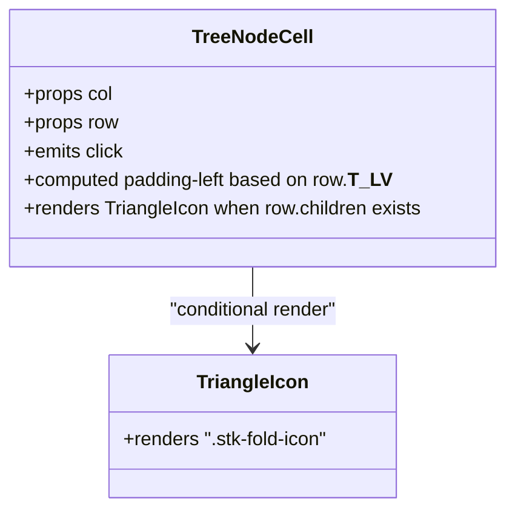
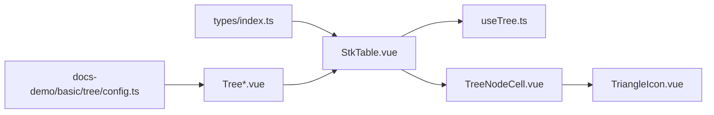

# Tree Data Structures and Hierarchical Display

<cite>
**Referenced Files in This Document**
- [useTree.ts](file://src/StkTable/useTree.ts)
- [StkTable.vue](file://src/StkTable/StkTable.vue)
- [TreeNodeCell.vue](file://src/StkTable/components/TreeNodeCell.vue)
- [TriangleIcon.vue](file://src/StkTable/components/TriangleIcon.vue)
- [index.ts](file://src/StkTable/types/index.ts)
- [config.ts](file://docs-demo/basic/tree/config.ts)
- [Tree.vue](file://docs-demo/basic/tree/Tree.vue)
- [TreeDefaultExpandAll.vue](file://docs-demo/basic/tree/TreeDefaultExpandAll.vue)
- [TreeDefaultExpandKeys.vue](file://docs-demo/basic/tree/TreeDefaultExpandKeys.vue)
- [TreeDefaultExpandLevel.vue](file://docs-demo/basic/tree/TreeDefaultExpandLevel.vue)
- [TreeVirtualList.vue](file://docs-demo/basic/tree/TreeVirtualList.vue)
- [VirtualTree.vue](file://src/VirtualTree.vue)
</cite>

## Table of Contents
1. [Introduction](#introduction)
2. [Project Structure](#project-structure)
3. [Core Components](#core-components)
4. [Architecture Overview](#architecture-overview)
5. [Detailed Component Analysis](#detailed-component-analysis)
6. [Dependency Analysis](#dependency-analysis)
7. [Performance Considerations](#performance-considerations)
8. [Troubleshooting Guide](#troubleshooting-guide)
9. [Conclusion](#conclusion)
10. [Appendices](#appendices)

## Introduction
This document explains the tree data structures and hierarchical display capabilities in Stk Table Vue. It covers how tree nodes are configured, how parent-child relationships are represented, and how expansion/collapse works. It documents the useTree composable, tree data flattening, recursive rendering, default expansion options, custom tree icons, indentation handling, and tree-specific virtual scrolling optimizations. It also describes tree node selection, multi-level tree headers, and filtering strategies, with practical examples for different tree layouts and large datasets.

## Project Structure
The tree feature spans several modules:
- Types and configuration define the tree column type, row metadata, and tree configuration options.
- The main table component integrates tree rendering and dispatches events.
- The useTree composable encapsulates tree state, expansion logic, and flattening.
- A dedicated tree node cell component renders the tree column with expand/collapse affordances.
- Demo configurations and examples illustrate default expansion modes and virtual scrolling with large datasets.

**Diagram sources**
- [index.ts](file://src/StkTable/types/index.ts#L54-L120)
- [index.ts](file://src/StkTable/types/index.ts#L140-L173)
- [index.ts](file://src/StkTable/types/index.ts#L255-L260)
- [StkTable.vue](file://src/StkTable/StkTable.vue#L160-L166)
- [useTree.ts](file://src/StkTable/useTree.ts#L12-L161)
- [TreeNodeCell.vue](file://src/StkTable/components/TreeNodeCell.vue#L1-L20)
- [TriangleIcon.vue](file://src/StkTable/components/TriangleIcon.vue#L1-L4)
- [config.ts](file://docs-demo/basic/tree/config.ts#L1-L113)
- [Tree.vue](file://docs-demo/basic/tree/Tree.vue#L1-L17)
- [TreeDefaultExpandAll.vue](file://docs-demo/basic/tree/TreeDefaultExpandAll.vue#L1-L17)
- [TreeDefaultExpandKeys.vue](file://docs-demo/basic/tree/TreeDefaultExpandKeys.vue#L1-L17)
- [TreeDefaultExpandLevel.vue](file://docs-demo/basic/tree/TreeDefaultExpandLevel.vue#L1-L16)
- [TreeVirtualList.vue](file://docs-demo/basic/tree/TreeVirtualList.vue#L1-L65)

**Section sources**
- [index.ts](file://src/StkTable/types/index.ts#L54-L120)
- [index.ts](file://src/StkTable/types/index.ts#L140-L173)
- [index.ts](file://src/StkTable/types/index.ts#L255-L260)
- [StkTable.vue](file://src/StkTable/StkTable.vue#L160-L166)
- [useTree.ts](file://src/StkTable/useTree.ts#L12-L161)
- [TreeNodeCell.vue](file://src/StkTable/components/TreeNodeCell.vue#L1-L20)
- [TriangleIcon.vue](file://src/StkTable/components/TriangleIcon.vue#L1-L4)
- [config.ts](file://docs-demo/basic/tree/config.ts#L1-L113)
- [Tree.vue](file://docs-demo/basic/tree/Tree.vue#L1-L17)
- [TreeDefaultExpandAll.vue](file://docs-demo/basic/tree/TreeDefaultExpandAll.vue#L1-L17)
- [TreeDefaultExpandKeys.vue](file://docs-demo/basic/tree/TreeDefaultExpandKeys.vue#L1-L17)
- [TreeDefaultExpandLevel.vue](file://docs-demo/basic/tree/TreeDefaultExpandLevel.vue#L1-L16)
- [TreeVirtualList.vue](file://docs-demo/basic/tree/TreeVirtualList.vue#L1-L65)

## Core Components
- Tree column type: Configure a column with type set to tree-node to render an expand/collapse indicator and label in that column.
- Tree data model: Each row supports a children array; the table injects internal flags (__T_EXP__, __T_LV__) to track expansion state and nesting level.
- Tree configuration: treeConfig supports defaultExpandAll, defaultExpandKeys, and defaultExpandLevel to preconfigure expansion on first load.
- Rendering pipeline: The main table selects TreeNodeCell for tree-node columns and wires triangle click events to toggle expansion.

Key implementation references:
- Column type definition and tree flags: [StkTableColumn type](file://src/StkTable/types/index.ts#L54-L120), [PrivateRowDT](file://src/StkTable/types/index.ts#L140-L173)
- Tree configuration options: [TreeConfig](file://src/StkTable/types/index.ts#L255-L260)
- Tree cell renderer: [TreeNodeCell.vue](file://src/StkTable/components/TreeNodeCell.vue#L1-L20)
- Main table wiring: [StkTable.vue tree-node rendering](file://src/StkTable/StkTable.vue#L160-L166)

**Section sources**
- [index.ts](file://src/StkTable/types/index.ts#L54-L120)
- [index.ts](file://src/StkTable/types/index.ts#L140-L173)
- [index.ts](file://src/StkTable/types/index.ts#L255-L260)
- [TreeNodeCell.vue](file://src/StkTable/components/TreeNodeCell.vue#L1-L20)
- [StkTable.vue](file://src/StkTable/StkTable.vue#L160-L166)

## Architecture Overview
The tree feature is composed of:
- Column configuration declaring a tree-node column.
- Data shape with children arrays.
- useTree managing expansion state, flattening, and emitting toggle events.
- TreeNodeCell rendering the clickable triangle and label with indentation based on level.
- StkTable integrating the cell renderer and handling row clicks to toggle nodes.

**Diagram sources**
- [StkTable.vue](file://src/StkTable/StkTable.vue#L147-L149)
- [TreeNodeCell.vue](file://src/StkTable/components/TreeNodeCell.vue#L18-L18)
- [useTree.ts](file://src/StkTable/useTree.ts#L17-L70)

**Section sources**
- [StkTable.vue](file://src/StkTable/StkTable.vue#L147-L149)
- [TreeNodeCell.vue](file://src/StkTable/components/TreeNodeCell.vue#L18-L18)
- [useTree.ts](file://src/StkTable/useTree.ts#L17-L70)

## Detailed Component Analysis

### useTree Composable
The useTree composable centralizes tree expansion/collapse logic:
- toggleTreeNode: Computes target expansion state and delegates to privateSetTreeExpand.
- privateSetTreeExpand: Resolves row keys, locates rows, expands by inserting children after the parent, collapses by removing descendants, updates __T_EXP__ and __T_LV__, and emits toggle-tree-expand.
- setTreeExpand: Programmatic expansion without emitting.
- flatTreeData: Recursively flattens the tree respecting saved expansion state and default expansion options.
- Helper functions:
  - expandNode: Returns flattened children for an expanded node.
  - foldNode: Counts descendants to remove during collapse.
  - setNodeExpanded: Sets expansion flag and level.

**Diagram sources**
- [useTree.ts](file://src/StkTable/useTree.ts#L29-L70)
- [useTree.ts](file://src/StkTable/useTree.ts#L127-L154)

**Section sources**
- [useTree.ts](file://src/StkTable/useTree.ts#L12-L161)

### Tree Node Rendering and Indentation
- TreeNodeCell renders the tree-node column content:
  - Uses row.__T_LV__ to compute left padding for indentation.
  - Renders TriangleIcon only when children exist.
  - Emits click to toggle expansion.
- TriangleIcon is a minimal placeholder for the expand/collapse icon.

**Diagram sources**
- [TreeNodeCell.vue](file://src/StkTable/components/TreeNodeCell.vue#L1-L20)
- [TriangleIcon.vue](file://src/StkTable/components/TriangleIcon.vue#L1-L4)

**Section sources**
- [TreeNodeCell.vue](file://src/StkTable/components/TreeNodeCell.vue#L1-L20)
- [TriangleIcon.vue](file://src/StkTable/components/TriangleIcon.vue#L1-L4)

### Default Expansion Options
The treeConfig supports three default expansion strategies:
- defaultExpandAll: Expand all nodes on first load.
- defaultExpandLevel: Expand nodes up to a given level.
- defaultExpandKeys: Expand specific nodes identified by rowKey.

These are evaluated during the initial flattening pass to set __T_EXP__ accordingly.

References:
- [TreeConfig](file://src/StkTable/types/index.ts#L255-L260)
- [flatTreeData and defaults](file://src/StkTable/useTree.ts#L86-L125)

**Section sources**
- [index.ts](file://src/StkTable/types/index.ts#L255-L260)
- [useTree.ts](file://src/StkTable/useTree.ts#L86-L125)

### Tree Data Transformation and Flattening
- The data source is transformed into a flat list for rendering.
- During flattening, each node’s expansion state is respected; default expansion options are applied on first load.
- Children are appended immediately after the parent row in the flat list when expanded.

References:
- [flatTreeData](file://src/StkTable/useTree.ts#L121-L125)
- [recursionFlat](file://src/StkTable/useTree.ts#L86-L113)

**Section sources**
- [useTree.ts](file://src/StkTable/useTree.ts#L86-L125)

### Recursive Rendering Patterns
- The main table iterates over the flat data source to render rows.
- For tree-node columns, TreeNodeCell is used, which reads row.__T_LV__ to compute indentation and triggers toggle via triangle click.
- The table also exposes a slot to customize the fold icon and drag handle.

References:
- [Tree-node rendering in StkTable.vue](file://src/StkTable/StkTable.vue#L160-L166)
- [Slots for icons](file://src/StkTable/StkTable.vue#L147-L152)

**Section sources**
- [StkTable.vue](file://src/StkTable/StkTable.vue#L147-L152)
- [StkTable.vue](file://src/StkTable/StkTable.vue#L160-L166)

### Tree-Specific Virtual Scrolling Optimizations
- Virtual scrolling is enabled via the virtual prop; when enabled, only visible rows are rendered.
- The tree flattening ensures that expanded children are contiguous in the flat list, so virtual scrolling can efficiently render large nested datasets.
- Example usage demonstrates virtual scrolling with a large generated dataset.

References:
- [TreeVirtualList.vue](file://docs-demo/basic/tree/TreeVirtualList.vue#L56-L63)
- [Virtual scrolling in StkTable.vue](file://src/StkTable/StkTable.vue#L314-L317)

**Section sources**
- [TreeVirtualList.vue](file://docs-demo/basic/tree/TreeVirtualList.vue#L56-L63)
- [StkTable.vue](file://src/StkTable/StkTable.vue#L314-L317)

### Tree Node Selection and Interaction
- Clicking the triangle toggles expansion state and emits toggle-tree-expand with {expanded, row, col}.
- The table passes row and col to the TreeNodeCell, which forwards the click to the table handler.
- Selection and multi-level headers are orthogonal to tree expansion; selection is handled elsewhere in the table.

References:
- [toggle-tree-expand emission](file://src/StkTable/useTree.ts#L64-L66)
- [triangle click binding](file://src/StkTable/StkTable.vue#L147-L149)

**Section sources**
- [useTree.ts](file://src/StkTable/useTree.ts#L64-L66)
- [StkTable.vue](file://src/StkTable/StkTable.vue#L147-L149)

### Multi-Level Tree Headers
- Multi-level headers are supported via column children; they do not interfere with tree-node columns.
- When combining tree-node columns with multi-level headers, ensure the tree-node column is placed appropriately in the header hierarchy.

References:
- [Multi-level headers support](file://src/StkTable/types/index.ts#L116-L118)
- [Example with multi-level headers](file://docs-demo/basic/multi-header/MultiHeader.vue)

**Section sources**
- [index.ts](file://src/StkTable/types/index.ts#L116-L118)
- [MultiHeader.vue](file://docs-demo/basic/multi-header/MultiHeader.vue)

### Tree Data Filtering
- Filtering can be applied at the data source level before flattening.
- When filtering, ensure that parent nodes remain visible if any descendant matches to preserve tree context.
- The table does not provide built-in tree-aware filters; implement filtering externally and recompute the data source.

[No sources needed since this section provides general guidance]

### Examples and Usage Patterns
- Simple tree: Configure a tree-node column and supply data with children.
- Default expansion:
  - Expand all: treeConfig.defaultExpandAll
  - Expand specific keys: treeConfig.defaultExpandKeys
  - Expand up to level: treeConfig.defaultExpandLevel
- Virtual scrolling with large datasets: Enable virtual and use a large generated data source.

References:
- [Tree.vue](file://docs-demo/basic/tree/Tree.vue#L10-L15)
- [TreeDefaultExpandAll.vue](file://docs-demo/basic/tree/TreeDefaultExpandAll.vue#L9-L12)
- [TreeDefaultExpandKeys.vue](file://docs-demo/basic/tree/TreeDefaultExpandKeys.vue#L9-L12)
- [TreeDefaultExpandLevel.vue](file://docs-demo/basic/tree/TreeDefaultExpandLevel.vue#L9-L11)
- [TreeVirtualList.vue](file://docs-demo/basic/tree/TreeVirtualList.vue#L56-L63)
- [config.ts](file://docs-demo/basic/tree/config.ts#L3-L8)
- [config.ts](file://docs-demo/basic/tree/config.ts#L9-L92)

**Section sources**
- [Tree.vue](file://docs-demo/basic/tree/Tree.vue#L10-L15)
- [TreeDefaultExpandAll.vue](file://docs-demo/basic/tree/TreeDefaultExpandAll.vue#L9-L12)
- [TreeDefaultExpandKeys.vue](file://docs-demo/basic/tree/TreeDefaultExpandKeys.vue#L9-L12)
- [TreeDefaultExpandLevel.vue](file://docs-demo/basic/tree/TreeDefaultExpandLevel.vue#L9-L11)
- [TreeVirtualList.vue](file://docs-demo/basic/tree/TreeVirtualList.vue#L56-L63)
- [config.ts](file://docs-demo/basic/tree/config.ts#L3-L8)
- [config.ts](file://docs-demo/basic/tree/config.ts#L9-L92)

### Alternative Virtual Tree Implementation
For comparison, a dedicated VirtualTree component exists with:
- Configurable indentation (baseIndentWidth, indentWidth).
- Checkbox selection and multi-selection support.
- Default expansion options and current item highlighting.
- Dedicated virtualization with page size and offsets.

References:
- [VirtualTree.vue](file://src/VirtualTree.vue#L60-L175)
- [VirtualTree.vue](file://src/VirtualTree.vue#L298-L325)

**Section sources**
- [VirtualTree.vue](file://src/VirtualTree.vue#L60-L175)
- [VirtualTree.vue](file://src/VirtualTree.vue#L298-L325)

## Dependency Analysis
The tree feature depends on:
- Types for column definitions, row metadata, and tree configuration.
- StkTable.vue for rendering, event handling, and slot injection.
- useTree.ts for expansion logic and flattening.
- TreeNodeCell.vue for UI rendering of tree nodes.

**Diagram sources**
- [index.ts](file://src/StkTable/types/index.ts#L54-L120)
- [StkTable.vue](file://src/StkTable/StkTable.vue#L160-L166)
- [useTree.ts](file://src/StkTable/useTree.ts#L12-L161)
- [TreeNodeCell.vue](file://src/StkTable/components/TreeNodeCell.vue#L1-L20)
- [TriangleIcon.vue](file://src/StkTable/components/TriangleIcon.vue#L1-L4)
- [config.ts](file://docs-demo/basic/tree/config.ts#L1-L113)
- [Tree.vue](file://docs-demo/basic/tree/Tree.vue#L1-L17)

**Section sources**
- [index.ts](file://src/StkTable/types/index.ts#L54-L120)
- [StkTable.vue](file://src/StkTable/StkTable.vue#L160-L166)
- [useTree.ts](file://src/StkTable/useTree.ts#L12-L161)
- [TreeNodeCell.vue](file://src/StkTable/components/TreeNodeCell.vue#L1-L20)
- [TriangleIcon.vue](file://src/StkTable/components/TriangleIcon.vue#L1-L4)
- [config.ts](file://docs-demo/basic/tree/config.ts#L1-L113)
- [Tree.vue](file://docs-demo/basic/tree/Tree.vue#L1-L17)

## Performance Considerations
- Prefer virtual scrolling for large hierarchical datasets to avoid rendering overhead.
- Keep rowKey stable to minimize diff churn; avoid mutating injected __T_EXP__ when updating data.
- Use defaultExpandLevel or defaultExpandKeys to limit initial expansion and reduce DOM size.
- Flatten data once per load; subsequent updates should avoid unnecessary recomputation.

[No sources needed since this section provides general guidance]

## Troubleshooting Guide
- Node does not expand/collapse:
  - Ensure the column type is tree-node and the row has a children array.
  - Verify triangle click is bound and toggle-tree-expand is handled if needed.
- Unexpected expansion on update:
  - Do not mutate __T_EXP__ manually; use Object.assign or immutably replace the row.
- Large dataset slowness:
  - Enable virtual scrolling and set column widths for X virtualization.
  - Limit default expansion scope using defaultExpandLevel or defaultExpandKeys.

**Section sources**
- [Tree.vue](file://docs-demo/basic/tree/Tree.vue#L5-L7)
- [TreeVirtualList.vue](file://docs-demo/basic/tree/TreeVirtualList.vue#L18-L28)
- [TreeDefaultExpandLevel.vue](file://docs-demo/basic/tree/TreeDefaultExpandLevel.vue#L9-L11)
- [TreeDefaultExpandKeys.vue](file://docs-demo/basic/tree/TreeDefaultExpandKeys.vue#L9-L12)

## Conclusion
Stk Table Vue provides a robust, extensible tree feature centered around a tree-node column type, a composable expansion engine, and efficient flattening for rendering. With configurable default expansion, customizable icons, indentation, and virtual scrolling, it supports diverse tree layouts and large datasets. Combine these capabilities with multi-level headers and external filtering to build powerful hierarchical displays.

## Appendices
- Example configurations and demos:
  - [config.ts](file://docs-demo/basic/tree/config.ts#L3-L8)
  - [Tree.vue](file://docs-demo/basic/tree/Tree.vue#L10-L15)
  - [TreeDefaultExpandAll.vue](file://docs-demo/basic/tree/TreeDefaultExpandAll.vue#L9-L12)
  - [TreeDefaultExpandKeys.vue](file://docs-demo/basic/tree/TreeDefaultExpandKeys.vue#L9-L12)
  - [TreeDefaultExpandLevel.vue](file://docs-demo/basic/tree/TreeDefaultExpandLevel.vue#L9-L11)
  - [TreeVirtualList.vue](file://docs-demo/basic/tree/TreeVirtualList.vue#L56-L63)