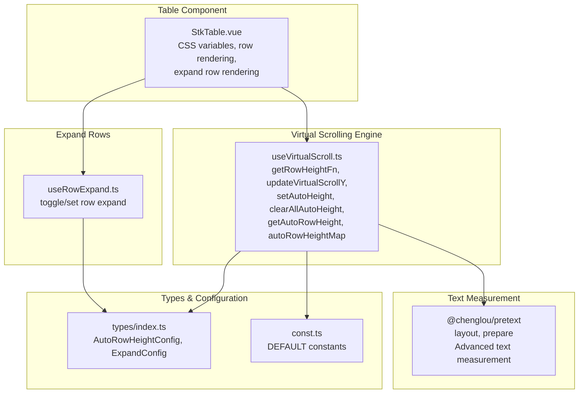
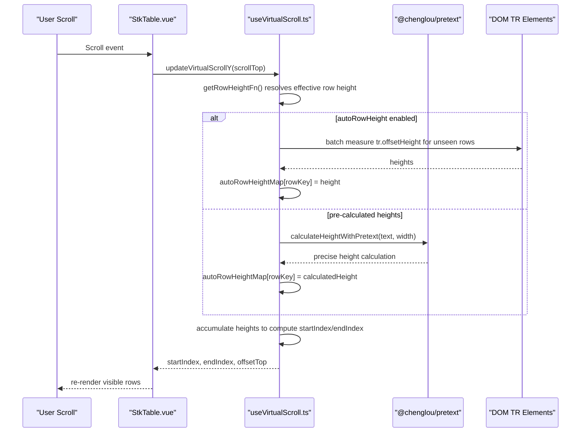
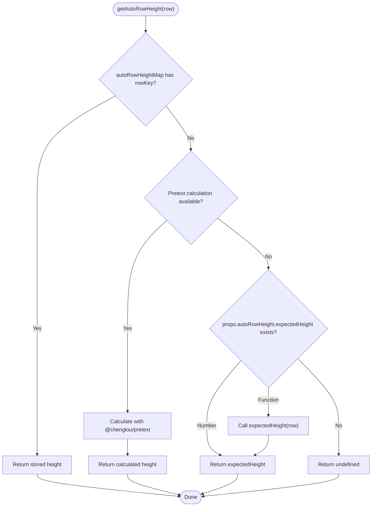
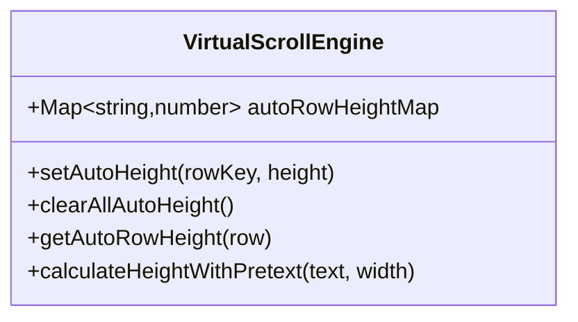
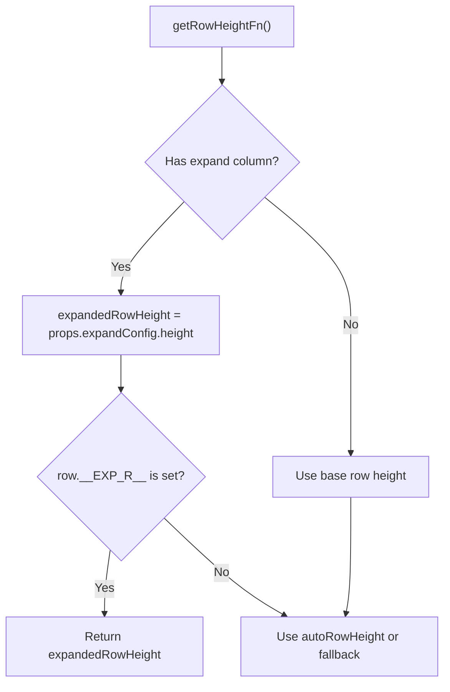
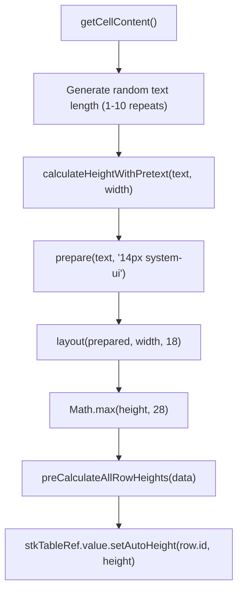
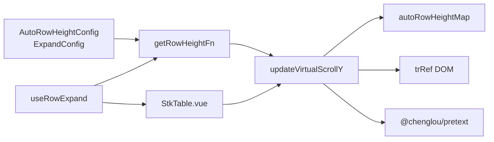

# Auto Row Height Support

<cite>
**Referenced Files in This Document**
- [useVirtualScroll.ts](file://src/StkTable/useVirtualScroll.ts)
- [types/index.ts](file://src/StkTable/types/index.ts)
- [const.ts](file://src/StkTable/const.ts)
- [StkTable.vue](file://src/StkTable/StkTable.vue)
- [useRowExpand.ts](file://src/StkTable/useRowExpand.ts)
- [auto-height-virtual.md](file://docs-src/main/table/advanced/auto-height-virtual.md)
- [AutoHeightVirtual/index.vue](file://docs-demo/advanced/auto-height-virtual/AutoHeightVirtual/index.vue)
- [AutoRowHeight.vue](file://test/AutoRowHeight.vue)
- [VirtualY.vue](file://docs-demo/advanced/virtual/VirtualY.vue)
- [package.json](file://package.json)
</cite>

## Update Summary
**Changes Made**
- Enhanced AutoRowHeight.vue test component with @chenglou/pretext library integration for advanced text measurement capabilities
- Added new dependency for improved auto-row height calculation with dynamic text content generation
- Updated pre-calculation mechanisms for better performance in dynamic content scenarios
- Improved text measurement algorithms for more accurate row height calculations

## Table of Contents
1. [Introduction](#introduction)
2. [Project Structure](#project-structure)
3. [Core Components](#core-components)
4. [Architecture Overview](#architecture-overview)
5. [Detailed Component Analysis](#detailed-component-analysis)
6. [Enhanced Text Measurement with Pretext](#enhanced-text-measurement-with-pretext)
7. [Dependency Analysis](#dependency-analysis)
8. [Performance Considerations](#performance-considerations)
9. [Troubleshooting Guide](#troubleshooting-guide)
10. [Conclusion](#conroduction)
11. [Appendices](#appendices)

## Introduction
This document explains auto row height support in virtual scrolling with enhanced text measurement capabilities. It covers how the autoRowHeight configuration works, how row heights are dynamically calculated and cached, and how the system integrates with expandable rows. The document now includes advanced text measurement techniques using the @chenglou/pretext library for more accurate row height calculations in dynamic content scenarios.

## Project Structure
Auto row height support spans several modules with enhanced text measurement capabilities:
- Virtual scrolling engine that computes visible rows and offsets
- Types that define configuration shapes
- Table component wiring for rendering and CSS variables
- Expandable row integration for expanded row height management
- Demo and test files showcasing usage and edge cases with advanced text measurement
- @chenglou/pretext library integration for precise text layout calculations

**Diagram sources**
- [useVirtualScroll.ts:177-270](file://src/StkTable/useVirtualScroll.ts#L177-L270)
- [types/index.ts:243-278](file://src/StkTable/types/index.ts#L243-L278)
- [const.ts:6-8](file://src/StkTable/const.ts#L6-L8)
- [StkTable.vue:31-38](file://src/StkTable/StkTable.vue#L31-L38)
- [useRowExpand.ts:33-88](file://src/StkTable/useRowExpand.ts#L33-L88)
- [AutoRowHeight.vue:2-2](file://test/AutoRowHeight.vue#L2-L2)

**Section sources**
- [useVirtualScroll.ts:177-270](file://src/StkTable/useVirtualScroll.ts#L177-L270)
- [types/index.ts:243-278](file://src/StkTable/types/index.ts#L243-L278)
- [const.ts:6-8](file://src/StkTable/const.ts#L6-L8)
- [StkTable.vue:31-38](file://src/StkTable/StkTable.vue#L31-L38)
- [useRowExpand.ts:33-88](file://src/StkTable/useRowExpand.ts#L33-L88)
- [AutoRowHeight.vue:2-2](file://test/AutoRowHeight.vue#L2-L2)

## Core Components
- Auto row height configuration and expected height estimation
- Dynamic height retrieval and caching via a Map keyed by row keys
- Virtual scrolling integration to compute indices and offsets with variable heights
- Expanded row height override when expandable rows are present
- Public APIs to manage cached heights
- Advanced text measurement with @chenglou/pretext for precise calculations

Key responsibilities:
- Compute effective row height per row using stored or expected values
- Measure DOM heights during scroll updates and cache them
- Adjust virtual indices and offsets when encountering variable heights
- Respect expanded row height overrides for expanded rows
- Utilize advanced text measurement libraries for accurate content sizing

**Section sources**
- [useVirtualScroll.ts:177-270](file://src/StkTable/useVirtualScroll.ts#L177-L270)
- [useVirtualScroll.ts:240-270](file://src/StkTable/useVirtualScroll.ts#L240-L270)
- [types/index.ts:275-278](file://src/StkTable/types/index.ts#L275-L278)
- [types/index.ts:243-247](file://src/StkTable/types/index.ts#L243-L247)
- [AutoRowHeight.vue:28-41](file://test/AutoRowHeight.vue#L28-L41)

## Architecture Overview
The auto row height pipeline integrates configuration, caching, virtual scrolling, and advanced text measurement:

**Diagram sources**
- [useVirtualScroll.ts:273-324](file://src/StkTable/useVirtualScroll.ts#L273-L324)
- [useVirtualScroll.ts:292-300](file://src/StkTable/useVirtualScroll.ts#L292-L300)
- [AutoRowHeight.vue:28-41](file://test/AutoRowHeight.vue#L28-L41)

**Section sources**
- [useVirtualScroll.ts:273-324](file://src/StkTable/useVirtualScroll.ts#L273-L324)
- [useVirtualScroll.ts:292-300](file://src/StkTable/useVirtualScroll.ts#L292-L300)
- [AutoRowHeight.vue:28-41](file://test/AutoRowHeight.vue#L28-L41)

## Detailed Component Analysis

### Auto Row Height Configuration and Resolution
- Configuration shape: boolean or an object with expectedHeight (number or function(row))
- Effective row height resolution:
  - Prefer stored height from autoRowHeightMap if available
  - Use pre-calculated heights from @chenglou/pretext when available
  - Otherwise, use expectedHeight from configuration (number or function)
  - Fallback to props.rowHeight if nothing else applies

**Diagram sources**
- [useVirtualScroll.ts:255-270](file://src/StkTable/useVirtualScroll.ts#L255-L270)
- [types/index.ts:275-278](file://src/StkTable/types/index.ts#L275-L278)
- [AutoRowHeight.vue:28-32](file://test/AutoRowHeight.vue#L28-L32)

**Section sources**
- [useVirtualScroll.ts:255-270](file://src/StkTable/useVirtualScroll.ts#L255-L270)
- [types/index.ts:275-278](file://src/StkTable/types/index.ts#L275-L278)
- [AutoRowHeight.vue:28-32](file://test/AutoRowHeight.vue#L28-L32)

### Auto Height Storage Mechanism (autoRowHeightMap)
- Internal Map keyed by stringified row key
- Populated during scroll updates when measuring DOM heights
- Supports pre-calculated heights from @chenglou/pretext library
- Provides O(1) lookup for previously measured or calculated rows
- Supports clearing all entries or updating a single row's height

**Diagram sources**
- [useVirtualScroll.ts:240-253](file://src/StkTable/useVirtualScroll.ts#L240-L253)
- [useVirtualScroll.ts:255-270](file://src/StkTable/useVirtualScroll.ts#L255-L270)
- [AutoRowHeight.vue:28-41](file://test/AutoRowHeight.vue#L28-L41)

**Section sources**
- [useVirtualScroll.ts:240-253](file://src/StkTable/useVirtualScroll.ts#L240-L253)
- [useVirtualScroll.ts:255-270](file://src/StkTable/useVirtualScroll.ts#L255-L270)
- [AutoRowHeight.vue:28-41](file://test/AutoRowHeight.vue#L28-L41)

### Managing Dynamic Heights: setAutoHeight and clearAllAutoHeight
- setAutoHeight(rowKey, height):
  - If height is falsy, remove the entry
  - Otherwise, set the entry (supports both DOM measurements and @chenglou/pretext calculations)
- clearAllAutoHeight():
  - Clear the entire cache

These APIs allow manual invalidation or correction of cached heights when content changes.

**Section sources**
- [useVirtualScroll.ts:242-253](file://src/StkTable/useVirtualScroll.ts#L242-L253)

### Integrating with Expandable Rows and expandConfig.height
- When an expandable column exists, expanded rows render in place and require a dedicated height
- expandConfig.height controls the height of expanded rows
- The effective row height function prioritizes expanded row height when a row is expanded

**Diagram sources**
- [useVirtualScroll.ts:183-187](file://src/StkTable/useVirtualScroll.ts#L183-L187)
- [types/index.ts:243-247](file://src/StkTable/types/index.ts#L243-L247)

**Section sources**
- [useVirtualScroll.ts:183-187](file://src/StkTable/useVirtualScroll.ts#L183-L187)
- [types/index.ts:243-247](file://src/StkTable/types/index.ts#L243-L247)

### Rendering and CSS Variables
- The table sets CSS variables for row height and header row height
- When autoRowHeight is enabled, the explicit row height variable is not set, allowing dynamic heights to take effect
- Expanded rows can override row height via inline style when virtual mode is active

**Section sources**
- [StkTable.vue:31-38](file://src/StkTable/StkTable.vue#L31-L38)
- [StkTable.vue:119-125](file://src/StkTable/StkTable.vue#L119-L125)

## Enhanced Text Measurement with Pretext

### @chenglou/pretext Library Integration
The AutoRowHeight.vue test component demonstrates advanced text measurement capabilities using the @chenglou/pretext library:

- **Layout Calculation**: Uses `prepare()` and `layout()` functions for precise text measurement
- **Dynamic Content Generation**: Creates realistic test content with randomized text lengths
- **Pre-calculation Mechanisms**: Calculates heights before rendering for smoother scrolling experience
- **Advanced Typography**: Handles complex text layouts with proper font metrics

### Implementation Details
The test component showcases:

**Diagram sources**
- [AutoRowHeight.vue:22-41](file://test/AutoRowHeight.vue#L22-L41)

**Section sources**
- [AutoRowHeight.vue:2-2](file://test/AutoRowHeight.vue#L2-L2)
- [AutoRowHeight.vue:18-41](file://test/AutoRowHeight.vue#L18-L41)
- [package.json](file://package.json#L44)

### Benefits of Pretext Integration
- **Accurate Measurements**: Provides pixel-perfect text height calculations
- **Performance Optimization**: Enables pre-calculation to reduce runtime measurements
- **Complex Layout Support**: Handles multi-line text, wrapping, and various font configurations
- **Consistent Results**: Eliminates browser-specific text measurement variations

## Dependency Analysis
- Virtual scrolling depends on:
  - Configuration: autoRowHeight, rowHeight, expandConfig.height
  - Utilities: rowKeyGen, maxRowSpan corrections
  - DOM: trRef for batch measurement
  - @chenglou/pretext: Advanced text measurement capabilities
- Expandable rows depend on:
  - Private row markers (__EXP__, __EXP_R__, __EXP_C__)
  - expandConfig.height to override row height for expanded rows

**Diagram sources**
- [useVirtualScroll.ts:177-270](file://src/StkTable/useVirtualScroll.ts#L177-L270)
- [useRowExpand.ts:64-72](file://src/StkTable/useRowExpand.ts#L64-L72)
- [StkTable.vue:119-125](file://src/StkTable/StkTable.vue#L119-L125)
- [AutoRowHeight.vue:2-2](file://test/AutoRowHeight.vue#L2-L2)

**Section sources**
- [useVirtualScroll.ts:177-270](file://src/StkTable/useVirtualScroll.ts#L177-L270)
- [useRowExpand.ts:64-72](file://src/StkTable/useRowExpand.ts#L64-L72)
- [StkTable.vue:119-125](file://src/StkTable/StkTable.vue#L119-L125)
- [AutoRowHeight.vue:2-2](file://test/AutoRowHeight.vue#L2-L2)

## Performance Considerations
- Measurement batching:
  - During scroll updates, the engine measures DOM heights for all visible TR elements in a single pass and caches them
  - This minimizes layout thrashing and improves responsiveness
- Cache-first strategy:
  - Stored heights are used immediately when available, avoiding repeated measurements
  - @chenglou/pretext-calculated heights are cached for future use
- Expected height fallback:
  - A sensible expectedHeight reduces the number of DOM measurements needed
- Pre-calculation optimization:
  - @chenglou/pretext allows pre-computation of heights before rendering
  - Reduces runtime measurement overhead during scrolling
- Expanded row overhead:
  - Expanded rows increase total height computation; keep expanded content lightweight
- Vue 2 scroll optimization:
  - Downward scroll updates are deferred to reduce churn in older browsers
- Recommendations:
  - Provide a good expectedHeight to minimize DOM reads
  - Use @chenglou/pretext for complex text layouts requiring precise measurements
  - Implement pre-calculation for large datasets with dynamic content
  - Keep rowKey stable across renders
  - Avoid excessive DOM reads; rely on automatic measurement during scroll updates

## Troubleshooting Guide
- Symptom: Incorrect visible range or jumping while scrolling
  - Cause: Mismatch between expected height and actual height
  - Fix: Increase expectedHeight or allow more measurements by scrolling slowly
- Symptom: Expanded rows overlap or clip
  - Cause: Expanded content height not accounted for
  - Fix: Set expandConfig.height to match expanded content height
- Symptom: Performance degrades with many variable-height rows
  - Cause: Excessive DOM measurements
  - Fix: Provide a reliable expectedHeight; use @chenglou/pretext for pre-calculation; avoid unnecessary re-renders; ensure rowKey stability
- Symptom: Cache holds stale heights after content changes
  - Fix: Call clearAllAutoHeight() or setAutoHeight(rowKey, null) to invalidate cache
- Symptom: @chenglou/pretext not working
  - Cause: Missing dependency or incorrect import
  - Fix: Ensure @chenglou/pretext is installed and properly imported

**Section sources**
- [useVirtualScroll.ts:242-253](file://src/StkTable/useVirtualScroll.ts#L242-L253)
- [useVirtualScroll.ts:292-300](file://src/StkTable/useVirtualScroll.ts#L292-L300)
- [types/index.ts:243-247](file://src/StkTable/types/index.ts#L243-L247)
- [AutoRowHeight.vue:2-2](file://test/AutoRowHeight.vue#L2-L2)

## Conclusion
Auto row height in virtual scrolling balances accuracy and performance by combining a cache of measured heights with an expected height fallback. The integration with @chenglou/pretext enhances text measurement precision for dynamic content scenarios. The system integrates smoothly with expandable rows and provides explicit APIs to maintain and correct cached heights. By setting appropriate configuration and following best practices, you can achieve responsive, smooth scrolling with dynamic content while leveraging advanced text measurement capabilities.

## Appendices

### API Reference Summary
- autoRowHeight: boolean | { expectedHeight?: number | ((row) => number) }
- expandConfig: { height?: number }
- Methods:
  - setAutoHeight(rowKey, height?)
  - clearAllAutoHeight()
  - getAutoRowHeight(row?)
  - calculateHeightWithPretext(text, width)

### Enhanced Text Measurement Functions
- `calculateHeightWithPretext(text: string, width: number): number`
  - Uses @chenglou/pretext for precise text measurement
  - Returns minimum height of 28 pixels
  - Handles complex text layouts with proper font metrics

**Section sources**
- [types/index.ts:243-278](file://src/StkTable/types/index.ts#L243-L278)
- [useVirtualScroll.ts:242-270](file://src/StkTable/useVirtualScroll.ts#L242-L270)
- [AutoRowHeight.vue:28-32](file://test/AutoRowHeight.vue#L28-L32)