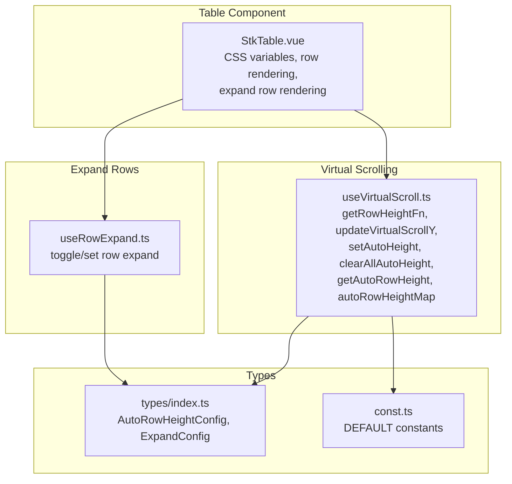
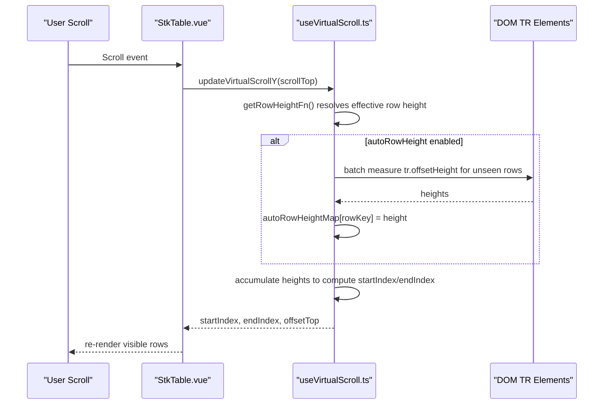
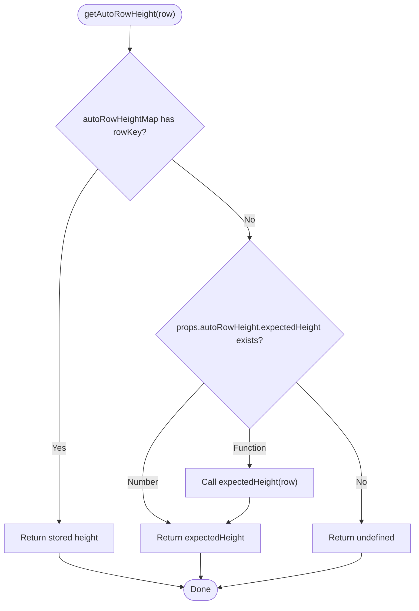
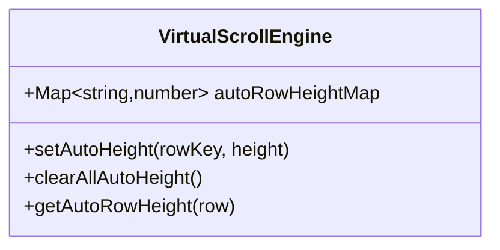
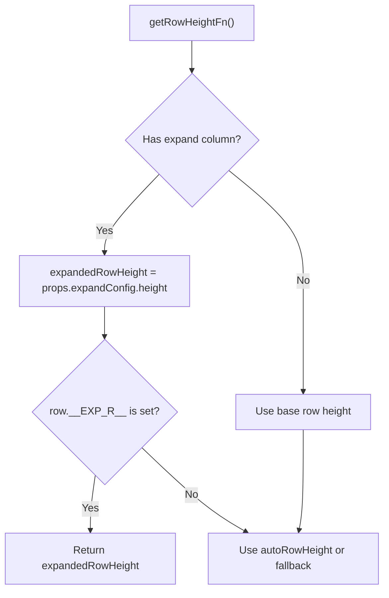
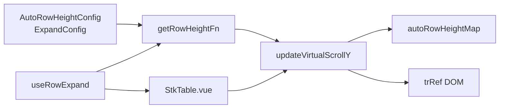

# Auto Row Height Support

<cite>
**Referenced Files in This Document**
- [useVirtualScroll.ts](file://src/StkTable/useVirtualScroll.ts)
- [types.ts](file://src/StkTable/types/index.ts)
- [const.ts](file://src/StkTable/const.ts)
- [StkTable.vue](file://src/StkTable/StkTable.vue)
- [useRowExpand.ts](file://src/StkTable/useRowExpand.ts)
- [auto-height-virtual.md](file://docs-src/main/table/advanced/auto-height-virtual.md)
- [AutoHeightVirtual/index.vue](file://docs-demo/advanced/auto-height-virtual/AutoHeightVirtual/index.vue)
- [AutoRowHeight.vue](file://test/AutoRowHeight.vue)
- [VirtualY.vue](file://docs-demo/advanced/virtual/VirtualY.vue)
</cite>

## Table of Contents
1. [Introduction](#introduction)
2. [Project Structure](#project-structure)
3. [Core Components](#core-components)
4. [Architecture Overview](#architecture-overview)
5. [Detailed Component Analysis](#detailed-component-analysis)
6. [Dependency Analysis](#dependency-analysis)
7. [Performance Considerations](#performance-considerations)
8. [Troubleshooting Guide](#troubleshooting-guide)
9. [Conclusion](#conroduction)
10. [Appendices](#appendices)

## Introduction
This document explains auto row height support in virtual scrolling. It covers how the autoRowHeight configuration works, how row heights are dynamically calculated and cached, and how the system integrates with expandable rows. It also documents the APIs for managing dynamic heights and provides performance guidance and best practices for smooth scrolling with variable row heights.

## Project Structure
Auto row height support spans several modules:
- Virtual scrolling engine that computes visible rows and offsets
- Types that define configuration shapes
- Table component wiring for rendering and CSS variables
- Expandable row integration for expanded row height management
- Demo and test files showcasing usage and edge cases

**Diagram sources**
- [useVirtualScroll.ts](file://src/StkTable/useVirtualScroll.ts#L177-L270)
- [types/index.ts](file://src/StkTable/types/index.ts#L243-L278)
- [const.ts](file://src/StkTable/const.ts#L6-L8)
- [StkTable.vue](file://src/StkTable/StkTable.vue#L31-L38)
- [useRowExpand.ts](file://src/StkTable/useRowExpand.ts#L33-L88)

**Section sources**
- [useVirtualScroll.ts](file://src/StkTable/useVirtualScroll.ts#L177-L270)
- [types/index.ts](file://src/StkTable/types/index.ts#L243-L278)
- [const.ts](file://src/StkTable/const.ts#L6-L8)
- [StkTable.vue](file://src/StkTable/StkTable.vue#L31-L38)
- [useRowExpand.ts](file://src/StkTable/useRowExpand.ts#L33-L88)

## Core Components
- Auto row height configuration and expected height estimation
- Dynamic height retrieval and caching via a Map keyed by row keys
- Virtual scrolling integration to compute indices and offsets with variable heights
- Expanded row height override when expandable rows are present
- Public APIs to manage cached heights

Key responsibilities:
- Compute effective row height per row using stored or expected values
- Measure DOM heights during scroll updates and cache them
- Adjust virtual indices and offsets when encountering variable heights
- Respect expanded row height overrides for expanded rows

**Section sources**
- [useVirtualScroll.ts](file://src/StkTable/useVirtualScroll.ts#L177-L270)
- [useVirtualScroll.ts](file://src/StkTable/useVirtualScroll.ts#L240-L270)
- [types/index.ts](file://src/StkTable/types/index.ts#L275-L278)
- [types/index.ts](file://src/StkTable/types/index.ts#L243-L247)

## Architecture Overview
The auto row height pipeline integrates configuration, caching, and virtual scrolling:

**Diagram sources**
- [useVirtualScroll.ts](file://src/StkTable/useVirtualScroll.ts#L273-L324)
- [useVirtualScroll.ts](file://src/StkTable/useVirtualScroll.ts#L292-L300)

**Section sources**
- [useVirtualScroll.ts](file://src/StkTable/useVirtualScroll.ts#L273-L324)
- [useVirtualScroll.ts](file://src/StkTable/useVirtualScroll.ts#L292-L300)

## Detailed Component Analysis

### Auto Row Height Configuration and Resolution
- Configuration shape: boolean or an object with expectedHeight (number or function(row))
- Effective row height resolution:
  - Prefer stored height from autoRowHeightMap if available
  - Otherwise, use expectedHeight from configuration (number or function)
  - Fallback to props.rowHeight if nothing else applies

**Diagram sources**
- [useVirtualScroll.ts](file://src/StkTable/useVirtualScroll.ts#L255-L270)
- [types/index.ts](file://src/StkTable/types/index.ts#L275-L278)

**Section sources**
- [useVirtualScroll.ts](file://src/StkTable/useVirtualScroll.ts#L255-L270)
- [types/index.ts](file://src/StkTable/types/index.ts#L275-L278)

### Auto Height Storage Mechanism (autoRowHeightMap)
- Internal Map keyed by stringified row key
- Populated during scroll updates when measuring DOM heights
- Provides O(1) lookup for previously measured rows
- Supports clearing all entries or updating a single row’s height

**Diagram sources**
- [useVirtualScroll.ts](file://src/StkTable/useVirtualScroll.ts#L240-L253)
- [useVirtualScroll.ts](file://src/StkTable/useVirtualScroll.ts#L255-L270)

**Section sources**
- [useVirtualScroll.ts](file://src/StkTable/useVirtualScroll.ts#L240-L253)
- [useVirtualScroll.ts](file://src/StkTable/useVirtualScroll.ts#L255-L270)

### Managing Dynamic Heights: setAutoHeight and clearAllAutoHeight
- setAutoHeight(rowKey, height):
  - If height is falsy, remove the entry
  - Otherwise, set the entry
- clearAllAutoHeight():
  - Clear the entire cache

These APIs allow manual invalidation or correction of cached heights when content changes.

**Section sources**
- [useVirtualScroll.ts](file://src/StkTable/useVirtualScroll.ts#L242-L253)

### Integrating with Expandable Rows and expandConfig.height
- When an expandable column exists, expanded rows render in place and require a dedicated height
- expandConfig.height controls the height of expanded rows
- The effective row height function prioritizes expanded row height when a row is expanded

**Diagram sources**
- [useVirtualScroll.ts](file://src/StkTable/useVirtualScroll.ts#L183-L187)
- [types/index.ts](file://src/StkTable/types/index.ts#L243-L247)

**Section sources**
- [useVirtualScroll.ts](file://src/StkTable/useVirtualScroll.ts#L183-L187)
- [types/index.ts](file://src/StkTable/types/index.ts#L243-L247)

### Rendering and CSS Variables
- The table sets CSS variables for row height and header row height
- When autoRowHeight is enabled, the explicit row height variable is not set, allowing dynamic heights to take effect
- Expanded rows can override row height via inline style when virtual mode is active

**Section sources**
- [StkTable.vue](file://src/StkTable/StkTable.vue#L31-L38)
- [StkTable.vue](file://src/StkTable/StkTable.vue#L119-L125)

### Examples and Best Practices
- Enable auto row height with a numeric expected height for calculation
- Use a function for expectedHeight when row height depends on content
- Keep rowKey stable to maximize cache hits
- Prefer CSS padding variables for consistent cell padding across rows
- Avoid excessive DOM reads; rely on automatic measurement during scroll updates

Examples:
- Basic auto height virtual table demo
- Custom cell height demo with variable row heights
- Large dataset virtual scrolling demo

**Section sources**
- [auto-height-virtual.md](file://docs-src/main/table/advanced/auto-height-virtual.md#L1-L38)
- [AutoHeightVirtual/index.vue](file://docs-demo/advanced/auto-height-virtual/AutoHeightVirtual/index.vue#L24-L35)
- [AutoRowHeight.vue](file://test/AutoRowHeight.vue#L32-L42)
- [VirtualY.vue](file://docs-demo/advanced/virtual/VirtualY.vue#L31-L33)

## Dependency Analysis
- Virtual scrolling depends on:
  - Configuration: autoRowHeight, rowHeight, expandConfig.height
  - Utilities: rowKeyGen, maxRowSpan corrections
  - DOM: trRef for batch measurement
- Expandable rows depend on:
  - Private row markers (__EXP__, __EXP_R__, __EXP_C__)
  - expandConfig.height to override row height for expanded rows

**Diagram sources**
- [useVirtualScroll.ts](file://src/StkTable/useVirtualScroll.ts#L177-L270)
- [useRowExpand.ts](file://src/StkTable/useRowExpand.ts#L64-L72)
- [StkTable.vue](file://src/StkTable/StkTable.vue#L119-L125)

**Section sources**
- [useVirtualScroll.ts](file://src/StkTable/useVirtualScroll.ts#L177-L270)
- [useRowExpand.ts](file://src/StkTable/useRowExpand.ts#L64-L72)
- [StkTable.vue](file://src/StkTable/StkTable.vue#L119-L125)

## Performance Considerations
- Measurement batching:
  - During scroll updates, the engine measures DOM heights for all visible TR elements in a single pass and caches them
  - This minimizes layout thrashing and improves responsiveness
- Cache-first strategy:
  - Stored heights are used immediately when available, avoiding repeated measurements
- Expected height fallback:
  - A sensible expectedHeight reduces the number of DOM measurements needed
- Expanded row overhead:
  - Expanded rows increase total height computation; keep expanded content lightweight
- Vue 2 scroll optimization:
  - Downward scroll updates are deferred to reduce churn in older browsers
- Recommendations:
  - Provide a good expectedHeight to minimize DOM reads
  - Keep rowKey stable across renders
  - Avoid frequent reflows; prefer CSS variables for paddings and margins
  - Limit heavy computations inside custom cells

[No sources needed since this section provides general guidance]

## Troubleshooting Guide
- Symptom: Incorrect visible range or jumping while scrolling
  - Cause: Mismatch between expected height and actual height
  - Fix: Increase expectedHeight or allow more measurements by scrolling slowly
- Symptom: Expanded rows overlap or clip
  - Cause: Expanded content height not accounted for
  - Fix: Set expandConfig.height to match expanded content height
- Symptom: Performance degrades with many variable-height rows
  - Cause: Excessive DOM measurements
  - Fix: Provide a reliable expectedHeight; avoid unnecessary re-renders; ensure rowKey stability
- Symptom: Cache holds stale heights after content changes
  - Fix: Call clearAllAutoHeight() or setAutoHeight(rowKey, null) to invalidate cache

**Section sources**
- [useVirtualScroll.ts](file://src/StkTable/useVirtualScroll.ts#L242-L253)
- [useVirtualScroll.ts](file://src/StkTable/useVirtualScroll.ts#L292-L300)
- [types/index.ts](file://src/StkTable/types/index.ts#L243-L247)

## Conclusion
Auto row height in virtual scrolling balances accuracy and performance by combining a cache of measured heights with an expected height fallback. The system integrates smoothly with expandable rows and provides explicit APIs to maintain and correct cached heights. By setting appropriate configuration and following best practices, you can achieve responsive, smooth scrolling with dynamic content.

[No sources needed since this section summarizes without analyzing specific files]

## Appendices

### API Reference Summary
- autoRowHeight: boolean | { expectedHeight?: number | ((row) => number) }
- expandConfig: { height?: number }
- Methods:
  - setAutoHeight(rowKey, height?)
  - clearAllAutoHeight()
  - getAutoRowHeight(row?)

**Section sources**
- [types/index.ts](file://src/StkTable/types/index.ts#L243-L278)
- [useVirtualScroll.ts](file://src/StkTable/useVirtualScroll.ts#L242-L270)