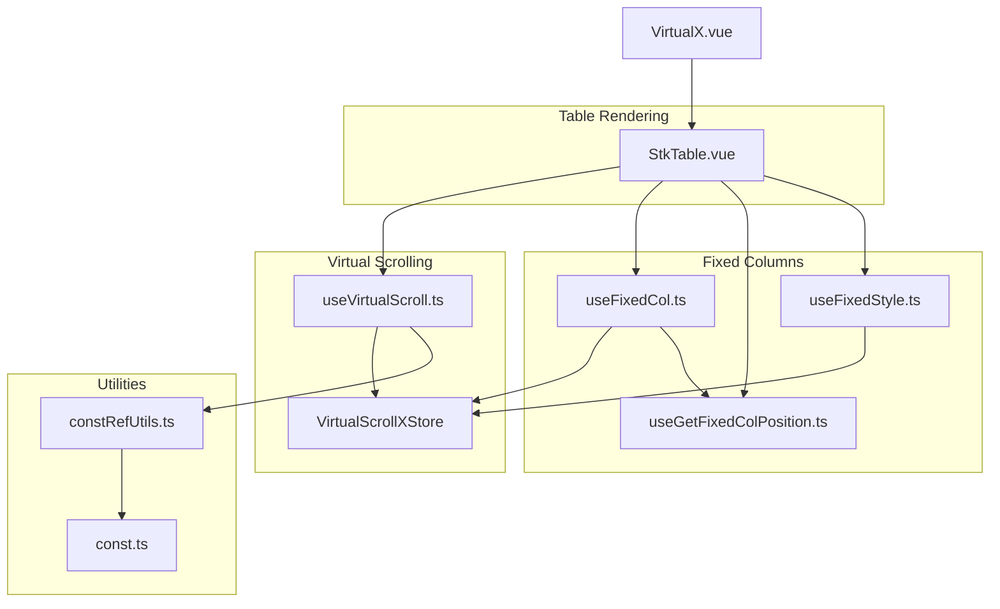
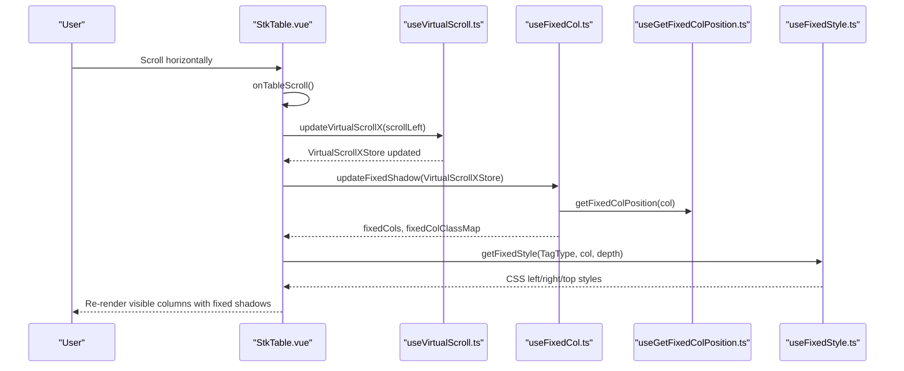
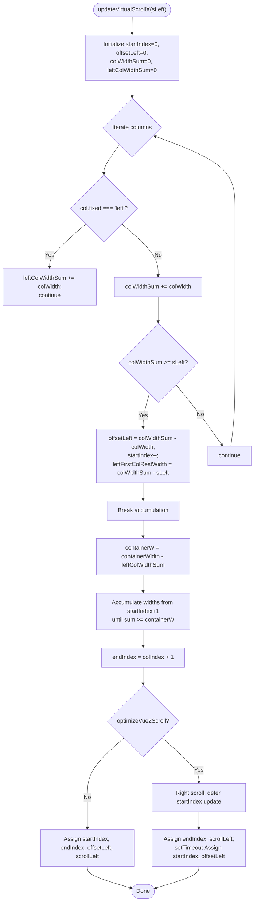
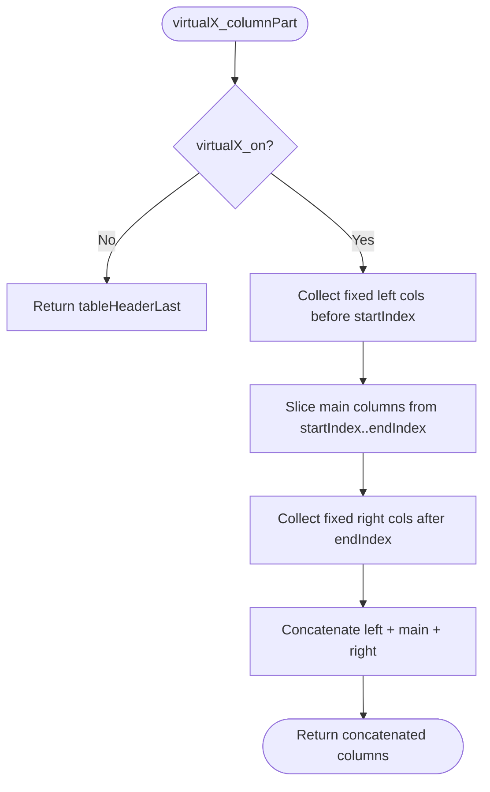
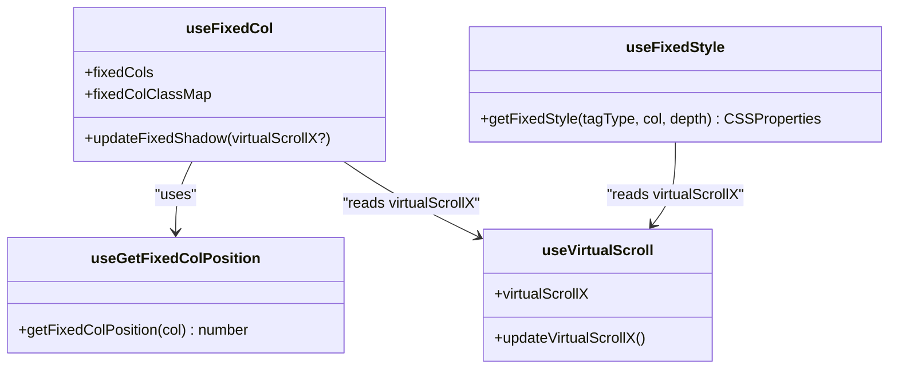
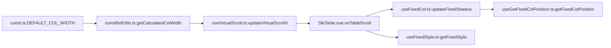

# Horizontal Virtual Scrolling

<cite>
**Referenced Files in This Document**
- [useVirtualScroll.ts](file://src/StkTable/useVirtualScroll.ts)
- [StkTable.vue](file://src/StkTable/StkTable.vue)
- [useFixedCol.ts](file://src/StkTable/useFixedCol.ts)
- [useGetFixedColPosition.ts](file://src/StkTable/useGetFixedColPosition.ts)
- [useFixedStyle.ts](file://src/StkTable/useFixedStyle.ts)
- [constRefUtils.ts](file://src/StkTable/utils/constRefUtils.ts)
- [const.ts](file://src/StkTable/const.ts)
- [VirtualX.vue](file://docs-demo/advanced/virtual/VirtualX.vue)
</cite>

## Table of Contents
1. [Introduction](#introduction)
2. [Project Structure](#project-structure)
3. [Core Components](#core-components)
4. [Architecture Overview](#architecture-overview)
5. [Detailed Component Analysis](#detailed-component-analysis)
6. [Dependency Analysis](#dependency-analysis)
7. [Performance Considerations](#performance-considerations)
8. [Troubleshooting Guide](#troubleshooting-guide)
9. [Conclusion](#conclusion)

## Introduction
This document explains the horizontal virtual scrolling implementation in Stk Table Vue. It focuses on the VirtualScrollXStore data structure, the X-axis scrolling algorithm, column virtualization logic (including fixed left/right columns), and practical guidance for enabling horizontal virtual scrolling on wide tables.

## Project Structure
The horizontal virtual scrolling feature spans several modules:
- useVirtualScroll.ts: Implements both vertical and horizontal virtual scrolling stores and algorithms
- StkTable.vue: Integrates virtual scrolling into the table rendering pipeline and reacts to scroll events
- useFixedCol.ts, useGetFixedColPosition.ts, useFixedStyle.ts: Manage fixed columns and their positions during horizontal virtual scrolling
- constRefUtils.ts and const.ts: Provide constants and helpers for column width calculations
- VirtualX.vue: Demonstrates enabling horizontal virtual scrolling on a wide dataset

**Diagram sources**
- [StkTable.vue](file://src/StkTable/StkTable.vue#L1-L200)
- [useVirtualScroll.ts](file://src/StkTable/useVirtualScroll.ts#L1-L120)
- [useFixedCol.ts](file://src/StkTable/useFixedCol.ts#L1-L60)
- [useGetFixedColPosition.ts](file://src/StkTable/useGetFixedColPosition.ts#L1-L40)
- [useFixedStyle.ts](file://src/StkTable/useFixedStyle.ts#L1-L40)
- [constRefUtils.ts](file://src/StkTable/utils/constRefUtils.ts#L1-L30)
- [const.ts](file://src/StkTable/const.ts#L1-L30)
- [VirtualX.vue](file://docs-demo/advanced/virtual/VirtualX.vue#L1-L29)

**Section sources**
- [StkTable.vue](file://src/StkTable/StkTable.vue#L1-L200)
- [useVirtualScroll.ts](file://src/StkTable/useVirtualScroll.ts#L1-L120)
- [VirtualX.vue](file://docs-demo/advanced/virtual/VirtualX.vue#L1-L29)

## Core Components
- VirtualScrollXStore: Holds horizontal virtual scrolling state and metrics
- updateVirtualScrollX: Computes visible columns and offsets based on scrollLeft and containerWidth
- Fixed column utilities: Position calculation, shadow updates, and styles during horizontal virtual scrolling
- Column width utilities: Consistent width retrieval and defaults

Key responsibilities:
- Track containerWidth, scrollWidth, startIndex, endIndex, offsetLeft, scrollLeft
- Compute visible columns while preserving fixed left/right columns
- Update fixed column shadows and positions during horizontal scroll
- Provide offsetRight for proper table layout when virtualized

**Section sources**
- [useVirtualScroll.ts](file://src/StkTable/useVirtualScroll.ts#L37-L50)
- [useVirtualScroll.ts](file://src/StkTable/useVirtualScroll.ts#L413-L477)
- [useFixedCol.ts](file://src/StkTable/useFixedCol.ts#L90-L145)
- [useGetFixedColPosition.ts](file://src/StkTable/useGetFixedColPosition.ts#L15-L62)
- [useFixedStyle.ts](file://src/StkTable/useFixedStyle.ts#L34-L72)
- [constRefUtils.ts](file://src/StkTable/utils/constRefUtils.ts#L9-L20)

## Architecture Overview
The horizontal virtual scrolling pipeline integrates with the main table rendering loop. On scroll events, the system computes visible columns and offsets, updates fixed column positions, and re-renders only the visible portion of the table.

**Diagram sources**
- [StkTable.vue](file://src/StkTable/StkTable.vue#L1467-L1501)
- [useVirtualScroll.ts](file://src/StkTable/useVirtualScroll.ts#L413-L477)
- [useFixedCol.ts](file://src/StkTable/useFixedCol.ts#L90-L145)
- [useGetFixedColPosition.ts](file://src/StkTable/useGetFixedColPosition.ts#L15-L62)
- [useFixedStyle.ts](file://src/StkTable/useFixedStyle.ts#L34-L72)

## Detailed Component Analysis

### VirtualScrollXStore Data Structure
VirtualScrollXStore encapsulates all horizontal virtual scrolling state:
- containerWidth: Width of the visible viewport
- scrollWidth: Total width of the table content
- startIndex: First visible column index
- endIndex: Last visible column index
- offsetLeft: Left offset to align the visible columns
- scrollLeft: Current horizontal scroll position

These fields drive the rendering of visible columns and the positioning of fixed columns.

**Section sources**
- [useVirtualScroll.ts](file://src/StkTable/useVirtualScroll.ts#L37-L50)

### X-Axis Scrolling Algorithm
The algorithm computes visible columns and offsets based on scrollLeft and containerWidth:
- Iterate columns to accumulate non-fixed column widths until reaching or exceeding scrollLeft
- Determine startIndex and offsetLeft accordingly
- Compute containerW as containerWidth minus accumulated fixed left widths
- Continue accumulating widths to determine endIndex such that the sum fits within containerW
- Apply Vue 2 optimization: defer startIndex updates for rightward scrolls to reduce re-renders

**Diagram sources**
- [useVirtualScroll.ts](file://src/StkTable/useVirtualScroll.ts#L413-L477)

**Section sources**
- [useVirtualScroll.ts](file://src/StkTable/useVirtualScroll.ts#L413-L477)

### Column Virtualization Logic (Fixed Left/Right Preserved)
During horizontal virtualization:
- Fixed left columns are extracted from the invisible region before startIndex and prepended to the visible columns
- Fixed right columns are extracted from the invisible region after endIndex and appended to the visible columns
- Middle columns are sliced from startIndex to endIndex
- This ensures fixed columns remain visible regardless of horizontal scroll position

**Diagram sources**
- [useVirtualScroll.ts](file://src/StkTable/useVirtualScroll.ts#L133-L162)

**Section sources**
- [useVirtualScroll.ts](file://src/StkTable/useVirtualScroll.ts#L133-L162)

### startIndex and endIndex Calculation
- startIndex: Index where the first visible non-fixed column begins
- endIndex: Index after the last visible non-fixed column
- Calculation accounts for fixed left widths and containerW (containerWidth minus fixed left widths)
- Ensures that the visible region fits within the viewport width

Edge cases handled:
- When columns are removed, endIndex may exceed array bounds; the code clamps endIndex to array length
- Fixed column widths are excluded from width accumulation for non-fixed columns

**Section sources**
- [useVirtualScroll.ts](file://src/StkTable/useVirtualScroll.ts#L413-L477)

### offsetLeft Calculation
offsetLeft represents the left offset required to align the visible columns:
- Accumulated widths of columns prior to startIndex (excluding fixed left columns)
- Used to position the visible region and to adjust fixed column positions in relative mode

**Section sources**
- [useVirtualScroll.ts](file://src/StkTable/useVirtualScroll.ts#L413-L477)

### scrollWidth Management
scrollWidth tracks the total content width:
- Initialized from the container’s scrollWidth
- Used alongside containerWidth to determine visibility thresholds
- Helps compute offsetRight for right-fixed columns

**Section sources**
- [useVirtualScroll.ts](file://src/StkTable/useVirtualScroll.ts#L230-L235)
- [useVirtualScroll.ts](file://src/StkTable/useVirtualScroll.ts#L413-L477)

### Fixed Column Positioning During Horizontal Virtual Scrolling
Fixed columns rely on:
- getFixedColPosition: Computes cumulative widths to the left/right of each fixed column
- updateFixedShadow: Determines which fixed columns should display shadows based on scrollLeft and containerWidth
- getFixedStyle: Applies left/right/top styles depending on fixed mode and virtualization state

**Diagram sources**
- [useGetFixedColPosition.ts](file://src/StkTable/useGetFixedColPosition.ts#L15-L62)
- [useFixedCol.ts](file://src/StkTable/useFixedCol.ts#L90-L145)
- [useFixedStyle.ts](file://src/StkTable/useFixedStyle.ts#L34-L72)
- [useVirtualScroll.ts](file://src/StkTable/useVirtualScroll.ts#L83-L92)

**Section sources**
- [useGetFixedColPosition.ts](file://src/StkTable/useGetFixedColPosition.ts#L15-L62)
- [useFixedCol.ts](file://src/StkTable/useFixedCol.ts#L90-L145)
- [useFixedStyle.ts](file://src/StkTable/useFixedStyle.ts#L34-L72)

### Enabling Horizontal Virtual Scrolling
To enable horizontal virtual scrolling:
- Set virtualX to true on the table
- Ensure each column has a width (width or minWidth) configured
- Provide sufficient data to exceed the container width threshold

Example usage is demonstrated in the VirtualX demo.

**Section sources**
- [VirtualX.vue](file://docs-demo/advanced/virtual/VirtualX.vue#L1-L29)
- [useVirtualScroll.ts](file://src/StkTable/useVirtualScroll.ts#L126-L131)

## Dependency Analysis
Horizontal virtual scrolling depends on:
- Column width utilities for consistent width retrieval
- Fixed column utilities for positioning and shadows
- Table container scroll events for updates
- Computed visibility flags to gate virtualization logic

**Diagram sources**
- [constRefUtils.ts](file://src/StkTable/utils/constRefUtils.ts#L9-L20)
- [const.ts](file://src/StkTable/const.ts#L4-L8)
- [useVirtualScroll.ts](file://src/StkTable/useVirtualScroll.ts#L413-L477)
- [StkTable.vue](file://src/StkTable/StkTable.vue#L1467-L1501)
- [useFixedCol.ts](file://src/StkTable/useFixedCol.ts#L90-L145)
- [useGetFixedColPosition.ts](file://src/StkTable/useGetFixedColPosition.ts#L15-L62)
- [useFixedStyle.ts](file://src/StkTable/useFixedStyle.ts#L34-L72)

**Section sources**
- [constRefUtils.ts](file://src/StkTable/utils/constRefUtils.ts#L9-L20)
- [const.ts](file://src/StkTable/const.ts#L4-L8)
- [useVirtualScroll.ts](file://src/StkTable/useVirtualScroll.ts#L413-L477)
- [StkTable.vue](file://src/StkTable/StkTable.vue#L1467-L1501)
- [useFixedCol.ts](file://src/StkTable/useFixedCol.ts#L90-L145)
- [useGetFixedColPosition.ts](file://src/StkTable/useGetFixedColPosition.ts#L15-L62)
- [useFixedStyle.ts](file://src/StkTable/useFixedStyle.ts#L34-L72)

## Performance Considerations
- Prefer setting explicit widths on columns to avoid layout thrashing
- Use optimizeVue2Scroll to defer startIndex updates during rapid rightward scrolls
- Limit the number of fixed columns to reduce shadow computation overhead
- Avoid multi-level headers with virtualX; the implementation does not support multi-level headers with horizontal virtualization
- Keep the number of visible columns reasonable to minimize DOM nodes rendered at once

[No sources needed since this section provides general guidance]

## Troubleshooting Guide
Common issues and resolutions:
- Fixed columns not visible: Ensure fixed columns have widths and that virtualX_on is active
- White gaps on the right: Verify virtualX_offsetRight is applied to the right placeholder column
- Incorrect fixed shadows: Confirm updateFixedShadow is invoked with the latest virtualScrollX
- Multi-level headers with virtualX: Avoid using multi-level headers with horizontal virtualization as it is unsupported

**Section sources**
- [useVirtualScroll.ts](file://src/StkTable/useVirtualScroll.ts#L126-L131)
- [useFixedCol.ts](file://src/StkTable/useFixedCol.ts#L90-L145)
- [StkTable.vue](file://src/StkTable/StkTable.vue#L61-L100)

## Conclusion
Stk Table Vue’s horizontal virtual scrolling efficiently renders wide tables by computing visible columns, preserving fixed columns, and managing offsets. By configuring column widths and enabling virtualX, you can achieve smooth performance with large datasets. Use the provided utilities and examples as a foundation for building responsive, high-performance horizontal scrolling experiences.