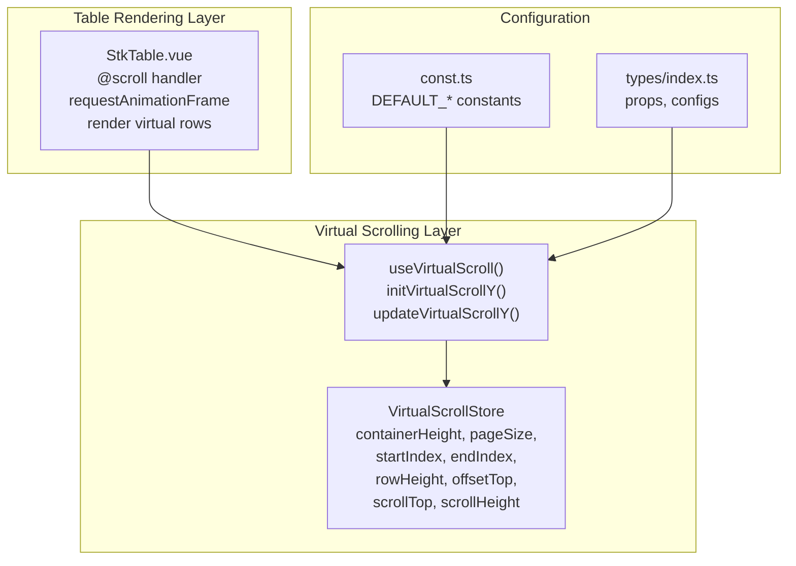
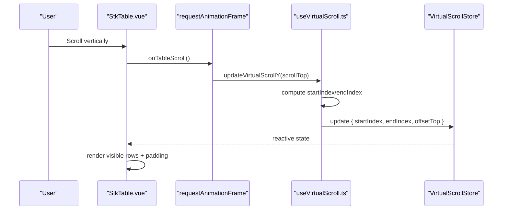
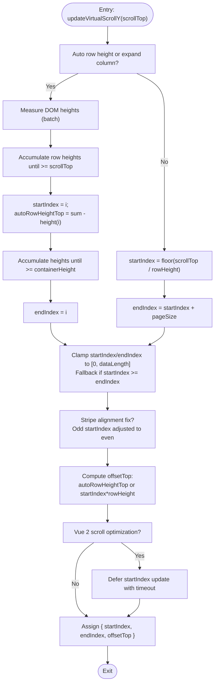
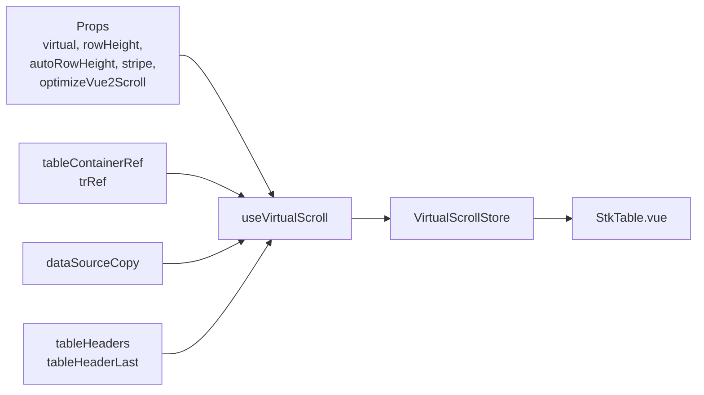

# Vertical Virtual Scrolling

<cite>
**Referenced Files in This Document**
- [useVirtualScroll.ts](file://src/StkTable/useVirtualScroll.ts)
- [StkTable.vue](file://src/StkTable/StkTable.vue)
- [const.ts](file://src/StkTable/const.ts)
- [index.ts](file://src/StkTable/types/index.ts)
- [virtual.md](file://docs-src/main/table/advanced/virtual.md)
- [vue2-scroll-optimize.md](file://docs-src/main/table/advanced/vue2-scroll-optimize.md)
- [VirtualY.vue](file://docs-demo/advanced/virtual/VirtualY.vue)
- [AutoHeightVirtual/index.vue](file://docs-demo/advanced/auto-height-virtual/AutoHeightVirtual/index.vue)
- [HugeData/index.vue](file://docs-demo/demos/HugeData/index.vue)
</cite>

## Table of Contents
1. [Introduction](#introduction)
2. [Project Structure](#project-structure)
3. [Core Components](#core-components)
4. [Architecture Overview](#architecture-overview)
5. [Detailed Component Analysis](#detailed-component-analysis)
6. [Dependency Analysis](#dependency-analysis)
7. [Performance Considerations](#performance-considerations)
8. [Troubleshooting Guide](#troubleshooting-guide)
9. [Conclusion](#conclusion)
10. [Appendices](#appendices)

## Introduction
This document explains the vertical virtual scrolling implementation in Stk Table Vue. It focuses on the VirtualScrollStore data structure, the Y-axis scrolling algorithm, page size calculation, startIndex/endIndex computation for fixed and auto row heights, offsetTop positioning, scrollHeight management, and performance optimizations including Vue 2 scroll delay handling and stripe pattern compatibility. Practical configuration examples and best practices for large datasets are included.

## Project Structure
The vertical virtual scrolling is implemented in a composable hook and consumed by the main table component. Key files:
- Virtual scrolling logic: useVirtualScroll.ts
- Table integration and rendering: StkTable.vue
- Defaults and constants: const.ts
- Types and configurations: types/index.ts
- Documentation examples and guides: docs-demo and docs-src

**Diagram sources**
- [useVirtualScroll.ts](file://src/StkTable/useVirtualScroll.ts#L18-L50)
- [StkTable.vue](file://src/StkTable/StkTable.vue#L1467-L1501)
- [const.ts](file://src/StkTable/const.ts#L6-L8)
- [index.ts](file://src/StkTable/types/index.ts#L55-L120)

**Section sources**
- [useVirtualScroll.ts](file://src/StkTable/useVirtualScroll.ts#L1-L120)
- [StkTable.vue](file://src/StkTable/StkTable.vue#L1-L120)
- [const.ts](file://src/StkTable/const.ts#L1-L51)
- [index.ts](file://src/StkTable/types/index.ts#L1-L120)

## Core Components
- VirtualScrollStore: central state for vertical virtual scrolling, including containerHeight, pageSize, startIndex, endIndex, rowHeight, offsetTop, scrollTop, scrollHeight.
- useVirtualScroll hook: computes and updates virtual scrolling state based on scroll position and viewport.
- StkTable.vue: binds scroll events, renders only visible rows, and applies offsets.

Key responsibilities:
- Compute visible row range from scrollTop and containerHeight.
- Manage offsetTop for accurate table positioning.
- Track scrollHeight for scrollbars and boundary detection.
- Optimize Vue 2 diff behavior during fast downward scrolls.
- Respect stripe pattern alignment to avoid visual misalignment.

**Section sources**
- [useVirtualScroll.ts](file://src/StkTable/useVirtualScroll.ts#L18-L50)
- [StkTable.vue](file://src/StkTable/StkTable.vue#L1467-L1501)

## Architecture Overview
The vertical virtual scrolling pipeline:
- User scrolls inside the table container.
- Table captures scroll events and delegates to requestAnimationFrame.
- The hook computes new startIndex/endIndex and offsetTop.
- The table re-renders only the visible subset of rows with appropriate padding.

**Diagram sources**
- [StkTable.vue](file://src/StkTable/StkTable.vue#L1467-L1501)
- [useVirtualScroll.ts](file://src/StkTable/useVirtualScroll.ts#L272-L406)

## Detailed Component Analysis

### VirtualScrollStore Data Structure
VirtualScrollStore holds the runtime state for vertical virtual scrolling:
- containerHeight: viewport height of the table container.
- pageSize: number of rows to render per page.
- startIndex, endIndex: indices of the first and last visible rows.
- rowHeight: effective row height used for calculations.
- offsetTop: top padding to align the visible block with scroll position.
- scrollTop: last recorded vertical scroll position.
- scrollHeight: total scrollable height for scrollbar thumb sizing.

These fields are initialized and updated by initVirtualScrollY and updateVirtualScrollY.

**Section sources**
- [useVirtualScroll.ts](file://src/StkTable/useVirtualScroll.ts#L18-L50)
- [useVirtualScroll.ts](file://src/StkTable/useVirtualScroll.ts#L72-L81)

### Page Size Calculation
Page size determines how many rows fit in the viewport:
- Base calculation: floor(containerHeight / rowHeight).
- Adjust for table headers: subtract the number of header rows that occupy body row-height units.
- Enforced minimum: at least 1 row per page.

The header adjustment accounts for multi-level headers by converting header height into equivalent body row counts.

**Section sources**
- [useVirtualScroll.ts](file://src/StkTable/useVirtualScroll.ts#L204-L228)
- [useVirtualScroll.ts](file://src/StkTable/useVirtualScroll.ts#L70-L70)

### Y-Axis Scrolling Algorithm
The algorithm computes the visible row range from scrollTop and containerHeight:
- Fixed row height: startIndex = floor(scrollTop / rowHeight), endIndex = startIndex + pageSize.
- Auto row height: iterate rows accumulating actual heights until reaching scrollTop (startIndex), then accumulate until containerHeight is filled (endIndex).
- OffsetTop:
  - Fixed row height: startIndex * rowHeight.
  - Auto row height: sum of row heights up to startIndex.
- Boundary checks: clamp startIndex and endIndex to [0, dataLength], fallback to startIndex = endIndex - pageSize if invalid.

**Diagram sources**
- [useVirtualScroll.ts](file://src/StkTable/useVirtualScroll.ts#L272-L406)

**Section sources**
- [useVirtualScroll.ts](file://src/StkTable/useVirtualScroll.ts#L272-L406)

### startIndex/endIndex Computation Methods
- Fixed row height:
  - startIndex = floor(scrollTop / rowHeight)
  - endIndex = startIndex + pageSize
- Auto row height:
  - startIndex: iterate cumulative heights until reaching scrollTop.
  - endIndex: continue accumulating until containerHeight is filled.
- Stripe compatibility:
  - If stripe is enabled and startIndex > 0 and odd, decrement startIndex by 1 and adjust autoRowHeightTop accordingly to keep stripe alignment.

**Section sources**
- [useVirtualScroll.ts](file://src/StkTable/useVirtualScroll.ts#L287-L368)

### offsetTop Calculation
- Fixed row height: offsetTop = startIndex * rowHeight.
- Auto row height: offsetTop = sum of heights from row 0 to startIndex.
- Optimization: skip recomputing offsetTop if startIndex/endIndex unchanged in fixed mode.

**Section sources**
- [useVirtualScroll.ts](file://src/StkTable/useVirtualScroll.ts#L382-L391)

### scrollHeight Management
- scrollHeight is initialized from the container’s scrollHeight and stored in VirtualScrollStore.
- It drives scrollbar thumb sizing and boundary detection for wheel events and custom scrollbar dragging.
- The table emits scroll events with startIndex/endIndex for external observers.

**Section sources**
- [useVirtualScroll.ts](file://src/StkTable/useVirtualScroll.ts#L209-L227)
- [StkTable.vue](file://src/StkTable/StkTable.vue#L1467-L1501)

### Vue 2 Scroll Delay Handling
To mitigate excessive DOM diffs in Vue 2 during fast downward scrolls:
- Defer updating startIndex until a short timeout, while immediately updating endIndex.
- If the scroll delta exceeds one page or direction changes, apply immediately without delay.

This keeps upward and downward perceived smoothness balanced.

**Section sources**
- [useVirtualScroll.ts](file://src/StkTable/useVirtualScroll.ts#L378-L405)
- [vue2-scroll-optimize.md](file://docs-src/main/table/advanced/vue2-scroll-optimize.md#L1-L26)

### Stripe Pattern Compatibility
- When stripe is enabled, the algorithm ensures startIndex is even to avoid misaligned alternating row backgrounds.
- If startIndex was odd, it is decremented to the previous even index, and autoRowHeightTop is adjusted accordingly.

**Section sources**
- [useVirtualScroll.ts](file://src/StkTable/useVirtualScroll.ts#L361-L368)

### Integration in StkTable.vue
- The table listens to scroll events and uses requestAnimationFrame to batch updates.
- It renders only virtual_dataSourcePart rows and applies paddingTop/ paddingBottom via offsetTop and virtual_offsetBottom.
- Exposes initVirtualScrollY and scrollTo for manual control.

**Section sources**
- [StkTable.vue](file://src/StkTable/StkTable.vue#L1467-L1501)
- [StkTable.vue](file://src/StkTable/StkTable.vue#L104-L178)
- [StkTable.vue](file://src/StkTable/StkTable.vue#L1631-L1635)

## Dependency Analysis
- useVirtualScroll depends on:
  - props (virtual, rowHeight, autoRowHeight, stripe, optimizeVue2Scroll)
  - tableContainerRef (DOM measurements)
  - trRef (auto row height measurement)
  - dataSourceCopy (data source)
  - tableHeaders and tableHeaderLast (header height and column widths)
  - rowKeyGen and maxRowSpan (for merged rows)
- StkTable.vue composes useVirtualScroll and renders virtualized rows.

**Diagram sources**
- [useVirtualScroll.ts](file://src/StkTable/useVirtualScroll.ts#L60-L69)
- [StkTable.vue](file://src/StkTable/StkTable.vue#L775-L792)

**Section sources**
- [useVirtualScroll.ts](file://src/StkTable/useVirtualScroll.ts#L60-L69)
- [StkTable.vue](file://src/StkTable/StkTable.vue#L775-L792)

## Performance Considerations
- Prefer fixed rowHeight for large datasets to avoid repeated DOM measurements.
- Use autoRowHeight only when necessary; batch measurements via trRef are performed when autoRowHeight is enabled.
- Enable optimizeVue2Scroll for Vue 2 environments to reduce DOM churn during fast downward scrolls.
- Keep table height fixed to avoid frequent initVirtualScrollY recalculations.
- Use virtual with virtualX for extremely wide tables to limit DOM nodes.

[No sources needed since this section provides general guidance]

## Troubleshooting Guide
Common issues and resolutions:
- White screen on fast wheel: ensure smoothScroll defaults are respected; the table proxies wheel events to prevent overscroll artifacts.
- Incorrect stripe alignment: verify stripe prop is enabled and startIndex is even; the algorithm adjusts odd startIndex automatically.
- Scroll jumps or misalignment: check that rowHeight matches rendered row heights; for autoRowHeight, ensure setAutoHeight is called when dynamic heights change.
- Large dataset lag: confirm virtual is enabled and pageSize is reasonable; consider optimizeVue2Scroll for Vue 2.

**Section sources**
- [StkTable.vue](file://src/StkTable/StkTable.vue#L1417-L1462)
- [useVirtualScroll.ts](file://src/StkTable/useVirtualScroll.ts#L361-L368)
- [useVirtualScroll.ts](file://src/StkTable/useVirtualScroll.ts#L396-L405)

## Conclusion
Stk Table Vue’s vertical virtual scrolling efficiently renders large datasets by computing a precise visible row range, managing offsets, and optimizing for Vue 2 diff behavior. With clear configuration props and robust algorithms for fixed and auto row heights, it balances performance and visual fidelity. Use the provided examples and best practices to enable virtual scrolling safely and effectively.

[No sources needed since this section summarizes without analyzing specific files]

## Appendices

### Configuration Examples and Best Practices
- Enable vertical virtual scrolling with a fixed height container and virtual prop.
- For auto row heights, set rowHeight as an expected value and rely on measured heights; call setAutoHeight when dynamic heights change.
- For Vue 2, enable optimizeVue2Scroll to improve scroll smoothness.
- Combine virtual with virtualX for very large datasets spanning many columns.

Examples:
- Basic vertical virtual list: [VirtualY.vue](file://docs-demo/advanced/virtual/VirtualY.vue#L1-L34)
- Auto row height with virtual: [AutoHeightVirtual/index.vue](file://docs-demo/advanced/auto-height-virtual/AutoHeightVirtual/index.vue#L1-L42)
- Large dataset demo with virtual and stripe: [HugeData/index.vue](file://docs-demo/demos/HugeData/index.vue#L270-L293)

Documentation references:
- Virtual scrolling props and methods: [virtual.md](file://docs-src/main/table/advanced/virtual.md#L1-L70)
- Vue 2 scroll optimization: [vue2-scroll-optimize.md](file://docs-src/main/table/advanced/vue2-scroll-optimize.md#L1-L26)

**Section sources**
- [VirtualY.vue](file://docs-demo/advanced/virtual/VirtualY.vue#L1-L34)
- [AutoHeightVirtual/index.vue](file://docs-demo/advanced/auto-height-virtual/AutoHeightVirtual/index.vue#L1-L42)
- [HugeData/index.vue](file://docs-demo/demos/HugeData/index.vue#L270-L293)
- [virtual.md](file://docs-src/main/table/advanced/virtual.md#L1-L70)
- [vue2-scroll-optimize.md](file://docs-src/main/table/advanced/vue2-scroll-optimize.md#L1-L26)