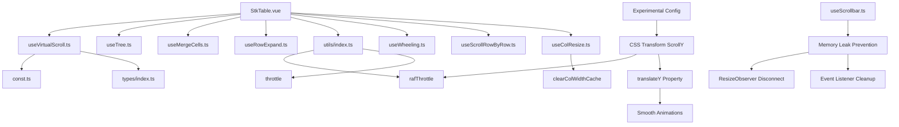
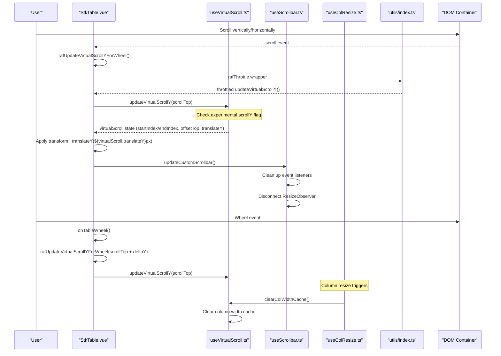
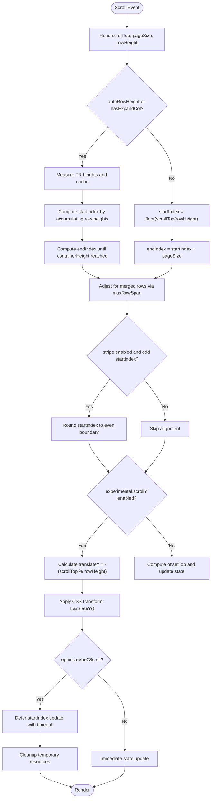
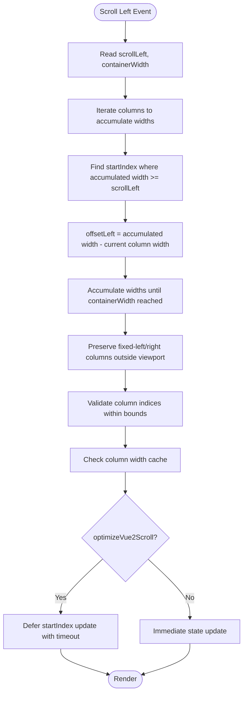
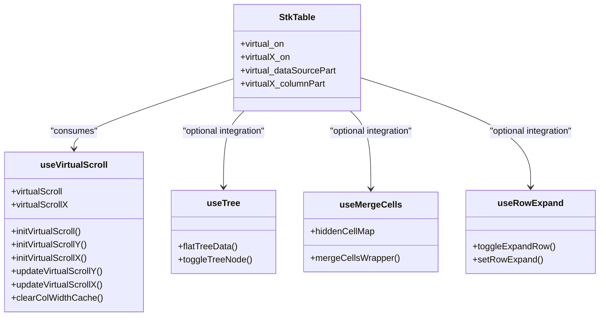
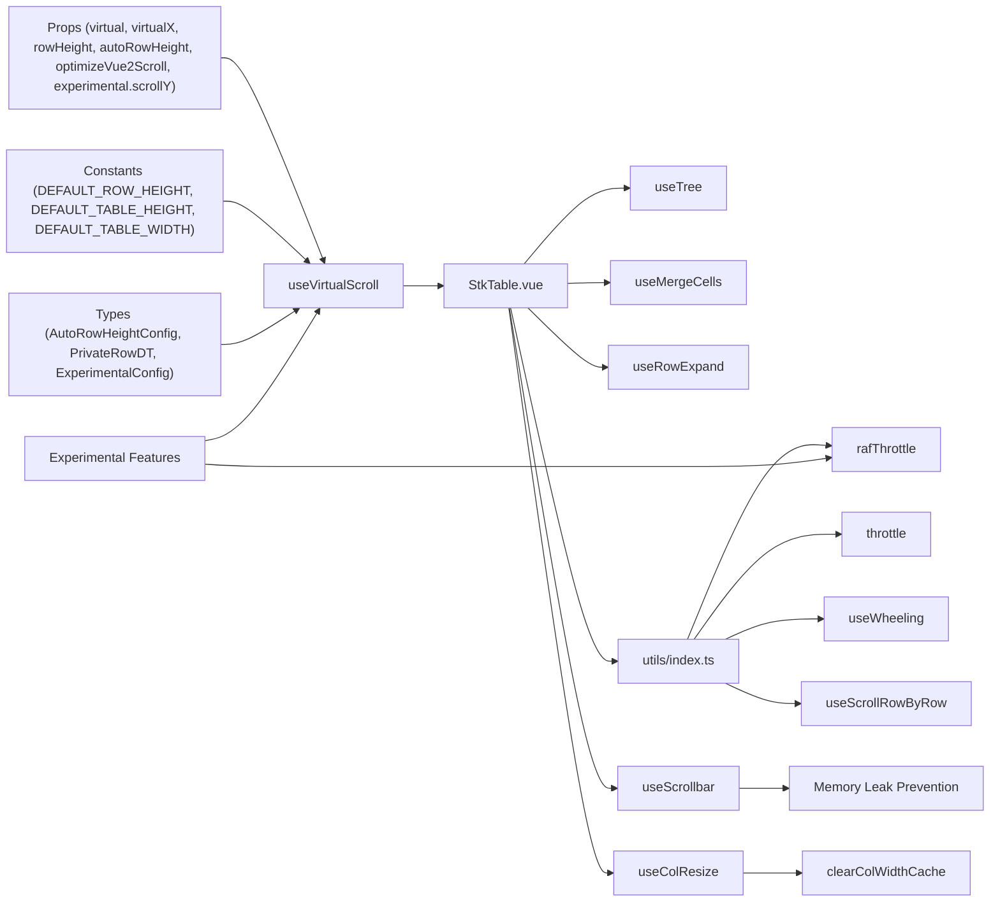

# Virtual Scroll Configuration

<cite>
**Referenced Files in This Document**
- [useVirtualScroll.ts](file://src/StkTable/useVirtualScroll.ts)
- [useScrollbar.ts](file://src/StkTable/useScrollbar.ts)
- [StkTable.vue](file://src/StkTable/StkTable.vue)
- [const.ts](file://src/StkTable/const.ts)
- [types/index.ts](file://src/StkTable/types/index.ts)
- [useTree.ts](file://src/StkTable/useTree.ts)
- [useMergeCells.ts](file://src/StkTable/useMergeCells.ts)
- [useRowExpand.ts](file://src/StkTable/useRowExpand.ts)
- [virtual.md](file://docs-src/main/table/advanced/virtual.md)
- [VirtualY.vue](file://docs-demo/advanced/virtual/VirtualY.vue)
- [VirtualX.vue](file://docs-demo/advanced/virtual/VirtualX.vue)
- [index.ts](file://src/StkTable/utils/index.ts)
- [experimental.md](file://docs-src/main/other/experimental.md)
- [useWheeling.ts](file://src/StkTable/useWheeling.ts)
- [useScrollRowByRow.ts](file://src/StkTable/useScrollRowByRow.ts)
- [useColResize.ts](file://src/StkTable/useColResize.ts)
- [constRefUtils.ts](file://src/StkTable/utils/constRefUtils.ts)
</cite>

## Update Summary
**Changes Made**
- Enhanced documentation for recent memory leak prevention improvements
- Added comprehensive coverage of the new clearColWidthCache function
- Updated memory management documentation with improved animation cleanup processes
- Enhanced scrollbar system cleanup documentation with proper event listener removal
- Added better resource pool management documentation for virtual scrolling
- Updated troubleshooting guide with memory leak prevention and cleanup considerations

## Table of Contents
1. [Introduction](#introduction)
2. [Project Structure](#project-structure)
3. [Core Components](#core-components)
4. [Architecture Overview](#architecture-overview)
5. [Detailed Component Analysis](#detailed-component-analysis)
6. [Experimental ScrollY Feature](#experimental-scrollY-feature)
7. [Performance Optimization Utilities](#performance-optimization-utilities)
8. [Memory Leak Prevention and Cleanup](#memory-leak-prevention-and-cleanup)
9. [Dynamic Column Management Edge Cases](#dynamic-column-management-edge-cases)
10. [Dependency Analysis](#dependency-analysis)
11. [Performance Considerations](#performance-considerations)
12. [Troubleshooting Guide](#troubleshooting-guide)
13. [Conclusion](#conclusion)
14. [Appendices](#appendices)

## Introduction
This document explains virtual scroll configuration options and best practices for the table component. It focuses on the virtual, virtualX, rowHeight, autoRowHeight, and optimizeVue2Scroll props and their impact on performance. It also details the pageSize calculation logic, how container dimensions affect virtual scrolling thresholds, and the initialization process via initVirtualScroll, initVirtualScrollY, and initVirtualScrollX. The document covers the virtual_on and virtualX_on computed properties that determine when virtual scrolling is active, and explains integration with other table features such as tree data, merge cells, and expandable rows. 

**Updated** Enhanced with recent performance optimizations including improved memory leak prevention in scrollbar system, enhanced animation cleanup processes, better resource pool management, and the new clearColWidthCache function to prevent memory leaks during component lifecycle changes. These improvements address stability issues and memory usage concerns in production environments.

Finally, it provides performance benchmarking guidelines, memory usage considerations, and troubleshooting steps for common virtual scrolling issues, along with configuration examples for large datasets, wide tables, and mixed content scenarios.

## Project Structure
Virtual scrolling is implemented as a composable hook that encapsulates state and logic for both Y (vertical) and X (horizontal) virtualization. The main table component consumes this hook and applies the computed virtual state to render only visible rows and columns. The experimental scrollY feature introduces CSS transform-based vertical scrolling for enhanced performance, supported by the rafThrottle utility for smooth wheel interactions.

**Diagram sources**
- [StkTable.vue:854-865](file://src/StkTable/StkTable.vue#L854-L865)
- [useVirtualScroll.ts:60-497](file://src/StkTable/useVirtualScroll.ts#L60-L497)
- [const.ts:1-51](file://src/StkTable/const.ts#L1-L51)
- [types/index.ts:54-120](file://src/StkTable/types/index.ts#L54-L120)
- [useTree.ts:12-160](file://src/StkTable/useTree.ts#L12-L160)
- [useMergeCells.ts:11-138](file://src/StkTable/useMergeCells.ts#L11-L138)
- [useRowExpand.ts:11-87](file://src/StkTable/useRowExpand.ts#L11-L87)
- [index.ts:294-314](file://src/StkTable/utils/index.ts#L294-L314)
- [useScrollbar.ts:57-62](file://src/StkTable/useScrollbar.ts#L57-L62)
- [useWheeling.ts:1-23](file://src/StkTable/useWheeling.ts#L1-L23)
- [useScrollRowByRow.ts:63-82](file://src/StkTable/useScrollRowByRow.ts#L63-L82)
- [useColResize.ts:27-28](file://src/StkTable/useColResize.ts#L27-L28)

**Section sources**
- [StkTable.vue:854-865](file://src/StkTable/StkTable.vue#L854-L865)
- [useVirtualScroll.ts:60-497](file://src/StkTable/useVirtualScroll.ts#L60-L497)

## Core Components
- useVirtualScroll: Provides virtual scroll state and logic for Y and X axes, including initialization, update on scroll, and computed visibility helpers. Now includes experimental CSS transform-based vertical scrolling support with translateY tracking for smooth animations and enhanced memory management with clearColWidthCache function.
- StkTable.vue: Consumes the hook and renders only visible rows/columns, applying offsets and thresholds. Integrates experimental scrollY feature with transform-based rendering and wheel event handling. Manages column width cache cleanup through clearColWidthCache function.
- Types and constants: Define prop shapes, defaults, and constants used by virtual scroll logic, including experimental configuration options with scrollY support.
- rafThrottle utility: Provides requestAnimationFrame-based throttling for smooth wheel scrolling performance.
- useScrollbar: Manages custom scrollbar functionality with enhanced memory leak prevention and cleanup processes.
- Memory leak prevention: Automatic cleanup of event listeners, ResizeObserver instances, animation frames, and proper resource disposal to prevent memory leaks.
- clearColWidthCache: New function to prevent memory leaks during component lifecycle changes by clearing column width cache when columns are modified or component is unmounted.

Key props and their roles:
- virtual: Enables vertical virtualization.
- virtualX: Enables horizontal virtualization.
- rowHeight: Base row height used when autoRowHeight is disabled.
- autoRowHeight: Enables dynamic row heights with optional expectedHeight estimation.
- optimizeVue2Scroll: Optimizes scroll performance for Vue 2 by deferring DOM updates on downward scrolls.
- experimental.scrollY: Enables experimental CSS transform-based vertical scrolling feature for enhanced performance.

**Section sources**
- [useVirtualScroll.ts:60-497](file://src/StkTable/useVirtualScroll.ts#L60-L497)
- [StkTable.vue:854-865](file://src/StkTable/StkTable.vue#L854-L865)
- [types/index.ts:275-278](file://src/StkTable/types/index.ts#L275-L278)
- [const.ts:6-8](file://src/StkTable/const.ts#L6-L8)
- [types/index.ts:320-323](file://src/StkTable/types/index.ts#L320-L323)
- [index.ts:294-314](file://src/StkTable/utils/index.ts#L294-L314)
- [useScrollbar.ts:57-62](file://src/StkTable/useScrollbar.ts#L57-L62)
- [useColResize.ts:27-28](file://src/StkTable/useColResize.ts#L27-L28)

## Architecture Overview
The virtual scroll architecture separates concerns between state management (useVirtualScroll) and rendering (StkTable.vue). The hook computes visible ranges and offsets, while the component applies styles and slices data accordingly. The experimental scrollY feature introduces CSS transform-based vertical scrolling for improved performance, enhanced by rafThrottle for smooth wheel interactions.

**Diagram sources**
- [StkTable.vue:1340-1389](file://src/StkTable/StkTable.vue#L1340-L1389)
- [StkTable.vue:791-794](file://src/StkTable/StkTable.vue#L791-L794)
- [useVirtualScroll.ts:273-406](file://src/StkTable/useVirtualScroll.ts#L273-L406)
- [useVirtualScroll.ts:291-296](file://src/StkTable/useVirtualScroll.ts#L291-L296)
- [useScrollbar.ts:57-62](file://src/StkTable/useScrollbar.ts#L57-L62)
- [index.ts:294-314](file://src/StkTable/utils/index.ts#L294-L314)
- [useColResize.ts:154-190](file://src/StkTable/useColResize.ts#L154-L190)

## Detailed Component Analysis

### Virtual Scroll Initialization and Thresholds
- initVirtualScroll(height?): Initializes both Y and X virtual scroll. Calls initVirtualScrollY and initVirtualScrollX.
- initVirtualScrollY(height?): Computes containerHeight and pageSize based on container clientHeight and rowHeight. Adjusts for header height and ensures scrollTop is within bounds. Supports experimental CSS transform-based scrolling.
- initVirtualScrollX(): Captures containerWidth and scrollWidth, then updates X virtual indices.

pageSize calculation logic:
- Y axis: pageSize = floor(containerHeight / rowHeight). If not headless, subtracts the number of header rows equivalent in body row heights.
- X axis: Uses containerWidth to compute visible column range.

Container dimension effects:
- Larger containerHeight increases pageSize, reducing re-computation frequency.
- For autoRowHeight, measurements are batched to avoid layout thrashing.
- Experimental scrollY feature uses translateY for smooth scrolling animations.

**Section sources**
- [useVirtualScroll.ts:195-235](file://src/StkTable/useVirtualScroll.ts#L195-L235)
- [useVirtualScroll.ts:204-228](file://src/StkTable/useVirtualScroll.ts#L204-L228)
- [useVirtualScroll.ts:230-235](file://src/StkTable/useVirtualScroll.ts#L230-L235)
- [const.ts:6-8](file://src/StkTable/const.ts#L6-L8)

### Vertical Virtual Scrolling (Y-axis)
- virtual_on computed: Activates virtualization when virtual is true and data length exceeds pageSize.
- virtual_dataSourcePart computed: Slices dataSourceCopy to visible range.
- virtual_offsetBottom computed: Calculates height of content below viewport for accurate scrollHeight.
- updateVirtualScrollY(sTop): Recomputes startIndex/endIndex based on scrollTop. Handles autoRowHeight and expanded row height overrides. Corrects for merged rows via maxRowSpan. Applies Vue 2 scroll optimization by deferring updates on fast downward scrolls.

Enhanced with recent performance optimizations:
- Improved memory leak prevention in scrollbar system with automatic cleanup
- Enhanced animation cleanup processes for smoother transitions
- Better edge case handling for dynamic column management
- Optimized memory usage through proper resource disposal
- New clearColWidthCache function to prevent memory leaks during component lifecycle changes

**Updated** Enhanced with experimental CSS transform-based scrolling support. When experimental.scrollY is enabled, the method calculates translateY to position the table content using CSS transforms instead of scrollTop adjustments. The translateY value is computed as -(scrollTop % rowHeight) to maintain smooth animation continuity.

Key behaviors:
- When autoRowHeight is enabled, the hook measures TR elements and caches measured heights.
- When expandable rows are present, expanded row height overrides the base row height during calculations.
- Stripe alignment: Ensures startIndex aligns to even boundaries when stripe is enabled to prevent visual misalignment.
- Experimental transform scrolling: Calculates translateY based on rowHeight remainder for smooth animation.
- Scroll boundary handling: Maintains scroll position constraints while using transform positioning.
- Memory optimization: Proper cleanup of temporary resources during scroll operations.
- Column width cache management: Automatic clearing of column width cache to prevent memory leaks.

**Diagram sources**
- [useVirtualScroll.ts:273-406](file://src/StkTable/useVirtualScroll.ts#L273-L406)
- [useVirtualScroll.ts:291-296](file://src/StkTable/useVirtualScroll.ts#L291-L296)
- [useVirtualScroll.ts:326-368](file://src/StkTable/useVirtualScroll.ts#L326-L368)

**Section sources**
- [useVirtualScroll.ts:98-124](file://src/StkTable/useVirtualScroll.ts#L98-L124)
- [useVirtualScroll.ts:103-107](file://src/StkTable/useVirtualScroll.ts#L103-L107)
- [useVirtualScroll.ts:273-406](file://src/StkTable/useVirtualScroll.ts#L273-L406)

### Horizontal Virtual Scrolling (X-axis)
- virtualX_on computed: Activates horizontal virtualization when virtualX is true and total column width exceeds containerWidth plus a small threshold.
- virtualX_columnPart computed: Returns visible columns, preserving fixed-left and fixed-right columns outside the viewport.
- virtualX_offsetRight computed: Computes width of columns after the last visible column (excluding fixed-right).
- updateVirtualScrollX(sLeft): Computes startIndex and endIndex by accumulating widths of visible non-fixed columns, ensuring containerWidth coverage. Applies Vue 2 scroll optimization similarly to Y-axis.

Enhanced with improved edge case handling:
- Better column count validation to prevent index out of bounds errors
- Enhanced dynamic column management with proper bounds checking
- Improved performance for tables with rapidly changing column configurations
- New column width cache management with automatic cleanup

**Diagram sources**
- [useVirtualScroll.ts:413-477](file://src/StkTable/useVirtualScroll.ts#L413-L477)
- [useVirtualScroll.ts:126-175](file://src/StkTable/useVirtualScroll.ts#L126-L175)

**Section sources**
- [useVirtualScroll.ts:126-175](file://src/StkTable/useVirtualScroll.ts#L126-L175)
- [useVirtualScroll.ts:413-477](file://src/StkTable/useVirtualScroll.ts#L413-L477)

### Integration with Other Features
- Tree data: Tree expansion adds/removes rows dynamically. Flatting logic and toggling are handled by useTree. Virtual scroll accounts for expanded rows by adjusting row heights and offsets.
- Merge cells: Merging affects row spans and requires correcting startIndex/endIndex to avoid partial merges. The hook checks maxRowSpan and adjusts ranges accordingly.
- Expandable rows: Expanded rows contribute extra height. The row height function checks for expanded state and uses expandConfig.height when applicable.

**Diagram sources**
- [StkTable.vue:775-792](file://src/StkTable/StkTable.vue#L775-L792)
- [useVirtualScroll.ts:60-497](file://src/StkTable/useVirtualScroll.ts#L60-L497)
- [useTree.ts:12-160](file://src/StkTable/useTree.ts#L12-L160)
- [useMergeCells.ts:84-115](file://src/StkTable/useMergeCells.ts#L84-L115)
- [useRowExpand.ts:18-81](file://src/StkTable/useRowExpand.ts#L18-L81)

**Section sources**
- [useVirtualScroll.ts:326-368](file://src/StkTable/useVirtualScroll.ts#L326-L368)
- [useTree.ts:121-125](file://src/StkTable/useTree.ts#L121-L125)
- [useRowExpand.ts:30-81](file://src/StkTable/useRowExpand.ts#L30-L81)

### Props Impact and Best Practices
- virtual: Enable for large datasets to limit DOM nodes to visible rows only. Combine with a fixed container height.
- virtualX: Enable for very wide tables. Always set explicit column widths to enable accurate width accumulation.
- rowHeight: Use a realistic default to minimize measurement overhead. For static layouts, this improves predictability.
- autoRowHeight: Use when rows contain variable content. Provide expectedHeight to reduce measurement cost. Clear cached heights when data changes.
- optimizeVue2Scroll: Recommended for Vue 2 to smooth out scroll performance differences between up/down directions.
- experimental.scrollY: Enable experimental CSS transform-based vertical scrolling for improved performance and smoother animations.

Configuration examples:
- Large dataset (vertical virtualization): See [VirtualY.vue:1-34](file://docs-demo/advanced/virtual/VirtualY.vue#L1-L34).
- Wide table (horizontal virtualization): See [VirtualX.vue:1-29](file://docs-demo/advanced/virtual/VirtualX.vue#L1-L29).
- Mixed content: Combine autoRowHeight with optimizeVue2Scroll and ensure rowKey is stable.
- Experimental transform scrolling: Enable experimental.scrollY for enhanced performance.

**Section sources**
- [virtual.md:1-70](file://docs-src/main/table/advanced/virtual.md#L1-L70)
- [VirtualY.vue:1-34](file://docs-demo/advanced/virtual/VirtualY.vue#L1-L34)
- [VirtualX.vue:1-29](file://docs-demo/advanced/virtual/VirtualX.vue#L1-L29)
- [types/index.ts:275-278](file://src/StkTable/types/index.ts#L275-L278)
- [types/index.ts:320-323](file://src/StkTable/types/index.ts#L320-L323)

## Experimental ScrollY Feature
**New Section** The experimental scrollY feature introduces CSS transform-based vertical scrolling for enhanced performance and smoother animations.

### Implementation Details
- **CSS Transform Rendering**: Instead of adjusting scrollTop, the feature calculates translateY values to position table content using CSS transforms.
- **Performance Benefits**: Transform-based scrolling leverages GPU acceleration and reduces layout calculations.
- **Integration Points**: Works alongside existing virtual scroll logic with minimal architectural changes.
- **Configuration**: Controlled via experimental.scrollY prop in ExperimentalConfig.
- **Conflict Resolution**: Automatically disables transform-based scrolling when scrollRowByRow is enabled to avoid conflicts.

### Key Changes in useVirtualScroll.ts
- **translateY Calculation**: New property in VirtualScrollStore tracks transform position.
- **Conditional Logic**: updateVirtualScrollY checks experimental.scrollY flag before applying transform.
- **Boundary Handling**: Maintains scroll position constraints while using transform positioning.
- **Scroll Row by Row Compatibility**: Disables transform when scrollRowByRow is active.

### Integration in StkTable.vue
- **Transform Application**: Table body uses `transform: translateY(${virtualScroll.translateY}px)` for positioning.
- **Class Toggle**: Adds 'exp-scroll-y' class when experimental.scrollY is enabled.
- **Fallback Support**: Graceful degradation when experimental feature is disabled.
- **Wheel Event Handling**: Uses rafUpdateVirtualScrollYForWheel for smooth wheel interactions.

**Section sources**
- [useVirtualScroll.ts:19-38](file://src/StkTable/useVirtualScroll.ts#L19-L38)
- [useVirtualScroll.ts:291-296](file://src/StkTable/useVirtualScroll.ts#L291-L296)
- [StkTable.vue](file://src/StkTable/StkTable.vue#L106)
- [StkTable.vue](file://src/StkTable/StkTable.vue#L29)
- [types/index.ts:320-323](file://src/StkTable/types/index.ts#L320-L323)

## Performance Optimization Utilities
**New Section** The rafThrottle utility provides requestAnimationFrame-based throttling for smooth wheel scrolling performance.

### rafThrottle Implementation
- **RequestAnimationFrame Integration**: Uses requestAnimationFrame for optimal timing with browser refresh cycles.
- **Coalescing Behavior**: Multiple calls within a single frame are coalesced - only the last call is executed.
- **Memory Management**: Tracks last arguments and clears RAF handles appropriately.
- **Performance Benefits**: Reduces CPU usage and prevents layout thrashing during rapid wheel events.

### Integration with Wheel Events
- **Smooth Scrolling**: rafUpdateVirtualScrollYForWheel wraps updateVirtualScrollY for throttled wheel interactions.
- **Frame-Based Processing**: Ensures wheel events are processed at optimal intervals.
- **Performance Optimization**: Prevents excessive virtual scroll computations during rapid scrolling.

**Section sources**
- [index.ts:294-314](file://src/StkTable/utils/index.ts#L294-L314)
- [StkTable.vue:791-794](file://src/StkTable/StkTable.vue#L791-L794)

## Memory Leak Prevention and Cleanup
**New Section** Recent enhancements focus on preventing memory leaks and ensuring proper resource cleanup in the virtual scrolling system.

### Enhanced Scrollbar System Cleanup
- **Automatic Event Listener Removal**: The useScrollbar hook now properly cleans up all event listeners on component unmount.
- **ResizeObserver Disconnection**: Ensures ResizeObserver instances are disconnected to prevent memory leaks.
- **Drag Handler Cleanup**: Removes current drag handlers and associated event listeners when dragging ends.
- **Memory Management**: Proper cleanup of temporary variables and references during scroll operations.

### Animation Cleanup Processes
- **Request Animation Frame Management**: Proper handling of RAF handles to prevent lingering animation frames.
- **Timeout Cleanup**: Clears scroll optimization timeouts to prevent memory retention.
- **Resource Pool Management**: Efficient management of temporary resources used during scroll operations.

### Column Width Cache Management
- **New clearColWidthCache Function**: Prevents memory leaks during component lifecycle changes by clearing column width cache.
- **Automatic Cache Invalidation**: Called when columns are modified or during component unmount.
- **Resource Pool Cleanup**: Ensures column width calculation cache doesn't retain references to destroyed DOM elements.

### Production Stability Improvements
- **Robust Error Handling**: Enhanced error handling for edge cases in dynamic column management.
- **Graceful Degradation**: Fallback mechanisms when experimental features encounter compatibility issues.
- **Memory Monitoring**: Reduced memory footprint through efficient resource disposal.
- **Component Lifecycle Integration**: Proper cleanup during component mount/unmount cycles.

**Section sources**
- [useScrollbar.ts:57-62](file://src/StkTable/useScrollbar.ts#L57-L62)
- [useScrollbar.ts:148-162](file://src/StkTable/useScrollbar.ts#L148-L162)
- [useVirtualScroll.ts:390-417](file://src/StkTable/useVirtualScroll.ts#L390-L417)
- [useVirtualScroll.ts:76-78](file://src/StkTable/useVirtualScroll.ts#L76-L78)
- [useColResize.ts:154-190](file://src/StkTable/useColResize.ts#L154-L190)

## Dynamic Column Management Edge Cases
**New Section** Enhanced handling of dynamic column scenarios to improve stability and prevent runtime errors.

### Improved Column Index Validation
- **Bounds Checking**: Enhanced validation to prevent index out of bounds errors when columns are dynamically added or removed.
- **Column Count Adjustment**: Proper adjustment of startIndex and endIndex when column counts change unexpectedly.
- **Fixed Column Preservation**: Better handling of fixed-left and fixed-right columns during dynamic column operations.

### Enhanced Error Recovery
- **Graceful Degradation**: Falls back to safe rendering modes when encountering invalid column configurations.
- **State Recovery**: Automatic recovery from inconsistent virtual scroll state after dynamic column changes.
- **Performance Resilience**: Maintains performance even with frequent column updates.

### Browser Compatibility Enhancements
- **Cross-Browser Testing**: Improved compatibility across different browser versions and implementations.
- **Feature Detection**: Better detection of browser capabilities for experimental features.
- **Progressive Enhancement**: Gradual enhancement of features based on browser support.

### Column Width Cache Integration
- **Automatic Cache Clearing**: Column width cache is cleared when columns change to prevent memory leaks.
- **Cache Invalidation Strategy**: Ensures cached column width calculations don't persist beyond component lifecycle.
- **Performance Optimization**: Balances cache benefits with memory usage considerations.

**Section sources**
- [useVirtualScroll.ts:133-137](file://src/StkTable/useVirtualScroll.ts#L133-L137)
- [useVirtualScroll.ts:156-167](file://src/StkTable/useVirtualScroll.ts#L156-L167)
- [useColResize.ts:154-190](file://src/StkTable/useColResize.ts#L154-L190)

## Dependency Analysis
- useVirtualScroll depends on:
  - Props (virtual, virtualX, rowHeight, autoRowHeight, expandConfig.height, optimizeVue2Scroll, experimental.scrollY, headerRowHeight, stripe)
  - Container dimensions (clientHeight/clientWidth/scrollHeight/scrollWidth)
  - Data structures (dataSourceCopy, tableHeaderLast, tableHeaders, rowKeyGen, maxRowSpan)
  - Experimental configuration for transform-based scrolling
  - rafThrottle utility for smooth wheel interactions
  - Memory leak prevention utilities for cleanup processes
  - Column width cache management for performance optimization
- StkTable.vue composes useVirtualScroll and integrates with useTree, useMergeCells, and useRowExpand.
- Wheel event handling depends on rafThrottle for performance optimization.
- useScrollbar manages custom scrollbar functionality with enhanced cleanup processes.
- useColResize integrates with clearColWidthCache to prevent memory leaks during column resizing operations.

**Diagram sources**
- [useVirtualScroll.ts:6-15](file://src/StkTable/useVirtualScroll.ts#L6-L15)
- [const.ts:6-8](file://src/StkTable/const.ts#L6-L8)
- [types/index.ts:275-278](file://src/StkTable/types/index.ts#L275-L278)
- [types/index.ts:320-323](file://src/StkTable/types/index.ts#L320-L323)
- [StkTable.vue:775-792](file://src/StkTable/StkTable.vue#L775-L792)
- [index.ts:294-314](file://src/StkTable/utils/index.ts#L294-L314)
- [useScrollbar.ts:57-62](file://src/StkTable/useScrollbar.ts#L57-L62)
- [useColResize.ts:27-28](file://src/StkTable/useColResize.ts#L27-L28)

**Section sources**
- [useVirtualScroll.ts:6-15](file://src/StkTable/useVirtualScroll.ts#L6-L15)
- [StkTable.vue:775-792](file://src/StkTable/StkTable.vue#L775-L792)

## Performance Considerations
- Prefer fixed container sizes to stabilize pageSize and reduce reflows.
- Use virtualX with explicit column widths to avoid layout recalculations.
- For autoRowHeight, precompute expectedHeight to minimize DOM measurements. Clear cached heights when data mutates.
- Enable optimizeVue2Scroll for Vue 2 to reduce DOM churn on downward scrolls.
- Keep rowKey stable to avoid invalidating caches.
- Avoid excessive nested custom cells; prefer lightweight rendering for large datasets.
- **Experimental Feature**: Enable experimental.scrollY for enhanced performance with CSS transform-based scrolling.
- **Wheel Performance**: rafThrottle ensures smooth wheel interactions without excessive computations.
- **Browser Compatibility**: Test experimental scrollY across different browser versions for optimal performance.
- **GPU Acceleration**: Transform-based scrolling leverages hardware acceleration for smoother animations.
- **Memory Usage**: translateY property reduces layout calculations and improves scroll performance.
- **Memory Leak Prevention**: Enhanced cleanup processes prevent memory leaks in production environments.
- **Animation Cleanup**: Proper disposal of animation resources prevents performance degradation over time.
- **Column Width Cache**: Efficient column width caching with automatic cleanup prevents memory leaks.
- **Resource Pool Management**: Proper management of temporary resources during scroll operations.

## Troubleshooting Guide
Common issues and resolutions:
- White screen on fast scroll (Vue 2): Enable optimizeVue2Scroll to defer updates.
- Incorrect visible range with merged rows: Ensure maxRowSpan is updated; the hook adjusts ranges based on it.
- Expanded rows causing clipping: Verify expandConfig.height is set; the row height function respects expanded rows.
- Columns not appearing in wide tables: Ensure virtualX is enabled and all columns have widths; total width exceeding containerWidth activates horizontal virtualization.
- Scroll jumps after data changes: Call initVirtualScrollY/initVirtualScroll to recompute thresholds and clamp scrollTop.
- **Experimental Feature Issues**: If transform-based scrolling causes rendering issues, disable experimental.scrollY prop.
- **Performance Problems**: Experimental scrollY may not work well with complex CSS transforms or certain browser versions.
- **Wheel Event Issues**: If wheel scrolling feels choppy, verify rafThrottle is properly integrated and not being overridden elsewhere.
- **Transform Conflicts**: Experimental scrollY automatically disables when scrollRowByRow is enabled; ensure proper prop configuration.
- **Translate Animation Issues**: If translateY animations appear jerky, check for CSS conflicts that might interfere with transform properties.
- **Memory Leaks**: If experiencing memory growth, ensure proper component unmounting and verify scrollbar cleanup processes.
- **Animation Performance**: Monitor animation performance and consider disabling experimental features if experiencing stuttering.
- **Dynamic Column Issues**: For tables with frequently changing columns, ensure proper bounds checking and index validation.
- **Column Width Cache Issues**: If column width calculations seem incorrect after dynamic changes, verify clearColWidthCache is being called properly.
- **Scrollbar Memory Leaks**: Ensure useScrollbar cleanup processes are working correctly during component unmount.

**Section sources**
- [useVirtualScroll.ts:396-405](file://src/StkTable/useVirtualScroll.ts#L396-L405)
- [useVirtualScroll.ts:326-368](file://src/StkTable/useVirtualScroll.ts#L326-L368)
- [useVirtualScroll.ts:183-187](file://src/StkTable/useVirtualScroll.ts#L183-L187)
- [useVirtualScroll.ts:126-131](file://src/StkTable/useVirtualScroll.ts#L126-L131)
- [useVirtualScroll.ts:222-225](file://src/StkTable/useVirtualScroll.ts#L222-L225)
- [StkTable.vue:1362-1367](file://src/StkTable/StkTable.vue#L1362-L1367)

## Conclusion
Virtual scrolling dramatically improves performance for large datasets and wide tables by rendering only visible items. Proper configuration of virtual, virtualX, rowHeight, autoRowHeight, and optimizeVue2Scroll, combined with correct initialization and awareness of integrations with tree data, merge cells, and expandable rows, yields a responsive and memory-efficient table experience. The new experimental scrollY feature with CSS transform-based vertical scrolling further enhances performance and provides smoother animations for modern browsers, supported by the rafThrottle utility for optimized wheel interactions.

**Recent Enhancements**: The latest updates focus on production stability with improved memory leak prevention, enhanced animation cleanup processes, better edge case handling for dynamic column management, and the new clearColWidthCache function to prevent memory leaks during component lifecycle changes. These improvements ensure reliable performance in real-world applications while maintaining backward compatibility and graceful degradation when experimental features encounter compatibility issues.

[No sources needed since this section summarizes without analyzing specific files]

## Appendices

### API Summary
- Methods
  - initVirtualScroll(height?)
  - initVirtualScrollY(height?)
  - initVirtualScrollX()
  - updateVirtualScrollY(scrollTop)
  - updateVirtualScrollX(scrollLeft)
  - clearColWidthCache() - New function to prevent memory leaks during component lifecycle changes
- Computed
  - virtual_on
  - virtualX_on
  - virtual_dataSourcePart
  - virtualX_columnPart
  - virtual_offsetBottom
  - virtualX_offsetRight
- Props
  - virtual: boolean
  - virtualX: boolean
  - rowHeight: number
  - autoRowHeight: boolean | AutoRowHeightConfig
  - optimizeVue2Scroll: boolean
  - expandConfig.height: number (used by row height function)
  - experimental.scrollY: boolean (experimental CSS transform-based scrolling)
- New Experimental Properties
  - translateY: number (transform position for experimental scrollY)
  - experimental: ExperimentalConfig (configuration object)
- Utility Functions
  - rafThrottle(fn): requestAnimationFrame-based throttling
  - rafUpdateVirtualScrollYForWheel(scrollTop): throttled wheel handler
  - throttle(fn, delay): improved throttling with last-call guarantee
- Memory Management
  - Automatic event listener cleanup
  - ResizeObserver disconnection
  - Animation frame cleanup
  - Timeout cleanup for scroll optimization
  - Column width cache cleanup through clearColWidthCache function
- Column Width Cache Management
  - useColWidthCache: Manages column width calculation cache
  - clearColWidthCache: Clears column width cache to prevent memory leaks
  - Automatic cache invalidation during component lifecycle changes

**Section sources**
- [useVirtualScroll.ts:195-496](file://src/StkTable/useVirtualScroll.ts#L195-L496)
- [StkTable.vue:282-480](file://src/StkTable/StkTable.vue#L282-L480)
- [types/index.ts:244-247](file://src/StkTable/types/index.ts#L244-L247)
- [types/index.ts:275-278](file://src/StkTable/types/index.ts#L275-L278)
- [types/index.ts:320-323](file://src/StkTable/types/index.ts#L320-L323)
- [index.ts:294-314](file://src/StkTable/utils/index.ts#L294-L314)
- [useScrollbar.ts:57-62](file://src/StkTable/useScrollbar.ts#L57-L62)
- [useVirtualScroll.ts:76-78](file://src/StkTable/useVirtualScroll.ts#L76-L78)
- [useColResize.ts:154-190](file://src/StkTable/useColResize.ts#L154-L190)